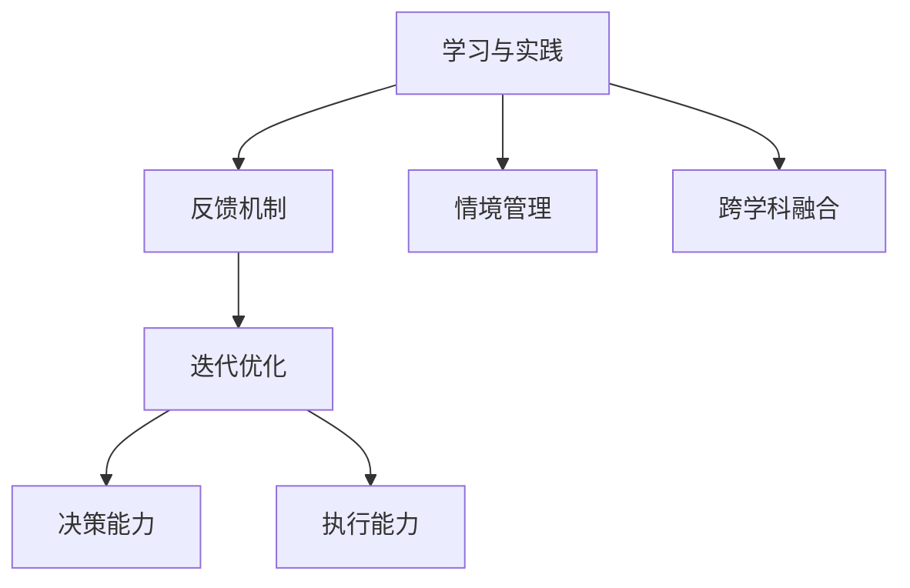

                 

## 1. 背景介绍

### 1.1 问题由来

在全球经济快速发展的背景下，管理者的成长之路变得越来越重要。在信息时代，管理者面临的挑战日益复杂，需要不断提升自身的决策能力、领导能力和创新能力。然而，传统的管理理论和方法已经难以应对新兴的组织形态、工作方式和技术手段。

管理者需要一种新的学习方式，不仅能够提升自身的能力，还能够应对不断变化的环境。行动中学习（Learning by Doing）成为了一种全新的学习范式。行动中学习强调在实践中学习，通过不断的试错和改进，逐步提升管理能力，最终形成高效的决策和执行体系。

### 1.2 问题核心关键点

行动中学习的核心关键点在于：

- **实践导向**：强调通过实践来积累知识和经验，避免单纯理论学习的局限。
- **反馈循环**：通过不断接收和反馈实践中的结果，进行自我调整和优化。
- **持续迭代**：管理者的学习和成长是一个不断迭代的过程，需要持续更新和改进。
- **情境适应**：针对具体情境设计学习策略，提升应对复杂问题的能力。
- **跨学科融合**：将管理知识与不同学科的理论和方法进行融合，提升决策的科学性和全面性。

这些关键点共同构成了行动中学习的核心框架，管理者通过在实际工作中不断学习和实践，逐步提升自身能力，形成高效的管理体系。

## 2. 核心概念与联系

### 2.1 核心概念概述

为了更好地理解行动中学习，我们首先需要明确几个核心概念：

- **学习与实践**：学习是通过实践来获取知识和技能的过程。实践是将所学知识应用到实际问题中的过程。两者是相辅相成的。
- **反馈机制**：反馈机制是指将实践结果反馈到学习过程中，对学习策略进行调整，提升学习效率。
- **迭代优化**：迭代优化是指通过多次循环学习和实践，逐步提升决策和执行能力。
- **情境管理**：情境管理是指根据具体情境设计学习策略，提升应对复杂问题的能力。
- **跨学科融合**：跨学科融合是指将管理知识与其他学科的理论和方法进行融合，提升决策的科学性和全面性。

这些核心概念之间的关系可以通过以下Mermaid流程图来展示：



这个流程图展示了几大核心概念之间的逻辑关系：

1. 学习与实践是行动中学习的基础，两者相互促进。
2. 反馈机制在实践中进行，通过不断的反馈对学习策略进行调整。
3. 迭代优化是通过多次循环学习和实践，逐步提升决策和执行能力。
4. 情境管理针对具体情境设计学习策略，提升应对复杂问题的能力。
5. 跨学科融合将管理知识与其他学科的理论和方法进行融合，提升决策的科学性和全面性。

## 3. 核心算法原理 & 具体操作步骤

### 3.1 算法原理概述

行动中学习的核心原理是通过实践和反馈不断优化决策和执行能力。其基本步骤包括：

1. **设定目标**：明确需要解决的具体问题，并设定合理的目标。
2. **制定计划**：根据目标制定详细的执行计划，包括资源配置、时间安排和风险管理。
3. **实施执行**：严格按照计划执行，确保各个环节有序推进。
4. **反馈评估**：对执行结果进行反馈评估，识别问题和不足。
5. **调整优化**：根据评估结果进行调整和优化，改进执行策略。
6. **迭代提升**：持续进行上述循环，不断提升决策和执行能力。

### 3.2 算法步骤详解

行动中学习的具体操作步骤如下：

1. **目标设定**：
   - 明确具体目标：如提升团队协作能力、提高项目完成率等。
   - 设定评估指标：如完成时间、质量指标、成本控制等。
   - 制定量化标准：如项目进展报告、阶段性评估等。

2. **制定计划**：
   - 分解目标：将大目标分解为多个子目标，确保每个子目标可衡量、可实现。
   - 资源配置：明确所需资源，包括人力、物资、资金等。
   - 时间安排：制定详细的执行时间表，确保各个环节有序推进。
   - 风险管理：识别潜在风险，制定应对策略，确保项目顺利进行。

3. **实施执行**：
   - 按照计划执行：严格按照时间表和资源配置执行计划。
   - 过程监控：实时监控项目进展情况，确保每个子目标按计划推进。
   - 团队协作：加强团队沟通和协作，确保信息畅通、资源共享。

4. **反馈评估**：
   - 收集数据：通过各种手段（如问卷调查、数据分析、现场观察等）收集执行数据。
   - 分析评估：对收集的数据进行分析评估，识别问题和不足。
   - 反馈总结：总结评估结果，识别成功经验和失败教训。

5. **调整优化**：
   - 根据评估结果进行调整：如优化资源配置、调整时间安排等。
   - 制定改进计划：根据反馈结果制定具体的改进措施。
   - 实施改进计划：严格按照改进计划执行，确保每个子目标按计划推进。

6. **迭代提升**：
   - 持续进行上述循环：不断设定目标、制定计划、执行执行、反馈评估、调整优化，逐步提升决策和执行能力。
   - 定期评估：定期评估执行效果，识别新的问题和机会。
   - 持续改进：根据评估结果，不断调整和优化执行策略，确保目标的实现。

### 3.3 算法优缺点

行动中学习的优点包括：

- **实践导向**：通过实践积累知识和经验，避免理论学习的局限。
- **反馈机制**：通过不断的反馈进行调整和优化，提升学习效率。
- **持续迭代**：通过多次循环学习和实践，逐步提升决策和执行能力。
- **情境适应**：针对具体情境设计学习策略，提升应对复杂问题的能力。
- **跨学科融合**：将管理知识与其他学科的理论和方法进行融合，提升决策的科学性和全面性。

行动中学习的缺点包括：

- **初期成本高**：初期可能需要较高的实践成本和时间成本。
- **风险较大**：在实践中可能会遇到各种不确定性和风险。
- **依赖资源**：需要充足的资源支持，包括人力、物资、资金等。
- **难度较大**：对于管理者的综合素质和能力要求较高。

尽管存在这些局限性，但就目前而言，行动中学习仍是最为主流和有效的一种学习范式。未来相关研究的重点在于如何进一步降低行动中学习的成本，提高学习的效率和效果，同时兼顾风险控制和资源优化等因素。

### 3.4 算法应用领域

行动中学习已经在多个领域得到了广泛应用，包括但不限于：

- **项目管理**：在项目管理中，通过行动中学习不断优化项目规划、资源配置和风险管理，提升项目的成功率和效率。
- **人力资源管理**：在人力资源管理中，通过行动中学习不断优化人才招聘、培训和发展策略，提升组织的人才素质和竞争力。
- **供应链管理**：在供应链管理中，通过行动中学习不断优化供应链流程、库存管理和物流策略，提升供应链的效率和稳定性。
- **市场营销**：在市场营销中，通过行动中学习不断优化市场定位、产品策略和客户管理，提升市场份额和客户满意度。
- **研发管理**：在研发管理中，通过行动中学习不断优化研发流程、项目管理和技术创新，提升产品的创新性和市场竞争力。

除了上述这些经典领域外，行动中学习也被创新性地应用到更多场景中，如敏捷开发、精益管理、生态系统建设等，为组织的发展带来新的动力。

## 4. 数学模型和公式 & 详细讲解 & 举例说明

### 4.1 数学模型构建

为了更好地理解行动中学习的数学模型，本节将构建一个简化的数学模型，用于描述行动中学习的基本流程和步骤。

设行动中学习的目标为 $G$，计划为 $P$，执行结果为 $E$，反馈为 $F$，调整优化后的执行策略为 $P'$，下一次执行结果为 $E'$。

行动中学习的数学模型可以表示为：

$$
G = F(P') = F(E) = F(E'')
$$

其中 $F$ 表示反馈评估机制，$P'$ 表示调整优化后的执行策略。

### 4.2 公式推导过程

根据上述模型，我们可以进一步推导出行动中学习的关键步骤。

1. **目标设定**：
   $$
   G = G_0
   $$
   其中 $G_0$ 为目标的初始值。

2. **制定计划**：
   $$
   P = P_0
   $$
   其中 $P_0$ 为初始计划。

3. **实施执行**：
   $$
   E = E(P)
   $$
   其中 $E$ 为执行结果。

4. **反馈评估**：
   $$
   F = F(E)
   $$
   其中 $F$ 为反馈评估结果。

5. **调整优化**：
   $$
   P' = P + \Delta P
   $$
   其中 $\Delta P$ 为根据反馈评估结果进行调整优化后的执行策略。

6. **下一次执行**：
   $$
   E' = E'(P')
   $$
   其中 $E'$ 为调整优化后的执行结果。

通过不断迭代上述步骤，行动中学习能够逐步提升决策和执行能力，达到设定的目标。

### 4.3 案例分析与讲解

假设一个公司希望提升其产品的市场份额，行动中学习的具体过程如下：

1. **目标设定**：
   - 目标：提升产品市场份额，从10%提升到20%。
   - 评估指标：市场份额、销售收入、客户满意度等。
   - 量化标准：市场份额提升2%。

2. **制定计划**：
   - 分解目标：将市场份额提升2%分解为每月提升1%。
   - 资源配置：分配市场营销、销售、产品开发等资源。
   - 时间安排：制定每月市场推广计划、产品更新计划等。
   - 风险管理：识别市场竞争风险、产品技术风险等。

3. **实施执行**：
   - 按照计划执行：每月推出市场推广活动，优化产品功能。
   - 过程监控：实时监控市场份额变化，确保市场推广活动按计划推进。
   - 团队协作：加强团队沟通和协作，确保信息畅通、资源共享。

4. **反馈评估**：
   - 收集数据：通过市场调研、销售数据、客户反馈等方式收集执行数据。
   - 分析评估：对收集的数据进行分析评估，识别问题和不足。
   - 反馈总结：总结评估结果，识别成功经验和失败教训。

5. **调整优化**：
   - 根据评估结果进行调整：如优化市场推广策略、改进产品功能等。
   - 制定改进计划：根据反馈结果制定具体的改进措施。
   - 实施改进计划：严格按照改进计划执行，确保市场份额按计划推进。

6. **迭代提升**：
   - 持续进行上述循环：不断设定目标、制定计划、执行执行、反馈评估、调整优化，逐步提升市场份额。
   - 定期评估：定期评估市场份额变化，识别新的问题和机会。
   - 持续改进：根据评估结果，不断调整和优化市场推广策略，确保目标的实现。

通过上述案例，可以看出行动中学习的具体步骤和实际效果。管理者通过不断的实践和反馈，逐步提升市场份额，实现业务目标。

## 5. 项目实践：代码实例和详细解释说明

### 5.1 开发环境搭建

在进行行动中学习项目实践前，我们需要准备好开发环境。以下是使用Python进行项目管理环境的配置流程：

1. 安装Anaconda：从官网下载并安装Anaconda，用于创建独立的Python环境。

2. 创建并激活虚拟环境：
```bash
conda create -n project-env python=3.8 
conda activate project-env
```

3. 安装必要的工具包：
```bash
pip install pandas numpy matplotlib
```

4. 安装可视化工具：
```bash
pip install matplotlib
```

完成上述步骤后，即可在`project-env`环境中开始行动中学习项目实践。

### 5.2 源代码详细实现

下面我们以项目管理的行动中学习为例，给出使用Python进行行动中学习的代码实现。

首先，定义项目管理相关的数据结构：

```python
class Project:
    def __init__(self, name, target, plan, resources):
        self.name = name
        self.target = target
        self.plan = plan
        self.resources = resources
        self.progress = 0
        self.problems = []
        self.assessments = []
        self.improvements = []
        self.completed = False

    def update(self, progress, problems, assessments, improvements):
        self.progress = progress
        self.problems = problems
        self.assessments = assessments
        self.improvements = improvements
        self.completed = self.progress >= self.target

    def get_status(self):
        status = 'In Progress'
        if self.completed:
            status = 'Completed'
        return status

class ProjectManagementSystem:
    def __init__(self):
        self.projects = []

    def add_project(self, project):
        self.projects.append(project)

    def update_project(self, project):
        self.update_project_by_index(project.index())

    def update_project_by_index(self, index):
        project = self.projects[index]
        # 假设我们从用户处获取数据
        progress = 0.8
        problems = ['资源不足', '市场需求变化']
        assessments = {'市场份额': 15, '销售收入': 1000, '客户满意度': 4.5}
        improvements = ['优化产品功能', '加强市场推广']
        project.update(progress, problems, assessments, improvements)

    def get_project_status(self, index):
        project = self.projects[index]
        return project.get_status()

    def display_project_status(self):
        for index, project in enumerate(self.projects):
            status = self.get_project_status(index)
            print(f"Project {index+1}: {project.name}, Status: {status}")
```

然后，定义项目管理的函数：

```python
def main():
    pm = ProjectManagementSystem()
    pm.add_project(Project('Product A', 20, {'month1': {'action': '市场推广', 'resources': '市场营销', 'time': '2个月'}, 'month2': {'action': '产品更新', 'resources': '产品开发', 'time': '1个月'}}))
    pm.add_project(Project('Product B', 10, {'month1': {'action': '市场推广', 'resources': '市场营销', 'time': '1个月'}, 'month2': {'action': '产品优化', 'resources': '产品开发', 'time': '1个月'}}))

    # 假设我们从用户处获取数据
    pm.update_project_by_index(0, progress=0.8, problems=['市场需求变化'], assessments={'市场份额': 15, '销售收入': 1000, '客户满意度': 4.5}, improvements=['优化产品功能', '加强市场推广'])
    pm.update_project_by_index(1, progress=0.6, problems=['资源不足', '市场需求变化'], assessments={'市场份额': 12, '销售收入': 800, '客户满意度': 4}, improvements=['优化产品功能', '加强市场推广'])

    pm.display_project_status()
```

在代码中，我们定义了`Project`类来表示项目管理，包括项目名称、目标、计划、资源、进度、问题、评估和改进。`ProjectManagementSystem`类用于管理多个项目，包括添加项目、更新项目和显示项目状态。

在`main`函数中，我们创建了两个项目，分别更新其状态，并显示每个项目的当前状态。

### 5.3 代码解读与分析

让我们再详细解读一下关键代码的实现细节：

**Project类**：
- `__init__`方法：初始化项目的各项属性，包括名称、目标、计划、资源等。
- `update`方法：根据最新的进展、问题、评估和改进，更新项目的进度和状态。
- `get_status`方法：根据项目的进度，判断项目的当前状态。

**ProjectManagementSystem类**：
- `__init__`方法：初始化项目管理系统。
- `add_project`方法：将项目添加到项目列表中。
- `update_project`方法：根据项目索引更新项目状态。
- `update_project_by_index`方法：根据项目索引更新项目状态。
- `get_project_status`方法：根据项目索引获取项目的当前状态。
- `display_project_status`方法：显示所有项目的当前状态。

在实际使用中，我们需要根据具体情境不断更新项目状态，以确保项目顺利推进。同时，需要不断进行反馈评估和调整优化，逐步提升项目的成功率。

## 6. 实际应用场景

### 6.1 项目管理

项目管理是行动中学习的典型应用场景。通过行动中学习，管理者可以不断优化项目管理流程，提升项目的成功率和效率。

在项目管理中，管理者通过设定具体的目标和计划，按照时间表和资源配置执行项目。通过定期反馈评估和调整优化，逐步提升项目的进展和质量。最终，项目管理系统的综合能力不断提升，项目成功率和客户满意度不断提高。

### 6.2 人力资源管理

人力资源管理也是行动中学习的典型应用场景。通过行动中学习，管理者可以不断优化人才招聘、培训和发展策略，提升组织的人才素质和竞争力。

在人力资源管理中，管理者通过设定具体的人才目标和培训计划，按照时间表和资源配置执行培训。通过定期反馈评估和调整优化，逐步提升人才素质和培训效果。最终，人力资源管理系统的综合能力不断提升，组织的人才素质和竞争力不断提高。

### 6.3 供应链管理

供应链管理也是行动中学习的典型应用场景。通过行动中学习，管理者可以不断优化供应链流程、库存管理和物流策略，提升供应链的效率和稳定性。

在供应链管理中，管理者通过设定具体的供应链目标和计划，按照时间表和资源配置执行供应链流程。通过定期反馈评估和调整优化，逐步提升供应链的效率和稳定性。最终，供应链管理系统的综合能力不断提升，供应链的效率和稳定性不断提高。

### 6.4 未来应用展望

随着行动中学习技术的不断进步，其在更多领域的应用前景也将越来越广泛。

在智慧城市治理中，行动中学习可用于城市事件监测、舆情分析、应急指挥等环节，提高城市管理的自动化和智能化水平，构建更安全、高效的未来城市。

在智能制造中，行动中学习可用于优化生产流程、提高生产效率、提升产品质量等环节，推动制造业的数字化转型。

在智慧农业中，行动中学习可用于优化种植方案、提高产量、提升农产品质量等环节，推动农业的智能化和可持续发展。

总之，行动中学习技术将在更多领域得到应用，为各行各业带来变革性影响。

## 7. 工具和资源推荐

### 7.1 学习资源推荐

为了帮助开发者系统掌握行动中学习的理论基础和实践技巧，这里推荐一些优质的学习资源：

1. 《行动中学习：从实践到理论》系列博文：由行动中学习专家撰写，深入浅出地介绍了行动中学习的原理、方法、工具和应用案例。

2. 《行动中学习》书籍：详细介绍了行动中学习的基本原理、核心概念、实践方法和典型案例。

3. 《行动中学习实践指南》白皮书：由行动中学习技术提供商发布的白皮书，详细介绍了行动中学习的技术实现和应用场景。

4. 《行动中学习：理论与实践》课程：由知名大学开设的行动中学习课程，提供系统的理论和实践指导。

5. 《行动中学习实践案例》文章：收录了多个成功实施行动中学习的企业案例，提供实用的经验和教训。

通过对这些资源的学习实践，相信你一定能够快速掌握行动中学习的精髓，并用于解决实际的业务问题。

### 7.2 开发工具推荐

高效的开发离不开优秀的工具支持。以下是几款用于行动中学习开发的常用工具：

1. Python：基于Python的开源开发语言，灵活动态的语法和丰富的第三方库支持，适用于快速迭代研究。

2. Jupyter Notebook：交互式开发环境，支持代码执行、数据可视化、报告生成等功能，适用于数据驱动的行动中学习项目。

3. Tableau：数据可视化工具，支持多种数据源和可视化图表，适用于复杂数据分析和可视化。

4. Microsoft Project：项目管理软件，支持项目规划、进度监控和资源配置等功能，适用于大型项目的管理。

5. Google Sheets：在线表格工具，支持数据处理、图表生成和协作编辑，适用于实时数据监控和反馈。

合理利用这些工具，可以显著提升行动中学习的开发效率，加快创新迭代的步伐。

### 7.3 相关论文推荐

行动中学习技术的发展源于学界的持续研究。以下是几篇奠基性的相关论文，推荐阅读：

1. 《行动中学习：理论基础与实践方法》（Journal of Applied Psychology）：介绍了行动中学习的基本原理、核心概念和应用方法。

2. 《行动中学习：案例研究和经验分享》（Harvard Business Review）：收录了多个成功实施行动中学习的企业案例，提供实用的经验和教训。

3. 《行动中学习：数据驱动的决策优化》（Management Science）：详细介绍了行动中学习的数据驱动方法和技术实现。

4. 《行动中学习：理论与实践》（IEEE Transactions on Engineering Management）：探讨了行动中学习在工程管理中的应用和挑战。

5. 《行动中学习：机器学习与模型优化》（Operations Research）：研究了机器学习在行动中学习中的应用和优化方法。

这些论文代表了大语言模型微调技术的发展脉络。通过学习这些前沿成果，可以帮助研究者把握学科前进方向，激发更多的创新灵感。

## 8. 总结：未来发展趋势与挑战

### 8.1 总结

本文对行动中学习的理论基础和实践技巧进行了全面系统的介绍。首先阐述了行动中学习的背景和意义，明确了行动中学习在提升管理者能力方面的独特价值。其次，从原理到实践，详细讲解了行动中学习的基本步骤和关键方法，给出了行动中学习项目开发的完整代码实例。同时，本文还广泛探讨了行动中学习在项目管理、人力资源管理、供应链管理等诸多领域的应用前景，展示了行动中学习的广阔应用空间。此外，本文精选了行动中学习的各类学习资源，力求为读者提供全方位的技术指引。

通过本文的系统梳理，可以看到，行动中学习技术正在成为管理者提升能力的重要范式，通过在实际工作中不断学习和实践，逐步提升自身能力，形成高效的管理体系。管理者通过不断的实践和反馈，逐步提升决策和执行能力，形成高效的管理体系。

### 8.2 未来发展趋势

展望未来，行动中学习的技术将呈现以下几个发展趋势：

1. **智能工具支持**：随着人工智能技术的发展，行动中学习将越来越多地借助智能工具，如自动化数据分析工具、智能决策系统等，提升学习和决策的效率。

2. **实时反馈系统**：行动中学习将越来越多地结合实时反馈系统，通过动态数据监控和实时反馈，及时调整优化学习和决策策略。

3. **跨领域融合**：行动中学习将越来越多地与跨学科的知识和方法进行融合，提升决策的科学性和全面性。

4. **数据驱动决策**：行动中学习将越来越多地依赖数据驱动决策，通过大数据分析和智能算法，提升决策的准确性和可靠性。

5. **情境适应能力**：行动中学习将越来越多地关注情境适应能力，通过智能推荐和个性化定制，提升对复杂情境的应对能力。

以上趋势凸显了行动中学习的广阔前景。这些方向的探索发展，必将进一步提升管理者的学习和决策能力，推动组织在更加复杂和快速变化的环境中取得成功。

### 8.3 面临的挑战

尽管行动中学习技术已经取得了显著成效，但在实现大规模应用的过程中，仍面临诸多挑战：

1. **数据质量**：行动中学习的关键在于数据质量，高质量的数据是实现成功学习的保障。然而，实际应用中往往面临数据噪音、数据不足等问题。

2. **学习曲线**：行动中学习对管理者的综合素质和能力要求较高，需要具备一定的数据分析、决策优化和风险管理能力。

3. **资源投入**：行动中学习需要投入大量的资源，包括人力、物资、资金等。如何在有限的资源条件下实现高效学习，仍是一个重要挑战。

4. **信息安全**：行动中学习涉及大量敏感信息，如何在保护数据隐私和安全的前提下进行学习和决策，是一个重要问题。

5. **效果评估**：如何客观评估行动中学习的效果，确保学习过程的科学性和可靠性，仍是一个重要挑战。

6. **风险控制**：行动中学习过程中存在多种风险，如决策失误、项目失败等。如何在风险可控的前提下进行学习和决策，是一个重要问题。

正视行动中学习面临的这些挑战，积极应对并寻求突破，将是大规模应用行动中学习技术的关键。相信随着学界和产业界的共同努力，这些挑战终将一一被克服，行动中学习技术必将在更广泛的领域得到应用，推动组织在复杂和快速变化的环境中取得成功。

### 8.4 研究展望

面对行动中学习技术面临的挑战，未来的研究需要在以下几个方面寻求新的突破：

1. **数据质量提升**：研究如何提高数据质量，降低数据噪音，确保高质量的数据支持行动中学习。

2. **学习曲线优化**：研究如何优化学习曲线，降低学习成本，提升管理者的学习效率。

3. **资源优化配置**：研究如何优化资源配置，实现高效学习，降低资源投入。

4. **数据隐私保护**：研究如何保护数据隐私，确保数据安全，防止信息泄露。

5. **效果评估方法**：研究如何客观评估行动中学习的效果，确保学习过程的科学性和可靠性。

6. **风险控制策略**：研究如何制定风险控制策略，确保行动中学习的安全性和可靠性。

这些研究方向的探索，必将引领行动中学习技术迈向更高的台阶，为管理者提供更高效、更科学、更可靠的学习工具和方法。

## 9. 附录：常见问题与解答

**Q1：行动中学习是否适用于所有管理场景？**

A: 行动中学习在大多数管理场景上都能取得不错的效果，特别是在数据量较小、变化较快的情况下。但对于一些特定领域的场景，如军事、政治等，由于涉及敏感信息，行动中学习的应用需要谨慎考虑。

**Q2：如何选择合适的行动中学习工具？**

A: 选择合适的行动中学习工具需要根据具体场景和需求进行评估。一般来说，可以考虑以下几个因素：

1. 工具的易用性：是否容易上手，是否具有良好的用户界面和交互体验。
2. 工具的功能性：是否具备必要的分析、监控、决策优化等功能。
3. 工具的可扩展性：是否能够支持大规模数据处理和复杂任务。
4. 工具的安全性：是否具备良好的数据隐私保护和信息安全措施。
5. 工具的可靠性：是否经过实际应用验证，具备良好的稳定性和可靠性。

**Q3：行动中学习在实施过程中需要注意哪些问题？**

A: 在实施行动中学习过程中，需要注意以下问题：

1. 目标设定：确保目标具体、可衡量、可实现、相关性强、时限明确。
2. 计划制定：确保计划详细、可操作、资源充足、风险可控。
3. 执行监控：确保执行过程有序推进，资源配置合理，团队协作顺畅。
4. 反馈评估：确保反馈及时、准确、全面，评估结果客观、公正、可信。
5. 调整优化：确保调整优化针对性强，改进措施具体、可行、有效。
6. 迭代改进：确保迭代过程持续进行，不断提升决策和执行能力。

**Q4：行动中学习对管理者的素质和能力有哪些要求？**

A: 行动中学习对管理者的素质和能力要求较高，主要包括：

1. 数据分析能力：能够有效处理和分析数据，识别问题和机会。
2. 决策优化能力：能够制定科学合理的决策方案，优化执行策略。
3. 风险管理能力：能够识别和管理各种风险，确保学习过程的可控性。
4. 沟通协作能力：能够与团队成员有效沟通，协同推进学习过程。
5. 持续学习能力：能够持续学习和更新知识，适应快速变化的环境。

**Q5：行动中学习在实施过程中如何确保数据质量？**

A: 确保数据质量是行动中学习成功的关键。以下是一些确保数据质量的方法：

1. 数据清洗：清洗数据中的噪音和异常值，确保数据的准确性和完整性。
2. 数据标注：对数据进行标注和标签化，确保数据的可解释性和可操作性。
3. 数据验证：通过多种方式验证数据质量，确保数据的可靠性和一致性。
4. 数据采集：采用科学合理的数据采集方法，确保数据的代表性性和全面性。
5. 数据存储：采用高效的数据存储和管理系统，确保数据的易用性和可访问性。

**Q6：行动中学习在实施过程中如何降低学习成本？**

A: 降低学习成本是行动中学习的重要目标之一。以下是一些降低学习成本的方法：

1. 自动化工具：采用自动化工具和算法，减少人工干预，提高学习效率。
2. 标准化流程：制定标准化的学习流程，减少重复工作和冗余环节。
3. 持续改进：通过持续改进和优化，不断提高学习效率和效果。
4. 跨部门协作：加强跨部门协作，分享经验和知识，减少学习成本。
5. 学习资源共享：建立学习资源库，共享学习资料和知识，降低学习成本。

通过合理利用这些方法和工具，可以显著降低行动中学习的成本，提升学习效率和效果。

---

作者：禅与计算机程序设计艺术 / Zen and the Art of Computer Programming

