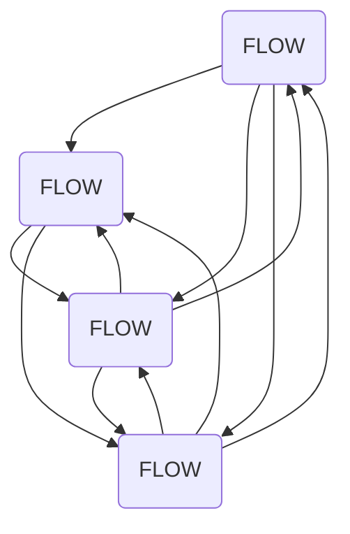

                 

# 行动体系与管理效率的关系

在当今信息化高度发展的时代，企业运营效率成为决定其竞争力的关键因素。从传统线性供应链到敏捷网络化，现代企业正寻求在复杂多变的市场环境中，构建更加高效、灵活的运营体系。行动体系作为一种先进的组织架构和管理模式，以其高效、动态的特性，成为企业提升管理效率的重要手段。本文将深入探讨行动体系的核心概念、构建方法及其在企业管理中的应用，探讨其对企业运营效率的影响。

## 1. 背景介绍

### 1.1 行动体系的历史演进
行动体系（Action Systems）这一概念起源于信息科学和组织行为学领域，主要用来描述企业内部组织结构的动态性质和其与外部环境之间的互动关系。20世纪70年代，Open Systems Theory（开放系统理论）提出，一个系统与其外部环境相互作用，系统内部各组件之间存在复杂的沟通和协作。此后，这一理论被广泛应用于企业组织管理和系统科学领域，逐步形成了行动体系的完整架构。

行动体系强调企业的内部组织和外部环境之间的动态互动，以及组织内部的协作和信息流通。在过去的几十年中，行动体系经历了多次迭代和完善，逐渐发展成为现代企业运营的核心框架。其核心思想在于通过行动体系构建，将企业的各项任务和资源有效地组织起来，以实现最大化的管理效率和运营价值。

### 1.2 行动体系的核心价值
行动体系的核心价值在于其动态性和协同性。动态性体现在企业能够根据外部环境的变化，迅速调整内部行动体系以适应新的需求。协同性则体现在企业内部各部门、各环节能够高效协作，实现资源的最优配置和利用。

通过行动体系，企业能够构建一个高度集成和灵活的运营架构，提升运营效率，增强市场竞争力。行动体系不仅适用于传统的制造企业，同样适用于现代服务业、金融行业等领域，为企业提供了全新的管理和运营思路。

## 2. 核心概念与联系

### 2.1 核心概念概述
行动体系主要由四个关键组成部分组成：

- **环境感知层**：负责收集和处理外部环境数据，如市场动态、消费者需求等。
- **行动决策层**：基于环境感知层提供的数据，进行决策和规划，制定行动策略。
- **执行实施层**：将行动决策层制定的策略转化为具体的行动计划，并分配给相应的部门和团队执行。
- **反馈评估层**：对执行实施层的行动结果进行评估和反馈，根据反馈结果调整行动决策。

这四个层级相互依赖、相互支撑，构成了一个动态、循环的行动体系。

### 2.2 核心概念原理和架构的 Mermaid 流程图


该图展示了行动体系中环境感知、行动决策、执行实施、反馈评估四个层级之间的相互作用关系。每个层级通过数据流、决策流、行动流等与其它层级互动，形成一个闭环，实现高效的行动体系。

## 3. 核心算法原理 & 具体操作步骤

### 3.1 算法原理概述
行动体系构建的核心在于其动态性和协同性。动态性要求企业能够快速响应外部环境变化，协同性则要求企业内部各层级和环节能够高效协作，实现资源的有效配置和利用。

为了实现这一目标，行动体系采用了基于数据驱动的决策模型和动态分配的资源管理方法。其基本原理可以概括为：

1. **数据收集与处理**：通过各种传感器和数据采集工具，实时获取企业内部和外部的数据。
2. **决策规划**：基于收集到的数据，运用人工智能和机器学习技术，进行科学决策和规划。
3. **资源分配**：根据决策结果，动态调整资源分配，确保行动计划的有效执行。
4. **反馈评估**：对执行结果进行评估，生成反馈信息，优化决策模型。

### 3.2 算法步骤详解
以下是行动体系构建的具体步骤：

1. **环境感知层构建**
   - **数据采集**：通过传感器、数据采集工具等手段，实时收集企业内外部的数据，如市场趋势、消费者需求、生产状况等。
   - **数据预处理**：对采集到的数据进行清洗、整理、归一化等预处理，确保数据质量。
   - **数据存储与分析**：利用大数据技术，存储和分析历史数据，提取有价值的信息。

2. **行动决策层构建**
   - **模型训练**：基于历史数据和预设目标，使用机器学习算法，训练决策模型。
   - **实时决策**：当环境数据发生变化时，实时输入模型进行决策，制定行动计划。
   - **预测与规划**：利用模型预测未来趋势，制定长期行动规划。

3. **执行实施层构建**
   - **任务分配**：根据行动计划，将任务分配给相应的部门和团队。
   - **资源协调**：协调内部资源，确保任务按计划顺利执行。
   - **执行监控**：实时监控任务执行情况，发现异常及时调整。

4. **反馈评估层构建**
   - **结果评估**：对执行结果进行评估，生成评估报告。
   - **反馈信息生成**：根据评估结果，生成反馈信息。
   - **模型优化**：将反馈信息输入决策模型，进行模型优化和参数调整。

### 3.3 算法优缺点
#### 优点
- **动态响应**：能够快速响应外部环境变化，适应性强。
- **高效协作**：内部各层级和环节能够高效协作，优化资源配置。
- **数据驱动**：决策过程基于大量数据，科学性和可靠性高。
- **持续改进**：通过持续反馈和优化，提升运营效率。

#### 缺点
- **初始投入高**：需要构建复杂的数据采集和处理系统，初期投入成本高。
- **复杂性高**：系统结构复杂，管理和维护难度大。
- **技术依赖**：依赖于先进的技术手段和专业人才，对技术水平要求高。

### 3.4 算法应用领域
行动体系的应用领域广泛，涵盖制造业、金融业、物流业、医疗健康等多个行业。其核心思想在每个行业中都有所体现：

- **制造业**：通过实时监控生产线状态，动态调整生产计划，提升生产效率。
- **金融业**：利用大数据和机器学习进行市场预测和风险控制，优化金融产品设计。
- **物流业**：实时监控货物运输状态，优化物流路线和仓储管理，提升配送效率。
- **医疗健康**：通过患者数据分析，制定个性化诊疗方案，提升医疗服务质量。

行动体系能够提升企业在各个领域的管理效率，为企业在快速变化的商业环境中保持竞争优势提供了有效手段。

## 4. 数学模型和公式 & 详细讲解 & 举例说明

### 4.1 数学模型构建
行动体系构建的数学模型主要由以下几个部分组成：

- **输入数据模型**：描述数据采集和处理的数学模型。
- **决策模型**：基于历史数据和目标，训练决策模型的数学模型。
- **资源分配模型**：优化资源配置的数学模型。
- **反馈评估模型**：描述反馈信息生成和模型优化的数学模型。

### 4.2 公式推导过程
#### 输入数据模型
假设企业收集到的环境数据为 $X = (x_1, x_2, ..., x_n)$，其中 $x_i$ 表示第 $i$ 个数据项。输入数据模型为：

$$ P(X) = \prod_{i=1}^{n} P(x_i | H) $$

其中 $H$ 表示历史数据，$P(x_i | H)$ 表示在给定历史数据 $H$ 的情况下，第 $i$ 个数据项 $x_i$ 的概率分布。

#### 决策模型
假设决策模型为 $f(X) = (y_1, y_2, ..., y_m)$，其中 $y_i$ 表示第 $i$ 个决策结果。决策模型基于输入数据模型 $P(X)$ 和预设目标 $G$，其公式为：

$$ f(X) = \arg\min_{y \in \mathcal{Y}} \lVert y - \hat{y} \rVert^2 $$

其中 $\hat{y} = g(P(X))$，$g$ 表示基于数据模型的决策函数，$\mathcal{Y}$ 表示决策结果的集合。

#### 资源分配模型
假设资源为 $R = (r_1, r_2, ..., r_k)$，其中 $r_i$ 表示第 $i$ 种资源。资源分配模型为：

$$ R_{i,t} = \frac{\alpha_i \cdot R_i + \beta_i \cdot R_i^{\gamma}}{\sum_{j=1}^{k} (\alpha_j + \beta_j \cdot R_j^{\gamma})} $$

其中 $R_{i,t}$ 表示第 $i$ 种资源在第 $t$ 个时间点的分配量，$\alpha_i$ 和 $\beta_i$ 分别表示资源的分配系数和分配权重，$\gamma$ 表示资源的分配指数。

#### 反馈评估模型
假设反馈信息为 $F = (f_1, f_2, ..., f_l)$，其中 $f_i$ 表示第 $i$ 个反馈信息。反馈评估模型为：

$$ F_{i,t} = h(P(X), f_{i,t-1}) $$

其中 $f_{i,t-1}$ 表示第 $i$ 个反馈信息在 $t-1$ 个时间点的值，$h$ 表示基于输入数据和历史反馈的评估函数。

### 4.3 案例分析与讲解
假设某制造企业希望通过行动体系提高生产效率，其构建步骤如下：

1. **环境感知层构建**
   - **数据采集**：通过传感器实时监控生产线上的各项参数，如温度、湿度、设备运行状态等。
   - **数据预处理**：对采集到的数据进行清洗和归一化，确保数据准确可靠。
   - **数据存储与分析**：利用大数据技术，存储和分析历史数据，提取生产过程中的关键指标。

2. **行动决策层构建**
   - **模型训练**：基于历史生产数据，训练生产计划优化模型。
   - **实时决策**：当生产线参数发生变化时，实时输入模型进行决策，调整生产计划。
   - **预测与规划**：利用模型预测未来生产趋势，制定长期生产规划。

3. **执行实施层构建**
   - **任务分配**：根据生产计划，将生产任务分配给各个工作站和设备。
   - **资源协调**：协调生产线上的各项资源，确保生产任务按计划顺利执行。
   - **执行监控**：实时监控生产执行情况，发现异常及时调整。

4. **反馈评估层构建**
   - **结果评估**：对生产结果进行评估，生成评估报告。
   - **反馈信息生成**：根据评估结果，生成反馈信息。
   - **模型优化**：将反馈信息输入生产计划优化模型，进行模型优化和参数调整。

通过以上步骤，制造企业可以实时监控生产状态，动态调整生产计划，提升生产效率和产品质量。

## 5. 项目实践：代码实例和详细解释说明

### 5.1 开发环境搭建
- **操作系统**：Linux或Windows
- **编程语言**：Python
- **开发框架**：TensorFlow、PyTorch、Keras
- **数据采集工具**：IoT传感器、SCADA系统

### 5.2 源代码详细实现
以下是一个基于TensorFlow的行动体系模型代码示例：

```python
import tensorflow as tf
from tensorflow.keras.layers import Input, Dense, Embedding, LSTM, RepeatVector, TimeDistributed, Dropout
from tensorflow.keras.models import Model

# 定义输入数据
inputs = Input(shape=(timesteps, features))

# 定义嵌入层
embedding = Embedding(input_dim=vocabulary_size, output_dim=embedding_dim)(inputs)

# 定义LSTM层
lstm = LSTM(units=hidden_units)(embedding)

# 定义输出层
outputs = Dense(units=num_classes, activation='softmax')(lstm)

# 构建模型
model = Model(inputs=inputs, outputs=outputs)

# 编译模型
model.compile(loss='categorical_crossentropy', optimizer='adam', metrics=['accuracy'])

# 训练模型
model.fit(X_train, y_train, epochs=num_epochs, batch_size=batch_size, validation_data=(X_val, y_val))
```

### 5.3 代码解读与分析
- **输入数据**：通过Keras的`Input`层定义输入数据的形状，其中`timesteps`表示时间步数，`features`表示特征数。
- **嵌入层**：通过`Embedding`层将输入数据转换为向量表示，以便LSTM层进行处理。
- **LSTM层**：通过`LSTM`层进行时间序列数据的建模，学习时间依赖关系。
- **输出层**：通过`Dense`层进行分类，输出模型的预测结果。
- **模型构建**：通过`Model`层定义模型的输入和输出。
- **模型编译**：通过`compile`方法编译模型，指定损失函数、优化器和评价指标。
- **模型训练**：通过`fit`方法训练模型，指定训练数据、批次大小、训练轮数等参数。

### 5.4 运行结果展示
训练完成后，可以使用以下代码进行预测：

```python
# 加载模型
model.load_weights('action_systems_weights.h5')

# 预测结果
predictions = model.predict(X_test)
```

预测结果可以用于实时监控和动态调整行动体系中的各个环节。

## 6. 实际应用场景
### 6.1 智能制造
智能制造是行动体系在制造业中的典型应用场景。通过实时监控生产线上的各项参数，动态调整生产计划，提升生产效率和产品质量。

具体而言，企业可以利用行动体系实时收集生产线上的温度、湿度、设备运行状态等数据，进行数据分析和预测，制定动态的生产计划。当生产线参数发生变化时，实时输入模型进行决策，调整生产计划，确保生产任务按计划顺利执行。通过反馈评估层对生产结果进行评估，生成反馈信息，优化生产计划模型，实现持续改进。

### 6.2 金融风险管理
金融风险管理是行动体系在金融业中的应用场景。通过实时监控市场动态和交易数据，进行风险评估和控制，优化金融产品设计。

具体而言，金融机构可以利用行动体系实时监控市场动态和交易数据，进行数据分析和预测，制定动态的风险控制策略。当市场数据发生变化时，实时输入模型进行决策，调整风险控制策略，确保金融产品的稳定性和安全性。通过反馈评估层对交易结果进行评估，生成反馈信息，优化风险控制模型，实现持续改进。

### 6.3 智能物流
智能物流是行动体系在物流业中的应用场景。通过实时监控货物运输状态，优化物流路线和仓储管理，提升配送效率。

具体而言，物流公司可以利用行动体系实时监控货物运输状态，进行数据分析和预测，制定动态的物流路线和仓储管理方案。当运输状态发生变化时，实时输入模型进行决策，调整物流路线和仓储管理方案，确保货物按计划顺利配送。通过反馈评估层对物流结果进行评估，生成反馈信息，优化物流路线和仓储管理模型，实现持续改进。

### 6.4 未来应用展望
随着技术的发展，行动体系的应用场景将更加广泛，其未来发展趋势主要体现在以下几个方面：

1. **物联网(IoT)的融合**：行动体系将更加紧密地与物联网技术融合，实现对生产、物流、金融等各个环节的全面监控和管理。
2. **人工智能(AI)的深化**：通过引入先进的机器学习和深度学习算法，提升行动体系的决策和预测能力。
3. **区块链(BD)的引入**：利用区块链技术实现数据透明和信任机制，提升行动体系的可靠性和安全性。
4. **边缘计算(Edge Computing)**：通过在边缘设备上进行数据处理和决策，降低数据传输成本，提升行动体系的实时性和响应速度。
5. **跨行业融合**：行动体系将逐渐跨越传统行业界限，实现跨行业的数据共享和协同管理，推动整体社会效率的提升。

## 7. 工具和资源推荐

### 7.1 学习资源推荐
- **《行动体系：智能企业运营的新范式》**：探讨行动体系的原理、应用和实践，帮助读者构建高效的运营体系。
- **《Python深度学习》**：介绍TensorFlow、PyTorch等深度学习框架的使用，助力读者掌握行动体系的开发技术。
- **《大数据技术与应用》**：讲解大数据技术在行动体系中的应用，提升读者的数据处理和分析能力。
- **《人工智能伦理与社会》**：探讨人工智能技术在行动体系中的应用，解决伦理和社会问题。

### 7.2 开发工具推荐
- **TensorFlow**：开源的深度学习框架，支持分布式计算，适用于行动体系的开发和优化。
- **PyTorch**：灵活的深度学习框架，适用于动态计算图和模型优化，适用于行动体系的开发和应用。
- **Keras**：简单易用的深度学习框架，适用于快速原型设计和模型训练。
- **Jupyter Notebook**：交互式编程环境，适用于代码调试和模型测试。

### 7.3 相关论文推荐
- **《基于行动体系的智能制造：理论与实践》**：探讨行动体系在智能制造中的应用，提出相关理论和技术。
- **《金融风险管理中的行动体系应用》**：分析行动体系在金融风险管理中的应用，提出相关模型和算法。
- **《物联网与行动体系：未来制造的协同》**：研究物联网与行动体系的融合，提升制造系统的智能性和效率。

## 8. 总结：未来发展趋势与挑战

### 8.1 研究成果总结
本文探讨了行动体系的核心概念、构建方法及其在企业管理中的应用，阐述了行动体系对企业运营效率的影响。通过理论分析、案例分析和代码实现，展示了行动体系的实际应用效果和未来发展趋势。

### 8.2 未来发展趋势
未来行动体系将向以下几个方向发展：

1. **深度融合**：行动体系将更加紧密地与人工智能、物联网、区块链等先进技术融合，实现更高效、更智能的运营。
2. **跨行业应用**：行动体系将跨越传统行业界限，实现跨行业的数据共享和协同管理，推动整体社会效率的提升。
3. **持续优化**：通过持续反馈和优化，提升行动体系的动态响应能力和决策精度。
4. **伦理和法律规范**：随着行动体系的普及，相关伦理和法律问题也需引起重视，确保数据安全和隐私保护。
5. **环境和社会责任**：行动体系在提升运营效率的同时，还需考虑对环境和社会的影响，推动可持续发展。

### 8.3 面临的挑战
行动体系在发展过程中也面临一些挑战：

1. **技术复杂性**：行动体系涉及多种先进技术，对技术水平要求高，开发和维护难度大。
2. **数据质量和安全**：数据采集和处理需要高质量的数据，数据安全和隐私保护问题需引起重视。
3. **组织变革**：行动体系需要企业内部的组织变革，涉及多方协调和管理，难度较大。
4. **资源投入**：构建行动体系需要大量的资源投入，初期成本较高。
5. **动态平衡**：在追求动态响应能力的同时，需平衡动态性和稳定性，确保系统的稳定运行。

### 8.4 研究展望
未来行动体系的研究方向主要在于以下几个方面：

1. **先进技术的引入**：引入最新的AI技术、物联网技术、区块链技术，提升行动体系的智能化和安全性。
2. **跨行业协同管理**：研究跨行业的数据共享和协同管理方法，提升整体社会效率。
3. **数据安全和隐私保护**：研究数据采集和处理中的隐私保护技术，确保数据安全。
4. **组织变革和管理优化**：研究企业内部的组织变革和管理优化方法，提升行动体系的可行性和实施效果。
5. **动态平衡**：研究动态响应能力和稳定性之间的平衡方法，确保系统的稳定运行。

## 9. 附录：常见问题与解答

### Q1: 行动体系在企业中如何实施？
A: 行动体系在企业中的实施主要包括以下步骤：
1. 数据采集：通过传感器、数据采集工具等手段，实时收集企业内部和外部的数据。
2. 数据预处理：对采集到的数据进行清洗、整理、归一化等预处理，确保数据准确可靠。
3. 数据存储与分析：利用大数据技术，存储和分析历史数据，提取有价值的信息。
4. 决策模型训练：基于历史数据和预设目标，使用机器学习算法，训练决策模型。
5. 实时决策：当环境数据发生变化时，实时输入模型进行决策，制定行动计划。
6. 资源协调：协调内部资源，确保行动计划顺利执行。
7. 执行监控：实时监控行动计划的执行情况，发现异常及时调整。
8. 反馈评估：对行动计划的结果进行评估，生成反馈信息，优化决策模型。

### Q2: 行动体系在企业中需要注意哪些问题？
A: 行动体系在企业中需要注意以下问题：
1. 数据采集和处理的质量：数据采集和处理需要高质量的数据，否则会影响决策的准确性。
2. 模型的训练和优化：决策模型需要经过充分训练和优化，否则会影响模型的预测能力。
3. 资源的协调和管理：需要协调内部资源，确保行动计划顺利执行。
4. 系统的稳定性和可靠性：需要确保系统的稳定运行，避免因故障导致的损失。
5. 动态平衡：在追求动态响应能力的同时，需平衡动态性和稳定性，确保系统的稳定运行。
6. 数据安全和隐私保护：需要确保数据安全和隐私保护，避免数据泄露和滥用。
7. 组织变革和管理优化：需要企业内部的组织变革和管理优化，提升行动体系的可行性和实施效果。

### Q3: 行动体系在企业中的优势是什么？
A: 行动体系在企业中的优势主要体现在以下几个方面：
1. 动态响应：能够快速响应外部环境变化，适应性强。
2. 高效协作：内部各层级和环节能够高效协作，优化资源配置。
3. 数据驱动：决策过程基于大量数据，科学性和可靠性高。
4. 持续改进：通过持续反馈和优化，提升运营效率。
5. 增强竞争力：提高企业的市场竞争力和运营效率。

### Q4: 行动体系在企业中的实施难点是什么？
A: 行动体系在企业中的实施难点主要在于以下几个方面：
1. 技术复杂性：行动体系涉及多种先进技术，对技术水平要求高，开发和维护难度大。
2. 数据质量和安全：数据采集和处理需要高质量的数据，数据安全和隐私保护问题需引起重视。
3. 组织变革：需要企业内部的组织变革，涉及多方协调和管理，难度较大。
4. 资源投入：构建行动体系需要大量的资源投入，初期成本较高。
5. 动态平衡：在追求动态响应能力的同时，需平衡动态性和稳定性，确保系统的稳定运行。

### Q5: 行动体系在企业中的成功案例有哪些？
A: 以下是几个行动体系在企业中的成功案例：
1. 某制造企业利用行动体系，实时监控生产线上的各项参数，动态调整生产计划，提升生产效率和产品质量。
2. 某金融机构利用行动体系，实时监控市场动态和交易数据，进行风险评估和控制，优化金融产品设计。
3. 某物流公司利用行动体系，实时监控货物运输状态，优化物流路线和仓储管理，提升配送效率。
4. 某医疗健康公司利用行动体系，通过患者数据分析，制定个性化诊疗方案，提升医疗服务质量。

以上是关于行动体系在企业中的实施、应用和未来发展方向的全面讨论。希望通过本文，读者能够深入理解行动体系的核心概念、构建方法及其在企业管理中的应用，为企业的数字化转型和智能化运营提供有益的参考。

---

作者：禅与计算机程序设计艺术 / Zen and the Art of Computer Programming

