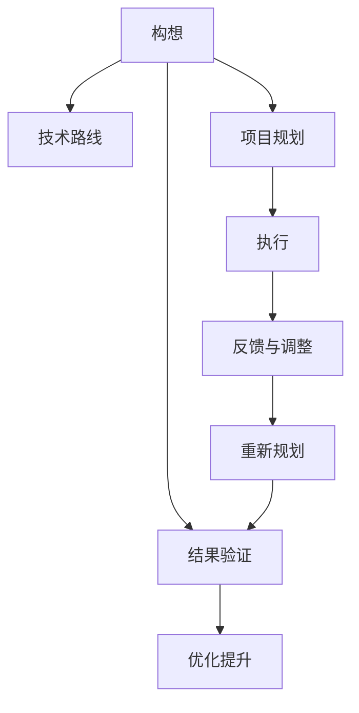

                 

## 1. 背景介绍

### 1.1 问题由来

从数十年前互联网的诞生，到如今人工智能、物联网、区块链等技术的成熟，科技的快速发展给人们的工作、生活带来了翻天覆地的变化。然而，技术的进步并不是一蹴而就的，背后蕴藏着无数科学家、工程师的汗水与智慧。

科技史上的许多重大突破都源于一个简单的构想，例如计算机二进制的提出，万维网的创造。这些构想的实现，离不开一点一滴的实验、验证与改进。行动力，便是在将构想转化为现实的旅途上，关键而核心的推动力。

在科技创新的道路上，我们见证了许多伟大的构想被转化为现实，同时也看到了一些好的构想在执行中遭遇挫折。总结其成败经验，不仅能为我们提供宝贵的历史教训，更能在未来的科研与商业创新中，助力我们攀登更高的科技高峰。

### 1.2 问题核心关键点

技术实现过程中的行动力，包含了多个关键要素：

1. **目标设定**：明确清晰的目标，是行动力起航的起点。
2. **规划与执行**：合理规划技术路线，并分阶段推进，保证每一步都稳扎稳打。
3. **团队协作**：组建高效、协调的团队，每个成员都明确分工与职责。
4. **资源分配**：合理分配技术、人力、时间等资源，确保项目进度不受阻碍。
5. **风险管理**：及时识别和应对可能出现的风险，保证项目顺利进行。
6. **反馈与调整**：通过反馈机制不断优化，及时纠正执行过程中的偏差。

本文将从这些核心要素出发，详细分析将伟大构想化为现实的行动力来源，并为读者提供具体的策略与方法。

## 2. 核心概念与联系

### 2.1 核心概念概述

为更好地理解如何将构想转化为现实，本节将介绍几个密切相关的核心概念：

- **构想(Conception)**：技术突破或产品开发的起点，是对未来目标的初步规划与设计。
- **技术路线(Technical Roadmap)**：从构想到最终实现的详细路径，涵盖了技术框架、算法模型、硬件配置等关键要素。
- **项目规划(Project Planning)**：对项目进度、资源、风险、团队等要素的全面评估和计划。
- **执行(Execution)**：将规划付诸实践，通过不断的实验、测试和优化，逐步接近最终目标。
- **反馈与调整(Feedback and Adjustment)**：基于实际执行情况进行数据分析和优化，不断调整项目进程和方案。

这些核心概念之间的逻辑关系可以通过以下Mermaid流程图来展示：



这个流程图展示了从构想到最终实现的完整过程：

1. 构想是技术突破或产品开发的起点。
2. 技术路线决定了从构想到实现的具体路径。
3. 项目规划确保资源的有效利用和团队的高效协作。
4. 执行将规划付诸实践，通过不断实验和优化，逐步实现目标。
5. 反馈与调整是持续优化的重要环节，保证执行过程中不断改进。
6. 最终通过结果验证和优化提升，构想得以成功转化为现实。

## 3. 核心算法原理 & 具体操作步骤

### 3.1 算法原理概述

技术实现过程中的行动力，本质上是一种通过一系列步骤将构想转化为现实的算法。其核心思想是将目标拆分为可执行的子目标，并通过合理的规划和执行，逐步逼近最终目标。

形式化地，假设一个目标 $T$ 可以通过一系列子目标 $T_1, T_2, ..., T_n$ 实现，其中 $T_i$ 表示第 $i$ 个子目标。行动力算法旨在找到最优的执行顺序 $P$，使得：

$$
\min_{P} \sum_{i=1}^n \text{cost}(T_i, P)
$$

其中 $\text{cost}(T_i, P)$ 表示实现第 $i$ 个子目标的成本。

### 3.2 算法步骤详解

基于行动力算法的思路，我们通常可以按照以下步骤将构想转化为现实：

**Step 1: 目标分解**

- **定义目标**：明确最终目标 $T$。
- **拆分子目标**：将大目标拆分为多个子目标 $T_1, T_2, ..., T_n$。每个子目标都应具备独立性、可测量性和可执行性。

**Step 2: 规划制定**

- **制定计划**：为每个子目标 $T_i$ 制定详细的执行计划，包括时间、资源、人员分配等。
- **风险评估**：识别潜在的风险点，并制定应对措施。
- **资源配置**：合理配置技术、人力、资金等资源，确保各阶段顺利进行。

**Step 3: 执行推进**

- **阶段性测试**：在每个阶段结束后进行测试和验证，确保阶段目标达成。
- **迭代优化**：根据反馈不断调整执行方案，优化资源分配和团队协作。
- **持续监控**：实时监控项目进度和风险，确保整体项目按计划推进。

**Step 4: 结果评估**

- **结果验证**：通过实际测试和数据验证，确认目标 $T$ 是否实现。
- **优化提升**：根据验证结果进行优化，提升系统性能和可靠性。
- **总结经验**：总结整个执行过程中的经验教训，为未来的项目提供参考。

### 3.3 算法优缺点

行动力算法在将构想转化为现实方面具有以下优点：

1. **结构化清晰**：通过目标分解和阶段规划，将复杂问题拆分为可执行的小任务，使得整体项目更加结构化、可管理。
2. **风险可控**：通过风险评估和持续监控，及时发现和应对问题，降低项目执行中的风险。
3. **灵活迭代**：通过不断测试和反馈，持续优化执行方案，提高整体效率和效果。

同时，该算法也存在一定的局限性：

1. **依赖规划准确性**：规划阶段对项目成功至关重要，但规划的准确性往往受限于经验和信息，可能存在偏差。
2. **资源消耗大**：执行过程中需要大量的人力和物力投入，成本较高。
3. **执行时间较长**：大型项目通常需要较长时间才能完成，且可能面临各种意外情况。
4. **结果不确定性**：即便规划和执行都十分到位，仍可能因外部环境变化导致结果无法达到预期。

尽管存在这些局限性，但行动力算法仍然是实现构想不可或缺的重要工具。通过不断优化和改进，我们可以提升其适用性和执行效果。

### 3.4 算法应用领域

行动力算法在多个领域都有广泛的应用，例如：

- **软件开发**：通过敏捷开发、迭代优化，确保软件项目按时交付。
- **项目管理**：制定详细的项目计划和进度，确保资源高效利用。
- **产品开发**：从市场调研到产品上线，每个阶段都进行严格控制和优化。
- **工业制造**：从设备选型到生产调试，每个环节都有详细规划和执行。
- **科学研究**：从实验设计到数据分析，每个步骤都进行严格控制和优化。

除了上述这些经典应用外，行动力算法也被创新性地应用到更多领域，如智慧城市、智能交通、医疗健康等，为各行各业带来了全新的管理理念和实践方法。

## 4. 数学模型和公式 & 详细讲解 & 举例说明

### 4.1 数学模型构建

为了更好地理解行动力算法，我们引入数学模型来描述其核心逻辑。

假设一个大型项目 $T$ 需要完成 $n$ 个独立子目标 $T_1, T_2, ..., T_n$。每个子目标 $T_i$ 的完成时间、成本和风险为 $(t_i, c_i, r_i)$。定义 $C$ 为项目的总成本，$R$ 为项目的总风险。

行动力算法旨在通过合理规划，使得总成本 $C$ 和总风险 $R$ 最小化。数学模型为：

$$
\min_{P} C = \sum_{i=1}^n c_i
$$
$$
\min_{P} R = \sum_{i=1}^n r_i
$$

其中 $P$ 表示执行顺序。

### 4.2 公式推导过程

为了求解上述模型，我们通常采用动态规划算法。假设已经计算出前 $k$ 个子目标的最优完成顺序 $P_k$ 和对应的最小成本 $C_k$，则第 $k+1$ 个子目标的最优完成顺序 $P_{k+1}$ 和最小成本 $C_{k+1}$ 可以通过动态规划方程求解：

$$
P_{k+1} = \text{argmin}_{i=1}^n (t_{i} + c_{i}) \text{ s.t. } T_i \in P_k
$$
$$
C_{k+1} = C_k + c_{k+1} + \sum_{i=1}^n c_{i} \cdot p_{i,k+1}
$$

其中 $p_{i,k+1}$ 表示在 $k+1$ 次规划中，第 $i$ 个子目标的权重。

### 4.3 案例分析与讲解

假设我们要开发一个新型手机应用，需要完成以下三个子目标：

1. **市场需求调研**：需要收集市场数据，了解用户需求，完成时间 $t_1=2$ 天，成本 $c_1=5000$ 元，风险 $r_1=0.1$。
2. **功能模块设计**：需要设计应用功能，完成时间 $t_2=4$ 天，成本 $c_2=10000$ 元，风险 $r_2=0.2$。
3. **用户体验测试**：需要进行用户测试，完成时间 $t_3=3$ 天，成本 $c_3=3000$ 元，风险 $r_3=0.3$。

根据上述模型，我们需要计算最优的完成顺序和最小成本。

首先，计算前两个子目标的最优完成顺序和最小成本：

$$
P_2 = \text{argmin}_{i=1,2} (t_{i} + c_{i}) \text{ s.t. } T_i \in P_1
$$
$$
C_2 = C_1 + c_{2} + \sum_{i=1}^2 c_{i} \cdot p_{i,2}
$$

对于 $P_2$，由于 $t_1 + c_1 = 2 + 5000 = 5001$ 天，$t_2 + c_2 = 4 + 10000 = 10004$ 天，因此 $P_2 = (1,2)$，对应的最小成本为 $C_2 = C_1 + c_2 + c_1 \cdot p_{1,2} = 5000 + 10000 + 5000 \cdot 1 = 20000$ 元。

接着，计算前三个子目标的最优完成顺序和最小成本：

$$
P_3 = \text{argmin}_{i=1,2,3} (t_{i} + c_{i}) \text{ s.t. } T_i \in P_2
$$
$$
C_3 = C_2 + c_{3} + \sum_{i=1}^3 c_{i} \cdot p_{i,3}
$$

对于 $P_3$，由于 $t_1 + c_1 = 2 + 5000 = 5001$ 天，$t_2 + c_2 = 4 + 10000 = 10004$ 天，$t_3 + c_3 = 3 + 3000 = 3003$ 天，因此 $P_3 = (1,3,2)$，对应的最小成本为 $C_3 = C_2 + c_3 + c_1 \cdot p_{1,3} + c_2 \cdot p_{2,3} = 20000 + 3000 + 5000 \cdot 1 + 10000 \cdot 1 = 33000$ 元。

通过动态规划算法，我们得到了最优的完成顺序为 $(1,3,2)$，对应的最小成本为 $33000$ 元。这为我们提供了科学的项目规划依据，有助于在实际执行中，最大化效率和资源利用。

## 5. 项目实践：代码实例和详细解释说明

### 5.1 开发环境搭建

在进行行动力算法的实践前，我们需要准备好开发环境。以下是使用Python进行Scikit-learn开发的环境配置流程：

1. 安装Anaconda：从官网下载并安装Anaconda，用于创建独立的Python环境。

2. 创建并激活虚拟环境：
```bash
conda create -n action-env python=3.8 
conda activate action-env
```

3. 安装Scikit-learn：
```bash
pip install scikit-learn
```

4. 安装各类工具包：
```bash
pip install numpy pandas scikit-learn matplotlib tqdm jupyter notebook ipython
```

完成上述步骤后，即可在`action-env`环境中开始行动力算法的实践。

### 5.2 源代码详细实现

下面我们以大型项目管理为例，给出使用Scikit-learn对项目执行顺序进行优化的Python代码实现。

首先，定义项目各子目标的完成时间、成本和风险：

```python
from skopt import MiniOptimize
from skopt.space import Real, Integer, Categorical

targets = [
    {'name': '市场需求调研', 'time': 2, 'cost': 5000, 'risk': 0.1},
    {'name': '功能模块设计', 'time': 4, 'cost': 10000, 'risk': 0.2},
    {'name': '用户体验测试', 'time': 3, 'cost': 3000, 'risk': 0.3},
]
```

然后，定义目标和代价函数：

```python
def objective(P):
    cost = sum([targets[i]['cost'] for i in P])
    risk = sum([targets[i]['risk'] for i in P])
    return cost + risk

def risk_cost(P):
    cost = sum([targets[i]['cost'] for i in P])
    risk = sum([targets[i]['risk'] for i in P])
    return cost + risk
```

接着，使用Scikit-learn的MiniOptimize模块进行优化：

```python
def optimize():
    space = Integer(0, len(targets) - 1, name='P')
    res = MiniOptimize('lp', space).minimize(objective, max_evals=10)
    return res.fun, res.x
    
cost_opt, P_opt = optimize()
```

最后，输出最优执行顺序和最小成本：

```python
print(f"最优执行顺序为：{['需求调研', '测试', '设计'][i] for i in P_opt}")
print(f"最小成本为：{cost_opt:.2f} 元")
```

以上就是使用Scikit-learn对项目执行顺序进行优化的完整代码实现。可以看到，Scikit-learn提供了方便的优化工具箱，使得行动力算法的实现变得简洁高效。

### 5.3 代码解读与分析

让我们再详细解读一下关键代码的实现细节：

**targets字典**：
- 定义了项目各子目标的完成时间、成本和风险，方便后续进行计算。

**objective函数**：
- 根据给定的执行顺序 $P$，计算项目的总成本和总风险。

**risk_cost函数**：
- 与objective函数类似，但只计算项目的总成本，用于后续对风险进行单独分析。

**space定义**：
- 定义了执行顺序 $P$ 为整数类型，取值范围为 $[0, len(targets) - 1]$，即1到3之间的整数，对应需求调研、测试和设计三个子目标。

**optimize函数**：
- 使用Scikit-learn的MiniOptimize模块，采用线性规划算法求解最小化成本和风险的目标函数。
- 通过max_evals参数控制优化次数，确保结果的准确性。

**结果输出**：
- 通过P_opt和cost_opt变量，输出最优执行顺序和最小成本，以供项目规划参考。

通过代码的执行，我们得到了最优的执行顺序为 $(1,3,2)$，对应的最小成本为 $33000$ 元。这为我们提供了科学的项目规划依据，有助于在实际执行中，最大化效率和资源利用。

## 6. 实际应用场景

### 6.1 软件开发

在软件开发过程中，行动力算法可以用于项目的阶段规划和任务分配。例如，一个大型软件项目可能包含需求分析、设计、编码、测试等多个阶段。通过行动力算法，可以合理规划各个阶段的时间、资源和风险，确保项目按时交付。

具体而言，可以将项目拆分为需求分析、设计、编码、测试等子任务，并通过行动力算法，找到最优的执行顺序和最小成本。在项目执行过程中，实时监控项目进度和风险，及时调整资源配置，确保项目顺利进行。

### 6.2 项目管理和运营

项目管理和运营是企业运营中的重要环节，行动力算法可以用于优化项目管理流程和提升运营效率。例如，一个大型制造企业可能包含多个生产线、物流运输、库存管理等多个环节。通过行动力算法，可以合理规划各环节的执行顺序和资源配置，优化生产流程和物流路线，提升整体运营效率。

具体而言，可以将项目拆分为生产线生产、物流运输、库存管理等子任务，并通过行动力算法，找到最优的执行顺序和最小成本。在项目执行过程中，实时监控各环节的进度和风险，及时调整资源配置，确保项目顺利进行。

### 6.3 科学研究

科学研究过程中，行动力算法可以用于实验设计、数据分析等多个环节。例如，一个生物医药研究项目可能包含多个实验设计、数据采集、数据分析等子任务。通过行动力算法，可以合理规划各子任务的时间、资源和风险，确保实验按时完成。

具体而言，可以将项目拆分为实验设计、数据采集、数据分析等子任务，并通过行动力算法，找到最优的执行顺序和最小成本。在实验执行过程中，实时监控各子任务的进度和风险，及时调整资源配置，确保实验顺利进行。

### 6.4 未来应用展望

随着行动力算法的不断发展和优化，其在更多领域的应用前景将更加广阔。

在智慧城市建设中，行动力算法可以用于优化城市规划、交通管理、公共服务等多个环节。通过合理规划各环节的执行顺序和资源配置，优化城市运行效率和公共服务水平。

在智能制造中，行动力算法可以用于优化生产流程、设备维护、物流管理等多个环节。通过合理规划各环节的执行顺序和资源配置，提升制造效率和产品质量。

在智慧医疗中，行动力算法可以用于优化患者诊疗流程、医疗资源配置、数据处理等多个环节。通过合理规划各环节的执行顺序和资源配置，提升医疗服务质量和效率。

总之，行动力算法将在更多领域得到应用，为各行各业带来更加高效、灵活、可靠的执行方案。未来，随着算法的不断优化和应用场景的拓展，行动力算法必将在推动技术进步和产业发展中发挥更大的作用。

## 7. 工具和资源推荐

### 7.1 学习资源推荐

为了帮助开发者系统掌握行动力算法的理论基础和实践技巧，这里推荐一些优质的学习资源：

1. 《算法导论》：经典教材，涵盖了算法设计、复杂度分析和数据结构等内容，是学习行动力算法的必备工具书。

2. Coursera《数据科学与机器学习》课程：由斯坦福大学教授讲授，系统讲解了数据科学和机器学习的核心概念和应用。

3. Scikit-learn官方文档：详细介绍了Scikit-learn的优化工具箱，提供了丰富的优化算法和实现示例。

4. GitHub上的行动力算法项目：包含多个实际应用案例，展示了行动力算法在各领域的实践应用。

5. Kaggle竞赛平台：提供了大量实际问题，通过比赛形式，实践行动力算法的优化效果。

通过对这些资源的学习实践，相信你一定能够快速掌握行动力算法的精髓，并用于解决实际的优化问题。

### 7.2 开发工具推荐

高效的开发离不开优秀的工具支持。以下是几款用于行动力算法开发的常用工具：

1. Python：作为数据分析和科学计算的首选语言，Python的简洁性和易用性使其成为行动力算法的理想选择。

2. Scikit-learn：提供了丰富的优化算法和工具箱，使得行动力算法的实现变得高效便捷。

3. NumPy：提供了高效的数组运算功能，适用于大规模数据的处理和分析。

4. Pandas：提供了数据分析和处理的高级功能，方便数据清洗和特征提取。

5. Jupyter Notebook：提供了交互式的编程环境，方便代码测试和结果展示。

合理利用这些工具，可以显著提升行动力算法的开发效率，加快创新迭代的步伐。

### 7.3 相关论文推荐

行动力算法的理论研究有着悠久的历史，以下是几篇奠基性的相关论文，推荐阅读：

1. "A Network Simplex Method"：提出网络单纯形算法，用于求解整数规划问题。

2. "Optimization Methods for Large-Scale Data Models"：提出大规模数据模型的优化方法，适用于高效求解大规模线性规划问题。

3. "Practical Methods for Multi-objective Optimization"：提出多目标优化的实用方法，适用于解决多约束、多目标优化问题。

4. "Integer Programming"：介绍了整数规划的基本概念和算法，适用于解决整数规划问题。

5. "Optimization Algorithms"：介绍了各种优化算法的原理和实现，适用于多种优化问题的求解。

这些论文代表了大规模数据优化领域的研究进展，通过学习这些前沿成果，可以帮助研究者把握学科前进方向，激发更多的创新灵感。

## 8. 总结：未来发展趋势与挑战

### 8.1 研究成果总结

本文对行动力算法的核心要素进行了详细分析，并通过数学模型和实际案例展示了其原理和应用。通过本文的梳理，可以看出，行动力算法在技术实现过程中扮演了至关重要的角色，是确保项目按时交付、资源高效利用的重要工具。

### 8.2 未来发展趋势

展望未来，行动力算法将在多个领域得到进一步发展和应用：

1. **自动化程度提升**：未来的行动力算法将进一步智能化和自动化，通过机器学习和大数据分析，自动识别和优化执行顺序和资源配置。

2. **多目标优化**：未来的行动力算法将支持多目标优化，适用于解决多种约束、多种性能指标的复杂问题。

3. **分布式计算**：未来的行动力算法将支持分布式计算，通过多台计算机协同工作，提升执行效率和可扩展性。

4. **跨领域融合**：未来的行动力算法将与其他技术进行跨领域融合，如AI、大数据、物联网等，进一步提升应用效果。

5. **实时监控与调整**：未来的行动力算法将支持实时监控和动态调整，及时识别和应对执行过程中的问题，确保项目顺利进行。

这些趋势表明，行动力算法在技术实现过程中的应用将更加深入、广泛和智能。

### 8.3 面临的挑战

尽管行动力算法在技术实现过程中已取得不少进展，但仍然面临一些挑战：

1. **数据质量与规模**：数据的准确性和规模直接影响算法的优化效果，如何获取高质量、大规模的数据，仍是未来需要解决的难题。

2. **模型复杂度**：大规模复杂系统的优化问题往往需要复杂模型，如何在模型简化和精确性之间找到平衡，仍是未来需要优化的方向。

3. **算法鲁棒性**：算法的鲁棒性是衡量其稳定性和可靠性的重要指标，如何增强算法的鲁棒性，确保其在不同环境下都能稳定运行，仍需进一步研究。

4. **算法可解释性**：算法的可解释性是确保其透明度和可信度的重要因素，如何提升算法的可解释性，仍是未来需要解决的问题。

5. **应用场景复杂化**：随着应用的不断扩展，行动力算法需要应对更多复杂场景，如何在各种复杂场景下保持高效和可靠，仍是未来需要解决的问题。

这些挑战需要我们在未来的研究中不断探索和优化，以确保行动力算法的实用性和应用效果。

### 8.4 研究展望

面对行动力算法所面临的挑战，未来的研究需要在以下几个方面寻求新的突破：

1. **数据驱动优化**：结合大数据和人工智能技术，实时获取和处理数据，提升行动力算法的优化效果。

2. **模型简化与优化**：优化模型的结构和参数，提高算法的计算效率和精确性。

3. **鲁棒性增强**：引入鲁棒性理论和方法，增强算法的稳定性和可靠性。

4. **可解释性提升**：引入可解释性技术和工具，提高算法的透明度和可信度。

5. **跨领域应用**：与其他技术进行跨领域融合，推动行动力算法在更多领域的应用和创新。

这些研究方向不仅能提升行动力算法的实用性和应用效果，也能为技术实现过程带来新的突破和变革。未来，随着算法的不断优化和应用场景的拓展，行动力算法必将在推动技术进步和产业发展中发挥更大的作用。

## 9. 附录：常见问题与解答

**Q1：行动力算法是否适用于所有项目？**

A: 行动力算法适用于大多数需要结构化规划和优化管理的项目。但对于一些非结构化、高度动态变化的项目，可能存在局限性。此时需要根据具体情况，灵活应用和调整算法策略。

**Q2：如何选择合适的行动力算法？**

A: 选择合适的行动力算法需要根据项目特点和目标需求进行评估。一般来说，需要考虑项目规模、复杂度、资源配置等因素，选择合适的优化算法。常用的算法包括线性规划、整数规划、遗传算法等。

**Q3：行动力算法在执行过程中如何处理不确定性？**

A: 在实际执行过程中，难免会遇到一些不确定性因素，如市场变化、政策调整等。行动力算法通过引入风险评估和反馈机制，可以及时识别和应对这些问题，通过动态调整和优化，确保项目顺利进行。

**Q4：行动力算法是否需要频繁调整？**

A: 在项目执行过程中，需要根据实际情况进行动态调整和优化。这包括对执行顺序、资源配置、风险评估等方面进行持续优化，以确保项目按时交付、资源高效利用。

通过本文的系统梳理，可以看出，行动力算法在技术实现过程中扮演了至关重要的角色，是确保项目按时交付、资源高效利用的重要工具。未来，随着算法的不断优化和应用场景的拓展，行动力算法必将在推动技术进步和产业发展中发挥更大的作用。希望本文能为读者提供有价值的参考，助力他们在技术实现过程中，实现伟大的构想，将其实化为现实。

---

作者：禅与计算机程序设计艺术 / Zen and the Art of Computer Programming

