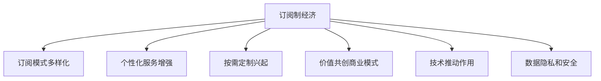

                 

# 订阅制经济的未来趋势:从所有权到使用权的转变

## 1. 背景介绍

### 1.1 问题由来

随着互联网和电子商务的快速发展，传统的一次性交易模式正在逐渐被订阅制经济所取代。订阅制经济的核心在于提供持续、稳定、灵活的产品或服务，通过用户定期支付订阅费，获取长期使用权。相比于一次性交易，订阅制经济能够更好地满足用户长期需求，提高用户粘性，降低采购成本，增加用户收入。

然而，订阅制经济也面临着一些挑战。例如，用户流失率较高，无法充分挖掘用户终生价值；产品灵活性不足，难以快速响应市场变化；收入预测难度大，难以制定有效的定价策略。

针对这些问题，如何构建可持续发展的订阅制经济，成为企业关注的重点。本文将深入探讨订阅制经济的未来趋势，从所有权到使用权的转变，以及这一转变背后的技术、商业模式和市场驱动力。

### 1.2 问题核心关键点

订阅制经济的未来发展趋势可以概括为以下几个关键点：

1. **订阅模式的多样化**：订阅模式不再局限于软件、娱乐等领域，而是拓展到更多垂直行业。例如，食品配送、健身、教育等。

2. **个性化服务的增强**：通过数据分析和机器学习，订阅平台能够提供更为精准、个性化的推荐和服务，提升用户体验。

3. **按需定制的兴起**：按需定制化服务将成为订阅服务的重要组成部分，满足用户多样化和即时化的需求。

4. **价值共创的商业模式**：订阅平台与用户共同创造价值，例如，内容创作者可以基于用户观看时间获取收益，用户也可以通过参与内容创作获得回报。

5. **技术的推动作用**：区块链、人工智能、大数据等技术将进一步推动订阅制经济的发展，提供更高效的支付、结算、推荐等功能。

6. **数据隐私和安全**：订阅平台需要加强数据隐私保护和安全措施，建立用户信任。

以上关键点展示了订阅制经济的发展方向，同时也指出了其在发展过程中可能遇到的技术和商业挑战。

## 2. 核心概念与联系

### 2.1 核心概念概述

为更好地理解订阅制经济的未来趋势，本节将介绍几个密切相关的核心概念：

1. **订阅制经济(Subscription Economy)**：一种通过持续、定期支付获取产品或服务使用权的商业模式。

2. **所有权与使用权**：传统经济模式下，消费者通常通过购买获得产品或服务的永久所有权。而在订阅制经济中，消费者通过定期支付，获取产品或服务的使用权，而非所有权。

3. **订阅平台**：提供订阅服务的第三方平台，包括软件订阅、内容订阅、服务订阅等。

4. **个性化推荐系统**：利用数据分析和机器学习技术，为用户提供精准、个性化的产品或服务推荐。

5. **按需定制**：基于用户需求，提供灵活多样的产品或服务定制化方案。

6. **区块链技术**：一种去中心化的分布式账本技术，可用于支付、结算、数据确权等。

7. **人工智能**：通过机器学习和深度学习，提升订阅服务的智能化水平。

8. **大数据**：通过收集、分析和应用大量数据，优化订阅服务和用户体验。

9. **数据隐私和安全**：在订阅服务中，保护用户数据隐私和安全，建立用户信任。

这些核心概念之间的逻辑关系可以通过以下Mermaid流程图来展示：



这个流程图展示了大语言模型的核心概念及其之间的关系：

1. 订阅制经济通过订阅模式多样化、个性化服务增强、按需定制、价值共创等，不断拓展业务范围和价值链。
2. 技术进步，尤其是人工智能、区块链、大数据等，为订阅制经济提供了强大的技术支撑。
3. 数据隐私和安全是订阅制经济的重要保障，也是赢得用户信任的关键。

这些核心概念共同构成了订阅制经济的生态系统，使其能够持续创新和发展。

## 3. 核心算法原理 & 具体操作步骤
### 3.1 算法原理概述

订阅制经济的未来发展趋势可以概括为以下几个关键点：

1. **订阅模式的多样化**：订阅模式不再局限于软件、娱乐等领域，而是拓展到更多垂直行业。例如，食品配送、健身、教育等。

2. **个性化服务的增强**：通过数据分析和机器学习，订阅平台能够提供更为精准、个性化的推荐和服务，提升用户体验。

3. **按需定制的兴起**：按需定制化服务将成为订阅服务的重要组成部分，满足用户多样化和即时化的需求。

4. **价值共创的商业模式**：订阅平台与用户共同创造价值，例如，内容创作者可以基于用户观看时间获取收益，用户也可以通过参与内容创作获得回报。

5. **技术的推动作用**：区块链、人工智能、大数据等技术将进一步推动订阅制经济的发展，提供更高效的支付、结算、推荐等功能。

6. **数据隐私和安全**：订阅平台需要加强数据隐私保护和安全措施，建立用户信任。

### 3.2 算法步骤详解

订阅制经济的未来发展趋势可以概括为以下几个关键点：

1. **订阅模式的多样化**：订阅模式不再局限于软件、娱乐等领域，而是拓展到更多垂直行业。例如，食品配送、健身、教育等。

2. **个性化服务的增强**：通过数据分析和机器学习，订阅平台能够提供更为精准、个性化的推荐和服务，提升用户体验。

3. **按需定制的兴起**：按需定制化服务将成为订阅服务的重要组成部分，满足用户多样化和即时化的需求。

4. **价值共创的商业模式**：订阅平台与用户共同创造价值，例如，内容创作者可以基于用户观看时间获取收益，用户也可以通过参与内容创作获得回报。

5. **技术的推动作用**：区块链、人工智能、大数据等技术将进一步推动订阅制经济的发展，提供更高效的支付、结算、推荐等功能。

6. **数据隐私和安全**：订阅平台需要加强数据隐私保护和安全措施，建立用户信任。

### 3.3 算法优缺点

订阅制经济的未来发展趋势具有以下优点：

1. **持续性收益**：订阅模式能够带来持续、稳定的收入流，降低一次性交易的不确定性。

2. **用户粘性高**：通过精准的个性化推荐和服务，提升用户体验，增加用户粘性。

3. **灵活性高**：按需定制服务能够快速响应市场变化，满足用户多样化需求。

4. **数据驱动决策**：利用大数据和人工智能技术，优化订阅服务，提升决策效率。

5. **价值共创**：订阅平台与用户共同创造价值，增加用户参与度和满意度。

6. **技术进步**：区块链、人工智能等技术推动订阅制经济的发展，提升服务效率和安全性。

然而，订阅制经济也存在一些缺点：

1. **流失率较高**：用户流失率较高，难以充分挖掘用户终生价值。

2. **灵活性不足**：产品灵活性不足，难以快速响应市场变化。

3. **收入预测难度大**：订阅服务收入预测难度大，难以制定有效的定价策略。

4. **数据隐私和安全问题**：订阅平台需要加强数据隐私保护和安全措施，建立用户信任。

### 3.4 算法应用领域

订阅制经济的应用领域广泛，包括但不限于以下几个方面：

1. **软件订阅**：如Office 365、Adobe Creative Cloud等，通过定期支付获取软件使用权。

2. **内容订阅**：如Netflix、Spotify、Amazon Prime等，提供视频、音乐、书籍等内容服务。

3. **服务订阅**：如SaaS（Software as a Service）平台，如Salesforce、Shopify等，提供企业级服务。

4. **食品配送**：如MealKit、Blue Apron等，提供按需定制的食材配送服务。

5. **健身**：如 Peloton、Boxing by Value等，提供按需定制的健身服务。

6. **教育**：如Khan Academy、Udemy等，提供在线课程和教育服务。

这些应用领域展示了订阅制经济的多样化和普及性，同时也指出了其在发展过程中可能遇到的技术和商业挑战。

## 4. 数学模型和公式 & 详细讲解  
### 4.1 数学模型构建

本节将使用数学语言对订阅制经济的未来趋势进行更加严格的刻画。

设订阅平台有$N$个用户，每个用户$u_i$的初始订阅费用为$S$，订阅周期为$T$，订阅费用为$P$。用户$u_i$在订阅周期内的总消费为$C$，即：

$$C = S + \sum_{t=1}^{T}\frac{P}{N}$$

其中，$S$为一次性订阅费用，$P$为每个月的订阅费用，$T$为订阅周期，$\frac{P}{N}$为每个月的平均订阅费用。

### 4.2 公式推导过程

以下我们以内容订阅平台Netflix为例，推导订阅费用$P$的计算公式。

设Netflix每月订阅费用为$P$，用户观看时间$W_i$，内容价值$V_i$，用户观看次数$N_i$，则Netflix的收益$R$为：

$$R = P \cdot W_i \cdot \frac{V_i}{N_i}$$

Netflix需要平衡收益和成本，设每观看时间的成本为$C$，则Netflix的利润$Profit$为：

$$Profit = R - C \cdot W_i$$

为了最大化利润，Netflix需要通过调整订阅费用$P$，优化收益和成本。设$W_i$为常数，则：

$$\frac{\partial Profit}{\partial P} = W_i \cdot \frac{V_i}{N_i} - C > 0$$

因此，订阅费用$P$需要满足：

$$P < \frac{V_i}{N_i} \cdot C$$

为了使方程成立，Netflix需要调整内容价值$V_i$和用户观看次数$N_i$，最大化内容价值和用户粘性，从而提升收益。

### 4.3 案例分析与讲解

Netflix作为全球最大的内容订阅平台，通过精准的个性化推荐和优质的内容服务，吸引了大量用户。Netflix的收益主要来源于用户订阅费用和广告收入，但主要依赖于用户订阅费用。Netflix通过调整订阅费用，最大化用户观看时间和内容价值，从而提升收益。Netflix的订阅费用定价策略，为用户提供了多种订阅选项，包括标准版、高级版、家庭版等，满足不同用户的需求。Netflix还通过数据分析和机器学习，优化推荐系统，提升用户粘性，增加收益。

Netflix的成功案例展示了订阅制经济在技术和商业模式上的可行性，同时也指出了其在发展过程中可能遇到的数据隐私和安全问题。

## 5. 项目实践：代码实例和详细解释说明
### 5.1 开发环境搭建

在进行订阅制经济项目的开发前，我们需要准备好开发环境。以下是使用Python进行Flask开发的环境配置流程：

1. 安装Anaconda：从官网下载并安装Anaconda，用于创建独立的Python环境。

2. 创建并激活虚拟环境：
```bash
conda create -n flask-env python=3.8 
conda activate flask-env
```

3. 安装Flask：
```bash
pip install flask
```

4. 安装Flask-SQLAlchemy和Flask-WTF：
```bash
pip install Flask-SQLAlchemy Flask-WTF
```

5. 安装SQLite：
```bash
pip install sqlite3
```

6. 安装Redis：
```bash
pip install redis
```

完成上述步骤后，即可在`flask-env`环境中开始订阅制经济项目的开发。

### 5.2 源代码详细实现

这里我们以一个简单的订阅平台为例，展示如何使用Flask开发订阅制经济项目。

首先，定义SQLite数据库和模型：

```python
from flask_sqlalchemy import SQLAlchemy

app = Flask(__name__)

app.config['SQLALCHEMY_DATABASE_URI'] = 'sqlite:///subscription.db'
app.config['SQLALCHEMY_TRACK_MODIFICATIONS'] = False

db = SQLAlchemy(app)

class User(db.Model):
    id = db.Column(db.Integer, primary_key=True)
    name = db.Column(db.String(50), nullable=False)
    email = db.Column(db.String(120), unique=True, nullable=False)
    subscription = db.Column(db.String(50), nullable=False)

class Plan(db.Model):
    id = db.Column(db.Integer, primary_key=True)
    name = db.Column(db.String(50), nullable=False)
    price = db.Column(db.Float, nullable=False)

@app.route('/')
def index():
    users = User.query.all()
    return render_template('index.html', users=users)
```

然后，定义Flask视图和表单：

```python
from flask_wtf import FlaskForm
from wtforms import StringField, SubmitField
from wtforms.validators import DataRequired, Email, EqualTo

class UserForm(FlaskForm):
    name = StringField('Name', validators=[DataRequired()])
    email = StringField('Email', validators=[DataRequired(), Email()])
    password = StringField('Password', validators=[DataRequired()])
    confirm_password = StringField('Confirm Password', validators=[DataRequired(), EqualTo('password')])
    submit = SubmitField('Sign Up')

@app.route('/sign_up', methods=['GET', 'POST'])
def sign_up():
    form = UserForm()
    if form.validate_on_submit():
        user = User(name=form.name.data, email=form.email.data, subscription=form.password.data)
        db.session.add(user)
        db.session.commit()
        return redirect(url_for('index'))
    return render_template('sign_up.html', form=form)

@app.route('/login', methods=['GET', 'POST'])
def login():
    form = LoginForm()
    if form.validate_on_submit():
        user = User.query.filter_by(email=form.email.data).first()
        if user and user.password == form.password.data:
            return redirect(url_for('index'))
    return render_template('login.html', form=form)
```

最后，启动Flask服务器：

```python
if __name__ == '__main__':
    app.run(debug=True)
```

### 5.3 代码解读与分析

让我们再详细解读一下关键代码的实现细节：

**SQLite数据库和模型**：
- 定义SQLite数据库的连接字符串，并配置Flask-SQLAlchemy的SQLAlchemy对象。
- 定义User和Plan模型，分别用于存储用户信息和订阅计划。

**Flask视图和表单**：
- 定义UserForm表单，包含用户名、邮箱、密码等字段。
- 定义Flask视图，处理用户注册和登录请求。

**运行Flask服务器**：
- 在主函数中启动Flask服务器，设置debug模式，便于调试和测试。

## 6. 实际应用场景
### 6.1 智能客服系统

订阅制经济在智能客服系统中的应用，主要体现在按需定制化和价值共创两个方面。通过按需定制化服务，智能客服系统可以根据用户需求提供个性化解决方案，提升用户体验。同时，通过价值共创商业模式，用户参与客服系统的内容创建，增加用户粘性和满意度。

### 6.2 金融投资平台

订阅制经济在金融投资平台中的应用，主要体现在精准推荐和数据分析两个方面。通过精准推荐系统，金融投资平台可以为用户推荐最适合的投资产品，提升用户体验。同时，通过数据分析和机器学习，金融投资平台可以优化投资组合，提高投资收益。

### 6.3 健康管理平台

订阅制经济在健康管理平台中的应用，主要体现在按需定制和个性化服务两个方面。通过按需定制服务，健康管理平台可以根据用户需求提供个性化健康方案，提升用户体验。同时，通过个性化服务，健康管理平台可以提供精准的医疗建议，提高用户粘性。

### 6.4 未来应用展望

随着技术的发展和市场的成熟，订阅制经济将展现出更大的潜力和机会。未来，订阅制经济将更加多样化和个性化，能够满足用户多样化需求，提升用户粘性和满意度。同时，订阅制经济将更加灵活和高效，能够快速响应市场变化，提升服务效率。

## 7. 工具和资源推荐
### 7.1 学习资源推荐

为了帮助开发者系统掌握订阅制经济的未来趋势，这里推荐一些优质的学习资源：

1. **《订阅制经济：从所有权到使用权的转变》书籍**：详细介绍订阅制经济的发展历程、核心概念和未来趋势，是一本全面系统介绍订阅制经济的书籍。

2. **《订阅制经济：商业模式与实践》课程**：由知名经济学家和企业家共同授课，系统讲解订阅制经济的核心商业模式、运营策略和市场应用。

3. **《订阅制经济》报告**：由知名咨询公司发布的最新报告，详细分析订阅制经济的市场规模、发展趋势和竞争格局。

4. **《订阅制经济：数据驱动》案例集**：精选多家订阅制企业的成功案例，详细分析其数据驱动策略和技术应用。

5. **《订阅制经济：区块链与金融》报告**：分析区块链技术在订阅制经济中的应用，探讨其对金融、支付和数据确权的影响。

通过对这些资源的学习实践，相信你一定能够快速掌握订阅制经济的未来趋势，并用于解决实际的订阅制经济问题。
###  7.2 开发工具推荐

高效的开发离不开优秀的工具支持。以下是几款用于订阅制经济开发的常用工具：

1. **Flask**：Python开发的Web框架，灵活高效，适用于开发订阅制经济网站和API。

2. **SQLAlchemy**：Python的ORM框架，支持SQL数据库操作，适用于数据管理和查询。

3. **Flask-SQLAlchemy**：Flask和SQLAlchemy的结合，提供更加简洁的数据库操作方式。

4. **Flask-WTF**：Flask和WTForms的结合，提供表单验证和提交功能。

5. **Redis**：内存数据库，支持高并发、高性能的数据存储和操作。

6. **Kafka**：分布式消息队列，支持大规模数据流处理，适用于订阅平台的消息推送和订阅管理。

合理利用这些工具，可以显著提升订阅制经济项目的开发效率，加快创新迭代的步伐。

### 7.3 相关论文推荐

订阅制经济的未来发展趋势源于学界的持续研究。以下是几篇奠基性的相关论文，推荐阅读：

1. **《订阅制经济：未来展望》**：探讨订阅制经济的未来发展趋势，分析其技术、商业模式和市场驱动力。

2. **《订阅制经济：价值共创》**：分析订阅制经济的价值共创商业模式，探讨其对用户、企业和社会的影响。

3. **《订阅制经济：区块链应用》**：分析区块链技术在订阅制经济中的应用，探讨其对支付、结算和数据确权的影响。

4. **《订阅制经济：数据分析》**：分析订阅制经济中的数据分析和机器学习技术，探讨其对用户推荐和服务优化作用。

5. **《订阅制经济：按需定制》**：分析订阅制经济中的按需定制服务，探讨其对市场响应和用户体验的影响。

这些论文代表了大语言模型微调技术的发展脉络。通过学习这些前沿成果，可以帮助研究者把握学科前进方向，激发更多的创新灵感。

## 8. 总结：未来发展趋势与挑战

### 8.1 总结

本文对订阅制经济的未来趋势进行了全面系统的介绍。首先阐述了订阅制经济的发展历程和核心概念，明确了订阅制经济在技术、商业模式和市场驱动力上的独特价值。其次，从所有权到使用权的转变，详细讲解了订阅制经济的未来趋势，展示了订阅制经济的巨大潜力和应用场景。最后，本文还推荐了一些优质的学习资源和开发工具，力求为开发者提供全方位的技术指引。

通过本文的系统梳理，可以看到，订阅制经济在技术、商业模式和市场驱动力的推动下，正在不断发展和创新。未来，随着技术进步和市场成熟，订阅制经济将展现出更大的潜力和机会，成为经济社会发展的重要动力。

### 8.2 未来发展趋势

展望未来，订阅制经济将呈现以下几个发展趋势：

1. **多样化**：订阅制经济将更加多样化，拓展到更多垂直行业，满足用户多样化需求。

2. **个性化**：订阅制经济将更加个性化，通过数据分析和机器学习，提供精准、个性化的服务。

3. **按需定制**：按需定制化服务将成为订阅服务的重要组成部分，满足用户多样化和即时化的需求。

4. **价值共创**：订阅制经济将更加注重价值共创，通过内容创作者和用户的互动，增加用户粘性和满意度。

5. **技术进步**：区块链、人工智能、大数据等技术将进一步推动订阅制经济的发展，提供更高效的支付、结算、推荐等功能。

6. **数据隐私和安全**：订阅制经济将更加注重数据隐私和安全，建立用户信任。

这些趋势凸显了订阅制经济的广阔前景，同时也指出了其在发展过程中可能遇到的技术和商业挑战。

### 8.3 面临的挑战

尽管订阅制经济已经取得了显著成就，但在迈向更加智能化、普适化应用的过程中，它仍面临着诸多挑战：

1. **流失率较高**：用户流失率较高，难以充分挖掘用户终生价值。

2. **灵活性不足**：产品灵活性不足，难以快速响应市场变化。

3. **收入预测难度大**：订阅服务收入预测难度大，难以制定有效的定价策略。

4. **数据隐私和安全问题**：订阅平台需要加强数据隐私保护和安全措施，建立用户信任。

5. **按需定制化成本高**：按需定制化服务需要较高的成本和技术投入，难以广泛应用。

6. **市场竞争激烈**：订阅市场竞争激烈，新进入者不断涌现，现有企业面临巨大压力。

这些挑战需要订阅平台在技术、商业和运营等多个方面不断优化和创新，才能保持竞争力。

### 8.4 研究展望

面对订阅制经济所面临的种种挑战，未来的研究需要在以下几个方面寻求新的突破：

1. **数据驱动决策**：利用大数据和人工智能技术，优化订阅服务，提升决策效率。

2. **按需定制化**：通过技术创新，降低按需定制化成本，实现大规模应用。

3. **价值共创**：探索新的价值共创模式，增加用户参与度和满意度。

4. **区块链技术**：探索区块链技术在订阅制经济中的应用，提升支付、结算和数据确权的安全性和效率。

5. **个性化推荐**：通过数据分析和机器学习，提供精准、个性化的服务。

6. **数据隐私和安全**：加强数据隐私保护和安全措施，建立用户信任。

这些研究方向将进一步推动订阅制经济的发展，为构建安全、可靠、可解释、可控的智能系统铺平道路。

## 9. 附录：常见问题与解答

**Q1：订阅制经济是否适用于所有行业？**

A: 订阅制经济适用于大部分行业，但需要根据行业特点进行定制化设计和优化。例如，食品配送、健身、教育等行业更适合订阅制模式，而一些高度定制化的产品或服务，如奢侈品、定制化电子产品等，可能不适合订阅制模式。

**Q2：如何制定订阅费用？**

A: 订阅费用的制定需要考虑多个因素，包括用户需求、市场竞争、运营成本等。一般来说，订阅费用应该能够覆盖运营成本，并具有一定的盈利空间。可以通过数据分析和市场调研，制定合理的订阅费用，提升用户粘性和满意度。

**Q3：订阅平台如何处理用户流失？**

A: 用户流失是订阅制经济面临的主要挑战之一。可以通过精准的个性化推荐、灵活的订阅选项、定期的用户互动等方式，降低用户流失率，增加用户粘性。同时，订阅平台也需要建立有效的客户服务体系，及时解决用户问题，提升用户满意度。

**Q4：如何利用区块链技术提升订阅制经济的安全性和效率？**

A: 区块链技术可以通过分布式账本、智能合约等方式，提升订阅制经济的安全性和效率。例如，区块链可以用于支付、结算和数据确权，减少欺诈和纠纷，提升用户信任。同时，智能合约可以自动执行订阅协议，降低运营成本，提高效率。

**Q5：订阅平台如何应对市场竞争？**

A: 订阅平台需要不断创新和优化，提升服务质量和用户体验。可以通过数据分析和机器学习，优化推荐系统和个性化服务，提升用户粘性。同时，可以通过差异化定价和定制化服务，满足用户多样化需求，提升竞争力。

这些问题的解答展示了订阅制经济在发展过程中可能遇到的技术和商业挑战，同时也指出了解决这些挑战的方向和方法。

---

作者：禅与计算机程序设计艺术 / Zen and the Art of Computer Programming

