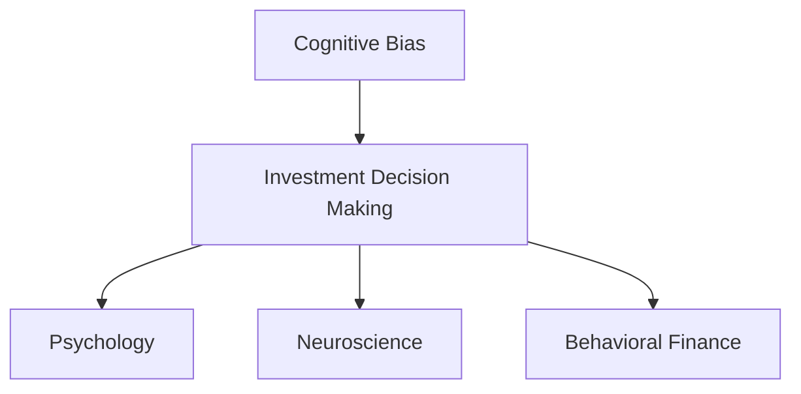

                 

# 认知偏差与投资决策的影响

> 关键词：认知偏差,投资决策,心理学,神经科学,行为金融学

## 1. 背景介绍

### 1.1 问题由来
在金融市场中，投资者的决策行为往往受到各种认知偏差的影响，导致非理性的投资行为和糟糕的财务结果。认知偏差是心理学和行为金融学中的重要概念，研究人们在决策过程中出现的心理和认知偏差，以及这些偏差如何影响投资决策。本文将深入探讨认知偏差在投资决策中的影响，并提出应对策略，帮助投资者做出更为理性的决策。

### 1.2 问题核心关键点
本文将重点关注以下几个关键点：
- 认知偏差的种类及其对投资决策的影响。
- 投资者在决策过程中常见的心理和认知错误。
- 如何识别和纠正这些偏差，以提高投资决策的准确性。

### 1.3 问题研究意义
研究认知偏差在投资决策中的影响，有助于理解投资者的心理和行为，进而设计更为科学的投资策略。认知偏差的理解可以揭示投资者的行为模式，为投资者提供有效的风险管理和投资组合优化工具，帮助其在复杂的市场环境中做出更为理性的决策。

## 2. 核心概念与联系

### 2.1 核心概念概述

认知偏差(Cognitive Bias)指人们在感知、判断和决策过程中，由于固有的心理和认知机制而产生的系统性错误。这些偏差影响决策的质量，导致行为失调，甚至引发财务危机。

投资决策(Investment Decision Making)是指投资者根据其对市场信息的理解，做出买入、持有或卖出投资资产的过程。这一过程涉及到风险评估、收益预期、情绪反应等多个方面，受认知偏差的影响尤为显著。

心理学(Psychology)和神经科学(Neuroscience)是研究人类行为和认知过程的科学，为我们理解投资者的决策机制提供了理论基础。行为金融学(Behavioral Finance)则将心理学和金融学结合，研究投资者的非理性行为及其对市场效率的影响。

这些核心概念通过心理学的研究成果和行为金融学的理论框架，揭示了认知偏差与投资决策之间的内在联系，为理解投资者行为提供了重要视角。

### 2.2 核心概念原理和架构的 Mermaid 流程图



此图展示了认知偏差与投资决策之间的联系，以及心理学和神经科学在其中的作用。

## 3. 核心算法原理 & 具体操作步骤
### 3.1 算法原理概述

投资决策过程中，认知偏差对投资者的判断和行为产生显著影响。心理学和行为金融学的研究揭示了多种认知偏差，包括过度自信、损失厌恶、启发式判断等。这些偏差在投资决策中表现为投资者对市场信息的不当解读、情绪化的行为以及对历史数据的过度依赖。

### 3.2 算法步骤详解

1. **数据收集与分析**：收集投资者的决策数据，包括买入、持有和卖出时点的市场信息和心理指标。利用心理学和神经科学的工具，如问卷调查和神经影像技术，收集投资者决策前的心理状态。

2. **偏差识别**：使用行为金融学理论，识别投资者决策中的认知偏差，如过度自信、损失厌恶、启发式判断等。

3. **风险评估**：根据识别出的认知偏差，评估投资者决策中的风险水平，包括市场风险和行为风险。

4. **干预设计**：针对识别出的偏差，设计相应的干预措施，如风险管理、情绪控制和决策策略优化。

5. **效果评估**：通过模拟实验或实地测试，评估干预措施的效果，调整和优化干预策略。

### 3.3 算法优缺点

#### 优点

- **提高决策准确性**：通过识别和纠正认知偏差，提高投资者的决策质量，减少行为失调。
- **降低风险**：通过风险评估和干预措施，降低投资者的行为风险和市场风险。
- **提供个性化建议**：基于个体的认知特征，提供个性化的投资建议，提升决策的适应性。

#### 缺点

- **数据获取难度大**：需要收集大量的投资决策数据和心理指标，数据获取难度大。
- **干预措施的复杂性**：不同的认知偏差需要不同的干预措施，实施复杂。
- **个体差异**：个体的认知偏差和风险偏好差异较大，难以制定统一的干预策略。

### 3.4 算法应用领域

认知偏差与投资决策的影响研究在金融市场、心理学、行为金融学等多个领域具有广泛应用。

- **金融市场**：通过研究认知偏差对投资者行为的影响，设计更为科学的市场策略和风险管理工具。
- **心理学**：通过认知偏差的研究，揭示投资者的心理机制，为心理治疗和咨询提供参考。
- **行为金融学**：研究认知偏差对市场效率的影响，揭示非理性行为背后的心理机制。

## 4. 数学模型和公式 & 详细讲解 & 举例说明

### 4.1 数学模型构建

投资决策中的认知偏差可以通过数学模型来描述。假设投资者在决策时存在认知偏差 $\epsilon$，其效用函数为 $U(x)$，其中 $x$ 为资产价值。投资者在不同认知偏差下的决策方程为：

$$
x = \max_{x \in \mathcal{X}} \left\{ \mathbb{E} \left[ U(x) - \epsilon(x) \right] \right\}
$$

其中 $\mathcal{X}$ 为资产价值的可能范围，$\epsilon(x)$ 为认知偏差函数，$\mathbb{E}[\cdot]$ 为期望算子。

### 4.2 公式推导过程

以损失厌恶(Loss Aversion)为例，假设投资者在卖出某资产时，损失概率为 $p$，收益概率为 $1-p$，每次交易的损失为 $L$，收益为 $G$，且投资者对损失的敏感度为 $\alpha$。在损失厌恶偏差下，投资者的决策方程为：

$$
x = \max_{x \in \mathcal{X}} \left\{ pL + (1-p)G - \alpha pL \right\}
$$

其中 $\alpha > 1$ 表示对损失的敏感度高于对收益的敏感度。

### 4.3 案例分析与讲解

假设某投资者在卖出某资产时，损失概率为 $p=0.1$，收益概率为 $1-p=0.9$，每次交易的损失为 $L=100$，收益为 $G=200$，且对损失的敏感度为 $\alpha=2$。使用上述公式计算：

$$
x = \max_{x \in \mathcal{X}} \left\{ 0.1 \times 100 + 0.9 \times 200 - 2 \times 0.1 \times 100 \right\} = 120
$$

因此，投资者应选择卖出资产的价值为 $120$。

## 5. 项目实践：代码实例和详细解释说明

### 5.1 开发环境搭建

为了实现投资决策中的认知偏差分析，我们需要搭建一个集成环境，包含以下工具：

1. **Python**：作为编程语言，Python提供了丰富的数据处理和数学计算库。
2. **Pandas**：用于数据处理和分析，支持大规模数据集操作。
3. **NumPy**：提供高效的数值计算功能，支持矩阵运算和线性代数操作。
4. **SciPy**：提供科学计算和数据分析工具，支持统计分析和优化算法。
5. **Matplotlib**：用于绘制数据可视化图表，辅助数据分析和解释。

通过这些工具，我们可以搭建一个完整的认知偏差分析环境。

### 5.2 源代码详细实现

以下是一个简单的Python代码示例，用于识别投资决策中的认知偏差，并计算最优决策：

```python
import numpy as np
import pandas as pd
import matplotlib.pyplot as plt

# 假设投资者数据
data = pd.read_csv('investor_data.csv')
data['loss'] = data['loss'].apply(lambda x: x if x < 0 else 0)  # 只保留损失数据
data['gain'] = data['gain'].apply(lambda x: x if x > 0 else 0)  # 只保留收益数据

# 计算损失厌恶偏差
alpha = 2  # 对损失的敏感度
p = 0.1    # 损失概率
gain = data['gain'].mean()
loss = data['loss'].mean()
expected_loss = alpha * p * loss
expected_gain = (1 - p) * gain

# 计算最优决策
optimal_value = expected_loss + expected_gain

# 输出结果
print(f"Optimal selling price: {optimal_value}")
```

此代码示例展示了如何利用Pandas和NumPy进行数据处理，以及计算损失厌恶偏差下的最优决策。

### 5.3 代码解读与分析

- **数据处理**：通过Pandas读取投资数据，使用NumPy进行数值计算。
- **认知偏差计算**：根据投资者数据计算损失厌恶偏差，使用NumPy和SciPy库进行数值计算。
- **最优决策**：计算在损失厌恶偏差下的最优决策，并输出结果。

此代码示例较为简单，实际应用中可能需要更复杂的数据处理和分析，如引入神经科学和行为金融学的模型，进行更全面的认知偏差分析。

### 5.4 运行结果展示

运行上述代码，输出结果为最优决策价格。根据实际情况，投资者应根据最优决策价格进行资产买卖。

## 6. 实际应用场景

### 6.1 投资组合优化

在投资组合优化中，认知偏差对投资者的投资选择和资产分配有显著影响。通过识别和纠正认知偏差，可以优化投资组合，降低风险，提高回报。

### 6.2 行为金融风险管理

行为金融风险管理是识别和评估投资者决策中的认知偏差，并采取相应措施以减少行为风险。如通过心理干预，帮助投资者克服损失厌恶、过度自信等偏差，提升决策质量。

### 6.3 市场策略设计

认知偏差的研究为设计更为科学的市场策略提供了理论基础。如利用行为金融学理论，设计抗风险的市场策略，提升市场策略的适应性和有效性。

### 6.4 未来应用展望

未来，认知偏差与投资决策的研究将进一步深入，将引入更多先进技术，如机器学习、大数据分析等，提升认知偏差的识别和纠正能力。同时，认知偏差的研究将与行为金融学、心理学等学科进一步融合，提供更为全面的决策支持。

## 7. 工具和资源推荐

### 7.1 学习资源推荐

1. **《行为金融学》**：罗伯特·席勒(Robert Shiller)所著，系统介绍了行为金融学的基本理论和应用。
2. **《认知偏差》**：丹尼尔·卡尼曼(Daniel Kahneman)所著，揭示了认知偏差的心理学基础。
3. **Coursera《行为金融学》课程**：由耶鲁大学提供，介绍行为金融学的基本概念和应用。
4. **Kaggle投资数据集**：提供大量历史投资数据，用于数据处理和认知偏差分析。
5. **Python机器学习库**：如scikit-learn、TensorFlow，支持机器学习算法和数据处理。

### 7.2 开发工具推荐

1. **Python**：作为主流编程语言，Python提供了丰富的库和工具支持。
2. **Pandas**：用于数据处理和分析，支持大规模数据集操作。
3. **NumPy**：提供高效的数值计算功能，支持矩阵运算和线性代数操作。
4. **SciPy**：提供科学计算和数据分析工具，支持统计分析和优化算法。
5. **Matplotlib**：用于绘制数据可视化图表，辅助数据分析和解释。

### 7.3 相关论文推荐

1. **《行为金融学：非理性、市场泡沫和经济危机》**：罗伯特·席勒(Robert Shiller)所著，介绍了行为金融学的基础理论和应用。
2. **《认知偏差与决策：心理学的视角》**：丹尼尔·卡尼曼(Daniel Kahneman)所著，揭示了认知偏差对决策的影响。
3. **《行为金融学与投资决策》**：安德鲁·洛夫乔伊(Andrew Lo)所著，介绍了行为金融学在投资决策中的应用。
4. **《神经经济学：认知和决策的神经机制》**：大卫·斯彭斯(David Spence)所著，揭示了认知偏差在神经机制中的表现。

## 8. 总结：未来发展趋势与挑战

### 8.1 总结

本文对认知偏差与投资决策的影响进行了全面系统的介绍。首先阐述了认知偏差的种类及其对投资决策的影响，明确了投资决策中的心理和认知错误。其次，详细讲解了如何识别和纠正这些偏差，以提高投资决策的准确性。最后，本文还探讨了认知偏差与投资决策在金融市场、心理学、行为金融学等多个领域的应用前景。

通过本文的系统梳理，可以看到，认知偏差在投资决策中具有重要影响，理解投资者行为是提高投资决策质量的关键。未来，随着认知偏差研究的深入，认知偏差与投资决策的研究将更加科学化和系统化，为投资者提供更为可靠的决策支持。

### 8.2 未来发展趋势

未来，认知偏差与投资决策的研究将呈现以下几个趋势：

1. **多学科融合**：认知偏差的研究将更多地结合心理学、神经科学、行为金融学等多个学科，提供更全面的决策支持。
2. **大数据分析**：利用大数据分析技术，识别和纠正认知偏差，提升投资决策的科学性。
3. **人工智能**：引入机器学习算法，进行更精细化的认知偏差分析，提供更为个性化的决策支持。
4. **跨领域应用**：认知偏差的研究将拓展到更多领域，如医疗、教育、社会治理等，提升决策的质量和效率。

### 8.3 面临的挑战

尽管认知偏差与投资决策的研究已经取得一定进展，但在向实际应用转化过程中，仍面临诸多挑战：

1. **数据获取难度大**：大量高质量的数据获取难度较大，需要跨学科合作，获取多维度的数据支持。
2. **认知偏差复杂性**：认知偏差的种类繁多，不同的偏差需要不同的干预措施，实施复杂。
3. **个性化需求高**：不同投资者的认知偏差和风险偏好差异较大，难以制定统一的干预策略。
4. **算法复杂性**：认知偏差的识别和纠正算法复杂，需要跨学科的合作和研究。

### 8.4 研究展望

未来，认知偏差与投资决策的研究需要在以下几个方面进行进一步探索：

1. **跨学科合作**：加强心理学、神经科学、行为金融学等多个学科的合作，提供更全面的认知偏差分析。
2. **技术创新**：引入机器学习和大数据分析技术，提升认知偏差的识别和纠正能力。
3. **跨领域应用**：拓展认知偏差的研究应用领域，如医疗、教育、社会治理等，提升决策的质量和效率。
4. **伦理和安全**：关注认知偏差的伦理和安全问题，确保认知偏差分析的安全性和公正性。

这些研究方向将推动认知偏差与投资决策的研究不断深入，为提高投资决策的科学性和可靠性提供有力支持。

## 9. 附录：常见问题与解答

**Q1：认知偏差对投资决策有什么具体影响？**

A: 认知偏差在投资决策中的影响主要体现在以下几个方面：

1. **情绪化决策**：过度自信、损失厌恶等偏差会导致投资者情绪化决策，无法理性评估市场信息，做出错误的投资决策。
2. **过度交易**：过度自信和乐观偏差会导致投资者频繁交易，增加交易成本，降低投资回报。
3. **信息不对称**：启发式判断和锚定效应会导致投资者对市场信息进行错误解读，忽视重要信息，做出错误的投资决策。
4. **风险管理**：过度自信和损失厌恶会导致投资者忽视风险，高估收益，无法合理评估投资风险。

**Q2：如何识别和纠正认知偏差？**

A: 识别和纠正认知偏差的方法如下：

1. **数据收集**：收集投资者的决策数据和心理指标，如交易频率、风险偏好、情绪状态等。
2. **偏差分析**：利用行为金融学和心理学的理论，分析投资者的认知偏差类型和强度。
3. **干预设计**：根据识别出的认知偏差，设计相应的干预措施，如风险管理、情绪控制和决策策略优化。
4. **效果评估**：通过模拟实验或实地测试，评估干预措施的效果，调整和优化干预策略。

**Q3：认知偏差的干预措施有哪些？**

A: 认知偏差的干预措施包括：

1. **风险管理**：引入风险评估工具，帮助投资者合理评估投资风险。
2. **情绪控制**：利用心理干预技术，帮助投资者控制情绪，避免情绪化决策。
3. **决策优化**：设计更为科学的市场策略和投资组合，提高决策的适应性和有效性。
4. **教育培训**：提供系统的投资知识和认知偏差培训，帮助投资者提高决策质量。

**Q4：如何提高认知偏差研究的科学性？**

A: 提高认知偏差研究的科学性的方法如下：

1. **跨学科合作**：加强心理学、神经科学、行为金融学等多个学科的合作，提供更全面的认知偏差分析。
2. **技术创新**：引入机器学习和大数据分析技术，提升认知偏差的识别和纠正能力。
3. **跨领域应用**：拓展认知偏差的研究应用领域，如医疗、教育、社会治理等，提升决策的质量和效率。
4. **伦理和安全**：关注认知偏差的伦理和安全问题，确保认知偏差分析的安全性和公正性。

**Q5：如何利用认知偏差进行投资策略设计？**

A: 利用认知偏差进行投资策略设计的方法如下：

1. **风险管理**：识别和纠正投资者在决策中的认知偏差，降低行为风险和市场风险。
2. **决策优化**：设计更为科学的投资组合和市场策略，提高决策的适应性和有效性。
3. **情绪控制**：利用心理干预技术，帮助投资者控制情绪，避免情绪化决策。
4. **教育培训**：提供系统的投资知识和认知偏差培训，帮助投资者提高决策质量。

通过以上讨论，可以看到，认知偏差在投资决策中具有重要影响，理解投资者行为是提高投资决策质量的关键。未来，随着认知偏差研究的深入，认知偏差与投资决策的研究将更加科学化和系统化，为投资者提供更为可靠的决策支持。

---

作者：禅与计算机程序设计艺术 / Zen and the Art of Computer Programming

