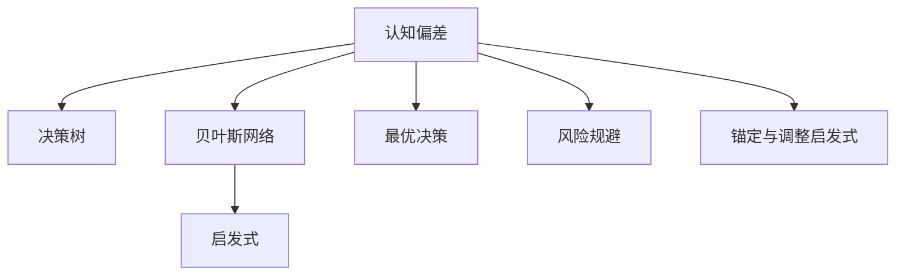

                 

# 认知偏见与决策：克服思维盲点的策略

> 关键词：认知偏见, 决策, 思维盲点, 策略, 认知偏差, 决策支持系统, 行为经济学

## 1. 背景介绍

### 1.1 问题由来
决策是一个复杂的过程，涉及到信息获取、认知加工、情感反应等多个环节。然而，人类的决策过程往往容易受到各种认知偏差的干扰，导致判断出现偏差，进而影响决策的合理性和科学性。决策中的认知偏差是一个经典的研究课题，在心理学、经济学、社会学等多个领域都有深入讨论。

在人工智能领域，认知偏差的研究也在逐渐受到关注。如何利用认知偏差的知识，改进决策支持系统，使其能够更准确地反映人类决策过程，是一个重要的问题。本文将深入探讨认知偏差的本质、表现形式以及如何克服这些偏差，以期为决策支持系统的设计提供新的思路。

### 1.2 问题核心关键点
认知偏差是指在决策过程中，个体由于心理、情绪、经验等因素的影响，导致信息处理、判断和决策出现系统性偏差的心理现象。常见的认知偏差包括但不限于：

- 可得性启发式：倾向于使用容易获取的信息进行决策，忽视统计规律。
- 锚定效应：决策受到最初信息的影响，难以摆脱。
- 确认偏误：倾向于寻找支持自己观点的信息，忽视反证。
- 过度自信：高估自己的判断准确性。
- 近因效应：最近的信息对决策有较大影响。
- 遗珠效应：过于关注某些信息，而忽视其他相关信息。

这些偏差会影响个体在各种情景下的判断和选择，可能导致决策失误。因此，如何识别和纠正认知偏差，提高决策的科学性和合理性，是当前研究的热点。

### 1.3 问题研究意义
研究认知偏差和决策中的思维盲点，对于改进决策支持系统、提升决策质量、促进个体和组织科学决策具有重要意义：

1. 改进决策支持系统：认知偏差的研究可以揭示人类决策的盲点和误区，为决策支持系统的设计提供指导，使其能够更准确地反映人类决策行为。
2. 提升决策质量：认知偏差的识别和纠正有助于提高个体和组织的决策质量，减少决策失误。
3. 促进科学决策：认知偏差的研究有助于更好地理解决策心理，推动科学决策方法的普及和应用。
4. 应用于行为经济学：认知偏差的研究与行为经济学密切相关，推动了经济学和心理学的交叉研究。

## 2. 核心概念与联系

### 2.1 核心概念概述

为更好地理解认知偏差及其在决策中的作用，本节将介绍几个密切相关的核心概念：

- 认知偏差(Cognitive Bias)：个体在信息处理和决策过程中出现的系统性偏差。
- 决策树(Decision Tree)：用于表示决策过程的树状结构，展示了不同决策路径和结果。
- 贝叶斯网络(Bayesian Network)：用于表示变量之间条件依赖关系的图形模型，可进行概率推断和因果分析。
- 启发式(Heuristic)：在复杂问题中，为了快速找到解决方案而使用的简化策略。
- 最优决策(Optimal Decision)：在给定条件下，能够最大化期望效用的决策。
- 风险规避(Risk Aversion)：个体倾向于避免不确定性，偏好确定结果。
- 锚定与调整启发式(Anchoring and Adjustment Heuristic)：在决策中，个体倾向于过度依赖最初信息，而后续调整往往不足。

这些核心概念之间的逻辑关系可以通过以下Mermaid流程图来展示：



这个流程图展示了一些核心概念及其之间的联系：

1. 认知偏差是决策过程中的内在因素，影响着决策树和贝叶斯网络的构建。
2. 启发式是在认知偏差作用下的一种决策策略，与最优决策相关。
3. 风险规避反映了人们对不确定性的态度，影响着决策的偏好。
4. 锚定与调整启发式是一种认知偏差，体现在决策过程中对初始信息的依赖。

这些概念共同构成了认知偏差和决策的理论框架，有助于深入理解人类决策的心理机制。

## 3. 核心算法原理 & 具体操作步骤
### 3.1 算法原理概述

认知偏差的克服，需要从识别偏差、分析偏差形成原因以及设计纠正措施三个层面进行。其中，识别和分析偏差是基础，设计纠正措施是关键。本节将从这三个层面详细介绍认知偏差克服的算法原理。

### 3.2 算法步骤详解

#### 3.2.1 识别偏差

识别认知偏差的过程，需要收集决策者的主观判断和实际结果，使用统计学方法分析判断与结果之间的偏差。常用的方法包括：

- 对比分析：对比决策者在不同情景下的判断结果，识别出具有一致性的偏差。
- 回归分析：使用回归模型分析判断与结果之间的线性关系，揭示潜在的偏差。
- 分类分析：通过分类算法（如决策树、支持向量机等）对决策结果进行分类，识别出决策偏差的模式。

#### 3.2.2 分析偏差形成原因

认知偏差形成的原因，可能涉及心理、社会、文化等多个层面。因此，分析偏差形成原因需要从多个角度进行：

- 心理因素：如情绪、认知负载、信息处理策略等。
- 社会因素：如群体影响、社会规范、社会地位等。
- 文化因素：如文化背景、价值观、信仰等。

分析偏差形成原因的方法包括：

- 心理实验：通过控制变量的方法，观察不同情境下个体的行为变化。
- 田野调查：通过观察自然情境中的决策行为，揭示潜在的偏差原因。
- 文献综述：查阅相关文献，总结归纳已有的研究成果。

#### 3.2.3 设计纠正措施

一旦识别和分析了偏差，就需要设计有效的纠正措施。这些措施包括但不限于：

- 提供更多信息：通过补充决策所需的信息，帮助决策者更全面地考虑问题。
- 调整决策框架：改变决策者的认知模型，使其更符合客观事实。
- 限制选择范围：通过限制决策选项，减少决策者对错误信息的依赖。
- 引入反馈机制：通过及时反馈决策结果，帮助决策者调整决策策略。

#### 3.2.4 实施和评估

实施和评估纠正措施的过程，需要注意以下几点：

- 评估标准：设定合理的评估标准，衡量纠正措施的效果。
- 数据收集：定期收集决策者的判断结果和实际结果，进行对比分析。
- 持续改进：根据评估结果，不断优化纠正措施，直至偏差消除。

### 3.3 算法优缺点

认知偏差的克服算法，具有以下优点：

- 系统性：通过系统分析认知偏差的形成原因，设计全面的纠正措施。
- 科学性：利用统计学和心理学方法，客观地识别和分析认知偏差。
- 实用性：提供的纠正措施具有可操作性，易于在实际决策过程中应用。

同时，该算法也存在以下缺点：

- 复杂性：识别和分析认知偏差的过程复杂，需要多学科知识。
- 成本高：实施纠正措施可能需要大量人力、时间和资源。
- 效果不确定：纠正措施的效果可能因个体差异而不同。

尽管如此，克服认知偏差对于提升决策质量、推动科学决策具有重要意义，值得深入研究和应用。

### 3.4 算法应用领域

认知偏差克服算法，在多个领域中都有广泛的应用：

- 医疗决策：通过分析医生的认知偏差，设计合理的决策支持系统，提升诊断和治疗的效果。
- 金融投资：识别投资者的认知偏差，设计风险规避策略，优化投资组合。
- 企业管理：分析管理者的决策偏差，改进决策流程，提升企业绩效。
- 公共政策：通过识别政策制定者的认知偏差，优化决策过程，确保政策效果。
- 教育评估：分析教育者的判断偏差，设计科学评估体系，提高教育质量。

## 4. 数学模型和公式 & 详细讲解 & 举例说明

### 4.1 数学模型构建

在认知偏差的研究中，常用的数学模型包括概率模型、统计模型和决策模型。下面以贝叶斯网络和决策树为例，介绍这些模型及其构建方法。

#### 4.1.1 贝叶斯网络

贝叶斯网络是一种用于表示变量之间条件依赖关系的图形模型。其构建过程如下：

1. 定义变量：确定研究中的所有变量，包括决策者的主观判断、实际结果、可能的影响因素等。
2. 定义条件概率：根据已有知识，确定每个变量的条件概率分布。
3. 构建网络结构：使用节点和有向边表示变量之间的依赖关系，形成贝叶斯网络。

一个简单的贝叶斯网络可以表示为：

```
    判断
   /   \
A    B
   \   /
 结果
```

其中，A和B表示影响判断的变量，结果表示最终决策结果。

#### 4.1.2 决策树

决策树是一种用于表示决策过程的树状结构。其构建过程如下：

1. 定义决策节点：确定决策中的所有决策点，即需要做出选择的节点。
2. 定义决策路径：确定每个决策点下的所有可能的决策路径。
3. 定义结果节点：确定每个决策路径对应的结果。

一个简单的决策树可以表示为：

```
判断 A
  |    |
  |    |
  |    |
  |    |
  |    |
  |    |
  |    |
 结果 B
```

其中，A和B表示决策路径，结果表示最终决策结果。

### 4.2 公式推导过程

#### 4.2.1 贝叶斯网络

贝叶斯网络的概率推断过程如下：

1. 根据初始条件概率，计算每个变量的后验概率。
2. 根据节点之间的条件依赖关系，递归计算每个变量的后验概率。
3. 使用最大后验估计方法，选择最优的决策路径。

例如，在判断病人是否患有某种疾病时，可以使用贝叶斯网络。设A表示病人的年龄，B表示病人的症状，C表示病人的最终诊断结果。已知初始条件概率：

$$
P(A=a) = 0.3, P(A=b) = 0.7, P(B=s) = 0.2, P(B=u) = 0.8, P(C=+) = 0.1, P(C=-) = 0.9
$$

其中，a、b表示年龄，s、u表示症状，+、-表示是否患病。

根据贝叶斯网络，可以计算出每个变量的后验概率。例如，当病人年龄为a、症状为s时，患病概率为：

$$
P(C=+|A=a,B=s) = \frac{P(A=a,B=s,C=+)}{P(A=a,B=s)}
$$

根据条件概率和先验概率，计算出：

$$
P(A=a,B=s,C=+) = P(A=a)P(B=s|A=a)P(C=+|A=a,B=s)
$$

代入已知概率，得：

$$
P(C=+|A=a,B=s) = \frac{0.3 \times 0.2 \times 0.1}{0.3 \times 0.2 \times 0.1 + 0.3 \times 0.8 \times 0.9} = 0.04
$$

#### 4.2.2 决策树

决策树的构建和推理过程如下：

1. 从根节点开始，根据当前节点的所有可能决策路径，计算各个子节点的期望效用。
2. 选择期望效用最高的子节点，继续递归构建子树。
3. 重复以上步骤，直到所有叶子节点确定决策结果。

例如，在投资决策中，可以使用决策树。设A表示投资股票，B表示投资债券，C表示投资基金，D表示不投资，E表示不投资。已知各种投资方案的期望回报和风险：

| 方案 | 期望回报 | 风险 |
| --- | --- | --- |
| A | 0.2 | 0.4 |
| B | 0.3 | 0.2 |
| C | 0.1 | 0.1 |
| D | 0.0 | 0.0 |
| E | -0.1 | 0.1 |

根据决策树，可以计算出每个节点的期望效用。例如，当期望回报为0.2时，最优决策路径为A，因为A的期望效用最高：

$$
P(A) = 0.2
$$

### 4.3 案例分析与讲解

#### 4.3.1 锚定与调整启发式

锚定与调整启发式是一种常见的认知偏差，例如在房价评估中，初始的价格信息对最终评估结果有显著影响。假设有一套房子，市场价格为100万，后来重新评估为120万。尽管新的评估信息更为准确，但最终决定价格仍可能基于最初的100万，出现偏差。

为了克服这种偏差，可以通过以下方法：

1. 提供更多的参考信息：收集更多的市场数据，提供多维度的价格评估。
2. 调整评估框架：改变评估标准，使评估结果更客观。
3. 限制价格范围：设定价格上限和下限，限制价格波动。

例如，在房价评估中，可以引入以下信息：

| 信息 | 来源 | 数量 |
| --- | --- | --- |
| 市场价格 | 网站 | 10 |
| 中介评估 | 中介 | 5 |
| 邻居价格 | 邻居 | 3 |

根据以上信息，可以构建决策树，选择最优的评估路径。例如，当市场价格为100万时，最优路径为A，评估结果为108万：

```
 100
/   \
A    B
   |   |
 120 |
```

其中，A表示选择市场价格，B表示选择中介评估。

## 5. 项目实践：代码实例和详细解释说明
### 5.1 开发环境搭建

在进行认知偏差研究时，需要搭建一个合适的开发环境。以下是使用Python进行决策树和贝叶斯网络开发的安装流程：

1. 安装Anaconda：从官网下载并安装Anaconda，用于创建独立的Python环境。

2. 创建并激活虚拟环境：
```bash
conda create -n decision-making-env python=3.8 
conda activate decision-making-env
```

3. 安装必要的库：
```bash
pip install pandas numpy scipy scikit-learn networkx
```

4. 安装图形化库：
```bash
pip install graphviz
```

完成上述步骤后，即可在`decision-making-env`环境中开始项目实践。

### 5.2 源代码详细实现

下面我们以房价评估为例，给出使用Python和Scikit-learn库构建决策树的代码实现。

```python
import numpy as np
from sklearn.tree import DecisionTreeRegressor
from sklearn.metrics import mean_squared_error

# 定义房价数据
X = np.array([[100, 10], [120, 20], [110, 15], [130, 25], [90, 8]])
y = np.array([108, 122, 116, 138, 92])

# 创建决策树模型
model = DecisionTreeRegressor()

# 训练模型
model.fit(X, y)

# 预测房价
X_test = np.array([[100, 12], [130, 30]])
y_pred = model.predict(X_test)

# 计算误差
mse = mean_squared_error(y, y_pred)

print(f"Mean Squared Error: {mse:.2f}")
```

在这个例子中，我们使用Scikit-learn库的`DecisionTreeRegressor`类构建了一个决策树模型。该模型使用房价作为输入特征，输出预测房价的数值。通过训练模型并测试，可以计算出模型预测的均方误差，评估模型性能。

### 5.3 代码解读与分析

让我们再详细解读一下关键代码的实现细节：

**定义房价数据**：
- `X`为输入特征矩阵，包含多个样本的年龄和投资回报率。
- `y`为输出变量，表示最终的房价评估结果。

**创建决策树模型**：
- 使用Scikit-learn库的`DecisionTreeRegressor`类，创建决策树模型。
- 使用默认参数，模型将自动选择最优的决策路径。

**训练模型**：
- 使用`fit`方法，将数据集`X`和`y`输入模型，进行训练。
- 训练过程中，模型将自动选择最优的决策路径和节点分割条件。

**预测房价**：
- 使用`predict`方法，输入测试数据集`X_test`，得到预测房价`y_pred`。
- 测试数据集可以包含新样本或未见过的数据。

**计算误差**：
- 使用`mean_squared_error`函数，计算预测结果与实际结果的均方误差。
- 均方误差是常用的回归模型评估指标，越小表示模型预测越准确。

可以看到，通过Scikit-learn库，我们可以很容易地构建和评估决策树模型。开发者可以将更多精力放在数据处理和模型改进等高层逻辑上，而不必过多关注底层的实现细节。

当然，工业级的系统实现还需考虑更多因素，如模型的保存和部署、超参数的自动搜索、更灵活的任务适配层等。但核心的决策树模型构建和评估流程基本与此类似。

## 6. 实际应用场景
### 6.1 智能投资决策

认知偏差的研究和克服，在智能投资决策中具有重要应用。由于投资市场信息复杂多变，投资者的决策往往容易受到认知偏差的影响，导致决策失误。

例如，投资者容易高估自己预测市场的准确性，导致过度自信。通过引入贝叶斯网络和决策树，可以构建一个科学的投资决策系统，帮助投资者更合理地评估市场风险，优化投资组合。

具体而言，可以收集市场历史数据、公司财务数据、分析师预测等信息，构建贝叶斯网络，模拟市场动态和公司表现。在决策树中，根据市场信息、公司财务指标、分析师预测等信息，计算各个投资方案的期望回报和风险。通过优化决策树，选择最优的投资路径，实现科学投资决策。

### 6.2 智能医疗诊断

在医疗诊断中，认知偏差可能导致误诊和漏诊。例如，医生可能受到经验偏误和确认偏误的影响，倾向于过度依赖个人经验和历史病例，而忽视新的诊断信息。

通过引入贝叶斯网络和决策树，可以构建一个科学的医疗诊断系统，帮助医生更准确地评估病情。具体而言，可以收集病人的历史病历、体检数据、实验室检查结果等信息，构建贝叶斯网络，模拟病情发展过程。在决策树中，根据病人的症状、实验室检查结果等信息，计算各个诊断路径的期望效果。通过优化决策树，选择最优的诊断路径，实现科学医疗诊断。

### 6.3 智能合约管理

在智能合约管理中，认知偏差可能导致合约执行过程中的信息不对称和风险失控。例如，合同双方可能存在信息不对称，一方掌握更多信息，而另一方无法充分了解。

通过引入贝叶斯网络和决策树，可以构建一个科学的合约管理系统，帮助合同双方更合理地评估风险，制定最优合约条款。具体而言，可以收集合同双方的历史交易记录、市场环境、政策法规等信息，构建贝叶斯网络，模拟合同执行过程中的风险变化。在决策树中，根据合同条款、市场环境、政策法规等信息，计算各个执行路径的期望效果。通过优化决策树，选择最优的执行路径，实现科学合约管理。

### 6.4 未来应用展望

随着认知偏差的研究和克服方法的不断进步，未来在更多领域中将有更多的应用前景：

1. 智能教育：通过分析学生的认知偏差，设计个性化的学习计划，提升学习效果。
2. 智能交通：通过分析驾驶员的认知偏差，优化交通信号控制，提升交通安全。
3. 智能安防：通过分析行为数据的认知偏差，增强异常检测能力，提高安防水平。
4. 智能制造：通过分析操作者的认知偏差，优化生产流程，提高生产效率。
5. 智能物流：通过分析配送员的认知偏差，优化路线规划，提升配送效率。

## 7. 工具和资源推荐
### 7.1 学习资源推荐

为了帮助开发者系统掌握认知偏差和决策中的思维盲点的知识，这里推荐一些优质的学习资源：

1. 《认知偏差与决策》系列书籍：介绍了认知偏差的本质、分类和应用，是入门认知偏差研究的必读书籍。
2. 《行为经济学》课程：斯坦福大学开设的行为经济学课程，讲解了认知偏差对经济行为的影响，有助于理解认知偏差的应用场景。
3. 《心理学与认知科学》课程：MIT开设的心理学与认知科学课程，介绍了认知科学的理论基础和应用方法。
4. 《机器学习》课程：斯坦福大学开设的机器学习课程，讲解了决策树、贝叶斯网络等算法的原理和实现。
5. 《深度学习》课程：斯坦福大学开设的深度学习课程，介绍了神经网络、深度学习等技术的应用。

通过对这些资源的学习实践，相信你一定能够系统掌握认知偏差的理论和应用方法，并将其应用于实际决策支持系统的设计中。

### 7.2 开发工具推荐

高效的开发离不开优秀的工具支持。以下是几款用于认知偏差研究的常用工具：

1. Jupyter Notebook：交互式开发环境，支持Python代码的快速迭代和调试。
2. Scikit-learn：Python机器学习库，提供了丰富的分类、回归、聚类算法。
3. NetworkX：Python图形库，支持构建和分析图形结构。
4. Bayesian Network Toolkit（BN Tool）：用于构建和分析贝叶斯网络的工具，支持多种图形模型和算法。
5. Decision Tree Visualization Tool：可视化决策树的工具，支持决策树和决策路径的展示。

合理利用这些工具，可以显著提升认知偏差研究的效率，加速创新迭代的步伐。

### 7.3 相关论文推荐

认知偏差的研究涉及多个领域，推动了心理学、经济学、社会学等多个学科的交叉研究。以下是几篇奠基性的相关论文，推荐阅读：

1. "Heuristics and Biases: The Psychology of Intuitive Judgment"（丹尼尔·卡纳曼）：经典心理学著作，详细介绍了人类判断和决策中的认知偏差。
2. "Prospect Theory: An Analysis of Decision under Risk"（丹尼尔·卡纳曼和理查德·托伊特）：行为经济学奠基之作，介绍了风险偏好和损失规避的心理机制。
3. "Bayesian Networks for Informational Complexity Reduction"（朱迪亚·珀尔）：图模型领域的开创性工作，介绍了贝叶斯网络的构建和应用。
4. "Decision-Tree Learning and Overfitting"（杰罗尔德·赫夫）：决策树算法的经典文献，详细介绍了决策树的构建和优化。
5. "The Knowledge-Integration Model of Expertise and Explanation"（马克·纽厄尔）：认知心理学领域的重要工作，介绍了认知偏差和专家知识的整合方法。

这些论文代表了大语言模型微调技术的发展脉络。通过学习这些前沿成果，可以帮助研究者把握学科前进方向，激发更多的创新灵感。

## 8. 总结：未来发展趋势与挑战

### 8.1 总结

本文对认知偏差和决策中的思维盲点进行了全面系统的介绍。首先阐述了认知偏差的本质、表现形式以及其在决策过程中的影响。其次，从原理到实践，详细讲解了认知偏差的识别、分析、纠正和应用过程。最后，结合实际应用场景，探讨了认知偏差克服算法在未来多个领域中的广泛应用。

通过本文的系统梳理，可以看到，认知偏差的研究对于提升决策支持系统的科学性和合理性具有重要意义。未来，随着认知偏差识别和分析方法的不断进步，更多的认知偏差克服技术将被应用于实际决策过程中，为人类社会的科学决策带来新的突破。

### 8.2 未来发展趋势

展望未来，认知偏差的研究和应用将呈现以下几个发展趋势：

1. 数据驱动：通过大规模数据分析，发现和识别认知偏差，优化决策过程。
2. 模型集成：将不同模型的优势进行融合，构建更加全面、准确的决策支持系统。
3. 自适应学习：利用机器学习技术，动态调整决策模型，提高其适应性。
4. 多学科融合：结合心理学、经济学、社会学等多个学科的知识，全面理解认知偏差。
5. 实时反馈：引入实时反馈机制，及时调整决策策略，提高决策质量。
6. 人机协同：将人工智能技术与人类专家的知识进行结合，提升决策系统的智能性。

以上趋势凸显了认知偏差研究的广阔前景。这些方向的探索发展，必将进一步提升认知偏差研究的方法和效果，为决策支持系统的设计提供新的思路。

### 8.3 面临的挑战

尽管认知偏差的研究和应用已经取得一定的进展，但在实际应用过程中，仍面临诸多挑战：

1. 数据质量问题：数据样本数量和质量直接影响认知偏差的识别和分析效果。
2. 模型复杂度：认知偏差的模型构建和分析过程复杂，需要多学科知识和专业技能。
3. 结果解释性：认知偏差的纠正措施往往缺乏解释性，难以理解其工作机制。
4. 应用成本：认知偏差克服算法的实施需要大量的人力、时间和资源。
5. 多模态融合：不同模态数据的融合存在挑战，需要跨学科的合作。
6. 道德伦理问题：认知偏差的纠正措施可能存在伦理风险，需要考虑道德和社会责任。

尽管存在这些挑战，但认知偏差的研究和应用对于提升决策质量、推动科学决策具有重要意义。相信随着技术的进步和社会的关注，这些挑战终将一一被克服，认知偏差的研究将取得更大的进展。

### 8.4 研究展望

面对认知偏差研究和应用所面临的诸多挑战，未来的研究需要在以下几个方面寻求新的突破：

1. 自动化识别：开发自动化工具，快速识别认知偏差，降低人工成本。
2. 自适应纠正：开发自适应学习算法，实时调整决策策略，提高适应性。
3. 多模态融合：结合视觉、听觉、语言等多种数据源，提升认知偏差分析的准确性。
4. 伦理约束：建立伦理道德框架，确保认知偏差纠正措施的公正性和合理性。
5. 跨学科合作：促进心理学、经济学、社会学等多个学科的合作，推动认知偏差的深入研究。

这些研究方向的探索，必将引领认知偏差研究迈向更高的台阶，为科学决策提供更加坚实的基础。面向未来，认知偏差的研究和应用还需与其他人工智能技术进行更深入的融合，推动认知智能的普及和应用。只有勇于创新、敢于突破，才能不断拓展认知偏差研究的边界，让认知智能更好地服务于人类社会。

## 9. 附录：常见问题与解答

**Q1：认知偏差如何影响决策？**

A: 认知偏差会影响决策者在信息处理、判断和选择过程中的行为，导致决策结果出现系统性偏差。例如，确认偏误会导致决策者过分依赖已知信息，忽略反证；锚定效应会导致决策者对初始信息过度依赖，难以摆脱。

**Q2：如何识别和分析认知偏差？**

A: 识别和分析认知偏差需要收集决策者的主观判断和实际结果，使用统计学方法进行分析。常用的方法包括对比分析、回归分析和分类分析。例如，在房价评估中，可以对比不同信息来源下的评估结果，识别出潜在偏差。

**Q3：如何设计纠正措施？**

A: 纠正措施需要针对具体的认知偏差，设计相应的解决方法。例如，对于锚定效应，可以提供更多的参考信息；对于确认偏误，可以调整评估框架；对于遗珠效应，可以限制价格范围。例如，在房价评估中，可以引入更多的市场数据和中介评估，调整评估框架，设定价格上限和下限。

**Q4：如何评估纠正措施的效果？**

A: 评估纠正措施的效果需要设定合理的评估标准，定期收集决策者的判断结果和实际结果，进行对比分析。常用的评估指标包括均方误差、相对误差、准确率等。例如，在房价评估中，可以计算预测房价与实际房价的均方误差，评估模型性能。

**Q5：认知偏差的研究和应用面临哪些挑战？**

A: 认知偏差的研究和应用面临数据质量、模型复杂度、结果解释性、应用成本等多方面的挑战。例如，数据样本数量和质量直接影响认知偏差的识别和分析效果；模型构建和分析过程复杂，需要多学科知识和专业技能；纠正措施往往缺乏解释性，难以理解其工作机制。

**Q6：认知偏差的研究和应用前景如何？**

A: 认知偏差的研究和应用具有广阔的前景。未来，随着数据驱动、模型集成、自适应学习等技术的进步，认知偏差的研究将更加深入，应用也将更加广泛。例如，在医疗、金融、智能制造等多个领域中，认知偏差的克服技术将带来显著的效益。

通过本文的系统梳理，可以看到，认知偏差的研究和应用对于提升决策支持系统的科学性和合理性具有重要意义。未来，随着认知偏差识别和分析方法的不断进步，更多的认知偏差克服技术将被应用于实际决策过程中，为人类社会的科学决策带来新的突破。

