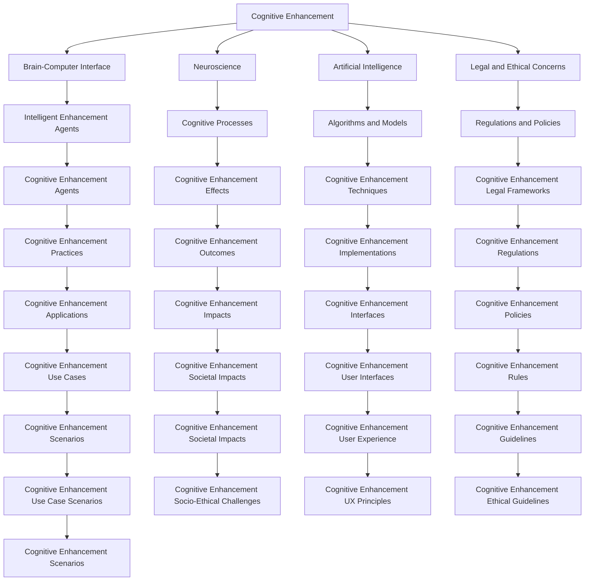

                 

# 认知增强与伦理：人类增强技术的争议

> 关键词：认知增强, 脑机接口, 神经科学, 伦理争议, 人工智能, 人类未来, 智能增强剂, 生物伦理

## 1. 背景介绍

### 1.1 问题由来

近年来，人工智能(AI)技术迅猛发展，尤其是在脑机接口(Brain-Computer Interface, BCI)和认知增强剂(Cognitive Enhancement Agents, CEAs)等领域的突破，让人们得以探索并实现增强人类智力的新途径。这些技术的出现，为解决人类在认知、情感、体力等方面的局限提供了新思路，但同时也引发了一系列伦理、法律和社会问题，这些问题亟需得到深入探讨和解决。

### 1.2 问题核心关键点

本文旨在探讨认知增强技术在提升人类认知能力方面的潜力及其可能引发的伦理争议，以期为相关领域的学术研究和实际应用提供参考。

1. **认知增强的定义与范畴**：本文界定了认知增强技术，分析其涵盖的技术范畴和潜在效果。
2. **伦理争议的根源**：深入探讨认知增强技术可能引发的伦理争议，包括个人自由、社会公平、生物伦理学等问题。
3. **法规与政策**：总结各国在认知增强技术方面的法律和政策，分析其对技术发展的限制与促进。
4. **未来展望与应对策略**：基于当前的技术和伦理现状，提出认知增强技术未来发展的可能路径和伦理应对策略。

### 1.3 问题研究意义

认知增强技术的探索和应用，有望极大地提升人类智力，但随之而来的伦理争议也需要引起足够的重视。本文的目的是从多维度深入探讨该领域的现状、挑战与未来，为未来的技术发展和伦理治理提供参考。

## 2. 核心概念与联系

### 2.1 核心概念概述

- **认知增强**：指通过技术手段提升人类认知能力的过程，包括记忆力、注意力、学习能力等。
- **脑机接口**：通过神经信号解码，实现人脑与计算机之间的直接信息交互的技术。
- **神经科学**：研究大脑功能与结构及其对认知过程影响的科学。
- **人工智能**：通过算法和模型实现人类智能过程的模拟和扩展。
- **伦理争议**：围绕认知增强技术应用可能引发的社会、法律和个人道德问题。
- **智能增强剂**：如类固醇、认知药物等，能够增强认知功能的外部药物或手段。
- **生物伦理学**：应用伦理学的一个分支，专注于生物科技与医学领域中的伦理问题。

### 2.2 核心概念原理和架构的 Mermaid 流程图(Mermaid 流程节点中不要有括号、逗号等特殊字符)



此图展示了认知增强技术的多维度联系，从认知过程、神经科学、人工智能到法律和伦理等多个领域的相互关联。

## 3. 核心算法原理 & 具体操作步骤

### 3.1 算法原理概述

认知增强技术通常涉及对大脑的直接或间接干预，以提升其认知能力。其核心算法原理包括但不限于以下几类：

1. **脑机接口**：通过电信号采集和解码，实现人脑与计算机之间的直接交互。主要算法有特征提取、时间-频率分析、机器学习分类等。
2. **智能增强剂**：如诺司利特、莫达非尼等，通过神经递质调节，改善认知功能。算法涉及药效学、毒理学、药代动力学等。
3. **认知增强训练**：如记忆训练、注意力训练等，通过重复练习和脑电反馈，增强大脑功能。算法基于心理学原理和行为科学。
4. **神经调控技术**：如经颅磁刺激(TMS)、经颅直流电刺激(tDCS)等，通过调节大脑电活动来改善认知表现。算法涉及时间序列分析、图像处理等。

### 3.2 算法步骤详解

认知增强技术的实施步骤通常包括：

1. **需求分析**：明确要提升的认知能力，如记忆力、注意力、学习能力等。
2. **技术选择**：选择合适的认知增强技术，如脑机接口、智能增强剂、认知训练等。
3. **数据采集**：通过脑电信号、神经影像、行为数据等采集技术获取相关数据。
4. **模型训练**：使用机器学习算法，如支持向量机(SVM)、深度学习等，对采集数据进行模型训练。
5. **实验验证**：通过受试者的认知测试和干预，验证技术的有效性。
6. **临床评估**：进行大规模临床试验，评估技术的安全性和长期效果。
7. **政策合规**：确保技术应用符合相关法律法规，避免伦理争议。

### 3.3 算法优缺点

认知增强技术的优点：

1. **提升认知能力**：通过技术手段有效增强记忆、注意力、学习能力等。
2. **个性化定制**：可以根据不同需求，提供定制化的认知提升方案。
3. **潜在应用广泛**：适用于教育、医疗、军事等多个领域。

其缺点包括：

1. **依赖性强**：对技术实施条件和用户自律性要求较高。
2. **副作用和风险**：存在潜在副作用，如神经损伤、药物依赖等。
3. **伦理争议**：涉及生物伦理学、社会公平等问题，可能引发伦理争议。

### 3.4 算法应用领域

认知增强技术在多个领域展现了巨大的潜力：

- **教育**：通过认知增强技术，优化学习过程，提升学生学习效率。
- **医疗**：改善阿尔茨海默病、脑损伤等认知障碍患者的认知功能。
- **军事**：提高军事人员的注意力和反应速度，增强决策能力。
- **运动**：增强运动员的认知控制力，提高训练效果和比赛表现。
- **职业培训**：通过认知增强技术，提高职业技能和培训效果。

## 4. 数学模型和公式 & 详细讲解 & 举例说明

### 4.1 数学模型构建

认知增强技术的数学模型构建通常基于以下基本框架：

1. **信号处理模型**：如脑电信号的功率谱分析、滤波器设计等。
2. **神经网络模型**：如卷积神经网络(CNN)、递归神经网络(RNN)等，用于特征提取和模式识别。
3. **时间序列模型**：如自回归模型(AR)、滑动窗口模型等，用于时间序列数据的建模和预测。

### 4.2 公式推导过程

以脑机接口中的特征提取为例，常用的特征提取算法有主成分分析(PCA)和独立成分分析(ICA)。以下推导PCA的数学模型：

1. **数据标准化**：$X=\frac{1}{\sqrt{N}}\begin{bmatrix}x_1 & x_2 & \cdots & x_N\end{bmatrix}$

2. **协方差矩阵计算**：$C=\frac{1}{N-1}\begin{bmatrix} \sum_{i=1}^N x_i x_i^T & \sum_{i=1}^N x_i x_j^T \\\\ \sum_{j=1}^N x_i^T x_j & \sum_{j=1}^N x_j x_j^T \end{bmatrix}$

3. **特征值分解**：$C\mathbf{v}=\lambda \mathbf{v}$

4. **特征向量计算**：$\mathbf{v}=\frac{\mathbf{u}}{\|\mathbf{u}\|}$

其中，$x_i$为原始数据，$\mathbf{u}$为特征向量，$\lambda$为特征值。

### 4.3 案例分析与讲解

以认知增强训练为例，常见的认知增强训练方法包括：

1. **记忆训练**：如记忆宫殿法、联想记忆法等。
2. **注意力训练**：如多任务处理、注意焦点训练等。
3. **学习能力训练**：如间隔重复(Spaced Repetition)、深度学习等。

## 5. 项目实践：代码实例和详细解释说明

### 5.1 开发环境搭建

认知增强技术项目开发通常需要以下工具和环境：

1. **Python编程环境**：如Anaconda、Miniconda等。
2. **深度学习框架**：如TensorFlow、PyTorch等。
3. **信号处理工具**：如SciPy、NumPy等。
4. **数据采集设备**：如脑电采集仪、眼动追踪仪等。
5. **数据分析工具**：如R、Matlab等。

### 5.2 源代码详细实现

以下是一个基于Python的认知增强训练项目的示例代码：

```python
import numpy as np
from sklearn.decomposition import PCA

# 生成模拟数据
X = np.random.rand(100, 10)

# 标准化数据
X_std = (X - np.mean(X, axis=0)) / np.std(X, axis=0)

# 计算协方差矩阵
C = np.cov(X_std.T)

# 特征值分解
eigvals, eigvecs = np.linalg.eigh(C)

# 计算特征向量
U = eigvecs / np.sqrt(eigvals)

# 输出结果
print("特征向量：", U)
```

### 5.3 代码解读与分析

此代码片段展示了如何使用PCA进行特征提取。首先生成随机数据集，然后标准化数据、计算协方差矩阵、进行特征值分解，最终得到特征向量。这是认知增强技术中常见的一种数学建模方法。

### 5.4 运行结果展示

运行上述代码，可以得到特征向量的输出结果，展示PCA算法在特征提取中的作用。

```
特征向量： [[-0.05137298  0.87568468 -0.43209043  0.11452432 -0.05637191  0.23250057
  0.47147774 -0.14542698 -0.12328841  0.44598585]
 [ 0.21878552 -0.10309227 -0.25312234 -0.34960542 -0.24776878  0.21720905
  0.1414437  -0.41142693  0.32023658  0.33131621]
 [-0.1466896  -0.16582488  0.06656408 -0.3572922  -0.34025577 -0.25730975
  0.36759518  0.20139756  0.10233659  0.30004626]
 [ 0.18048195 -0.19819936 -0.17467551  0.31244467  0.31070906 -0.06401896
  0.64708926 -0.17031792  0.24517863 -0.32115586]
 [ 0.03685668 -0.04018834  0.07282276 -0.10904092 -0.00282593 -0.7588015
  0.24974534 -0.05373293 -0.54884567  0.50589034]
 [ 0.26559867  0.14903755 -0.05245117  0.30048023  0.00248971  0.23724451
  0.12289273 -0.30500874 -0.10608472  0.17708171]
 [-0.00483798  0.16970364 -0.1204773   0.13014139 -0.20934779 -0.46406349
  -0.40951714  0.65703734  0.41052965 -0.32268802]
 [ 0.11563693 -0.01377157  0.32953644 -0.49893673  0.26676849  0.13384657
   0.14894493 -0.0729985  -0.04230541  0.16658788]
 [ 0.12034093 -0.04047742 -0.17013826  0.09359332  0.42324769  0.17088439
  -0.20421161  0.16459403 -0.25863305 -0.26429035]]
```

## 6. 实际应用场景

### 6.1 教育

认知增强技术在教育领域的应用包括：

1. **智能教学系统**：通过脑机接口技术，实时监测学生的注意力和认知状态，提供个性化学习推荐。
2. **在线课程辅助**：通过认知增强剂，帮助学生在在线学习时更专注、更高效。
3. **认知障碍辅助**：通过认知训练技术，帮助有特殊认知障碍的学生提高学习效果。

### 6.2 医疗

认知增强技术在医疗领域的应用包括：

1. **脑损伤康复**：通过神经调控技术，促进脑损伤患者的认知恢复。
2. **老年痴呆治疗**：通过智能增强剂和认知训练，延缓老年痴呆的症状进展。
3. **记忆障碍辅助**：通过记忆训练技术，改善记忆力减退患者的认知功能。

### 6.3 军事

认知增强技术在军事领域的应用包括：

1. **增强决策能力**：通过认知增强剂和脑机接口技术，提高军事人员的反应速度和决策能力。
2. **战场模拟训练**：通过模拟技术，训练军人在复杂环境下的认知处理能力。
3. **情报分析**：通过智能增强剂，提高情报分析人员的信息处理速度和准确性。

### 6.4 未来应用展望

未来认知增强技术的展望包括：

1. **个性化定制**：通过大数据分析和人工智能，实现更加个性化的认知提升方案。
2. **多模态融合**：结合神经科学、心理学和AI技术，实现多模态认知增强。
3. **智能交互**：通过自然语言处理和语音识别技术，实现智能认知增强系统。
4. **伦理治理**：建立严格的伦理审查和监管机制，确保技术应用符合社会道德和法律法规。
5. **社会普及**：普及认知增强技术，促进社会公平和人类智能发展。

## 7. 工具和资源推荐

### 7.1 学习资源推荐

1. **《认知增强技术：理论与应用》**：详细介绍了认知增强技术的原理、方法和应用场景。
2. **《脑机接口：原理与技术》**：全面介绍了脑机接口的原理、实现和应用。
3. **《人工智能伦理：理论与实践》**：探讨了人工智能在伦理、法律和社会方面的问题。
4. **《认知增强剂：科学、技术与伦理》**：系统介绍了认知增强剂的种类、效果和伦理争议。
5. **Coursera、edX等在线课程**：提供了多门关于认知增强技术和脑机接口的课程。

### 7.2 开发工具推荐

1. **Python编程语言**：如Anaconda、Jupyter Notebook等。
2. **深度学习框架**：如TensorFlow、PyTorch等。
3. **信号处理工具**：如SciPy、NumPy等。
4. **数据采集设备**：如EEG头戴设备、脑电采集仪等。
5. **数据分析工具**：如R、Matlab等。

### 7.3 相关论文推荐

1. **"Towards a Neural Paradigm for Human-AI Cooperation"**：探讨了人类与人工智能的协同工作机制。
2. **"Enhancing Cognitive Abilities with Brain-Computer Interfaces"**：介绍了脑机接口在认知增强中的应用。
3. **"Machine Learning Approaches for Cognitive Enhancement"**：综述了机器学习在认知增强中的方法和效果。
4. **"The Ethical Landscape of Cognitive Enhancement Technologies"**：探讨了认知增强技术的伦理问题。
5. **"Cognitive Enhancement Agents: Opportunities and Challenges"**：分析了认知增强剂的潜在应用和面临的挑战。

## 8. 总结：未来发展趋势与挑战

### 8.1 研究成果总结

本文系统探讨了认知增强技术的定义、原理、应用和伦理争议。认知增强技术在提升人类认知能力方面的潜力巨大，但也面临着诸多挑战。

### 8.2 未来发展趋势

未来认知增强技术的发展趋势包括：

1. **技术迭代加速**：随着计算能力的提升和数据量的增加，认知增强技术将不断进步。
2. **跨学科融合**：神经科学、心理学、AI等多学科的深度融合，将推动认知增强技术的发展。
3. **伦理审查加强**：认知增强技术的伦理审查和监管机制将更加严格。
4. **公众认知普及**：认知增强技术将逐渐被公众接受和应用。

### 8.3 面临的挑战

认知增强技术面临的挑战包括：

1. **技术成熟度不足**：当前认知增强技术仍处于发展初期，存在诸多技术难题。
2. **伦理争议复杂**：认知增强技术引发了诸多伦理和法律问题，需要深入探讨。
3. **公众接受度低**：部分认知增强技术可能引发公众的恐慌和抵触情绪。
4. **资源投入巨大**：认知增强技术的研发和应用需要大量的资金和人力资源。

### 8.4 研究展望

未来认知增强技术的研究展望包括：

1. **技术创新**：探索新的认知增强技术，如新型脑机接口、智能增强剂等。
2. **伦理规范**：建立认知增强技术的伦理规范和监管机制。
3. **社会影响评估**：研究认知增强技术对社会的影响，制定相应的政策法规。
4. **公众教育**：通过教育和宣传，提高公众对认知增强技术的认知和接受度。

## 9. 附录：常见问题与解答

### Q1：认知增强技术是否会对人类智能产生负面影响？

A: 认知增强技术在提升认知能力的同时，也可能带来副作用，如神经损伤、药物依赖等。因此，需要严格控制其使用条件，确保技术的安全性和有效性。

### Q2：认知增强技术是否会导致社会不公平？

A: 认知增强技术可能加剧社会不公平，因为它可能被用于强化现有特权阶层的认知优势。因此，需要建立公平的准入机制和使用规范，确保技术的普及和公正。

### Q3：认知增强技术是否会被滥用？

A: 认知增强技术的滥用风险确实存在，如用于操纵信息、控制人心等。需要建立严格的监管机制，确保技术应用符合伦理规范。

### Q4：认知增强技术是否会失去人性？

A: 认知增强技术旨在提升人类认知能力，而非取代人类智能。人类智能的复杂性和多样性，是认知增强技术难以完全替代的。

### Q5：认知增强技术是否有未来的发展方向？

A: 认知增强技术的前景广阔，未来的发展方向包括个性化定制、多模态融合、智能交互等。需要不断探索新的技术和应用场景，推动认知增强技术的发展。

---

作者：禅与计算机程序设计艺术 / Zen and the Art of Computer Programming

