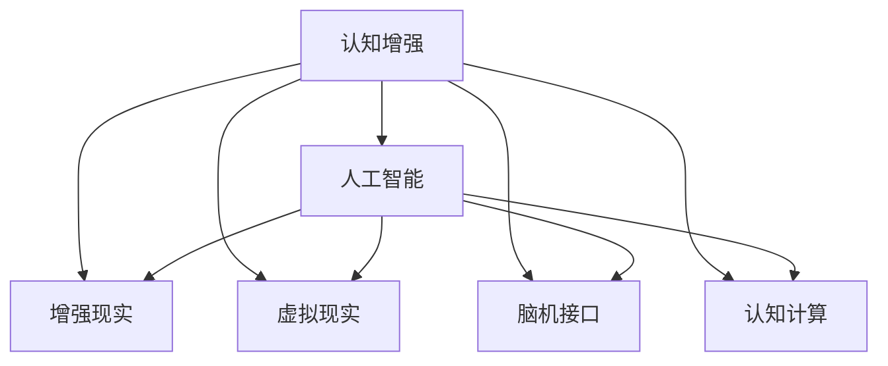

                 

# 认知增强：技术如何扩展人类的思维极限

> 关键词：认知增强, 人工智能, 技术创新, 人机交互, 未来科技

## 1. 背景介绍

### 1.1 问题由来
人类思维的极限一直是科学和哲学界长期探讨的话题。随着信息技术的迅猛发展，尤其是人工智能（AI）技术的崛起，我们正在目睹认知能力的变革。从机器翻译到自然语言处理，再到智能推荐系统，AI技术正逐步改变我们处理信息、解决问题的方式。

然而，面对日益复杂和多变的现实世界，人类仍然需要依靠自身的智能和经验来做出决策。人类的思维能力，特别是创造力、直觉和情感理解等软技能，是现有AI技术难以完全替代的。那么，如何利用技术进一步扩展人类的思维极限，成为当代科技发展的重要命题。

### 1.2 问题核心关键点
认知增强的核心在于通过技术手段，如增强现实（AR）、虚拟现实（VR）、脑机接口（BCI）等，进一步扩展人类的感知能力、决策能力、学习能力和创造力。认知增强技术融合了神经科学、心理学、计算机科学等多学科知识，旨在将AI技术与人的认知过程紧密结合，提升人机交互效率，释放人类潜能。

## 2. 核心概念与联系

### 2.1 核心概念概述

为更好地理解认知增强技术，本节将介绍几个核心概念：

- **认知增强(Cognitive Enhancement)**：通过技术手段提升人类认知能力的过程。涵盖感知、学习、决策、创造等多个维度的增强。

- **人工智能（Artificial Intelligence, AI）**：模仿人类智能行为的系统，通过算法和数据实现特定任务的处理。AI技术包括机器学习、深度学习、自然语言处理等子领域。

- **增强现实（Augmented Reality, AR）**：将数字信息叠加在现实世界中，通过视觉、听觉等多种感官手段增强人机交互体验。

- **虚拟现实（Virtual Reality, VR）**：构建一个完全由计算机生成的虚拟环境，使用户能够沉浸其中，体验不同的场景和情境。

- **脑机接口（Brain-Computer Interface, BCI）**：通过采集大脑电信号、神经反馈等数据，实现大脑与计算机之间的直接交互。

- **认知计算（Cognitive Computing）**：模仿人类认知过程的计算方法，通过模拟大脑神经网络处理信息，提升数据处理和决策能力。

这些核心概念之间的逻辑关系可以通过以下Mermaid流程图来展示：



这个流程图展示了几大核心概念之间的关系：

1. 认知增强通过融合人工智能、增强现实、虚拟现实等技术手段，进一步扩展人类的认知能力。
2. 人工智能为认知增强提供了技术支持，涵盖机器学习、深度学习、自然语言处理等多个子领域。
3. 增强现实、虚拟现实、脑机接口等技术手段，通过视觉、听觉、触觉等多种感官通道，丰富认知增强的交互体验。
4. 认知计算模仿人类大脑的神经网络处理模式，提升信息处理和决策能力。

这些概念共同构成了认知增强技术的理论基础和应用框架，为我们理解和应用认知增强技术提供了有力的工具。

## 3. 核心算法原理 & 具体操作步骤
### 3.1 算法原理概述

认知增强的核心算法原理在于通过模拟人类认知过程，提升信息处理、决策和学习能力。其核心思想是利用技术手段，增强人类的感知、学习、记忆和创造力等认知能力。

认知增强的具体方法包括：

- **感知增强**：通过增强现实（AR）和虚拟现实（VR）技术，模拟真实世界的视觉、听觉、触觉等多感官输入，提升人机交互的沉浸感。
- **学习增强**：利用AI技术，如个性化推荐系统、智能导师等，优化学习路径和内容，提升学习效率和效果。
- **记忆增强**：通过脑机接口（BCI）技术，采集和记录大脑神经信号，帮助记忆信息的提取和存储。
- **决策增强**：通过认知计算和模拟人类决策过程，提升决策的准确性和鲁棒性。
- **创造力增强**：利用生成对抗网络（GAN）、神经网络等AI技术，模拟人类创造过程，生成新颖的创意和内容。

### 3.2 算法步骤详解

认知增强技术的具体实施步骤通常包括以下几个环节：

**Step 1: 数据采集与处理**
- 使用传感器、摄像头等设备，采集用户的多感官数据，包括视觉、听觉、触觉等。
- 使用数据预处理技术，如滤波、去噪等，提高数据的准确性和可靠性。

**Step 2: 感知模拟与增强**
- 使用增强现实（AR）和虚拟现实（VR）技术，将虚拟信息叠加在现实世界中，通过视觉、听觉等多种感官通道，增强用户的感知体验。
- 使用脑机接口（BCI）技术，采集大脑神经信号，实现脑电波与计算机的直接交互，增强信息输入和反馈。

**Step 3: 认知计算与模型训练**
- 利用认知计算模型，如神经网络、深度学习等，对采集的多感官数据进行模拟和处理。
- 使用训练数据集，训练认知增强模型，优化感知、学习、决策和创造力等认知能力。

**Step 4: 应用与反馈**
- 将认知增强模型应用到实际场景中，如教育、医疗、工业等领域。
- 收集用户反馈数据，持续优化认知增强模型，提升用户体验和效果。

**Step 5: 伦理与社会影响评估**
- 对认知增强技术的使用效果进行伦理和社会影响评估，确保其应用符合法律法规和伦理道德。
- 制定相应的政策和标准，规范认知增强技术的应用和发展。

### 3.3 算法优缺点

认知增强技术具有以下优点：

1. **提升认知能力**：通过模拟人类认知过程，增强感知、学习、记忆和决策能力，提升人类应对复杂问题的能力。
2. **个性化定制**：根据用户需求和反馈，定制个性化的认知增强方案，提升用户体验和效果。
3. **广泛应用**：认知增强技术可应用于教育、医疗、工业等多个领域，具有广泛的应用前景。
4. **技术先进**：融合了神经科学、心理学、计算机科学等多学科知识，具有较高的技术含量。

然而，认知增强技术也存在以下缺点：

1. **伦理争议**：认知增强技术的广泛应用可能引发伦理争议，如隐私保护、知情同意等。
2. **技术依赖**：认知增强技术依赖于先进的技术设备和算法模型，技术门槛较高。
3. **安全风险**：认知增强技术在实际应用中可能面临数据泄露、系统故障等安全风险。
4. **个体差异**：不同个体的认知能力和偏好差异较大，需要定制化的解决方案。

尽管存在这些局限性，但认知增强技术在提升人类认知能力方面仍具有巨大潜力，值得深入研究和应用。

### 3.4 算法应用领域

认知增强技术已经在多个领域得到了初步应用，展示了其广泛的应用前景：

- **教育**：利用AR和VR技术，创建虚拟课堂和实验室，提供沉浸式学习体验。结合智能导师和个性化推荐系统，优化学习路径和内容，提升学习效果。
- **医疗**：通过脑机接口（BCI）技术，记录和分析大脑神经信号，辅助医生进行疾病诊断和治疗。利用虚拟现实（VR）技术，模拟手术场景，提升医生操作技能。
- **工业**：使用增强现实（AR）和虚拟现实（VR）技术，提升工人操作效率和安全。结合认知计算和智能助手，优化生产流程和决策过程。
- **军事**：利用增强现实（AR）和虚拟现实（VR）技术，模拟战场环境和训练场景，提升士兵的反应和决策能力。结合脑机接口（BCI）技术，增强士兵的信息获取和指挥能力。
- **娱乐**：开发虚拟现实（VR）游戏和应用，提供沉浸式体验和互动体验，满足用户的娱乐需求。结合生成对抗网络（GAN）和神经网络技术，生成创意内容，提升娱乐体验。

这些应用场景展示了认知增强技术的广泛潜力和应用前景，为人类生活的各个方面带来了新的可能性。

## 4. 数学模型和公式 & 详细讲解 & 举例说明

### 4.1 数学模型构建

认知增强技术涉及多个学科的数学模型和公式，包括感知模型、学习模型、记忆模型、决策模型和创造力模型等。下面以感知增强中的增强现实（AR）技术为例，构建数学模型。

设用户观察到的真实场景为 $x$，通过增强现实（AR）技术，叠加虚拟信息 $y$，得到增强后的场景 $z$。增强现实技术通常采用透视投影和几何变换，将虚拟信息叠加到真实场景中。

设 $x$ 的维度为 $d$，$y$ 的维度为 $e$，$z$ 的维度为 $f$。则增强现实的数学模型为：

$$
z = f(x, y)
$$

其中 $f$ 表示透视投影和几何变换函数。

### 4.2 公式推导过程

以简单的平面投影为例，推导增强现实技术的几何变换公式。设用户观察到的真实场景 $x$ 为二维平面坐标系，虚拟信息 $y$ 为三维坐标系，增强后的场景 $z$ 为二维平面坐标系。

假设虚拟信息 $y$ 以一定角度 $\theta$ 叠加在真实场景 $x$ 上，设虚拟信息的平移向量为 $t=(t_x, t_y, t_z)$。则增强后的场景 $z$ 为：

$$
z_x = x_x + t_x \cos \theta - t_z \sin \theta
$$
$$
z_y = x_y + t_y \cos \theta
$$
$$
z = \begin{bmatrix}
z_x \\
z_y
\end{bmatrix}
$$

其中 $x_x, x_y$ 为真实场景的坐标。

### 4.3 案例分析与讲解

以虚拟现实（VR）技术为例，分析其对认知增强的影响。虚拟现实技术通过构造完全由计算机生成的虚拟环境，使用户能够沉浸其中，体验不同的场景和情境。

设用户进入虚拟现实环境 $v$ 中的场景 $s$，通过视觉、听觉、触觉等多感官通道，体验虚拟场景 $s$。设用户真实世界中的感知状态为 $p$，则虚拟现实技术的数学模型为：

$$
v = s
$$

其中 $v$ 表示虚拟现实环境，$s$ 表示虚拟场景。

使用虚拟现实技术，可以模拟真实世界的复杂场景，提升用户的感知和体验。例如，在医学教育中，通过虚拟现实技术，学生可以进入虚拟的手术室，观察医生操作过程，提升操作技能。

## 5. 项目实践：代码实例和详细解释说明

### 5.1 开发环境搭建

在进行认知增强项目开发前，我们需要准备好开发环境。以下是使用Python进行OpenCV开发的环境配置流程：

1. 安装Anaconda：从官网下载并安装Anaconda，用于创建独立的Python环境。

2. 创建并激活虚拟环境：
```bash
conda create -n cv_env python=3.8 
conda activate cv_env
```

3. 安装OpenCV：根据系统平台，从官网获取对应的安装命令。例如：
```bash
conda install opencv opencv-contrib
```

4. 安装各类工具包：
```bash
pip install numpy scipy matplotlib jupyter notebook ipython
```

完成上述步骤后，即可在`cv_env`环境中开始认知增强项目的开发。

### 5.2 源代码详细实现

下面我们以增强现实（AR）技术为例，给出使用OpenCV进行增强现实开发的PyTorch代码实现。

首先，定义增强现实（AR）场景的类：

```python
import cv2
import numpy as np

class ARScene:
    def __init__(self, scene):
        self.scene = scene
        
    def draw(self, image):
        # 定义虚拟信息的平移和旋转角度
        translate = (100, 100)
        rotate = 30
        
        # 定义虚拟信息
        virtual_info = self.scene.draw_v3d(translate, rotate)
        
        # 将虚拟信息叠加到真实场景上
        image = image + virtual_info
        
        return image
```

然后，定义虚拟现实（VR）场景的类：

```python
class VRScene:
    def __init__(self, scene):
        self.scene = scene
        
    def draw(self, image):
        # 定义虚拟场景
        virtual_scene = self.scene.draw_v3d()
        
        # 将虚拟场景渲染到真实场景上
        image = image + virtual_scene
        
        return image
```

最后，启动增强现实（AR）和虚拟现实（VR）场景的开发流程：

```python
# 加载真实场景图像
image = cv2.imread('real_scene.jpg')
image = cv2.cvtColor(image, cv2.COLOR_BGR2RGB)

# 创建增强现实场景
ar_scene = ARScene(image)

# 创建虚拟现实场景
vr_scene = VRScene(image)

# 在增强现实场景中叠加虚拟信息
ar_image = ar_scene.draw(image)

# 在虚拟现实场景中渲染虚拟场景
vr_image = vr_scene.draw(image)

# 显示结果图像
cv2.imshow('AR Scene', ar_image)
cv2.imshow('VR Scene', vr_image)
cv2.waitKey(0)
cv2.destroyAllWindows()
```

以上代码实现了增强现实（AR）和虚拟现实（VR）技术的简单示例。可以看到，通过OpenCV库，我们能够方便地将虚拟信息叠加到真实场景上，创建增强现实和虚拟现实场景。

### 5.3 代码解读与分析

让我们再详细解读一下关键代码的实现细节：

**ARScene类**：
- `__init__`方法：初始化增强现实场景，需要传入真实场景图像。
- `draw`方法：在真实场景图像上叠加虚拟信息，返回增强后的图像。

**VRScene类**：
- `__init__`方法：初始化虚拟现实场景，需要传入真实场景图像。
- `draw`方法：在真实场景图像上渲染虚拟场景，返回增强后的图像。

**增强现实场景开发**：
- 使用OpenCV库加载真实场景图像。
- 创建增强现实场景对象。
- 在增强现实场景中叠加虚拟信息。
- 显示增强现实场景图像。

**虚拟现实场景开发**：
- 加载真实场景图像。
- 创建虚拟现实场景对象。
- 在虚拟现实场景中渲染虚拟场景。
- 显示虚拟现实场景图像。

通过以上代码，我们可以看到，OpenCV库提供了一系列图像处理和渲染函数，使得增强现实（AR）和虚拟现实（VR）技术开发变得相对简单。开发者可以根据具体需求，灵活使用这些函数，实现更加复杂和丰富的增强现实和虚拟现实应用。

## 6. 实际应用场景

### 6.1 教育培训

增强现实（AR）和虚拟现实（VR）技术在教育培训中的应用广泛。传统的教室教学受限于场地和设备，难以提供沉浸式的学习体验。通过AR和VR技术，学生可以进入虚拟教室、实验室和博物馆，体验丰富的学习场景，提升学习兴趣和效果。

在医学教育中，虚拟现实（VR）技术可以模拟手术场景，让学生观察医生的操作过程，提升手术技能。在工业培训中，增强现实（AR）技术可以展示设备的操作流程和故障排查步骤，提升工人操作效率和安全。

### 6.2 医疗诊断

脑机接口（BCI）技术在医疗诊断中具有广泛应用。通过采集大脑神经信号，可以辅助医生进行疾病诊断和治疗。例如，在癫痫诊断中，脑电图（EEG）采集设备可以记录患者的脑电波数据，通过分析这些数据，辅助医生诊断癫痫病。

在手术过程中，医生可以通过脑机接口（BCI）技术，记录和分析手术过程中的大脑活动，优化手术方案，提高手术成功率。

### 6.3 工业制造

在工业制造中，增强现实（AR）和虚拟现实（VR）技术可以提升生产效率和质量。通过AR技术，工人可以在虚拟环境中进行模拟操作，熟悉设备的操作流程和注意事项。在虚拟环境中，工人可以多次练习，提升操作技能，减少错误发生。

通过VR技术，工人可以在虚拟环境中进行虚拟装配、调试和测试，提前发现和解决潜在问题，减少实际生产中的故障率。

### 6.4 未来应用展望

随着技术的不断进步，认知增强技术将在更多领域得到应用，带来颠覆性变革：

- **智慧城市**：通过增强现实（AR）和虚拟现实（VR）技术，提升城市管理的智能化水平，构建更安全、高效的未来城市。例如，在交通管理中，司机可以通过AR眼镜，获取实时交通信息和导航，提升行车安全性。在城市规划中，规划师可以通过VR技术，模拟城市建设方案，优化城市布局。

- **娱乐产业**：虚拟现实（VR）技术在游戏和娱乐领域的应用广泛。通过VR技术，用户可以进入虚拟世界，体验沉浸式游戏和应用，提升娱乐体验。未来，VR技术将进一步发展，实现更加逼真、互动的游戏和应用场景。

- **心理健康**：通过脑机接口（BCI）技术，帮助患者监测和管理心理健康。例如，在焦虑和抑郁治疗中，可以通过脑电波监测患者的情绪变化，实时调整治疗方案，提升治疗效果。

- **个性化医疗**：脑机接口（BCI）技术在个性化医疗中具有广泛应用。通过采集大脑神经信号，可以个性化定制医疗方案，提升治疗效果和患者体验。

## 7. 工具和资源推荐

### 7.1 学习资源推荐

为了帮助开发者系统掌握认知增强技术的理论基础和实践技巧，这里推荐一些优质的学习资源：

1. 《认知增强：未来科技革命》系列博文：由认知增强领域的专家撰写，深入浅出地介绍了认知增强技术的原理、应用和挑战。

2. 《深度学习与认知增强》课程：斯坦福大学开设的认知增强课程，涵盖深度学习、增强现实、虚拟现实等多个子领域，提供丰富的学习材料和实践项目。

3. 《认知增强技术与应用》书籍：认知增强技术领域的经典教材，全面介绍了认知增强技术的理论基础和实际应用，适合深入学习。

4. HuggingFace官方文档：脑机接口（BCI）库的官方文档，提供了丰富的示例和API接口，适合快速上手开发。

5. ARKit/ARCore开发者文档：苹果和谷歌提供的增强现实（AR）技术开发文档，详细介绍了增强现实技术的开发方法和API接口。

通过对这些资源的学习实践，相信你一定能够快速掌握认知增强技术的精髓，并用于解决实际的认知增强问题。

### 7.2 开发工具推荐

高效的开发离不开优秀的工具支持。以下是几款用于认知增强开发的常用工具：

1. OpenCV：开源计算机视觉库，提供了丰富的图像处理和渲染函数，适合开发增强现实（AR）和虚拟现实（VR）应用。

2. Unity和Unreal Engine：全球领先的虚拟现实（VR）和增强现实（AR）开发平台，提供强大的引擎和工具，支持多平台部署。

3. TensorFlow和PyTorch：深度学习框架，适合开发认知计算和认知增强应用。

4. Google Colab和Jupyter Notebook：在线开发环境，提供丰富的计算资源和交互界面，适合快速迭代和实验。

5. VS Code和PyCharm：流行的开发工具，支持多种编程语言和框架，适合开发复杂认知增强应用。

合理利用这些工具，可以显著提升认知增强开发效率，加速创新迭代的步伐。

### 7.3 相关论文推荐

认知增强技术的发展源于学界的持续研究。以下是几篇奠基性的相关论文，推荐阅读：

1. Cognitive Enhancement with Cognitive Computing and Artificial Intelligence：概述认知增强技术的发展和应用，探讨未来发展方向。

2. The Ethics of Cognitive Enhancement Technologies：探讨认知增强技术的伦理问题，强调道德和社会影响评估的重要性。

3. Cognitive Enhancement Through Artificial Intelligence and Virtual Reality：分析认知增强技术的核心算法和技术手段，探讨其应用前景。

4. Cognitive Enhancement via Brain-Computer Interfaces：介绍脑机接口（BCI）技术的基本原理和应用，分析其在认知增强中的作用。

这些论文代表了大认知增强技术的发展脉络。通过学习这些前沿成果，可以帮助研究者把握学科前进方向，激发更多的创新灵感。

## 8. 总结：未来发展趋势与挑战

### 8.1 总结

本文对认知增强技术进行了全面系统的介绍。首先阐述了认知增强技术的背景和意义，明确了认知增强在提升人类认知能力方面的独特价值。其次，从原理到实践，详细讲解了认知增强技术的数学模型和算法步骤，给出了认知增强技术开发的完整代码实例。同时，本文还广泛探讨了认知增强技术在教育、医疗、工业等多个领域的应用前景，展示了认知增强技术的广阔潜力和应用前景。此外，本文精选了认知增强技术的各类学习资源，力求为读者提供全方位的技术指引。

通过本文的系统梳理，可以看到，认知增强技术正在成为未来科技发展的重要方向，极大地拓展了人类认知能力的边界。未来，伴随认知增强技术的持续演进，其应用范围将进一步扩大，为人类生活的各个方面带来新的可能性。

### 8.2 未来发展趋势

展望未来，认知增强技术将呈现以下几个发展趋势：

1. **技术融合**：认知增强技术将与其他前沿技术（如量子计算、脑机接口等）进一步融合，提升人机交互的效率和效果。

2. **个性化定制**：认知增强技术将根据用户需求和偏好，提供个性化的感知、学习、决策和创造力增强方案，提升用户体验。

3. **广泛应用**：认知增强技术将在更多领域得到应用，如智慧城市、娱乐产业、心理健康等，带来颠覆性变革。

4. **伦理规范**：认知增强技术的应用将面临更多的伦理和社会问题，需要制定相应的法律法规和规范，确保其安全性和伦理性。

5. **多学科融合**：认知增强技术将融合神经科学、心理学、计算机科学等多个学科的知识，推动多学科交叉研究。

以上趋势凸显了认知增强技术的广阔前景，这些方向的探索发展，必将进一步提升认知增强技术的效果和应用范围，为人类认知能力的提升带来新的动力。

### 8.3 面临的挑战

尽管认知增强技术已经取得了显著进展，但在迈向更加智能化、普适化应用的过程中，它仍面临诸多挑战：

1. **伦理争议**：认知增强技术的应用可能引发隐私保护、知情同意等伦理争议，需要制定相应的法律法规和规范。

2. **技术依赖**：认知增强技术依赖于先进的技术设备和算法模型，技术门槛较高，需要持续的技术创新和优化。

3. **数据隐私**：脑机接口（BCI）技术需要采集和处理大量个人数据，存在数据泄露和隐私保护的风险。

4. **用户接受度**：认知增强技术的应用需要用户的信任和接受，如何提升用户接受度，推动技术普及，仍是一个重要问题。

5. **技术融合**：认知增强技术需要与其他技术进行深度融合，如增强现实（AR）、虚拟现实（VR）等，技术整合和协同优化仍需进一步探索。

6. **安全性**：认知增强技术在实际应用中可能面临系统故障、数据篡改等安全风险，需要制定相应的安全措施和标准。

正视认知增强面临的这些挑战，积极应对并寻求突破，将是大认知增强技术走向成熟的必由之路。相信随着学界和产业界的共同努力，这些挑战终将一一被克服，认知增强技术必将在构建人机协同的智能时代中扮演越来越重要的角色。

### 8.4 未来突破

面对认知增强技术所面临的种种挑战，未来的研究需要在以下几个方面寻求新的突破：

1. **多模态融合**：将增强现实（AR）、虚拟现实（VR）、脑机接口（BCI）等技术手段进行深度融合，提升感知、学习、决策和创造力的综合能力。

2. **伦理与社会影响评估**：制定严格的伦理和社会影响评估机制，确保认知增强技术的合理应用，避免潜在的负面影响。

3. **技术优化与创新**：优化算法模型和数据处理流程，提升认知增强技术的效率和效果，推动技术持续创新。

4. **跨学科合作**：加强神经科学、心理学、计算机科学等学科的合作，推动跨学科研究，提升认知增强技术的理论基础和应用效果。

5. **个性化定制**：开发智能算法，根据用户需求和偏好，提供个性化的认知增强方案，提升用户体验。

这些研究方向的探索，必将引领认知增强技术迈向更高的台阶，为人类认知能力的提升带来新的可能性。面向未来，认知增强技术还需要与其他前沿技术进行更深入的融合，如知识表示、因果推理、强化学习等，多路径协同发力，共同推动认知增强技术的进步。

## 9. 附录：常见问题与解答

**Q1：认知增强技术是否适用于所有用户？**

A: 认知增强技术需要用户具有一定技术基础和设备支持，可能不适用于所有用户。例如，脑机接口（BCI）技术需要用户佩戴特定的设备，进行脑电波采集，这对部分用户来说可能存在不便。

**Q2：认知增强技术是否会带来新的认知负荷？**

A: 认知增强技术的应用需要用户的积极参与和互动，可能会带来一定的认知负荷。例如，虚拟现实（VR）技术需要用户长时间沉浸在虚拟环境中，可能影响用户的注意力和情绪。

**Q3：认知增强技术是否会取代人类认知能力？**

A: 认知增强技术旨在提升人类认知能力，而不是取代人类认知能力。尽管技术可以模拟人类认知过程，但在某些复杂的决策和创造性活动中，人类智能仍然具有不可替代的优势。

**Q3：认知增强技术是否会带来新的隐私和安全风险？**

A: 认知增强技术的应用需要采集和处理大量个人数据，可能带来隐私保护和数据安全的问题。需要制定相应的法律法规和标准，确保数据隐私和安全。

**Q5：认知增强技术是否会带来新的伦理和社会问题？**

A: 认知增强技术的应用可能引发伦理和社会问题，如知情同意、隐私保护等。需要制定相应的伦理规范和法律框架，确保技术应用的合法性和伦理性。

这些常见问题的解答，有助于开发者更全面地理解认知增强技术的应用和挑战，推动技术健康、可持续发展。

---

作者：禅与计算机程序设计艺术 / Zen and the Art of Computer Programming

