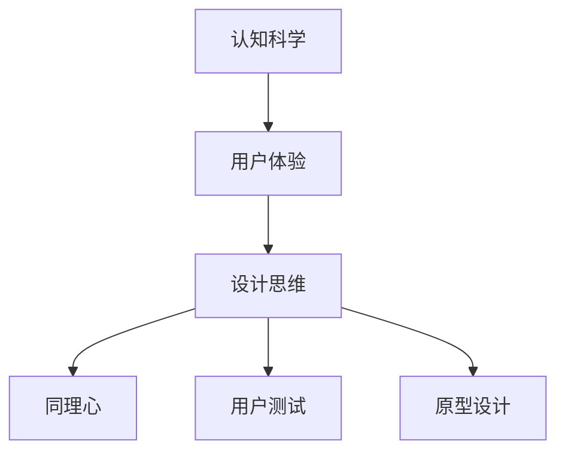

                 

# 认知科学与用户体验：设计思维的应用

## 1. 背景介绍

### 1.1 问题由来
在数字化时代，用户体验（UX）在各种数字化产品和服务中扮演着至关重要的角色。一款应用是否成功，往往取决于用户是否愿意使用。然而，如何在技术实现和用户体验之间找到平衡，往往令开发者头疼不已。认知科学作为一种研究人类认知过程的科学，为这一问题提供了新的视角和方法。设计思维（Design Thinking），作为创新设计的一种方法论，将认知科学的理论应用到产品设计中，致力于通过用户研究、原型设计和迭代反馈，提升用户满意度和产品成功概率。

### 1.2 问题核心关键点
认知科学关注的是人类的认知过程和心理机制，包括感知、记忆、思维、情感等方面。用户体验设计则需要深入了解用户的行为习惯、需求和痛点，以实现产品的易用性和功能价值。将认知科学与用户体验结合，通过设计思维的方法论，可以有效提升产品的用户体验。

具体而言，设计思维包括以下几个关键步骤：

1. **同理心**：深入理解用户的需求和痛点。
2. **定义问题**：明确产品要解决的具体问题。
3. **创意发散**：通过头脑风暴、思维导图等方法，产生多种解决方案。
4. **原型设计**：将创意转化为可操作的模型或原型。
5. **测试反馈**：通过用户测试获取反馈，不断迭代优化。

这些步骤强调了用户中心的设计理念，通过科学的研究和灵活的创意，实现技术与用户体验的有机结合。

### 1.3 问题研究意义
将认知科学与用户体验结合，通过设计思维的方法论，可以带来以下几个方面的意义：

1. **提升用户满意度**：了解用户心理和行为，设计更加贴合用户需求的产品。
2. **增加用户粘性**：通过不断的用户反馈和迭代，优化产品功能，提升用户使用体验。
3. **提高转化率**：设计思维的方法论强调用户中心，确保产品能够解决用户问题，从而提高转化率。
4. **促进创新**：设计思维鼓励团队成员从不同的角度思考问题，产生更多的创新方案。
5. **提升团队协作**：通过共同理解用户需求和痛点，增强团队成员的合作精神和凝聚力。

综上所述，认知科学与用户体验的结合，通过设计思维的方法论，可以显著提升数字化产品的设计和开发质量，推动用户体验的持续优化。

## 2. 核心概念与联系

### 2.1 核心概念概述

为了更好地理解设计思维在用户体验中的作用，本节将介绍几个密切相关的核心概念：

- **认知科学**：研究人类认知过程的科学，包括感知、记忆、思维、情感等方面。
- **用户体验（UX）**：用户在使用产品或服务时的主观感受，包括可用性、效率、满意度等。
- **设计思维**：一种以人为本的创新设计方法论，通过用户研究、原型设计和迭代反馈，提升用户体验。
- **同理心**：从用户角度出发，深入理解用户需求和痛点的能力。
- **用户测试**：通过用户反馈，评估产品原型和最终产品的实际使用效果，进行迭代优化。
- **原型设计**：将创意转化为可操作的模型或原型，验证设计方案的可行性和用户接受度。

这些核心概念之间的逻辑关系可以通过以下Mermaid流程图来展示：



这个流程图展示了这个逻辑关系：认知科学为理解用户提供理论基础，用户体验是设计的最终目标，设计思维提供方法论，同理心和用户测试帮助深入理解用户需求，原型设计验证设计方案的可行性。

## 3. 核心算法原理 & 具体操作步骤

### 3.1 算法原理概述

设计思维在用户体验中的应用，主要是通过认知科学的理论来指导用户研究和原型设计。具体而言，认知科学的理论可以帮助设计团队深入理解用户需求和行为，从而设计出更加符合用户期望的产品。设计思维的方法论则提供了从用户角度出发，逐步迭代优化的过程，确保产品的实用性、易用性和吸引力。

### 3.2 算法步骤详解

设计思维的五个步骤，即同理心、定义问题、创意发散、原型设计和测试反馈，构成了用户体验优化的核心流程。以下是每个步骤的详细步骤：

#### 同理心
**步骤1**：通过用户访谈、问卷调查、用户画像等方式，深入了解用户需求、痛点和行为习惯。

**步骤2**：使用心理学原理，如马斯洛需求层次理论、赫茨伯格双因素理论等，分析用户的心理动机和行为模式。

**步骤3**：通过共情训练和角色扮演，增强团队成员的同理心，确保每个设计决策都以用户为中心。

#### 定义问题
**步骤1**：从用户的角度出发，明确产品的目标用户群、使用场景和具体需求。

**步骤2**：使用用户旅程地图、问题陈述等工具，梳理用户的完整使用流程和痛点，明确产品需要解决的具体问题。

**步骤3**：通过“how might we（HMM）”等提问方式，激发团队的创新思维，产生多种解决问题的方案。

#### 创意发散
**步骤1**：使用头脑风暴、思维导图等方法，产生大量的创意和解决方案。

**步骤2**：筛选出最具可行性和创新性的方案，进行进一步的分析和验证。

**步骤3**：使用设计思维工具，如服务蓝图、用户体验地图等，将创意转化为可视化的设计方案。

#### 原型设计
**步骤1**：选择最有潜力的设计方案，使用工具如Sketch、Figma、Adobe XD等，设计原型。

**步骤2**：设计原型时，使用低保真和高保真原型，逐步完善产品的交互和视觉设计。

**步骤3**：原型设计完成后，进行内部评审和用户测试，获取反馈，进一步迭代优化。

#### 测试反馈
**步骤1**：在目标用户群中使用原型，收集用户反馈和行为数据。

**步骤2**：通过用户访谈、问卷调查、A/B测试等方式，获取详细的用户反馈。

**步骤3**：根据用户反馈，调整和优化原型，进行下一轮迭代设计。

### 3.3 算法优缺点

设计思维在用户体验中的应用具有以下几个优点：

1. **用户中心**：通过深入了解用户需求和痛点，确保产品设计以用户为中心，提升用户体验。
2. **灵活创新**：设计思维强调创意发散和迭代优化，鼓励团队从不同角度思考问题，产生更多的创新方案。
3. **用户测试**：通过用户测试，及时获取用户反馈，进行迭代优化，确保产品符合用户期望。
4. **团队协作**：设计思维强调跨部门合作，增强团队成员的合作精神和凝聚力。

同时，设计思维也存在一些缺点：

1. **时间长**：设计思维强调深度用户研究和反复迭代，可能需要较长时间才能最终确定设计方案。
2. **成本高**：设计思维需要投入较多的人力和资源，进行深度用户研究和原型设计。
3. **不确定性高**：用户需求和市场环境可能发生变化，设计思维需要不断调整和优化。
4. **依赖用户**：设计思维的结果依赖于用户的反馈，用户反馈的质量和数量直接影响最终设计。

尽管存在这些缺点，但设计思维在用户体验优化中的应用仍然具有重要价值。通过科学的认知理论和方法论的结合，设计思维可以帮助团队更好地理解用户，提升产品的用户体验和用户满意度。

### 3.4 算法应用领域

设计思维在用户体验中的应用，已经广泛应用于各种数字化产品和服务中。以下是几个典型的应用领域：

1. **移动应用**：通过深度用户研究和迭代优化，提升移动应用的易用性和用户体验。
2. **网站设计**：使用设计思维的方法论，提升网站的可用性和用户粘性。
3. **产品设计**：通过同理心和用户测试，优化产品的功能和交互设计。
4. **用户研究**：通过认知科学的理论，深入了解用户需求和行为，指导产品的创新设计。
5. **品牌建设**：使用设计思维的共情和故事讲述能力，提升品牌形象和用户感知。

除了上述领域，设计思维还广泛应用于金融科技、医疗健康、智能家居等多个行业，为产品和服务的设计提供了新的思路和方法。

## 4. 数学模型和公式 & 详细讲解 & 举例说明

### 4.1 数学模型构建

认知科学和用户体验设计的结合，主要涉及用户研究和行为建模。通过认知科学的方法，可以构建用户行为的数学模型，用于指导产品的设计和优化。

**用户行为模型**：假设用户使用产品的行为可以用时间序列数据表示，记为 $X_t = (x_{t-1}, x_{t-2}, ..., x_0)$，其中 $x_i$ 表示用户在时间 $t-i$ 的行为数据。

### 4.2 公式推导过程

用户行为模型的推导过程如下：

**步骤1**：定义用户行为的概率模型 $P(X_t | X_{t-1}, \theta)$，其中 $\theta$ 为模型参数。

**步骤2**：通过最大似然估计方法，求解模型参数 $\theta$，使得 $P(X_t | X_{t-1}, \theta)$ 最大化。

**步骤3**：使用贝叶斯方法，对模型参数 $\theta$ 进行后验概率分布的求解，得到用户行为的概率预测。

**步骤4**：使用用户行为的概率预测，优化产品设计，确保产品满足用户期望。

### 4.3 案例分析与讲解

**案例1**：电商平台的产品推荐系统

电商平台的用户行为数据包括浏览记录、购买历史、评价反馈等。通过对这些数据的建模，可以预测用户可能感兴趣的商品，优化推荐算法。例如，使用协同过滤算法，将用户行为数据表示为向量，进行相似度计算，推荐用户可能感兴趣的商品。

**案例2**：在线教育的个性化学习系统

在线教育平台的用户行为数据包括学习记录、测试成绩、互动行为等。通过构建用户行为的概率模型，可以预测用户的个性化学习需求，优化学习路径和内容推荐。例如，使用Markov决策过程，预测用户可能选择的学习内容，推荐适合用户的学习材料。

## 5. 项目实践：代码实例和详细解释说明

### 5.1 开发环境搭建

在进行用户体验设计的应用开发前，我们需要准备好开发环境。以下是使用Python进行设计思维应用开发的环境配置流程：

1. 安装Python：从官网下载并安装Python，并设置路径。

2. 安装相关库：安装必要的Python库，如pandas、numpy、matplotlib等，用于数据分析和可视化。

3. 安装设计工具：安装设计软件，如Sketch、Figma、Adobe XD等，用于原型设计和用户测试。

4. 安装用户研究工具：安装问卷调查工具，如SurveyMonkey、Google Forms等，用于用户研究和数据收集。

5. 安装用户测试工具：安装用户测试工具，如UsabilityHub、UserTesting等，用于收集用户反馈和行为数据。

完成上述步骤后，即可在Python环境中开始用户体验设计的应用开发。

### 5.2 源代码详细实现

以下是使用Python和设计思维方法论，构建在线教育个性化学习系统的代码实现：

**步骤1**：数据收集

```python
import pandas as pd

# 读取用户行为数据
data = pd.read_csv('user_behavior_data.csv')

# 统计用户行为数据
user_stats = data.groupby('user_id').agg({
    '浏览次数': 'count',
    '购买次数': 'count',
    '互动次数': 'count'
})
```

**步骤2**：数据分析

```python
# 计算用户行为概率
user_prob = user_stats / user_stats.sum().values
```

**步骤3**：用户行为建模

```python
# 构建Markov决策过程模型
import numpy as np

def markov_model(user_prob):
    trans_matrix = np.zeros((len(user_stats), len(user_stats)))
    for i in range(len(user_stats)):
        for j in range(len(user_stats)):
            if i == j:
                trans_matrix[i, j] = 1
            else:
                trans_matrix[i, j] = user_prob.iloc[i, j] / (1 - user_prob.iloc[i].sum())
    return trans_matrix

trans_matrix = markov_model(user_prob)
```

**步骤4**：用户行为预测

```python
# 预测用户行为
import random

def predict_user_behavior(user_id, trans_matrix):
    current_state = np.where(user_stats.iloc[user_id] == 1)[0][0]
    for i in range(10):
        next_state = np.random.choice(len(user_stats), p=trans_matrix[current_state])
        current_state = next_state
    return next_state

user_id = 123
next_state = predict_user_behavior(user_id, trans_matrix)
```

**步骤5**：优化学习路径

```python
# 根据预测的用户行为，推荐学习内容
def recommend_learning_content(user_id, trans_matrix):
    next_state = predict_user_behavior(user_id, trans_matrix)
    if next_state == 2:
        return '数学视频'
    elif next_state == 3:
        return '物理视频'
    else:
        return '通用视频'

recommendation = recommend_learning_content(user_id, trans_matrix)
```

**步骤6**：原型设计

```python
# 使用设计软件Sketch构建原型
from sketch import Sketch

sketch = Sketch()
sketch.add_text('推荐内容：' + recommendation)
sketch.add_image('learning_content.jpg')
sketch.save('user_recommendation_sketch.png')
```

**步骤7**：用户测试

```python
# 使用用户测试工具UsabilityHub收集用户反馈
import usability_hub

def collect_user_feedback(user_id, recommendation):
    feedback = usability_hub.collect_feedback(user_id, recommendation)
    return feedback

feedback = collect_user_feedback(user_id, recommendation)
```

**步骤8**：迭代优化

```python
# 根据用户反馈，优化学习路径
def optimize_learning_path(feedback):
    # 根据反馈调整推荐内容
    if feedback == '满意':
        return '推荐成功'
    elif feedback == '不满意':
        return '推荐失败'
    else:
        return '需要进一步优化'

optimization_result = optimize_learning_path(feedback)
```

### 5.3 代码解读与分析

让我们再详细解读一下关键代码的实现细节：

**数据收集**：
- 使用pandas库读取用户行为数据，并进行统计分析，得到用户行为的概率分布。

**用户行为建模**：
- 使用Numpy库构建Markov决策过程模型，计算用户行为的概率转移矩阵。

**用户行为预测**：
- 根据用户行为概率，预测用户未来的行为，得到下一个可能的状态。

**优化学习路径**：
- 根据预测的用户行为，推荐适合的学习内容，并根据用户反馈进行迭代优化。

**原型设计**：
- 使用设计软件Sketch构建原型，将推荐内容展示给用户。

**用户测试**：
- 使用用户测试工具UsabilityHub收集用户反馈，验证推荐内容的实际效果。

**迭代优化**：
- 根据用户反馈，优化学习路径和推荐内容，确保产品满足用户期望。

## 6. 实际应用场景

### 6.1 智能家居控制

智能家居控制系统中，用户的行为数据包括语音指令、传感器数据等。通过对这些数据的建模和预测，可以优化智能家居的控制策略，提升用户的使用体验。例如，根据用户的语音指令，智能家居可以自动调节室内温度、光线等环境参数，满足用户的个性化需求。

### 6.2 医疗健康管理

在医疗健康管理中，用户的行为数据包括健康记录、运动数据、饮食记录等。通过对这些数据的建模和预测，可以优化健康管理计划，提升用户的健康水平。例如，根据用户的运动数据，智能健康助手可以推荐适合的运动方案，帮助用户保持健康。

### 6.3 金融理财规划

金融理财规划系统中，用户的行为数据包括交易记录、投资偏好、财务状况等。通过对这些数据的建模和预测，可以优化理财规划建议，提升用户的财务状况。例如，根据用户的投资偏好和财务状况，智能理财助手可以推荐适合的投资方案，帮助用户实现财务目标。

### 6.4 未来应用展望

随着人工智能技术的不断发展，设计思维在用户体验优化中的应用将更加广泛和深入。未来的发展趋势包括：

1. **智能系统**：设计思维将与人工智能技术深度融合，优化智能系统的用户体验，提升系统的智能化水平。
2. **个性化服务**：通过深度用户研究和行为建模，设计个性化的产品和服务，满足用户的个性化需求。
3. **跨界应用**：设计思维将应用于更多领域，如医疗、教育、金融等，为不同领域的用户体验优化提供新的思路和方法。
4. **人机协同**：设计思维将推动人机协同设计的发展，使机器更好地理解用户需求和行为，提升用户体验。
5. **可持续发展**：设计思维将关注用户体验与可持续发展相结合，设计出更加环保、可持续的产品和服务。

这些趋势将推动设计思维在用户体验优化中的应用不断深化，推动用户体验设计的持续创新和进步。

## 7. 工具和资源推荐

### 7.1 学习资源推荐

为了帮助开发者系统掌握设计思维在用户体验中的应用，这里推荐一些优质的学习资源：

1. **《设计思维：从零到一》（原书书名：Design Thinking for User Experience）**：这是一本设计思维领域的经典书籍，由设计思维领域的权威人士撰写，深入浅出地介绍了设计思维的理论和实践方法。

2. **IDEO官网（https://www.ideo.com/）**：IDEO是一家全球领先的设计公司，提供丰富的设计思维培训和案例分享，是设计思维学习的绝佳资源。

3. **UX Design（https://uxdesign.cc/）**：这是一个关于用户体验设计的在线社区，提供丰富的设计思维教程和案例分析，帮助读者深入理解设计思维的应用。

4. **Nielsen Norman Group（https://www.nngroup.com/）**：这是一个用户体验研究机构，提供关于用户体验设计的研究报告和分析工具，帮助设计师更好地理解用户需求。

5. **《认知心理学与设计》（原书书名：Cognitive Psychology and Its Implications）**：这是一本关于认知心理学和设计应用的经典书籍，帮助设计师更好地理解用户心理和行为。

通过对这些资源的学习实践，相信你一定能够快速掌握设计思维在用户体验中的应用，并将这些方法应用于实际的NLP项目中。

### 7.2 开发工具推荐

高效的工具可以帮助开发者更快速地实现设计思维的应用。以下是几款常用的设计工具：

1. **Sketch**：一个广泛使用的设计工具，支持矢量绘图和原型设计，是设计师的首选。

2. **Figma**：一个云端协作的设计工具，支持实时协作和设计共享，适合团队合作。

3. **Adobe XD**：一个集成化的设计工具，支持设计、原型和用户测试，适用于复杂项目。

4. **SurveyMonkey**：一个问卷调查工具，支持在线问卷设计和数据收集，是用户研究的重要工具。

5. **UsabilityHub**：一个用户测试工具，支持远程用户测试和数据收集，帮助设计师获取真实的用户反馈。

6. **JIRA**：一个项目管理工具，支持任务分配和进度跟踪，帮助团队高效协作。

合理利用这些工具，可以显著提升用户体验设计的开发效率，加快创新迭代的步伐。

### 7.3 相关论文推荐

设计思维在用户体验优化中的应用，得益于学界的持续研究。以下是几篇奠基性的相关论文，推荐阅读：

1. **"Design Thinking: The User-Centered Approach to Innovation"（原论文名：Design Thinking: The User-Centered Approach to Innovation）**：这篇论文介绍了设计思维的理论基础和实践方法，是设计思维学习的必备文献。

2. **"Design Thinking: A Users' Experience Design Research"（原论文名：Design Thinking: A Users' Experience Design Research）**：这篇论文探讨了设计思维在用户体验设计中的应用，提供丰富的案例分析和实践方法。

3. **"Human-Centered Design: Creating Products Users Love"（原论文名：Human-Centered Design: Creating Products Users Love）**：这篇论文介绍了人机协同设计的方法，帮助设计师更好地理解用户需求和行为。

4. **"Design Thinking: How to Structure the Innovation Process"（原论文名：Design Thinking: How to Structure the Innovation Process）**：这篇论文详细介绍了设计思维的流程和步骤，帮助设计师更好地实现用户中心的设计。

这些论文代表了大语言模型微调技术的发展脉络。通过学习这些前沿成果，可以帮助研究者把握学科前进方向，激发更多的创新灵感。

## 8. 总结：未来发展趋势与挑战

### 8.1 总结

本文对认知科学与用户体验的结合，通过设计思维的方法论，进行了全面系统的介绍。首先阐述了认知科学和用户体验设计的背景和意义，明确了设计思维在用户体验优化中的重要作用。其次，从原理到实践，详细讲解了设计思维的数学模型和关键步骤，给出了设计思维任务开发的完整代码实例。同时，本文还广泛探讨了设计思维在智能家居控制、医疗健康管理、金融理财规划等多个行业领域的应用前景，展示了设计思维范式的巨大潜力。此外，本文精选了设计思维技术的各类学习资源，力求为读者提供全方位的技术指引。

通过本文的系统梳理，可以看到，设计思维在用户体验优化中的应用已经取得了显著成效，为数字化产品和服务的设计提供了新的思路和方法。未来，随着认知科学和用户体验设计的进一步融合，设计思维的应用将更加广泛和深入，推动用户体验设计的持续创新和进步。

### 8.2 未来发展趋势

展望未来，设计思维在用户体验优化中的应用将呈现以下几个发展趋势：

1. **智能化**：设计思维将与人工智能技术深度融合，优化智能系统的用户体验，提升系统的智能化水平。
2. **个性化**：通过深度用户研究和行为建模，设计个性化的产品和服务，满足用户的个性化需求。
3. **跨界应用**：设计思维将应用于更多领域，如医疗、教育、金融等，为不同领域的用户体验优化提供新的思路和方法。
4. **人机协同**：设计思维将推动人机协同设计的发展，使机器更好地理解用户需求和行为，提升用户体验。
5. **可持续发展**：设计思维将关注用户体验与可持续发展相结合，设计出更加环保、可持续的产品和服务。

这些趋势将推动设计思维在用户体验优化中的应用不断深化，推动用户体验设计的持续创新和进步。

### 8.3 面临的挑战

尽管设计思维在用户体验优化中的应用已经取得了显著成效，但在迈向更加智能化、普适化应用的过程中，它仍面临着诸多挑战：

1. **数据依赖**：设计思维的应用依赖大量的用户数据，数据的质量和数量直接影响设计的效果。
2. **复杂性**：设计思维的实施过程复杂，需要多学科团队的协作，增加了设计和开发的难度。
3. **时间成本**：设计思维的实施时间较长，需要经过用户研究、原型设计和迭代优化等多个环节。
4. **资源投入**：设计思维的实施需要投入大量的人力、物力和财力，增加了项目的成本。
5. **用户反馈**：用户反馈的质量和数量直接影响设计的效果，如何获取真实有效的用户反馈，是设计思维应用的关键。

尽管存在这些挑战，但设计思维在用户体验优化中的应用仍然具有重要价值。通过科学的认知理论和方法论的结合，设计思维可以帮助团队更好地理解用户，提升产品的用户体验和用户满意度。

### 8.4 研究展望

面对设计思维面临的挑战，未来的研究需要在以下几个方面寻求新的突破：

1. **数据驱动**：通过大数据和人工智能技术，优化用户数据的收集和分析，提升设计效率和效果。
2. **多学科融合**：加强设计思维与其他学科的交叉融合，如心理学、社会学、计算机科学等，提升设计的科学性和创新性。
3. **人机协同**：推动人机协同设计的发展，使机器更好地理解用户需求和行为，提升设计的效果和效率。
4. **可持续发展**：关注用户体验与可持续发展相结合，设计出更加环保、可持续的产品和服务。

这些研究方向将推动设计思维在用户体验优化中的应用不断深化，推动用户体验设计的持续创新和进步。

## 9. 附录：常见问题与解答

**Q1：设计思维和用户体验有什么区别？**

A: 设计思维是一种以人为本的创新设计方法论，强调从用户角度出发，通过用户研究、原型设计和迭代反馈，提升用户体验。用户体验则是指用户在使用产品或服务时的主观感受，包括可用性、效率、满意度等。设计思维的目的是通过科学的方法论，提升产品的用户体验。

**Q2：设计思维需要多长时间才能完成？**

A: 设计思维的实施时间较长，通常需要经过用户研究、原型设计和迭代优化等多个环节。具体时间取决于项目的复杂度和规模。但总体而言，设计思维的实施时间较长，需要团队的持续努力和投入。

**Q3：如何提高设计思维的效率？**

A: 提高设计思维的效率，可以从以下几个方面入手：
1. 通过敏捷方法论，快速迭代和反馈，缩短设计周期。
2. 使用在线协作工具，如JIRA、Trello等，提高团队协作效率。
3. 采用数据驱动的方法，优化用户数据的收集和分析，提升设计效果。
4. 通过设计思维培训，提升团队成员的设计能力和素质。

**Q4：设计思维如何与人工智能技术结合？**

A: 设计思维与人工智能技术的结合，可以从以下几个方面入手：
1. 使用人工智能技术，优化用户数据的分析和预测，提升设计效率和效果。
2. 通过人工智能技术，实现人机协同设计，使机器更好地理解用户需求和行为。
3. 使用人工智能技术，优化产品交互和功能设计，提升用户体验。

**Q5：如何评估设计思维的效果？**

A: 评估设计思维的效果，可以从以下几个方面入手：
1. 通过用户反馈和行为数据，评估用户对产品的满意度。
2. 使用可用性测试和用户研究，评估产品的易用性和效率。
3. 通过对比分析，评估前后产品的性能提升。

这些评估方法可以帮助设计团队及时了解设计的效果，并进行进一步的优化和改进。

---

作者：禅与计算机程序设计艺术 / Zen and the Art of Computer Programming

