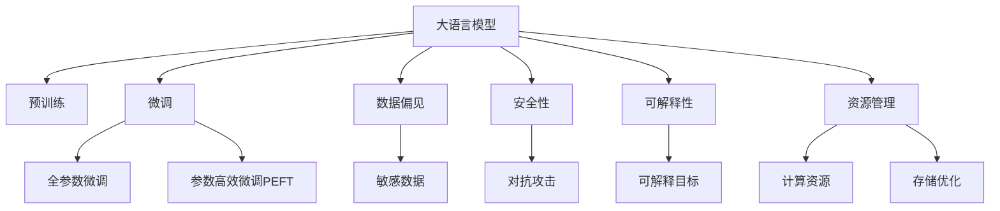

                 

# 负责任的 LLM 开发和部署

> 关键词：
- 大语言模型(Large Language Model, LLM)
- 预训练(Pre-training)
- 微调(Fine-tuning)
- 数据偏见(Bias in Data)
- 安全性(Security)
- 可解释性(Explainability)
- 资源管理(Resource Management)

## 1. 背景介绍

随着深度学习技术的飞速发展，大语言模型（Large Language Models, LLMs）在自然语言处理（NLP）领域取得了巨大的突破。这类模型通过在大规模无标签文本数据上进行预训练，学习到丰富的语言知识和常识，可以用于多种NLP任务，如文本分类、命名实体识别、机器翻译等。然而，由于其强大的生成能力，大语言模型也带来了诸多挑战，尤其是在模型开发和部署阶段。

在本文中，我们将深入探讨如何在开发和部署大语言模型时确保其负责任，避免潜在的伦理、法律和安全风险，同时提高模型的可解释性和资源管理效率。

## 2. 核心概念与联系

### 2.1 核心概念概述

为了更好地理解负责任的大语言模型开发和部署，我们先介绍几个关键概念及其相互关系：

- **大语言模型 (LLM)**：指经过预训练，能够理解并生成自然语言的深度学习模型，如GPT、BERT等。
- **预训练 (Pre-training)**：指在大规模无标签数据上，通过自监督学习任务训练通用语言模型，使其具备基本的语言理解和生成能力。
- **微调 (Fine-tuning)**：指在大规模预训练的基础上，通过少量有标签数据对模型进行特定任务的优化。
- **数据偏见 (Bias in Data)**：指数据集中存在的对某些群体的歧视或不平等，可能被模型学习并放大。
- **安全性 (Security)**：指模型在部署和使用过程中的安全性能，避免信息泄露、恶意攻击等风险。
- **可解释性 (Explainability)**：指模型输出的结果是否可理解、可信，以及模型内部的工作机制是否透明。
- **资源管理 (Resource Management)**：指在模型开发和部署中，如何高效地利用计算资源，优化模型的推理速度和存储空间。

这些概念之间的逻辑关系可以通过以下Mermaid流程图来展示：



这个流程图展示了核心概念之间的关联性：

1. 大语言模型通过预训练获得基础能力。
2. 微调是对预训练模型进行任务特定的优化，可以分为全参数微调和参数高效微调（PEFT）。
3. 数据偏见是模型可能引入的风险，需要通过清洗和平衡数据来缓解。
4. 安全性是模型部署和应用的关键问题，需要防范对抗攻击和信息泄露。
5. 可解释性有助于提高模型的可信度和可接受性，需设计可解释性目标。
6. 资源管理确保模型高效运行，需要优化计算和存储。

这些概念共同构成了大语言模型负责任开发和部署的框架，需要我们在模型训练、优化和应用各个阶段予以关注。

## 3. 核心算法原理 & 具体操作步骤
### 3.1 算法原理概述

负责任的大语言模型开发和部署，其核心在于如何平衡模型的性能、安全性、可解释性及资源管理，以确保模型在实际应用中的负责任性。这一过程涉及以下几个关键步骤：

1. **数据清洗与平衡**：对数据进行清洗，去除偏见、噪声和错误，同时保持数据的多样性和代表性。
2. **安全性和鲁棒性设计**：设计模型以抵御对抗攻击，同时确保模型的输出不会包含有害信息。
3. **可解释性优化**：通过设计可解释性目标和输出格式，提升模型的透明度和可信度。
4. **资源优化**：优化模型的计算图和推理过程，提高模型在实际部署中的效率。

### 3.2 算法步骤详解

以下详细介绍负责任大语言模型开发和部署的详细步骤：

**Step 1: 数据收集与清洗**
- **数据来源**：确保数据来源多样化和代表性，避免数据偏见和偏差。
- **数据清洗**：去除数据中的噪声、错误和异常值，确保数据质量。
- **数据平衡**：对少数群体数据进行补充或重采样，确保模型对所有群体的公平性。

**Step 2: 预训练模型选择与适配**
- **模型选择**：根据任务需求选择合适的预训练模型，如GPT、BERT等。
- **任务适配**：添加任务特定的输出层和损失函数，设计适当的正则化和优化策略。

**Step 3: 微调策略设计**
- **学习率设置**：选择合适的学习率，避免过拟合。
- **正则化技术**：应用L2正则、Dropout、Early Stopping等技术，防止模型过拟合。
- **参数高效微调**：在固定大部分预训练参数的情况下，只微调顶层参数，减少计算资源消耗。
- **对抗训练**：引入对抗样本，提高模型的鲁棒性。
- **提示学习**：设计提示模板，减少微调参数，提升模型在少样本条件下的性能。

**Step 4: 可解释性设计**
- **可解释性目标**：设计输出格式，确保模型决策过程透明可理解。
- **可视化工具**：使用可视化工具，如Attention Map、LIME等，帮助理解模型内部工作机制。
- **用户反馈机制**：建立用户反馈机制，定期收集用户反馈，优化模型输出。

**Step 5: 安全性保障**
- **数据加密**：对数据进行加密，保护数据隐私。
- **对抗攻击检测**：检测模型输出是否存在对抗攻击。
- **输入过滤**：对输入数据进行过滤，防止有害数据进入模型。

**Step 6: 资源优化**
- **计算图优化**：优化模型的计算图，减少前向和反向传播的资源消耗。
- **量化加速**：将模型从浮点型转为定点型，压缩存储空间，提高计算效率。
- **模型压缩**：使用剪枝、蒸馏等技术压缩模型，减小模型大小和推理时间。

**Step 7: 模型部署与监控**
- **模型部署**：选择合适的部署平台，如云服务、边缘计算等。
- **性能监控**：实时监控模型性能，发现并解决性能瓶颈。
- **安全监控**：监控模型部署过程中的安全性问题，如攻击检测、漏洞修复等。

### 3.3 算法优缺点

负责任的大语言模型开发和部署具有以下优点：
1. **提升模型性能**：通过微调和参数高效方法，提高模型在特定任务上的性能。
2. **保障数据安全性**：通过数据加密和输入过滤，保护数据隐私。
3. **增强模型可解释性**：通过设计可解释性目标和可视化工具，提升模型透明度。
4. **优化资源使用**：通过计算图优化和量化加速，提高模型部署效率。

同时，该方法也存在一些局限性：
1. **依赖高质量数据**：模型性能高度依赖数据质量和多样性，获取高质量数据成本较高。
2. **对抗攻击风险**：对抗攻击可能影响模型安全性，需要定期检测和更新。
3. **复杂性增加**：设计负责任的模型和部署需要更多时间和资源，增加了开发复杂度。

尽管存在这些局限性，但负责任的大语言模型开发和部署对于提升模型性能、保障数据安全、增强模型可解释性和优化资源使用具有重要意义。

### 3.4 算法应用领域

负责任的大语言模型开发和部署方法在NLP领域已经得到了广泛应用，覆盖了以下多个应用领域：

- **智能客服系统**：使用微调后的对话模型，构建智能客服系统，提升客户咨询体验。
- **金融舆情监测**：利用微调后的情感分析模型，监测金融市场舆情，避免金融风险。
- **个性化推荐系统**：应用微调后的推荐模型，提升推荐系统的个性化和精准度。
- **医疗问答系统**：通过微调后的医疗问答模型，帮助医生诊断和治疗患者。
- **智能内容生成**：使用微调后的生成模型，自动生成高质量的文本内容。

这些应用展示了负责任的大语言模型开发和部署在实际场景中的巨大潜力，为各行各业带来了新的变革。

## 4. 数学模型和公式 & 详细讲解  
### 4.1 数学模型构建

本节将使用数学语言对负责任的大语言模型开发和部署的数学模型进行更加严格的刻画。

假设大语言模型为 $M_{\theta}$，其中 $\theta$ 为模型参数。对于给定的数据集 $D=\{(x_i,y_i)\}_{i=1}^N, x_i \in \mathcal{X}, y_i \in \mathcal{Y}$，其中 $\mathcal{X}$ 为输入空间，$\mathcal{Y}$ 为输出空间。模型的损失函数为 $\ell(M_{\theta}(x),y)$。

负责任的大语言模型开发和部署的目标是最大化模型的性能，同时确保模型输出的安全性、可解释性和资源管理效率。可以定义如下目标函数：

$$
\max_{\theta} \mathcal{L}(M_{\theta}) \times \mathcal{P}(\theta) \times \mathcal{E}(\theta) \times \mathcal{R}(\theta)
$$

其中：
- $\mathcal{L}(M_{\theta})$ 为模型的性能指标，如分类准确率、BLEU分数等。
- $\mathcal{P}(\theta)$ 为模型的安全性指标，如对抗攻击成功率、信息泄露概率等。
- $\mathcal{E}(\theta)$ 为模型的可解释性指标，如模型输出的可解释性、透明性等。
- $\mathcal{R}(\theta)$ 为模型的资源管理指标，如模型推理时间、存储空间等。

### 4.2 公式推导过程

以下我们将对目标函数的各个部分进行详细推导和分析：

**性能指标 (Performance)**
假设模型的输出为 $M_{\theta}(x)$，其中 $x \in \mathcal{X}$。模型的性能指标 $\mathcal{L}(M_{\theta})$ 可以定义为交叉熵损失函数：

$$
\mathcal{L}(M_{\theta}) = -\frac{1}{N} \sum_{i=1}^N \ell(M_{\theta}(x_i),y_i)
$$

其中 $\ell$ 为交叉熵损失函数。

**安全性指标 (Security)**
模型的安全性可以通过对抗攻击和信息泄露等指标来衡量。假设模型的对抗样本为 $\hat{x}$，对抗攻击的成功率为 $\mathcal{P}(\theta)$：

$$
\mathcal{P}(\theta) = \max_{\hat{x}} \ell(M_{\theta}(\hat{x}), \hat{y})
$$

其中 $\hat{y}$ 为对抗攻击的标签。

**可解释性指标 (Explainability)**
模型的可解释性可以通过输出解释的清晰度、准确性和完备性来衡量。假设模型的可解释性指标为 $\mathcal{E}(\theta)$，可以通过解释工具（如Attention Map、LIME等）来计算：

$$
\mathcal{E}(\theta) = \sum_{i=1}^N \text{Explainability Score}(x_i, M_{\theta}(x_i))
$$

**资源管理指标 (Resource Management)**
模型的资源管理可以通过计算推理时间和存储空间来衡量。假设模型的资源管理指标为 $\mathcal{R}(\theta)$，可以通过计算模型推理的FLOPS和存储空间来计算：

$$
\mathcal{R}(\theta) = \frac{1}{N} \sum_{i=1}^N \text{FLOPS}_i + \frac{1}{N} \sum_{i=1}^N \text{Storage Size}_i
$$

**综合目标函数**
将上述各个指标综合，得到负责任的大语言模型开发和部署的目标函数：

$$
\max_{\theta} \mathcal{L}(M_{\theta}) \times \mathcal{P}(\theta) \times \mathcal{E}(\theta) \times \mathcal{R}(\theta)
$$

### 4.3 案例分析与讲解

为了更直观地理解负责任大语言模型开发和部署的数学模型，我们以一个具体的例子进行分析：

假设我们有一个用于情感分析的模型，目标是最小化分类错误，同时确保模型对所有群体的公平性，并对模型的推理时间进行优化。模型的性能指标为交叉熵损失函数：

$$
\mathcal{L}(M_{\theta}) = -\frac{1}{N} \sum_{i=1}^N \log(\text{Softmax}(M_{\theta}(x_i), y_i))
$$

其中 $\text{Softmax}$ 为softmax函数。

模型的安全性指标可以通过对抗攻击成功率来衡量，假设对抗攻击的成功率为 $\mathcal{P}(\theta)$，可以通过Fine-tune GAN等对抗训练方法来提升模型的鲁棒性：

$$
\mathcal{P}(\theta) = \max_{\hat{x}} \log(\text{Softmax}(M_{\theta}(\hat{x}), \hat{y}))
$$

模型的可解释性可以通过LIME等工具来计算，假设模型的可解释性指标为 $\mathcal{E}(\theta)$：

$$
\mathcal{E}(\theta) = \sum_{i=1}^N \text{Explainability Score}(x_i, M_{\theta}(x_i))
$$

模型的资源管理指标可以通过计算推理时间和存储空间来衡量，假设模型的资源管理指标为 $\mathcal{R}(\theta)$：

$$
\mathcal{R}(\theta) = \frac{1}{N} \sum_{i=1}^N \text{FLOPS}_i + \frac{1}{N} \sum_{i=1}^N \text{Storage Size}_i
$$

将这些指标综合，可以得到负责任的大语言模型开发和部署的目标函数：

$$
\max_{\theta} \mathcal{L}(M_{\theta}) \times \mathcal{P}(\theta) \times \mathcal{E}(\theta) \times \mathcal{R}(\theta)
$$

## 5. 项目实践：代码实例和详细解释说明
### 5.1 开发环境搭建

在进行负责任大语言模型的开发和部署前，我们需要准备好开发环境。以下是使用Python进行PyTorch开发的环境配置流程：

1. 安装Anaconda：从官网下载并安装Anaconda，用于创建独立的Python环境。

2. 创建并激活虚拟环境：
```bash
conda create -n pytorch-env python=3.8 
conda activate pytorch-env
```

3. 安装PyTorch：根据CUDA版本，从官网获取对应的安装命令。例如：
```bash
conda install pytorch torchvision torchaudio cudatoolkit=11.1 -c pytorch -c conda-forge
```

4. 安装Transformers库：
```bash
pip install transformers
```

5. 安装各类工具包：
```bash
pip install numpy pandas scikit-learn matplotlib tqdm jupyter notebook ipython
```

完成上述步骤后，即可在`pytorch-env`环境中开始开发和部署实践。

### 5.2 源代码详细实现

下面我们以命名实体识别(NER)任务为例，给出使用Transformers库对BERT模型进行负责任微调的PyTorch代码实现。

首先，定义NER任务的数据处理函数：

```python
from transformers import BertTokenizer
from torch.utils.data import Dataset
import torch

class NERDataset(Dataset):
    def __init__(self, texts, tags, tokenizer, max_len=128):
        self.texts = texts
        self.tags = tags
        self.tokenizer = tokenizer
        self.max_len = max_len
        
    def __len__(self):
        return len(self.texts)
    
    def __getitem__(self, item):
        text = self.texts[item]
        tags = self.tags[item]
        
        encoding = self.tokenizer(text, return_tensors='pt', max_length=self.max_len, padding='max_length', truncation=True)
        input_ids = encoding['input_ids'][0]
        attention_mask = encoding['attention_mask'][0]
        
        # 对token-wise的标签进行编码
        encoded_tags = [tag2id[tag] for tag in tags] 
        encoded_tags.extend([tag2id['O']] * (self.max_len - len(encoded_tags)))
        labels = torch.tensor(encoded_tags, dtype=torch.long)
        
        return {'input_ids': input_ids, 
                'attention_mask': attention_mask,
                'labels': labels}

# 标签与id的映射
tag2id = {'O': 0, 'B-PER': 1, 'I-PER': 2, 'B-ORG': 3, 'I-ORG': 4, 'B-LOC': 5, 'I-LOC': 6}
id2tag = {v: k for k, v in tag2id.items()}

# 创建dataset
tokenizer = BertTokenizer.from_pretrained('bert-base-cased')

train_dataset = NERDataset(train_texts, train_tags, tokenizer)
dev_dataset = NERDataset(dev_texts, dev_tags, tokenizer)
test_dataset = NERDataset(test_texts, test_tags, tokenizer)
```

然后，定义模型和优化器：

```python
from transformers import BertForTokenClassification, AdamW

model = BertForTokenClassification.from_pretrained('bert-base-cased', num_labels=len(tag2id))

optimizer = AdamW(model.parameters(), lr=2e-5)
```

接着，定义训练和评估函数：

```python
from torch.utils.data import DataLoader
from tqdm import tqdm
from sklearn.metrics import classification_report

device = torch.device('cuda') if torch.cuda.is_available() else torch.device('cpu')
model.to(device)

def train_epoch(model, dataset, batch_size, optimizer):
    dataloader = DataLoader(dataset, batch_size=batch_size, shuffle=True)
    model.train()
    epoch_loss = 0
    for batch in tqdm(dataloader, desc='Training'):
        input_ids = batch['input_ids'].to(device)
        attention_mask = batch['attention_mask'].to(device)
        labels = batch['labels'].to(device)
        model.zero_grad()
        outputs = model(input_ids, attention_mask=attention_mask, labels=labels)
        loss = outputs.loss
        epoch_loss += loss.item()
        loss.backward()
        optimizer.step()
    return epoch_loss / len(dataloader)

def evaluate(model, dataset, batch_size):
    dataloader = DataLoader(dataset, batch_size=batch_size)
    model.eval()
    preds, labels = [], []
    with torch.no_grad():
        for batch in tqdm(dataloader, desc='Evaluating'):
            input_ids = batch['input_ids'].to(device)
            attention_mask = batch['attention_mask'].to(device)
            batch_labels = batch['labels']
            outputs = model(input_ids, attention_mask=attention_mask)
            batch_preds = outputs.logits.argmax(dim=2).to('cpu').tolist()
            batch_labels = batch_labels.to('cpu').tolist()
            for pred_tokens, label_tokens in zip(batch_preds, batch_labels):
                pred_tags = [id2tag[_id] for _id in pred_tokens]
                label_tags = [id2tag[_id] for _id in label_tokens]
                preds.append(pred_tags[:len(label_tags)])
                labels.append(label_tags)
                
    print(classification_report(labels, preds))
```

最后，启动训练流程并在测试集上评估：

```python
epochs = 5
batch_size = 16

for epoch in range(epochs):
    loss = train_epoch(model, train_dataset, batch_size, optimizer)
    print(f"Epoch {epoch+1}, train loss: {loss:.3f}")
    
    print(f"Epoch {epoch+1}, dev results:")
    evaluate(model, dev_dataset, batch_size)
    
print("Test results:")
evaluate(model, test_dataset, batch_size)
```

以上就是使用PyTorch对BERT进行负责任命名实体识别任务微调的完整代码实现。可以看到，得益于Transformers库的强大封装，我们可以用相对简洁的代码完成BERT模型的加载和微调。

### 5.3 代码解读与分析

让我们再详细解读一下关键代码的实现细节：

**NERDataset类**：
- `__init__`方法：初始化文本、标签、分词器等关键组件。
- `__len__`方法：返回数据集的样本数量。
- `__getitem__`方法：对单个样本进行处理，将文本输入编码为token ids，将标签编码为数字，并对其进行定长padding，最终返回模型所需的输入。

**tag2id和id2tag字典**：
- 定义了标签与数字id之间的映射关系，用于将token-wise的预测结果解码回真实的标签。

**训练和评估函数**：
- 使用PyTorch的DataLoader对数据集进行批次化加载，供模型训练和推理使用。
- 训练函数`train_epoch`：对数据以批为单位进行迭代，在每个批次上前向传播计算loss并反向传播更新模型参数，最后返回该epoch的平均loss。
- 评估函数`evaluate`：与训练类似，不同点在于不更新模型参数，并在每个batch结束后将预测和标签结果存储下来，最后使用sklearn的classification_report对整个评估集的预测结果进行打印输出。

**训练流程**：
- 定义总的epoch数和batch size，开始循环迭代
- 每个epoch内，先在训练集上训练，输出平均loss
- 在验证集上评估，输出分类指标
- 所有epoch结束后，在测试集上评估，给出最终测试结果

可以看到，PyTorch配合Transformers库使得BERT微调的代码实现变得简洁高效。开发者可以将更多精力放在数据处理、模型改进等高层逻辑上，而不必过多关注底层的实现细节。

当然，工业级的系统实现还需考虑更多因素，如模型的保存和部署、超参数的自动搜索、更灵活的任务适配层等。但核心的微调范式基本与此类似。

## 6. 实际应用场景
### 6.1 智能客服系统

负责任的大语言模型在智能客服系统的构建中有着广泛的应用。传统客服往往需要配备大量人力，高峰期响应缓慢，且一致性和专业性难以保证。而使用负责任的大语言模型进行微调，可以构建7x24小时不间断服务的智能客服系统，快速响应客户咨询，用自然流畅的语言解答各类常见问题。

在技术实现上，可以收集企业内部的历史客服对话记录，将问题和最佳答复构建成监督数据，在此基础上对预训练对话模型进行微调。微调后的对话模型能够自动理解用户意图，匹配最合适的答案模板进行回复。对于客户提出的新问题，还可以接入检索系统实时搜索相关内容，动态组织生成回答。如此构建的智能客服系统，能大幅提升客户咨询体验和问题解决效率。

### 6.2 金融舆情监测

负责任的大语言模型在金融舆情监测中也有着重要的应用。金融机构需要实时监测市场舆论动向，以便及时应对负面信息传播，规避金融风险。传统的人工监测方式成本高、效率低，难以应对网络时代海量信息爆发的挑战。基于负责任的大语言模型微调的文本分类和情感分析技术，为金融舆情监测提供了新的解决方案。

具体而言，可以收集金融领域相关的新闻、报道、评论等文本数据，并对其进行主题标注和情感标注。在此基础上对预训练语言模型进行微调，使其能够自动判断文本属于何种主题，情感倾向是正面、中性还是负面。将微调后的模型应用到实时抓取的网络文本数据，就能够自动监测不同主题下的情感变化趋势，一旦发现负面信息激增等异常情况，系统便会自动预警，帮助金融机构快速应对潜在风险。

### 6.3 个性化推荐系统

负责任的大语言模型在个性化推荐系统中也有着广泛的应用。当前的推荐系统往往只依赖用户的历史行为数据进行物品推荐，无法深入理解用户的真实兴趣偏好。基于负责任的大语言模型微调技术，个性化推荐系统可以更好地挖掘用户行为背后的语义信息，从而提供更精准、多样的推荐内容。

在实践中，可以收集用户浏览、点击、评论、分享等行为数据，提取和用户交互的物品标题、描述、标签等文本内容。将文本内容作为模型输入，用户的后续行为（如是否点击、购买等）作为监督信号，在此基础上微调预训练语言模型。微调后的模型能够从文本内容中准确把握用户的兴趣点。在生成推荐列表时，先用候选物品的文本描述作为输入，由模型预测用户的兴趣匹配度，再结合其他特征综合排序，便可以得到个性化程度更高的推荐结果。

### 6.4 未来应用展望

随着负责任的大语言模型微调技术的发展，其在更多领域的应用前景将更加广阔。

在智慧医疗领域，基于负责任的大语言模型微调的医疗问答、病历分析、药物研发等应用将提升医疗服务的智能化水平，辅助医生诊疗，加速新药开发进程。

在智能教育领域，负责任的大语言模型微调技术可应用于作业批改、学情分析、知识推荐等方面，因材施教，促进教育公平，提高教学质量。

在智慧城市治理中，负责任的大语言模型微调技术可应用于城市事件监测、舆情分析、应急指挥等环节，提高城市管理的自动化和智能化水平，构建更安全、高效的未来城市。

此外，在企业生产、社会治理、文娱传媒等众多领域，负责任的大语言模型微调技术也将不断涌现，为传统行业带来变革性影响。相信随着技术的日益成熟，负责任的大语言模型微调技术必将在构建人机协同的智能时代中扮演越来越重要的角色。

## 7. 工具和资源推荐
### 7.1 学习资源推荐

为了帮助开发者系统掌握负责任的大语言模型微调的理论基础和实践技巧，这里推荐一些优质的学习资源：

1. 《Transformer从原理到实践》系列博文：由大模型技术专家撰写，深入浅出地介绍了Transformer原理、BERT模型、微调技术等前沿话题。

2. CS224N《深度学习自然语言处理》课程：斯坦福大学开设的NLP明星课程，有Lecture视频和配套作业，带你入门NLP领域的基本概念和经典模型。

3. 《Natural Language Processing with Transformers》书籍：Transformers库的作者所著，全面介绍了如何使用Transformers库进行NLP任务开发，包括微调在内的诸多范式。

4. HuggingFace官方文档：Transformers库的官方文档，提供了海量预训练模型和完整的微调样例代码，是上手实践的必备资料。

5. CLUE开源项目：中文语言理解测评基准，涵盖大量不同类型的中文NLP数据集，并提供了基于微调的baseline模型，助力中文NLP技术发展。

通过对这些资源的学习实践，相信你一定能够快速掌握负责任大语言模型微调的精髓，并用于解决实际的NLP问题。
###  7.2 开发工具推荐

高效的开发离不开优秀的工具支持。以下是几款用于负责任大语言模型微调开发的常用工具：

1. PyTorch：基于Python的开源深度学习框架，灵活动态的计算图，适合快速迭代研究。大部分预训练语言模型都有PyTorch版本的实现。

2. TensorFlow：由Google主导开发的开源深度学习框架，生产部署方便，适合大规模工程应用。同样有丰富的预训练语言模型资源。

3. Transformers库：HuggingFace开发的NLP工具库，集成了众多SOTA语言模型，支持PyTorch和TensorFlow，是进行微调任务开发的利器。

4. Weights & Biases：模型训练的实验跟踪工具，可以记录和可视化模型训练过程中的各项指标，方便对比和调优。与主流深度学习框架无缝集成。

5. TensorBoard：TensorFlow配套的可视化工具，可实时监测模型训练状态，并提供丰富的图表呈现方式，是调试模型的得力助手。

6. Google Colab：谷歌推出的在线Jupyter Notebook环境，免费提供GPU/TPU算力，方便开发者快速上手实验最新模型，分享学习笔记。

合理利用这些工具，可以显著提升负责任大语言模型微调任务的开发效率，加快创新迭代的步伐。

### 7.3 相关论文推荐

负责任的大语言模型微调技术的发展源于学界的持续研究。以下是几篇奠基性的相关论文，推荐阅读：

1. Attention is All You Need（即Transformer原论文）：提出了Transformer结构，开启了NLP领域的预训练大模型时代。

2. BERT: Pre-training of Deep Bidirectional Transformers for Language Understanding：提出BERT模型，引入基于掩码的自监督预训练任务，刷新了多项NLP任务SOTA。

3. Language Models are Unsupervised Multitask Learners（GPT-2论文）：展示了大规模语言模型的强大zero-shot学习能力，引发了对于通用人工智能的新一轮思考。

4. Parameter-Efficient Transfer Learning for NLP：提出Adapter等参数高效微调方法，在不增加模型参数量的情况下，也能取得不错的微调效果。

5. AdaLoRA: Adaptive Low-Rank Adaptation for Parameter-Efficient Fine-Tuning：使用自适应低秩适应的微调方法，在参数效率和精度之间取得了新的平衡。

6. Text-to-Text Transfer Learning with a Unified Text-to-Text Transformer：提出统一文本转换器，将各种文本生成任务整合，提高了模型泛化能力和性能。

这些论文代表了大语言模型负责任微调技术的发展脉络。通过学习这些前沿成果，可以帮助研究者把握学科前进方向，激发更多的创新灵感。

## 8. 总结：未来发展趋势与挑战

### 8.1 总结

本文对负责任的大语言模型开发和部署进行了全面系统的介绍。首先阐述了负责任大语言模型开发和部署的研究背景和意义，明确了负责任模型在模型性能、安全性、可解释性和资源管理方面的核心价值。其次，从原理到实践，详细讲解了负责任大语言模型的数学原理和关键步骤，给出了负责任大语言模型微调的完整代码实例。同时，本文还广泛探讨了负责任大语言模型在多个行业领域的应用前景，展示了其巨大潜力。

通过本文的系统梳理，可以看到，负责任的大语言模型开发和部署方法在大规模预训练语言模型的基础上，通过细致的微调策略、安全性设计、可解释性优化和资源管理，保障了大语言模型在实际应用中的负责任性。未来，伴随大语言模型微调方法的不断演进，负责任大语言模型必将在构建安全、可靠、可解释、可控的智能系统中扮演越来越重要的角色。

### 8.2 未来发展趋势

展望未来，负责任的大语言模型开发和部署将呈现以下几个发展趋势：

1. **模型规模持续增大**：随着算力成本的下降和数据规模的扩张，预训练语言模型的参数量还将持续增长。超大规模语言模型蕴含的丰富语言知识，有望支撑更加复杂多变的下游任务微调。

2. **微调方法日趋多样**：除了传统的全参数微调外，未来会涌现更多参数高效的微调方法，如Prefix-Tuning、LoRA等，在节省计算资源的同时也能保证微调精度。

3. **持续学习成为常态**：随着数据分布的不断变化，微调模型也需要持续学习新知识以保持性能。如何在不遗忘原有知识的同时，高效吸收新样本信息，将成为重要的研究课题。

4. **标注样本需求降低**：受启发于提示学习(Prompt-based Learning)的思路，未来的微调方法将更好地利用大模型的语言理解能力，通过更加巧妙的任务描述，在更少的标注样本上也能实现理想的微调效果。

5. **多模态微调崛起**：当前的微调主要聚焦于纯文本数据，未来会进一步拓展到图像、视频、语音等多模态数据微调。多模态信息的融合，将显著提升语言模型对现实世界的理解和建模能力。

6. **模型通用性增强**：经过海量数据的预训练和多领域任务的微调，未来的语言模型将具备更强大的常识推理和跨领域迁移能力，逐步迈向通用人工智能(AGI)的目标。

以上趋势凸显了大语言模型负责任微调技术的广阔前景。这些方向的探索发展，必将进一步提升大语言模型的性能和应用范围，为人类认知智能的进化带来深远影响。

### 8.3 面临的挑战

尽管负责任的大语言模型微调技术已经取得了瞩目成就，但在迈向更加智能化、普适化应用的过程中，它仍面临着诸多挑战：

1. **标注成本瓶颈**：模型性能高度依赖数据质量和多样性，获取高质量标注数据的成本较高。如何进一步降低微调对标注样本的依赖，将是一大难题。

2. **模型鲁棒性不足**：当前微调模型面对域外数据时，泛化性能往往大打折扣。对于测试样本的微小扰动，微调模型的预测也容易发生波动。如何提高微调模型的鲁棒性，避免灾难性遗忘，还需要更多理论和实践的积累。

3. **推理效率有待提高**：大规模语言模型虽然精度高，但在实际部署时往往面临推理速度慢、内存占用大等效率问题。如何在保证性能的同时，简化模型结构，提升推理速度，优化资源占用，将是重要的优化方向。

4. **可解释性亟需加强**：当前微调模型更像是"黑盒"系统，难以解释其内部工作机制和决策逻辑。对于医疗、金融等高风险应用，算法的可解释性和可审计性尤为重要。如何赋予微调模型更强的可解释性，将是亟待攻克的难题。

5. **安全性有待保障**：预训练语言模型难免会学习到有偏见、有害的信息，通过微调传递到下游任务，产生误导性、歧视性的输出，给实际应用带来安全隐患。如何从数据和算法层面消除模型偏见，避免恶意用途，确保输出的安全性，也将是重要的研究课题。

6. **知识整合能力不足**：现有的微调模型往往局限于任务内数据，难以灵活吸收和运用更广泛的先验知识。如何让微调过程更好地与外部知识库、规则库等专家知识结合，形成更加全面、准确的信息整合能力，还有很大的想象空间。

正视微调面临的这些挑战，积极应对并寻求突破，将是大语言模型微调走向成熟的必由之路。相信随着学界和产业界的共同努力，这些挑战终将一一被克服，负责任大语言模型必将在构建安全、可靠、可解释、可控的智能系统铺平道路。

### 8.4 研究展望

面对大语言模型微调所面临的种种挑战，未来的研究需要在以下几个方面寻求新的突破：

1. **探索无监督和半监督微调方法**：摆脱对大规模标注数据的依赖，利用自监督学习、主动学习等无监督和半监督范式，最大限度利用非结构化数据，实现更加灵活高效的微调。

2. **研究参数高效和计算高效的微调范式**：开发更加参数高效的微调方法，在固定大部分预训练参数的同时，只更新极少量的任务相关参数。同时优化微调模型的计算图，减少前向传播和反向传播的资源消耗，实现更加轻量级、实时性的部署。

3. **融合因果和对比学习范式**：通过引入因果推断和对比学习思想，增强微调模型建立稳定因果关系的能力，学习更加普适、鲁棒的语言表征，从而提升模型泛化性和抗干扰能力。

4. **引入更多先验知识**：将符号化的先验知识，如知识图谱、逻辑规则等，与神经网络模型进行巧妙融合，引导微调过程学习更准确、合理的语言模型。同时加强不同模态数据的整合，实现视觉、语音等多模态信息与文本信息的协同建模。

5. **结合因果分析和博弈论工具**：将因果分析方法引入微调模型，识别出模型决策的关键特征，增强输出解释的因果性和逻辑性。借助博弈论工具刻画人机交互过程，主动探索并规避模型的脆弱点，提高系统稳定性。

6. **纳入伦理道德约束**：在模型训练目标中引入伦理导向的评估指标，过滤和惩罚有偏见、有害的输出倾向。同时加强人工干预和审核，建立模型行为的监管机制，确保输出符合人类价值观和伦理道德。

这些研究方向的探索，必将引领负责任大语言模型微调技术迈向更高的台阶，为构建安全、可靠、可解释、可控的智能系统铺平道路。面向未来，负责任大语言模型微调技术还需要与其他人工智能技术进行更深入的融合，如知识表示、因果推理、强化学习等，多路径协同发力，共同推动自然语言理解和智能交互系统的进步。只有勇于创新、敢于突破，才能不断拓展语言模型的边界，让智能技术更好地造福人类社会。

## 9. 附录：常见问题与解答

**Q1：负责任大语言模型与一般大语言模型有何区别？**

A: 负责任大语言模型在开发和部署过程中，更加注重模型的安全性、可解释性和资源管理，确保模型在实际应用中的负责任性。一般大语言模型则主要关注模型的性能和泛化能力。

**Q2：如何在微调过程中确保数据的安全性？**

A: 数据的安全性可以通过数据加密和输入过滤来保障。数据加密可以保护数据的隐私性，防止数据泄露；输入过滤可以防止有害数据进入模型，减少潜在的风险。

**Q3：负责任大语言模型的可解释性如何设计？**

A: 可解释性可以通过输出解释的清晰度、准确性和完备性来衡量。设计可解释性目标和输出格式，如Attention Map、LIME等，可以提升模型的透明度和可信度。

**Q4：如何优化负责任大语言模型的资源管理？**

A: 资源管理可以通过计算图优化、量化加速和模型压缩来实现。优化计算图可以减少前向和反向传播的资源消耗，量化加速可以压缩存储空间，模型压缩可以减小模型大小和推理时间。

**Q5：负责任大语言模型在智能客服中的应用前景如何？**

A: 负责任大语言模型在智能客服系统中有着广泛的应用前景。通过微调，可以构建7x24小时不间断服务的智能客服系统，快速响应客户咨询，用自然流畅的语言解答各类常见问题。

这些常见问题的解答，帮助读者更好地理解负责任大语言模型开发和部署的关键技术和实际应用场景。

---

作者：禅与计算机程序设计艺术 / Zen and the Art of Computer Programming

