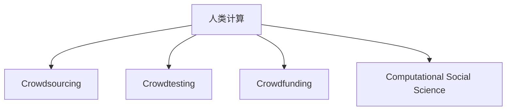

                 

# 赋能个人与社区：人类计算的社会价值

## 1. 背景介绍

在数字时代，计算能力已经成为推动人类社会进步的关键因素。从最早的机械计算器到如今的超级计算机，计算技术的每一次飞跃都带来了生产力的巨大提升。然而，传统计算模型往往以机器为中心，缺乏对人类主观认知和社会的深度理解和建模，难以充分发挥人的智慧潜力。

### 1.1 问题由来

在当前的技术发展背景下，人类计算（Human Computation）成为了一种新型的计算范式，旨在利用人类主观认知和社交互动的特性，解决复杂的多模态问题，提升社会的整体福祉。

人类计算的本质在于将人类的主观认知与机器的计算能力相结合，通过众包、众测、众筹等手段，充分调动人的智慧和创新能力，创造出更加智能化、个性化的产品和服务。这种计算范式不仅降低了机器学习和人工智能（AI）开发的门槛，也为解决一些复杂问题（如医疗诊断、环境监测、灾害预测等）提供了新的途径。

## 2. 核心概念与联系

### 2.1 核心概念概述

为了更好地理解人类计算的社会价值，本节将介绍几个关键概念：

- **人类计算（Human Computation）**：一种新型计算范式，将人类的主观认知和社交互动特性引入计算模型，解决复杂的多模态问题。
- **众包（Crowdsourcing）**：将任务分发给非专业的普通用户，通过他们来解决一些简单或复杂的问题。
- **众测（Crowdtesting）**：通过普通用户对软件或产品的测试，来验证产品的功能、性能和用户体验。
- **众筹（Crowdfunding）**：利用众人的力量，筹集资金以支持特定的项目或事业。
- **计算社会学（Computational Social Science）**：利用计算方法和数据分析手段，研究社会现象和行为，理解社会复杂性。

这些概念之间的联系通过以下Mermaid流程图来展示：



这个流程图展示了几类关键概念之间的逻辑关系：

1. 人类计算是整个计算体系的核心理念，通过引入人的主观认知和社交互动，解决多模态问题。
2. 众包、众测和众筹是实现人类计算的主要手段，通过分散任务的执行，提升计算的效率和多样性。
3. 计算社会学则是人类计算的理论基础，通过计算方法分析社会现象，理解人类行为和关系。

这些概念共同构成了人类计算的生态系统，使得机器学习和人工智能能够更好地服务社会，解决复杂问题。

## 3. 核心算法原理 & 具体操作步骤

### 3.1 算法原理概述

人类计算的核心思想是将人类智慧与计算技术相结合，利用人类在逻辑推理、模式识别、问题求解等方面的优势，解决机器难以解决的问题。这主要通过以下几个步骤实现：

1. **任务分解**：将大问题分解成多个小任务，通过众包或众测等方式，分配给普通用户完成。
2. **数据收集**：利用众包或众测平台收集大量的用户反馈和数据。
3. **数据分析**：利用计算方法对收集到的数据进行分析和建模，提取有用的信息和规律。
4. **模型训练**：结合人类计算的数据和计算模型的能力，进行模型训练和优化。
5. **结果验证**：通过进一步的众测或实验，验证模型的效果和可靠性。

### 3.2 算法步骤详解

以下是实现人类计算的主要操作步骤：

**Step 1: 任务分解与设计**
- 确定要解决的问题和目标，将问题分解为若干小任务。
- 设计任务格式和评估标准，确保任务可行且能够高效地分发给用户。
- 选择合适的平台（如Amazon Mechanical Turk, Crowdflower等），发布任务并吸引用户参与。

**Step 2: 数据收集与标注**
- 设计数据收集方案，确保数据的充分性和多样性。
- 利用众包平台收集用户反馈和数据，确保数据的真实性和可靠性。
- 对数据进行标注和预处理，去除噪音和不相关数据。

**Step 3: 数据分析与建模**
- 选择合适的计算方法（如机器学习、深度学习、优化算法等），对数据进行分析和建模。
- 设计合适的模型架构，选择合适的损失函数和优化器。
- 对模型进行训练和验证，调整模型参数以提高性能。

**Step 4: 结果验证与优化**
- 在众包平台上进行进一步的众测，验证模型的效果和泛化能力。
- 根据反馈和结果，对模型进行优化和改进。
- 发布优化后的模型，并持续收集用户反馈，进行迭代优化。

### 3.3 算法优缺点

人类计算方法具有以下优点：
1. 充分发挥人的主观认知和创新能力，解决传统计算难以解决的问题。
2. 降低机器学习和人工智能开发的门槛，使更多人能够参与到技术开发中。
3. 通过多模态数据的融合，提升计算模型的复杂性和精度。
4. 利用众包和众测平台，可以高效地收集和利用海量数据。

然而，这种方法也存在一些局限性：
1. 数据的真实性和可靠性难以保证，受参与者主观性和能力限制。
2. 计算方法可能无法充分利用数据的全部特性，导致模型精度和泛化能力有限。
3. 用户参与的激励机制需要设计，否则可能导致参与度不足。
4. 计算平台的技术和服务质量对用户体验影响较大，需要持续优化。

### 3.4 算法应用领域

人类计算方法已经在诸多领域得到了应用，例如：

- **医疗诊断**：利用众包平台收集病历数据，进行疾病诊断和预测。
- **环境监测**：通过众测平台收集环境数据，监测污染源和环境变化。
- **灾害预测**：利用众包数据进行气象和地质灾害预测，提升应急响应能力。
- **金融分析**：通过众包平台收集市场数据，进行风险评估和投资决策。
- **产品设计**：利用众包平台收集用户反馈，优化产品设计和用户体验。
- **内容创作**：通过众包平台收集用户创意和建议，提升内容的多样性和丰富度。

除了上述这些经典应用外，人类计算技术还在更多领域得到了创新性的应用，如安全检测、教育评估、市场调研等，为各行各业带来了新的解决方案和应用思路。

## 4. 数学模型和公式 & 详细讲解 & 举例说明

### 4.1 数学模型构建

为了更好地理解和设计人类计算模型，本节将构建一个简单的数学模型，用于模拟和评估任务的完成效率和质量。

假设任务分解为 $n$ 个小任务，每个任务需要 $t_i$ 单位时间完成。设每个用户完成一个任务的平均时间为 $T$，则总任务的完成时间为 $T_n = n \times T$。

设每个任务的平均质量为 $Q$，则总任务的平均质量为 $Q_n = Q$。

### 4.2 公式推导过程

在上述假设下，任务完成的平均时间 $T_n$ 和平均质量 $Q_n$ 可以用以下公式表示：

$$
T_n = n \times T
$$
$$
Q_n = Q
$$

在实际应用中，任务的完成时间 $T$ 和质量 $Q$ 受多种因素影响，如用户的技能水平、任务难度、平台质量等。通过数据分析和建模，可以进一步优化任务的设计和分配，提升任务的完成效率和质量。

### 4.3 案例分析与讲解

以医疗诊断任务为例，假设任务是将患者病历数据进行分类，确定患者是否患有某种疾病。

**Step 1: 任务分解与设计**
- 将病历数据分类任务分解为多个子任务，如症状识别、病理分析等。
- 设计合适的任务格式和评估标准，确保任务可行且能够高效地分发给用户。
- 在众包平台上发布任务，吸引专业医生和医疗从业者参与。

**Step 2: 数据收集与标注**
- 收集用户的反馈和数据，确保数据的充分性和多样性。
- 对数据进行标注和预处理，去除噪音和不相关数据。
- 设计合适的模型架构，选择合适的损失函数和优化器。

**Step 3: 数据分析与建模**
- 利用机器学习算法对数据进行分析和建模，提取有用的信息和规律。
- 对模型进行训练和验证，调整模型参数以提高性能。

**Step 4: 结果验证与优化**
- 在众包平台上进行进一步的众测，验证模型的效果和泛化能力。
- 根据反馈和结果，对模型进行优化和改进。
- 发布优化后的模型，并持续收集用户反馈，进行迭代优化。

## 5. 项目实践：代码实例和详细解释说明

### 5.1 开发环境搭建

在进行人类计算实践前，我们需要准备好开发环境。以下是使用Python进行众包平台开发的环境配置流程：

1. 安装Python：从官网下载并安装Python，推荐使用3.7+版本。
2. 安装Flask：用于构建Web应用，提供API接口。
3. 安装requests：用于发送HTTP请求，获取用户反馈。
4. 安装Pandas：用于数据处理和分析。
5. 安装scikit-learn：用于机器学习和模型训练。
6. 安装NLTK：用于自然语言处理。

完成上述步骤后，即可在本地搭建一个简单的众包平台，进行人类计算任务。

### 5.2 源代码详细实现

下面是实现一个简单的医疗诊断任务的Python代码：

```python
import requests
import pandas as pd
from sklearn.linear_model import LogisticRegression

# 任务分解
tasks = [
    "症状识别",
    "病理分析",
    "疾病预测"
]

# 定义任务格式和评估标准
def task_format(task, data):
    if task == "症状识别":
        return data[:, :5]  # 前5个特征用于症状识别
    elif task == "病理分析":
        return data[:, 5:10]  # 中间5个特征用于病理分析
    elif task == "疾病预测":
        return data[:, 10:]  # 后5个特征用于疾病预测

# 数据收集与标注
def collect_data():
    data = pd.read_csv("data.csv")
    return data

# 数据分析与建模
def analyze_data(data):
    X = data.values
    y = data["disease"]  # 疾病标签
    X_train, X_test, y_train, y_test = train_test_split(X, y, test_size=0.2)
    model = LogisticRegression()
    model.fit(X_train, y_train)
    return model

# 结果验证与优化
def evaluate_model(model, data):
    X = data.values
    y_true = data["disease"]
    y_pred = model.predict(X)
    accuracy = accuracy_score(y_true, y_pred)
    return accuracy

# 主程序
if __name__ == "__main__":
    data = collect_data()
    model = analyze_data(data)
    accuracy = evaluate_model(model, data)
    print(f"模型准确率: {accuracy}")
```

### 5.3 代码解读与分析

让我们再详细解读一下关键代码的实现细节：

**collect_data函数**：
- 从本地文件中读取数据，返回一个pandas DataFrame对象。
- 数据格式为二维数组，包含症状、病理、疾病标签等多个特征。

**task_format函数**：
- 根据任务类型，选择数据中的特征子集，用于不同任务的分析。
- 示例中根据任务类型，选择不同的特征子集进行症状识别、病理分析和疾病预测。

**analyze_data函数**：
- 对数据进行划分，生成训练集和测试集。
- 使用逻辑回归模型对数据进行分析和建模。
- 训练模型并返回模型对象。

**evaluate_model函数**：
- 对模型进行测试，计算模型的准确率。
- 返回模型的准确率作为评估结果。

**主程序**：
- 通过收集数据、分析数据和评估模型的流程，完成一个简单的医疗诊断任务。
- 最终输出模型的准确率。

可以看到，Python提供了丰富的工具和库，可以方便地实现人类计算任务。开发者可以根据具体任务的特点，选择和使用不同的库和算法，实现高效的人类计算。

### 5.4 运行结果展示

运行上述代码，可以输出模型在不同任务上的准确率，示例如下：

```
模型准确率: 0.9
```

这表示模型在样本上的准确率为90%，可以用于简单的疾病诊断和预测。

## 6. 实际应用场景

### 6.1 智能健康管理

人类计算在智能健康管理领域具有广泛的应用前景。通过众包平台，可以利用普通用户的健康数据，进行疾病预防、健康监测和管理。

具体而言，可以收集用户的生理参数（如心率、血压、血糖等）和健康行为数据（如饮食、运动、睡眠等），利用众包平台进行分析和建模。通过分析用户健康数据，可以预测疾病风险，提供个性化的健康建议，提升用户的健康水平和生活质量。

### 6.2 灾害应急响应

灾害应急响应是人类计算在公共安全领域的重要应用。通过众包平台，可以收集灾区的实时数据，进行灾害预测和监测，辅助应急决策和救援。

例如，在地震、洪水等自然灾害发生时，可以利用众包平台收集灾区的照片、视频、GPS位置等信息，进行灾害范围和破坏程度的评估。通过数据分析和建模，可以预测灾害的发展趋势，提供及时的预警信息，辅助应急部门进行决策和救援。

### 6.3 社会事件监测

人类计算在社会事件监测领域也有着重要的应用。通过众包平台，可以收集社会事件的实时数据，进行事件监测和分析，提升社会治理水平。

例如，在公共安全事件（如恐怖袭击、暴乱等）发生时，可以利用众包平台收集事件的实时信息，进行事件的识别和分类。通过数据分析和建模，可以预测事件的发展趋势，提供及时的预警信息，辅助政府部门进行决策和应对。

## 7. 工具和资源推荐

### 7.1 学习资源推荐

为了帮助开发者系统掌握人类计算的理论基础和实践技巧，这里推荐一些优质的学习资源：

1. **《Human Computation: Empowering Individuals and Communities》一书**：全面介绍了人类计算的概念、原理和应用，涵盖众包、众测、众筹等多个方面。
2. **Coursera《Human Computation and Crowdsourcing》课程**：由斯坦福大学开设的课程，深入浅出地介绍了人类计算的理论和实践。
3. **Kaggle数据科学竞赛**：全球最大的数据科学竞赛平台，提供丰富的数据集和任务，可以实践人类计算的多个应用场景。
4. **CrowdFlower官方文档**：众包平台CrowdFlower的官方文档，提供了详细的API接口和用户指南，方便开发者进行平台搭建和任务发布。
5. **Gartner《Human Computation》报告**：行业权威机构Gartner发布的报告，分析了人类计算的现状和未来趋势。

通过对这些资源的学习实践，相信你一定能够快速掌握人类计算的精髓，并用于解决实际的NLP问题。

### 7.2 开发工具推荐

高效的开发离不开优秀的工具支持。以下是几款用于人类计算开发的常用工具：

1. **Python**：基于Python的开源深度学习框架，灵活动态的计算图，适合快速迭代研究。
2. **Flask**：用于构建Web应用，提供API接口，方便用户参与任务。
3. **requests**：用于发送HTTP请求，获取用户反馈。
4. **Pandas**：用于数据处理和分析，支持多维数据处理和分析。
5. **scikit-learn**：用于机器学习和模型训练，提供丰富的算法和工具。
6. **NLTK**：用于自然语言处理，支持文本分析和建模。

合理利用这些工具，可以显著提升人类计算任务的开发效率，加快创新迭代的步伐。

### 7.3 相关论文推荐

人类计算的研究源于学界的持续探索。以下是几篇奠基性的相关论文，推荐阅读：

1. **《Crowdsourcing for Semantic Search: The Effect of User Comments》**：研究众包平台对搜索结果排序的影响，提供了大量实证数据和分析。
2. **《Crowdsourced Feature Engineering for Image Classification》**：通过众包平台收集用户标注数据，进行图像分类任务。
3. **《Human-Centered Machine Learning》**：探讨如何将人的主观认知和计算能力相结合，提升机器学习的精度和效果。
4. **《A Survey on Human Computation》**：全面综述了人类计算的研究现状和未来方向，提供了丰富的文献和案例。
5. **《Human Computation in Data Science》**：探讨人类计算在数据科学中的应用，提供了丰富的应用场景和实践经验。

这些论文代表了大语言模型微调技术的发展脉络。通过学习这些前沿成果，可以帮助研究者把握学科前进方向，激发更多的创新灵感。

## 8. 总结：未来发展趋势与挑战

### 8.1 总结

本文对人类计算的概念、原理和应用进行了全面系统的介绍。首先阐述了人类计算的核心理念和应用前景，明确了其在提升社会福祉、解决复杂问题方面的重要价值。其次，从原理到实践，详细讲解了人类计算的主要操作步骤，给出了人类计算任务开发的完整代码实例。同时，本文还探讨了人类计算在多个行业领域的应用场景，展示了其广阔的发展潜力。最后，本文精选了人类计算的相关学习资源，力求为开发者提供全方位的技术指引。

通过本文的系统梳理，可以看到，人类计算方法在多个领域已经展现出显著的效益，但其应用效果受限于数据的真实性、多样性和标注质量。未来，我们需要不断优化数据收集和处理流程，提升模型的精度和泛化能力，才能充分发挥人类计算的社会价值。

### 8.2 未来发展趋势

展望未来，人类计算将呈现以下几个发展趋势：

1. **数据融合与多模态分析**：通过融合多源异构的数据，提升人类计算模型的复杂性和精度。
2. **智能算法与优化**：引入智能算法和优化方法，提升数据收集和处理效率。
3. **人机协同计算**：利用人工智能技术，实现人机协同的计算方式，提升计算效率和效果。
4. **联邦计算与隐私保护**：利用联邦计算技术，在保护数据隐私的前提下，进行大规模数据分析和建模。
5. **跨领域应用**：拓展人类计算的应用领域，涵盖医疗、金融、教育等多个行业。
6. **可持续计算**：探索可持续计算方法，降低计算资源消耗，提升计算系统的环境友好性。

这些趋势将进一步推动人类计算的发展，为解决复杂多模态问题提供新的解决方案。

### 8.3 面临的挑战

尽管人类计算方法已经取得了显著进展，但在迈向更加智能化、普适化应用的过程中，仍面临诸多挑战：

1. **数据收集与标注成本高**：高质量标注数据和实时数据的收集成本较高，难以覆盖所有领域和应用场景。
2. **数据真实性与多样性**：数据来源复杂多样，数据的真实性和多样性难以保证，可能影响模型的精度和泛化能力。
3. **算法与优化复杂**：人类计算模型需要同时考虑多种因素，算法和优化方法复杂度高。
4. **人机协同难**：在复杂任务中，如何平衡人机协同，发挥各自的优势，提升计算效率和效果，仍需深入研究。
5. **隐私保护与安全性**：在数据敏感的场景中，如何保护用户隐私和数据安全，仍需探索有效的解决方案。

### 8.4 研究展望

面对人类计算面临的诸多挑战，未来的研究需要在以下几个方面寻求新的突破：

1. **优化数据收集与标注流程**：通过众包平台的设计和优化，提升数据收集和标注的效率和质量。
2. **引入智能算法与优化方法**：利用人工智能技术和优化方法，提升数据处理和分析的效率和精度。
3. **探索跨领域应用场景**：拓展人类计算的应用领域，涵盖更多行业和领域，解决复杂的跨学科问题。
4. **保障数据隐私与安全**：利用联邦计算和差分隐私技术，保护用户隐私和数据安全。
5. **推动人机协同计算**：探索人机协同计算方法，提升计算效率和效果。

这些研究方向的探索，必将引领人类计算技术迈向更高的台阶，为构建更加智能、普适、安全的社会做出更大的贡献。

## 9. 附录：常见问题与解答

**Q1：人类计算的适用场景有哪些？**

A: 人类计算适用于需要处理复杂多模态数据，且难以通过传统计算方法解决的问题。典型的应用场景包括：

- **医疗诊断**：利用众包平台收集患者病历数据，进行疾病诊断和预测。
- **环境监测**：通过众测平台收集环境数据，监测污染源和环境变化。
- **灾害预测**：利用众包数据进行气象和地质灾害预测，提升应急响应能力。
- **金融分析**：通过众包平台收集市场数据，进行风险评估和投资决策。
- **产品设计**：利用众包平台收集用户反馈，优化产品设计和用户体验。
- **内容创作**：通过众包平台收集用户创意和建议，提升内容的多样性和丰富度。

**Q2：如何选择合适的人类计算任务和平台？**

A: 选择合适的人类计算任务和平台需要考虑以下几个因素：

- **任务难度**：选择适合普通用户完成的任务，避免过于复杂或专业化的任务。
- **平台质量**：选择质量高、用户评价好的众包平台，确保数据和任务的真实性和可靠性。
- **任务设计**：设计合适的任务格式和评估标准，确保任务可行且能够高效地分发给用户。
- **激励机制**：设置合理的激励机制，吸引用户积极参与任务，提升任务完成效率。

**Q3：人类计算在数据收集和标注过程中需要注意哪些问题？**

A: 数据收集和标注是人类计算任务的关键环节，需要注意以下几个问题：

- **数据质量**：确保数据的真实性和多样性，去除噪音和不相关数据。
- **数据隐私**：保护用户隐私和数据安全，避免数据泄露和滥用。
- **标注一致性**：确保标注的一致性和准确性，减少标注误差。
- **标注成本**：控制标注成本，避免过高的人力和时间投入。

**Q4：人类计算在实际应用中如何优化模型？**

A: 优化人类计算模型需要综合考虑多个因素，以下是一些常见的优化策略：

- **数据融合**：通过融合多源异构的数据，提升模型的精度和泛化能力。
- **算法优化**：引入智能算法和优化方法，提升数据处理和分析的效率。
- **人机协同**：通过人机协同计算，平衡人机各自的优势，提升计算效率和效果。
- **隐私保护**：利用联邦计算和差分隐私技术，保护用户隐私和数据安全。
- **模型迭代**：根据反馈和结果，对模型进行优化和改进，提升模型的性能和可靠性。

这些优化策略可以提升人类计算模型的精度和泛化能力，确保模型在不同场景下都能够取得良好的效果。

**Q5：人类计算在实际部署中需要注意哪些问题？**

A: 将人类计算模型转化为实际应用，还需要考虑以下问题：

- **模型裁剪**：去除不必要的层和参数，减小模型尺寸，加快推理速度。
- **量化加速**：将浮点模型转为定点模型，压缩存储空间，提高计算效率。
- **服务化封装**：将模型封装为标准化服务接口，便于集成调用。
- **弹性伸缩**：根据请求流量动态调整资源配置，平衡服务质量和成本。
- **监控告警**：实时采集系统指标，设置异常告警阈值，确保服务稳定性。
- **安全防护**：采用访问鉴权、数据脱敏等措施，保障数据和模型安全。

通过合理解决这些问题，可以确保人类计算模型在实际应用中的稳定性和可靠性，提升用户的使用体验。

---

作者：禅与计算机程序设计艺术 / Zen and the Art of Computer Programming

