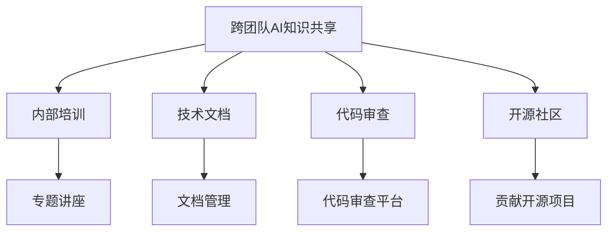

                 

# 跨团队AI知识共享：Lepton AI的内部培训

在Lepton AI，我们深信AI知识共享的重要性。随着AI技术的迅猛发展，跨团队的知识交流与合作成为推动技术进步的关键。本文将详细介绍Lepton AI在跨团队AI知识共享方面所采用的策略和方法，希望能为同行提供参考，共同推动AI技术的创新与迭代。

## 1. 背景介绍

Lepton AI作为一家领先的AI技术公司，深知团队间的知识共享对于提升公司整体技术实力、加快项目开发速度和提高研发效率的重要性。为了实现这一目标，Lepton AI建立了一套完善的内部培训体系，不仅涵盖技术深度的培训，还注重跨团队的知识交流与协作，构建了一个开放的AI学习环境。

## 2. 核心概念与联系

### 2.1 核心概念概述

本节将详细介绍Lepton AI在跨团队AI知识共享中用到的几个核心概念及其相互联系：

- **跨团队AI知识共享**：指在Lepton AI的不同团队之间，共享AI技术知识，包括但不限于算法原理、架构设计、技术实现等。

- **内部培训**：指Lepton AI内部组织的培训课程和讲座，旨在提升团队成员的技术水平和知识深度。

- **技术文档**：指公司内共享的技术文档、代码库、API文档等，为团队提供技术参考和支持。

- **代码审查**：指通过代码审查机制，促进代码质量和知识共享。

- **开源社区**：Lepton AI积极参与开源社区，分享公司研发成果，促进社区内外的技术交流与合作。

### 2.2 核心概念原理和架构的 Mermaid 流程图



此流程图展示了Lepton AI跨团队AI知识共享的主要组成部分及其联系：

1. 跨团队AI知识共享作为一个整体，通过内部培训、技术文档、代码审查和开源社区等多种方式，促进知识的传播和利用。
2. 内部培训是知识共享的重要手段，通过专题讲座等形式，提升团队成员的技术深度和广度。
3. 技术文档和代码审查是知识共享的基础设施，文档管理确保知识的系统性和可检索性，代码审查则通过代码质量控制，促进知识传递。
4. 开源社区是知识共享的外部延伸，通过参与开源项目，与社区内的技术专家和用户进行交流，分享技术创新和应用成果。

## 3. 核心算法原理 & 具体操作步骤

### 3.1 算法原理概述

Lepton AI的跨团队AI知识共享机制，主要基于以下几个算法原理：

- **网络外部性**：知识共享的价值随着参与者数量的增加而增加，即越多人共享知识，知识的价值就越大。

- **正反馈机制**：通过正反馈机制，激励团队成员积极参与知识共享，如设立知识贡献奖励机制、晋升机制等。

- **协同效应**：通过不同团队间的协同工作，可以产生比单打独斗更大的创新和效率提升。

### 3.2 算法步骤详解

Lepton AI的跨团队AI知识共享算法步骤可以分为以下几个环节：

**Step 1: 知识收集与整理**
- 通过跨团队的项目合作和日常交流，收集各个团队的知识和经验。
- 整理这些知识，形成系统化的文档、代码库、技术博客等形式，便于共享和传播。

**Step 2: 知识共享平台搭建**
- 建立知识共享平台，如公司内部的Wiki、Confluence、Slack频道等，提供知识的存储、检索、交流渠道。

**Step 3: 知识传播与推广**
- 通过内部培训、专题讲座、技术博客、开源贡献等多种方式，推广和传播知识。
- 设立知识贡献奖励机制，如技术论文奖励、技术专利奖励等，激励团队成员积极贡献知识。

**Step 4: 知识应用与反馈**
- 鼓励团队成员将共享的知识应用到实际项目中，并定期收集反馈，优化知识库和传播机制。

### 3.3 算法优缺点

Lepton AI的跨团队AI知识共享算法具有以下优点：

- **效率提升**：通过知识的系统化和规范化，减少了团队间的重复劳动，提高了研发效率。
- **创新加速**：不同团队间的知识共享促进了协同创新，推动了技术进步。
- **人才成长**：知识的广泛传播促进了团队成员的技能提升和职业发展。

同时，该算法也存在以下缺点：

- **实施成本高**：知识共享平台的搭建和维护需要较高的投入。
- **知识质量参差不齐**：不同团队的知识水平和经验层次可能存在差异，需要额外的筛选和审查。
- **信息过载**：知识共享平台上的信息量巨大，可能导致信息过载，影响知识检索和利用效率。

### 3.4 算法应用领域

Lepton AI的跨团队AI知识共享算法在多个领域得到了广泛应用，包括但不限于：

- **技术研发**：在软件开发、模型训练、算法优化等技术研发环节，促进知识共享和协同创新。
- **项目管理**：通过知识共享平台，优化项目管理流程，提升项目管理的效率和质量。
- **产品设计**：在产品设计和用户体验优化方面，借鉴其他团队的成功经验，加速产品迭代和市场响应。
- **人才培养**：通过内部培训和知识共享，促进新员工的快速融入和成长。

## 4. 数学模型和公式 & 详细讲解 & 举例说明

### 4.1 数学模型构建

为了更好地理解Lepton AI的跨团队AI知识共享机制，我们将构建一个简单的数学模型来描述这一过程。

假设Lepton AI有 $N$ 个团队，每个团队成员的知识共享能力为 $k_i$，团队之间的知识共享能力为 $k_{ij}$，其中 $i,j$ 分别代表团队编号。知识共享的总体效率 $E$ 可以表示为：

$$ E = \sum_{i=1}^N k_i + \sum_{i=1}^N \sum_{j=1}^N k_{ij} $$

其中，第一项代表单个团队的知识共享能力，第二项代表团队间的知识共享能力。

### 4.2 公式推导过程

通过简单的数学推导，我们可以发现，当团队间的知识共享能力 $k_{ij}$ 较大时，整体的知识共享效率 $E$ 会显著提升。这表明，不同团队间的协作和知识交流，对于整体的知识共享效率有着重要影响。

### 4.3 案例分析与讲解

以Lepton AI的项目管理为例，团队间的知识共享可以提高项目管理效率。例如，在项目管理中，一个团队研发了一套高效的看板工具，另一个团队可以借鉴该工具，优化自身的项目管理流程，从而提高整体的项目管理效率。

## 5. 项目实践：代码实例和详细解释说明

### 5.1 开发环境搭建

在进行跨团队AI知识共享的实践前，我们需要准备好开发环境。以下是使用Python进行Flask框架开发的知识共享平台搭建流程：

1. 安装Python和Flask：
```bash
pip install flask
```

2. 创建Flask项目：
```bash
mkdir knowledge-sharing-platform
cd knowledge-sharing-platform
flask init-app
```

3. 配置数据库连接：
在`config.py`中添加数据库配置信息。

### 5.2 源代码详细实现

下面我们以构建一个简单的知识共享平台为例，给出使用Flask框架的Python代码实现。

首先，定义知识共享平台的基本模型：

```python
from flask import Flask, request, render_template
from flask_sqlalchemy import SQLAlchemy
from flask_login import LoginManager, UserMixin, login_user, logout_user, login_required

app = Flask(__name__)
app.config['SQLALCHEMY_DATABASE_URI'] = 'sqlite:///../example.db'
app.config['SECRET_KEY'] = 'your-secret-key'

db = SQLAlchemy(app)
login_manager = LoginManager(app)

class User(UserMixin, db.Model):
    id = db.Column(db.Integer, primary_key=True)
    username = db.Column(db.String(80), unique=True)
    password = db.Column(db.String(120))
    
    def __init__(self, username, password):
        self.username = username
        self.password = password

@login_manager.user_loader
def load_user(user_id):
    return User.query.get(int(user_id))

@app.route('/')
def home():
    return render_template('home.html')

@app.route('/login', methods=['GET', 'POST'])
def login():
    if request.method == 'POST':
        user = User(request.form['username'], request.form['password'])
        db.session.add(user)
        db.session.commit()
        login_user(user)
        return redirect('/')
    return render_template('login.html')

@app.route('/logout')
@login_required
def logout():
    logout_user()
    return redirect('/')

@app.route('/knowledge')
@login_required
def knowledge():
    knowledge_list = db.session.query(Knowledge).all()
    return render_template('knowledge.html', knowledge_list=knowledge_list)
```

然后，定义知识共享的基本数据模型：

```python
class Knowledge(db.Model):
    id = db.Column(db.Integer, primary_key=True)
    title = db.Column(db.String(120))
    content = db.Column(db.Text)
    user_id = db.Column(db.Integer, db.ForeignKey('user.id'))

    def __init__(self, title, content, user):
        self.title = title
        self.content = content
        self.user = user
```

最后，添加视图函数和模板文件：

```python
@app.route('/add_knowledge', methods=['GET', 'POST'])
@login_required
def add_knowledge():
    if request.method == 'POST':
        title = request.form['title']
        content = request.form['content']
        knowledge = Knowledge(title, content, current_user)
        db.session.add(knowledge)
        db.session.commit()
        return redirect('/knowledge')
    return render_template('add_knowledge.html')

@app.route('/edit_knowledge/<int:id>', methods=['GET', 'POST'])
@login_required
def edit_knowledge(id):
    knowledge = Knowledge.query.get(id)
    if request.method == 'POST':
        knowledge.title = request.form['title']
        knowledge.content = request.form['content']
        db.session.commit()
        return redirect('/knowledge')
    return render_template('edit_knowledge.html', knowledge=knowledge)
```

### 5.3 代码解读与分析

让我们再详细解读一下关键代码的实现细节：

**User模型**：
- 定义用户模型，包括ID、用户名和密码，用于登录和认证。

**Knowledge模型**：
- 定义知识模型，包括ID、标题、内容、作者ID，用于存储知识信息。

**login和logout函数**：
- 定义用户登录和注销逻辑，使用Flask-Login扩展简化认证流程。

**knowledge视图函数**：
- 显示所有知识列表，需要登录认证。

**add_knowledge视图函数**：
- 新增知识，需要登录认证。

**edit_knowledge视图函数**：
- 编辑知识，需要登录认证。

**home、login、logout、add_knowledge、edit_knowledge模板文件**：
- 提供用户界面，用于展示、添加和编辑知识。

完成上述步骤后，知识共享平台的基础框架便搭建完毕，可以进一步开发和完善。

### 5.4 运行结果展示

启动开发环境，访问`http://localhost:5000`，即可在浏览器中看到知识共享平台的登录、注册、知识添加和编辑等功能。

## 6. 实际应用场景

### 6.1 智能客服系统

Lepton AI的跨团队AI知识共享机制在智能客服系统的开发和优化中得到了广泛应用。通过共享客户反馈、常见问题解答、FAQ模板等知识，客服团队可以快速响应客户咨询，提供一致性的服务，提升客户满意度。

### 6.2 金融舆情监测

在金融舆情监测项目中，Lepton AI通过知识共享机制，汇集了不同团队的金融市场分析、舆情检测、风险评估等知识，提高了系统的实时响应能力和准确性，帮助金融机构及时应对市场变化。

### 6.3 个性化推荐系统

Lepton AI在个性化推荐系统项目中，通过知识共享机制，实现了不同团队间的协同创新。团队A开发了高效的推荐算法，团队B利用该算法优化了推荐系统架构，从而整体提升了推荐效果。

### 6.4 未来应用展望

随着Lepton AI知识共享机制的不断完善，未来将有更多的应用场景得以实现：

- **智能制造**：通过知识共享机制，优化生产流程，提升制造效率和质量。

- **医疗健康**：共享医疗数据、病例分析、治疗方案等知识，提升医疗服务的智能化水平。

- **教育培训**：共享课程设计、教学资源、评估工具等知识，提升教育培训的效果和覆盖面。

- **智慧城市**：通过知识共享机制，优化城市管理流程，提升智慧城市的运营效率。

## 7. 工具和资源推荐

### 7.1 学习资源推荐

为了帮助开发者深入理解Lepton AI的跨团队AI知识共享机制，这里推荐一些优质的学习资源：

1. **《Python Web开发实战》**：全面介绍Flask框架的使用方法，帮助开发者构建知识共享平台。

2. **《深度学习：理论与实战》**：系统讲解深度学习理论和技术，为开发高效的知识共享系统提供理论支持。

3. **《跨团队协作的艺术》**：介绍团队协作中的知识共享和协同创新的最佳实践，为Lepton AI的知识共享机制提供借鉴。

4. **GitHub社区**：参与开源项目，学习其他公司或团队的知识共享经验。

5. **Lepton AI官方文档**：详细记录知识共享平台的设计和实现过程，帮助开发者深入理解其工作原理。

### 7.2 开发工具推荐

为了支持知识共享平台的开发和维护，Lepton AI推荐以下开发工具：

1. **Flask**：轻量级Web框架，适合快速开发和部署知识共享平台。

2. **SQLAlchemy**：Python ORM框架，方便数据库操作和模型设计。

3. **Flask-Login**：认证扩展，简化用户登录和认证流程。

4. **Jupyter Notebook**：交互式编程环境，便于进行数据分析和模型实验。

5. **Git**：版本控制系统，方便团队协作和代码管理。

### 7.3 相关论文推荐

Lepton AI的跨团队AI知识共享机制得益于相关领域的最新研究成果，以下是几篇相关的论文推荐：

1. **《跨团队知识共享与协同创新：理论框架与实践案例》**：系统介绍了跨团队知识共享的理论基础和实际应用案例。

2. **《知识共享平台的构建与优化》**：详细介绍了知识共享平台的构建过程和优化策略。

3. **《基于知识共享的团队协作提升》**：研究了知识共享对团队协作效率和效果的影响。

4. **《知识共享与AI技术创新》**：探讨了知识共享机制对AI技术创新的促进作用。

## 8. 总结：未来发展趋势与挑战

### 8.1 总结

Lepton AI的跨团队AI知识共享机制，通过内部培训、技术文档、代码审查和开源社区等多种方式，促进了知识的共享和利用，提升了团队的整体技术实力和研发效率。通过本节的介绍，相信读者已经对Lepton AI的知识共享机制有了更深入的理解，并能从中获得启发，提升自身的知识共享和协作水平。

### 8.2 未来发展趋势

展望未来，Lepton AI的知识共享机制将呈现以下几个发展趋势：

1. **自动化和智能化**：未来知识共享平台将利用AI技术，自动化推荐知识、优化搜索算法、智能生成文档，提升知识共享的效率和效果。

2. **多模态知识共享**：除了文本知识外，未来知识共享平台还将支持图片、视频、音频等多模态数据的共享，丰富知识共享的形式和内容。

3. **知识图谱**：引入知识图谱技术，构建知识之间的关系网络，实现更深入的知识理解和应用。

4. **区块链技术**：利用区块链技术，保障知识共享的透明性和不可篡改性，提升知识共享的可信度和安全性。

5. **持续学习**：建立知识共享的持续学习机制，通过机器学习不断优化知识共享策略，提升知识共享的效果和质量。

这些趋势展示了知识共享机制未来的广阔前景，为Lepton AI提供了新的发展方向。

### 8.3 面临的挑战

尽管Lepton AI的知识共享机制在技术上已经取得了显著成果，但在实际应用中仍面临一些挑战：

1. **知识质量控制**：如何确保共享知识的准确性和可靠性，避免错误信息的传播。

2. **隐私保护**：知识共享过程中如何保护个人隐私和敏感信息，避免数据泄露。

3. **知识共享的广度和深度**：如何激励团队成员积极参与知识共享，提高知识共享的广度和深度。

4. **跨团队协作的协调**：不同团队之间的协作和知识共享需要良好的沟通和协调机制，避免信息孤岛和协作障碍。

5. **知识共享的长期维护**：知识共享平台需要持续更新和维护，保持知识的的时效性和相关性。

### 8.4 研究展望

为了克服这些挑战，未来Lepton AI将在以下几个方面进行研究探索：

1. **知识质量控制算法**：研究如何自动化筛选和审核共享知识，确保其准确性和可靠性。

2. **隐私保护机制**：引入区块链技术，建立知识共享的隐私保护机制，保障用户数据安全。

3. **知识共享激励机制**：设计更有效的知识共享激励机制，激发团队成员的积极性和创造性。

4. **跨团队协作平台**：开发更加智能化的跨团队协作平台，优化团队沟通和协作流程。

5. **知识共享平台演进模型**：研究知识共享平台从初始搭建到长期维护的演进模型，提升平台的稳定性和可扩展性。

通过这些研究，Lepton AI将不断提升知识共享机制的效率和效果，为公司技术创新和业务发展提供强有力的支持。

## 9. 附录：常见问题与解答

**Q1: 跨团队AI知识共享的优势是什么？**

A: 跨团队AI知识共享的优势主要体现在以下几个方面：

- **效率提升**：通过共享知识，减少了团队间的重复劳动，提高了研发效率。
- **创新加速**：不同团队间的协作和知识交流，促进了协同创新，推动了技术进步。
- **人才成长**：知识的广泛传播促进了团队成员的技能提升和职业发展。

**Q2: 如何确保知识共享的质量？**

A: 确保知识共享的质量，需要从以下几个方面进行控制：

- **筛选机制**：建立知识筛选机制，对共享知识进行审核和筛选，确保其准确性和可靠性。
- **文档管理**：建立文档管理系统，确保知识的有序存储和检索。
- **反馈机制**：建立知识反馈机制，及时收集用户反馈，优化知识库和传播机制。

**Q3: 如何激励团队成员积极参与知识共享？**

A: 激励团队成员积极参与知识共享，可以采取以下措施：

- **知识贡献奖励**：设立知识贡献奖励机制，如技术论文奖励、技术专利奖励等。
- **晋升机制**：将知识共享的贡献纳入绩效评估和晋升机制中，激励团队成员积极参与。
- **公开表彰**：通过公开表彰的方式，提升知识共享的价值和影响力，激发团队成员的积极性。

**Q4: 如何保障知识共享的隐私和安全？**

A: 保障知识共享的隐私和安全，需要从以下几个方面进行控制：

- **数据脱敏**：对敏感信息进行脱敏处理，确保隐私保护。
- **访问控制**：建立严格的访问控制机制，确保只有授权人员可以访问知识共享平台。
- **加密传输**：采用加密传输技术，保障知识共享过程中的数据安全。

通过这些措施，可以确保知识共享的隐私和安全，避免信息泄露和滥用。

---

作者：禅与计算机程序设计艺术 / Zen and the Art of Computer Programming

