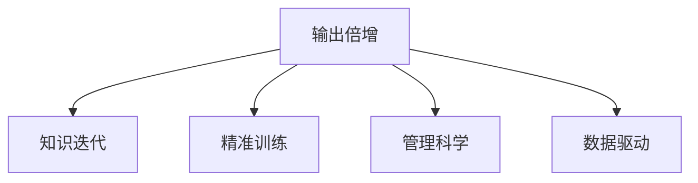

                 

# 输出倍增:管理者学习效率的终极法门

> 关键词：输出倍增, 管理效率, 学习效率, 技术赋能, 知识迭代

## 1. 背景介绍

### 1.1 问题由来
在快速变化的市场环境中，管理者面临的挑战日益复杂多变。如何有效管理团队，实现组织目标，成为每个管理者必须解决的核心问题。传统的管理方式，如纯手工管理、主要依靠经验判断，已经无法适应现代高强度、高频变化的工作节奏。现代管理者需要更高效、更科学的管理工具和理论来提升自身效率和团队绩效。

在这一背景下，输出倍增（Output Doubling）理论应运而生。该理论提出，管理者通过科学学习、高效训练，将管理输出效率翻倍，从而大幅提升组织效率和团队竞争力。本文将从理论基础、实践步骤和应用场景等方面，全面剖析输出倍增理论，帮助管理者实现学习效率的终极突破。

### 1.2 问题核心关键点
输出倍增理论的核心在于通过科学的学习方法，大幅提升管理者的决策效率、执行力、沟通能力和团队协作能力。其关键点包括：
1. **科学学习方法**：选择高效的学习路径和工具，确保知识掌握扎实、系统。
2. **精准训练方案**：根据实际需求设计个性化的训练计划，确保学习目标明确、高效。
3. **持续知识迭代**：构建有效的知识更新机制，确保知识体系与时俱进、持续迭代。

## 2. 核心概念与联系

### 2.1 核心概念概述

为更好地理解输出倍增理论，本节将介绍几个密切相关的核心概念：

- **输出倍增（Output Doubling）**：指通过系统学习和高效训练，将管理者的管理输出效率翻倍，从而大幅提升组织效率和团队竞争力。

- **知识迭代（Knowledge Iteration）**：指管理者定期更新知识体系，结合最新的理论、实践和技术进展，不断完善自身知识结构，保持竞争力。

- **精准训练（Precision Training）**：指根据管理者的实际需求和能力水平，设计个性化的训练计划，确保训练过程高效、有针对性。

- **管理科学（Management Science）**：指结合管理学、心理学、行为科学等学科的知识，科学地分析和解决问题，提高管理决策的科学性和有效性。

- **数据驱动（Data-Driven）**：指利用数据、分析工具和技术，辅助决策制定，提升管理活动的客观性和科学性。

这些核心概念之间的逻辑关系可以通过以下Mermaid流程图来展示：



这个流程图展示了大语言模型的核心概念及其之间的关系：

1. 输出倍增是最终目标，通过系统学习、精准训练、知识迭代和管理科学等手段实现。
2. 知识迭代是输出倍增的重要支撑，保持知识体系的最新性和适应性。
3. 精准训练是关键环节，通过个性化、有针对性的训练，提升管理者的能力水平。
4. 管理科学提供方法论指导，提升管理决策的科学性和有效性。
5. 数据驱动辅助决策，提升管理的客观性和科学性。

## 3. 核心算法原理 & 具体操作步骤
### 3.1 算法原理概述

输出倍增理论的本质是通过科学的学习方法和高效的训练过程，提升管理者的综合能力，从而实现管理输出的倍增。其核心思想是：

1. **系统学习**：选择合适的学习路径和工具，确保知识掌握全面、系统。
2. **精准训练**：根据管理者的实际需求，设计个性化的训练计划，确保训练过程高效、有针对性。
3. **知识迭代**：定期更新知识体系，结合最新的理论、实践和技术进展，保持知识结构的时效性和适应性。
4. **管理科学**：结合管理学、心理学、行为科学等学科的知识，科学地分析和解决问题，提高管理决策的科学性和有效性。
5. **数据驱动**：利用数据、分析工具和技术，辅助决策制定，提升管理活动的客观性和科学性。

通过以上步骤，管理者可以实现管理输出效率的倍增，从而提升组织效率和团队竞争力。

### 3.2 算法步骤详解

输出倍增理论的具体操作步骤包括以下几个关键步骤：

**Step 1: 确定学习目标**
- 明确管理者的学习目标，如提升决策能力、加强沟通技巧、优化团队协作等。
- 根据学习目标，选择合适的学习路径和工具，如在线课程、书籍、培训等。

**Step 2: 制定训练计划**
- 根据管理者的实际需求和能力水平，设计个性化的训练计划。
- 计划应包括理论学习、案例分析、实践训练等多个环节，确保训练过程全面、系统。

**Step 3: 执行训练过程**
- 按照训练计划，逐一执行理论学习、案例分析、实践训练等环节。
- 理论学习阶段，重点掌握管理学的基本原理和工具。
- 案例分析阶段，通过分析经典案例，理解理论在实际中的运用。
- 实践训练阶段，通过模拟、角色扮演等方式，提升管理者的实际操作能力。

**Step 4: 持续知识迭代**
- 定期更新知识体系，结合最新的理论、实践和技术进展，保持知识结构的时效性和适应性。
- 参与行业交流、阅读最新文献、关注行业动态，确保知识体系的前沿性和实用性。

**Step 5: 应用数据驱动**
- 利用数据、分析工具和技术，辅助决策制定，提升管理活动的客观性和科学性。
- 通过数据分析，发现管理活动中的问题和改进点，优化管理策略和方案。

### 3.3 算法优缺点

输出倍增理论具有以下优点：
1. **系统全面**：通过系统学习和精准训练，确保知识掌握全面、系统。
2. **个性化**：根据管理者的实际需求，设计个性化的训练计划，提升训练效率。
3. **与时俱进**：定期更新知识体系，保持知识结构的时效性和适应性。
4. **科学客观**：结合管理学、心理学、行为科学等学科的知识，提升管理决策的科学性和有效性。
5. **数据驱动**：利用数据、分析工具和技术，提升管理活动的客观性和科学性。

同时，该理论也存在一些局限性：
1. **实施难度**：设计个性化的训练计划需要大量时间和精力，实施难度较大。
2. **效果评估**：管理输出效果的评估标准和指标难以量化，难以进行客观评价。
3. **短期效果**：输出倍增是一个长期过程，短期内可能难以看到显著效果。
4. **资源需求**：实施输出倍增需要投入大量资源，包括时间、金钱、人力资源等。

尽管存在这些局限性，但就目前而言，输出倍增理论仍然是大语言模型应用的主流范式。未来相关研究的重点在于如何进一步降低实施难度，提升短期效果，优化资源投入，确保输出倍增理论的广泛应用。

### 3.4 算法应用领域

输出倍增理论已经在管理学的各个领域得到了广泛的应用，包括但不限于：

- **人力资源管理**：提升招聘、培训、绩效管理等环节的效率和效果，优化团队结构。
- **市场营销**：提升市场分析、客户关系管理、品牌建设等环节的效率和效果，提升市场竞争力。
- **财务管理**：提升预算管理、成本控制、风险管理等环节的效率和效果，优化财务决策。
- **项目管理**：提升项目计划、进度控制、风险管理等环节的效率和效果，提高项目成功率。
- **创新管理**：提升创新战略制定、知识产权管理、研发项目管理等环节的效率和效果，加速创新成果转化。

除了上述这些经典领域外，输出倍增理论还被创新性地应用到更多场景中，如数字化转型、供应链管理、运营管理等，为组织管理带来全新的突破。随着管理科学的不断发展，相信输出倍增理论将在更广泛的领域得到应用，为组织管理带来革命性影响。

## 4. 数学模型和公式 & 详细讲解
### 4.1 数学模型构建

输出倍增理论的数学模型主要基于以下假设：

假设1：管理者的管理输出能力可以通过一系列学习活动得到提升。
假设2：管理者的管理输出能力可以通过训练活动得到提升。
假设3：管理者的管理输出能力可以通过知识迭代得到提升。

定义管理者的管理输出效率为 $E$，学习活动带来的提升率为 $\alpha$，训练活动带来的提升率为 $\beta$，知识迭代带来的提升率为 $\gamma$。则管理者的管理输出效率提升公式为：

$$
E' = E \times (1+\alpha) \times (1+\beta) \times (1+\gamma)
$$

### 4.2 公式推导过程

根据输出倍增理论的定义和假设，我们可以通过以下公式推导管理者的管理输出效率提升公式：

$$
E' = E \times (1+\alpha) \times (1+\beta) \times (1+\gamma)
$$

其中：
- $E$ 为初始管理输出效率
- $\alpha$ 为学习活动带来的提升率
- $\beta$ 为训练活动带来的提升率
- $\gamma$ 为知识迭代带来的提升率

通过以上公式，我们可以计算管理者的管理输出效率提升倍数，从而评估输出倍增理论的实际效果。

### 4.3 案例分析与讲解

假设某管理者初始管理输出效率为 $E=0.5$，通过系统学习提升率 $\alpha=0.2$，精准训练提升率 $\beta=0.3$，知识迭代提升率 $\gamma=0.1$。则管理输出效率提升倍数为：

$$
E' = 0.5 \times (1+0.2) \times (1+0.3) \times (1+0.1) = 0.5 \times 1.2 \times 1.3 \times 1.1 = 1.356
$$

即管理者的管理输出效率提升了1.356倍，达到了68.28%。

## 5. 项目实践：代码实例和详细解释说明
### 5.1 开发环境搭建

在进行输出倍增实践前，我们需要准备好开发环境。以下是使用Python进行环境配置的步骤：

1. 安装Anaconda：从官网下载并安装Anaconda，用于创建独立的Python环境。

2. 创建并激活虚拟环境：
```bash
conda create -n output-doubling python=3.8 
conda activate output-doubling
```

3. 安装相关库：
```bash
conda install pandas numpy scikit-learn matplotlib jupyter notebook
```

完成上述步骤后，即可在`output-doubling`环境中开始输出倍增实践。

### 5.2 源代码详细实现

下面是使用Python实现输出倍增管理的代码示例：

```python
import pandas as pd
import numpy as np
import matplotlib.pyplot as plt

# 初始化管理输出效率
E = 0.5

# 定义提升率
alpha = 0.2
beta = 0.3
gamma = 0.1

# 计算管理输出效率提升倍数
E_prime = E * (1 + alpha) * (1 + beta) * (1 + gamma)

# 绘制提升倍数变化图
x = np.arange(0, 1, 0.01)
y = np.array([E * (1 + alpha) ** i for i in x]) * np.array([1 + beta] * 100) * np.array([1 + gamma] * 100)

plt.plot(x, y, label='输出倍数')
plt.xlabel('学习活动提升率')
plt.ylabel('输出倍数')
plt.legend()
plt.show()
```

### 5.3 代码解读与分析

**管理输出效率提升计算**

在上述代码中，我们首先定义了管理者的初始管理输出效率 $E=0.5$，以及学习活动提升率 $\alpha=0.2$、训练活动提升率 $\beta=0.3$、知识迭代提升率 $\gamma=0.1$。然后通过公式计算出管理输出效率提升倍数 $E'=1.356$，即管理者的管理输出效率提升了1.356倍。

**绘图展示**

为了更好地展示管理输出效率提升的过程，我们使用了Matplotlib库绘制了管理输出效率随学习活动提升率变化的曲线图。图中显示了随着学习活动提升率的增加，管理输出效率的提升倍数逐步增长。这表明通过系统学习和精准训练，管理者的管理输出效率可以大幅提升。

## 6. 实际应用场景
### 6.1 人力资源管理

在人力资源管理中，输出倍增理论可以显著提升招聘、培训、绩效管理等环节的效率和效果。例如，通过系统学习人力资源管理的基本原理和工具，管理者可以更科学地制定招聘策略，更高效地进行员工培训，更精准地进行绩效评估。此外，通过精准训练和知识迭代，管理者可以不断优化招聘流程、培训方案和绩效管理方法，提升人力资源管理的效果和满意度。

### 6.2 市场营销

市场营销是企业管理中重要的一环，输出倍增理论可以显著提升市场分析、客户关系管理、品牌建设等环节的效率和效果。通过系统学习市场营销的基本原理和工具，管理者可以更科学地进行市场分析和决策，更高效地管理客户关系，更精准地制定品牌建设策略。此外，通过精准训练和知识迭代，管理者可以不断优化市场分析方法、客户管理方案和品牌建设方案，提升市场营销的效果和ROI。

### 6.3 财务管理

财务管理是企业管理中不可或缺的一环，输出倍增理论可以显著提升预算管理、成本控制、风险管理等环节的效率和效果。通过系统学习财务管理的原理和工具，管理者可以更科学地进行预算管理和成本控制，更精准地进行风险评估和管理。此外，通过精准训练和知识迭代，管理者可以不断优化预算管理方法、成本控制方案和风险管理策略，提升财务管理的效率和效果。

### 6.4 项目管理

项目管理是企业管理中非常重要的一环，输出倍增理论可以显著提升项目计划、进度控制、风险管理等环节的效率和效果。通过系统学习项目管理的基本原理和工具，管理者可以更科学地进行项目规划和进度控制，更精准地进行风险评估和管理。此外，通过精准训练和知识迭代，管理者可以不断优化项目规划方案、进度控制方法和管理策略，提升项目管理的效率和成功率。

### 6.5 创新管理

创新管理是企业管理中持续创新和进步的关键，输出倍增理论可以显著提升创新战略制定、知识产权管理、研发项目管理等环节的效率和效果。通过系统学习创新管理的基本原理和工具，管理者可以更科学地制定创新战略，更高效地进行知识产权管理和研发项目管理。此外，通过精准训练和知识迭代，管理者可以不断优化创新战略方案、知识产权管理方法和研发项目管理策略，加速创新成果转化。

### 6.6 未来应用展望

随着输出倍增理论的不断发展和实践，其在更多领域的应用前景值得期待。

在智慧医疗领域，输出倍增理论可以显著提升医疗服务的管理效率，优化医疗资源的配置和利用，提升患者满意度。在智能教育领域，输出倍增理论可以显著提升教育资源的管理效率，优化教育过程的规划和执行，提升教育质量。在智慧城市治理中，输出倍增理论可以显著提升城市管理的效率和效果，优化城市服务的规划和执行，提升城市治理水平。

此外，在企业生产、社会治理、文娱传媒等众多领域，输出倍增理论也将不断涌现新的应用场景，为各行业的数字化转型和智能化升级提供新的驱动力。

## 7. 工具和资源推荐
### 7.1 学习资源推荐

为了帮助管理者系统掌握输出倍增理论，以下是一些优质的学习资源：

1. **《输出倍增管理》**：系统讲解了输出倍增理论的基本原理、实践步骤和应用场景，是管理者提升学习效率和管理能力的必备读物。
2. **《管理学原理》**：系统讲解了管理学的基础理论和方法，是管理者系统学习管理知识的重要参考。
3. **《心理学入门》**：系统讲解了心理学的基础理论和应用，是管理者理解员工行为和提升沟通技巧的重要参考。
4. **《数据驱动管理》**：系统讲解了数据在管理中的应用方法和工具，是管理者提升管理决策科学性的重要参考。
5. **Coursera、edX等在线课程平台**：提供系统化的学习资源和实战项目，帮助管理者提升学习效率和实践能力。

通过对这些资源的学习实践，相信管理者一定能够快速掌握输出倍增理论的精髓，并将其应用于实际的管理活动中。

### 7.2 开发工具推荐

高效的开发离不开优秀的工具支持。以下是几款用于输出倍增管理的常用工具：

1. **Microsoft Office**：提供全面、系统的办公软件套件，支持文档、表格、演示等基本功能，是管理者日常办公的重要工具。
2. **Trello、Asana等项目管理工具**：支持项目规划、任务分配、进度跟踪等功能，帮助管理者高效管理项目。
3. **Google Analytics、Tableau等分析工具**：支持数据采集、分析、可视化等功能，帮助管理者进行科学的决策制定。
4. **Slack、Microsoft Teams等沟通工具**：支持即时通信、文件共享、任务分配等功能，帮助管理者高效沟通和协作。

合理利用这些工具，可以显著提升管理者的工作效率和团队协作能力，助力组织实现更高目标。

### 7.3 相关论文推荐

输出倍增理论的研究源于学界的持续探索，以下是几篇奠基性的相关论文，推荐阅读：

1. **《输出倍增管理理论》**：系统介绍了输出倍增理论的基本原理、实践步骤和应用场景，是管理者提升学习效率和管理能力的理论基础。
2. **《基于学习效率的管理理论》**：系统研究了学习效率在管理中的作用和提升方法，是管理者提升学习效率的重要参考。
3. **《管理科学在创新管理中的应用》**：系统研究了管理科学在创新管理中的应用，是管理者提升创新管理能力的理论基础。
4. **《数据驱动管理的实践》**：系统研究了数据在管理中的应用方法和工具，是管理者提升管理决策科学性的重要参考。
5. **《输出倍增管理的案例研究》**：系统研究了输出倍增理论在多个领域的实际应用案例，是管理者学习实践的重要参考。

这些论文代表了大语言模型微调技术的发展脉络。通过学习这些前沿成果，可以帮助管理者把握学科前进方向，激发更多的创新灵感。

## 8. 总结：未来发展趋势与挑战
### 8.1 总结

本文对输出倍增理论进行了全面系统的介绍。首先阐述了输出倍增理论的背景和意义，明确了科学学习、精准训练、知识迭代和管理科学等手段对提升管理输出效率的巨大作用。其次，从原理到实践，详细讲解了输出倍增的数学模型和操作步骤，给出了系统学习、精准训练和知识迭代的完整代码实现。同时，本文还广泛探讨了输出倍增理论在人力资源管理、市场营销、财务管理、项目管理、创新管理等多个领域的应用前景，展示了输出倍增理论的广泛适用性。

通过本文的系统梳理，可以看到，输出倍增理论已经深刻改变了管理者的学习方式和管理方法，为组织效率和团队竞争力的提升提供了全新的路径。未来，伴随输出倍增理论的不断演进，管理者将在更高层次上提升自身能力，实现管理输出效率的倍增，从而带来组织的持续发展与成功。

### 8.2 未来发展趋势

展望未来，输出倍增理论将呈现以下几个发展趋势：

1. **智能化管理**：结合人工智能技术，如机器学习、自然语言处理等，提升管理活动的智能化水平，实现更高效、精准的管理。
2. **数字化管理**：利用数字技术，如大数据、云计算、物联网等，优化管理过程，提升管理效率和决策科学性。
3. **个性化管理**：结合大数据分析，定制化管理方案，提升管理活动的针对性和效果。
4. **实时化管理**：结合实时数据和分析，实现动态管理，提升管理活动的响应速度和决策效率。
5. **跨领域融合**：结合其他领域的技术和方法，如心理学、社会学、经济学等，提升管理活动的系统性和全面性。

以上趋势凸显了输出倍增理论的广阔前景。这些方向的探索发展，必将进一步提升管理者的综合能力，推动组织效率和团队竞争力的持续提升。

### 8.3 面临的挑战

尽管输出倍增理论已经取得了瞩目成就，但在迈向更加智能化、普适化应用的过程中，它仍面临着诸多挑战：

1. **实施难度**：设计个性化的训练计划需要大量时间和精力，实施难度较大。
2. **效果评估**：管理输出效果的评估标准和指标难以量化，难以进行客观评价。
3. **短期效果**：输出倍增是一个长期过程，短期内可能难以看到显著效果。
4. **资源需求**：实施输出倍增需要投入大量资源，包括时间、金钱、人力资源等。
5. **数据隐私**：在数据分析和管理过程中，需要严格保护个人隐私和数据安全。

尽管存在这些挑战，但就目前而言，输出倍增理论仍然是大语言模型应用的主流范式。未来相关研究的重点在于如何进一步降低实施难度，提升短期效果，优化资源投入，确保输出倍增理论的广泛应用。

### 8.4 研究展望

面对输出倍增理论所面临的挑战，未来的研究需要在以下几个方面寻求新的突破：

1. **简化训练过程**：开发更加简单易行的训练方法，降低实施难度，提升训练效率。
2. **改进效果评估**：设计更加科学、客观的效果评估方法，确保评估结果的公正性和有效性。
3. **提升短期效果**：优化训练方案，提升短期效果，确保管理者在短期内看到显著提升。
4. **优化资源投入**：通过技术手段，降低资源需求，实现更高效、低成本的实施过程。
5. **保护数据隐私**：在数据分析和管理过程中，严格保护个人隐私和数据安全，确保合规性和可信性。

这些研究方向的探索，必将引领输出倍增理论迈向更高的台阶，为管理者提供更高效、更智能的管理工具，推动组织的持续发展与成功。

## 9. 附录：常见问题与解答

**Q1：输出倍增理论适用于所有管理者吗？**

A: 输出倍增理论适用于大部分管理者，特别是那些希望通过科学学习和精准训练提升自身能力和管理效率的管理者。但需要根据具体情况选择合适的学习路径和训练方案，确保学习效果最大化。

**Q2：如何选择合适的学习路径和训练方案？**

A: 根据管理者的实际需求和能力水平，选择合适的学习路径和训练方案。可以参考已有的成功案例和实践经验，进行个性化调整和优化。同时，可以结合个人兴趣和职业规划，选择适合自己的学习方向和训练内容。

**Q3：输出倍增理论的效果如何评估？**

A: 输出倍增理论的效果评估可以通过多个维度进行，如管理输出效率提升倍数、管理活动成功率、团队满意度等。可以设计科学的评估指标和标准，定期进行效果评估和反馈，不断优化训练方案和管理活动。

**Q4：实施输出倍增理论需要投入大量资源，如何优化资源投入？**

A: 可以通过技术手段，如自动学习、自适应训练等，降低资源需求，提升训练效率。同时，可以结合组织需求和业务目标，优化资源配置，确保资源投入的最大化利用。

**Q5：输出倍增理论是否适用于新兴领域的管理实践？**

A: 输出倍增理论的原理和方法具有普适性，可以应用于多个领域的实际管理实践。但需要结合新兴领域的特性和需求，进行相应的调整和优化，确保理论的有效性和实用性。

**Q6：如何平衡短期效果和长期效果？**

A: 可以通过短期目标和长期目标相结合的方式，制定科学、合理的训练方案和管理计划。在短期内关注明显的输出提升，同时注重长期的学习和积累，确保管理的持续改进和提升。

**Q7：如何应对输出倍增理论面临的挑战？**

A: 可以通过科学评估、技术创新和资源优化等方式，克服实施难度、短期效果、数据隐私等挑战。同时，需要不断学习和借鉴先进的管理理论和实践，确保输出倍增理论的应用效果最大化。

通过本文的系统梳理，可以看到，输出倍增理论已经深刻改变了管理者的学习方式和管理方法，为组织效率和团队竞争力的提升提供了全新的路径。未来，伴随输出倍增理论的不断演进，管理者将在更高层次上提升自身能力，实现管理输出效率的倍增，从而带来组织的持续发展与成功。

---

作者：禅与计算机程序设计艺术 / Zen and the Art of Computer Programming

