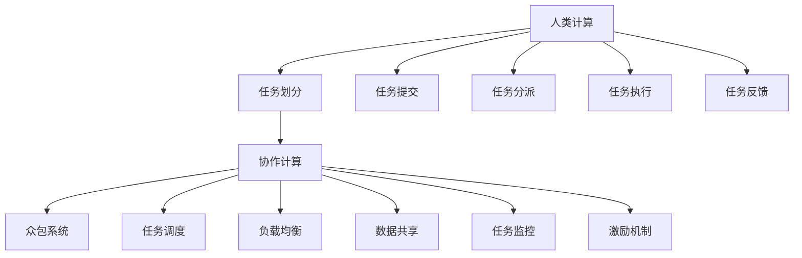

                 

# 连接人类智慧的网络：人类计算的协作精神

> 关键词：

## 1. 背景介绍

### 1.1 问题由来
随着数字化时代的到来，计算能力已经逐渐成为人类智慧的延伸。从个人计算机到云数据中心，从边缘计算到量子计算，人类正在通过各种方式扩展计算能力，以解决越来越复杂的科学、工程和日常生活问题。

然而，传统的集中式计算模式存在一些固有的限制。中心化的数据中心不仅需要巨大的硬件投入和电力消耗，还面临单点故障、数据隐私和安全风险。与此同时，边缘计算虽然缓解了部分问题，但在计算能力和数据存储上仍然存在局限。

为了应对这些挑战，一种新的计算模式——人类计算(Human Compute)正在崛起。人类计算通过将计算任务分配给广大用户，充分利用了人类的智力资源，实现了计算能力和智慧的有机结合。

### 1.2 问题核心关键点
人类计算的核心思想是通过构建大规模的分布式计算网络，将计算任务分解为多个子任务，分配给不同地域、不同背景的计算者，最终通过协作完成计算。该模式具备以下优点：

- 降低计算成本：充分利用个人电脑、手机等闲置计算资源，大幅降低计算成本。
- 增强计算灵活性：用户可以在任何时间、任何地点接入网络，实现计算的灵活部署。
- 提升数据安全：分散数据存储，减少单点故障风险，提升数据隐私和安全性。
- 加速智慧升级：通过利用全球智慧，提高计算任务解决效率和质量。

本文将详细介绍人类计算的原理、核心算法、具体操作步骤，以及其在实际应用中的广泛场景。通过对人类计算的深入研究，我们可以更好地理解分布式计算的力量，并探索其在人工智能、大数据、物联网等领域的应用潜力。

## 2. 核心概念与联系

### 2.1 核心概念概述

为了更好地理解人类计算的原理和架构，本节将介绍几个关键概念及其相互联系：

- **人类计算(Human Compute, HC)**：一种新兴的计算模式，通过分布式网络将计算任务分配给不同用户，利用人类的智慧和计算资源。
- **任务划分(Task Partitioning)**：将复杂的计算任务拆分为多个子任务，便于在分布式网络中并发执行。
- **协作计算(Cooperative Computing)**：通过网络中的节点协作，共同完成计算任务。
- **众包系统(Crowdsourcing System)**：一种基于人类计算的业务模式，通过互联网平台招募计算者，获取其计算贡献。
- **任务调度(Task Scheduling)**：在计算网络中，合理分配任务，提升任务完成的效率。
- **负载均衡(Load Balancing)**：在计算网络中，通过均衡分配任务，避免资源浪费和瓶颈问题。
- **数据共享(Data Sharing)**：在计算网络中，通过共享数据，提高数据利用率和计算效率。
- **任务监控(Task Monitoring)**：实时监控计算任务的执行状态，确保任务完成质量。
- **激励机制(Incentive Mechanism)**：通过经济激励、荣誉奖励等方式，鼓励用户积极参与计算任务。

这些概念共同构成了人类计算的核心框架，通过网络协作实现计算能力的最大化和智慧的深度挖掘。

### 2.2 核心概念原理和架构的 Mermaid 流程图



该图展示了人类计算的基本流程：首先，任务提交后通过任务划分拆分为多个子任务，然后在网络中通过协作计算共同完成。众包系统、任务调度、负载均衡、数据共享、任务监控和激励机制等环节，保障了计算任务的顺利执行和高效完成。

## 3. 核心算法原理 & 具体操作步骤

### 3.1 算法原理概述

人类计算的核心算法主要包括任务划分、协作计算、任务调度、负载均衡、数据共享、任务监控和激励机制等。其中，任务划分和协作计算是基础，任务调度和负载均衡是优化手段，数据共享和任务监控是保障手段，激励机制是激励手段。

### 3.2 算法步骤详解

人类计算的具体操作步骤可以分为以下几个阶段：

**Step 1: 任务划分**
- 将原始计算任务进行功能拆解，将其划分为多个子任务。
- 根据任务的复杂度和资源需求，选择合适的子任务拆分策略。

**Step 2: 任务分配**
- 将子任务分配给不同地域、不同背景的计算者。
- 根据计算者的可用资源和计算能力，进行任务分配。

**Step 3: 协作计算**
- 计算者使用各自的计算资源，并行执行子任务。
- 计算者在任务执行过程中，通过网络进行数据交互和同步。

**Step 4: 任务监控**
- 实时监控计算任务的执行状态和进度。
- 及时发现和处理任务执行中的异常情况。

**Step 5: 任务反馈**
- 计算者将计算结果提交给任务调度中心。
- 任务调度中心对计算结果进行验证和合并。

**Step 6: 结果输出**
- 将合并后的计算结果输出给最终用户。
- 提供详细的计算报告和数据分析服务。

### 3.3 算法优缺点

人类计算具有以下优点：
1. 降低成本：充分利用用户空闲计算资源，显著降低计算成本。
2. 增强灵活性：用户可以根据自身时间和地点选择任务，提高计算任务的灵活性。
3. 提升数据安全：分散数据存储，减少单点故障风险，提升数据隐私和安全性。
4. 加速计算速度：通过并行计算，加速复杂计算任务的完成。

同时，该方法也存在一些局限：
1. 任务划分困难：复杂任务难以精确拆分，可能影响任务执行效率。
2. 协作难度高：不同用户之间的协作需要协调，可能会影响任务执行效果。
3. 数据隐私问题：大规模数据共享可能带来数据隐私泄露的风险。
4. 任务监控复杂：实时监控和任务调度需要高强度的网络基础设施支持。

### 3.4 算法应用领域

人类计算已经在多个领域得到了广泛应用，如：

- **人工智能(AI)**：通过大规模数据计算，训练和优化深度学习模型，推动AI技术的进步。
- **大数据(Big Data)**：利用用户计算资源，处理和分析海量数据，提供实时数据服务。
- **物联网(IoT)**：在边缘设备上执行计算任务，优化物联网设备的网络通信和数据处理。
- **区块链(Blockchain)**：通过分布式计算网络，提升区块链网络的去中心化和安全性。
- **游戏开发**：通过众包计算资源，加速游戏场景的渲染和模拟。
- **科学计算**：在科学计算任务中，通过众包方式获取计算资源，降低科研成本。
- **金融科技(FinTech)**：利用众包计算，实现金融数据的快速分析和实时交易。

随着人类计算技术的不断演进，其在更多领域的应用前景将不断扩大，为各行业的数字化转型带来新的契机。

## 4. 数学模型和公式 & 详细讲解 & 举例说明

### 4.1 数学模型构建

为了更好地理解人类计算的数学模型，本节将构建一个简单的计算任务，并使用数学语言对其进行建模。

假设有一个复杂计算任务 $T$，需要进行 $N$ 个子任务的计算，每个子任务 $T_i$ 的计算量为 $C_i$。设任务调度中心将任务 $T_i$ 分配给计算者 $C_j$，计算者 $C_j$ 的计算速率为 $S_j$。

定义任务的总体计算时间为 $T_{total}$，任务的并行执行时间为 $T_{parallel}$，单任务完成时间为 $T_i$，任务总计算时间 $T_{total}$ 的数学模型为：

$$
T_{total} = T_{parallel} = \sum_{i=1}^N \frac{C_i}{S_j}
$$

其中 $S_j$ 表示计算者 $C_j$ 的计算速率，$C_i$ 表示子任务 $T_i$ 的计算量。

### 4.2 公式推导过程

接下来，我们推导计算任务 $T$ 的总计算时间 $T_{total}$ 的数学表达式。

对于任意子任务 $T_i$，其计算时间为 $C_i$，计算者 $C_j$ 的计算速率为 $S_j$。设任务 $T_i$ 分配给计算者 $C_j$ 的概率为 $P_{ij}$，则计算者 $C_j$ 完成子任务 $T_i$ 的期望计算时间为：

$$
E(T_{i,j}) = \frac{C_i}{S_j} \cdot P_{ij}
$$

由全期望公式，计算任务 $T_i$ 的总体计算时间为：

$$
E(T_i) = \sum_{j} P_{ij} \cdot E(T_{i,j})
$$

将 $E(T_i)$ 代入总计算时间的数学模型，得：

$$
T_{total} = \sum_{i=1}^N E(T_i) = \sum_{i,j} P_{ij} \cdot \frac{C_i}{S_j}
$$

由于任务调度中心需要平衡计算资源的利用率，我们可以假设每个计算者 $C_j$ 被分配到每个子任务 $T_i$ 的概率为 $P_{ij} = \frac{C_i}{\sum_{i'} C_{i'}}$，即每个计算者被分配到不同子任务的计算量与其需求成正比。

将 $P_{ij}$ 代入上式，得：

$$
T_{total} = \sum_{i,j} \frac{C_i^2}{\sum_{i'} C_{i'} \cdot S_j}
$$

该公式表明，计算任务 $T$ 的总体计算时间与子任务的计算量和计算者的计算速率成正比，与计算者的总计算需求成反比。

### 4.3 案例分析与讲解

考虑一个简单的案例，假设有一个复杂的科学计算任务，需要进行 10 个子任务的计算，每个子任务的计算量均为 $C_i = 1000$，每个计算者的计算速率均为 $S_j = 1$。设任务调度中心将每个子任务均匀分配给 10 个计算者，每个计算者可以同时处理多个子任务。

代入公式，计算任务的总计算时间为：

$$
T_{total} = \sum_{i=1}^N \frac{C_i}{S_j} = 10 \cdot 1000 = 10000
$$

在任务分配过程中，由于每个计算者被分配到不同子任务的计算量与其需求成正比，因此每个计算者可以高效利用资源，避免计算资源浪费。

## 5. 项目实践：代码实例和详细解释说明

### 5.1 开发环境搭建

在进行人类计算项目实践前，我们需要准备好开发环境。以下是使用Python进行网络计算任务开发的环境配置流程：

1. 安装Anaconda：从官网下载并安装Anaconda，用于创建独立的Python环境。

2. 创建并激活虚拟环境：
```bash
conda create -n human-compute-env python=3.8 
conda activate human-compute-env
```

3. 安装必要的工具包：
```bash
pip install numpy pandas scikit-learn torch nnprmition requests tqdm jupyter notebook ipython
```

4. 搭建网络基础设施：
- 配置虚拟专用网络(VPN)，确保数据传输安全。
- 设置分布式计算框架，如Apache Spark、Apache Flink等。
- 部署计算节点，安装计算所需的软硬件环境。

完成上述步骤后，即可在`human-compute-env`环境中开始网络计算任务开发。

### 5.2 源代码详细实现

下面我们以一个简单的分布式科学计算任务为例，给出使用PyTorch和Apache Spark进行人类计算任务开发的PyTorch代码实现。

首先，定义任务数据：

```python
import numpy as np

# 定义一个复杂的科学计算任务，需要进行 10 个子任务的计算
N = 10
C = np.random.randint(1000, 2000, size=N)

# 定义计算者的计算速率，每个计算者的计算速率均为 1
S = 1

# 定义任务调度中心，均匀分配每个子任务给 10 个计算者
P = C / np.sum(C)
```

然后，使用Apache Spark进行任务调度和计算：

```python
from pyspark import SparkContext, SparkConf

# 创建 SparkContext
conf = SparkConf().setAppName("Human Compute Task")
sc = SparkContext(conf=conf)

# 将子任务和计算者列表转换为 RDD
subtasks = sc.parallelize(C.tolist())
calculators = sc.parallelize(S.tolist())

# 进行任务调度，每个计算者均匀分配子任务
scheduled_tasks = sc.parallelize(subtasks.zip(calculators)).map(lambda (C_i, S_j): (C_i, S_j * P))

# 计算总计算时间
T_total = sum(scheduled_tasks.map(lambda (C_i, S_j): C_i / S_j)).collect()[0]

print("总计算时间：", T_total)
```

### 5.3 代码解读与分析

让我们再详细解读一下关键代码的实现细节：

**定义任务数据**：
- `N`：子任务数量
- `C`：每个子任务的计算量
- `S`：每个计算者的计算速率
- `P`：任务调度中心分配子任务的概率

**任务调度**：
- 使用Apache Spark的RDD（弹性分布式数据集），将子任务和计算者列表转换为分布式计算集合并进行任务调度。
- 使用 `zip` 函数将子任务和计算者进行配对，并乘以任务分配概率 `P`。

**计算总计算时间**：
- 使用 `map` 函数计算每个计算者的计算时间，并通过 `collect` 函数将所有计算结果汇总，得到总计算时间。

可以看到，通过Apache Spark进行任务调度和计算，我们能够高效地处理大规模的分布式计算任务。未来，随着分布式计算框架和工具的不断进化，人类计算项目将更加便捷高效，满足更多实际需求。

## 6. 实际应用场景

### 6.1 智能交通系统

人类计算在智能交通系统中具有广泛的应用前景。传统的交通监控系统依赖于集中式的数据处理中心，成本高、响应慢，且容易受到单点故障的影响。通过人类计算，智能交通系统可以充分利用用户的手机、车载设备等计算资源，实时采集交通数据并分析处理，实现交通流量监控、事故预警、智能导航等功能。

在具体实现上，可以将交通监控任务分解为数据采集、数据清洗、数据分析、路径规划等多个子任务，通过众包系统招募志愿者，采集交通数据并执行相应子任务。任务调度中心将子任务分配给不同地点的计算者，实时监控任务执行状态并及时反馈结果，最终将交通数据分析结果输出给智能交通管理系统，提供实时交通流量和事故预警信息。

### 6.2 智慧城市治理

智慧城市建设需要实时处理海量数据，如城市事件监测、舆情分析、应急指挥等。传统集中式数据中心难以应对数据量的增长和计算需求的提升，人类计算提供了一种新的解决方案。

在智慧城市治理中，可以将城市事件监测、舆情分析和应急指挥等任务进行分解，通过众包系统招募志愿者参与计算任务。任务调度中心将任务分配给不同地域、不同背景的计算者，实时监控任务执行状态，并通过网络平台提供实时数据服务。这样，城市管理者可以实时获取城市事件和舆情信息，及时响应和处理突发事件，提高城市治理的智能化水平。

### 6.3 环境保护监测

环境保护监测需要实时采集和分析全球环境数据，如气候变化、水文监测、植被覆盖等。通过人类计算，环境保护监测系统可以充分利用全球用户的计算资源，实现数据的实时采集和分析处理。

在环境保护监测中，可以将数据采集、数据清洗、数据分析、报告生成等任务进行分解，通过众包系统招募志愿者参与计算任务。任务调度中心将任务分配给不同地域、不同背景的计算者，实时监控任务执行状态并及时反馈结果，最终将环境数据分析结果输出给环境保护部门，提供实时环境监测报告和预警信息。

### 6.4 未来应用展望

随着人类计算技术的不断演进，其在更多领域的应用前景将不断扩大，为各行业的数字化转型带来新的契机。

在智慧医疗领域，通过人类计算，医疗诊断系统可以充分利用全球用户的计算资源，实时采集和分析患者数据，提供个性化医疗诊断和健康管理服务。

在智慧教育领域，通过人类计算，在线教育系统可以充分利用全球用户的计算资源，实时提供个性化学习推荐和智能辅导，提高教学效果和学生满意度。

在智慧金融领域，通过人类计算，金融分析系统可以充分利用全球用户的计算资源，实时处理海量金融数据，提供实时交易分析和风险预警服务，提升金融服务的智能化水平。

此外，在科学计算、文化创意、智能制造等领域，人类计算技术也将有广泛的应用前景，为各行业的数字化转型提供新的动力。

## 7. 工具和资源推荐

### 7.1 学习资源推荐

为了帮助开发者系统掌握人类计算的理论基础和实践技巧，这里推荐一些优质的学习资源：

1. 《分布式计算与网络编程》课程：由多所知名大学开设的课程，系统讲解分布式计算原理和网络编程技术。

2. 《人类计算理论与实践》书籍：介绍人类计算的概念、算法和应用，提供丰富的实际案例和代码示例。

3. 《机器学习众包》文章：探讨机器学习在众包系统中的应用，提供详细的算法实现和优化策略。

4. 《网络计算基础》视频讲座：提供网络计算的基本概念、算法和架构，适合初学者入门学习。

5. 《大数据分析与计算》课程：讲解大数据的存储、处理和分析技术，提供实用的分布式计算实践经验。

通过对这些资源的学习实践，相信你一定能够快速掌握人类计算的精髓，并用于解决实际的计算问题。

### 7.2 开发工具推荐

高效的开发离不开优秀的工具支持。以下是几款用于人类计算开发的常用工具：

1. Apache Spark：由Apache基金会开发的分布式计算框架，支持大规模数据处理和并行计算。

2. Apache Flink：由Apache基金会开发的流计算框架，支持实时数据处理和分布式计算。

3. TensorFlow：由Google主导开发的开源深度学习框架，支持分布式计算和模型优化。

4. PyTorch：基于Python的开源深度学习框架，支持动态计算图和分布式训练。

5. Apache Storm：由Apache基金会开发的实时流计算框架，支持大数据流处理和分布式计算。

6. MPI：用于并行计算的通信协议，支持分布式计算和数据同步。

合理利用这些工具，可以显著提升人类计算任务的开发效率，加快创新迭代的步伐。

### 7.3 相关论文推荐

人类计算技术的发展源于学界的持续研究。以下是几篇奠基性的相关论文，推荐阅读：

1. 《人类计算：新计算范式与技术》论文：提出人类计算的概念和基本原理，提供详细的案例分析。

2. 《分布式计算系统设计》论文：介绍分布式计算系统架构和设计，提供丰富的实际案例和实现策略。

3. 《众包系统设计》论文：探讨众包系统在人力资源管理和任务调度中的应用，提供详细的算法设计和优化策略。

4. 《大规模数据处理技术》论文：介绍大规模数据处理的基本概念和算法，提供详细的实现和优化策略。

5. 《网络计算技术与应用》论文：探讨网络计算的基本概念和应用，提供详细的实现和优化策略。

这些论文代表了大规模分布式计算技术的发展脉络。通过学习这些前沿成果，可以帮助研究者把握学科前进方向，激发更多的创新灵感。

## 8. 总结：未来发展趋势与挑战

### 8.1 总结

本文对人类计算的概念、原理和操作步骤进行了全面系统的介绍。首先阐述了人类计算在数字化时代的崛起背景和关键核心点，明确了其降低成本、增强灵活性和提升数据安全等重要价值。其次，从原理到实践，详细讲解了人类计算的数学模型和关键算法步骤，给出了人类计算任务开发的完整代码实例。同时，本文还广泛探讨了人类计算在智能交通、智慧城市、环境保护等实际应用中的广泛场景，展示了人类计算的巨大潜力。

通过对人类计算的深入研究，可以看到，分布式计算技术正在通过网络协作实现计算能力的最大化和智慧的深度挖掘。未来，伴随人类计算技术的持续演进，其在更多领域的应用前景将不断扩大，为各行业的数字化转型带来新的契机。

### 8.2 未来发展趋势

展望未来，人类计算技术将呈现以下几个发展趋势：

1. 技术框架日趋成熟。随着分布式计算和网络技术的不断进步，人类计算的技术框架将更加完善，支持更加复杂的任务分配和协作计算。

2. 计算效率持续提升。通过优化任务调度算法和网络架构，人类计算的计算效率将持续提升，能够更好地应对大规模计算需求。

3. 数据共享和协同增强。通过构建更加完善的数据共享机制，人类计算能够实现更高效的数据协同和信息共享。

4. 计算资源多元化。未来的人类计算将不仅仅局限于传统计算资源，还包括传感器、物联网设备等多样化资源。

5. 激励机制和用户管理优化。通过设计更合理的激励机制和用户管理策略，提高用户参与度，提升任务完成效率。

6. 安全性和隐私保护加强。通过引入区块链等技术，提升人类计算的安全性和隐私保护水平。

以上趋势凸显了人类计算技术的广阔前景。这些方向的探索发展，必将进一步提升人类计算的性能和应用范围，为各行业的数字化转型带来新的动力。

### 8.3 面临的挑战

尽管人类计算技术已经取得了瞩目成就，但在迈向更加智能化、普适化应用的过程中，它仍面临着诸多挑战：

1. 任务划分复杂。复杂的任务难以精确拆分，可能影响任务执行效率。

2. 协作难度高。不同用户之间的协作需要协调，可能会影响任务执行效果。

3. 数据隐私问题。大规模数据共享可能带来数据隐私泄露的风险。

4. 任务监控复杂。实时监控和任务调度需要高强度的网络基础设施支持。

5. 计算资源管理。如何合理管理和调度计算资源，避免资源浪费和瓶颈问题。

6. 激励机制设计。如何设计合理的激励机制，鼓励用户积极参与计算任务。

正视人类计算面临的这些挑战，积极应对并寻求突破，将是大规模分布式计算技术走向成熟的必由之路。相信随着学界和产业界的共同努力，这些挑战终将一一被克服，人类计算必将在构建智慧化未来的过程中扮演越来越重要的角色。

### 8.4 研究展望

面对人类计算面临的挑战，未来的研究需要在以下几个方面寻求新的突破：

1. 探索更高效的任务划分算法。开发更加高效的任务划分方法，提高任务执行效率。

2. 研究更加灵活的协作机制。设计更加灵活的协作机制，提高任务执行效果。

3. 引入区块链技术。通过区块链技术提升数据共享和协同的安全性和可靠性。

4. 设计合理的激励机制。设计更加合理的激励机制，提高用户参与度。

5. 优化数据隐私保护。设计更加完善的数据隐私保护机制，确保用户数据安全。

6. 优化任务监控和调度。优化任务监控和调度的算法，提高任务执行效率。

这些研究方向将引领人类计算技术迈向更高的台阶，为构建更加智慧、安全、高效的人类计算系统铺平道路。面向未来，人类计算技术还需要与其他人工智能技术进行更深入的融合，如区块链、智能合约、去中心化计算等，多路径协同发力，共同推动分布式计算技术的发展。只有勇于创新、敢于突破，才能不断拓展分布式计算技术的边界，让智慧计算技术更好地造福人类社会。

## 9. 附录：常见问题与解答

**Q1：人类计算是否适用于所有计算任务？**

A: 人类计算适用于那些可以分解为多个子任务，并适合并行执行的计算任务。对于连续性的、实时性要求高的任务，可能需要结合集中式计算和分布式计算相结合的方式。

**Q2：如何选择合适的激励机制？**

A: 选择合适的激励机制需要考虑任务的重要性和参与者的贡献。常用的激励机制包括经济激励、荣誉奖励、任务积分等。激励机制的设计需要公正、透明、可持续，以确保用户积极参与计算任务。

**Q3：如何优化人类计算系统的安全性？**

A: 优化人类计算系统的安全性需要从多个方面入手。可以引入区块链技术，确保数据的不可篡改和隐私保护；加强任务调度和执行的监控，及时发现和处理异常情况；设计合理的用户认证和授权机制，确保系统的安全性和可靠性。

**Q4：人类计算系统如何应对大规模数据处理？**

A: 人类计算系统可以通过构建大规模数据共享和协同机制，充分利用用户的计算资源和数据资源，实现大规模数据的高效处理。同时，也可以通过优化任务划分和调度算法，提高任务执行效率和资源利用率。

**Q5：人类计算系统如何应对复杂任务划分？**

A: 对于复杂的任务划分，可以采用模块化和可重构的设计思想，将任务拆分为多个子任务模块，灵活组合不同模块以适应不同场景。同时，可以引入专家知识库，通过智能算法辅助任务划分和优化。

通过本文的系统梳理，可以看到，人类计算技术正在通过网络协作实现计算能力的最大化和智慧的深度挖掘。未来，伴随人类计算技术的持续演进，其在更多领域的应用前景将不断扩大，为各行业的数字化转型带来新的契机。总之，人类计算技术需要不断创新和优化，以更好地满足实际需求，推动智慧计算的普及和应用。

---

作者：禅与计算机程序设计艺术 / Zen and the Art of Computer Programming

