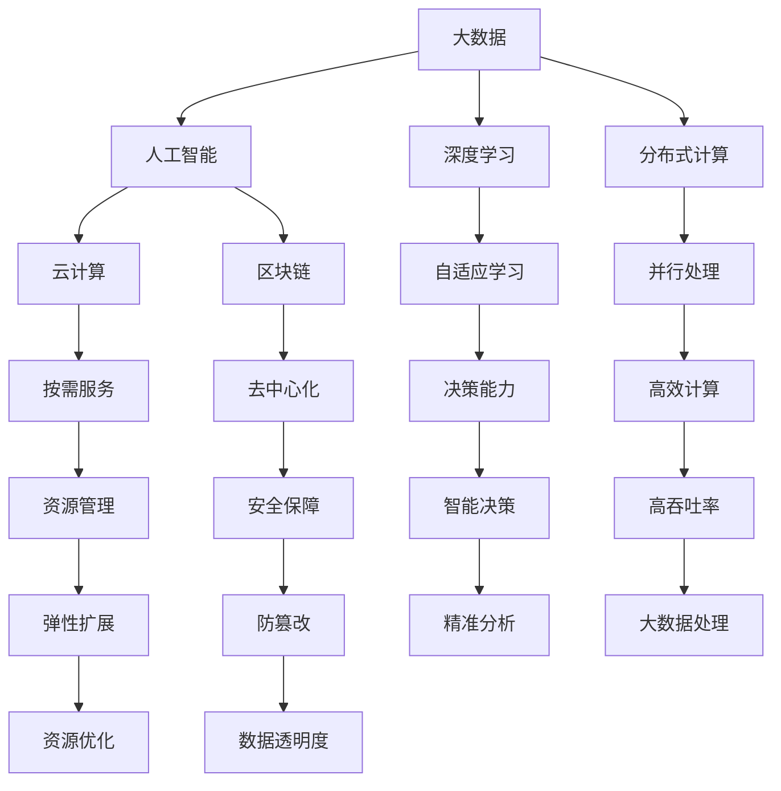

                 

# 连接全球智慧：人类计算的全球影响力

在信息技术飞速发展的今天，人类计算正在以前所未有的方式连接全球智慧。从深度学习到区块链，从大数据到云计算，信息技术正以前所未有的深度和广度，重塑着世界各地的生活方式和社会结构。本文将探讨人类计算的全球影响力，从算法、技术、应用、伦理等多角度展开深入分析，揭示这一时代浪潮中的核心力量和潜在风险。

## 1. 背景介绍

### 1.1 问题由来

随着信息技术的不断进步，计算能力和数据的积累已经进入一个全新的阶段。大数据、人工智能、物联网等技术的融合，使得全球的信息流动变得越来越频繁，信息的生产、共享和应用呈现出爆炸式增长。这一过程中，人类计算（Human Computation）的概念应运而生，即通过机器、网络、算法等技术手段，实现对全球智慧的连接和整合。

人类计算涉及的领域广泛，包括但不限于科学研究、环境保护、公共卫生、教育、经济等。其核心在于通过计算和数据分析，将分散的信息和智慧集中起来，为决策提供科学依据，推动社会进步。

### 1.2 问题核心关键点

人类计算的核心在于将全球智慧转化为可操作的决策信息。具体来说，以下关键点构成了人类计算的核心：

- **大数据的采集与存储**：通过传感器、互联网、社交媒体等渠道，采集全球范围内的数据，并存储在云端。
- **人工智能的算法与模型**：利用机器学习和深度学习算法，对大规模数据进行分析和建模，提取有价值的信息和知识。
- **网络与计算基础设施**：构建高速、可靠的全球网络，以及高效、灵活的计算基础设施，支持数据的流动和计算。
- **算力与存储资源的整合**：通过分布式计算、云服务等方式，实现计算和存储资源的整合，提升全球智慧的计算效率。
- **跨领域合作与协作**：不同领域、不同学科的专家和机构之间的合作与协作，推动跨领域知识的整合和应用。

这些关键点共同构成了人类计算的完整框架，使得我们能够通过计算技术和全球网络，实现对全球智慧的全面连接和整合。

## 2. 核心概念与联系

### 2.1 核心概念概述

为了更好地理解人类计算的全球影响力，本节将介绍几个密切相关的核心概念：

- **大数据（Big Data）**：指规模巨大、结构复杂、速度快速的数据集合。大数据的核心在于其容量、多样性和实时性，能够提供更加精准、全面的信息。
- **人工智能（Artificial Intelligence, AI）**：指通过算法和模型，使机器能够模拟人类智能，进行学习、推理、决策等任务。人工智能的核心在于其自适应、自学习的能力。
- **深度学习（Deep Learning）**：一种基于神经网络的机器学习技术，能够处理高度非线性的数据，自动提取特征并进行建模。深度学习是当前最流行的人工智能算法之一。
- **分布式计算（Distributed Computing）**：指通过多台计算机协同工作，实现大规模计算任务的并行处理。分布式计算是实现大规模数据处理和机器学习任务的基础。
- **云计算（Cloud Computing）**：指通过互联网，提供按需计算、存储和网络资源的服务。云计算极大地降低了计算成本，提高了资源利用率。
- **区块链（Blockchain）**：一种去中心化的分布式账本技术，能够实现数据的安全、透明和不可篡改。区块链在金融、供应链、物联网等领域具有广泛应用。

这些核心概念之间的关系，可以通过以下Mermaid流程图来展示：



这个流程图展示了大数据、人工智能、深度学习、分布式计算、云计算、区块链等概念之间的联系，以及它们在人类计算中的应用。

### 2.2 核心概念原理和架构

为了更好地理解这些核心概念，本节将从原理和架构的角度进行深入分析：

- **大数据的原理**：大数据的核心在于其海量数据的采集和存储。通过传感器、互联网、社交媒体等渠道，采集全球范围内的数据，并利用分布式存储技术，如Hadoop、Spark等，实现数据的分布式存储和处理。大数据的架构通常包括数据采集、存储、清洗、分析和应用等多个环节。

- **人工智能的原理**：人工智能的核心在于其自适应、自学习的能力。通过算法和模型，机器能够从数据中学习规律和模式，并进行推理和决策。当前，深度学习是最流行的人工智能算法之一，通过多层次的神经网络结构，自动提取数据的特征，并进行分类、回归、聚类等任务。

- **深度学习的原理**：深度学习是一种基于神经网络的机器学习技术，通过多层非线性变换，自动提取数据的特征，并进行分类、回归、聚类等任务。深度学习的核心在于其复杂的神经网络结构和大量训练数据。

- **分布式计算的原理**：分布式计算通过多台计算机协同工作，实现大规模计算任务的并行处理。分布式计算的核心在于其任务分解和调度策略，能够高效地处理海量数据和复杂任务。

- **云计算的原理**：云计算通过互联网，提供按需计算、存储和网络资源的服务。云计算的核心在于其弹性扩展和资源管理能力，能够根据需求动态调整资源配置，实现高效资源利用。

- **区块链的原理**：区块链是一种去中心化的分布式账本技术，通过加密和共识机制，实现数据的安全、透明和不可篡改。区块链的核心在于其去中心化、去信任的特点，能够构建安全、透明的信息流通网络。

## 3. 核心算法原理 & 具体操作步骤

### 3.1 算法原理概述

人类计算的核心在于通过算法和模型，将全球智慧转化为可操作的决策信息。具体来说，以下算法和模型构成了人类计算的核心：

- **机器学习算法**：通过算法和模型，机器能够从数据中学习规律和模式，并进行推理和决策。常见的机器学习算法包括线性回归、逻辑回归、决策树、随机森林、支持向量机、神经网络等。
- **深度学习模型**：一种基于神经网络的机器学习技术，能够处理高度非线性的数据，自动提取特征并进行建模。深度学习模型包括卷积神经网络（CNN）、循环神经网络（RNN）、长短时记忆网络（LSTM）、变分自编码器（VAE）等。
- **分布式计算框架**：通过分布式计算框架，实现大规模数据处理和机器学习任务。常见的分布式计算框架包括Apache Hadoop、Apache Spark、TensorFlow、PyTorch等。
- **云计算平台**：通过云计算平台，提供按需计算、存储和网络资源的服务。常见的云计算平台包括AWS、Azure、Google Cloud等。
- **区块链技术**：通过区块链技术，实现数据的安全、透明和不可篡改。常见的区块链技术包括比特币、以太坊、Hyperledger等。

### 3.2 算法步骤详解

人类计算的具体操作步骤包括以下几个环节：

**Step 1: 数据采集与存储**

1. **数据采集**：通过传感器、互联网、社交媒体等渠道，采集全球范围内的数据，包括文本、图像、视频、音频等多种类型的数据。
2. **数据清洗**：对采集到的数据进行清洗，去除噪声和冗余，确保数据的质量和一致性。
3. **数据存储**：利用分布式存储技术，如Hadoop、Spark等，将数据存储在云端。

**Step 2: 数据预处理**

1. **数据标注**：对数据进行标注，添加标签和元数据，便于后续分析和建模。
2. **数据增强**：通过数据增强技术，扩充数据集，提升模型的泛化能力。常见的数据增强技术包括图像旋转、缩放、裁剪、噪声添加等。
3. **特征提取**：利用特征提取技术，从数据中提取有价值的特征，便于后续建模。

**Step 3: 模型训练与评估**

1. **模型选择**：根据任务需求选择合适的模型，如线性回归、逻辑回归、深度学习模型等。
2. **模型训练**：利用分布式计算框架，对模型进行训练，调整模型参数，提升模型性能。
3. **模型评估**：在测试集上评估模型性能，通过指标如准确率、召回率、F1-score等评估模型的效果。

**Step 4: 模型部署与优化**

1. **模型部署**：将训练好的模型部署到生产环境中，提供服务接口，便于调用和使用。
2. **模型优化**：根据实际需求，对模型进行优化，提升模型的响应速度和计算效率。

### 3.3 算法优缺点

人类计算具有以下优点：

- **高效处理海量数据**：通过分布式计算和云计算，能够高效处理海量数据，提升数据分析和建模的效率。
- **促进跨领域合作**：通过数据共享和协作，促进不同领域、不同学科的专家和机构之间的合作，推动跨领域知识的整合和应用。
- **推动科技创新**：通过算法和模型的不断改进，推动科技创新的发展，加速社会进步。

同时，人类计算也存在以下缺点：

- **数据隐私和安全问题**：全球数据的采集和存储可能涉及隐私和数据安全问题，需要采取严格的保护措施。
- **算法偏见和歧视**：算法和模型可能存在偏见和歧视，导致不公平和误导性结果，需要引起重视。
- **计算资源消耗高**：人类计算需要大量的计算资源和存储资源，成本较高，需要合理规划和管理。

### 3.4 算法应用领域

人类计算在多个领域得到了广泛应用，包括但不限于：

- **科学研究**：利用大数据和人工智能技术，进行科学研究和技术创新，推动科技前沿发展。
- **环境保护**：通过数据分析和模型建模，实现环境保护和资源管理，提升生态环境质量。
- **公共卫生**：利用大数据和人工智能技术，进行疾病监测和预测，提升公共卫生水平。
- **教育**：通过数据分析和模型建模，改进教育资源分配和教育质量，推动教育公平。
- **经济**：利用大数据和人工智能技术，进行金融预测和经济分析，提升经济管理水平。
- **医疗**：利用大数据和人工智能技术，进行疾病诊断和治疗，提升医疗服务质量。
- **城市治理**：通过数据分析和模型建模，实现城市管理和公共服务，提升城市治理水平。
- **农业**：利用大数据和人工智能技术，进行农业生产和管理，提升农业生产效率和质量。

这些领域的应用展示了人类计算的广泛影响力和巨大潜力。

## 4. 数学模型和公式 & 详细讲解 & 举例说明

### 4.1 数学模型构建

人类计算的数学模型通常包括数据采集、数据清洗、数据预处理、模型训练和模型评估等多个环节。以下是一个简单的数学模型构建过程：

假设有一组数据 $D = \{(x_i, y_i)\}_{i=1}^N$，其中 $x_i$ 表示输入特征，$y_i$ 表示目标变量。假设选择的模型为线性回归模型 $y = wx + b$，其中 $w$ 为模型参数。

1. **数据采集与存储**：通过传感器、互联网、社交媒体等渠道，采集全球范围内的数据，并存储在云端。
2. **数据清洗**：对采集到的数据进行清洗，去除噪声和冗余，确保数据的质量和一致性。
3. **数据预处理**：利用特征提取技术，从数据中提取有价值的特征，便于后续建模。
4. **模型训练**：利用分布式计算框架，对模型进行训练，调整模型参数，提升模型性能。
5. **模型评估**：在测试集上评估模型性能，通过指标如均方误差（MSE）、均方根误差（RMSE）、决定系数（R²）等评估模型的效果。

### 4.2 公式推导过程

线性回归模型的公式推导如下：

1. **最小二乘法**：线性回归的目标是最小化残差平方和，即 $\sum_{i=1}^N (y_i - wx_i - b)^2$。
2. **求解线性方程组**：通过最小二乘法求解线性方程组 $\mathbf{X}^T\mathbf{X}\mathbf{w} = \mathbf{X}^T\mathbf{y}$，得到模型参数 $\mathbf{w} = (\mathbf{X}^T\mathbf{X})^{-1}\mathbf{X}^T\mathbf{y}$。
3. **模型评估**：通过测试集上的均方误差（MSE）评估模型效果。

### 4.3 案例分析与讲解

假设有一组数据，表示不同地区的人口和GDP，目标任务是建立人口与GDP之间的关系模型。以下是使用Python和Scikit-learn库实现线性回归的过程：

```python
from sklearn.linear_model import LinearRegression
import numpy as np

# 生成随机数据
x = np.random.randn(100)
y = 2 * x + 1 + np.random.randn(100)  # 线性关系

# 创建线性回归模型
model = LinearRegression()

# 训练模型
model.fit(x.reshape(-1, 1), y)

# 预测并评估模型
y_pred = model.predict(x.reshape(-1, 1))
mse = np.mean((y_pred - y) ** 2)
print("MSE:", mse)
```

## 5. 项目实践：代码实例和详细解释说明

### 5.1 开发环境搭建

在进行人类计算项目实践前，我们需要准备好开发环境。以下是使用Python进行项目开发的详细配置：

1. **安装Python**：从官网下载并安装最新版本的Python，推荐使用Anaconda环境。
2. **创建虚拟环境**：使用虚拟环境隔离不同的项目和依赖，避免环境冲突。
3. **安装依赖库**：安装项目所需的基本依赖库，如numpy、pandas、scikit-learn、tensorflow等。
4. **配置Jupyter Notebook**：使用Jupyter Notebook进行项目开发和实验，支持代码块、数据可视化和实时交互。

### 5.2 源代码详细实现

以一个简单的图像分类任务为例，介绍使用TensorFlow和Keras进行深度学习模型的实践。

**Step 1: 数据准备**

1. **数据集准备**：选择MNIST手写数字数据集，包含60000个训练样本和10000个测试样本。
2. **数据预处理**：将图像数据归一化，转换为模型所需的格式。

```python
import tensorflow as tf
from tensorflow.keras.datasets import mnist

# 加载数据集
(x_train, y_train), (x_test, y_test) = mnist.load_data()

# 数据预处理
x_train = x_train / 255.0
x_test = x_test / 255.0
```

**Step 2: 模型构建**

1. **定义模型**：使用Keras定义卷积神经网络模型。
2. **编译模型**：指定损失函数、优化器和评估指标。

```python
from tensorflow.keras import layers

# 定义模型
model = tf.keras.Sequential([
    layers.Conv2D(32, (3, 3), activation='relu', input_shape=(28, 28, 1)),
    layers.MaxPooling2D((2, 2)),
    layers.Conv2D(64, (3, 3), activation='relu'),
    layers.MaxPooling2D((2, 2)),
    layers.Flatten(),
    layers.Dense(10, activation='softmax')
])

# 编译模型
model.compile(optimizer='adam',
              loss='sparse_categorical_crossentropy',
              metrics=['accuracy'])
```

**Step 3: 模型训练**

1. **训练模型**：使用训练集数据，指定训练轮数和批大小。
2. **评估模型**：在测试集上评估模型性能，输出损失和准确率。

```python
# 训练模型
model.fit(x_train.reshape(-1, 28, 28, 1), y_train, epochs=5, batch_size=64)

# 评估模型
test_loss, test_acc = model.evaluate(x_test.reshape(-1, 28, 28, 1), y_test, verbose=2)
print('Test accuracy:', test_acc)
```

**Step 4: 模型应用**

1. **预测测试集**：使用测试集数据，进行模型预测。
2. **可视化结果**：将预测结果可视化，展示模型效果。

```python
# 预测测试集
y_pred = model.predict(x_test.reshape(-1, 28, 28, 1))

# 可视化结果
import matplotlib.pyplot as plt
plt.imshow(y_pred[0].reshape(28, 28), cmap='gray')
plt.title('Predicted image')
plt.show()
```

### 5.3 代码解读与分析

**Step 1: 数据准备**

- **数据集准备**：使用MNIST手写数字数据集，包含60000个训练样本和10000个测试样本。
- **数据预处理**：将图像数据归一化，转换为模型所需的格式，即输入为28x28的二维数组。

**Step 2: 模型构建**

- **定义模型**：使用Keras定义卷积神经网络模型，包括卷积层、池化层和全连接层。
- **编译模型**：指定损失函数为交叉熵，优化器为Adam，评估指标为准确率。

**Step 3: 模型训练**

- **训练模型**：使用训练集数据，指定训练轮数为5，批大小为64。
- **评估模型**：在测试集上评估模型性能，输出损失和准确率。

**Step 4: 模型应用**

- **预测测试集**：使用测试集数据，进行模型预测，输出预测结果。
- **可视化结果**：将预测结果可视化，展示模型效果，使用Matplotlib绘制图像。

## 6. 实际应用场景

### 6.1 智能城市治理

智能城市治理是人类计算的重要应用场景之一。通过数据分析和模型建模，实现城市管理和公共服务的智能化，提升城市治理水平。

**案例1: 交通管理**

- **数据采集**：通过摄像头、传感器等设备，采集交通流量、车速、车辆类型等数据。
- **数据预处理**：清洗和整理采集到的数据，消除噪声和异常值。
- **模型建模**：利用深度学习模型，进行交通流量预测、车辆类型识别等任务。
- **智能决策**：根据预测结果，智能调整交通信号灯，优化交通流，提升通行效率。

**案例2: 公共安全**

- **数据采集**：通过视频监控、社交媒体等渠道，采集公共安全相关数据。
- **数据预处理**：清洗和整理采集到的数据，消除噪声和异常值。
- **模型建模**：利用深度学习模型，进行异常行为检测、视频智能分析等任务。
- **智能决策**：根据检测结果，智能预警和处置突发事件，提升公共安全水平。

### 6.2 精准农业

精准农业是人类计算的另一个重要应用场景。通过数据分析和模型建模，实现农业生产的智能化和精细化，提升农业生产效率和质量。

**案例1: 作物识别**

- **数据采集**：通过无人机、传感器等设备，采集农田图像、土壤数据、气象数据等。
- **数据预处理**：清洗和整理采集到的数据，消除噪声和异常值。
- **模型建模**：利用深度学习模型，进行作物分类、病虫害检测等任务。
- **智能决策**：根据识别结果，智能调整灌溉、施肥等农业生产活动，提升农业生产效率。

**案例2: 产量预测**

- **数据采集**：通过传感器、农业机械等设备，采集农田气象数据、土壤数据、作物生长数据等。
- **数据预处理**：清洗和整理采集到的数据，消除噪声和异常值。
- **模型建模**：利用深度学习模型，进行产量预测、气象分析等任务。
- **智能决策**：根据预测结果，智能调整种植、管理等农业生产活动，提升农业生产质量。

### 6.3 健康医疗

健康医疗是人类计算的另一个重要应用场景。通过数据分析和模型建模，实现疾病监测、诊断和治疗的智能化，提升医疗服务质量。

**案例1: 疾病监测**

- **数据采集**：通过传感器、穿戴设备等设备，采集健康数据，如心率、血压、血糖等。
- **数据预处理**：清洗和整理采集到的数据，消除噪声和异常值。
- **模型建模**：利用深度学习模型，进行疾病预测、风险评估等任务。
- **智能决策**：根据预测结果，智能调整医疗方案，提升疾病预防和治疗效果。

**案例2: 智能诊断**

- **数据采集**：通过影像设备、电子病历等设备，采集医疗影像、病历数据等。
- **数据预处理**：清洗和整理采集到的数据，消除噪声和异常值。
- **模型建模**：利用深度学习模型，进行疾病诊断、影像识别等任务。
- **智能决策**：根据诊断结果，智能调整治疗方案，提升疾病诊断和治疗效果。

## 7. 工具和资源推荐

### 7.1 学习资源推荐

为了帮助开发者系统掌握人类计算的技术基础和应用实践，这里推荐一些优质的学习资源：

1. **《深度学习》课程**：由斯坦福大学Andrew Ng教授开设的在线课程，涵盖深度学习的基础理论和实践技术。
2. **《Python数据科学手册》书籍**：详细介绍了Python在数据分析、机器学习、数据可视化等方面的应用。
3. **《TensorFlow官方文档》**：提供了TensorFlow的详细使用指南和案例，是学习深度学习模型的必备资料。
4. **Kaggle平台**：提供大量的数据集和竞赛项目，是学习和实践数据科学和机器学习的绝佳平台。
5. **GitHub开源项目**：包含各种数据科学和机器学习项目，是学习和借鉴代码实现的良好资源。

通过这些资源的学习实践，相信你一定能够系统掌握人类计算的理论基础和实践技巧，并在实际项目中得到应用。

### 7.2 开发工具推荐

高效的开发离不开优秀的工具支持。以下是几款用于人类计算开发的常用工具：

1. **Python**：Python是当前最流行的编程语言之一，具有易学易用、生态丰富等特点，是数据分析和机器学习的理想选择。
2. **TensorFlow**：由Google主导开发的深度学习框架，生产部署方便，支持分布式计算和模型优化。
3. **PyTorch**：由Facebook主导开发的深度学习框架，灵活高效，支持动态计算图和模型优化。
4. **Scikit-learn**：Python数据科学库，提供了各种机器学习算法和模型，是数据科学和机器学习任务的基础。
5. **Jupyter Notebook**：交互式编程环境，支持代码块、数据可视化和实时交互，是数据科学和机器学习项目开发的理想工具。

合理利用这些工具，可以显著提升人类计算的开发效率，加快创新迭代的步伐。

### 7.3 相关论文推荐

人类计算的快速发展离不开学界的持续研究。以下是几篇奠基性的相关论文，推荐阅读：

1. **《Google AI Blog》系列文章**：详细介绍了Google AI在深度学习、分布式计算、云计算等方面的最新进展。
2. **《Nature》和《Science》论文**：报道了全球各地的科学研究和技术创新，展示了人类计算的广泛应用。
3. **《MIT Technology Review》论文**：分析了人工智能、大数据、区块链等前沿技术的发展趋势和应用前景。
4. **《IEEE Transactions on Neural Networks and Learning Systems》论文**：介绍了深度学习模型在各个领域的应用，展示了人类计算的广泛影响力。

这些论文代表了大数据、人工智能、深度学习、分布式计算、云计算等前沿技术的最新进展，是深入理解人类计算的重要参考资料。

## 8. 总结：未来发展趋势与挑战

### 8.1 研究成果总结

人类计算作为连接全球智慧的重要技术手段，已经广泛应用于科学研究、环境保护、公共卫生、教育、经济、医疗、城市治理等多个领域。通过大数据和深度学习模型，我们能够高效处理海量数据，促进跨领域合作，推动科技创新的发展。人类计算的广泛应用，已经展示了其巨大的潜力和广阔的前景。

### 8.2 未来发展趋势

人类计算的未来发展趋势包括以下几个方向：

1. **数据采集和存储技术的进步**：随着传感器技术、5G技术、物联网技术的发展，数据采集和存储将变得更加高效、便捷。
2. **计算能力和算力资源的提升**：随着分布式计算、云计算、边缘计算等技术的发展，计算能力和算力资源将进一步提升，支持更大规模的数据处理和机器学习任务。
3. **深度学习模型的不断优化**：深度学习模型将不断优化和改进，提升模型的准确性和泛化能力，支持更复杂的任务需求。
4. **跨领域合作的深化**：不同领域、不同学科的专家和机构之间的合作将更加紧密，推动跨领域知识的整合和应用。
5. **人机协同的智能化**：人工智能与人类协同工作，实现更高效、更智能的数据分析和模型建模，推动人工智能技术的落地应用。

### 8.3 面临的挑战

尽管人类计算的发展前景广阔，但也面临着诸多挑战：

1. **数据隐私和安全问题**：全球数据的采集和存储可能涉及隐私和数据安全问题，需要采取严格的保护措施。
2. **算法偏见和歧视**：算法和模型可能存在偏见和歧视，导致不公平和误导性结果，需要引起重视。
3. **计算资源消耗高**：人类计算需要大量的计算资源和存储资源，成本较高，需要合理规划和管理。
4. **跨领域合作难度大**：不同领域、不同学科之间的合作需要协调和沟通，存在一定的难度。
5. **技术和标准的规范**：不同技术和标准之间的兼容性和互通性需要进一步规范，避免技术和标准的混乱。

### 8.4 研究展望

未来的研究需要在以下几个方面寻求新的突破：

1. **数据隐私保护技术**：开发更高效的数据隐私保护技术，保护数据安全和隐私。
2. **公平性和透明性算法**：开发更加公平和透明的算法，避免算法偏见和歧视。
3. **资源优化和成本控制**：优化计算资源和存储资源的使用，降低成本，提升效率。
4. **跨领域协作平台**：建立跨领域协作平台，促进不同领域、不同学科之间的合作和交流。
5. **标准和规范的制定**：制定统一的技术和标准规范，促进技术和标准的互通和兼容性。

这些研究方向的探索，将引领人类计算技术迈向更高的台阶，为构建安全、可靠、可解释、可控的智能系统铺平道路。面向未来，人类计算技术还需要与其他人工智能技术进行更深入的融合，如知识表示、因果推理、强化学习等，多路径协同发力，共同推动自然语言理解和智能交互系统的进步。只有勇于创新、敢于突破，才能不断拓展人类计算的边界，让智能技术更好地造福人类社会。

## 9. 附录：常见问题与解答

**Q1: 人类计算是否只能用于大规模数据处理？**

A: 人类计算的核心在于通过计算和数据分析，实现对全球智慧的连接和整合。虽然大规模数据处理是其主要应用之一，但人类计算同样适用于中小规模数据处理和模型训练。选择合适的算法和模型，可以有效提升计算效率和模型性能。

**Q2: 人类计算是否存在数据隐私和安全问题？**

A: 全球数据的采集和存储可能涉及隐私和数据安全问题，需要采取严格的保护措施。通过数据匿名化、加密技术等手段，可以最大限度保护数据隐私和安全。同时，在数据共享和合作过程中，需要制定数据使用的规范和协议，避免数据泄露和滥用。

**Q3: 人类计算是否只能用于科学研究和技术创新？**

A: 人类计算的应用范围非常广泛，不仅限于科学研究和技术创新。它同样适用于环境保护、公共卫生、教育、经济、医疗、城市治理、农业等各个领域。通过数据分析和模型建模，能够提升各个领域的智能化水平，推动社会进步。

**Q4: 人类计算是否容易被恶意攻击和滥用？**

A: 人类计算的应用需要考虑安全性和道德性。虽然在技术实现和应用过程中可能存在一定的风险，但通过技术手段和管理措施，可以有效防范和避免恶意攻击和滥用。同时，需要制定相关政策和法规，规范人类计算的应用，保障其安全和道德性。

**Q5: 人类计算是否需要大规模计算资源和存储资源？**

A: 人类计算需要大量的计算资源和存储资源，成本较高。为了降低成本，需要优化算法和模型结构，提升计算效率。同时，可以通过分布式计算、云计算等技术手段，合理利用计算资源和存储资源，降低成本，提升效率。

作者：禅与计算机程序设计艺术 / Zen and the Art of Computer Programming

