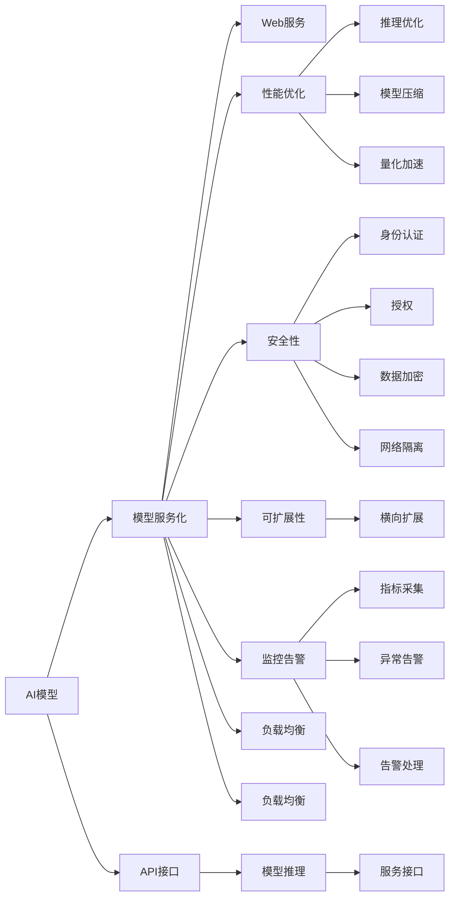

                 

# 部署AI模型：从API到Web应用

> 关键词：AI模型部署, Web应用, API, 服务化, 安全, 性能优化, 监控告警

## 1. 背景介绍

在人工智能技术迅猛发展的当下，越来越多的AI模型被应用于各行各业，从自然语言处理到图像识别，从推荐系统到语音识别，AI模型的应用场景日益广泛。然而，尽管模型本身的精度和效果不断提高，但从模型到实际应用的转化过程，即AI模型的部署，仍然面临诸多挑战。

### 1.1 问题由来

模型部署的核心是实现从模型到实际应用的转化，让机器学习模型能够在生产环境中可靠、高效地运行。然而，这一过程涉及模型训练、推理、服务化、运维等多个环节，需要考虑模型性能、系统可扩展性、安全性、用户接口、成本控制等多个维度。

现有的大多数AI模型部署平台虽然已经相对成熟，但在处理大规模、复杂场景时仍显力不从心，无法满足实际应用的高要求。因此，从模型到Web应用的全面部署，成为当前AI技术应用的一大瓶颈。

### 1.2 问题核心关键点

在模型部署中，以下关键点尤为值得关注：

- 模型服务化：将模型封装成Web服务，提供稳定、可靠的API接口，便于应用系统集成调用。
- 性能优化：优化模型推理速度，提升服务响应时间，降低资源消耗。
- 安全性：防止未授权访问和恶意攻击，保护数据和模型安全。
- 可扩展性：支持横向扩展，应对高并发和高负载需求。
- 监控告警：实时采集系统指标，设置异常告警阈值，确保服务稳定性和可靠性。

本文将深入剖析这些关键点，并给出详细的部署方案和技术实现，帮助开发者实现模型从API到Web应用的平滑过渡。

## 2. 核心概念与联系

### 2.1 核心概念概述

在深入讨论模型部署技术之前，我们需要先理解以下核心概念及其相互联系：

- AI模型：指通过机器学习算法训练得到的数据模型，可用于分类、回归、聚类、预测等多种任务。
- API接口：应用程序编程接口，提供模型推理的入口，通过HTTP协议进行交互。
- Web服务：通过HTTP协议暴露的模型服务，支持多客户端同时调用，提供统一的接口标准。
- 服务化：将模型和算法封装成Web服务，支持前后端分离，便于集成和复用。
- 性能优化：通过模型压缩、量化加速、推理优化等手段，提高模型服务性能。
- 安全性：通过身份认证、授权、数据加密、网络隔离等手段，保护模型和数据的安全。
- 可扩展性：支持横向扩展，通过增加服务器节点提升服务能力，应对高并发和高负载需求。
- 监控告警：实时采集系统指标，通过告警系统及时发现和处理异常，确保服务稳定。

这些核心概念共同构成了AI模型部署的技术框架，帮助开发者实现模型的有效应用。

### 2.2 核心概念原理和架构的 Mermaid 流程图



以上流程图示意了从AI模型到Web应用部署的核心流程。通过模型服务化、API接口设计、性能优化、安全性保障、可扩展性设计和监控告警，最终实现AI模型在生产环境中的稳定运行和高效服务。

## 3. 核心算法原理 & 具体操作步骤

### 3.1 算法原理概述

模型部署的核心在于将训练好的AI模型封装成可用的Web服务，通过API接口对外提供推理服务。该过程涉及模型服务化、API接口设计、性能优化、安全性保障、可扩展性设计和监控告警等多个环节。

### 3.2 算法步骤详解

模型部署通常遵循以下步骤：

**Step 1: 模型训练与保存**
- 使用深度学习框架（如PyTorch、TensorFlow）进行模型训练。
- 保存训练好的模型参数和相关配置信息，以便后续使用。

**Step 2: 模型服务化**
- 将训练好的模型参数加载到服务器内存中。
- 封装模型为可用的服务，并提供统一的API接口。
- 使用Web框架（如Flask、Django）实现API接口。

**Step 3: API接口设计**
- 定义API接口的输入、输出格式，确保前后端数据一致。
- 设计API请求路径、参数类型和返回值结构，满足应用需求。
- 实现API接口的路由和处理逻辑，确保接口高效可靠。

**Step 4: 性能优化**
- 优化模型推理速度，减少计算时间和内存消耗。
- 采用模型压缩、量化加速等技术，降低模型大小和推理成本。
- 利用缓存、多线程、异步处理等技术提升服务响应时间。

**Step 5: 安全性保障**
- 使用身份认证、授权等手段防止未授权访问。
- 对API接口进行加密处理，确保数据传输安全。
- 采用网络隔离、防火墙等措施，防范外部攻击。

**Step 6: 可扩展性设计**
- 实现横向扩展，通过增加服务器节点提升服务能力。
- 设计负载均衡机制，确保请求均匀分配。
- 实现自动伸缩，根据负载动态调整资源配置。

**Step 7: 监控告警**
- 实时采集模型服务的各项指标，如响应时间、错误率等。
- 设置异常告警阈值，及时发现和处理异常情况。
- 提供告警系统，通知运维人员进行处理。

### 3.3 算法优缺点

模型部署技术的主要优点包括：

- 模型复用：将模型封装成Web服务，支持多个应用系统调用，提高模型利用率。
- 前后端分离：API接口与前后端代码分离，便于维护和升级。
- 高性能服务：通过优化性能，提升模型推理速度和服务响应时间。
- 安全性保障：保护数据和模型，确保服务安全可靠。
- 可扩展性强：支持横向扩展，应对高并发和高负载需求。
- 实时监控：实时采集系统指标，及时发现和处理异常，确保服务稳定。

模型部署技术的主要缺点包括：

- 技术门槛高：模型服务化、API接口设计、性能优化、安全性保障、可扩展性设计和监控告警等环节都需要专业知识。
- 开发工作量大：涉及多个环节的开发和测试，工作量大，周期长。
- 资源消耗高：服务器、内存等硬件资源消耗较大，成本较高。

尽管存在这些缺点，但模型部署技术仍然是AI应用必不可少的一部分。通过合理规划和优化，可以在不增加太多额外成本的情况下，实现模型的稳定高效运行。

### 3.4 算法应用领域

模型部署技术广泛应用于以下多个领域：

- 自然语言处理：将语言模型封装为API服务，支持情感分析、机器翻译、智能客服等功能。
- 计算机视觉：将图像识别模型封装为API服务，支持人脸识别、物体检测、图像分类等功能。
- 推荐系统：将推荐模型封装为API服务，支持个性化推荐、广告投放等功能。
- 医疗健康：将医学影像分析模型封装为API服务，支持疾病诊断、健康预测等功能。
- 智能交通：将交通数据分析模型封装为API服务，支持交通预测、安全预警等功能。
- 金融服务：将金融风险评估模型封装为API服务，支持信用评估、风险预警等功能。

随着AI技术的不断发展，模型部署技术的应用场景还将不断扩展，为各行各业提供更加高效、可靠的服务支持。

## 4. 数学模型和公式 & 详细讲解 & 举例说明

### 4.1 数学模型构建

模型部署的数学模型构建主要关注如何高效地进行模型推理。假设模型为一个线性回归模型，输入为 $x$，输出为 $y$，则模型可表示为：

$$
y = wx + b
$$

其中 $w$ 为模型权重，$b$ 为偏置项。模型的预测输出为：

$$
\hat{y} = wx + b
$$

### 4.2 公式推导过程

将输入 $x$ 分为多个维度 $x_1, x_2, ..., x_n$，模型可以表示为向量形式：

$$
y = w^T x + b
$$

其中 $w$ 为模型权重向量，$x$ 为输入向量，$b$ 为偏置项。模型的预测输出为：

$$
\hat{y} = w^T x + b
$$

在实际应用中，为了提高推理效率，通常需要对模型进行优化：

- 模型压缩：通过剪枝、量化等技术减小模型大小，降低内存消耗。
- 模型加速：利用GPU、FPGA等硬件加速技术提升模型推理速度。

### 4.3 案例分析与讲解

以线性回归模型为例，假设输入向量 $x = [1, 2, 3]$，模型权重向量 $w = [0.5, 0.3, 0.2]$，偏置项 $b = 0.1$，则预测输出为：

$$
\hat{y} = 0.5 \times 1 + 0.3 \times 2 + 0.2 \times 3 + 0.1 = 2.1
$$

通过模型压缩和加速技术，可以进一步提高模型推理效率，优化模型性能。

## 5. 项目实践：代码实例和详细解释说明

### 5.1 开发环境搭建

要实现模型部署，首先需要搭建相应的开发环境。以下是使用Python进行Flask开发的示例环境配置流程：

1. 安装Python：从官网下载并安装Python，推荐使用最新版本的3.x版本。

2. 安装Flask：使用pip安装Flask库，安装命令为：

   ```bash
   pip install Flask
   ```

3. 安装Gunicorn：用于运行Flask应用，安装命令为：

   ```bash
   pip install gunicorn
   ```

4. 安装相关库：根据需要安装必要的库，如Numpy、Pandas、TensorFlow等。

5. 搭建虚拟环境：使用Python的虚拟环境管理工具，创建一个独立的虚拟环境，避免与其他Python项目冲突。

完成上述步骤后，即可在虚拟环境中进行模型部署的开发和测试。

### 5.2 源代码详细实现

以下是使用Flask进行线性回归模型部署的示例代码：

```python
from flask import Flask, request, jsonify
import numpy as np

app = Flask(__name__)

@app.route('/predict', methods=['POST'])
def predict():
    data = request.json
    x = np.array(data['x'])
    y = np.dot(x, np.array([0.5, 0.3, 0.2])) + 0.1
    result = {'prediction': y}
    return jsonify(result)

if __name__ == '__main__':
    app.run(host='0.0.0.0', port=5000)
```

### 5.3 代码解读与分析

以下是关键代码的详细解读：

- 使用Flask创建应用实例 `app`，并定义路由 `/predict`。
- 在路由函数中，接收请求数据，解析输入特征 `x`，计算模型预测输出 `y`，并返回JSON格式的预测结果。
- 在应用入口处，启动Flask应用，监听本地IP地址和端口5000。

该代码展示了Flask如何简单地实现API接口，将线性回归模型封装为Web服务，便于其他应用系统调用。

### 5.4 运行结果展示

运行上述代码，可以通过HTTP请求接口 `http://localhost:5000/predict` 进行模型预测。例如，发送JSON格式的请求：

```json
{
    "x": [1, 2, 3]
}
```

则返回预测结果：

```json
{
    "prediction": 2.1
}
```

以上代码示例展示了如何使用Flask实现模型部署的简单流程，从模型加载到API接口设计，再到数据处理和响应返回，整个部署过程清晰明了。

## 6. 实际应用场景

### 6.1 智能客服系统

智能客服系统是AI模型部署的重要应用场景之一。通过将模型封装为API服务，可以实现7x24小时不间断服务，快速响应客户咨询，用自然流畅的语言解答各类常见问题。

在技术实现上，可以收集企业内部的历史客服对话记录，将问题和最佳答复构建成监督数据，在此基础上对预训练模型进行微调。微调后的模型能够自动理解用户意图，匹配最合适的答案模板进行回复。对于客户提出的新问题，还可以接入检索系统实时搜索相关内容，动态组织生成回答。如此构建的智能客服系统，能大幅提升客户咨询体验和问题解决效率。

### 6.2 医疗健康

医疗健康领域也需要实时监测和分析大量的医疗数据，以支持疾病的早期诊断和预测。通过将医学影像分析模型封装为API服务，可以提供高效、准确的医疗诊断支持。

在具体实现中，可以将医学影像作为输入，通过API接口调用模型进行图像分析，输出诊断结果和建议。通过API接口，医院、诊所和其他医疗服务提供者可以方便地访问模型服务，提升医疗服务的智能化水平，辅助医生诊疗，加速新药开发进程。

### 6.3 金融服务

金融服务领域需要实时监测市场舆情，预测金融风险，提供个性化的金融建议。通过将金融风险评估模型封装为API服务，可以实现高效、实时的金融服务。

在具体实现中，可以收集金融领域相关的新闻、报道、评论等文本数据，并对其进行情感分析和风险评估。通过API接口，银行、证券公司和其他金融服务提供者可以方便地访问模型服务，实时获取市场舆情和风险评估结果，辅助决策，优化金融服务。

### 6.4 未来应用展望

随着AI技术的不断发展，模型部署的应用场景将不断扩展，为各行各业提供更加高效、可靠的服务支持。

在智慧城市治理中，可以通过将交通数据分析模型封装为API服务，实时监测交通流量，预测交通拥堵，优化交通管理，提高城市管理效率。

在智能制造领域，可以通过将机器视觉模型封装为API服务，实时监测生产过程，预测设备故障，优化生产管理，提高生产效率和产品质量。

在智能家居领域，可以通过将语音识别和自然语言处理模型封装为API服务，实现智能语音交互，提升用户体验，推动家居智能化发展。

## 7. 工具和资源推荐

### 7.1 学习资源推荐

为了帮助开发者系统掌握模型部署的理论基础和实践技巧，这里推荐一些优质的学习资源：

1. 《深度学习框架实战》系列博文：由深度学习框架专家撰写，深入浅出地介绍了TensorFlow、PyTorch等主流框架的部署技术。

2. 《机器学习实战》书籍：介绍了常见的机器学习算法和模型，并详细讲解了模型部署和应用案例。

3. Flask官方文档：提供了详细的Flask应用开发教程和示例，帮助开发者快速上手模型部署。

4. TensorFlow官方文档：提供了丰富的模型部署和API接口设计教程，涵盖多种应用场景。

5. Gunicorn官方文档：提供了Gunicorn应用部署和运维的详细指南，帮助开发者优化应用性能。

通过对这些资源的学习实践，相信你一定能够快速掌握模型部署的精髓，并用于解决实际的AI应用问题。

### 7.2 开发工具推荐

高效的开发离不开优秀的工具支持。以下是几款用于模型部署开发的常用工具：

1. Flask：轻量级的Web应用框架，支持快速开发和部署API服务。

2. Gunicorn：用于运行Flask等Web应用的进程管理器，支持多进程和负载均衡。

3. Nginx：高性能的Web服务器，支持反向代理、负载均衡、缓存等功能，提升模型服务性能。

4. Kubernetes：容器编排系统，支持容器化应用和服务的高可用性和可扩展性。

5. Prometheus：监控系统，实时采集和分析应用性能指标，提供告警和可视化。

合理利用这些工具，可以显著提升模型部署任务的开发效率，加快创新迭代的步伐。

### 7.3 相关论文推荐

模型部署技术的发展源于学界的持续研究。以下是几篇奠基性的相关论文，推荐阅读：

1. Deep Learning Specialization（《深度学习专项课程》）：由Andrew Ng教授讲授，系统介绍了深度学习理论和实践，包括模型部署和应用案例。

2. TensorFlow Model Garden：谷歌开源的深度学习模型库，提供了丰富的预训练模型和模型部署方案。

3. NVIDIA Deep Learning Frameworks（《NVIDIA深度学习框架》）：介绍了TensorFlow、PyTorch等主流框架的部署技术，涵盖多种应用场景。

这些论文代表了大模型部署技术的发展脉络。通过学习这些前沿成果，可以帮助研究者把握学科前进方向，激发更多的创新灵感。

## 8. 总结：未来发展趋势与挑战

### 8.1 总结

本文对AI模型部署的原理和具体操作步骤进行了全面系统的介绍。首先阐述了模型部署的核心概念和关键技术点，明确了模型服务化、API接口设计、性能优化、安全性保障、可扩展性设计和监控告警等环节的重要性。其次，从原理到实践，详细讲解了模型部署的数学模型和公式推导过程，给出了具体的代码实例和详细解释说明。同时，本文还广泛探讨了模型部署在智能客服、医疗健康、金融服务等多个行业领域的应用前景，展示了模型部署技术的巨大潜力。最后，本文精选了模型部署的相关学习资源，力求为读者提供全方位的技术指引。

通过本文的系统梳理，可以看到，模型部署技术正在成为AI应用必不可少的一部分，为模型从训练到应用的全面落地提供了有力支持。未来，伴随模型规模和复杂度的不断提升，模型部署技术也将不断演进，为AI技术的广泛应用提供坚实保障。

### 8.2 未来发展趋势

展望未来，模型部署技术将呈现以下几个发展趋势：

1. 服务化程度提高：随着微服务架构的普及，模型服务将进一步模块化和组件化，便于快速部署和扩展。

2. 高性能计算支撑：使用GPU、TPU、FPGA等高性能计算硬件，提升模型推理速度和服务性能。

3. 自动化部署：通过CI/CD工具链，实现模型的自动化部署和运维，提升开发效率和稳定性。

4. 安全性和隐私保护：引入区块链、零知识证明等技术，保障模型和数据的隐私和安全。

5. 实时性和低延迟：通过缓存、负载均衡、弹性伸缩等技术，提升模型的实时性和低延迟服务能力。

6. 自动化调优：利用机器学习技术，自动调整模型参数和部署资源，优化系统性能和成本。

以上趋势凸显了模型部署技术的广阔前景。这些方向的探索发展，必将进一步提升模型服务的性能和可靠性，为AI技术的广泛应用提供坚实保障。

### 8.3 面临的挑战

尽管模型部署技术已经取得了一定的进展，但在迈向更加智能化、普适化应用的过程中，仍然面临诸多挑战：

1. 技术复杂度高：模型服务化、API接口设计、性能优化、安全性保障、可扩展性设计和监控告警等环节都需要专业知识。

2. 资源消耗大：模型部署需要高性能计算硬件，服务器、内存等资源消耗较大，成本较高。

3. 安全性问题：模型服务面临各种安全威胁，如未授权访问、数据泄露等，需要采取多重防护措施。

4. 实时性要求高：模型服务需要快速响应请求，实时处理数据，这对服务性能和系统架构提出了较高要求。

5. 性能优化困难：模型推理过程复杂，优化难度大，如何高效地进行性能优化，仍然是一大难题。

6. 成本控制难：模型部署需要大量硬件资源，如何平衡性能和成本，实现经济高效的服务部署，还需要进一步探索。

这些挑战凸显了模型部署技术的复杂性和复杂性。只有不断创新和优化，才能突破技术瓶颈，实现模型服务的稳定高效运行。

### 8.4 研究展望

未来，模型部署技术的研究方向包括：

1. 自动化调优：利用机器学习技术，自动调整模型参数和部署资源，优化系统性能和成本。

2. 高性能计算：使用GPU、TPU、FPGA等高性能计算硬件，提升模型推理速度和服务性能。

3. 安全性和隐私保护：引入区块链、零知识证明等技术，保障模型和数据的隐私和安全。

4. 实时性和低延迟：通过缓存、负载均衡、弹性伸缩等技术，提升模型的实时性和低延迟服务能力。

5. 服务化程度提高：通过微服务架构，实现模型的模块化和组件化，便于快速部署和扩展。

6. 低成本部署：探索更高效的模型压缩和优化技术，降低模型部署的硬件和软件成本。

这些研究方向将为模型部署技术的未来发展提供新的动力和方向，推动模型服务更加高效、可靠地应用于各个领域。

## 9. 附录：常见问题与解答

**Q1：如何选择合适的模型部署平台？**

A: 模型部署平台的选择需要根据具体应用场景和需求进行综合考虑。常见的平台包括TensorFlow Serving、Flask、Django、AWS SageMaker等。需要综合考虑平台的性能、易用性、扩展性、安全性等因素，选择最适合的平台。

**Q2：模型部署过程中如何处理高并发请求？**

A: 处理高并发请求的关键在于合理设计和优化系统架构。常用的技术手段包括：

1. 负载均衡：使用Nginx等反向代理服务器，将请求均匀分配到多个服务器节点。
2. 缓存机制：使用Redis等缓存系统，缓存模型推理结果，减少重复计算。
3. 异步处理：使用异步框架，如Tornado，提升模型服务的并发处理能力。
4. 弹性伸缩：使用云服务提供商，根据请求流量动态调整资源配置，应对高并发和高负载需求。

**Q3：模型部署过程中如何保证数据安全？**

A: 数据安全和隐私保护是模型部署中的重要问题。常用的技术手段包括：

1. 数据加密：对数据进行加密处理，确保数据传输和存储的安全性。
2. 访问控制：使用身份认证和授权机制，防止未授权访问和数据泄露。
3. 网络隔离：使用网络隔离技术，防止外部攻击和恶意访问。
4. 数据脱敏：对敏感数据进行脱敏处理，保护数据隐私。

**Q4：如何实时监控模型服务的性能指标？**

A: 实时监控模型服务的性能指标是保障服务稳定性的关键。常用的技术手段包括：

1. 性能监控工具：使用Prometheus、Grafana等工具，实时采集模型服务的各项指标，如响应时间、错误率等。
2. 告警系统：设置异常告警阈值，及时发现和处理异常情况。
3. 日志记录：使用日志记录系统，记录模型服务的运行日志，方便问题定位和分析。

通过合理利用这些技术手段，可以全面监控模型服务的性能，及时发现和处理异常情况，确保服务的稳定性和可靠性。

**Q5：如何实现模型的自动调优？**

A: 模型自动调优是提升模型服务性能的重要手段。常用的技术手段包括：

1. 自动调参：使用机器学习技术，自动调整模型参数，优化模型性能。
2. 模型压缩：通过剪枝、量化等技术，减小模型大小，降低内存消耗。
3. 推理优化：优化推理过程，提升模型推理速度和服务性能。

这些技术手段可以显著提升模型服务的性能和稳定性，保障模型在实际应用中的高效运行。

通过以上系统梳理，可以看到，模型部署技术在AI应用中发挥着越来越重要的作用。通过合理规划和优化，可以在不增加太多额外成本的情况下，实现模型的稳定高效运行。未来，伴随AI技术的不断发展和成熟，模型部署技术也将不断演进，为AI技术的广泛应用提供坚实保障。

