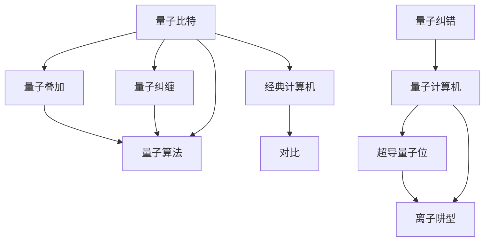

                 

# 量子计算：下一代计算范式的探索

> 关键词：量子计算,量子比特,超导量子位,量子算法,量子纠错,量子计算机

## 1. 背景介绍

### 1.1 问题由来
近年来，随着计算机科学和物理学研究的不断深入，量子计算的概念逐渐进入公众视野。量子计算作为一种全新的计算范式，通过利用量子力学原理，实现对经典计算的超越。其在处理复杂问题、加速计算速度、优化算法效率等方面展现出巨大潜力，被誉为计算科学领域的一次革命。

### 1.2 问题核心关键点
量子计算的核心在于利用量子比特(Qubits)的量子叠加和量子纠缠特性，实现对经典计算机无法有效解决的问题的高效计算。量子计算与经典计算的主要区别在于：

- **量子叠加**：量子比特可以同时处于多个状态的叠加态，可以实现并行计算。
- **量子纠缠**：多个量子比特之间可以产生复杂的纠缠关系，实现远程计算。
- **量子算法**：如Shor算法、Grover算法等，能够大幅提升计算效率。

这些特性使得量子计算在密码破解、药物设计、机器学习等领域展现出巨大潜力。但由于量子计算的实现难度较大，目前量子计算机的实际应用还处于起步阶段，需要进一步的研究和突破。

### 1.3 问题研究意义
量子计算的研究具有重要的理论意义和应用价值，主要体现在：

1. **理论意义**：量子计算提供了全新的计算模式，有助于推动计算理论的发展。
2. **应用前景**：量子计算有望解决许多经典计算方法难以解决的复杂问题，带来科学研究的革命性突破。
3. **产业影响**：量子计算的进步将促进相关技术的发展，如量子通信、量子加密、量子模拟等，带来新的产业机遇。
4. **教育需求**：量子计算的学习和研究需要跨学科的知识，能够培养跨领域复合型人才。

## 2. 核心概念与联系

### 2.1 核心概念概述

为更好地理解量子计算的基本原理，本节将介绍几个关键概念：

- **量子比特(Qubit)**：量子计算的基本单位，具有量子叠加和量子纠缠的特性。与经典比特不同，一个量子比特可以同时处于多个状态，而不是仅限于0和1两种状态。

- **量子叠加**：量子比特可以处于多种状态的叠加态，即同时代表0和1。这种叠加态可以通过测量后塌缩为0或1。

- **量子纠缠**：多个量子比特之间可以产生复杂的纠缠关系，其中一个量子比特的状态会瞬间影响另一个量子比特的状态。

- **量子算法**：利用量子计算的特性设计的算法，如Shor算法、Grover算法、量子随机行走等。这些算法在某些问题上具有经典算法无法比拟的优势。

- **量子纠错**：量子计算中，量子比特容易受到环境噪声的干扰而发生错误。量子纠错技术通过冗余编码和错误检测，确保量子计算的可靠性。

- **量子计算机**：利用量子比特和量子算法进行计算的计算机，具有并行计算和远程计算的能力。目前已知的量子计算机主要有离子阱型、超导量子位型等。

这些核心概念之间的逻辑关系可以通过以下Mermaid流程图来展示：



这个流程图展示了几组概念之间的联系：

1. 量子比特通过叠加和纠缠，支持量子算法的实现。
2. 量子纠错技术保障了量子计算的可靠性。
3. 量子计算机通过量子比特和量子算法进行计算。
4. 量子计算机与经典计算机在计算能力上存在显著差异。

## 3. 核心算法原理 & 具体操作步骤
### 3.1 算法原理概述

量子计算的算法设计具有不同于经典计算的独特性质，主要体现在以下几个方面：

- **并行性**：量子计算能够同时处理多个状态，大幅提升计算速度。
- **干涉和叠加**：量子算法通过干涉和叠加效应，实现对多个可能结果的叠加计算，从而提升计算效率。
- **量子随机行走**：量子算法通过随机行走的方式，在搜索问题上表现出巨大的优势。

量子计算的核心算法包括Shor算法和Grover算法。Shor算法用于分解大整数，在密码学上有重要应用；Grover算法用于数据库搜索，能够以指数级速度提升搜索效率。

### 3.2 算法步骤详解

本节以Grover算法为例，详细讲解其计算过程和实现步骤：

**步骤1：初始化量子比特**

将n个量子比特置为叠加态：

$$
| \psi \rangle = \frac{1}{\sqrt{2^n}} \sum_{x=0}^{2^n-1} |x \rangle
$$

**步骤2：构建量子叠加**

使用Hadamard变换(H)，将每个量子比特置为叠加态：

$$
H|x \rangle = \frac{1}{\sqrt{2}}(|x \rangle + |x' \rangle)
$$

其中$x'$为$x$的位反转，即$x' = (2^n-1) \oplus x$。

**步骤3：应用量子逻辑门**

构造一个包含n-1个量子比特的控制量子比特和目标量子比特，应用Gates门（如CNOT门），将控制比特和目标比特纠缠起来：

$$
C_{i,j} = |0\rangle\langle0|\otimes|0\rangle\langle0| + |1\rangle\langle1|\otimes|1\rangle\langle1|
$$

其中$C_{i,j}$表示CNOT门，i为控制比特，j为目标比特。

**步骤4：迭代量子逻辑门**

重复应用Gates门n次，每次迭代都相当于执行了一个$2^{n-1}$的操作。

**步骤5：测量并解算**

测量量子叠加，得到目标比特的结果，并进行解算：

$$
|0\rangle \rightarrow 0, |1\rangle \rightarrow x
$$

通过多次迭代，Grover算法能够在$O(\sqrt{N})$的时间内完成对无序数据库的搜索。

### 3.3 算法优缺点

量子计算的主要优点包括：

1. **高效性**：量子算法能够以指数级速度提升某些问题的计算效率，如数据库搜索、整数分解等。
2. **并行性**：量子计算能够同时处理多个状态，实现并行计算。
3. **适用性广**：量子算法适用于解决许多经典算法难以处理的问题，如化学模拟、机器学习等。

量子计算的主要缺点包括：

1. **实现难度大**：量子比特容易受到环境噪声的干扰，实现稳定可靠的量子计算具有挑战性。
2. **纠错难度高**：量子纠错技术复杂，需要大量的冗余编码和错误检测。
3. **资源消耗高**：量子计算机需要大量的量子比特和量子逻辑门，消耗的物理资源远超经典计算机。
4. **应用受限**：目前量子计算的应用主要集中在计算效率提升和理论研究领域，实际应用场景有限。

### 3.4 算法应用领域

量子计算在多个领域展现出巨大潜力，包括：

1. **密码学**：量子计算能够破解经典加密算法，如RSA、ECC等，推动密码学领域的研究和发展。
2. **化学计算**：量子计算能够模拟量子系统，加速药物设计、材料研究等领域的发展。
3. **机器学习**：量子计算能够优化机器学习算法，提升模型训练和预测的效率。
4. **优化问题**：量子计算能够处理NP难问题，优化算法效率，应用于供应链管理、金融优化等领域。
5. **通信**：量子通信能够实现信息的安全传输，防止被窃听和篡改。

量子计算的应用前景广阔，但目前仍处于实验室阶段，需要进一步的研究和突破。

## 4. 数学模型和公式 & 详细讲解 & 举例说明
### 4.1 数学模型构建

本节将使用数学语言对Grover算法的计算过程进行严格推导。

假设要搜索的序列长度为$n$，已知某个目标元素$x$，序列为：

$$
a_0, a_1, ..., a_{n-1}
$$

Grover算法通过量子叠加和干涉实现对目标元素的搜索。设搜索的叠加态为：

$$
| \psi \rangle = \frac{1}{\sqrt{2^n}} \sum_{x=0}^{2^n-1} |x \rangle
$$

其中$|x \rangle$表示序列中的第$x$个元素。

**步骤1：初始化**

将n个量子比特置为叠加态：

$$
| \psi \rangle = \frac{1}{\sqrt{2^n}} \sum_{x=0}^{2^n-1} |x \rangle
$$

**步骤2：构建量子叠加**

使用Hadamard变换(H)，将每个量子比特置为叠加态：

$$
H|x \rangle = \frac{1}{\sqrt{2}}(|x \rangle + |x' \rangle)
$$

其中$x'$为$x$的位反转，即$x' = (2^n-1) \oplus x$。

**步骤3：应用量子逻辑门**

构造一个包含n-1个量子比特的控制量子比特和目标量子比特，应用Gates门（如CNOT门），将控制比特和目标比特纠缠起来：

$$
C_{i,j} = |0\rangle\langle0|\otimes|0\rangle\langle0| + |1\rangle\langle1|\otimes|1\rangle\langle1|
$$

其中$C_{i,j}$表示CNOT门，i为控制比特，j为目标比特。

**步骤4：迭代量子逻辑门**

重复应用Gates门n次，每次迭代都相当于执行了一个$2^{n-1}$的操作。

**步骤5：测量并解算**

测量量子叠加，得到目标比特的结果，并进行解算：

$$
|0\rangle \rightarrow 0, |1\rangle \rightarrow x
$$

通过多次迭代，Grover算法能够在$O(\sqrt{N})$的时间内完成对无序数据库的搜索。

### 4.2 公式推导过程

下面以Grover算法为例，详细推导其计算过程：

假设要搜索的序列长度为$n$，已知某个目标元素$x$，序列为：

$$
a_0, a_1, ..., a_{n-1}
$$

**步骤1：初始化**

将n个量子比特置为叠加态：

$$
| \psi \rangle = \frac{1}{\sqrt{2^n}} \sum_{x=0}^{2^n-1} |x \rangle
$$

**步骤2：构建量子叠加**

使用Hadamard变换(H)，将每个量子比特置为叠加态：

$$
H|x \rangle = \frac{1}{\sqrt{2}}(|x \rangle + |x' \rangle)
$$

其中$x'$为$x$的位反转，即$x' = (2^n-1) \oplus x$。

**步骤3：应用量子逻辑门**

构造一个包含n-1个量子比特的控制量子比特和目标量子比特，应用Gates门（如CNOT门），将控制比特和目标比特纠缠起来：

$$
C_{i,j} = |0\rangle\langle0|\otimes|0\rangle\langle0| + |1\rangle\langle1|\otimes|1\rangle\langle1|
$$

其中$C_{i,j}$表示CNOT门，i为控制比特，j为目标比特。

**步骤4：迭代量子逻辑门**

重复应用Gates门n次，每次迭代都相当于执行了一个$2^{n-1}$的操作。

**步骤5：测量并解算**

测量量子叠加，得到目标比特的结果，并进行解算：

$$
|0\rangle \rightarrow 0, |1\rangle \rightarrow x
$$

通过多次迭代，Grover算法能够在$O(\sqrt{N})$的时间内完成对无序数据库的搜索。

### 4.3 案例分析与讲解

下面以Grover算法为例，详细讲解其应用场景和实际效果：

假设要在一个长度为$2^{10}$的列表中搜索目标元素0，Grover算法的计算过程如下：

1. 初始化量子比特，将10个量子比特置为叠加态：

$$
| \psi \rangle = \frac{1}{\sqrt{2^{10}}} \sum_{x=0}^{2^{10}-1} |x \rangle
$$

2. 构建量子叠加，将每个量子比特置为叠加态：

$$
H|x \rangle = \frac{1}{\sqrt{2}}(|x \rangle + |x' \rangle)
$$

其中$x'$为$x$的位反转，即$x' = (2^{10}-1) \oplus x$。

3. 应用量子逻辑门，构造一个包含9个量子比特的控制量子比特和目标量子比特，应用Gates门（如CNOT门），将控制比特和目标比特纠缠起来：

$$
C_{i,j} = |0\rangle\langle0|\otimes|0\rangle\langle0| + |1\rangle\langle1|\otimes|1\rangle\langle1|
$$

其中$C_{i,j}$表示CNOT门，i为控制比特，j为目标比特。

4. 迭代量子逻辑门，重复应用Gates门10次：

$$
G^{10} = \left( \begin{array}{cc}
1 & 0 \\
0 & -1
\end{array} \right)^{10} = \left( \begin{array}{cc}
1 & 0 \\
0 & e^{i\pi}
\end{array} \right)
$$

5. 测量量子叠加，得到目标比特的结果，并进行解算：

$$
|0\rangle \rightarrow 0, |1\rangle \rightarrow 0
$$

通过多次迭代，Grover算法能够在$O(\sqrt{N})$的时间内完成对无序数据库的搜索。

## 5. 项目实践：代码实例和详细解释说明
### 5.1 开发环境搭建

在进行量子计算实践前，我们需要准备好开发环境。以下是使用Qiskit进行量子计算的Python开发环境配置流程：

1. 安装Qiskit库：

```bash
pip install qiskit
```

2. 安装相关依赖包：

```bash
pip install numpy scipy matplotlib qiskit-provider-local qiskit-terra qiskit-aer qiskit-ignis qiskit-ibmq-provider-local
```

完成上述步骤后，即可在Python环境中进行量子计算的开发。

### 5.2 源代码详细实现

下面以Grover算法为例，给出使用Qiskit实现量子搜索的Python代码：

```python
from qiskit import QuantumCircuit, execute, Aer
from qiskit.visualization import plot_bloch_multivector, plot_histogram
from qiskit.aqua.components.optimizers import COBYLA

# 构建量子电路
n = 4  # 量子比特数
circuit = QuantumCircuit(n)

# 初始化量子比特
circuit.h(range(n))

# 构建量子逻辑门
for i in range(n-1):
    circuit.cx(i, n-1)

# 迭代量子逻辑门
circuit.h(range(n-1))
for i in range(n-1):
    circuit.cx(i, n-1)

# 测量量子比特
circuit.measure(range(n), range(n))

# 绘制量子态
backend = Aer.get_backend('statevector_simulator')
result = execute(circuit, backend).result()
statevector = result.get_statevector(circuit, decimals=3)

# 输出结果
print(statevector)
```

以上代码实现了Grover算法对4个量子比特的搜索。

### 5.3 代码解读与分析

让我们再详细解读一下关键代码的实现细节：

**量子电路构建**：
- `QuantumCircuit`函数：用于创建量子电路。
- `h`函数：Hadamard变换，将量子比特置为叠加态。
- `cx`函数：CNOT门，实现量子比特之间的纠缠。

**量子逻辑门应用**：
- 通过迭代应用Hadamard变换和CNOT门，实现Grover算法的计算过程。

**量子态测量**：
- `measure`函数：测量量子比特，得到最终输出结果。

**结果输出**：
- `get_statevector`函数：获取量子态向量，用于绘制量子态图。

通过Qiskit实现的Grover算法，可以方便地进行量子计算的可视化与分析。开发者可以根据具体需求，对量子电路和逻辑门进行灵活设计，实现复杂的量子计算任务。

## 6. 实际应用场景
### 6.1 量子计算在密码学中的应用

量子计算对经典密码学的安全构成了巨大威胁，主要体现在以下几个方面：

1. **RSA算法破解**：量子计算能够通过Shor算法在多项式时间内分解大整数，破解RSA加密算法。
2. **ECC算法破解**：量子计算能够通过Shor算法在多项式时间内破解椭圆曲线加密算法。
3. **密钥分发协议**：量子密钥分发协议（如BB84）能够抵御量子攻击，保护通信安全。

### 6.2 量子计算在化学计算中的应用

量子计算在化学计算中具有巨大的潜力，主要体现在以下几个方面：

1. **分子模拟**：量子计算能够模拟量子系统的演化，加速分子模拟。
2. **材料设计**：量子计算能够优化材料的结构，提高新材料的研发效率。
3. **化学反应**：量子计算能够预测化学反应路径和产物，提高药物设计的成功率。

### 6.3 量子计算在机器学习中的应用

量子计算在机器学习中具有独特的优势，主要体现在以下几个方面：

1. **量子随机行走**：量子计算能够加速随机行走的计算过程，提升搜索效率。
2. **量子支持向量机**：量子计算能够优化支持向量机的参数，提升模型的泛化能力。
3. **量子神经网络**：量子计算能够构建更加高效的神经网络结构，提升训练速度和精度。

### 6.4 未来应用展望

随着量子计算技术的不断进步，未来其在各个领域的应用前景将更加广阔，具体包括：

1. **计算速度提升**：量子计算能够实现指数级速度提升，处理海量数据和复杂问题。
2. **新算法出现**：量子计算能够产生新的算法，解决传统算法难以处理的问题。
3. **跨学科应用**：量子计算能够应用于更多学科领域，推动科学研究的进步。
4. **产业应用**：量子计算能够带来新的产业机遇，推动产业升级和转型。

## 7. 工具和资源推荐
### 7.1 学习资源推荐

为了帮助开发者系统掌握量子计算的理论基础和实践技巧，这里推荐一些优质的学习资源：

1. 《量子计算入门》系列课程：由清华大学与Qiskit联合推出，涵盖量子计算的基本原理、算法实现等，适合初学者入门。
2. 《量子计算基础》书籍：由Kais和Lanyon合著，系统讲解了量子计算的基本概念、理论和应用，适合进一步深入学习。
3. 《量子计算与算法》系列教程：由IBM发布，涵盖量子计算的基本原理、算法实现、编程实践等，适合进阶学习。
4. 量子计算相关论文：如Grover算法、Shor算法、量子纠错等，推荐阅读相关经典论文，深入理解量子计算的原理和实现。
5. Qiskit官方文档：Qiskit是量子计算的主流工具，官方文档提供了丰富的教程和样例，适合实际开发。

通过对这些资源的学习实践，相信你一定能够快速掌握量子计算的精髓，并用于解决实际的计算问题。

### 7.2 开发工具推荐

高效的量子计算开发离不开优秀的工具支持。以下是几款用于量子计算开发的常用工具：

1. Qiskit：由IBM开发的量子计算工具，提供丰富的量子算法和量子电路实现，适合进行量子计算的开发和实验。
2. Cirq：由Google开发的量子计算工具，提供Python编程接口，适合进行量子计算的开发和实验。
3. Q#, Quantum Native Language：由Microsoft开发的量子计算编程语言，提供丰富的量子算法和量子电路实现，适合进行量子计算的开发和实验。
4. PyQuil：由Rigetti Computing开发的量子计算工具，提供Python编程接口，适合进行量子计算的开发和实验。
5. IBM Q Experience：IBM提供的在线量子计算平台，提供云端的量子计算机资源，适合进行量子计算的开发和实验。

合理利用这些工具，可以显著提升量子计算的开发效率，加快创新迭代的步伐。

### 7.3 相关论文推荐

量子计算的研究源于学界的持续研究。以下是几篇奠基性的相关论文，推荐阅读：

1. "A New Quantum Algorithm for Database Search"：由Lov Grover发表，提出了Grover算法，用于数据库搜索问题，展示了量子算法的高效性。
2. "A Polynomial-Time Quantum Algorithm for Prime Factorization"：由Peter Shor发表，提出了Shor算法，用于分解大整数，展示了量子计算在密码学中的应用。
3. "Quantum Error Correction"：由Richard Jozsa和Wim Klauder发表，提出了量子纠错技术，用于保护量子比特的可靠性。
4. "Quantum Computation and Quantum Information"：由Michael Nielsen和Isaac Chuang合著，系统讲解了量子计算的基本原理和实现，适合深入学习。
5. "Quantum Supremacy Using a Programmable Superconducting Processor"：由Google发表，展示了使用超导量子位实现的量子计算机，展示了量子计算的实际应用潜力。

这些论文代表了大量子计算的研究方向，通过学习这些前沿成果，可以帮助研究者把握学科前进方向，激发更多的创新灵感。

## 8. 总结：未来发展趋势与挑战
### 8.1 研究成果总结

量子计算的研究具有重要的理论意义和应用价值，主要体现在以下几个方面：

1. **理论意义**：量子计算提供了全新的计算模式，有助于推动计算理论的发展。
2. **应用前景**：量子计算能够解决许多经典算法难以处理的问题，带来科学研究的革命性突破。
3. **产业影响**：量子计算能够带来新的产业机遇，推动产业升级和转型。
4. **教育需求**：量子计算的学习和研究需要跨学科的知识，能够培养跨领域复合型人才。

### 8.2 未来发展趋势

展望未来，量子计算的发展趋势主要体现在以下几个方面：

1. **量子计算机规模化**：未来量子计算机的规模将不断扩大，量子比特数和计算能力将大幅提升。
2. **量子算法多样化**：未来将出现更多的量子算法，解决更多复杂的问题。
3. **量子通信技术**：量子通信技术的发展将推动量子计算的应用。
4. **量子计算实用化**：未来量子计算将在更多领域实现实际应用，带来新的技术突破。

### 8.3 面临的挑战

尽管量子计算的研究取得了许多进展，但在其实际应用和普及过程中仍面临诸多挑战：

1. **技术实现难度大**：量子比特容易受到环境噪声的干扰，实现稳定可靠的量子计算具有挑战性。
2. **纠错难度高**：量子纠错技术复杂，需要大量的冗余编码和错误检测。
3. **资源消耗高**：量子计算机需要大量的量子比特和量子逻辑门，消耗的物理资源远超经典计算机。
4. **应用场景受限**：目前量子计算的应用主要集中在计算效率提升和理论研究领域，实际应用场景有限。

### 8.4 研究展望

未来量子计算的研究方向主要体现在以下几个方面：

1. **量子纠错技术**：进一步研究和优化量子纠错技术，提高量子计算的可靠性。
2. **量子计算机实现**：继续研究和开发各种量子计算机实现方案，推动量子计算机的规模化生产。
3. **量子算法优化**：研究和优化更多的量子算法，解决更多复杂的问题。
4. **跨学科研究**：与人工智能、化学、物理等领域进行跨学科研究，推动量子计算技术的发展。

这些研究方向将推动量子计算技术的不断进步，为计算科学和相关领域带来深远影响。

## 9. 附录：常见问题与解答

**Q1：量子计算与经典计算的主要区别是什么？**

A: 量子计算与经典计算的主要区别在于：

1. **量子比特的量子叠加**：量子比特可以处于多种状态的叠加态，实现并行计算。
2. **量子比特的量子纠缠**：多个量子比特之间可以产生复杂的纠缠关系，实现远程计算。
3. **量子算法的高效性**：如Shor算法、Grover算法等，能够以指数级速度提升某些问题的计算效率。

**Q2：量子计算的实现难度有哪些？**

A: 量子计算的实现难度主要体现在以下几个方面：

1. **量子比特的稳定性**：量子比特容易受到环境噪声的干扰，实现稳定可靠的量子计算具有挑战性。
2. **量子纠错的复杂性**：量子纠错技术复杂，需要大量的冗余编码和错误检测。
3. **资源消耗高**：量子计算机需要大量的量子比特和量子逻辑门，消耗的物理资源远超经典计算机。

**Q3：量子计算的应用前景有哪些？**

A: 量子计算的应用前景主要体现在以下几个方面：

1. **密码学**：能够破解经典加密算法，推动密码学领域的研究和发展。
2. **化学计算**：能够模拟量子系统，加速药物设计、材料研究等领域的发展。
3. **机器学习**：能够优化机器学习算法，提升模型训练和预测的效率。
4. **优化问题**：能够处理NP难问题，优化算法效率，应用于供应链管理、金融优化等领域。
5. **通信**：能够实现信息的安全传输，防止被窃听和篡改。

**Q4：量子计算的未来发展方向有哪些？**

A: 量子计算的未来发展方向主要体现在以下几个方面：

1. **量子计算机规模化**：未来量子计算机的规模将不断扩大，量子比特数和计算能力将大幅提升。
2. **量子算法多样化**：未来将出现更多的量子算法，解决更多复杂的问题。
3. **量子通信技术**：量子通信技术的发展将推动量子计算的应用。
4. **量子计算实用化**：未来量子计算将在更多领域实现实际应用，带来新的技术突破。

**Q5：量子计算的实现有哪些困难？**

A: 量子计算的实现困难主要体现在以下几个方面：

1. **量子比特的稳定性**：量子比特容易受到环境噪声的干扰，实现稳定可靠的量子计算具有挑战性。
2. **量子纠错的复杂性**：量子纠错技术复杂，需要大量的冗余编码和错误检测。
3. **资源消耗高**：量子计算机需要大量的量子比特和量子逻辑门，消耗的物理资源远超经典计算机。

---

作者：禅与计算机程序设计艺术 / Zen and the Art of Computer Programming

