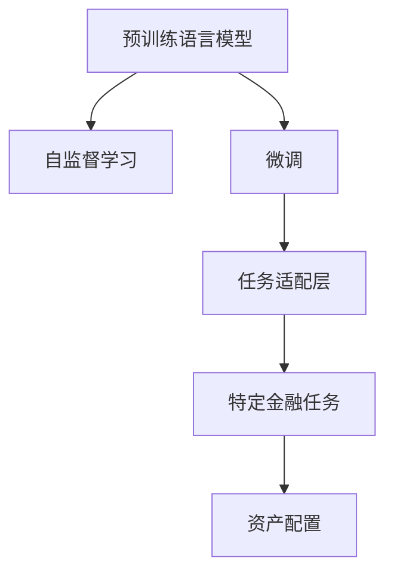

                 

# 金融领域的 LLM：赋能投资和风险管理

> 关键词：金融，语言模型，自然语言处理(NLP)，投资，风险管理，资产配置，情感分析

## 1. 背景介绍

### 1.1 问题由来

近年来，金融领域开始广泛关注和利用自然语言处理(Natural Language Processing, NLP)技术，以提升金融分析、风险管理和资产配置的智能化水平。传统的金融分析主要依赖人工分析股票财报、新闻、公告等文本信息，耗费大量时间和人力资源。而自然语言处理技术，尤其是预训练语言模型(Pretrained Language Models, PLMs)，提供了新的数据处理和模型训练的思路，能够高效地从大规模文本数据中提取和分析金融信息。

然而，预训练语言模型在海量无标签文本数据上进行预训练，获得的通用语言知识和常识具有一定的泛化能力，但对于特定金融领域的专有知识，其理解力和生成力仍有待提升。因此，基于预训练语言模型的微调(Fine-Tuning)技术成为了赋能金融领域的重要手段。

### 1.2 问题核心关键点

预训练语言模型的微调是指将预训练模型应用于特定金融领域，通过有监督的学习，使模型在特定的金融任务上，如财务报表分析、新闻舆情监测、情感分析等，获得更高的性能。微调技术通过在少量标注数据上进行微调，能够在保持预训练语言模型的泛化能力和理解能力的基础上，增强其针对特定领域的专业知识和推理能力。

微调技术的核心在于选择合适的任务适配层，通过添加或修改顶层结构，适配金融领域特定的任务需求。例如，在财务报表分析任务中，可以添加一个二分类或三分类器来区分资产类别或财务状态；在情感分析任务中，可以添加一个情感分类器来识别新闻文本的正面或负面情感。

## 2. 核心概念与联系

### 2.1 核心概念概述

为更好地理解基于预训练语言模型的微调技术在金融领域的应用，本节将介绍几个密切相关的核心概念：

- **预训练语言模型(PLMs)**：如BERT、GPT等，通过在大规模无标签文本数据上进行预训练，学习到通用的语言知识和语义表示。
- **微调(Fine-Tuning)**：将预训练模型应用于特定金融任务，通过有监督学习优化模型在该任务上的性能。
- **任务适配层(Task-specific Layer)**：为适配特定金融任务，在预训练模型顶部添加或修改所需的层，如分类器、解码器等。
- **自监督学习(Self-Supervised Learning)**：通过在无标签数据上进行预训练，利用语言模型任务（如掩码语言建模、下一句预测等）来自动学习语言表征。
- **监督学习(Supervised Learning)**：通过在标注数据上训练模型，使模型输出能够匹配任务标签。
- **金融领域(Financial Field)**：涉及股票、债券、基金、外汇等多个子领域，具有特定领域的数据和知识结构。
- **资产配置(Asset Allocation)**：根据投资者的风险承受能力和收益目标，合理分配各类资产的投资比例，以优化投资组合的风险和收益。

这些核心概念之间的逻辑关系可以通过以下Mermaid流程图来展示：



这个流程图展示了大语言模型微调的各个环节及其相互关系：

1. 预训练语言模型通过自监督学习任务进行预训练。
2. 微调将预训练模型适配到特定金融任务上，以提升在特定任务上的性能。
3. 任务适配层为微调模型提供特定的输出结构和损失函数。
4. 特定金融任务如资产配置、情感分析等，在微调模型的基础上进一步优化。
5. 资产配置通过优化投资组合，达到最优的风险和收益。

## 3. 核心算法原理 & 具体操作步骤

### 3.1 算法原理概述

基于预训练语言模型的微调，本质上是一种有监督的细粒度迁移学习。其核心思想是：将预训练的语言模型作为"特征提取器"，通过在特定金融任务的标注数据上进行微调，使得模型输出的特征能够适应特定任务的需求，从而提高模型在特定金融任务上的性能。

具体而言，微调过程通常分为两个阶段：预训练和微调。在预训练阶段，模型在无标签的大规模文本数据上通过自监督学习任务进行训练，学习到通用的语言表示和语言知识。在微调阶段，将预训练模型应用于特定金融任务，通过有监督学习优化模型在该任务上的性能。

### 3.2 算法步骤详解

1. **数据准备**：收集金融领域的标注数据，如财务报表、新闻报道、公告等。预处理数据，包括去除噪声、划分训练集、验证集和测试集等。

2. **模型初始化**：选择合适的预训练语言模型，如BERT、GPT等，并将其作为微调的初始模型。

3. **任务适配层设计**：根据具体任务，在预训练模型的顶部添加或修改顶层结构，如分类器、解码器等，适配特定金融任务。

4. **模型微调**：使用标注数据，在微调模型上训练，优化模型的参数，使模型输出能够匹配任务标签。

5. **模型评估与优化**：在验证集上评估模型的性能，根据评估结果调整模型参数，进一步优化模型。

6. **模型部署与测试**：在测试集上评估微调后的模型性能，将模型部署到生产环境中，进行实际测试。

### 3.3 算法优缺点

基于预训练语言模型的微调技术具有以下优点：

- **高泛化能力**：预训练模型在大量无标签数据上进行训练，学习到通用的语言知识和表示，具有较强的泛化能力。
- **高效训练**：通过微调，模型能够快速适应特定金融任务，在少量标注数据上进行优化。
- **任务适配灵活**：通过添加或修改顶层结构，能够适配各种金融任务，如财务报表分析、情感分析、资产配置等。
- **易于优化**：微调过程可以通过梯度下降等优化算法进行，实现自动化优化。

但该方法也存在一定的局限性：

- **标注数据需求高**：微调需要高质量的标注数据，标注成本较高，特别是在金融领域。
- **过拟合风险**：在标注数据较少的情况下，微调模型容易过拟合，泛化性能下降。
- **模型复杂性高**：预训练语言模型参数较多，微调后的模型较为复杂，推理速度较慢。
- **领域依赖性**：微调模型对特定领域的知识依赖较大，在未见过的数据上性能可能较差。

### 3.4 算法应用领域

基于预训练语言模型的微调技术，已经在金融领域得到广泛应用，涵盖了多个金融任务，例如：

- **财务报表分析**：利用财务报表文本数据，进行财务比率、资产负债表、利润表等的分析。
- **新闻舆情监测**：对金融新闻进行情感分析、主题分类等，实时监测市场舆情动态。
- **资产配置**：利用金融公告、市场数据等文本信息，进行资产类别和投资比例的优化。
- **投资策略制定**：通过分析市场新闻、投资报告等文本，制定投资策略，进行投资决策。
- **风险管理**：对金融风险信息进行情感分析、主题分类等，及时发现风险事件，进行风险预警。
- **股票预测**：利用市场新闻、分析师评论等文本，进行股票价格预测。

## 4. 数学模型和公式 & 详细讲解 & 举例说明

### 4.1 数学模型构建

假设预训练语言模型为 $M_{\theta}$，其中 $\theta$ 为预训练得到的模型参数。给定金融任务 $T$ 的标注数据集 $D=\{(x_i,y_i)\}_{i=1}^N$，微调的目标是找到新的模型参数 $\hat{\theta}$，使得：

$$
\hat{\theta}=\mathop{\arg\min}_{\theta} \mathcal{L}(M_{\theta},D)
$$

其中 $\mathcal{L}$ 为针对任务 $T$ 设计的损失函数，用于衡量模型预测输出与真实标签之间的差异。常见的损失函数包括交叉熵损失、均方误差损失等。

在金融领域，常见的微调任务包括分类任务、回归任务、情感分析任务等。以二分类任务为例，假设模型 $M_{\theta}$ 在输入 $x$ 上的输出为 $\hat{y}=M_{\theta}(x) \in [0,1]$，表示样本属于正类的概率。真实标签 $y \in \{0,1\}$。则二分类交叉熵损失函数定义为：

$$
\ell(M_{\theta}(x),y) = -[y\log \hat{y} + (1-y)\log (1-\hat{y})]
$$

将其代入经验风险公式，得：

$$
\mathcal{L}(\theta) = -\frac{1}{N}\sum_{i=1}^N [y_i\log M_{\theta}(x_i)+(1-y_i)\log(1-M_{\theta}(x_i))]
$$

在得到损失函数的梯度后，即可带入参数更新公式，完成模型的迭代优化。重复上述过程直至收敛，最终得到适应金融任务的最优模型参数 $\hat{\theta}$。

### 4.2 公式推导过程

以财务报表分类任务为例，假设模型的输入为财务报表的文本，输出为资产类型，如债务、股权等。模型的损失函数为二分类交叉熵损失函数：

$$
\mathcal{L}(\theta) = -\frac{1}{N}\sum_{i=1}^N [y_i\log \hat{y}_i+(1-y_i)\log(1-\hat{y}_i)]
$$

其中 $y_i \in \{0,1\}$ 为真实的资产类型，$\hat{y}_i = M_{\theta}(x_i)$ 为模型预测的资产类型概率。模型的参数更新公式为：

$$
\theta \leftarrow \theta - \eta \nabla_{\theta}\mathcal{L}(\theta)
$$

其中 $\eta$ 为学习率，$\nabla_{\theta}\mathcal{L}(\theta)$ 为损失函数对参数 $\theta$ 的梯度。

### 4.3 案例分析与讲解

以新闻情感分析为例，假设模型输入为金融新闻文本，输出为情感分类标签，如正面、负面、中性等。模型的损失函数为三分类交叉熵损失函数：

$$
\mathcal{L}(\theta) = -\frac{1}{N}\sum_{i=1}^N [y_i\log \hat{y}_i+(1-y_i)\log(1-\hat{y}_i)]
$$

其中 $y_i \in \{1,2,3\}$ 为真实的情感分类，$\hat{y}_i = M_{\theta}(x_i)$ 为模型预测的情感分类概率。模型的参数更新公式为：

$$
\theta \leftarrow \theta - \eta \nabla_{\theta}\mathcal{L}(\theta)
$$

在实际应用中，可以使用模型训练数据集对模型进行微调，从而提升模型在新闻情感分析任务上的性能。例如，对于金融领域的新闻数据，可以通过以下步骤进行微调：

1. 收集金融领域的新闻数据集，包括新闻标题、正文等文本。
2. 对新闻数据进行预处理，如去除噪声、分词、停用词过滤等。
3. 定义任务适配层，如情感分类器，将文本输入模型。
4. 使用训练集对模型进行微调，最小化损失函数。
5. 在验证集上评估模型性能，调整模型参数。
6. 在测试集上评估微调后的模型性能，部署到生产环境中。

## 5. 项目实践：代码实例和详细解释说明

### 5.1 开发环境搭建

在进行金融领域微调实践前，我们需要准备好开发环境。以下是使用Python进行PyTorch开发的环境配置流程：

1. 安装Anaconda：从官网下载并安装Anaconda，用于创建独立的Python环境。

2. 创建并激活虚拟环境：
```bash
conda create -n pytorch-env python=3.8 
conda activate pytorch-env
```

3. 安装PyTorch：根据CUDA版本，从官网获取对应的安装命令。例如：
```bash
conda install pytorch torchvision torchaudio cudatoolkit=11.1 -c pytorch -c conda-forge
```

4. 安装Transformers库：
```bash
pip install transformers
```

5. 安装各类工具包：
```bash
pip install numpy pandas scikit-learn matplotlib tqdm jupyter notebook ipython
```

完成上述步骤后，即可在`pytorch-env`环境中开始微调实践。

### 5.2 源代码详细实现

这里我们以金融领域的新闻情感分析任务为例，给出使用Transformers库对BERT模型进行微调的PyTorch代码实现。

首先，定义情感分类任务的数据处理函数：

```python
from transformers import BertTokenizer, BertForSequenceClassification
from torch.utils.data import Dataset, DataLoader
import torch

class FinanceNewsDataset(Dataset):
    def __init__(self, texts, labels, tokenizer, max_len=128):
        self.texts = texts
        self.labels = labels
        self.tokenizer = tokenizer
        self.max_len = max_len
        
    def __len__(self):
        return len(self.texts)
    
    def __getitem__(self, item):
        text = self.texts[item]
        label = self.labels[item]
        
        encoding = self.tokenizer(text, return_tensors='pt', max_length=self.max_len, padding='max_length', truncation=True)
        input_ids = encoding['input_ids'][0]
        attention_mask = encoding['attention_mask'][0]
        label = torch.tensor(label, dtype=torch.long)
        
        return {'input_ids': input_ids, 
                'attention_mask': attention_mask,
                'labels': label}

# 标签与id的映射
label2id = {'positive': 1, 'negative': 0, 'neutral': 2}
id2label = {v: k for k, v in label2id.items()}

# 创建dataset
tokenizer = BertTokenizer.from_pretrained('bert-base-cased')

train_dataset = FinanceNewsDataset(train_texts, train_labels, tokenizer)
dev_dataset = FinanceNewsDataset(dev_texts, dev_labels, tokenizer)
test_dataset = FinanceNewsDataset(test_texts, test_labels, tokenizer)
```

然后，定义模型和优化器：

```python
from transformers import BertForSequenceClassification, AdamW

model = BertForSequenceClassification.from_pretrained('bert-base-cased', num_labels=len(label2id))

optimizer = AdamW(model.parameters(), lr=2e-5)
```

接着，定义训练和评估函数：

```python
from sklearn.metrics import accuracy_score, precision_recall_fscore_support

device = torch.device('cuda') if torch.cuda.is_available() else torch.device('cpu')
model.to(device)

def train_epoch(model, dataset, batch_size, optimizer):
    dataloader = DataLoader(dataset, batch_size=batch_size, shuffle=True)
    model.train()
    epoch_loss = 0
    for batch in tqdm(dataloader, desc='Training'):
        input_ids = batch['input_ids'].to(device)
        attention_mask = batch['attention_mask'].to(device)
        labels = batch['labels'].to(device)
        model.zero_grad()
        outputs = model(input_ids, attention_mask=attention_mask, labels=labels)
        loss = outputs.loss
        epoch_loss += loss.item()
        loss.backward()
        optimizer.step()
    return epoch_loss / len(dataloader)

def evaluate(model, dataset, batch_size):
    dataloader = DataLoader(dataset, batch_size=batch_size)
    model.eval()
    preds, labels = [], []
    with torch.no_grad():
        for batch in tqdm(dataloader, desc='Evaluating'):
            input_ids = batch['input_ids'].to(device)
            attention_mask = batch['attention_mask'].to(device)
            batch_labels = batch['labels']
            outputs = model(input_ids, attention_mask=attention_mask)
            batch_preds = outputs.logits.argmax(dim=2).to('cpu').tolist()
            batch_labels = batch_labels.to('cpu').tolist()
            for pred, label in zip(batch_preds, batch_labels):
                preds.append(pred)
                labels.append(label)
                
    print('Accuracy: {:.2f}%'.format(accuracy_score(labels, preds)))
    print('Precision, Recall, F1-Score: {}, {}, {}'.format(*precision_recall_fscore_support(labels, preds, average='macro')))
```

最后，启动训练流程并在测试集上评估：

```python
epochs = 5
batch_size = 16

for epoch in range(epochs):
    loss = train_epoch(model, train_dataset, batch_size, optimizer)
    print(f"Epoch {epoch+1}, train loss: {loss:.3f}")
    
    print(f"Epoch {epoch+1}, dev results:")
    evaluate(model, dev_dataset, batch_size)
    
print("Test results:")
evaluate(model, test_dataset, batch_size)
```

以上就是使用PyTorch对BERT进行金融领域新闻情感分析任务微调的完整代码实现。可以看到，得益于Transformers库的强大封装，我们可以用相对简洁的代码完成BERT模型的加载和微调。

### 5.3 代码解读与分析

让我们再详细解读一下关键代码的实现细节：

**FinanceNewsDataset类**：
- `__init__`方法：初始化文本、标签、分词器等关键组件。
- `__len__`方法：返回数据集的样本数量。
- `__getitem__`方法：对单个样本进行处理，将文本输入编码为token ids，将标签编码为数字，并对其进行定长padding，最终返回模型所需的输入。

**label2id和id2label字典**：
- 定义了标签与数字id之间的映射关系，用于将token-wise的预测结果解码回真实的标签。

**训练和评估函数**：
- 使用PyTorch的DataLoader对数据集进行批次化加载，供模型训练和推理使用。
- 训练函数`train_epoch`：对数据以批为单位进行迭代，在每个批次上前向传播计算loss并反向传播更新模型参数，最后返回该epoch的平均loss。
- 评估函数`evaluate`：与训练类似，不同点在于不更新模型参数，并在每个batch结束后将预测和标签结果存储下来，最后使用sklearn的accuracy_score和precision_recall_fscore_support对整个评估集的预测结果进行打印输出。

**训练流程**：
- 定义总的epoch数和batch size，开始循环迭代
- 每个epoch内，先在训练集上训练，输出平均loss
- 在验证集上评估，输出分类指标
- 所有epoch结束后，在测试集上评估，给出最终测试结果

可以看到，PyTorch配合Transformers库使得BERT微调的代码实现变得简洁高效。开发者可以将更多精力放在数据处理、模型改进等高层逻辑上，而不必过多关注底层的实现细节。

当然，工业级的系统实现还需考虑更多因素，如模型的保存和部署、超参数的自动搜索、更灵活的任务适配层等。但核心的微调范式基本与此类似。

## 6. 实际应用场景

### 6.1 智能投顾系统

基于大语言模型微调的金融分析技术，可以广泛应用于智能投顾系统的构建。智能投顾系统利用金融领域的专业知识和模型，结合用户行为数据和市场信息，提供个性化的投资建议，显著提升投资决策的科学性和合理性。

在技术实现上，可以收集用户的历史投资数据、股票市场数据、经济指标等文本信息，将其输入到预训练语言模型中进行微调。微调后的模型能够理解用户的投资偏好和市场动态，生成个性化的投资策略和建议。此外，系统还可以实时监测市场舆情，及时调整投资组合，以应对市场变化。

### 6.2 风险预警系统

金融风险管理是大语言模型微调技术的重要应用场景。通过分析金融新闻、公告、报告等文本信息，可以实时监测市场的风险变化，及时预警潜在的风险事件。

具体而言，可以收集金融领域的新闻数据、市场报告等文本，进行情感分析、主题分类等任务，得到市场风险的情感倾向和热点主题。通过情感分析，可以判断市场的情绪是乐观还是悲观，通过主题分类，可以识别市场关注的重点领域和事件。在风险预警系统中，根据情感和主题分析的结果，可以生成风险预警报告，提供给投资者和金融机构，以便及时采取应对措施。

### 6.3 资产配置系统

资产配置系统通过分析市场新闻、分析师评论等文本信息，结合历史数据和模型，优化投资组合中各类资产的比例，达到最优的风险和收益。

在微调过程中，可以收集市场新闻、分析师评论等文本数据，进行情感分析、主题分类等任务。通过情感分析，可以判断市场情绪是乐观还是悲观，通过主题分类，可以识别市场关注的重点领域和事件。基于这些分析结果，微调后的模型可以生成投资建议，调整各类资产的比例，实现动态的资产配置。

### 6.4 未来应用展望

随着大语言模型微调技术的不断发展，未来在金融领域的应用前景将更加广阔。以下是对未来应用场景的展望：

1. **多资产智能管理**：利用自然语言处理技术，实时监测多资产的市场动态，优化投资组合，实现更加智能化的资产管理。

2. **量化交易**：结合自然语言处理和量化技术，利用文本信息进行量化交易，提升交易效率和收益。

3. **金融舆情分析**：通过情感分析、主题分类等任务，实时监测金融市场的舆情动态，提供及时的决策支持。

4. **风险管理自动化**：利用自然语言处理技术，实时分析金融新闻、公告等文本信息，自动生成风险预警报告，提高风险管理的自动化水平。

5. **市场情绪分析**：通过情感分析、主题分类等任务，分析市场情绪和热点主题，提供决策支持。

6. **智能投研平台**：利用自然语言处理技术，结合专家知识库和模型，提升投研平台的智能化水平，提高研究效率和质量。

## 7. 工具和资源推荐

### 7.1 学习资源推荐

为了帮助开发者系统掌握大语言模型微调的理论基础和实践技巧，这里推荐一些优质的学习资源：

1. 《Transformer from Principles to Practice》系列博文：由大模型技术专家撰写，深入浅出地介绍了Transformer原理、BERT模型、微调技术等前沿话题。

2. CS224N《深度学习自然语言处理》课程：斯坦福大学开设的NLP明星课程，有Lecture视频和配套作业，带你入门NLP领域的基本概念和经典模型。

3. 《Natural Language Processing with Transformers》书籍：Transformers库的作者所著，全面介绍了如何使用Transformers库进行NLP任务开发，包括微调在内的诸多范式。

4. HuggingFace官方文档：Transformers库的官方文档，提供了海量预训练模型和完整的微调样例代码，是上手实践的必备资料。

5. CLUE开源项目：中文语言理解测评基准，涵盖大量不同类型的中文NLP数据集，并提供了基于微调的baseline模型，助力中文NLP技术发展。

通过对这些资源的学习实践，相信你一定能够快速掌握大语言模型微调的精髓，并用于解决实际的NLP问题。
###  7.2 开发工具推荐

高效的开发离不开优秀的工具支持。以下是几款用于大语言模型微调开发的常用工具：

1. PyTorch：基于Python的开源深度学习框架，灵活动态的计算图，适合快速迭代研究。大部分预训练语言模型都有PyTorch版本的实现。

2. TensorFlow：由Google主导开发的开源深度学习框架，生产部署方便，适合大规模工程应用。同样有丰富的预训练语言模型资源。

3. Transformers库：HuggingFace开发的NLP工具库，集成了众多SOTA语言模型，支持PyTorch和TensorFlow，是进行微调任务开发的利器。

4. Weights & Biases：模型训练的实验跟踪工具，可以记录和可视化模型训练过程中的各项指标，方便对比和调优。与主流深度学习框架无缝集成。

5. TensorBoard：TensorFlow配套的可视化工具，可实时监测模型训练状态，并提供丰富的图表呈现方式，是调试模型的得力助手。

6. Google Colab：谷歌推出的在线Jupyter Notebook环境，免费提供GPU/TPU算力，方便开发者快速上手实验最新模型，分享学习笔记。

合理利用这些工具，可以显著提升大语言模型微调任务的开发效率，加快创新迭代的步伐。

### 7.3 相关论文推荐

大语言模型和微调技术的发展源于学界的持续研究。以下是几篇奠基性的相关论文，推荐阅读：

1. Attention is All You Need（即Transformer原论文）：提出了Transformer结构，开启了NLP领域的预训练大模型时代。

2. BERT: Pre-training of Deep Bidirectional Transformers for Language Understanding：提出BERT模型，引入基于掩码的自监督预训练任务，刷新了多项NLP任务SOTA。

3. Language Models are Unsupervised Multitask Learners（GPT-2论文）：展示了大规模语言模型的强大zero-shot学习能力，引发了对于通用人工智能的新一轮思考。

4. Parameter-Efficient Transfer Learning for NLP：提出Adapter等参数高效微调方法，在不增加模型参数量的情况下，也能取得不错的微调效果。

5. Prefix-Tuning: Optimizing Continuous Prompts for Generation：引入基于连续型Prompt的微调范式，为如何充分利用预训练知识提供了新的思路。

6. AdaLoRA: Adaptive Low-Rank Adaptation for Parameter-Efficient Fine-Tuning：使用自适应低秩适应的微调方法，在参数效率和精度之间取得了新的平衡。

这些论文代表了大语言模型微调技术的发展脉络。通过学习这些前沿成果，可以帮助研究者把握学科前进方向，激发更多的创新灵感。

## 8. 总结：未来发展趋势与挑战

### 8.1 总结

本文对基于预训练语言模型的微调技术在金融领域的应用进行了全面系统的介绍。首先阐述了大语言模型和微调技术的研究背景和意义，明确了微调在提升金融领域智能化水平、优化投资决策和风险管理中的独特价值。其次，从原理到实践，详细讲解了微调数学模型的构建和公式推导，给出了微调任务开发的完整代码实例。同时，本文还探讨了微调方法在智能投顾、风险预警、资产配置等多个金融场景中的应用前景，展示了微调范式的巨大潜力。此外，本文精选了微调技术的各类学习资源，力求为读者提供全方位的技术指引。

通过本文的系统梳理，可以看到，基于预训练语言模型的微调技术在金融领域具有广泛的应用前景，能够显著提升金融分析、投资决策和风险管理的智能化水平。未来，伴随预训练语言模型和微调方法的持续演进，相信在金融领域的落地应用将更加深入，金融服务也将变得更加智能和高效。

### 8.2 未来发展趋势

展望未来，大语言模型微调技术在金融领域将呈现以下几个发展趋势：

1. **多模态融合**：结合文本、图像、音频等多种模态数据，提升金融分析的全面性和准确性。例如，通过分析市场新闻、财务报表、图片和视频等多模态信息，进行更深入的市场分析和风险评估。

2. **零样本和少样本学习**：利用预训练语言模型的零样本和少样本学习能力，在金融领域快速获取决策建议和投资策略，避免过度依赖标注数据。

3. **持续学习与增量学习**：金融市场动态变化，需要模型能够持续学习新知识，并在增量数据上不断优化。例如，在市场情绪分析中，实时监测市场舆情，更新模型参数，提升分析精度。

4. **多任务学习**：结合多种金融任务，如财务报表分析、情感分析、风险评估等，构建多任务学习模型，提升模型在多个金融任务上的性能。

5. **自适应与个性化**：根据用户行为和市场变化，动态调整模型参数，提供个性化的金融建议和服务。例如，在智能投顾系统中，根据用户的历史投资行为和市场动态，动态调整投资策略。

6. **跨领域迁移学习**：利用预训练语言模型的泛化能力，在金融领域和其它领域之间进行迁移学习，提升跨领域适应性。例如，将金融领域的知识迁移到其它领域，如医疗、法律等，提升多领域应用的智能化水平。

以上趋势凸显了大语言模型微调技术在金融领域的广阔前景。这些方向的探索发展，必将进一步提升金融分析、投资决策和风险管理的智能化水平，为金融服务带来革命性变化。

### 8.3 面临的挑战

尽管大语言模型微调技术已经取得了显著进展，但在迈向更加智能化、普适化应用的过程中，仍面临诸多挑战：

1. **数据质量和标注成本**：金融领域的数据标注成本较高，标注数据的准确性和一致性难以保障。如何获取高质量、高数量的金融领域标注数据，是微调技术应用的关键。

2. **模型复杂性和计算资源**：大语言模型微调需要大量计算资源，且模型复杂性高，推理速度较慢。如何优化模型结构，提升计算效率，是未来亟需解决的问题。

3. **风险管理挑战**：金融领域的风险复杂多样，单一模型难以全面覆盖。如何构建多模态、多任务的综合风险管理模型，提高风险管理的全面性和准确性，是未来研究的重要方向。

4. **模型解释性和可控性**：金融决策关系到巨额资金，模型的解释性和可控性至关重要。如何赋予微调模型更强的可解释性，避免误导性输出，确保决策的透明性和可控性，是未来亟需解决的问题。

5. **隐私和安全问题**：金融数据的隐私和安全问题尤为关键。如何保护用户隐私，确保数据安全，避免模型泄露敏感信息，是未来研究的重要方向。

6. **模型鲁棒性和泛化性**：金融市场动态变化，模型需要在不同市场环境下保持鲁棒性和泛化性。如何提升模型的鲁棒性，避免因市场波动导致的性能下降，是未来亟需解决的问题。

正视微调面临的这些挑战，积极应对并寻求突破，将是大语言模型微调走向成熟的必由之路。相信随着学界和产业界的共同努力，这些挑战终将一一被克服，大语言模型微调必将在构建智能化的金融服务中发挥重要作用。

### 8.4 研究展望

未来，大语言模型微调技术在金融领域的研究和应用将继续拓展，主要方向包括：

1. **跨领域知识迁移**：结合多种金融任务，构建多任务学习模型，提升模型在多个金融任务上的性能。

2. **多模态数据融合**：结合文本、图像、音频等多种模态数据，提升金融分析的全面性和准确性。

3. **持续学习与增量学习**：金融市场动态变化，需要模型能够持续学习新知识，并在增量数据上不断优化。

4. **零样本和少样本学习**：利用预训练语言模型的零样本和少样本学习能力，在金融领域快速获取决策建议和投资策略。

5. **自适应与个性化**：根据用户行为和市场变化，动态调整模型参数，提供个性化的金融建议和服务。

6. **多任务学习**：结合多种金融任务，如财务报表分析、情感分析、风险评估等，构建多任务学习模型，提升模型在多个金融任务上的性能。

7. **模型解释性与可控性**：赋予微调模型更强的可解释性，避免误导性输出，确保决策的透明性和可控性。

8. **跨领域知识迁移**：将金融领域的知识迁移到其它领域，如医疗、法律等，提升多领域应用的智能化水平。

通过在这些方向上的不断探索，相信大语言模型微调技术将在金融领域的应用中发挥更大的作用，推动金融服务的智能化、自动化和个性化发展。

## 9. 附录：常见问题与解答

**Q1：大语言模型微调是否适用于所有金融任务？**

A: 大语言模型微调在大多数金融任务上都能取得不错的效果，特别是对于数据量较小的任务。但对于一些特定领域的任务，如市场情绪分析、复杂金融分析等，仅仅依靠通用语料预训练的模型可能难以很好地适应。此时需要在特定领域语料上进一步预训练，再进行微调，才能获得理想效果。

**Q2：微调过程中如何选择合适的学习率？**

A: 微调的学习率一般要比预训练时小1-2个数量级，如果使用过大的学习率，容易破坏预训练权重，导致过拟合。一般建议从1e-5开始调参，逐步减小学习率，直至收敛。也可以使用warmup策略，在开始阶段使用较小的学习率，再逐渐过渡到预设值。需要注意的是，不同的优化器(如AdamW、Adafactor等)以及不同的学习率调度策略，可能需要设置不同的学习率阈值。

**Q3：采用大模型微调时会面临哪些资源瓶颈？**

A: 目前主流的预训练大模型动辄以亿计的参数规模，对算力、内存、存储都提出了很高的要求。GPU/TPU等高性能设备是必不可少的，但即便如此，超大批次的训练和推理也可能遇到显存不足的问题。因此需要采用一些资源优化技术，如梯度积累、混合精度训练、模型并行等，来突破硬件瓶颈。同时，模型的存储和读取也可能占用大量时间和空间，需要采用模型压缩、稀疏化存储等方法进行优化。

**Q4：如何缓解微调过程中的过拟合问题？**

A: 过拟合是微调面临的主要挑战，尤其是在标注数据较少的情况下。常见的缓解策略包括：
1. 数据增强：通过回译、近义替换等方式扩充训练集
2. 正则化：使用L2正则、Dropout、Early Stopping等避免过拟合
3. 对抗训练：引入对抗样本，提高模型鲁棒性
4. 参数高效微调：只调整少量参数(如Adapter、Prefix等)，减小过拟合风险
5. 多模型集成：训练多个微调模型，取平均输出，抑制过拟合

这些策略往往需要根据具体任务和数据特点进行灵活组合。只有在数据、模型、训练、推理等各环节进行全面优化，才能最大限度地发挥大模型微调的威力。

**Q5：微调模型在落地部署时需要注意哪些问题？**

A: 将微调模型转化为实际应用，还需要考虑以下因素：
1. 模型裁剪：去除不必要的层和参数，减小模型尺寸，加快推理速度
2. 量化加速：将浮点模型转为定点模型，压缩存储空间，提高计算效率
3. 服务化封装：将模型封装为标准化服务接口，便于集成调用
4. 弹性伸缩：根据请求流量动态调整资源配置，平衡服务质量和成本
5. 监控告警：实时采集系统指标，设置异常告警阈值，确保服务稳定性
6. 安全防护：采用访问鉴权、数据脱敏等措施，保障数据和模型安全

大语言模型微调为金融领域提供了新的解决方案，但要将其转化为实际应用，还需考虑更多因素。唯有从数据、算法、工程、业务等多个维度协同发力，才能真正实现人工智能技术在金融领域的应用。总之，微调需要开发者根据具体任务，不断迭代和优化模型、数据和算法，方能得到理想的效果。

---

作者：禅与计算机程序设计艺术 / Zen and the Art of Computer Programming

