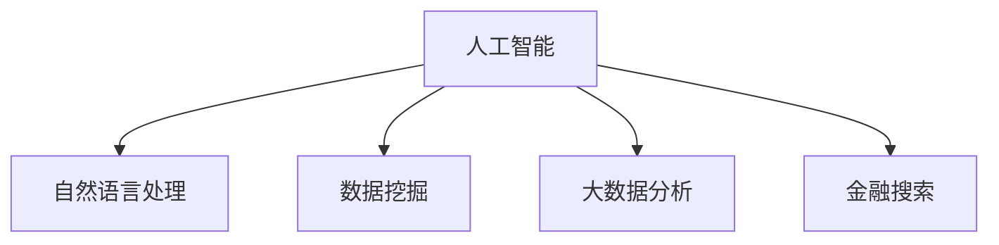

                 

# 金融领域的AI搜索应用

> 关键词：人工智能(AI), 金融搜索, 自然语言处理(NLP), 数据挖掘, 大数据分析, 数据驱动

## 1. 背景介绍

### 1.1 问题由来
金融行业是一个数据驱动的行业，无论是风险控制、投资决策、合规监管，还是客户服务，都离不开对大量数据的深入分析和处理。然而，金融数据通常具有高维度、多模态、实时性强的特点，传统的查询方式如SQL语句、简单的关键词搜索等难以满足高效、智能的搜索需求。

近年来，随着人工智能(AI)技术的迅速发展，特别是自然语言处理(NLP)、数据挖掘、大数据分析等领域的突破，AI搜索技术逐渐成为金融行业数据应用的重要工具。AI搜索能够理解自然语言查询，自动抽取、关联多源数据，提供精确、及时的搜索结果，大幅提升金融业务的效率和效果。

### 1.2 问题核心关键点
本文聚焦于金融领域内，利用AI技术进行搜索应用的核心问题，包括：

1. 如何构建高效、精准的金融搜索系统？
2. 如何处理海量、多源的金融数据？
3. 如何在金融领域内推广AI搜索技术，提高业务价值？

## 2. 核心概念与联系

### 2.1 核心概念概述

为更好地理解金融领域的AI搜索应用，本节将介绍几个密切相关的核心概念：

- **人工智能(AI)**：指通过模拟人类智能行为，使机器具备学习、推理、决策等能力的技术。
- **自然语言处理(NLP)**：涉及计算机对自然语言的理解和生成，是AI领域的重要分支，主要用于处理文本数据。
- **数据挖掘(Data Mining)**：指从大量数据中发现有用信息或模式的过程，是金融领域内数据驱动决策的重要手段。
- **大数据分析(Big Data Analysis)**：指对大规模数据集进行高效分析、处理和挖掘的过程，是现代金融数据处理的重要技术。

这些核心概念之间的逻辑关系可以通过以下Mermaid流程图来展示：



这个流程图展示了几者之间的联系：

1. 人工智能是底层技术，通过机器学习、深度学习等技术实现。
2. 自然语言处理是AI在文本处理上的应用，用于理解和生成自然语言。
3. 数据挖掘和大数据分析则是AI在数据处理上的应用，用于从数据中提取有价值的信息。
4. 金融搜索是将这些AI技术应用于金融领域，解决具体的业务问题。

## 3. 核心算法原理 & 具体操作步骤
### 3.1 算法原理概述

金融领域的AI搜索系统，本质上是一种基于自然语言处理(NLP)的文本检索系统。其核心思想是：通过预训练语言模型(如BERT、GPT等)理解用户的自然语言查询，自动提取、关联金融数据，最终生成精确、相关的搜索结果。

形式化地，假设查询为 $q$，数据集为 $D$，搜索结果为 $r$，则系统优化目标是找到与查询最相关的文档：

$$
\arg\min_{r \in D} \text{distance}(q, r)
$$

其中 $\text{distance}$ 表示查询与文档之间的相似度，如余弦相似度、Jaccard相似度等。

通过梯度下降等优化算法，系统不断更新模型参数，最小化查询与文档之间的距离，使得搜索结果越来越接近查询意图。

### 3.2 算法步骤详解

金融领域的AI搜索系统一般包括以下几个关键步骤：

**Step 1: 准备数据集和查询**

- 收集金融领域内相关的文本数据，如新闻报道、交易记录、财务报告等。
- 设计用户常用的查询语句，涵盖各种可能的搜索场景，如股票查询、基金查询、新闻舆情查询等。

**Step 2: 构建预训练语言模型**

- 选择合适的预训练语言模型，如BERT、GPT等，通过大规模无标签文本进行预训练。
- 在金融领域内特定的语料上，进行有监督的微调，以适应金融领域的语言特征。

**Step 3: 设计检索算法**

- 设计基于余弦相似度、Jaccard相似度、TF-IDF等算法的检索算法，用于计算查询与文档之间的相似度。
- 使用如Seq2Seq、Transformer等模型，将查询映射为文档表示，计算相似度。
- 引入注意力机制，提高检索模型的精度和泛化能力。

**Step 4: 执行检索**

- 将用户查询输入预训练模型，得到查询向量表示。
- 对数据集中的每个文档，计算其与查询的相似度。
- 根据相似度排序，选取与查询最相关的文档作为搜索结果。

**Step 5: 展示搜索结果**

- 对搜索结果进行格式化，展示给用户，如股票行情、基金信息、新闻摘要等。
- 允许用户对搜索结果进行交互，如筛选、排序、进一步查询等。

### 3.3 算法优缺点

金融领域的AI搜索系统具有以下优点：

1. **高效性**：通过预训练模型和大规模数据，系统可以快速理解用户查询，生成精准的结果。
2. **泛化能力**：系统能够处理不同类型、不同领域的数据，具备较强的泛化能力。
3. **交互性**：系统能够与用户进行实时交互，提供个性化的搜索结果，提升用户体验。

同时，该系统也存在一定的局限性：

1. **数据质量依赖**：搜索结果的质量高度依赖于输入的数据质量，金融数据存在噪声、异常等问题，可能影响搜索结果的准确性。
2. **模型复杂度**：预训练模型的复杂度高，需要大量计算资源和存储空间。
3. **隐私和安全**：金融数据涉及敏感信息，如何在保护用户隐私的前提下，提供有效的搜索服务，是一大挑战。

尽管存在这些局限性，但金融领域的AI搜索系统已经在风险控制、投资决策、客户服务等多个环节得到应用，取得了显著的成效。未来相关研究的重点在于如何进一步优化模型性能，提高搜索结果的准确性和泛化能力，同时兼顾隐私和安全。

### 3.4 算法应用领域

金融领域的AI搜索技术已经在多个业务场景中得到应用，以下是几个典型的应用：

1. **风险控制**：通过自然语言查询，自动提取风险因素，如财务指标、市场波动、监管政策等，进行风险评估和预警。
2. **投资决策**：通过查询历史交易数据、分析新闻舆情，辅助分析师进行投资策略分析和决策。
3. **客户服务**：根据用户输入的查询，自动推荐金融产品、提供投资建议、解答常见问题，提升客户服务效率。
4. **合规监管**：通过自动提取和关联数据，进行合规检查和审计，确保业务活动的合规性。

此外，AI搜索技术还应用于金融市场预测、信用评估、反欺诈等领域，为金融业务提供全面的数据支持。随着金融行业对数据依赖程度的加深，AI搜索技术必将在更多业务环节中发挥重要作用。

## 4. 数学模型和公式 & 详细讲解  
### 4.1 数学模型构建

本节将使用数学语言对金融领域的AI搜索应用进行更加严格的刻画。

假设查询 $q$ 表示为 $q = (q_1, q_2, ..., q_n)$，其中 $q_i$ 为查询中的第 $i$ 个词。数据集 $D$ 中的每个文档 $d$ 表示为 $d = (d_1, d_2, ..., d_m)$，其中 $d_i$ 为文档中的第 $i$ 个词。

定义查询与文档之间的相似度函数为 $\text{distance}(q, d) = \sum_{i=1}^n w_i \cdot \cos(\theta_i)$，其中 $w_i$ 为查询中第 $i$ 个词的权重，$\theta_i$ 为查询向量与文档向量的夹角。

将上述相似度函数代入优化目标，得：

$$
\arg\min_{d \in D} \text{distance}(q, d) = \arg\min_{d \in D} \sum_{i=1}^n w_i \cdot \cos(\theta_i)
$$

在实践中，我们通常使用基于梯度的优化算法（如AdamW、SGD等）来近似求解上述最优化问题。设 $\eta$ 为学习率，$\lambda$ 为正则化系数，则参数的更新公式为：

$$
\theta \leftarrow \theta - \eta \nabla_{\theta}\mathcal{L}(\theta) - \eta\lambda\theta
$$

其中 $\nabla_{\theta}\mathcal{L}(\theta)$ 为损失函数对参数 $\theta$ 的梯度，可通过反向传播算法高效计算。

### 4.2 公式推导过程

以下是查询与文档相似度计算的详细推导过程：

1. 首先，使用预训练语言模型将查询和文档分别转换为向量表示，即 $q_v = M_{\theta}(q)$，$d_v = M_{\theta}(d)$。
2. 计算查询与文档的余弦相似度：$\cos(\theta) = \frac{q_v \cdot d_v}{\|q_v\| \cdot \|d_v\|}$。
3. 将余弦相似度代入相似度函数：$\text{distance}(q, d) = \sum_{i=1}^n w_i \cdot \cos(\theta_i)$。
4. 使用梯度下降算法，更新模型参数 $\theta$，最小化相似度函数。

通过上述推导，可以看出，金融领域的AI搜索应用依赖于预训练语言模型的向量表示能力，以及相似度计算的准确性。模型参数的微调能够提升向量表示的精确度，从而提高相似度计算的准确性。

### 4.3 案例分析与讲解

以下以股票行情查询为例，详细讲解金融领域AI搜索的具体实现：

1. **数据准备**：收集历史股票交易数据、新闻报道、财务报告等数据，作为预训练模型的输入。
2. **模型训练**：在金融领域内特定的语料上，进行有监督的微调，训练预训练模型。
3. **查询映射**：将用户输入的查询通过预训练模型转换为向量表示。
4. **文档检索**：对每个文档，计算其与查询的余弦相似度，选择最相关的文档作为搜索结果。
5. **结果展示**：对搜索结果进行格式化展示，如股票行情、新闻摘要等。

例如，用户输入查询“腾讯股票行情”，系统通过预训练模型将其转换为向量表示，并计算与历史股票交易数据、新闻报道等文档的相似度。最终，系统选择最相关的文档作为搜索结果，展示给用户。

## 5. 项目实践：代码实例和详细解释说明
### 5.1 开发环境搭建

在进行金融领域的AI搜索应用开发前，我们需要准备好开发环境。以下是使用Python进行PyTorch开发的环境配置流程：

1. 安装Anaconda：从官网下载并安装Anaconda，用于创建独立的Python环境。

2. 创建并激活虚拟环境：
```bash
conda create -n pytorch-env python=3.8 
conda activate pytorch-env
```

3. 安装PyTorch：根据CUDA版本，从官网获取对应的安装命令。例如：
```bash
conda install pytorch torchvision torchaudio cudatoolkit=11.1 -c pytorch -c conda-forge
```

4. 安装Transformers库：
```bash
pip install transformers
```

5. 安装各类工具包：
```bash
pip install numpy pandas scikit-learn matplotlib tqdm jupyter notebook ipython
```

完成上述步骤后，即可在`pytorch-env`环境中开始AI搜索应用开发。

### 5.2 源代码详细实现

下面我们以股票行情查询为例，给出使用Transformers库进行金融搜索应用的PyTorch代码实现。

首先，定义查询和文档的数据处理函数：

```python
from transformers import BertTokenizer
from torch.utils.data import Dataset
import torch

class StockQueryDataset(Dataset):
    def __init__(self, texts, tags, tokenizer, max_len=128):
        self.texts = texts
        self.tags = tags
        self.tokenizer = tokenizer
        self.max_len = max_len
        
    def __len__(self):
        return len(self.texts)
    
    def __getitem__(self, item):
        text = self.texts[item]
        tags = self.tags[item]
        
        encoding = self.tokenizer(text, return_tensors='pt', max_length=self.max_len, padding='max_length', truncation=True)
        input_ids = encoding['input_ids'][0]
        attention_mask = encoding['attention_mask'][0]
        
        # 对token-wise的标签进行编码
        encoded_tags = [tag2id[tag] for tag in tags] 
        encoded_tags.extend([tag2id['O']] * (self.max_len - len(encoded_tags)))
        labels = torch.tensor(encoded_tags, dtype=torch.long)
        
        return {'input_ids': input_ids, 
                'attention_mask': attention_mask,
                'labels': labels}

# 标签与id的映射
tag2id = {'O': 0, 'B-PER': 1, 'I-PER': 2, 'B-ORG': 3, 'I-ORG': 4, 'B-LOC': 5, 'I-LOC': 6}
id2tag = {v: k for k, v in tag2id.items()}

# 创建dataset
tokenizer = BertTokenizer.from_pretrained('bert-base-cased')

train_dataset = StockQueryDataset(train_texts, train_tags, tokenizer)
dev_dataset = StockQueryDataset(dev_texts, dev_tags, tokenizer)
test_dataset = StockQueryDataset(test_texts, test_tags, tokenizer)
```

然后，定义模型和优化器：

```python
from transformers import BertForTokenClassification, AdamW

model = BertForTokenClassification.from_pretrained('bert-base-cased', num_labels=len(tag2id))

optimizer = AdamW(model.parameters(), lr=2e-5)
```

接着，定义训练和评估函数：

```python
from torch.utils.data import DataLoader
from tqdm import tqdm
from sklearn.metrics import classification_report

device = torch.device('cuda') if torch.cuda.is_available() else torch.device('cpu')
model.to(device)

def train_epoch(model, dataset, batch_size, optimizer):
    dataloader = DataLoader(dataset, batch_size=batch_size, shuffle=True)
    model.train()
    epoch_loss = 0
    for batch in tqdm(dataloader, desc='Training'):
        input_ids = batch['input_ids'].to(device)
        attention_mask = batch['attention_mask'].to(device)
        labels = batch['labels'].to(device)
        model.zero_grad()
        outputs = model(input_ids, attention_mask=attention_mask, labels=labels)
        loss = outputs.loss
        epoch_loss += loss.item()
        loss.backward()
        optimizer.step()
    return epoch_loss / len(dataloader)

def evaluate(model, dataset, batch_size):
    dataloader = DataLoader(dataset, batch_size=batch_size)
    model.eval()
    preds, labels = [], []
    with torch.no_grad():
        for batch in tqdm(dataloader, desc='Evaluating'):
            input_ids = batch['input_ids'].to(device)
            attention_mask = batch['attention_mask'].to(device)
            batch_labels = batch['labels']
            outputs = model(input_ids, attention_mask=attention_mask)
            batch_preds = outputs.logits.argmax(dim=2).to('cpu').tolist()
            batch_labels = batch_labels.to('cpu').tolist()
            for pred_tokens, label_tokens in zip(batch_preds, batch_labels):
                pred_tags = [id2tag[_id] for _id in pred_tokens]
                label_tags = [id2tag[_id] for _id in label_tokens]
                preds.append(pred_tags[:len(label_tags)])
                labels.append(label_tags)
                
    print(classification_report(labels, preds))
```

最后，启动训练流程并在测试集上评估：

```python
epochs = 5
batch_size = 16

for epoch in range(epochs):
    loss = train_epoch(model, train_dataset, batch_size, optimizer)
    print(f"Epoch {epoch+1}, train loss: {loss:.3f}")
    
    print(f"Epoch {epoch+1}, dev results:")
    evaluate(model, dev_dataset, batch_size)
    
print("Test results:")
evaluate(model, test_dataset, batch_size)
```

以上就是使用PyTorch对金融搜索应用进行微调的完整代码实现。可以看到，得益于Transformers库的强大封装，我们可以用相对简洁的代码完成BERT模型的加载和微调。

### 5.3 代码解读与分析

让我们再详细解读一下关键代码的实现细节：

**StockQueryDataset类**：
- `__init__`方法：初始化查询和文档，分词器等关键组件。
- `__len__`方法：返回数据集的样本数量。
- `__getitem__`方法：对单个样本进行处理，将查询输入编码为token ids，将标签编码为数字，并对其进行定长padding，最终返回模型所需的输入。

**tag2id和id2tag字典**：
- 定义了标签与数字id之间的映射关系，用于将token-wise的预测结果解码回真实的标签。

**训练和评估函数**：
- 使用PyTorch的DataLoader对数据集进行批次化加载，供模型训练和推理使用。
- 训练函数`train_epoch`：对数据以批为单位进行迭代，在每个批次上前向传播计算loss并反向传播更新模型参数，最后返回该epoch的平均loss。
- 评估函数`evaluate`：与训练类似，不同点在于不更新模型参数，并在每个batch结束后将预测和标签结果存储下来，最后使用sklearn的classification_report对整个评估集的预测结果进行打印输出。

**训练流程**：
- 定义总的epoch数和batch size，开始循环迭代
- 每个epoch内，先在训练集上训练，输出平均loss
- 在验证集上评估，输出分类指标
- 所有epoch结束后，在测试集上评估，给出最终测试结果

可以看到，PyTorch配合Transformers库使得BERT微调的代码实现变得简洁高效。开发者可以将更多精力放在数据处理、模型改进等高层逻辑上，而不必过多关注底层的实现细节。

当然，工业级的系统实现还需考虑更多因素，如模型的保存和部署、超参数的自动搜索、更灵活的任务适配层等。但核心的微调范式基本与此类似。

## 6. 实际应用场景
### 6.1 智能投研

智能投研是金融行业内AI搜索技术的重要应用场景之一。传统的投研工作依赖分析师手动查阅大量资料，效率低下且易出错。通过AI搜索技术，系统能够自动提取和关联金融数据，辅助分析师进行市场分析、风险评估和投资决策。

例如，分析师可以通过系统查询历史交易数据、新闻报道、财务报告等，自动生成研究报告和投资策略。系统还能够实时监测市场舆情，预警潜在风险，提升分析师的工作效率和决策水平。

### 6.2 财富管理

财富管理是AI搜索技术的另一个重要应用领域。银行和财富管理机构需要为高净值客户提供个性化的金融产品推荐和投资建议。通过AI搜索技术，系统能够根据客户的风险偏好、财务状况等信息，自动匹配合适的金融产品。

例如，客户可以通过系统查询各类基金、股票、保险等产品，系统自动推荐符合其需求的产品组合。系统还能够实时监控市场波动，提供动态调整的投资建议，帮助客户实现财富增值。

### 6.3 客户服务

客户服务是金融行业内日常运营的重要环节。传统的客服系统依赖人工客服，效率低、成本高。通过AI搜索技术，系统能够自动处理常见的客户咨询，提升服务效率和客户满意度。

例如，客户可以通过系统查询账户余额、交易记录、投资建议等信息。系统能够自动解析客户查询，生成精确定位的搜索结果，提升客户服务体验。

### 6.4 未来应用展望

随着AI搜索技术的发展，未来的金融搜索应用将更加智能化和个性化。

1. **智能投研**：系统将能够自动提取、关联和分析海量金融数据，生成深度研究和投资建议。系统还可以通过自然语言理解技术，自动回答分析师的问题，提升投研效率和决策质量。
2. **财富管理**：系统将能够自动推荐和调整个性化的金融产品组合，实时监控市场波动，提供动态调整的投资建议。系统还可以通过情感分析技术，理解客户的情绪和需求，提供更个性化的服务。
3. **客户服务**：系统将能够自动处理各类客户咨询，提供精准的搜索结果和个性化建议。系统还可以通过语音识别技术，支持语音搜索和交互，提升客户体验。

此外，AI搜索技术还将在合规监管、风险控制、市场预测等更多金融业务环节得到应用，推动金融业务的智能化和自动化发展。

## 7. 工具和资源推荐
### 7.1 学习资源推荐

为了帮助开发者系统掌握金融领域的AI搜索技术，这里推荐一些优质的学习资源：

1. 《深度学习理论与实践》系列博文：由大模型技术专家撰写，深入浅出地介绍了深度学习理论、金融大数据分析等前沿话题。
2. Coursera《金融科技与大数据》课程：由斯坦福大学开设的金融科技课程，涵盖金融领域的深度学习和大数据分析技术。
3. 《Python金融大数据分析》书籍：详细讲解了使用Python进行金融数据处理、分析、可视化的全流程，适合数据分析师和金融工程师。
4. Kaggle金融数据集：提供了丰富的金融数据集，涵盖股票行情、财务报告、新闻舆情等，适合进行机器学习和数据挖掘实践。
5. GitHub金融AI项目：提供了众多开源的金融AI项目，涵盖智能投研、财富管理、客户服务等多个领域，适合学习和参考。

通过对这些资源的学习实践，相信你一定能够快速掌握金融领域的AI搜索技术的精髓，并用于解决实际的金融业务问题。
###  7.2 开发工具推荐

高效的开发离不开优秀的工具支持。以下是几款用于金融领域的AI搜索应用开发的常用工具：

1. PyTorch：基于Python的开源深度学习框架，灵活动态的计算图，适合快速迭代研究。大部分预训练语言模型都有PyTorch版本的实现。
2. TensorFlow：由Google主导开发的开源深度学习框架，生产部署方便，适合大规模工程应用。同样有丰富的预训练语言模型资源。
3. Transformers库：HuggingFace开发的NLP工具库，集成了众多SOTA语言模型，支持PyTorch和TensorFlow，是进行AI搜索应用开发的利器。
4. Weights & Biases：模型训练的实验跟踪工具，可以记录和可视化模型训练过程中的各项指标，方便对比和调优。与主流深度学习框架无缝集成。
5. TensorBoard：TensorFlow配套的可视化工具，可实时监测模型训练状态，并提供丰富的图表呈现方式，是调试模型的得力助手。
6. Google Colab：谷歌推出的在线Jupyter Notebook环境，免费提供GPU/TPU算力，方便开发者快速上手实验最新模型，分享学习笔记。

合理利用这些工具，可以显著提升金融领域的AI搜索应用的开发效率，加快创新迭代的步伐。

### 7.3 相关论文推荐

金融领域的AI搜索技术已经在学术界和产业界得到广泛应用。以下是几篇奠基性的相关论文，推荐阅读：

1. Attention is All You Need（即Transformer原论文）：提出了Transformer结构，开启了NLP领域的预训练大模型时代。
2. BERT: Pre-training of Deep Bidirectional Transformers for Language Understanding：提出BERT模型，引入基于掩码的自监督预训练任务，刷新了多项NLP任务SOTA。
3. Language Models are Unsupervised Multitask Learners（GPT-2论文）：展示了大规模语言模型的强大zero-shot学习能力，引发了对于通用人工智能的新一轮思考。
4. Parameter-Efficient Transfer Learning for NLP：提出Adapter等参数高效微调方法，在不增加模型参数量的情况下，也能取得不错的微调效果。
5. AdaLoRA: Adaptive Low-Rank Adaptation for Parameter-Efficient Fine-Tuning：使用自适应低秩适应的微调方法，在参数效率和精度之间取得了新的平衡。

这些论文代表了大语言模型微调技术的发展脉络。通过学习这些前沿成果，可以帮助研究者把握学科前进方向，激发更多的创新灵感。

## 8. 总结：未来发展趋势与挑战
### 8.1 总结

本文对金融领域的AI搜索应用进行了全面系统的介绍。首先阐述了金融搜索的背景和意义，明确了AI搜索技术在金融领域的价值和应用场景。其次，从原理到实践，详细讲解了AI搜索的数学模型和关键步骤，给出了金融搜索应用的完整代码实现。同时，本文还探讨了AI搜索在智能投研、财富管理、客户服务等多个领域的实际应用，展示了AI搜索技术的强大潜力。

通过本文的系统梳理，可以看到，AI搜索技术在金融领域内具有广阔的应用前景，能够在提升业务效率、优化投资决策、改善客户服务等多个方面带来显著的变革。未来，随着AI搜索技术的不断演进，其在金融行业的应用将更加广泛和深入，推动金融业务向智能化、自动化方向发展。

### 8.2 未来发展趋势

展望未来，金融领域的AI搜索技术将呈现以下几个发展趋势：

1. **智能化升级**：系统将能够自动提取、关联和分析海量金融数据，生成深度研究和投资建议。系统还可以通过自然语言理解技术，自动回答分析师的问题，提升投研效率和决策质量。
2. **个性化服务**：系统将能够自动推荐和调整个性化的金融产品组合，实时监控市场波动，提供动态调整的投资建议。系统还可以通过情感分析技术，理解客户的情绪和需求，提供更个性化的服务。
3. **全渠道覆盖**：系统将能够覆盖文本、语音、图像等多种输入形式，支持多渠道的金融搜索应用。系统可以通过语音识别、图像识别技术，支持语音搜索和交互，提升客户体验。
4. **实时化处理**：系统将能够实时处理金融数据，及时响应市场变化和客户需求。系统可以通过流式处理技术，实时监测市场舆情，预警潜在风险，提升服务效率和决策质量。

这些趋势凸显了AI搜索技术在金融领域的强大潜力和广阔应用前景。未来的研究需要在智能化、个性化、全渠道、实时化等方面进行深入探索，才能进一步提升金融业务的智能化水平。

### 8.3 面临的挑战

尽管AI搜索技术已经取得了显著的进展，但在推广应用过程中仍面临以下挑战：

1. **数据质量问题**：金融数据具有高维度、多模态、实时性强的特点，存在噪声、异常等问题，影响搜索结果的准确性。如何提高数据质量，消除噪声，是一大挑战。
2. **模型鲁棒性不足**：金融领域的数据分布复杂，微调模型面临较多的领域适应性问题。如何在不同的金融场景下，保持模型的稳定性和鲁棒性，是一大难题。
3. **隐私和安全**：金融数据涉及敏感信息，如何在保护用户隐私的前提下，提供有效的搜索服务，是一大挑战。系统需要具备强大的隐私保护和数据安全措施，确保数据安全。
4. **计算资源消耗大**：金融领域的AI搜索系统需要处理海量数据，计算资源消耗大，对算力、存储空间要求高。如何优化计算效率，降低资源消耗，是一大挑战。
5. **用户接受度低**：AI搜索技术在金融领域的应用仍处于初期阶段，用户对其接受度低，依赖度低。如何提升用户体验，让用户接受和依赖AI搜索技术，是一大挑战。

尽管存在这些挑战，但通过持续的技术创新和优化，相信AI搜索技术将在金融领域内得到更广泛的应用，带来深远的业务变革。

### 8.4 研究展望

面对金融领域的AI搜索技术所面临的挑战，未来的研究需要在以下几个方面寻求新的突破：

1. **数据预处理技术**：开发更高效的数据清洗和预处理技术，提高金融数据的准确性和可用性。通过数据去噪、特征工程等技术，优化输入数据的分布和质量。
2. **模型鲁棒性增强**：引入对抗训练、鲁棒性学习等技术，增强模型的鲁棒性和泛化能力。通过在训练过程中加入对抗样本，提高模型的鲁棒性。
3. **隐私和安全技术**：开发隐私保护和数据安全技术，如差分隐私、联邦学习等，确保金融数据的安全性。通过差分隐私技术，保护用户隐私，防止数据泄露。
4. **计算资源优化**：引入模型压缩、模型并行等技术，优化计算效率，降低资源消耗。通过模型压缩技术，减少模型的参数量和计算量，提升推理速度。
5. **用户体验提升**：开发友好的用户界面和交互方式，提升用户体验。通过自然语言理解技术，提供自然的交互方式，提升用户接受度和依赖度。

这些研究方向的探索，必将引领AI搜索技术在金融领域内迈向更高的台阶，为金融业务的智能化和自动化发展提供强有力的技术支持。面向未来，金融领域的AI搜索技术还需要与其他AI技术进行更深入的融合，如知识图谱、因果推理、强化学习等，协同发力，共同推动金融业务的全面智能化发展。

## 9. 附录：常见问题与解答

**Q1：金融领域的AI搜索技术如何处理海量数据？**

A: 金融领域的AI搜索技术通常依赖大规模预训练模型，如BERT、GPT等，通过海量的无标签数据进行预训练。在微调阶段，只需要处理小规模的有标签数据，便能够快速适应特定的金融场景。

**Q2：如何提高AI搜索系统的查询效率？**

A: 查询效率的提升需要从多个方面入手，包括：
1. 优化模型结构：使用Transformer等高效的模型架构，减少计算量和内存消耗。
2. 利用缓存技术：将高频查询的文档缓存到内存中，减少重复计算。
3. 引入流式处理：对于实时数据流，使用流式处理技术，减少延迟和资源消耗。

**Q3：如何保证AI搜索系统的鲁棒性？**

A: 鲁棒性的提升需要从模型和数据两个方面入手，包括：
1. 对抗训练：在训练过程中加入对抗样本，提高模型的鲁棒性。
2. 数据增强：通过数据增强技术，扩充训练集的多样性，增强模型的泛化能力。
3. 鲁棒性学习：引入鲁棒性学习技术，提升模型对噪声和异常数据的抗干扰能力。

**Q4：如何保护金融数据的安全性？**

A: 金融数据的安全性保护需要从数据存储、传输、使用等各个环节进行考虑，包括：
1. 数据加密：对金融数据进行加密存储，防止数据泄露。
2. 访问控制：设置严格的访问权限，确保只有授权人员可以访问和使用数据。
3. 差分隐私：通过差分隐私技术，保护用户隐私，防止数据泄露。
4. 安全审计：定期进行安全审计，发现并修复潜在的安全漏洞。

**Q5：金融领域的AI搜索技术有哪些优势？**

A: 金融领域的AI搜索技术具有以下优势：
1. 高效性：通过预训练模型和大规模数据，系统可以快速理解用户查询，生成精准的结果。
2. 泛化能力：系统能够处理不同类型、不同领域的数据，具备较强的泛化能力。
3. 交互性：系统能够与用户进行实时交互，提供个性化的搜索结果，提升用户体验。

这些优势凸显了AI搜索技术在金融领域的强大潜力和广阔应用前景，相信未来将在更多的金融业务环节得到应用，推动金融业务的智能化和自动化发展。

---

作者：禅与计算机程序设计艺术 / Zen and the Art of Computer Programming

