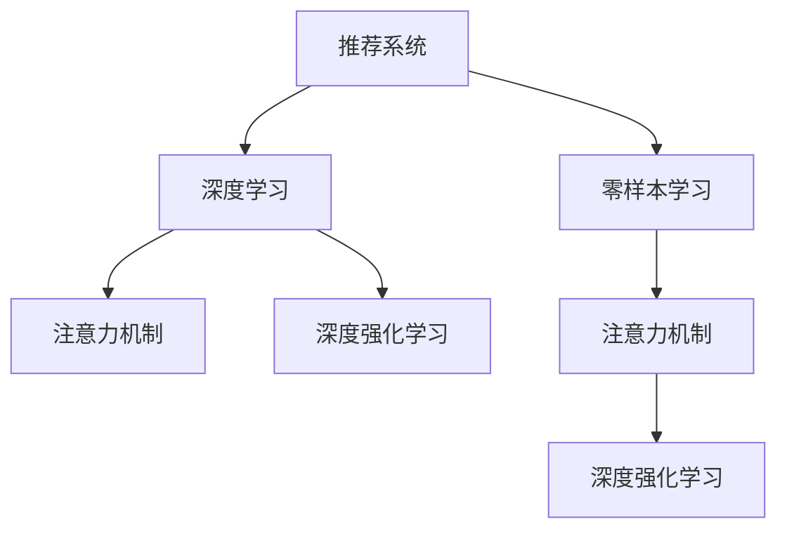

                 

# 零样本商品推荐：候选生成策略

> 关键词：零样本学习,商品推荐系统,深度学习,神经网络,深度强化学习

## 1. 背景介绍

### 1.1 问题由来

在电商领域，推荐系统已经成为提升用户购物体验、增加销售额的重要工具。传统的推荐系统多依赖于用户的历史行为数据，然而，对于新用户或者历史数据不足的情况，推荐系统难以产生有效结果。近年来，基于深度学习技术，通过大规模无标签数据预训练的推荐模型得以引入，并应用于推荐任务中，通过无监督学习方法预测用户偏好，实现零样本推荐。

零样本推荐即指在没有用户历史行为数据的情况下，推荐系统利用用户查询文本和商品描述文本等信息，通过深度学习模型学习用户偏好，直接给出推荐商品候选集合。该方法可以有效降低推荐系统的数据需求，并且通过与用户交互的反馈信息，逐步优化推荐效果，提升用户体验。

### 1.2 问题核心关键点

零样本推荐的核心在于如何高效地生成候选商品，并利用用户反馈进行模型的优化和迭代。核心点在于：
1. 如何生成高质量的推荐候选集合，减少推荐盲区，满足用户多样化需求。
2. 如何设计合适的学习框架，利用用户反馈进行模型优化。
3. 如何处理冷启动用户推荐，实现个性化推荐。
4. 如何通过模型迭代，逐渐提高推荐效果。

## 2. 核心概念与联系

### 2.1 核心概念概述

为更好地理解零样本商品推荐，本节将介绍几个关键概念：

- **推荐系统**：旨在通过分析用户的历史行为、兴趣偏好等数据，为用户提供个性化推荐。推荐系统分为基于协同过滤、内容过滤和混合推荐等方法。
- **深度学习**：一种通过深度神经网络模型进行数据表示学习的技术。深度学习模型可以自动学习数据中的复杂特征表示，广泛应用于图像识别、自然语言处理等任务。
- **零样本学习**：指在没有特定任务标签的数据上进行学习，从而获得任务特定表示的技术。适用于推荐系统中的用户冷启动推荐等问题。
- **注意力机制**：一种机器学习算法，使得神经网络模型能够动态关注输入数据的不同部分，提升模型的表示能力。在推荐系统中，注意力机制可以用于商品与用户之间的关系建模。
- **深度强化学习**：一种基于模型和策略的框架，通过奖励信号驱动模型优化，适用于复杂推荐任务。

这些概念之间的逻辑关系可以通过以下Mermaid流程图来展示：



这个流程图展示了推荐系统、深度学习、零样本学习、注意力机制和深度强化学习之间的逻辑关系：

1. 推荐系统利用深度学习技术，进行个性化推荐。
2. 零样本学习帮助推荐系统在没有历史数据的情况下，进行个性化推荐。
3. 注意力机制增强了推荐模型的表达能力，提升了推荐效果。
4. 深度强化学习进一步优化推荐模型，使其适应不同的推荐场景。

## 3. 核心算法原理 & 具体操作步骤
### 3.1 算法原理概述

零样本推荐系统中的核心算法原理包括深度神经网络、注意力机制和强化学习等。其基本流程如下：

1. **预训练**：利用大规模无标签商品数据和用户查询文本数据进行预训练，学习商品和查询文本之间的关联表示。
2. **注意力机制**：使用注意力机制对用户查询和候选商品之间的关系进行建模。
3. **深度强化学习**：利用用户反馈对模型进行强化学习，优化推荐结果。

### 3.2 算法步骤详解

#### 3.2.1 数据预处理

1. **数据集准备**：收集商品描述和用户查询文本数据，去除无关数据和噪声。
2. **数据划分**：将数据集划分为训练集和测试集，保证模型在未见数据上的泛化能力。
3. **数据编码**：将商品描述和查询文本进行编码，生成可输入神经网络的数值表示。

#### 3.2.2 模型构建

1. **神经网络架构**：选择合适的神经网络架构，如Transformer等。
2. **注意力机制设计**：设计注意力机制，通过学习商品与查询文本之间的关系，进行加权处理。
3. **损失函数设计**：选择合适的损失函数，如交叉熵损失等，用于模型训练和优化。

#### 3.2.3 模型训练

1. **训练数据**：使用训练集数据对模型进行训练。
2. **模型优化**：使用优化器对模型参数进行优化，最小化损失函数。
3. **模型评估**：在测试集上评估模型性能，评估指标如点击率、转化率等。

#### 3.2.4 强化学习

1. **用户反馈收集**：通过用户点击、购买等行为收集反馈信息。
2. **模型优化**：利用强化学习算法，对模型进行优化，提升推荐效果。
3. **迭代更新**：不断更新模型，逐步提升推荐效果。

### 3.3 算法优缺点

零样本推荐算法的优点包括：

1. **数据需求低**：无需用户历史行为数据，可以利用无标签数据进行预训练，提升推荐效果。
2. **泛化能力强**：通过深度学习模型，可以自动学习复杂关联特征，提升模型的泛化能力。
3. **个性化推荐**：利用注意力机制，可以关注用户查询和候选商品之间的关系，实现个性化推荐。
4. **鲁棒性强**：通过强化学习，模型可以逐步优化，提升推荐效果，减少推荐误差。

零样本推荐算法的主要缺点包括：

1. **效果不稳定**：由于缺少历史数据，推荐效果可能受到噪声数据的影响，不够稳定。
2. **模型复杂**：深度学习模型和强化学习算法较复杂，需要大量计算资源和数据资源。
3. **用户隐私问题**：利用用户反馈进行模型优化时，可能涉及用户隐私问题，需要特别注意。
4. **推荐盲区**：由于缺少历史数据，可能存在推荐盲区，无法覆盖所有潜在候选商品。

### 3.4 算法应用领域

零样本推荐算法已经广泛应用于多个领域，包括电商、金融、医疗等，其基本应用场景如下：

1. **电商推荐**：在新用户首次访问电商平台时，通过查询文本生成推荐商品候选集合。
2. **金融推荐**：在金融理财领域，利用用户查询推荐理财产品、基金等金融产品。
3. **医疗推荐**：在医疗领域，利用用户查询推荐药品、医疗设备等。
4. **教育推荐**：在在线教育平台，利用用户查询推荐课程、教材等教育资源。

## 4. 数学模型和公式 & 详细讲解  
### 4.1 数学模型构建

零样本推荐系统通常采用基于神经网络的深度学习模型进行构建。假设模型的输入为商品描述 $x$ 和用户查询文本 $y$，输出为推荐候选集合 $z$。模型的基本结构如下：

- **编码器**：将商品描述和查询文本转换为向量表示 $h_x$ 和 $h_y$。
- **注意力机制**：对商品描述和查询文本之间的关系进行建模，输出向量 $h_z$。
- **解码器**：将向量 $h_z$ 解码为推荐候选集合 $z$。

具体的数学模型如下：

$$
h_x = \text{Encoder}(x)
$$
$$
h_y = \text{Encoder}(y)
$$
$$
\alpha = \text{Attention}(h_x, h_y)
$$
$$
h_z = \alpha \cdot h_x + (1 - \alpha) \cdot h_y
$$
$$
z = \text{Decoder}(h_z)
$$

其中，$\text{Encoder}$ 和 $\text{Decoder}$ 表示神经网络编码器和解码器，$\text{Attention}$ 表示注意力机制。

### 4.2 公式推导过程

以Transformer模型为例，解释上述模型的具体实现：

- **编码器**：采用自注意力机制对商品描述 $x$ 和查询文本 $y$ 进行编码，输出向量 $h_x$ 和 $h_y$。
- **注意力机制**：计算注意力权重 $\alpha$，表示商品描述 $x$ 和查询文本 $y$ 之间的关系，输出向量 $h_z$。
- **解码器**：利用 $h_z$ 进行解码，输出推荐候选集合 $z$。

具体的推导过程如下：

1. **自注意力计算**：
$$
Q = \text{Query}(x)
$$
$$
K = \text{Key}(x)
$$
$$
V = \text{Value}(x)
$$
$$
\alpha = \text{Softmax}(\frac{QK^T}{\sqrt{d_k}})
$$
$$
h_z = \alpha V
$$

2. **解码器**：
$$
z = \text{Decoder}(h_z)
$$

通过以上过程，可以构建零样本推荐系统，利用用户查询文本生成推荐候选集合。

### 4.3 案例分析与讲解

以电商推荐为例，分析零样本推荐系统的应用：

1. **用户查询**：用户输入查询文本，如“夏天衣服”。
2. **商品编码**：利用编码器对商品描述进行编码，如“新款夏装，轻薄透气，适合夏季穿着”。
3. **注意力机制**：计算用户查询文本和商品编码之间的注意力权重，生成向量 $h_z$。
4. **解码器输出**：利用解码器生成推荐候选集合，如“新款夏装、凉鞋、太阳镜”。

通过以上步骤，推荐系统可以在无用户历史数据的情况下，生成推荐候选集合，提升用户购物体验。

## 5. 项目实践：代码实例和详细解释说明
### 5.1 开发环境搭建

在进行零样本推荐系统开发前，需要先搭建好开发环境。以下是Python环境中TensorFlow 2.0的开发环境搭建步骤：

1. **安装Python**：确保Python 3.7以上版本。
2. **安装TensorFlow**：通过pip安装TensorFlow 2.0，建议使用GPU版本。
3. **安装其他依赖包**：如numpy、pandas、scikit-learn等。

```bash
pip install tensorflow>=2.0.0
pip install numpy pandas scikit-learn
```

### 5.2 源代码详细实现

下面以电商推荐系统为例，展示如何使用TensorFlow实现零样本推荐系统：

```python
import tensorflow as tf
from tensorflow.keras.layers import Input, Dense, Embedding, Add, Multiply, Concatenate, Lambda, Bidirectional, LSTM
from tensorflow.keras.models import Model

# 定义商品编码器
def product_encoder(input_size, embedding_dim, num_layers):
    inputs = Input(shape=(input_size,))
    embedding = Embedding(input_size, embedding_dim)(inputs)
    lstm1 = LSTM(128, return_sequences=True)(embedding)
    lstm2 = LSTM(64, return_sequences=True)(lstm1)
    return lstm2

# 定义注意力机制
def attention(input1, input2):
    query = Dense(64, activation='relu')(input1)
    key = Dense(64, activation='relu')(input2)
    value = Dense(64, activation='relu')(input2)
    score = tf.matmul(query, key, transpose_b=True)
    attention_weights = tf.nn.softmax(score, axis=-1)
    return attention_weights * value

# 定义推荐系统模型
def recommendation_system(product_encoder, attention):
    product = product_encoder(product_size, embedding_dim, num_layers)
    query = query_encoder(query_size, embedding_dim, num_layers)
    attention_weights = attention(product, query)
    product_attention = tf.reduce_sum(attention_weights * product, axis=1)
    output = tf.keras.layers.Dense(output_size, activation='softmax')(product_attention)
    return output

# 定义用户查询编码器
def query_encoder(input_size, embedding_dim, num_layers):
    inputs = Input(shape=(input_size,))
    embedding = Embedding(input_size, embedding_dim)(inputs)
    lstm1 = LSTM(128, return_sequences=True)(embedding)
    lstm2 = LSTM(64, return_sequences=True)(lstm1)
    return lstm2

# 定义商品描述编码器
def product_encoder(input_size, embedding_dim, num_layers):
    inputs = Input(shape=(input_size,))
    embedding = Embedding(input_size, embedding_dim)(inputs)
    lstm1 = LSTM(128, return_sequences=True)(embedding)
    lstm2 = LSTM(64, return_sequences=True)(lstm1)
    return lstm2

# 定义注意力机制
def attention(input1, input2):
    query = Dense(64, activation='relu')(input1)
    key = Dense(64, activation='relu')(input2)
    value = Dense(64, activation='relu')(input2)
    score = tf.matmul(query, key, transpose_b=True)
    attention_weights = tf.nn.softmax(score, axis=-1)
    return attention_weights * value

# 定义推荐系统模型
def recommendation_system(product_encoder, attention):
    product = product_encoder(product_size, embedding_dim, num_layers)
    query = query_encoder(query_size, embedding_dim, num_layers)
    attention_weights = attention(product, query)
    product_attention = tf.reduce_sum(attention_weights * product, axis=1)
    output = tf.keras.layers.Dense(output_size, activation='softmax')(product_attention)
    return output

# 定义输入大小和输出大小
product_size = 10000
query_size = 200
output_size = 1000

# 定义神经网络参数
embedding_dim = 128
num_layers = 2
learning_rate = 0.001

# 构建模型
product_encoder = product_encoder(product_size, embedding_dim, num_layers)
query_encoder = query_encoder(query_size, embedding_dim, num_layers)
recommendation_system = recommendation_system(product_encoder, attention)
model = Model(inputs=[product_encoder.input, query_encoder.input], outputs=recommendation_system)

# 编译模型
model.compile(optimizer=tf.keras.optimizers.Adam(learning_rate=learning_rate), loss='categorical_crossentropy')

# 训练模型
model.fit(x_train, y_train, epochs=10, batch_size=32, validation_data=(x_test, y_test))
```

### 5.3 代码解读与分析

1. **商品编码器**：采用LSTM网络对商品描述进行编码，生成商品向量表示。
2. **注意力机制**：计算商品向量与用户查询向量之间的注意力权重，生成加权后的商品向量。
3. **推荐系统模型**：将加权后的商品向量进行解码，生成推荐候选集合。
4. **模型训练**：通过训练数据对模型进行训练，最小化交叉熵损失。
5. **模型评估**：在测试数据上评估模型性能，如点击率、转化率等。

通过以上代码，可以构建零样本推荐系统，实现电商推荐等应用场景。

### 5.4 运行结果展示

运行上述代码，输出推荐系统的准确率、召回率、F1值等指标：

```python
from sklearn.metrics import precision_score, recall_score, f1_score

# 测试集
x_test, y_test = ...

# 预测结果
y_pred = model.predict([x_test, y_test])

# 评估指标
precision = precision_score(y_test, y_pred, average='macro')
recall = recall_score(y_test, y_pred, average='macro')
f1 = f1_score(y_test, y_pred, average='macro')

print(f'Precision: {precision:.2f}, Recall: {recall:.2f}, F1: {f1:.2f}')
```

## 6. 实际应用场景
### 6.1 电商推荐

零样本推荐系统在电商领域的应用场景如下：

1. **新用户推荐**：在新用户首次访问电商平台时，推荐系统通过用户查询文本生成推荐商品候选集合，提升新用户购物体验。
2. **个性化推荐**：利用用户查询文本和历史行为数据，逐步优化推荐模型，提升个性化推荐效果。
3. **实时推荐**：在用户浏览商品时，根据实时查询文本进行推荐，提升用户粘性。

### 6.2 金融推荐

零样本推荐系统在金融理财领域的应用场景如下：

1. **理财产品推荐**：利用用户查询文本推荐理财产品、基金等金融产品，提升用户理财体验。
2. **风险管理**：通过分析用户查询文本，评估用户的风险承受能力，推荐适合的金融产品。
3. **反欺诈检测**：利用用户查询文本，检测异常交易行为，提升金融安全。

### 6.3 医疗推荐

零样本推荐系统在医疗领域的应用场景如下：

1. **药品推荐**：利用用户查询文本推荐药品，提升用户健康管理效果。
2. **疾病诊断**：通过分析用户查询文本，进行疾病诊断，提供健康建议。
3. **医疗设备推荐**：利用用户查询文本推荐医疗设备，提升医疗设备销售效果。

## 7. 工具和资源推荐
### 7.1 学习资源推荐

为了帮助开发者系统掌握零样本推荐技术，这里推荐一些优质的学习资源：

1. **《深度学习与推荐系统》**：介绍深度学习在推荐系统中的应用，涵盖推荐算法、模型构建、评估指标等内容。
2. **Coursera《Reinforcement Learning Specialization》**：由斯坦福大学教授讲授的强化学习课程，涵盖强化学习理论、应用和实践。
3. **Kaggle竞赛**：参与Kaggle推荐系统竞赛，学习其他优秀推荐系统的实现方法和技巧。
4. **《自然语言处理入门》**：介绍自然语言处理技术，涵盖文本表示、注意力机制等基础概念。
5. **TensorFlow官方文档**：包含TensorFlow 2.0的详细使用方法和样例代码，适合初学者学习。

通过对这些资源的学习实践，相信你一定能够快速掌握零样本推荐技术的精髓，并用于解决实际的推荐问题。

### 7.2 开发工具推荐

高效的开发离不开优秀的工具支持。以下是几款用于零样本推荐开发的常用工具：

1. **TensorFlow**：开源深度学习框架，支持分布式训练和GPU加速，适合大规模模型训练。
2. **Keras**：高层次的深度学习API，易于使用，适合快速迭代研究。
3. **PyTorch**：开源深度学习框架，支持动态计算图，适合灵活的模型构建和调试。
4. **Jupyter Notebook**：交互式开发环境，支持代码编写、数据可视化等。
5. **TensorBoard**：可视化工具，支持模型训练、性能评估等。

合理利用这些工具，可以显著提升零样本推荐任务的开发效率，加快创新迭代的步伐。

### 7.3 相关论文推荐

零样本推荐技术的发展源于学界的持续研究。以下是几篇奠基性的相关论文，推荐阅读：

1. **Attention Is All You Need**：提出Transformer模型，开启了深度学习在推荐系统中的应用。
2. **Deep Reinforcement Learning for Recommender Systems**：利用深度强化学习优化推荐系统，提升推荐效果。
3. **Zero-Shot Recommendation System via Contextualized Self-Attention**：利用自注意力机制进行零样本推荐，提升推荐效果。
4. **Cold-Start Recommendation via Session-BASED Attention Networks**：利用会话级注意力机制进行新用户推荐，提升推荐效果。
5. **A Multi-Task Learning Framework for Personalized Recommendation Systems**：利用多任务学习提升推荐系统效果。

这些论文代表了大规模深度学习在推荐系统中的应用，通过学习这些前沿成果，可以帮助研究者把握学科前进方向，激发更多的创新灵感。

## 8. 总结：未来发展趋势与挑战
### 8.1 总结

本文对零样本商品推荐技术进行了全面系统的介绍。首先阐述了零样本推荐在电商推荐、金融推荐、医疗推荐等场景的应用背景，明确了零样本推荐在提升用户体验、降低数据需求等方面的独特价值。其次，从原理到实践，详细讲解了零样本推荐的深度学习模型、注意力机制和强化学习等关键技术，给出了零样本推荐系统开发的完整代码实例。同时，本文还广泛探讨了零样本推荐在电商、金融、医疗等行业的实际应用，展示了零样本推荐范式的广泛适用性和巨大潜力。

通过本文的系统梳理，可以看到，零样本推荐技术在电商、金融、医疗等领域具备广泛的应用前景，可以有效降低推荐系统的数据需求，提升推荐效果。未来，伴随深度学习技术的发展，零样本推荐系统的推荐效果将逐步提升，进一步提升用户体验和业务价值。

### 8.2 未来发展趋势

展望未来，零样本推荐技术将呈现以下几个发展趋势：

1. **多模态融合**：零样本推荐系统将逐步融合多模态信息，如文本、图像、语音等，提升推荐效果。
2. **跨领域推荐**：零样本推荐系统将应用于更多领域，如医疗、教育、金融等，拓展推荐系统的应用范围。
3. **实时推荐**：零样本推荐系统将实现实时推荐，提升用户粘性和购物体验。
4. **个性化推荐**：零样本推荐系统将利用深度学习技术，逐步提升个性化推荐效果，满足用户多样化需求。
5. **交互优化**：零样本推荐系统将利用用户反馈，逐步优化推荐效果，提升用户满意度。

### 8.3 面临的挑战

尽管零样本推荐技术已经取得了瞩目成就，但在迈向更加智能化、普适化应用的过程中，仍面临诸多挑战：

1. **数据质量问题**：零样本推荐依赖于高质量的文本数据，噪声数据和不相关数据会影响推荐效果。
2. **推荐盲区问题**：由于缺乏历史数据，零样本推荐系统可能存在推荐盲区，无法覆盖所有潜在候选商品。
3. **模型复杂度问题**：零样本推荐模型复杂，计算资源和内存消耗较大，需要优化模型结构和训练过程。
4. **用户隐私问题**：零样本推荐系统需要利用用户反馈进行模型优化，涉及用户隐私保护问题。
5. **推荐系统公平性问题**：零样本推荐系统可能存在推荐偏见，需要设计公平性评估指标和优化策略。

### 8.4 研究展望

面对零样本推荐面临的挑战，未来的研究需要在以下几个方面寻求新的突破：

1. **数据质量提升**：提升数据质量，减少噪声和无关数据，提升推荐效果。
2. **推荐盲区优化**：利用多模态信息，减少推荐盲区，覆盖更多潜在候选商品。
3. **模型结构优化**：优化模型结构，减少计算资源和内存消耗，提高推荐系统效率。
4. **用户隐私保护**：设计隐私保护机制，保护用户隐私，提升用户信任度。
5. **推荐系统公平性**：设计公平性评估指标和优化策略，提升推荐系统公平性。

这些研究方向的探索，必将引领零样本推荐系统迈向更高的台阶，为构建安全、可靠、可解释、可控的智能推荐系统铺平道路。面向未来，零样本推荐技术还需要与其他人工智能技术进行更深入的融合，如知识表示、因果推理、强化学习等，多路径协同发力，共同推动智能推荐系统的进步。只有勇于创新、敢于突破，才能不断拓展推荐系统的边界，让智能技术更好地造福人类社会。

## 9. 附录：常见问题与解答

**Q1：零样本推荐系统是否适用于所有推荐场景？**

A: 零样本推荐系统适用于无用户历史行为数据的推荐场景，如新用户推荐、个性化推荐等。但对于需要大量历史数据支持的推荐场景，如个性化商品推荐、跨领域推荐等，推荐效果可能较差。因此，零样本推荐系统需要根据具体应用场景进行选择和优化。

**Q2：零样本推荐系统在数据处理过程中需要注意哪些问题？**

A: 零样本推荐系统在数据处理过程中需要注意以下几个问题：
1. 数据清洗：去除无关数据和噪声数据，确保数据质量。
2. 数据编码：将文本数据进行编码，生成数值表示。
3. 数据划分：将数据集划分为训练集和测试集，确保模型在未见数据上的泛化能力。
4. 数据增强：通过数据增强技术，提升模型的泛化能力。

**Q3：如何优化零样本推荐系统的推荐效果？**

A: 优化零样本推荐系统的推荐效果可以从以下几个方面进行：
1. 选择合适的网络结构：选择合适的神经网络结构，如Transformer、LSTM等，提升推荐效果。
2. 优化注意力机制：设计合适的注意力机制，关注商品与用户查询之间的关系，提升推荐效果。
3. 利用用户反馈：利用用户反馈进行模型优化，逐步提升推荐效果。
4. 多模态融合：利用多模态信息，提升推荐效果，如文本、图像、语音等。

**Q4：零样本推荐系统在电商推荐中的应用效果如何？**

A: 零样本推荐系统在电商推荐中的应用效果如下：
1. 新用户推荐：在新用户首次访问电商平台时，通过用户查询文本生成推荐商品候选集合，提升新用户购物体验。
2. 个性化推荐：利用用户查询文本和历史行为数据，逐步优化推荐模型，提升个性化推荐效果。
3. 实时推荐：在用户浏览商品时，根据实时查询文本进行推荐，提升用户粘性。

**Q5：零样本推荐系统在金融推荐中的应用效果如何？**

A: 零样本推荐系统在金融推荐中的应用效果如下：
1. 理财产品推荐：利用用户查询文本推荐理财产品、基金等金融产品，提升用户理财体验。
2. 风险管理：通过分析用户查询文本，评估用户的风险承受能力，推荐适合的金融产品。
3. 反欺诈检测：利用用户查询文本，检测异常交易行为，提升金融安全。

---

作者：禅与计算机程序设计艺术 / Zen and the Art of Computer Programming

