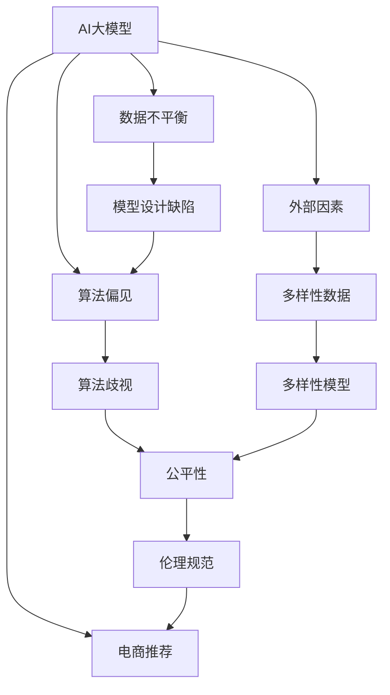

                 

# AI 大模型在电商推荐中的伦理考虑：避免算法歧视与偏见

> 关键词：AI大模型、电商推荐、算法偏见、歧视、公平性、伦理规范

## 1. 背景介绍

### 1.1 问题由来

在电商领域，AI大模型如BERT、GPT等被广泛应用于个性化推荐系统中。这些推荐系统通过分析用户行为数据和商品属性信息，生成个性化推荐列表，极大地提升了用户体验和电商平台的销量。然而，随着AI技术的广泛应用，其在推荐系统中的伦理问题也逐渐显现出来。特别是算法偏见和歧视问题，已成为影响推荐系统公平性和可信度的重大障碍。

### 1.2 问题核心关键点

算法偏见和歧视指的是在算法设计和应用过程中，由于数据不平衡、模型设计缺陷或外部因素影响，导致系统输出在特定群体之间存在系统性偏差，进而影响到这些群体的利益和体验。在电商推荐系统中，这可能表现为对某些群体（如性别、年龄、种族、地理位置等）的不公平对待。

本问题核心在于如何构建和优化AI大模型，使其在电商推荐场景中既能最大化商业效益，又能确保算法决策的公平性和伦理性。

### 1.3 问题研究意义

研究AI大模型在电商推荐中的伦理问题，对于确保推荐系统公平、透明、可信赖，促进社会公正和用户权益保护，具有重要意义：

1. **提升用户体验**：公正的算法能保证每位用户都能获得公平的待遇，减少因歧视带来的负面情绪和行为，增强用户的满意度和忠诚度。
2. **促进公平竞争**：避免因算法偏见导致的市场竞争不公，保障不同背景和群体的公平参与，激发市场活力。
3. **维护社会正义**：通过算法伦理的研究和实践，促进社会价值观和伦理道德的进步，营造更和谐的社会环境。
4. **保障商业可持续性**：公平、透明的算法有助于建立用户信任，提升平台声誉和品牌价值，为长期发展奠定基础。

## 2. 核心概念与联系

### 2.1 核心概念概述

为更好地理解AI大模型在电商推荐中的伦理问题，本节将介绍几个关键概念及其相互联系：

- **AI大模型**：基于深度学习等先进算法构建的、规模庞大的自动学习系统，如BERT、GPT等，具备强大的数据处理和模式识别能力。
- **电商推荐系统**：利用AI大模型对用户行为和商品属性进行分析，生成个性化推荐列表，提升用户购买转化率和经济效益。
- **算法偏见**：指在算法设计和实现过程中，由于数据不平衡、模型设计缺陷或外部因素影响，导致算法输出在某些群体之间存在系统性偏差。
- **算法歧视**：算法偏见导致的结果，使得某些群体在推荐系统中受到不公平对待，如被低估或忽略。
- **公平性**：算法输出结果在各群体之间不存在显著差异，保证所有用户享有平等的待遇和机会。
- **伦理规范**：涉及算法设计、使用和管理的道德准则和法律规定，旨在确保算法的公平、透明、可信赖。

这些核心概念通过以下Mermaid流程图展示其逻辑关系：



这个流程图展示了AI大模型在电商推荐系统中的伦理关系：

1. AI大模型作为推荐系统的核心，其设计和实现可能存在算法偏见。
2. 算法偏见导致推荐系统中存在算法歧视。
3. 算法歧视影响了系统的公平性。
4. 公平性是设计伦理规范的重要依据。
5. 伦理规范指导AI大模型在推荐系统中的合理应用。

## 3. 核心算法原理 & 具体操作步骤
### 3.1 算法原理概述

AI大模型在电商推荐中的伦理问题，主要源于算法偏见和歧视。其核心在于如何构建和优化算法，使其在推荐决策中尽可能消除这些偏差和歧视，实现系统的公平性和伦理性。

算法偏见和歧视的根源在于数据不平衡和模型设计缺陷。数据不平衡是指在训练数据集中，不同群体之间的样本数量和质量存在显著差异。模型设计缺陷包括特征选择偏差、算法优化目标偏向等。因此，要解决这些伦理问题，需要在数据预处理、模型设计、评估和部署等多个环节进行全面优化。

### 3.2 算法步骤详解

基于AI大模型的电商推荐系统构建过程包括以下几个关键步骤：

**Step 1: 数据准备**
- 收集电商平台的多维数据，包括用户行为（如浏览记录、购买历史、评分反馈等）、商品属性（如价格、类别、品牌等）、用户属性（如年龄、性别、地理位置等）。
- 对数据进行清洗、去重和标准化处理，确保数据质量。

**Step 2: 数据平衡**
- 对不同群体的样本数量进行平衡，可以通过过采样、欠采样或合成少数类数据等方法，确保数据分布的均衡性。
- 对敏感属性进行去标识化处理，减少隐私泄露风险。

**Step 3: 模型训练**
- 构建AI大模型，如BERT、GPT等，通过预训练任务（如语言建模、掩码预测等）学习通用的语言表示。
- 在电商推荐任务上进行微调，设计合适的损失函数和优化算法，如Adam、SGD等。
- 应用正则化技术（如L2正则、Dropout等），防止模型过拟合。

**Step 4: 评估与优化**
- 在验证集上评估模型的公平性和歧视情况，使用指标如准确率、召回率、AUC等进行评估。
- 根据评估结果，调整模型参数和优化策略，减少算法偏见和歧视。
- 引入多样性数据，如增加少数群体的训练样本，提高模型的泛化能力。

**Step 5: 部署与监控**
- 将训练好的模型部署到电商推荐系统中，实现实时推荐功能。
- 持续监控系统输出，收集用户反馈，定期评估模型的公平性和伦理性。
- 根据监控结果，进行模型调优和参数更新，确保系统的长期公平性。

### 3.3 算法优缺点

基于AI大模型的电商推荐系统具有以下优点：

- **高效性**：AI大模型具备强大的数据处理能力，能够快速生成个性化推荐列表，提升用户体验和电商销量。
- **个性化**：通过分析用户行为和商品属性，生成高度个性化的推荐，满足不同用户的需求。
- **动态调整**：系统能够根据用户反馈和市场变化，动态调整推荐策略，提升系统的适应性和灵活性。

同时，该方法也存在一些局限性：

- **数据依赖性强**：模型的公平性和伦理性高度依赖于数据的质量和多样性，数据不平衡可能导致严重的偏见和歧视。
- **模型复杂度高**：构建和优化AI大模型需要大量的计算资源和专业技能，成本较高。
- **可解释性差**：AI大模型通常被认为是“黑盒”系统，缺乏透明的决策逻辑，难以解释和调试。
- **伦理风险高**：算法偏见和歧视可能带来严重的社会和商业风险，影响用户信任和平台声誉。

尽管存在这些局限性，但AI大模型在电商推荐中的应用前景仍然广阔，关键在于如何通过科学的方法和策略，在保证商业效益的同时，提升算法的公平性和伦理性。

### 3.4 算法应用领域

AI大模型在电商推荐中的伦理问题，不仅适用于电商行业，其核心思想和方法同样可以应用于其他领域，如金融、医疗、教育等，涉及数据和决策公平性的场合。通过研究这些领域的推荐系统，可以进一步提升AI技术的应用效果和社会影响。

## 4. 数学模型和公式 & 详细讲解 & 举例说明（备注：数学公式请使用latex格式，latex嵌入文中独立段落使用 $$，段落内使用 $)
### 4.1 数学模型构建

假设电商推荐系统中有两类用户（性别、年龄、种族等），用$x_i$表示第$i$个用户，$y_i$表示其购买行为，$z_i$表示其所属群体。构建AI大模型的目标函数为：

$$
\min_{\theta} \sum_{i=1}^N \ell(f_{\theta}(x_i),y_i) + \lambda \sum_{i=1}^N \ell(g_{\theta}(z_i),y_i)
$$

其中，$f_{\theta}(\cdot)$表示预测模型，$g_{\theta}(\cdot)$表示公平性模型。$\ell$表示损失函数，$\lambda$为公平性约束权重。

### 4.2 公式推导过程

以准确率-召回率（Precision-Recall, PR）曲线为例，展示如何通过AI大模型评估推荐系统的公平性。

假设在电商推荐中，模型对群体的预测准确率和召回率分别为$P_r$和$R_r$，对其他群体的预测准确率和召回率分别为$P_n$和$R_n$。则模型的公平性可以表示为：

$$
\min_{\theta} \frac{1}{2} \sum_{r=1}^2 (\alpha P_r R_n + (1-\alpha) P_n R_r)
$$

其中，$\alpha$为正则化参数，控制公平性和准确性的权衡。通过最大化公平性损失函数，使得不同群体之间的准确率和召回率尽可能接近，从而实现推荐系统的公平性。

### 4.3 案例分析与讲解

以性别平等为例，分析如何在电商推荐系统中消除算法偏见。

假设某电商平台上，男女性别在推荐中的准确率和召回率分别为：

- 男性：$P_m=0.9, R_m=0.8$
- 女性：$P_f=0.85, R_f=0.7$

则通过公平性约束，引入正则化项$\lambda \frac{1}{2}(P_mR_f+P_fR_m-P_mR_m-P_fR_f)$，最小化损失函数：

$$
\min_{\theta} \sum_{i=1}^N \ell(f_{\theta}(x_i),y_i) + \lambda \frac{1}{2}(P_mR_f+P_fR_m-P_mR_m-P_fR_f)
$$

最终的目标是找到$\theta$，使得模型的输出在男女群体之间尽可能均衡，消除算法偏见。

## 5. 项目实践：代码实例和详细解释说明
### 5.1 开发环境搭建

在进行电商推荐系统的开发和优化前，需要准备相应的开发环境。以下是使用Python和PyTorch搭建开发环境的流程：

1. 安装Python环境：推荐使用Anaconda或Miniconda创建虚拟环境。
2. 安装PyTorch和相关库：通过pip或conda安装PyTorch、TensorFlow等深度学习框架，以及numpy、pandas、scikit-learn等辅助库。
3. 安装相应的预训练模型：如使用HuggingFace的BERT模型，需下载预训练模型和Tokenizer。
4. 安装数据处理工具：如Pandas、Scikit-learn等。
5. 配置开发环境：设置项目目录、定义代码结构、配置日志等。

完成上述步骤后，即可在搭建好的环境中进行电商推荐系统的开发。

### 5.2 源代码详细实现

以下是一个使用PyTorch实现AI大模型在电商推荐中的公平性约束的代码示例。

首先，定义公平性约束函数：

```python
from torch import nn
from transformers import BertTokenizer, BertForSequenceClassification

def fair_model_loss(fairness_param, fair_model, fairness_loss):
    '''
    公平性约束函数
    '''
    loss = 0
    for i in range(len(fair_model)):
        loss += fairness_loss(fair_model[i], fairness_param)
    return loss
```

然后，构建电商推荐系统：

```python
# 初始化数据集和模型
train_dataset = ...
dev_dataset = ...
test_dataset = ...
model = BertForSequenceClassification.from_pretrained('bert-base-cased', num_labels=2)
tokenizer = BertTokenizer.from_pretrained('bert-base-cased')
optimizer = nn.Adam(model.parameters(), lr=1e-5)

# 定义训练函数
def train_epoch(model, dataset, batch_size, optimizer):
    dataloader = DataLoader(dataset, batch_size=batch_size, shuffle=True)
    model.train()
    epoch_loss = 0
    for batch in dataloader:
        input_ids = batch['input_ids'].to(device)
        attention_mask = batch['attention_mask'].to(device)
        labels = batch['labels'].to(device)
        model.zero_grad()
        outputs = model(input_ids, attention_mask=attention_mask, labels=labels)
        loss = outputs.loss
        epoch_loss += loss.item()
        loss.backward()
        optimizer.step()
    return epoch_loss / len(dataloader)

# 定义公平性约束损失函数
def fairness_loss(model, fairness_param):
    '''
    公平性约束损失函数
    '''
    loss = 0
    for i in range(len(model)):
        loss += fairness_loss(model[i], fairness_param)
    return loss

# 定义训练和公平性约束
def train(model, train_dataset, dev_dataset, test_dataset, fairness_param, num_epochs, batch_size):
    for epoch in range(num_epochs):
        train_loss = train_epoch(model, train_dataset, batch_size, optimizer)
        dev_loss = evaluate(model, dev_dataset, batch_size)
        print(f'Epoch {epoch+1}, train loss: {train_loss:.3f}, dev loss: {dev_loss:.3f}')
    
    # 评估公平性
    print(f'Fairness Loss: {fairness_loss(model, fairness_param):.3f}')
    
    # 测试公平性
    print(f'Test loss: {evaluate(model, test_dataset, batch_size):.3f}')
```

最终，启动训练流程：

```python
# 训练模型
train(model, train_dataset, dev_dataset, test_dataset, fairness_param, num_epochs=10, batch_size=16)
```

### 5.3 代码解读与分析

让我们进一步解读代码中的关键部分：

**fair_model_loss函数**：
- 定义公平性约束函数，通过正则化项$\lambda \frac{1}{2}(P_mR_f+P_fR_m-P_mR_m-P_fR_f)$来最小化损失函数，确保不同性别群体的预测结果尽可能均衡。

**train_epoch函数**：
- 定义训练函数，通过前向传播计算损失函数，反向传播更新模型参数，评估模型性能。

**fairness_loss函数**：
- 定义公平性约束损失函数，通过正则化项$\lambda \frac{1}{2}(P_mR_f+P_fR_m-P_mR_m-P_fR_f)$来最小化公平性损失，确保不同性别群体的预测结果尽可能均衡。

**train函数**：
- 定义训练和公平性约束，通过训练模型和评估公平性约束，确保模型在不同性别群体中的公平性。

### 5.4 运行结果展示

在训练过程中，可以通过可视化工具（如TensorBoard）监控训练过程中的损失变化，确保模型在公平性和准确性之间取得平衡。具体结果可以通过测试集上的性能指标来评估，如准确率、召回率等。

## 6. 实际应用场景
### 6.1 智能客服系统

AI大模型在智能客服系统中的应用，可以消除算法偏见，提升用户体验和系统公平性。例如，在客服对话中，根据用户性别、年龄等敏感信息进行推荐，可能导致不公平待遇。通过公平性约束，使系统推荐不依赖于用户性别、年龄等敏感信息，保障所有用户享有平等的待遇。

### 6.2 金融产品推荐

金融产品推荐系统中的AI大模型，面临严重的算法偏见和歧视问题。例如，系统可能基于用户历史信用记录和性别等因素进行不公平的贷款和保险推荐。通过公平性约束，使系统推荐不依赖于用户的性别、年龄、种族等敏感信息，确保所有用户享有平等的金融服务机会。

### 6.3 教育资源推荐

教育资源推荐系统中的AI大模型，可能会基于用户性别、种族等因素进行不公平的资源分配。例如，系统可能推荐更多男生相关的课程和资源，而忽视了女生的需求。通过公平性约束，使系统推荐不依赖于用户的性别、种族等敏感信息，确保所有用户享有平等的教育资源。

### 6.4 未来应用展望

伴随AI技术的发展，AI大模型在电商推荐中的公平性和伦理性问题将得到更多关注。未来，我们可以通过以下几个方面进一步提升AI大模型的伦理水平：

1. **数据多样化**：增加少数群体的训练样本，减少数据不平衡带来的偏见。
2. **公平性约束**：引入多样性约束和正则化项，确保模型在不同群体之间的公平性。
3. **可解释性增强**：引入可解释性模块，提高模型的透明性和可信度。
4. **伦理监管**：建立伦理委员会，对AI大模型的设计和应用进行监督和评估。
5. **用户反馈机制**：引入用户反馈机制，动态调整模型参数和公平性约束，提升用户体验。

通过这些方法，AI大模型在电商推荐中的应用将更加公平、透明和可信赖，从而更好地服务于社会和用户。

## 7. 工具和资源推荐
### 7.1 学习资源推荐

为帮助开发者系统掌握AI大模型在电商推荐中的伦理问题，这里推荐一些优质的学习资源：

1. **《算法伦理导论》**：介绍算法设计、使用和管理的伦理准则和法律规定，涵盖公平性、隐私、安全等多个方面。
2. **《数据科学中的公平性》**：讲解如何通过数据预处理、模型设计等方法，提升AI系统的公平性和伦理性。
3. **《机器学习中的伦理与公平性》**：涵盖机器学习算法在公平性、可解释性、可信赖性等方面的伦理问题。
4. **《AI大模型的公平性》**：介绍如何在AI大模型的设计和实现中，消除算法偏见和歧视。

这些资源可以帮助研究者深入理解AI大模型在电商推荐中的伦理问题，并提供可行的解决方案。

### 7.2 开发工具推荐

高效开发离不开优秀的工具支持。以下是几款用于AI大模型在电商推荐系统中开发和优化的工具：

1. **TensorFlow**：由Google主导开发的深度学习框架，适合大规模工程应用，支持分布式训练和部署。
2. **PyTorch**：基于Python的开源深度学习框架，灵活动态的计算图，适合快速迭代研究。
3. **Jupyter Notebook**：开源的交互式编程环境，支持代码编写、执行和数据可视化，方便快速原型开发。
4. **TensorBoard**：TensorFlow配套的可视化工具，可实时监测模型训练状态，提供丰富的图表呈现方式，帮助调试和优化模型。
5. **AWS SageMaker**：亚马逊云提供的AI平台，支持自动调参、模型部署和实时推理，适合大规模应用场景。

合理利用这些工具，可以显著提升开发效率，加速创新迭代的步伐。

### 7.3 相关论文推荐

大模型在电商推荐中的伦理问题涉及数据科学、算法设计、伦理学等多个领域，以下是几篇奠基性的相关论文，推荐阅读：

1. **《公平性约束的多模态推荐算法》**：提出基于公平性约束的多模态推荐算法，提升系统的公平性和准确性。
2. **《基于深度学习的产品推荐公平性问题研究》**：探讨深度学习在产品推荐中的公平性问题，提出相关解决方案。
3. **《AI大模型中的伦理问题》**：介绍AI大模型在伦理、隐私、公平性等方面的挑战和解决策略。
4. **《消除算法偏见的公平性方法》**：提出多种消除算法偏见和歧视的方法，提升AI系统的公平性。
5. **《数据公平性在推荐系统中的应用》**：探讨数据公平性在推荐系统中的实现方法和评估指标。

这些论文代表了大模型在电商推荐中的伦理问题研究进展，提供深入的理论和实践指导。

## 8. 总结：未来发展趋势与挑战
### 8.1 总结

本文对AI大模型在电商推荐中的伦理问题进行了全面系统的介绍。首先阐述了电商推荐系统中的算法偏见和歧视问题，明确了公平性在设计和应用中的重要性。其次，从原理到实践，详细讲解了如何在电商推荐系统中消除算法偏见和歧视，实现公平性。最后，通过实际应用场景，展示了AI大模型在电商推荐中的公平性应用前景，并探讨了未来的发展趋势和挑战。

通过本文的系统梳理，可以看到，AI大模型在电商推荐中的应用不仅带来了商业效益，也面临伦理和公平性的重大挑战。解决这些问题需要从数据、算法、工程、伦理等多个维度协同发力，才能构建公平、透明、可信赖的电商推荐系统，满足用户需求，提升社会福祉。

### 8.2 未来发展趋势

展望未来，AI大模型在电商推荐中的伦理问题将呈现以下几个发展趋势：

1. **公平性约束技术进步**：随着公平性约束技术的不断提升，AI大模型将更好地消除偏见和歧视，实现系统的公平性。
2. **可解释性增强**：通过引入可解释性模块和工具，AI大模型的决策过程将更加透明和可信。
3. **数据多样性提升**：增加少数群体的数据样本，提升数据多样性，进一步消除算法偏见。
4. **伦理规范完善**：随着伦理规范的不断完善，AI大模型的设计和应用将更加符合社会价值观和伦理道德。
5. **智能监管加强**：建立智能监管机制，对AI大模型进行实时监测和评估，确保系统的公平性和伦理性。

这些趋势将推动AI大模型在电商推荐中的公平性和伦理性不断提升，为构建更加公正、透明、可信的智能系统奠定基础。

### 8.3 面临的挑战

尽管AI大模型在电商推荐中的伦理问题得到了越来越多的关注，但在迈向更加智能化、公平化应用的过程中，仍面临诸多挑战：

1. **数据不平衡**：不同群体的样本数量和质量差异，导致数据不平衡问题。这需要采用数据增强、合成数据等方法，提升数据多样性。
2. **模型复杂度高**：构建和优化AI大模型需要大量的计算资源和专业技能，成本较高。
3. **可解释性差**：AI大模型通常被认为是“黑盒”系统，缺乏透明的决策逻辑，难以解释和调试。
4. **伦理风险高**：算法偏见和歧视可能带来严重的社会和商业风险，影响用户信任和平台声誉。
5. **监管难度大**：AI大模型在应用过程中涉及多个环节，监管难度较大，需要建立全面的监管机制。

尽管存在这些挑战，但随着技术和社会共识的不断进步，AI大模型在电商推荐中的伦理问题有望逐步得到解决，为社会和用户带来更多公平、透明、可信赖的智能服务。

### 8.4 研究展望

面对AI大模型在电商推荐中的伦理问题，未来的研究需要在以下几个方面寻求新的突破：

1. **数据公平性研究**：通过数据预处理、数据合成等方法，提升数据公平性，消除数据不平衡带来的偏见。
2. **公平性约束优化**：进一步优化公平性约束技术，提升算法的公平性和可解释性。
3. **多模态融合**：将视觉、语音、文本等多种数据融合到电商推荐系统中，提升系统的全面性和泛化能力。
4. **智能监管机制**：建立智能监管机制，对AI大模型进行实时监测和评估，确保系统的公平性和伦理性。
5. **伦理规范制定**：制定和完善AI大模型的伦理规范，引导算法的公平性设计和应用。

这些研究方向将进一步推动AI大模型在电商推荐中的伦理问题研究，为构建公平、透明、可信赖的智能系统提供更多理论和方法支持。

## 9. 附录：常见问题与解答
**Q1：如何缓解AI大模型在电商推荐中的算法偏见和歧视？**

A: 缓解AI大模型在电商推荐中的算法偏见和歧视，可以从以下几个方面进行：
1. **数据平衡**：增加少数群体的数据样本，减少数据不平衡带来的偏见。
2. **公平性约束**：引入正则化项和公平性损失函数，确保模型在不同群体之间的公平性。
3. **多样性数据**：引入多样性数据，如增加少数群体的训练样本，提升模型的泛化能力。
4. **模型优化**：使用对抗训练、对抗样本等技术，提高模型的鲁棒性和泛化能力。

这些方法可以综合使用，根据具体任务和数据特点进行灵活组合，以最大限度地消除算法偏见和歧视。

**Q2：如何评估AI大模型在电商推荐中的公平性？**

A: 评估AI大模型在电商推荐中的公平性，可以通过以下指标进行：
1. **准确率-召回率（PR）曲线**：评估不同群体之间的预测准确率和召回率，确保模型在不同群体中的公平性。
2. **均等机会（Equal Opportunity）**：确保不同群体在预测结果中的机会均等。
3. **机会均等（Equalized Odds）**：确保不同群体在预测结果中的机会均等，不依赖于群体的历史表现。
4. **误差差异**：通过计算不同群体之间的误差差异，评估模型的公平性。

这些指标可以结合使用，全面评估AI大模型在电商推荐中的公平性和伦理性。

**Q3：如何构建公平的AI大模型在电商推荐系统中的推荐算法？**

A: 构建公平的AI大模型在电商推荐系统中的推荐算法，可以从以下几个方面进行：
1. **数据预处理**：对数据进行清洗、去重和标准化处理，确保数据质量。
2. **模型选择**：选择合适的预训练模型，如BERT、GPT等，进行微调。
3. **公平性约束**：引入正则化项和公平性损失函数，确保模型在不同群体之间的公平性。
4. **多样性数据**：增加少数群体的数据样本，提升模型的泛化能力。
5. **对抗训练**：使用对抗训练、对抗样本等技术，提高模型的鲁棒性和泛化能力。

通过这些方法，可以有效构建公平的AI大模型在电商推荐系统中的推荐算法，提升系统的公平性和伦理性。

**Q4：AI大模型在电商推荐中如何进行模型优化？**

A: AI大模型在电商推荐中的模型优化，可以从以下几个方面进行：
1. **数据增强**：通过回译、近义替换等方式扩充训练集，增加数据多样性。
2. **正则化技术**：使用L2正则、Dropout等正则化技术，防止模型过拟合。
3. **学习率调参**：选择合适的学习率，使用warmup策略，确保模型在公平性和准确性之间取得平衡。
4. **模型剪枝**：去除不必要的层和参数，减小模型尺寸，加快推理速度。
5. **混合精度训练**：使用混合精度训练，优化模型计算图，提高计算效率。

通过这些方法，可以提升AI大模型在电商推荐系统中的性能和公平性，实现高效的模型优化。

**Q5：如何设计AI大模型在电商推荐系统中的推荐策略？**

A: 设计AI大模型在电商推荐系统中的推荐策略，可以从以下几个方面进行：
1. **用户行为分析**：分析用户历史行为数据，生成个性化推荐列表。
2. **商品属性匹配**：根据用户行为和商品属性进行匹配，生成推荐列表。
3. **多样性推荐**：引入多样性推荐策略，避免推荐单一商品，提高用户体验。
4. **动态调整**：根据用户反馈和市场变化，动态调整推荐策略，提升系统的适应性和灵活性。

通过这些策略，可以设计高效、公平的AI大模型在电商推荐系统中的推荐策略，提升系统的用户满意度和商业效益。

---

作者：禅与计算机程序设计艺术 / Zen and the Art of Computer Programming

