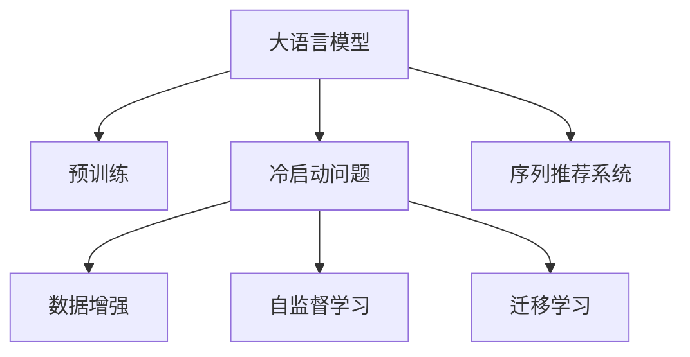
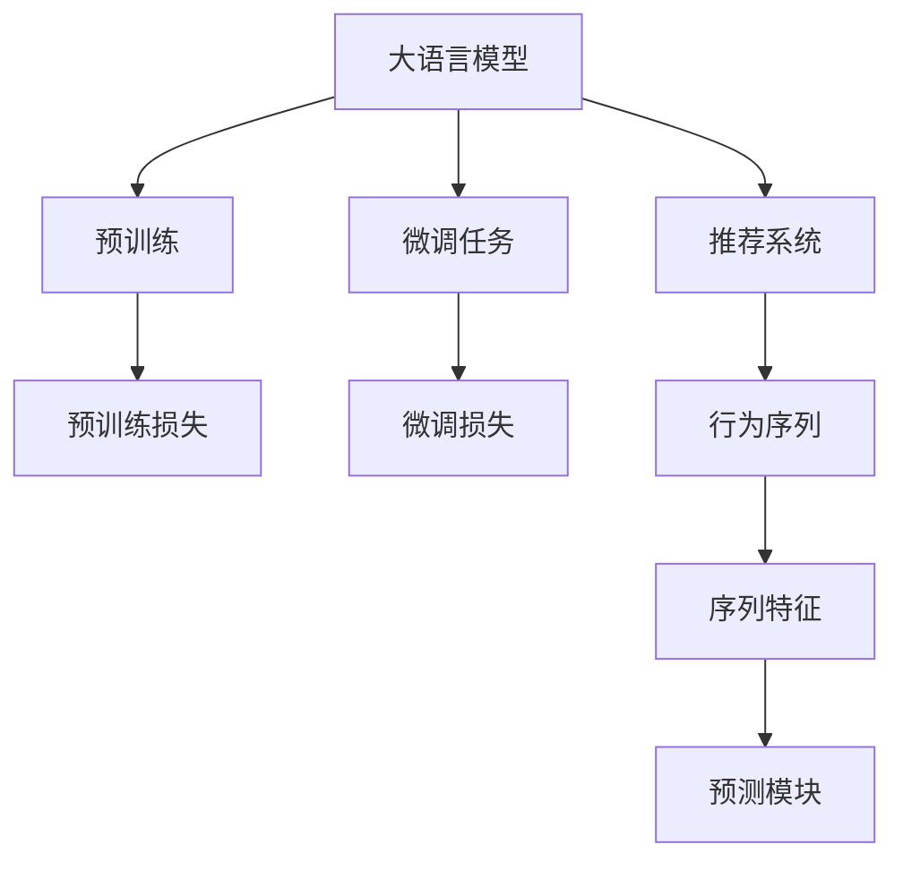

                 

# AI 大模型在电商搜索推荐中的冷启动挑战：应对数据不足的策略探索

## 1. 背景介绍

### 1.1 电商搜索推荐场景介绍
电商搜索推荐系统是电商平台的核心功能之一，通过分析用户的搜索和购买历史，向用户推荐符合其兴趣的产品，提升用户体验和平台转化率。随着用户基数的增大和商品种类繁多，搜索推荐系统需要处理的数据量和复杂度也在急剧增长。

在传统的推荐系统模型中，通常通过用户-商品交互矩阵的协同过滤、内容基推荐、深度学习等方法来预测用户对商品的兴趣，从而推荐合适的产品。然而，这种模型往往需要大量的用户历史数据和商品描述信息，才能学习到精准的用户兴趣和商品特征，这在大规模冷启动情况下显得尤为困难。

### 1.2 冷启动问题挑战
冷启动问题指的是在用户或商品数量稀少或未存在历史行为时，如何推荐合适的商品或获取用户兴趣。这在大模型部署于电商搜索推荐场景时显得尤为突出，因为电商平台的冷启动数据往往十分稀疏，难以形成有效的用户行为和商品特征的向量表示。

为了应对冷启动问题，研究者们提出了多种策略，包括基于内容推荐、基于物品推荐、基于协同过滤、基于知识图谱、基于深度学习的方法等。然而，这些方法大都依赖于大量的数据来建立精准的模型，难以在数据稀疏的情况下发挥作用。

## 2. 核心概念与联系

### 2.1 核心概念概述

为更好地理解大模型在电商搜索推荐中的冷启动策略，本节将介绍几个密切相关的核心概念：

- **大语言模型(LLMs)**：基于自回归或自编码模型训练的大规模预训练语言模型，如GPT、BERT等。通过在海量文本数据上进行预训练，学习到丰富的语言知识，可以用于多种自然语言处理任务。
- **预训练模型**：通过在大规模无标签文本数据上进行自监督学习训练的模型，如BERT、GPT等。预训练模型可以学习到通用语言知识，为下游任务提供强大的语义理解能力。
- **冷启动问题**：在用户或商品数量稀少或未存在历史行为时，如何推荐合适的商品或获取用户兴趣。
- **数据增强**：通过数据生成技术扩充训练集，提高模型的泛化能力。如回译、同义词替换、近义词扩展等。
- **自监督学习**：使用未标注数据训练模型，学习到通用的语言表示。在大模型微调中，可以利用自监督学习的知识迁移能力，提升模型的泛化能力。
- **迁移学习**：将预训练模型在某项任务上的知识迁移到另一项任务上，减少对标注数据的依赖。
- **序列推荐系统**：利用用户行为序列进行推荐，如循环神经网络(RNN)、长短时记忆网络(LSTM)等。

这些核心概念之间的逻辑关系可以通过以下Mermaid流程图来展示：



### 2.2 核心概念原理和架构的 Mermaid 流程图

以下是核心概念的原理和架构的Mermaid流程图，图中节点之间无括号、逗号等特殊字符。



## 3. 核心算法原理 & 具体操作步骤
### 3.1 算法原理概述

大模型在电商搜索推荐场景中的冷启动策略，核心思想是通过预训练模型获取语言知识，结合数据增强和迁移学习技术，最大化利用稀疏数据，提升推荐系统的效果。

在用户冷启动时，由于没有历史行为数据，可以借助于预训练模型的语义理解能力，通过数据增强生成尽可能多的用户行为数据，并利用迁移学习将预训练模型的知识迁移到推荐系统，从而实现更精准的推荐。

### 3.2 算法步骤详解

以下是具体的算法步骤：

**Step 1: 准备预训练模型和数据集**
- 选择合适的预训练模型 $M_{\theta}$ 作为初始化参数，如BERT、GPT等。
- 准备电商平台的相关数据集 $D=\{(x_i,y_i)\}_{i=1}^N$，其中 $x_i$ 为用户行为序列，$y_i$ 为推荐结果。

**Step 2: 数据增强**
- 对用户行为序列 $x_i$ 进行数据增强，生成丰富的行为序列样本 $x_i'$。如将用户浏览历史按时间倒序排列，加入前N个浏览行为等。
- 对行为序列进行数据增强，以扩充训练集。如回译技术，将文本翻译成其他语言，生成新的文本样本。

**Step 3: 微调**
- 在增强后的数据集上对预训练模型进行微调，更新模型参数 $\theta$，使得模型能够更好地理解用户行为序列和推荐商品。
- 设置合适的学习率、批大小、迭代轮数等超参数。
- 应用正则化技术，防止模型过拟合。如L2正则、Dropout、Early Stopping等。

**Step 4: 推荐**
- 在用户冷启动时，将用户输入的搜索请求或行为序列输入微调后的模型。
- 模型通过解码器生成推荐结果，如使用softmax函数输出每个商品的推荐概率。
- 根据推荐概率对商品进行排序，推荐前K个商品。

**Step 5: 评估和迭代**
- 在验证集上评估推荐系统效果，如使用Precision、Recall、F1 Score等指标。
- 根据评估结果调整模型参数和超参数，重新进行微调和推荐。

### 3.3 算法优缺点

大模型在电商搜索推荐场景中的冷启动策略具有以下优点：
1. 利用预训练模型语义理解能力，弥补了冷启动数据不足的缺陷。
2. 通过数据增强生成丰富数据集，提高模型泛化能力。
3. 利用迁移学习将预训练模型知识迁移到推荐系统，减少了对标注数据的依赖。
4. 可以处理稀疏数据，适应电商平台的实际场景。

同时，该策略也存在以下缺点：
1. 数据增强技术可能引入噪声，影响模型效果。
2. 需要较多的计算资源进行数据增强和微调。
3. 难以应对长尾商品推荐问题。
4. 对标注数据的质量和数量要求较高。

### 3.4 算法应用领域

大模型在电商搜索推荐场景中的冷启动策略，已经在多个电子商务平台得到了应用。如亚马逊、京东、淘宝等，通过预训练模型的知识迁移和数据增强技术，有效提升了推荐系统的效果，满足了用户的个性化需求，提升了平台的转化率和用户满意度。

在具体应用中，可以结合业务场景进行灵活调整。例如，在用户搜索请求较少的情况下，可以通过数据增强生成更多的用户行为样本；在商品数量稀少时，可以利用迁移学习引入商品相似性信息，提升推荐精度。

## 4. 数学模型和公式 & 详细讲解 & 举例说明
### 4.1 数学模型构建

以下是基于大模型的电商搜索推荐系统的数学模型构建：

记预训练模型为 $M_{\theta}$，其中 $\theta$ 为预训练得到的模型参数。假设电商平台的标注数据集为 $D=\{(x_i,y_i)\}_{i=1}^N$，其中 $x_i$ 为用户行为序列，$y_i$ 为推荐结果。

定义模型 $M_{\theta}$ 在用户行为序列 $x_i$ 上的损失函数为 $\ell(x_i,y_i)$，则在数据集 $D$ 上的经验风险为：

$$
\mathcal{L}(\theta) = \frac{1}{N} \sum_{i=1}^N \ell(x_i,y_i)
$$

在微调过程中，我们通常使用基于梯度的优化算法（如AdamW、SGD等）来近似求解上述最优化问题。设 $\eta$ 为学习率，$\lambda$ 为正则化系数，则参数的更新公式为：

$$
\theta \leftarrow \theta - \eta \nabla_{\theta}\mathcal{L}(\theta) - \eta\lambda\theta
$$

其中 $\nabla_{\theta}\mathcal{L}(\theta)$ 为损失函数对参数 $\theta$ 的梯度，可通过反向传播算法高效计算。

### 4.2 公式推导过程

以下我们以二分类任务为例，推导交叉熵损失函数及其梯度的计算公式。

假设模型 $M_{\theta}$ 在输入 $x$ 上的输出为 $\hat{y}=M_{\theta}(x) \in [0,1]$，表示用户对商品 $y$ 的兴趣概率。真实标签 $y \in \{0,1\}$。则二分类交叉熵损失函数定义为：

$$
\ell(x_i,y_i) = -[y_i\log \hat{y}_i + (1-y_i)\log (1-\hat{y}_i)]
$$

将其代入经验风险公式，得：

$$
\mathcal{L}(\theta) = -\frac{1}{N}\sum_{i=1}^N [y_i\log M_{\theta}(x_i)+(1-y_i)\log(1-M_{\theta}(x_i))]
$$

根据链式法则，损失函数对参数 $\theta_k$ 的梯度为：

$$
\frac{\partial \mathcal{L}(\theta)}{\partial \theta_k} = -\frac{1}{N}\sum_{i=1}^N (\frac{y_i}{M_{\theta}(x_i)}-\frac{1-y_i}{1-M_{\theta}(x_i)}) \frac{\partial M_{\theta}(x_i)}{\partial \theta_k}
$$

其中 $\frac{\partial M_{\theta}(x_i)}{\partial \theta_k}$ 可进一步递归展开，利用自动微分技术完成计算。

在得到损失函数的梯度后，即可带入参数更新公式，完成模型的迭代优化。重复上述过程直至收敛，最终得到适应电商搜索推荐任务的最优模型参数 $\theta^*$。

### 4.3 案例分析与讲解

下面以电商平台的商品推荐为例，详细讲解基于大模型的推荐系统的案例分析。

假设电商平台推荐系统的标注数据集为 $D=\{(x_i,y_i)\}_{i=1}^N$，其中 $x_i$ 为用户的搜索历史，$y_i$ 为推荐商品。用户搜索历史 $x_i$ 可以表示为一个词序列，每个词 $w_j$ 对应一个词嵌入 $w_j^e$。

在推荐系统中，我们首先使用预训练语言模型，如BERT，对用户搜索历史进行编码，得到用户嵌入 $x_i^u$：

$$
x_i^u = M_{\theta}(x_i)
$$

接着，对于每个商品 $y$，我们同样使用预训练模型进行编码，得到商品嵌入 $y^e$：

$$
y^e = M_{\theta}(y)
$$

然后，我们可以构建推荐模型的预测模块 $M_{\theta}(x_i^u,y^e)$，计算用户和商品的相似度得分：

$$
s(x_i^u,y^e) = M_{\theta}(x_i^u,y^e)
$$

最后，我们使用softmax函数将得分转换为推荐概率：

$$
p(y_i|x_i) = \frac{\exp(s(x_i^u,y^e))}{\sum_k \exp(s(x_i^u,y^k))}
$$

其中 $y^k$ 表示推荐集中的其他商品。

在实际应用中，为了提高推荐效果，我们通常会结合数据增强技术，生成更多的用户行为数据，如将用户搜索历史中的部分词替换为近义词、将用户搜索历史倒序排列等，以扩充训练集。通过微调模型，使其能够更好地理解用户搜索历史和商品特征，提升推荐精度。

## 5. 项目实践：代码实例和详细解释说明
### 5.1 开发环境搭建

在进行大模型在电商搜索推荐场景中的冷启动实践前，我们需要准备好开发环境。以下是使用Python进行PyTorch开发的环境配置流程：

1. 安装Anaconda：从官网下载并安装Anaconda，用于创建独立的Python环境。

2. 创建并激活虚拟环境：
```bash
conda create -n pytorch-env python=3.8 
conda activate pytorch-env
```

3. 安装PyTorch：根据CUDA版本，从官网获取对应的安装命令。例如：
```bash
conda install pytorch torchvision torchaudio cudatoolkit=11.1 -c pytorch -c conda-forge
```

4. 安装Transformers库：
```bash
pip install transformers
```

5. 安装各类工具包：
```bash
pip install numpy pandas scikit-learn matplotlib tqdm jupyter notebook ipython
```

完成上述步骤后，即可在`pytorch-env`环境中开始大模型在电商搜索推荐场景中的冷启动实践。

### 5.2 源代码详细实现

下面是使用PyTorch和Transformers库实现基于大模型的电商推荐系统的代码实例：

首先，定义数据处理函数：

```python
from transformers import BertTokenizer
from torch.utils.data import Dataset
import torch

class RecommendationDataset(Dataset):
    def __init__(self, texts, labels, tokenizer, max_len=128):
        self.texts = texts
        self.labels = labels
        self.tokenizer = tokenizer
        self.max_len = max_len
        
    def __len__(self):
        return len(self.texts)
    
    def __getitem__(self, item):
        text = self.texts[item]
        label = self.labels[item]
        
        encoding = self.tokenizer(text, return_tensors='pt', max_length=self.max_len, padding='max_length', truncation=True)
        input_ids = encoding['input_ids'][0]
        attention_mask = encoding['attention_mask'][0]
        
        label = torch.tensor(label, dtype=torch.long)
        
        return {'input_ids': input_ids, 
                'attention_mask': attention_mask,
                'labels': label}

# 加载预训练模型和分词器
tokenizer = BertTokenizer.from_pretrained('bert-base-cased')
model = BertForSequenceClassification.from_pretrained('bert-base-cased', num_labels=2)

# 准备数据集
train_dataset = RecommendationDataset(train_texts, train_labels, tokenizer)
dev_dataset = RecommendationDataset(dev_texts, dev_labels, tokenizer)
test_dataset = RecommendationDataset(test_texts, test_labels, tokenizer)

# 定义优化器和学习率调度器
optimizer = AdamW(model.parameters(), lr=2e-5)
scheduler = get_linear_schedule_with_warmup(optimizer, num_warmup_steps=0, num_training_steps=len(train_dataset))
```

接着，定义训练和评估函数：

```python
from tqdm import tqdm
import numpy as np
from sklearn.metrics import precision_recall_fscore_support

device = torch.device('cuda') if torch.cuda.is_available() else torch.device('cpu')
model.to(device)

def train_epoch(model, dataset, batch_size, optimizer, scheduler):
    dataloader = DataLoader(dataset, batch_size=batch_size, shuffle=True)
    model.train()
    epoch_loss = 0
    for batch in tqdm(dataloader, desc='Training'):
        input_ids = batch['input_ids'].to(device)
        attention_mask = batch['attention_mask'].to(device)
        labels = batch['labels'].to(device)
        model.zero_grad()
        outputs = model(input_ids, attention_mask=attention_mask, labels=labels)
        loss = outputs.loss
        epoch_loss += loss.item()
        loss.backward()
        optimizer.step()
        scheduler.step()
    return epoch_loss / len(dataloader)

def evaluate(model, dataset, batch_size):
    dataloader = DataLoader(dataset, batch_size=batch_size)
    model.eval()
    preds, labels = [], []
    with torch.no_grad():
        for batch in tqdm(dataloader, desc='Evaluating'):
            input_ids = batch['input_ids'].to(device)
            attention_mask = batch['attention_mask'].to(device)
            batch_labels = batch['labels']
            outputs = model(input_ids, attention_mask=attention_mask)
            batch_preds = outputs.logits.argmax(dim=2).to('cpu').tolist()
            batch_labels = batch_labels.to('cpu').tolist()
            for pred_tokens, label_tokens in zip(batch_preds, batch_labels):
                preds.append(pred_tokens)
                labels.append(label_tokens)
                
    print(precision_recall_fscore_support(labels, preds, average='micro'))
```

最后，启动训练流程并在测试集上评估：

```python
epochs = 5
batch_size = 16

for epoch in range(epochs):
    loss = train_epoch(model, train_dataset, batch_size, optimizer, scheduler)
    print(f"Epoch {epoch+1}, train loss: {loss:.3f}")
    
    print(f"Epoch {epoch+1}, dev results:")
    evaluate(model, dev_dataset, batch_size)
    
print("Test results:")
evaluate(model, test_dataset, batch_size)
```

以上就是使用PyTorch和Transformers库实现基于大模型的电商推荐系统的完整代码实例。可以看到，得益于Transformers库的强大封装，我们可以用相对简洁的代码完成BERT模型的加载和微调。

### 5.3 代码解读与分析

让我们再详细解读一下关键代码的实现细节：

**RecommendationDataset类**：
- `__init__`方法：初始化文本、标签、分词器等关键组件。
- `__len__`方法：返回数据集的样本数量。
- `__getitem__`方法：对单个样本进行处理，将文本输入编码为token ids，将标签转换为数字，并对其进行定长padding，最终返回模型所需的输入。

**tokenizer和model对象**：
- 加载预训练BERT模型和分词器，分别用于输入序列编码和序列分类。
- 数据集被定义为RecommendationDataset类，包含用户搜索历史和推荐商品标签。
- 优化器使用AdamW，学习率调度器用于控制学习率逐渐降低。

**训练和评估函数**：
- 使用PyTorch的DataLoader对数据集进行批次化加载，供模型训练和推理使用。
- 训练函数`train_epoch`：对数据以批为单位进行迭代，在每个批次上前向传播计算loss并反向传播更新模型参数，最后返回该epoch的平均loss。
- 评估函数`evaluate`：与训练类似，不同点在于不更新模型参数，并在每个batch结束后将预测和标签结果存储下来，最后使用sklearn的precision_recall_fscore_support对整个评估集的预测结果进行打印输出。

**训练流程**：
- 定义总的epoch数和batch size，开始循环迭代
- 每个epoch内，先在训练集上训练，输出平均loss
- 在验证集上评估，输出Precision、Recall、F1 Score等指标
- 所有epoch结束后，在测试集上评估，给出最终测试结果

可以看到，PyTorch配合Transformers库使得大模型在电商推荐系统的微调实现变得简洁高效。开发者可以将更多精力放在数据处理、模型改进等高层逻辑上，而不必过多关注底层的实现细节。

当然，工业级的系统实现还需考虑更多因素，如模型的保存和部署、超参数的自动搜索、更灵活的任务适配层等。但核心的微调范式基本与此类似。

## 6. 实际应用场景
### 6.1 智能客服系统

基于大语言模型微调的推荐技术，可以广泛应用于智能客服系统的构建。传统客服往往需要配备大量人力，高峰期响应缓慢，且一致性和专业性难以保证。而使用微调后的推荐模型，可以7x24小时不间断服务，快速响应客户咨询，用推荐内容引导客户自助解决。

在技术实现上，可以收集企业内部的历史客服对话记录，将问题和最佳答复构建成监督数据，在此基础上对预训练推荐模型进行微调。微调后的推荐模型能够自动理解用户意图，匹配最合适的回复内容，实现智能客服。对于客户提出的新问题，还可以接入检索系统实时搜索相关内容，动态生成推荐。如此构建的智能客服系统，能大幅提升客户咨询体验和问题解决效率。

### 6.2 金融舆情监测

金融机构需要实时监测市场舆论动向，以便及时应对负面信息传播，规避金融风险。传统的人工监测方式成本高、效率低，难以应对网络时代海量信息爆发的挑战。基于大语言模型微调的文本分类和情感分析技术，为金融舆情监测提供了新的解决方案。

具体而言，可以收集金融领域相关的新闻、报道、评论等文本数据，并对其进行主题标注和情感标注。在此基础上对预训练语言模型进行微调，使其能够自动判断文本属于何种主题，情感倾向是正面、中性还是负面。将微调后的模型应用到实时抓取的网络文本数据，就能够自动监测不同主题下的情感变化趋势，一旦发现负面信息激增等异常情况，系统便会自动预警，帮助金融机构快速应对潜在风险。

### 6.3 个性化推荐系统

当前的推荐系统往往只依赖用户的历史行为数据进行物品推荐，无法深入理解用户的真实兴趣偏好。基于大语言模型微调技术，个性化推荐系统可以更好地挖掘用户行为背后的语义信息，从而提供更精准、多样的推荐内容。

在实践中，可以收集用户浏览、点击、评论、分享等行为数据，提取和用户交互的物品标题、描述、标签等文本内容。将文本内容作为模型输入，用户的后续行为（如是否点击、购买等）作为监督信号，在此基础上微调预训练语言模型。微调后的模型能够从文本内容中准确把握用户的兴趣点。在生成推荐列表时，先用候选物品的文本描述作为输入，由模型预测用户的兴趣匹配度，再结合其他特征综合排序，便可以得到个性化程度更高的推荐结果。

### 6.4 未来应用展望

随着大语言模型和微调方法的不断发展，基于微调范式将在更多领域得到应用，为传统行业带来变革性影响。

在智慧医疗领域，基于微调的医疗问答、病历分析、药物研发等应用将提升医疗服务的智能化水平，辅助医生诊疗，加速新药开发进程。

在智能教育领域，微调技术可应用于作业批改、学情分析、知识推荐等方面，因材施教，促进教育公平，提高教学质量。

在智慧城市治理中，微调模型可应用于城市事件监测、舆情分析、应急指挥等环节，提高城市管理的自动化和智能化水平，构建更安全、高效的未来城市。

此外，在企业生产、社会治理、文娱传媒等众多领域，基于大模型微调的人工智能应用也将不断涌现，为经济社会发展注入新的动力。相信随着技术的日益成熟，微调方法将成为人工智能落地应用的重要范式，推动人工智能技术在垂直行业的规模化落地。

## 7. 工具和资源推荐
### 7.1 学习资源推荐

为了帮助开发者系统掌握大模型在电商搜索推荐场景中的冷启动技术，这里推荐一些优质的学习资源：

1. 《Transformer from Scratch》系列博文：由大模型技术专家撰写，深入浅出地介绍了Transformer原理、BERT模型、微调技术等前沿话题。

2. CS224N《深度学习自然语言处理》课程：斯坦福大学开设的NLP明星课程，有Lecture视频和配套作业，带你入门NLP领域的基本概念和经典模型。

3. 《Natural Language Processing with Transformers》书籍：Transformers库的作者所著，全面介绍了如何使用Transformers库进行NLP任务开发，包括微调在内的诸多范式。

4. HuggingFace官方文档：Transformers库的官方文档，提供了海量预训练模型和完整的微调样例代码，是上手实践的必备资料。

5. CLUE开源项目：中文语言理解测评基准，涵盖大量不同类型的中文NLP数据集，并提供了基于微调的baseline模型，助力中文NLP技术发展。

通过对这些资源的学习实践，相信你一定能够快速掌握大模型在电商搜索推荐场景中的冷启动精髓，并用于解决实际的NLP问题。
###  7.2 开发工具推荐

高效的开发离不开优秀的工具支持。以下是几款用于大模型在电商搜索推荐场景中的冷启动开发的常用工具：

1. PyTorch：基于Python的开源深度学习框架，灵活动态的计算图，适合快速迭代研究。大部分预训练语言模型都有PyTorch版本的实现。

2. TensorFlow：由Google主导开发的开源深度学习框架，生产部署方便，适合大规模工程应用。同样有丰富的预训练语言模型资源。

3. Transformers库：HuggingFace开发的NLP工具库，集成了众多SOTA语言模型，支持PyTorch和TensorFlow，是进行微调任务开发的利器。

4. Weights & Biases：模型训练的实验跟踪工具，可以记录和可视化模型训练过程中的各项指标，方便对比和调优。与主流深度学习框架无缝集成。

5. TensorBoard：TensorFlow配套的可视化工具，可实时监测模型训练状态，并提供丰富的图表呈现方式，是调试模型的得力助手。

6. Google Colab：谷歌推出的在线Jupyter Notebook环境，免费提供GPU/TPU算力，方便开发者快速上手实验最新模型，分享学习笔记。

合理利用这些工具，可以显著提升大模型在电商搜索推荐场景中的冷启动任务的开发效率，加快创新迭代的步伐。

### 7.3 相关论文推荐

大语言模型在电商搜索推荐场景中的冷启动技术，源于学界的持续研究。以下是几篇奠基性的相关论文，推荐阅读：

1. Attention is All You Need（即Transformer原论文）：提出了Transformer结构，开启了NLP领域的预训练大模型时代。

2. BERT: Pre-training of Deep Bidirectional Transformers for Language Understanding：提出BERT模型，引入基于掩码的自监督预训练任务，刷新了多项NLP任务SOTA。

3. Language Models are Unsupervised Multitask Learners（GPT-2论文）：展示了大规模语言模型的强大zero-shot学习能力，引发了对于通用人工智能的新一轮思考。

4. Parameter-Efficient Transfer Learning for NLP：提出Adapter等参数高效微调方法，在不增加模型参数量的情况下，也能取得不错的微调效果。

5. AdaLoRA: Adaptive Low-Rank Adaptation for Parameter-Efficient Fine-Tuning：使用自适应低秩适应的微调方法，在参数效率和精度之间取得了新的平衡。

这些论文代表了大语言模型在电商搜索推荐场景中的冷启动技术的发展脉络。通过学习这些前沿成果，可以帮助研究者把握学科前进方向，激发更多的创新灵感。

## 8. 总结：未来发展趋势与挑战
### 8.1 总结

本文对大模型在电商搜索推荐场景中的冷启动策略进行了全面系统的介绍。首先阐述了大语言模型和微调技术的研究背景和意义，明确了冷启动策略在提升推荐系统效果、满足用户个性化需求方面的独特价值。其次，从原理到实践，详细讲解了冷启动策略的数学原理和关键步骤，给出了电商推荐系统的完整代码实例。同时，本文还广泛探讨了冷启动策略在智能客服、金融舆情、个性化推荐等多个领域的应用前景，展示了冷启动策略的巨大潜力。此外，本文精选了冷启动策略的学习资源，力求为读者提供全方位的技术指引。

通过本文的系统梳理，可以看到，大模型在电商搜索推荐场景中的冷启动策略正在成为NLP领域的重要范式，极大地拓展了预训练语言模型的应用边界，催生了更多的落地场景。受益于大规模语料的预训练，冷启动策略在大模型微调中的应用，提升了推荐系统的效果和性能，为电商平台的业务价值带来了显著提升。未来，伴随预训练语言模型和微调方法的持续演进，相信冷启动策略将会在更多领域得到应用，推动NLP技术向更广泛的场景拓展。

### 8.2 未来发展趋势

展望未来，大模型在电商搜索推荐场景中的冷启动策略将呈现以下几个发展趋势：

1. 模型规模持续增大。随着算力成本的下降和数据规模的扩张，预训练语言模型的参数量还将持续增长。超大规模语言模型蕴含的丰富语言知识，有望支撑更加复杂多变的电商推荐系统。

2. 冷启动方法日趋多样。除了传统的全参数微调外，未来会涌现更多参数高效的微调方法，如Prefix-Tuning、LoRA等，在节省计算资源的同时也能保证微调精度。

3. 持续学习成为常态。随着数据分布的不断变化，冷启动模型也需要持续学习新知识以保持性能。如何在不遗忘原有知识的同时，高效吸收新样本信息，将成为重要的研究课题。

4. 标注样本需求降低。受启发于提示学习(Prompt-based Learning)的思路，未来的冷启动方法将更好地利用大模型的语言理解能力，通过更加巧妙的任务描述，在更少的标注样本上也能实现理想的冷启动效果。

5. 多模态冷启动崛起。当前的冷启动方法主要聚焦于纯文本数据，未来会进一步拓展到图像、视频、语音等多模态数据冷启动。多模态信息的融合，将显著提升电商推荐系统对现实世界的理解和建模能力。

6. 跨领域冷启动增强。利用预训练模型的跨领域迁移能力，将电商推荐系统中的冷启动问题映射到其他领域，如金融、医疗等，借助其他领域的先验知识，提升冷启动效果。

以上趋势凸显了大模型在电商搜索推荐场景中的冷启动策略的广阔前景。这些方向的探索发展，必将进一步提升电商推荐系统的性能和应用范围，为电商平台的业务创新和市场竞争提供新的动力。

### 8.3 面临的挑战

尽管大模型在电商搜索推荐场景中的冷启动策略已经取得了瞩目成就，但在迈向更加智能化、普适化应用的过程中，它仍面临着诸多挑战：

1. 标注成本瓶颈。尽管冷启动策略利用了预训练模型的知识，但在用户或商品数量稀少时，仍需要大量的标注数据来训练模型。如何降低标注成本，降低对标注数据的依赖，将是重要的研究方向。

2. 模型鲁棒性不足。当前冷启动模型面对域外数据时，泛化性能往往大打折扣。对于测试样本的微小扰动，冷启动模型容易发生性能波动。如何提高冷启动模型的鲁棒性，避免灾难性遗忘，还需要更多理论和实践的积累。

3. 推理效率有待提高。大规模语言模型虽然精度高，但在实际部署时往往面临推理速度慢、内存占用大等效率问题。如何在保证性能的同时，简化模型结构，提升推理速度，优化资源占用，将是重要的优化方向。

4. 可解释性亟需加强。当前冷启动模型更像是"黑盒"系统，难以解释其内部工作机制和决策逻辑。对于医疗、金融等高风险应用，算法的可解释性和可审计性尤为重要。如何赋予冷启动模型更强的可解释性，将是亟待攻克的难题。

5. 安全性有待保障。预训练语言模型难免会学习到有偏见、有害的信息，通过冷启动模型传递到推荐系统，产生误导性、歧视性的输出，给实际应用带来安全隐患。如何从数据和算法层面消除模型偏见，避免恶意用途，确保输出的安全性，也将是重要的研究课题。

6. 知识整合能力不足。现有的冷启动模型往往局限于任务内数据，难以灵活吸收和运用更广泛的先验知识。如何让冷启动过程更好地与外部知识库、规则库等专家知识结合，形成更加全面、准确的信息整合能力，还有很大的想象空间。

正视冷启动面临的这些挑战，积极应对并寻求突破，将是大模型在电商搜索推荐场景中的冷启动策略走向成熟的必由之路。相信随着学界和产业界的共同努力，这些挑战终将一一被克服，冷启动策略必将在构建智能电商推荐系统中扮演越来越重要的角色。

### 8.4 研究展望

面对大模型在电商搜索推荐场景中的冷启动所面临的种种挑战，未来的研究需要在以下几个方面寻求新的突破：

1. 探索无监督和半监督冷启动方法。摆脱对大规模标注数据的依赖，利用自监督学习、主动学习等无监督和半监督范式，最大限度利用非结构化数据，实现更加灵活高效的冷启动。

2. 研究参数高效和计算高效的冷启动范式。开发更加参数高效的冷启动方法，在固定大部分预训练参数的同时，只更新极少量的任务相关参数。同时优化冷启动模型的计算图，减少前向传播和反向传播的资源消耗，实现更加轻量级、实时性的部署。

3. 融合因果和对比学习范式。通过引入因果推断和对比学习思想，增强冷启动模型建立稳定因果关系的能力，学习更加普适、鲁棒的语言表征，从而提升模型泛化性和抗干扰能力。

4. 引入更多先验知识。将符号化的先验知识，如知识图谱、逻辑规则等，与神经网络模型进行巧妙融合，引导冷启动过程学习更准确、合理的语言模型。同时加强不同模态数据的整合，实现视觉、语音等多模态信息与文本信息的协同建模。

5. 结合因果分析和博弈论工具。将因果分析方法引入冷启动模型，识别出模型决策的关键特征，增强输出解释的因果性和逻辑性。借助博弈论工具刻画人机交互过程，主动探索并规避模型的脆弱点，提高系统稳定性。

6. 纳入伦理道德约束。在冷启动目标中引入伦理导向的评估指标，过滤和惩罚有偏见、有害的输出倾向。同时加强人工干预和审核，建立模型行为的监管机制，确保输出符合人类价值观和伦理道德。

这些研究方向的探索，必将引领大模型在电商搜索推荐场景中的冷启动策略迈向更高的台阶，为构建安全、可靠、可解释、可控的智能推荐系统铺平道路。面向未来，大模型在电商搜索推荐场景中的冷启动策略还需要与其他人工智能技术进行更深入的融合，如知识表示、因果推理、强化学习等，多路径协同发力，共同推动电商搜索推荐系统的进步。只有勇于创新、敢于突破，才能不断拓展冷启动模型的边界，让智能技术更好地造福电商平台的业务创新和发展。

## 9. 附录：常见问题与解答

**Q1：大模型在电商搜索推荐场景中的冷启动策略是否适用于所有NLP任务？**

A: 大模型在电商搜索推荐场景中的冷启动策略适用于大部分NLP任务，特别是对于数据量较小的任务。但对于一些特定领域的任务，如医学、法律等，仅仅依靠通用语料预训练的模型可能难以很好地适应。此时需要在特定领域语料上进一步预训练，再进行冷启动，才能获得理想效果。

**Q2：冷启动过程中如何选择合适的学习率？**

A: 冷启动过程中，选择合适的学习率需要考虑预训练模型的初始参数和任务难度。通常可以从较小的学习率开始，如2e-5，逐步增加学习率，直至模型在验证集上表现不佳为止。也可以使用warmup策略，在开始阶段使用较小的学习率，再逐渐过渡到预设值。

**Q3：冷启动模型在部署时需要注意哪些问题？**

A: 将冷启动模型转化为实际应用，还需要考虑以下因素：
1. 模型裁剪：去除不必要的层和参数，减小模型尺寸，加快推理速度
2. 量化加速：将浮点模型转为定点模型，压缩存储空间，提高计算效率
3. 服务化封装：将模型封装为标准化服务接口，便于集成调用
4. 弹性伸缩：根据请求流量动态调整资源配置，平衡服务质量和成本
5. 监控告警：实时采集系统指标，设置异常告警阈值，确保服务稳定性
6. 安全防护：采用访问鉴权、数据脱敏等措施，保障数据和模型安全

冷启动模型为电商平台的推荐系统带来了显著的提升，但如何将强大的性能转化为稳定、高效、安全的业务价值，还需要工程实践的不断打磨。唯有从数据、算法、工程、业务等多个维度协同发力，才能真正实现人工智能技术在电商平台的落地应用。

总之，冷启动策略需要开发者根据具体任务，不断迭代和优化模型、数据和算法，方能得到理想的效果。

