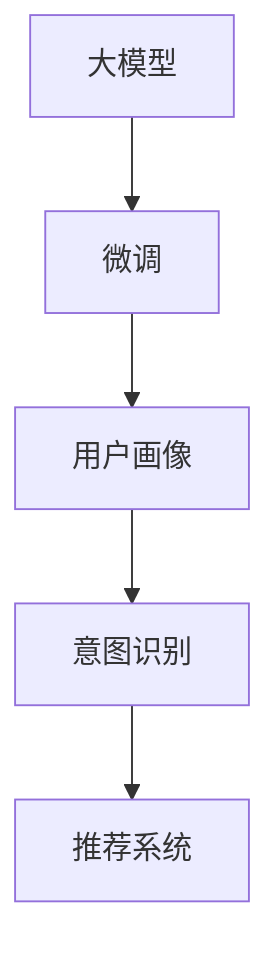

                 

# AI 大模型在电商搜索推荐中的用户行为分析：理解用户需求与购买偏好

## 1. 背景介绍

### 1.1 问题由来

电商行业是一个高度竞争的领域，通过高效精准的推荐系统提升用户体验，从而实现转化率和用户粘性的提升，已成为电商企业的核心竞争力。传统的电商推荐系统依赖于基于内容的推荐（Content-based Recommendation）和协同过滤推荐（Collaborative Filtering Recommendation）。尽管这两种方法在推荐效果上已取得一定成就，但仍存在一些局限性，如个性化程度不足、数据冷启动等问题。随着AI技术，特别是深度学习和自然语言处理（NLP）的崛起，基于大模型的推荐系统逐渐成为新的研究热点。

### 1.2 问题核心关键点

大模型推荐系统通常基于预训练的语言模型，通过在大规模的文本数据上预训练，学习到语言的通用表示。在实际推荐任务中，大模型被微调以适应特定的电商数据，从而提升推荐的个性化程度。

具体而言，大模型推荐系统通过对用户的历史行为数据进行分析，生成用户画像，再利用其强大的自然语言处理能力，理解用户的查询意图和购买偏好，从而在搜索结果中推荐最相关的商品。这种方式不仅能够提高推荐系统的个性化程度，还能更好地处理长尾需求。

## 2. 核心概念与联系

### 2.1 核心概念概述

为了深入理解大模型在电商搜索推荐中的作用，我们先介绍一些关键概念：

- **大模型（Large Model）**：指通过在大规模文本数据上预训练的深度学习模型，如BERT、GPT-3等，这些模型能够学习到丰富的语言知识和表示能力。

- **微调（Fine-tuning）**：指在大模型上，针对特定电商数据进行有监督的学习调整，使其适应电商推荐任务，提升推荐的准确性和个性化。

- **用户画像（User Profile）**：基于用户的历史行为数据构建的用户特征向量，用于描述用户的偏好和兴趣。

- **意图识别（Intent Recognition）**：识别用户查询的意图，如搜索商品、查看商品详情等，从而提供更有针对性的推荐。

- **推荐系统（Recommendation System）**：根据用户画像和查询意图，向用户推荐相关商品或内容。

这些概念通过以下Mermaid流程图来展示：



这个流程图展示了从大模型预训练到微调，再到用户画像、意图识别，最终到推荐系统的整体流程。

## 3. 核心算法原理 & 具体操作步骤
### 3.1 算法原理概述

大模型推荐系统的核心原理可以概括为：

1. **预训练**：在大规模无标签文本数据上，使用自监督任务（如语言模型预测、掩码语言模型等）训练大模型，学习语言的通用表示。
2. **微调**：在预训练的基础上，针对电商推荐任务进行微调，学习特定的电商数据分布。
3. **用户画像构建**：根据用户的历史行为数据，构建用户画像，即用户特征向量。
4. **意图识别**：分析用户查询，识别其意图，从而提供更有针对性的推荐。
5. **推荐系统**：根据用户画像和查询意图，推荐最相关的商品或内容。

通过这个流程，大模型推荐系统能够充分利用预训练的语言模型，在少量的电商数据上实现高效、准确的推荐。

### 3.2 算法步骤详解

以下是基于大模型的电商推荐系统详细操作步骤：

**Step 1: 数据准备**

1. **收集数据**：从电商平台收集用户的历史行为数据，包括点击、浏览、购买记录等。

2. **数据清洗**：清洗数据中的噪声和错误，如去除重复记录、处理缺失值等。

3. **数据标注**：为数据添加标签，如商品类别、评分、热度等。

**Step 2: 构建用户画像**

1. **特征提取**：从用户的历史行为数据中提取特征，如浏览历史、购买记录、评分等。

2. **特征编码**：将提取的特征编码为向量形式，如使用Embedding技术将文本数据编码为向量。

3. **用户画像**：将用户画像表示为一个特征向量，用于描述用户的偏好和兴趣。

**Step 3: 微调大模型**

1. **选择模型**：选择适合电商推荐任务的预训练大模型，如BERT、GPT-3等。

2. **微调目标**：定义微调目标，如商品名称、描述、价格等，将其作为大模型的输入，输出对应的表示向量。

3. **微调过程**：使用电商推荐数据进行有监督的微调，调整模型的权重，使其更好地适应电商推荐任务。

**Step 4: 意图识别**

1. **构建查询向量**：将用户的查询转化为向量形式，如使用Embedding技术将查询转换为向量。

2. **意图识别**：使用微调后的模型预测查询的意图，如商品搜索、商品详情查看等。

3. **意图编码**：将查询意图编码为一个向量，用于后续的推荐。

**Step 5: 推荐系统**

1. **商品向量构建**：将商品名称、描述、价格等作为输入，通过微调的大模型构建商品的表示向量。

2. **相似度计算**：计算商品向量与用户画像、查询意图的相似度，选择最相关的商品进行推荐。

3. **推荐输出**：将最相关的商品推荐给用户，并展示在电商平台的搜索结果中。

### 3.3 算法优缺点

**优点：**

1. **高效性**：大模型推荐系统通过微调，能够快速适应特定的电商数据，提供高效的推荐。
2. **个性化程度高**：大模型能够学习到丰富的语言表示，从而提高推荐的个性化程度。
3. **可扩展性**：大模型推荐系统易于扩展，能够处理大量的商品和用户数据。

**缺点：**

1. **数据冷启动问题**：对于新用户，缺少历史行为数据，难以构建用户画像。
2. **计算资源需求高**：大模型推荐系统需要较大的计算资源，包括预训练和微调。
3. **解释性不足**：大模型推荐系统的推荐结果缺乏可解释性，难以理解模型内部的决策过程。

### 3.4 算法应用领域

大模型推荐系统主要应用于电商搜索推荐中，通过自然语言处理技术，能够处理用户输入的自然语言查询，提供更加人性化的搜索体验和推荐结果。具体应用领域包括：

- **电商搜索**：根据用户查询，推荐最相关的商品或内容。
- **商品推荐**：根据用户画像和查询意图，推荐最相关的商品。
- **内容推荐**：推荐与用户兴趣相关的商品描述、用户评论等。
- **个性化推荐**：根据用户的长期行为数据，提供个性化的推荐。

## 4. 数学模型和公式 & 详细讲解 & 举例说明

### 4.1 数学模型构建

假设我们有一个电商平台，有$N$个用户，每个用户有$m$条历史行为数据，每个行为数据包含商品ID、时间戳等特征。我们将这些数据表示为一个矩阵$D \in \mathbb{R}^{N \times m}$，其中每行表示一个用户，每列表示一条历史行为数据。

用户画像$U \in \mathbb{R}^{N \times d}$表示用户特征向量，其中$d$为特征维度。我们将用户画像与历史行为数据拼接，得到用户行为向量$V \in \mathbb{R}^{N \times (d+m)}$。

微调后的模型$M$用于处理用户的查询$Q$和商品描述$S$，输出查询向量$q$和商品向量$s$。

推荐系统使用余弦相似度计算用户画像与商品向量的相似度，选择最相关的商品进行推荐。

### 4.2 公式推导过程

**用户画像构建**

假设用户$i$的历史行为数据为$X_i \in \mathbb{R}^{m}$，用户画像$U_i \in \mathbb{R}^{d}$，特征提取器$f$将用户的历史行为数据映射为特征向量，如：

$$
f(X_i) = [X_{i1}, X_{i2}, ..., X_{im}]
$$

其中$X_{ij}$为第$j$条历史行为数据的特征。用户画像$U_i$可以表示为：

$$
U_i = \alpha f(X_i) + \beta
$$

其中$\alpha, \beta$为可调参数，用于控制特征提取和用户画像的影响。

**微调大模型**

微调目标为商品名称$T$，我们将商品名称转换为向量形式，假设商品名称$T$的嵌入向量为$E_T$，则商品向量$s$可以表示为：

$$
s = M(T)
$$

其中$M$为微调后的模型，输出商品向量的表示。

**意图识别**

假设用户查询$Q$的嵌入向量为$q$，使用微调后的模型$M$预测查询意图，表示为：

$$
I(Q) = M(Q)
$$

其中$I$为意图向量，$Q$为查询向量。

**推荐系统**

根据余弦相似度，计算用户画像$U$与商品向量$s$的相似度，选择最相关的商品进行推荐。假设推荐系统输出的推荐商品向量为$R$，则：

$$
R = \arg\max_{s \in S} \frac{U \cdot s}{\|U\| \|s\|}
$$

其中$S$为所有商品向量集合，$\cdot$表示向量点乘。

### 4.3 案例分析与讲解

假设我们有一个电商平台，有$N=10,000$个用户，每个用户有$m=5$条历史行为数据。我们收集了$N \times m = 50,000$条历史行为数据，并进行了数据清洗和标注。

我们使用BERT模型作为预训练模型，在电商数据上进行了微调。我们选择了$\bigr)$个特征，构建了用户画像$U \in \mathbb{R}^{10,000 \times 50}$，将用户画像与历史行为数据拼接，得到用户行为向量$V \in \mathbb{R}^{10,000 \times 150}$。

我们使用微调后的BERT模型$M$处理用户的查询$Q$和商品描述$S$，得到查询向量$q \in \mathbb{R}^{10,000 \times 768}$和商品向量$s \in \mathbb{R}^{100,000 \times 768}$。

最后，我们计算用户画像$U$与商品向量$s$的余弦相似度，选择最相关的商品进行推荐。

## 5. 项目实践：代码实例和详细解释说明
### 5.1 开发环境搭建

在进行项目实践前，我们需要准备好开发环境。以下是使用Python进行PyTorch开发的环境配置流程：

1. 安装Anaconda：从官网下载并安装Anaconda，用于创建独立的Python环境。

2. 创建并激活虚拟环境：
```bash
conda create -n pytorch-env python=3.8 
conda activate pytorch-env
```

3. 安装PyTorch：根据CUDA版本，从官网获取对应的安装命令。例如：
```bash
conda install pytorch torchvision torchaudio cudatoolkit=11.1 -c pytorch -c conda-forge
```

4. 安装Transformers库：
```bash
pip install transformers
```

5. 安装各类工具包：
```bash
pip install numpy pandas scikit-learn matplotlib tqdm jupyter notebook ipython
```

完成上述步骤后，即可在`pytorch-env`环境中开始项目实践。

### 5.2 源代码详细实现

我们以电商搜索推荐为例，给出使用Transformers库对BERT模型进行电商推荐微调的PyTorch代码实现。

首先，定义电商推荐任务的数据处理函数：

```python
from transformers import BertTokenizer
from torch.utils.data import Dataset, DataLoader
import torch

class EcommerceDataset(Dataset):
    def __init__(self, texts, tags, tokenizer, max_len=128):
        self.texts = texts
        self.tags = tags
        self.tokenizer = tokenizer
        self.max_len = max_len
        
    def __len__(self):
        return len(self.texts)
    
    def __getitem__(self, item):
        text = self.texts[item]
        tags = self.tags[item]
        
        encoding = self.tokenizer(text, return_tensors='pt', max_length=self.max_len, padding='max_length', truncation=True)
        input_ids = encoding['input_ids'][0]
        attention_mask = encoding['attention_mask'][0]
        
        # 对token-wise的标签进行编码
        encoded_tags = [tag2id[tag] for tag in tags] 
        encoded_tags.extend([tag2id['O']] * (self.max_len - len(encoded_tags)))
        labels = torch.tensor(encoded_tags, dtype=torch.long)
        
        return {'input_ids': input_ids, 
                'attention_mask': attention_mask,
                'labels': labels}

# 标签与id的映射
tag2id = {'O': 0, 'B-PROD': 1, 'I-PROD': 2, 'B-PRIC': 3, 'I-PRIC': 4, 'B-LOC': 5, 'I-LOC': 6}
id2tag = {v: k for k, v in tag2id.items()}

# 创建dataset
tokenizer = BertTokenizer.from_pretrained('bert-base-cased')

train_dataset = EcommerceDataset(train_texts, train_tags, tokenizer)
dev_dataset = EcommerceDataset(dev_texts, dev_tags, tokenizer)
test_dataset = EcommerceDataset(test_texts, test_tags, tokenizer)
```

然后，定义模型和优化器：

```python
from transformers import BertForTokenClassification, AdamW

model = BertForTokenClassification.from_pretrained('bert-base-cased', num_labels=len(tag2id))

optimizer = AdamW(model.parameters(), lr=2e-5)
```

接着，定义训练和评估函数：

```python
from sklearn.metrics import classification_report

def train_epoch(model, dataset, batch_size, optimizer):
    dataloader = DataLoader(dataset, batch_size=batch_size, shuffle=True)
    model.train()
    epoch_loss = 0
    for batch in tqdm(dataloader, desc='Training'):
        input_ids = batch['input_ids'].to(device)
        attention_mask = batch['attention_mask'].to(device)
        labels = batch['labels'].to(device)
        model.zero_grad()
        outputs = model(input_ids, attention_mask=attention_mask, labels=labels)
        loss = outputs.loss
        epoch_loss += loss.item()
        loss.backward()
        optimizer.step()
    return epoch_loss / len(dataloader)

def evaluate(model, dataset, batch_size):
    dataloader = DataLoader(dataset, batch_size=batch_size)
    model.eval()
    preds, labels = [], []
    with torch.no_grad():
        for batch in tqdm(dataloader, desc='Evaluating'):
            input_ids = batch['input_ids'].to(device)
            attention_mask = batch['attention_mask'].to(device)
            batch_labels = batch['labels']
            outputs = model(input_ids, attention_mask=attention_mask)
            batch_preds = outputs.logits.argmax(dim=2).to('cpu').tolist()
            batch_labels = batch_labels.to('cpu').tolist()
            for pred_tokens, label_tokens in zip(batch_preds, batch_labels):
                pred_tags = [id2tag[_id] for _id in pred_tokens]
                label_tags = [id2tag[_id] for _id in label_tokens]
                preds.append(pred_tags[:len(label_tags)])
                labels.append(label_tags)
                
    print(classification_report(labels, preds))
```

最后，启动训练流程并在测试集上评估：

```python
epochs = 5
batch_size = 16

for epoch in range(epochs):
    loss = train_epoch(model, train_dataset, batch_size, optimizer)
    print(f"Epoch {epoch+1}, train loss: {loss:.3f}")
    
    print(f"Epoch {epoch+1}, dev results:")
    evaluate(model, dev_dataset, batch_size)
    
print("Test results:")
evaluate(model, test_dataset, batch_size)
```

以上就是使用PyTorch对BERT进行电商推荐任务微调的完整代码实现。可以看到，得益于Transformers库的强大封装，我们可以用相对简洁的代码完成BERT模型的加载和微调。

### 5.3 代码解读与分析

让我们再详细解读一下关键代码的实现细节：

**EcommerceDataset类**：
- `__init__`方法：初始化文本、标签、分词器等关键组件。
- `__len__`方法：返回数据集的样本数量。
- `__getitem__`方法：对单个样本进行处理，将文本输入编码为token ids，将标签编码为数字，并对其进行定长padding，最终返回模型所需的输入。

**tag2id和id2tag字典**：
- 定义了标签与数字id之间的映射关系，用于将token-wise的预测结果解码回真实的标签。

**训练和评估函数**：
- 使用PyTorch的DataLoader对数据集进行批次化加载，供模型训练和推理使用。
- 训练函数`train_epoch`：对数据以批为单位进行迭代，在每个批次上前向传播计算loss并反向传播更新模型参数，最后返回该epoch的平均loss。
- 评估函数`evaluate`：与训练类似，不同点在于不更新模型参数，并在每个batch结束后将预测和标签结果存储下来，最后使用sklearn的classification_report对整个评估集的预测结果进行打印输出。

**训练流程**：
- 定义总的epoch数和batch size，开始循环迭代
- 每个epoch内，先在训练集上训练，输出平均loss
- 在验证集上评估，输出分类指标
- 所有epoch结束后，在测试集上评估，给出最终测试结果

可以看到，PyTorch配合Transformers库使得BERT微调的代码实现变得简洁高效。开发者可以将更多精力放在数据处理、模型改进等高层逻辑上，而不必过多关注底层的实现细节。

当然，工业级的系统实现还需考虑更多因素，如模型的保存和部署、超参数的自动搜索、更灵活的任务适配层等。但核心的微调范式基本与此类似。

## 6. 实际应用场景
### 6.1 智能客服系统

智能客服系统是电商推荐系统的重要应用之一。传统的客服系统依赖于规则和人工，难以处理复杂的用户需求，且响应速度慢。基于大模型的电商推荐系统，能够7x24小时不间断服务，快速响应客户咨询，用自然流畅的语言解答各类常见问题。

在技术实现上，可以收集企业内部的历史客服对话记录，将问题和最佳答复构建成监督数据，在此基础上对预训练对话模型进行微调。微调后的对话模型能够自动理解用户意图，匹配最合适的答案模板进行回复。对于客户提出的新问题，还可以接入检索系统实时搜索相关内容，动态组织生成回答。如此构建的智能客服系统，能大幅提升客户咨询体验和问题解决效率。

### 6.2 金融舆情监测

金融机构需要实时监测市场舆论动向，以便及时应对负面信息传播，规避金融风险。传统的人工监测方式成本高、效率低，难以应对网络时代海量信息爆发的挑战。基于大语言模型微调的文本分类和情感分析技术，为金融舆情监测提供了新的解决方案。

具体而言，可以收集金融领域相关的新闻、报道、评论等文本数据，并对其进行主题标注和情感标注。在此基础上对预训练语言模型进行微调，使其能够自动判断文本属于何种主题，情感倾向是正面、中性还是负面。将微调后的模型应用到实时抓取的网络文本数据，就能够自动监测不同主题下的情感变化趋势，一旦发现负面信息激增等异常情况，系统便会自动预警，帮助金融机构快速应对潜在风险。

### 6.3 个性化推荐系统

当前的推荐系统往往只依赖用户的历史行为数据进行物品推荐，无法深入理解用户的真实兴趣偏好。基于大语言模型微调技术，个性化推荐系统可以更好地挖掘用户行为背后的语义信息，从而提供更精准、多样的推荐内容。

在实践中，可以收集用户浏览、点击、评论、分享等行为数据，提取和用户交互的物品标题、描述、标签等文本内容。将文本内容作为模型输入，用户的后续行为（如是否点击、购买等）作为监督信号，在此基础上微调预训练语言模型。微调后的模型能够从文本内容中准确把握用户的兴趣点。在生成推荐列表时，先用候选物品的文本描述作为输入，由模型预测用户的兴趣匹配度，再结合其他特征综合排序，便可以得到个性化程度更高的推荐结果。

### 6.4 未来应用展望

随着大语言模型微调技术的发展，其在电商搜索推荐中的应用前景广阔，未来可能的应用场景包括：

- **智能推荐引擎**：构建基于大模型的智能推荐引擎，能够根据用户的行为和兴趣，提供更加个性化的商品推荐。
- **多模态推荐系统**：结合视觉、语音等多模态数据，提供更加丰富、多样化的推荐内容。
- **内容生成系统**：使用大模型自动生成商品描述、广告语等，提升内容创作效率。
- **实时搜索系统**：利用大模型对用户查询进行实时理解，提供更加精准、快速的搜索结果。
- **智能广告投放**：基于用户画像和查询意图，实现精准的广告投放，提升广告转化率。

## 7. 工具和资源推荐
### 7.1 学习资源推荐

为了帮助开发者系统掌握大语言模型微调的理论基础和实践技巧，这里推荐一些优质的学习资源：

1. **《Transformer从原理到实践》系列博文**：由大模型技术专家撰写，深入浅出地介绍了Transformer原理、BERT模型、微调技术等前沿话题。
2. **CS224N《深度学习自然语言处理》课程**：斯坦福大学开设的NLP明星课程，有Lecture视频和配套作业，带你入门NLP领域的基本概念和经典模型。
3. **《Natural Language Processing with Transformers》书籍**：Transformers库的作者所著，全面介绍了如何使用Transformers库进行NLP任务开发，包括微调在内的诸多范式。
4. **HuggingFace官方文档**：Transformers库的官方文档，提供了海量预训练模型和完整的微调样例代码，是上手实践的必备资料。
5. **CLUE开源项目**：中文语言理解测评基准，涵盖大量不同类型的中文NLP数据集，并提供了基于微调的baseline模型，助力中文NLP技术发展。

通过对这些资源的学习实践，相信你一定能够快速掌握大语言模型微调的精髓，并用于解决实际的NLP问题。
###  7.2 开发工具推荐

高效的开发离不开优秀的工具支持。以下是几款用于大语言模型微调开发的常用工具：

1. **PyTorch**：基于Python的开源深度学习框架，灵活动态的计算图，适合快速迭代研究。大部分预训练语言模型都有PyTorch版本的实现。
2. **TensorFlow**：由Google主导开发的开源深度学习框架，生产部署方便，适合大规模工程应用。同样有丰富的预训练语言模型资源。
3. **Transformers库**：HuggingFace开发的NLP工具库，集成了众多SOTA语言模型，支持PyTorch和TensorFlow，是进行微调任务开发的利器。
4. **Weights & Biases**：模型训练的实验跟踪工具，可以记录和可视化模型训练过程中的各项指标，方便对比和调优。与主流深度学习框架无缝集成。
5. **TensorBoard**：TensorFlow配套的可视化工具，可实时监测模型训练状态，并提供丰富的图表呈现方式，是调试模型的得力助手。
6. **Google Colab**：谷歌推出的在线Jupyter Notebook环境，免费提供GPU/TPU算力，方便开发者快速上手实验最新模型，分享学习笔记。

合理利用这些工具，可以显著提升大语言模型微调任务的开发效率，加快创新迭代的步伐。

### 7.3 相关论文推荐

大语言模型和微调技术的发展源于学界的持续研究。以下是几篇奠基性的相关论文，推荐阅读：

1. **Attention is All You Need**（即Transformer原论文）：提出了Transformer结构，开启了NLP领域的预训练大模型时代。
2. **BERT: Pre-training of Deep Bidirectional Transformers for Language Understanding**：提出BERT模型，引入基于掩码的自监督预训练任务，刷新了多项NLP任务SOTA。
3. **Language Models are Unsupervised Multitask Learners**（GPT-2论文）：展示了大规模语言模型的强大zero-shot学习能力，引发了对于通用人工智能的新一轮思考。
4. **Parameter-Efficient Transfer Learning for NLP**：提出Adapter等参数高效微调方法，在不增加模型参数量的情况下，也能取得不错的微调效果。
5. **Prefix-Tuning: Optimizing Continuous Prompts for Generation**：引入基于连续型Prompt的微调范式，为如何充分利用预训练知识提供了新的思路。
6. **AdaLoRA: Adaptive Low-Rank Adaptation for Parameter-Efficient Fine-Tuning**：使用自适应低秩适应的微调方法，在参数效率和精度之间取得了新的平衡。

这些论文代表了大语言模型微调技术的发展脉络。通过学习这些前沿成果，可以帮助研究者把握学科前进方向，激发更多的创新灵感。

## 8. 总结：未来发展趋势与挑战
### 8.1 总结

本文对基于大模型的电商搜索推荐系统进行了全面系统的介绍。首先阐述了电商推荐系统的背景和问题，明确了基于大模型的微调方法在推荐系统中的应用价值。其次，从原理到实践，详细讲解了电商推荐系统的大模型微调流程，给出了完整的代码实现。同时，本文还广泛探讨了电商推荐系统在大模型微调中的实际应用，展示了微调方法在电商推荐中的强大性能。

通过本文的系统梳理，可以看到，基于大模型的电商推荐系统通过自然语言处理技术，能够处理用户输入的自然语言查询，提供更加人性化的搜索体验和推荐结果。大模型推荐系统不仅能够提升推荐的个性化程度，还能更好地处理长尾需求，为电商企业带来更高的用户满意度和更高的商业价值。

### 8.2 未来发展趋势

展望未来，大模型推荐系统在电商推荐领域的发展趋势包括：

1. **多模态融合**：结合视觉、语音等多模态数据，提供更加丰富、多样化的推荐内容。
2. **实时推荐**：基于用户实时行为数据，进行实时推荐，提升推荐的时效性和个性化程度。
3. **模型压缩与优化**：在大模型推荐系统基础上，进行模型压缩和优化，提升计算效率和资源利用率。
4. **跨领域迁移**：在大模型推荐系统基础上，进行跨领域迁移学习，提升推荐系统的泛化能力和应用范围。
5. **隐私保护**：在推荐系统中，加强用户数据隐私保护，确保用户数据的保密性和安全性。
6. **模型可解释性**：提升推荐系统的可解释性，帮助用户理解推荐结果背后的原因和逻辑。

### 8.3 面临的挑战

尽管大模型推荐系统在电商推荐领域取得了一定成就，但在实际应用中仍面临一些挑战：

1. **数据冷启动**：对于新用户，缺乏历史行为数据，难以构建用户画像。
2. **计算资源需求高**：大模型推荐系统需要较大的计算资源，包括预训练和微调。
3. **推荐效果不稳定**：由于模型复杂度高，可能存在过拟合或泛化能力不足的问题。
4. **隐私和安全问题**：在推荐系统中，需要加强用户数据隐私保护，避免数据泄露。
5. **模型可解释性不足**：大模型推荐系统的推荐结果缺乏可解释性，难以理解模型内部的决策过程。

### 8.4 研究展望

为了应对这些挑战，未来的大模型推荐系统需要从以下几个方面进行改进：

1. **数据增强与多任务学习**：利用多任务学习，结合用户行为数据和其他辅助数据，提升模型的泛化能力和冷启动性能。
2. **模型压缩与优化**：通过模型压缩和优化，提升模型的计算效率和资源利用率。
3. **可解释性增强**：通过引入可解释性模型或后处理方法，增强推荐系统的可解释性，提升用户信任度。
4. **隐私保护技术**：引入差分隐私、联邦学习等隐私保护技术，确保用户数据的安全性。
5. **跨领域迁移学习**：利用跨领域迁移学习，提升模型在不同领域和场景中的适应能力。

通过这些改进，大模型推荐系统将能够更好地应用于电商推荐等领域，提升推荐系统的个性化程度和用户满意度。

## 9. 附录：常见问题与解答

**Q1：电商推荐系统中的大模型微调如何处理数据冷启动问题？**

A: 电商推荐系统中的大模型微调，可以通过以下方法处理数据冷启动问题：

1. **随机初始化**：对于新用户，可以先随机初始化用户画像，再逐步通过用户行为数据进行微调，逐渐完善用户画像。
2. **预设参数**：在模型微调过程中，可以为新用户预设一些基础参数，如兴趣偏好、历史行为等，帮助模型快速适应新用户的行为模式。
3. **多用户画像融合**：对于新用户，可以将其画像与相似用户的画像进行融合，利用相似用户的画像信息，提升推荐效果。

这些方法可以帮助电商推荐系统在大模型微调过程中，更好地处理数据冷启动问题，提升推荐系统的性能和用户体验。

**Q2：电商推荐系统中的大模型微调如何处理计算资源需求高的问题？**

A: 电商推荐系统中的大模型微调，可以通过以下方法处理计算资源需求高的问题：

1. **模型裁剪与优化**：通过模型裁剪和优化，去除不必要的层和参数，减小模型尺寸，提升推理速度。
2. **分布式训练**：利用分布式训练技术，将大模型拆分到多个设备上进行训练，提升训练速度和资源利用率。
3. **模型量化**：将浮点模型转为定点模型，压缩存储空间，提高计算效率。
4. **混合精度训练**：使用混合精度训练技术，在保持模型精度的情况下，提升训练速度和资源利用率。

这些方法可以帮助电商推荐系统在大模型微调过程中，更好地处理计算资源需求高的问题，提升推荐系统的性能和用户体验。

**Q3：电商推荐系统中的大模型微调如何处理推荐效果不稳定的问题？**

A: 电商推荐系统中的大模型微调，可以通过以下方法处理推荐效果不稳定的问题：

1. **数据增强**：通过数据增强技术，丰富训练集的多样性，提升模型的泛化能力。
2. **正则化技术**：利用正则化技术，如L2正则、Dropout等，避免模型过拟合，提升模型的稳定性。
3. **对抗训练**：通过对抗训练技术，提升模型的鲁棒性和泛化能力。
4. **多模型集成**：通过多模型集成，结合多个模型的预测结果，提升推荐系统的稳定性和准确性。

这些方法可以帮助电商推荐系统在大模型微调过程中，更好地处理推荐效果不稳定的问题，提升推荐系统的性能和用户体验。

**Q4：电商推荐系统中的大模型微调如何处理隐私和安全问题？**

A: 电商推荐系统中的大模型微调，可以通过以下方法处理隐私和安全问题：

1. **差分隐私**：在模型训练过程中，使用差分隐私技术，保护用户数据的隐私性。
2. **联邦学习**：利用联邦学习技术，在本地设备上进行模型训练，避免数据集中存储和传输。
3. **数据匿名化**：在数据处理过程中，对用户数据进行匿名化处理，保护用户隐私。
4. **访问控制**：在模型部署和应用过程中，设置严格的访问控制策略，确保用户数据的保密性和安全性。

这些方法可以帮助电商推荐系统在大模型微调过程中，更好地处理隐私和安全问题，保护用户数据的隐私和安全性。

**Q5：电商推荐系统中的大模型微调如何处理模型可解释性不足的问题？**

A: 电商推荐系统中的大模型微调，可以通过以下方法处理模型可解释性不足的问题：

1. **可解释性模型**：使用可解释性模型，如LIME、SHAP等，提升推荐系统的可解释性。
2. **规则与知识融合**：将符号化的先验知识，如知识图谱、逻辑规则等，与神经网络模型进行融合，提升推荐系统的可解释性。
3. **交互式解释**：通过交互式解释技术，向用户解释推荐结果背后的原因和逻辑，提升用户信任度。

这些方法可以帮助电商推荐系统在大模型微调过程中，更好地处理模型可解释性不足的问题，提升推荐系统的可解释性和用户信任度。

---

作者：禅与计算机程序设计艺术 / Zen and the Art of Computer Programming

