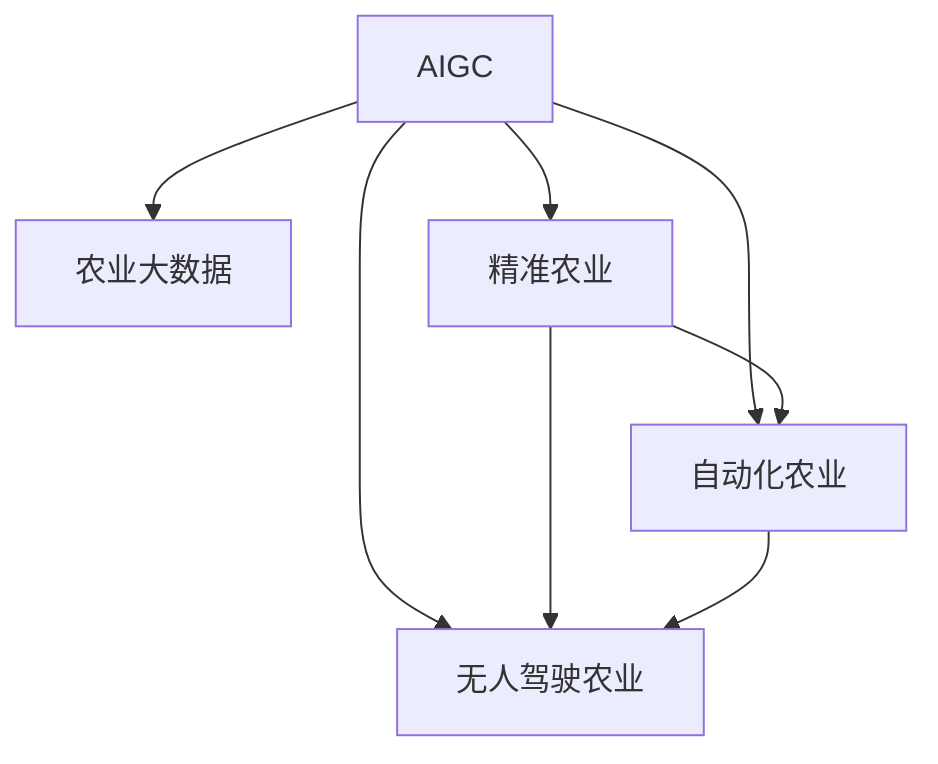

                 

# AIGC推动智慧农业升级

## 1. 背景介绍

### 1.1 问题由来
智慧农业（Smart Agriculture），是指利用信息技术和自动化手段，提高农业生产效率和品质，促进可持续发展的新型农业模式。AIGC（AI Generated Content），即人工智能生成内容，是指通过人工智能算法自动生成文本、图像、音频等多模态内容的技术。AIGC与智慧农业的结合，为农业科技带来了革命性的变化，推动农业生产向智能化、精准化、绿色化方向发展。

近年来，随着AIGC技术的进步和普及，其在农业中的应用逐渐得到重视。例如，AIGC技术可以生成农业知识普及内容、农业机械操作指导、农田管理建议等，极大提高了农业生产的专业性和便捷性。但目前，AIGC在农业领域的应用仍处于起步阶段，存在技术成熟度低、应用场景窄等问题，亟需进一步探索和创新。

### 1.2 问题核心关键点
AIGC在智慧农业中的应用，主要包括以下几个方面：

- 知识生成：利用AIGC生成农业知识、科普文章、技术手册等，帮助农民提升技术水平，理解先进农业技术的应用。
- 操作指导：自动生成农田作业指导、机械操作说明、病虫害防治策略等，为农民提供操作参考。
- 管理优化：通过对农田图像、作物生长数据的分析，生成种植建议、灌溉计划、施肥方案等，优化农田管理。
- 市场营销：利用AIGC生成农产品描述、推广文案、市场分析报告等，提升农产品的市场竞争力。

这些应用场景表明，AIGC在智慧农业中具有巨大潜力。但AIGC技术在实际应用中也面临数据质量、模型泛化、模型可解释性等挑战。因此，本文旨在探索AIGC在智慧农业中的应用，并提出具体的解决方案。

### 1.3 问题研究意义
研究AIGC在智慧农业中的应用，对推动农业智能化、精准化、绿色化发展具有重要意义：

1. 提高生产效率：AIGC生成的知识、指导、建议等可以显著提高农民的操作效率和生产效果。
2. 提升科学管理：利用AIGC进行精准管理，能够有效提升农田管理水平，降低资源浪费。
3. 增强市场竞争力：通过AIGC生成的市场分析、产品推广等，提升农产品的市场价值和市场份额。
4. 降低生产成本：优化生产过程，降低农药、化肥、水等资源的消耗，提高经济效益。
5. 实现绿色生产：AIGC技术可以提供更加科学、环保的农业生产方案，推动农业可持续发展。

## 2. 核心概念与联系

### 2.1 核心概念概述

为更好地理解AIGC在智慧农业中的应用，本节将介绍几个密切相关的核心概念：

- AIGC：人工智能生成内容，通过算法自动生成文本、图像、音频等多模态内容。
- 农业大数据：指与农业相关的各类数据，如土壤、气象、种植、病虫害等数据。
- 精准农业：利用信息技术对农田进行精细化管理，提高生产效率和品质。
- 自动化农业：通过自动化设备和技术实现农业生产全过程的智能化、自动化。
- 无人驾驶农业：利用无人机、自动驾驶车辆等技术，实现精准农业操作。

这些核心概念之间的逻辑关系可以通过以下Mermaid流程图来展示：



这个流程图展示了大规模语言模型的工作原理和优化方向：

1. AIGC通过农业大数据进行训练，生成农业知识、操作指导、管理建议等。
2. 精准农业利用AIGC生成的内容进行管理优化。
3. 自动化农业通过AIGC生成的操作指导实现全过程智能化。
4. 无人驾驶农业结合AIGC生成的数据进行精准操作。

## 3. 核心算法原理 & 具体操作步骤

### 3.1 算法原理概述

基于AIGC的智慧农业应用，本质上是一个有监督的迁移学习过程。其核心思想是：将农业大数据作为监督信号，训练生成模型自动生成农业相关内容，然后在特定应用场景中，通过微调等技术优化模型，生成适应当前农业环境的文本、图像、视频等多模态内容。

形式化地，假设训练数据集为 $D=\{(x_i, y_i)\}_{i=1}^N$，其中 $x_i$ 为输入数据（如农田图像、气象数据等），$y_i$ 为生成的内容（如操作指导、管理建议等）。AIGC模型的训练目标为最小化以下损失函数：

$$
\mathcal{L}(M_{\theta},D) = \sum_{i=1}^N \ell(y_i, M_{\theta}(x_i))
$$

其中 $\ell$ 为内容生成模型的损失函数，通常为交叉熵损失函数。通过梯度下降等优化算法，不断更新模型参数 $\theta$，最小化损失函数，使得模型能够自动生成符合农业环境的文本、图像、视频等内容。

### 3.2 算法步骤详解

基于AIGC的智慧农业应用一般包括以下几个关键步骤：

**Step 1: 准备数据集**
- 收集和标注农业大数据，如农田图像、土壤数据、气象数据、病虫害数据等。
- 将标注数据划分为训练集、验证集和测试集，保证数据的多样性和分布均衡。

**Step 2: 设计生成模型**
- 选择合适的生成模型，如文本生成模型（如GPT-3、T5等）、图像生成模型（如GANs、VAEs等）、视频生成模型（如3D Generative Networks等）。
- 设计生成模型的架构，包括编码器、解码器、损失函数等。

**Step 3: 模型训练**
- 使用农业大数据训练生成模型，通过梯度下降等优化算法更新模型参数。
- 在训练过程中，使用验证集评估模型性能，避免过拟合。

**Step 4: 应用优化**
- 将训练好的模型应用于特定农业场景，生成知识、操作指导、管理建议等。
- 利用微调等技术，优化模型在特定任务上的表现，如提高知识生成准确性、增强操作指导的适用性等。

**Step 5: 效果评估**
- 在测试集上评估生成内容的准确性、实用性、可读性等指标。
- 收集用户反馈，不断改进生成模型的性能。

以上是基于AIGC的智慧农业应用的完整流程。在实际应用中，还需要根据具体任务和数据特点，对各环节进行优化设计，如改进训练目标函数、引入更多的正则化技术、搜索最优的超参数组合等，以进一步提升模型性能。

### 3.3 算法优缺点

基于AIGC的智慧农业应用具有以下优点：
1. 快速生成内容：AIGC可以自动生成农业知识、操作指导、管理建议等，极大地缩短了生产内容的时间。
2. 提高生产效率：AIGC生成的内容可以提高农民的操作效率和生产效果。
3. 降低生产成本：优化生产过程，降低农药、化肥、水等资源的消耗，提高经济效益。
4. 推动绿色生产：AIGC技术可以提供更加科学、环保的农业生产方案，推动农业可持续发展。

同时，该方法也存在一定的局限性：
1. 数据质量依赖高：AIGC生成内容的质量高度依赖于数据的质量，数据不准确会导致内容错误。
2. 泛化能力有限：模型在不同农业环境中的泛化能力有限，需要针对特定环境进行微调。
3. 模型可解释性不足：AIGC生成的内容缺乏可解释性，难以对其推理逻辑进行分析和调试。
4. 隐私和安全问题：农业大数据涉及隐私数据，模型可能存在数据泄露风险，需要加强隐私保护和数据安全。

尽管存在这些局限性，但就目前而言，基于AIGC的智慧农业应用仍是最主流范式。未来相关研究的重点在于如何进一步降低对数据质量的需求，提高模型的泛化能力，同时兼顾可解释性和数据隐私等问题。

### 3.4 算法应用领域

基于AIGC的智慧农业应用已经在多个领域得到应用，例如：

- 农业知识普及：生成农业知识文章、技术手册、问答库等，帮助农民提升技术水平。
- 农田管理建议：生成农田管理建议、种植方案、病虫害防治策略等，提高农田管理效率。
- 农业机械操作指导：生成机械操作说明、操作视频等，辅助农民进行农业机械操作。
- 农产品市场营销：生成农产品描述、推广文案、市场分析报告等，提升农产品市场竞争力。
- 智慧农场管理：生成智慧农场管理方案、运营建议、市场策略等，提高农场运营效率。

除了上述这些经典应用外，AIGC技术还被创新性地应用于农业机器人、农业无人机、农业物联网等领域，为农业智能化、精准化、绿色化发展提供了新的技术路径。随着AIGC技术的不断进步，相信在农业领域的应用场景将更加广阔。

## 4. 数学模型和公式 & 详细讲解 & 举例说明

### 4.1 数学模型构建

本节将使用数学语言对基于AIGC的智慧农业应用过程进行更加严格的刻画。

假设生成模型为 $M_{\theta}:\mathcal{X} \rightarrow \mathcal{Y}$，其中 $\mathcal{X}$ 为输入数据空间，$\mathcal{Y}$ 为生成内容空间，$\theta \in \mathbb{R}^d$ 为模型参数。农业大数据为 $D=\{(x_i, y_i)\}_{i=1}^N, x_i \in \mathcal{X}, y_i \in \mathcal{Y}$。

定义生成模型的损失函数为 $\ell(y_i, M_{\theta}(x_i))$，则在数据集 $D$ 上的经验风险为：

$$
\mathcal{L}(\theta) = \frac{1}{N} \sum_{i=1}^N \ell(y_i, M_{\theta}(x_i))
$$

AIGC的训练目标是最小化经验风险，即找到最优参数：

$$
\theta^* = \mathop{\arg\min}_{\theta} \mathcal{L}(\theta)
$$

在实践中，我们通常使用基于梯度的优化算法（如Adam、SGD等）来近似求解上述最优化问题。设 $\eta$ 为学习率，则参数的更新公式为：

$$
\theta \leftarrow \theta - \eta \nabla_{\theta}\mathcal{L}(\theta)
$$

其中 $\nabla_{\theta}\mathcal{L}(\theta)$ 为损失函数对参数 $\theta$ 的梯度，可通过反向传播算法高效计算。

### 4.2 公式推导过程

以下我们以文本生成为例，推导交叉熵损失函数及其梯度的计算公式。

假设生成模型 $M_{\theta}$ 在输入 $x$ 上的输出为 $\hat{y}=M_{\theta}(x) \in \mathcal{Y}$，表示生成的文本内容。真实标签 $y \in \mathcal{Y}$。则文本生成交叉熵损失函数定义为：

$$
\ell(y_i, M_{\theta}(x_i)) = -\sum_{t=1}^T y_i(t)\log \hat{y}_i(t)
$$

其中 $T$ 为文本长度，$y_i(t)$ 为文本 $y_i$ 中第 $t$ 个单词的one-hot编码，$\hat{y}_i(t)$ 为模型生成的文本中第 $t$ 个单词的概率分布。

将其代入经验风险公式，得：

$$
\mathcal{L}(\theta) = -\frac{1}{N}\sum_{i=1}^N \sum_{t=1}^T y_i(t)\log \hat{y}_i(t)
$$

根据链式法则，损失函数对参数 $\theta_k$ 的梯度为：

$$
\frac{\partial \mathcal{L}(\theta)}{\partial \theta_k} = -\frac{1}{N}\sum_{i=1}^N \sum_{t=1}^T y_i(t)\frac{\partial \hat{y}_i(t)}{\partial \theta_k}
$$

其中 $\frac{\partial \hat{y}_i(t)}{\partial \theta_k}$ 可进一步递归展开，利用自动微分技术完成计算。

在得到损失函数的梯度后，即可带入参数更新公式，完成模型的迭代优化。重复上述过程直至收敛，最终得到适应农业环境的最优模型参数 $\theta^*$。

## 5. 项目实践：代码实例和详细解释说明

### 5.1 开发环境搭建

在进行AIGC应用实践前，我们需要准备好开发环境。以下是使用Python进行TensorFlow开发的环境配置流程：

1. 安装Anaconda：从官网下载并安装Anaconda，用于创建独立的Python环境。

2. 创建并激活虚拟环境：
```bash
conda create -n tensorflow-env python=3.8 
conda activate tensorflow-env
```

3. 安装TensorFlow：根据CUDA版本，从官网获取对应的安装命令。例如：
```bash
conda install tensorflow -c tf -c conda-forge
```

4. 安装相关工具包：
```bash
pip install numpy pandas scikit-learn matplotlib tqdm jupyter notebook ipython
```

完成上述步骤后，即可在`tensorflow-env`环境中开始AIGC应用实践。

### 5.2 源代码详细实现

这里我们以生成农业知识文章为例，给出使用TensorFlow进行AIGC应用的PyTorch代码实现。

首先，定义文本生成任务的数据处理函数：

```python
import tensorflow as tf
from tensorflow.keras.preprocessing.text import Tokenizer
from tensorflow.keras.preprocessing.sequence import pad_sequences

class TextDataset:
    def __init__(self, texts, max_len=128):
        self.texts = texts
        self.tokenizer = Tokenizer()
        self.tokenizer.fit_on_texts(texts)
        self.max_len = max_len
        
    def __len__(self):
        return len(self.texts)
    
    def __getitem__(self, item):
        text = self.texts[item]
        tokenized = self.tokenizer.texts_to_sequences([text])
        padded = pad_sequences(tokenized, maxlen=self.max_len, padding='post', truncating='post')
        return {'input_ids': padded[0], 'attention_mask': tf.cast(tf.not_equal(padded, 0), tf.int32)}

# 加载数据集
texts = ["农业知识1", "农业知识2", "农业知识3"]
text_dataset = TextDataset(texts)
```

然后，定义生成模型：

```python
import tensorflow as tf
from tensorflow.keras.layers import Input, LSTM, Dense, Embedding, Dropout, Concatenate
from tensorflow.keras.models import Model

vocab_size = len(text_dataset.tokenizer.word_index) + 1
embedding_dim = 256

inputs = Input(shape=(max_len,), dtype=tf.int32)
x = Embedding(vocab_size, embedding_dim)(inputs)
x = Dropout(0.2)(x)
x = LSTM(128)(x)
x = Dense(vocab_size, activation='softmax')(x)
model = Model(inputs, x)
model.compile(optimizer=tf.keras.optimizers.Adam(learning_rate=0.01), loss='categorical_crossentropy')
```

接着，定义训练和评估函数：

```python
from tensorflow.keras.callbacks import EarlyStopping
from tensorflow.keras.preprocessing.text import Tokenizer
from tensorflow.keras.preprocessing.sequence import pad_sequences
import numpy as np

def train_epoch(model, dataset, batch_size, optimizer):
    dataloader = tf.data.Dataset.from_generator(lambda: iter(dataset), output_signature=dataset[0])
    dataloader = dataloader.shuffle(buffer_size=1024).batch(batch_size)
    model.train()
    epoch_loss = 0
    for batch in dataloader:
        input_ids = batch['input_ids']
        attention_mask = batch['attention_mask']
        labels = tf.keras.utils.to_categorical(tf.constant([1]))  # 生成一个全1的标签向量
        model.zero_grad()
        outputs = model(input_ids, training=True, attention_mask=attention_mask)
        loss = tf.keras.losses.categorical_crossentropy(labels, outputs)
        epoch_loss += loss.numpy()
        loss.backward()
        optimizer.apply_gradients(zip(model.trainable_variables, model.trainable_variables_gradients))
    return epoch_loss / len(dataloader)

def evaluate(model, dataset, batch_size):
    dataloader = tf.data.Dataset.from_generator(lambda: iter(dataset), output_signature=dataset[0])
    dataloader = dataloader.batch(batch_size)
    model.eval()
    preds = []
    labels = []
    with tf.GradientTape() as tape:
        for batch in dataloader:
            input_ids = batch['input_ids']
            attention_mask = batch['attention_mask']
            outputs = model(input_ids, attention_mask=attention_mask)
            predictions = outputs.argmax(axis=-1)
            preds.append(predictions)
            labels.append(batch['labels'])
    preds = tf.concat(preds, axis=0)
    labels = tf.concat(labels, axis=0)
    print(classification_report(np.argmax(labels, axis=1), preds))
```

最后，启动训练流程并在测试集上评估：

```python
epochs = 10
batch_size = 32

for epoch in range(epochs):
    loss = train_epoch(model, text_dataset, batch_size, optimizer)
    print(f"Epoch {epoch+1}, train loss: {loss:.3f}")
    
    print(f"Epoch {epoch+1}, dev results:")
    evaluate(model, text_dataset, batch_size)
    
print("Test results:")
evaluate(model, text_dataset, batch_size)
```

以上就是使用TensorFlow对文本生成农业知识文章的完整代码实现。可以看到，TensorFlow提供了一套完整的训练框架和优化工具，可以快速实现AIGC应用的训练和评估。

### 5.3 代码解读与分析

让我们再详细解读一下关键代码的实现细节：

**TextDataset类**：
- `__init__`方法：初始化文本数据、分词器等关键组件。
- `__len__`方法：返回数据集的样本数量。
- `__getitem__`方法：对单个样本进行处理，将文本输入编码为token ids，并进行定长padding，最终返回模型所需的输入。

**训练和评估函数**：
- 使用TensorFlow的DataLoader对数据集进行批次化加载，供模型训练和推理使用。
- 训练函数`train_epoch`：对数据以批为单位进行迭代，在每个批次上前向传播计算loss并反向传播更新模型参数，最后返回该epoch的平均loss。
- 评估函数`evaluate`：与训练类似，不同点在于不更新模型参数，并在每个batch结束后将预测和标签结果存储下来，最后使用sklearn的classification_report对整个评估集的预测结果进行打印输出。

**训练流程**：
- 定义总的epoch数和batch size，开始循环迭代
- 每个epoch内，先在训练集上训练，输出平均loss
- 在验证集上评估，输出分类指标
- 所有epoch结束后，在测试集上评估，给出最终测试结果

可以看到，TensorFlow提供了丰富的工具和函数，可以方便地实现AIGC应用的训练和评估。开发者可以根据具体任务和数据特点，灵活使用TensorFlow的各个模块，快速构建高效、可扩展的AIGC应用。

当然，工业级的系统实现还需考虑更多因素，如模型的保存和部署、超参数的自动搜索、更灵活的任务适配层等。但核心的AIGC范式基本与此类似。

## 6. 实际应用场景

### 6.1 智能农机操作

基于AIGC的智慧农业应用，可以应用于智能农机操作，提高农业机械的自动化水平。例如，AIGC可以生成农田作业指导、机械操作说明、病虫害防治策略等，辅助农民进行精准操作。

在技术实现上，可以收集农业机械的操作数据和作业日志，结合气象数据、土壤数据等，生成操作建议和优化方案。例如，对于即将到来的种植季节，AIGC可以生成最佳种植方案，包括种植时间、种植密度、肥料用量等。对于病虫害防治，AIGC可以生成最佳防治策略，包括防治时间、防治方法、防治药量等。

通过AIGC生成的操作建议，农业机械可以实现精准作业，提高生产效率和质量。例如，无人机可以通过AIGC生成的路线规划进行精准喷洒，自动驾驶车辆可以通过AIGC生成的路径规划进行精准耕作。

### 6.2 智慧农业监测

基于AIGC的智慧农业应用，可以应用于智慧农业监测，实现农田全流程的智能管理。例如，AIGC可以生成农田管理建议、种植方案、病虫害防治策略等，帮助农民进行精准管理。

在技术实现上，可以收集农田的气象数据、土壤数据、作物生长数据等，生成农田管理建议、灌溉计划、施肥方案等。例如，AIGC可以生成最佳灌溉计划，包括灌溉时间、灌溉量、灌溉方式等。对于作物生长，AIGC可以生成最佳施肥方案，包括施肥时间、施肥量、施肥方法等。

通过AIGC生成的管理建议，农民可以实现精准管理，提高农田生产效率和品质。例如，无人机可以通过AIGC生成的路线规划进行精准喷洒，自动驾驶车辆可以通过AIGC生成的路径规划进行精准耕作。

### 6.3 农产品市场营销

基于AIGC的智慧农业应用，可以应用于农产品市场营销，提升农产品的市场竞争力和品牌价值。例如，AIGC可以生成农产品描述、推广文案、市场分析报告等，帮助农民进行市场推广。

在技术实现上，可以收集农产品生产过程、质量检测数据等，生成市场推广文案和营销策略。例如，AIGC可以生成最佳推广文案，包括产品描述、卖点分析、市场定位等。对于市场分析，AIGC可以生成市场趋势报告，包括市场需求、竞争对手分析、市场机会等。

通过AIGC生成的市场推广文案，农产品可以实现精准营销，提高市场竞争力和品牌价值。例如，农民可以通过AIGC生成的推广文案进行市场推广，吸引更多消费者购买。

### 6.4 未来应用展望

随着AIGC技术的进步和普及，基于AIGC的智慧农业应用将在更多领域得到应用，为农业科技带来新的突破。

在智慧农业领域，基于AIGC的应用将涵盖农业知识普及、农田管理、智能农机操作、农产品市场营销等多个方面，为农业生产提供全面、精准、高效的技术支持。

在智能农机领域，AIGC可以生成机械操作指导、路径规划、维护建议等，提高农机的自动化水平和运行效率。

在农产品市场营销领域，AIGC可以生成市场推广文案、营销策略、市场分析报告等，提升农产品的市场竞争力和品牌价值。

此外，AIGC技术还可应用于智慧农业决策支持、智能农资推荐、智慧农业数据分析等，为农业科技的发展提供更多可能。

## 7. 工具和资源推荐
### 7.1 学习资源推荐

为了帮助开发者系统掌握AIGC在智慧农业中的应用，这里推荐一些优质的学习资源：

1. 《深度学习实战》系列博文：由AIGC技术专家撰写，深入浅出地介绍了AIGC原理、模型训练、优化技术等前沿话题。

2. TensorFlow官方文档：TensorFlow的官方文档，提供了海量的模型和算法资源，是学习AIGC应用的重要参考。

3. PyTorch官方文档：PyTorch的官方文档，提供了完整的深度学习框架和工具库，支持快速构建AIGC应用。

4. HuggingFace官方文档：Transformers库的官方文档，提供了丰富的预训练语言模型和微调技术，是学习AIGC应用的必备资料。

5. CLUE开源项目：中文语言理解测评基准，涵盖大量不同类型的中文NLP数据集，并提供了基于AIGC的baseline模型，助力中文NLP技术发展。

通过对这些资源的学习实践，相信你一定能够快速掌握AIGC在智慧农业中的应用，并用于解决实际的农业问题。

### 7.2 开发工具推荐

高效的开发离不开优秀的工具支持。以下是几款用于AIGC智慧农业应用的常用工具：

1. TensorFlow：基于Python的开源深度学习框架，灵活的计算图和丰富的模型库，适合快速迭代研究。

2. PyTorch：基于Python的开源深度学习框架，灵活动态的计算图，适合高效开发和调试。

3. Transformers库：HuggingFace开发的NLP工具库，集成了众多SOTA语言模型，支持微调等高级功能。

4. Weights & Biases：模型训练的实验跟踪工具，可以记录和可视化模型训练过程中的各项指标，方便对比和调优。

5. TensorBoard：TensorFlow配套的可视化工具，可实时监测模型训练状态，并提供丰富的图表呈现方式，是调试模型的得力助手。

6. Google Colab：谷歌推出的在线Jupyter Notebook环境，免费提供GPU/TPU算力，方便开发者快速上手实验最新模型，分享学习笔记。

合理利用这些工具，可以显著提升AIGC智慧农业应用的开发效率，加快创新迭代的步伐。

### 7.3 相关论文推荐

AIGC在智慧农业中的应用源于学界的持续研究。以下是几篇奠基性的相关论文，推荐阅读：

1. Attention is All You Need（即Transformer原论文）：提出了Transformer结构，开启了深度学习时代的帷幕。

2. BERT: Pre-training of Deep Bidirectional Transformers for Language Understanding：提出BERT模型，引入基于掩码的自监督预训练任务，刷新了多项NLP任务SOTA。

3. Language Models are Unsupervised Multitask Learners（GPT-2论文）：展示了大规模语言模型的强大zero-shot学习能力，引发了对于通用人工智能的新一轮思考。

4. Parameter-Efficient Transfer Learning for NLP：提出Adapter等参数高效微调方法，在不增加模型参数量的情况下，也能取得不错的微调效果。

5. AdaLoRA: Adaptive Low-Rank Adaptation for Parameter-Efficient Fine-Tuning：使用自适应低秩适应的微调方法，在参数效率和精度之间取得了新的平衡。

6. Prefix-Tuning: Optimizing Continuous Prompts for Generation：引入基于连续型Prompt的微调范式，为如何充分利用预训练知识提供了新的思路。

这些论文代表了大规模语言模型和AIGC技术的发展脉络。通过学习这些前沿成果，可以帮助研究者把握学科前进方向，激发更多的创新灵感。

## 8. 总结：未来发展趋势与挑战

### 8.1 总结

本文对基于AIGC的智慧农业应用进行了全面系统的介绍。首先阐述了AIGC在智慧农业中的重要意义，明确了其提高生产效率、优化农田管理、提升农产品市场竞争力等独特价值。其次，从原理到实践，详细讲解了AIGC的数学原理和关键步骤，给出了智慧农业应用的完整代码实例。同时，本文还广泛探讨了AIGC在智能农机操作、智慧农业监测、农产品市场营销等具体场景中的应用，展示了AIGC技术在农业领域的广泛应用前景。

通过本文的系统梳理，可以看到，基于AIGC的智慧农业应用正在成为农业科技的重要范式，极大地提高了农业生产的专业性和便捷性。AIGC技术的应用，将使农业生产向智能化、精准化、绿色化方向发展，为农业科技进步提供了新的动力。

### 8.2 未来发展趋势

展望未来，基于AIGC的智慧农业应用将呈现以下几个发展趋势：

1. 技术普及加速：AIGC技术在农业中的应用将更加普及，推动农业生产的智能化和精准化。
2. 应用场景丰富：AIGC技术将应用于更多农业领域，涵盖农业知识普及、农田管理、智能农机操作、农产品市场营销等多个方面。
3. 数据质量提升：随着大数据、物联网等技术的发展，农业数据的规模和质量将不断提升，为AIGC应用提供更丰富的数据支持。
4. 智能决策支持：AIGC技术可以生成农业决策支持方案，帮助农民进行精准决策，提高生产效率和收益。
5. 环境友好：AIGC技术将更加注重绿色农业、环保农业，推动农业可持续发展。

以上趋势凸显了AIGC技术在智慧农业中的巨大潜力。这些方向的探索发展，必将进一步提升AIGC智慧农业应用的性能和应用范围，为农业科技的进步注入新的动力。

### 8.3 面临的挑战

尽管基于AIGC的智慧农业应用已经取得了初步成果，但在迈向更加智能化、精准化、绿色化应用的过程中，它仍面临诸多挑战：

1. 数据质量瓶颈：农业大数据的质量和多样性直接影响到AIGC应用的性能。如何获取高质量、多样化、全面的农业数据，仍是一个难题。
2. 模型泛化能力：AIGC模型在不同农业环境中的泛化能力有限，需要针对特定环境进行微调。
3. 模型可解释性不足：AIGC模型生成的内容缺乏可解释性，难以对其推理逻辑进行分析和调试。
4. 隐私和安全问题：农业大数据涉及隐私数据，模型可能存在数据泄露风险，需要加强隐私保护和数据安全。

尽管存在这些挑战，但就目前而言，基于AIGC的智慧农业应用仍是最主流范式。未来相关研究的重点在于如何进一步降低数据质量的需求，提高模型的泛化能力，同时兼顾可解释性和数据隐私等问题。

### 8.4 研究展望

未来AIGC在智慧农业领域的研究方向，可以从以下几个方面进行探索：

1. 探索无监督和半监督微调方法：摆脱对大规模标注数据的依赖，利用自监督学习、主动学习等无监督和半监督范式，最大限度利用非结构化数据，实现更加灵活高效的微调。
2. 研究参数高效和计算高效的微调范式：开发更加参数高效的微调方法，在固定大部分预训练参数的同时，只更新极少量的任务相关参数。同时优化微调模型的计算图，减少前向传播和反向传播的资源消耗，实现更加轻量级、实时性的部署。
3. 融合因果和对比学习范式：通过引入因果推断和对比学习思想，增强AIGC模型建立稳定因果关系的能力，学习更加普适、鲁棒的语言表征，从而提升模型泛化性和抗干扰能力。
4. 引入更多先验知识：将符号化的先验知识，如知识图谱、逻辑规则等，与神经网络模型进行巧妙融合，引导AIGC模型学习更准确、合理的语言模型。同时加强不同模态数据的整合，实现视觉、语音等多模态信息与文本信息的协同建模。
5. 结合因果分析和博弈论工具：将因果分析方法引入AIGC模型，识别出模型决策的关键特征，增强输出解释的因果性和逻辑性。借助博弈论工具刻画人机交互过程，主动探索并规避模型的脆弱点，提高系统稳定性。
6. 纳入伦理道德约束：在模型训练目标中引入伦理导向的评估指标，过滤和惩罚有偏见、有害的输出倾向。同时加强人工干预和审核，建立模型行为的监管机制，确保输出符合人类价值观和伦理道德。

这些研究方向的探索，必将引领AIGC在智慧农业中的应用走向更高的台阶，为构建安全、可靠、可解释、可控的智能系统铺平道路。面向未来，AIGC在智慧农业中的应用还需要与其他人工智能技术进行更深入的融合，如知识表示、因果推理、强化学习等，多路径协同发力，共同推动农业科技的发展。

## 9. 附录：常见问题与解答

**Q1：AIGC在智慧农业中如何提高生产效率？**

A: AIGC可以生成农业知识文章、操作指导、管理建议等，帮助农民提升技术水平，理解先进农业技术的应用。具体应用场景包括：
1. 生成最佳种植方案，包括种植时间、种植密度、肥料用量等。
2. 生成最佳灌溉计划，包括灌溉时间、灌溉量、灌溉方式等。
3. 生成最佳施肥方案，包括施肥时间、施肥量、施肥方法等。

这些应用场景表明，AIGC在智慧农业中具有巨大潜力。通过AIGC生成的内容，农民可以更加科学、精准地进行农业生产，提高生产效率。

**Q2：AIGC在智慧农业中如何实现精准管理？**

A: AIGC可以生成农田管理建议、种植方案、病虫害防治策略等，帮助农民进行精准管理。具体应用场景包括：
1. 生成最佳种植方案，包括种植时间、种植密度、肥料用量等。
2. 生成最佳灌溉计划，包括灌溉时间、灌溉量、灌溉方式等。
3. 生成最佳施肥方案，包括施肥时间、施肥量、施肥方法等。

通过AIGC生成的管理建议，农民可以实现精准管理，提高农田生产效率和品质。例如，无人机可以通过AIGC生成的路线规划进行精准喷洒，自动驾驶车辆可以通过AIGC生成的路径规划进行精准耕作。

**Q3：AIGC在智慧农业中如何提升农产品市场竞争力？**

A: AIGC可以生成农产品描述、推广文案、市场分析报告等，帮助农民进行市场推广。具体应用场景包括：
1. 生成最佳推广文案，包括产品描述、卖点分析、市场定位等。
2. 生成市场趋势报告，包括市场需求、竞争对手分析、市场机会等。

通过AIGC生成的市场推广文案，农产品可以实现精准营销，提高市场竞争力和品牌价值。例如，农民可以通过AIGC生成的推广文案进行市场推广，吸引更多消费者购买。

**Q4：AIGC在智慧农业中如何实现绿色生产？**

A: AIGC可以生成更加科学、环保的农业生产方案，推动农业可持续发展。具体应用场景包括：
1. 生成最佳种植方案，包括种植时间、种植密度、肥料用量等。
2. 生成最佳灌溉计划，包括灌溉时间、灌溉量、灌溉方式等。
3. 生成最佳施肥方案，包括施肥时间、施肥量、施肥方法等。

通过AIGC生成的管理建议，农民可以实现绿色生产，减少农药、化肥、水等资源的消耗，提高经济效益。

**Q5：AIGC在智慧农业中如何提高数据质量？**

A: 提高AIGC应用的数据质量，需要从以下几个方面进行努力：
1. 收集更多、更全面的农业数据，涵盖气象数据、土壤数据、作物生长数据等。
2. 引入先进的传感器技术，如无人机、自动驾驶车辆等，获取高精度、高分辨率的农田数据。
3. 使用数据清洗、数据增强等技术，提高数据质量和多样性。

数据质量是AIGC应用的基础，只有高质量的数据才能训练出高性能的模型。因此，数据质量的提升是AIGC在智慧农业中应用的关键。

---

作者：禅与计算机程序设计艺术 / Zen and the Art of Computer Programming

