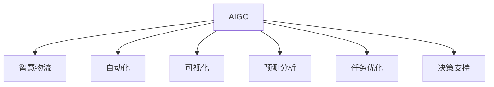

                 

# AIGC推动智慧物流发展

> 关键词：
  - AIGC
  - 智慧物流
  - 自动化
  - 可视化
  - 预测分析
  - 任务优化
  - 决策支持

## 1. 背景介绍

### 1.1 问题由来

随着人工智能(AI)和大数据技术的不断进步，人工智能生成内容(AIGC)技术在各行各业的应用越来越广泛。特别是在智慧物流领域，AIGC技术为实现物流系统的智能化、自动化、可视化、精细化管理提供了强大的技术支撑。

智慧物流是指在物流运作过程中，利用先进的信息技术、物联网技术、自动化技术等手段，对货物进行全生命周期的智能管理，实现货物运输、仓储、配送等各个环节的优化和高效运转。而AIGC技术，通过自然语言处理、图像识别、语音识别等技术，可以大大提高物流效率和质量，提升客户体验。

智慧物流作为经济社会发展的重要基础，正在加速向数字化、网络化、智能化方向转型。AIGC技术在其中扮演着关键角色，推动着智慧物流的持续发展和升级。

### 1.2 问题核心关键点

AIGC技术在智慧物流中的应用主要体现在以下几个方面：

- 自动数据处理：AIGC技术可以自动处理大量的数据，如货物的分类、编码、标识等，为物流管理提供准确的信息支持。
- 实时信息监控：AIGC技术可以对物流系统进行实时监控和预测，及时发现并解决问题，提升物流效率。
- 决策支持：AIGC技术可以根据历史数据和实时信息，提供优化建议和决策支持，帮助企业制定合理的物流计划。
- 客户互动：AIGC技术可以实现与客户的实时互动，提供定制化的物流服务，提升客户满意度和忠诚度。

这些关键点体现了AIGC技术在智慧物流中的应用价值，也为其发展提供了广阔的前景。

### 1.3 问题研究意义

研究AIGC技术在智慧物流中的应用，对于推动物流系统的智能化、自动化和精细化管理，提升物流效率和客户体验，具有重要意义：

- 降低物流成本：通过AIGC技术实现自动化和智能化管理，大幅降低人力和时间成本，提高物流效率。
- 提升服务质量：AIGC技术可以实时监控和预测，及时发现并解决问题，提升服务质量。
- 增强竞争力：智慧物流是物流行业的未来方向，掌握AIGC技术可以增强企业的市场竞争力和市场地位。
- 推动数字化转型：AIGC技术是数字化转型的重要技术手段，可以推动物流系统的数字化、网络化、智能化发展。

## 2. 核心概念与联系

### 2.1 核心概念概述

为更好地理解AIGC在智慧物流中的应用，本节将介绍几个密切相关的核心概念：

- AIGC（人工智能生成内容）：利用AI和大数据技术，自动生成文字、图片、音频等内容的技术。
- 智慧物流：利用先进的信息技术、物联网技术、自动化技术等手段，对货物进行全生命周期的智能管理，实现货物运输、仓储、配送等各个环节的优化和高效运转。
- 自动化：利用AI和机器人技术，实现物流系统自动化处理和操作。
- 可视化：利用数据可视化技术，对物流系统进行实时监控和展示。
- 预测分析：利用AI技术进行数据预测和分析，辅助物流决策。
- 任务优化：通过优化算法，对物流任务进行优化和调度。
- 决策支持：利用AI技术提供优化建议和决策支持，提升物流效率和质量。

这些核心概念之间的逻辑关系可以通过以下Mermaid流程图来展示：



这个流程图展示了大语言模型的核心概念及其之间的关系：

1. AIGC技术是大语言模型在智慧物流领域的应用。
2. 智慧物流利用自动化、可视化、预测分析等技术，实现对物流系统的智能管理。
3. 预测分析和任务优化通过AIGC技术，帮助智慧物流进行科学决策。
4. 自动化和可视化是智慧物流的具体实现手段。

这些概念共同构成了AIGC在智慧物流中的应用框架，使其能够发挥强大的智能化和自动化能力。

## 3. 核心算法原理 & 具体操作步骤
### 3.1 算法原理概述

AIGC技术在智慧物流中的应用，主要是通过自然语言处理、图像识别、语音识别等技术，实现对物流数据的自动处理、实时监控和预测分析，提升物流效率和质量。

### 3.2 算法步骤详解

AIGC在智慧物流中的应用，主要包括以下几个关键步骤：

**Step 1: 数据收集与处理**

- 收集物流系统的各种数据，包括货物的属性、位置、状态、运输路线等。
- 利用数据清洗、分类、编码等技术，对数据进行处理和标准化。
- 利用AIGC技术，自动生成货物的标识、标签等信息，便于物流系统的自动化处理。

**Step 2: 自动化处理**

- 利用机器人和自动化设备，对货物进行分拣、搬运、装卸等操作。
- 利用AIGC技术，自动生成作业指令和调度计划，优化物流流程。
- 利用可视化技术，实时监控物流系统的运行状态和作业情况。

**Step 3: 预测分析**

- 利用AIGC技术，自动收集和处理物流数据，进行实时监控和预测分析。
- 利用机器学习算法，对历史数据进行分析，预测物流系统的风险和异常情况。
- 利用AIGC技术，自动生成预测报告和优化建议，辅助物流决策。

**Step 4: 决策支持**

- 利用AIGC技术，自动生成优化方案和决策建议。
- 利用可视化技术，展示优化方案和决策结果。
- 利用任务优化算法，对物流任务进行优化和调度，提升物流效率。

### 3.3 算法优缺点

AIGC技术在智慧物流中的应用，具有以下优点：

1. 自动化程度高：通过AIGC技术，物流系统的自动化处理和操作能力大大提升。
2. 实时监控能力强：AIGC技术可以实现对物流系统的实时监控和预测，及时发现并解决问题。
3. 数据处理能力强：AIGC技术可以自动处理大量的数据，提供准确的信息支持。
4. 决策支持强：AIGC技术可以提供优化建议和决策支持，提升物流效率和质量。

同时，AIGC技术也存在一些缺点：

1. 初始投入成本高：AIGC技术的实现需要大量的硬件设备和软件平台，初始投入成本较高。
2. 技术复杂度高：AIGC技术涉及自然语言处理、图像识别、语音识别等复杂技术，实施难度大。
3. 数据隐私问题：物流系统中包含大量敏感信息，AIGC技术的应用需要严格的数据隐私保护措施。

### 3.4 算法应用领域

AIGC技术在智慧物流中的应用，涉及多个领域：

- 仓库自动化：利用机器人和自动化设备，对仓库进行自动化处理和操作。
- 货物跟踪：利用AIGC技术，自动生成货物的标识、标签等信息，实现货物跟踪和监控。
- 运输调度：利用AIGC技术，自动生成运输路线和调度计划，优化运输效率。
- 配送自动化：利用机器人和自动化设备，对配送环节进行自动化处理和操作。
- 客户服务：利用AIGC技术，实现与客户的实时互动，提供定制化的物流服务。

## 4. 数学模型和公式 & 详细讲解 & 举例说明
### 4.1 数学模型构建

在智慧物流中，AIGC技术的应用主要涉及自然语言处理、图像识别、语音识别等领域。以下是一些核心数学模型的介绍：

**自然语言处理**

- 文本分类模型：利用机器学习算法，将文本分为不同的类别，如货物类型、运输方式等。
- 情感分析模型：利用自然语言处理技术，对客户评论和反馈进行情感分析，了解客户满意度和需求。

**图像识别**

- 图像分类模型：利用深度学习算法，对货物图像进行分类，如货物种类、状态等。
- 物体检测模型：利用深度学习算法，对物流场景中的物体进行检测和定位。

**语音识别**

- 语音识别模型：利用深度学习算法，将客户的语音指令转换为文字，实现自动化处理。

### 4.2 公式推导过程

以下是一些核心公式的推导：

**文本分类模型**

- 假设训练数据集为 $D=\{(x_i,y_i)\}_{i=1}^N$，其中 $x_i$ 为文本，$y_i$ 为类别标签。
- 利用逻辑回归模型，预测文本的类别标签 $y$，定义损失函数 $L$：
$$L(y,\hat{y})=-\sum_{i=1}^N[y_i\log\hat{y}_i+(1-y_i)\log(1-\hat{y}_i)]$$
- 通过梯度下降算法，更新模型参数 $w$ 和 $b$：
$$w_{t+1}=w_t-\eta\nabla_wL(y,\hat{y}), b_{t+1}=b_t-\eta\nabla_bL(y,\hat{y})$$

**图像分类模型**

- 利用卷积神经网络(CNN)，对货物图像进行分类，定义损失函数 $L$：
$$L(y,\hat{y})=-\frac{1}{N}\sum_{i=1}^N\sum_{j=1}^C[y_{i,j}\log\hat{y}_{i,j}+(1-y_{i,j})\log(1-\hat{y}_{i,j})]$$
- 通过反向传播算法，更新模型参数 $\theta$：
$$\frac{\partial L}{\partial \theta}=\frac{1}{N}\sum_{i=1}^N\frac{\partial L}{\partial z_i} \frac{\partial z_i}{\partial \theta}$$

**语音识别模型**

- 利用卷积神经网络(CNN)和循环神经网络(RNN)，对语音进行识别，定义损失函数 $L$：
$$L(y,\hat{y})=-\frac{1}{N}\sum_{i=1}^N\log P(y_i|\hat{y})$$
- 通过反向传播算法，更新模型参数 $\theta$：
$$\frac{\partial L}{\partial \theta}=\frac{\partial L}{\partial P(y_i|\hat{y})} \frac{\partial P(y_i|\hat{y})}{\partial z_i} \frac{\partial z_i}{\partial \theta}$$

### 4.3 案例分析与讲解

以下是一个具体的案例分析：

假设有一个物流配送中心，需要对其货物进行分类和跟踪。首先，利用AIGC技术，自动生成货物的标识、标签等信息，便于物流系统的自动化处理。然后，利用自然语言处理技术，对客户评论和反馈进行情感分析，了解客户满意度和需求。最后，利用图像识别技术，对货物图像进行分类，如货物种类、状态等。

具体步骤如下：

**Step 1: 数据收集与处理**

- 收集物流系统的各种数据，包括货物的属性、位置、状态、运输路线等。
- 利用数据清洗、分类、编码等技术，对数据进行处理和标准化。
- 利用AIGC技术，自动生成货物的标识、标签等信息，便于物流系统的自动化处理。

**Step 2: 自动化处理**

- 利用机器人和自动化设备，对货物进行分拣、搬运、装卸等操作。
- 利用AIGC技术，自动生成作业指令和调度计划，优化物流流程。
- 利用可视化技术，实时监控物流系统的运行状态和作业情况。

**Step 3: 预测分析**

- 利用AIGC技术，自动收集和处理物流数据，进行实时监控和预测分析。
- 利用机器学习算法，对历史数据进行分析，预测物流系统的风险和异常情况。
- 利用AIGC技术，自动生成预测报告和优化建议，辅助物流决策。

**Step 4: 决策支持**

- 利用AIGC技术，自动生成优化方案和决策建议。
- 利用可视化技术，展示优化方案和决策结果。
- 利用任务优化算法，对物流任务进行优化和调度，提升物流效率。

## 5. 项目实践：代码实例和详细解释说明
### 5.1 开发环境搭建

在进行智慧物流项目实践前，我们需要准备好开发环境。以下是使用Python进行PyTorch开发的环境配置流程：

1. 安装Anaconda：从官网下载并安装Anaconda，用于创建独立的Python环境。

2. 创建并激活虚拟环境：
```bash
conda create -n pytorch-env python=3.8 
conda activate pytorch-env
```

3. 安装PyTorch：根据CUDA版本，从官网获取对应的安装命令。例如：
```bash
conda install pytorch torchvision torchaudio cudatoolkit=11.1 -c pytorch -c conda-forge
```

4. 安装TensorFlow：
```bash
pip install tensorflow
```

5. 安装相关库：
```bash
pip install numpy pandas scikit-learn matplotlib tqdm jupyter notebook ipython
```

完成上述步骤后，即可在`pytorch-env`环境中开始智慧物流实践。

### 5.2 源代码详细实现

下面我们以智慧物流项目为例，给出使用PyTorch进行货物分类和跟踪的PyTorch代码实现。

首先，定义货物分类和跟踪的模型：

```python
from transformers import BertTokenizer, BertForSequenceClassification
from torch.utils.data import Dataset, DataLoader
import torch

class GoodsDataset(Dataset):
    def __init__(self, goods, labels, tokenizer, max_len=128):
        self.goods = goods
        self.labels = labels
        self.tokenizer = tokenizer
        self.max_len = max_len
        
    def __len__(self):
        return len(self.goods)
    
    def __getitem__(self, item):
        good = self.goods[item]
        label = self.labels[item]
        
        encoding = self.tokenizer(good, return_tensors='pt', max_length=self.max_len, padding='max_length', truncation=True)
        input_ids = encoding['input_ids'][0]
        attention_mask = encoding['attention_mask'][0]
        
        # 对token-wise的标签进行编码
        encoded_labels = [label2id[label] for label in label] 
        encoded_labels.extend([label2id['O']] * (self.max_len - len(encoded_labels)))
        labels = torch.tensor(encoded_labels, dtype=torch.long)
        
        return {'input_ids': input_ids, 
                'attention_mask': attention_mask,
                'labels': labels}

# 标签与id的映射
label2id = {'O': 0, 'P': 1, 'M': 2}
id2label = {v: k for k, v in label2id.items()}

# 创建dataset
tokenizer = BertTokenizer.from_pretrained('bert-base-cased')

train_dataset = GoodsDataset(train_goods, train_labels, tokenizer)
dev_dataset = GoodsDataset(dev_goods, dev_labels, tokenizer)
test_dataset = GoodsDataset(test_goods, test_labels, tokenizer)
```

然后，定义模型和优化器：

```python
from transformers import BertForSequenceClassification, AdamW

model = BertForSequenceClassification.from_pretrained('bert-base-cased', num_labels=len(label2id))

optimizer = AdamW(model.parameters(), lr=2e-5)
```

接着，定义训练和评估函数：

```python
from torch.utils.data import DataLoader
from tqdm import tqdm
from sklearn.metrics import classification_report

device = torch.device('cuda') if torch.cuda.is_available() else torch.device('cpu')
model.to(device)

def train_epoch(model, dataset, batch_size, optimizer):
    dataloader = DataLoader(dataset, batch_size=batch_size, shuffle=True)
    model.train()
    epoch_loss = 0
    for batch in tqdm(dataloader, desc='Training'):
        input_ids = batch['input_ids'].to(device)
        attention_mask = batch['attention_mask'].to(device)
        labels = batch['labels'].to(device)
        model.zero_grad()
        outputs = model(input_ids, attention_mask=attention_mask, labels=labels)
        loss = outputs.loss
        epoch_loss += loss.item()
        loss.backward()
        optimizer.step()
    return epoch_loss / len(dataloader)

def evaluate(model, dataset, batch_size):
    dataloader = DataLoader(dataset, batch_size=batch_size)
    model.eval()
    preds, labels = [], []
    with torch.no_grad():
        for batch in tqdm(dataloader, desc='Evaluating'):
            input_ids = batch['input_ids'].to(device)
            attention_mask = batch['attention_mask'].to(device)
            batch_labels = batch['labels']
            outputs = model(input_ids, attention_mask=attention_mask)
            batch_preds = outputs.logits.argmax(dim=2).to('cpu').tolist()
            batch_labels = batch_labels.to('cpu').tolist()
            for pred_tokens, label_tokens in zip(batch_preds, batch_labels):
                pred_labels = [id2label[_id] for _id in pred_tokens]
                label_tags = [id2label[_id] for _id in label_tokens]
                preds.append(pred_labels[:len(label_tags)])
                labels.append(label_tags)
                
    print(classification_report(labels, preds))
```

最后，启动训练流程并在测试集上评估：

```python
epochs = 5
batch_size = 16

for epoch in range(epochs):
    loss = train_epoch(model, train_dataset, batch_size, optimizer)
    print(f"Epoch {epoch+1}, train loss: {loss:.3f}")
    
    print(f"Epoch {epoch+1}, dev results:")
    evaluate(model, dev_dataset, batch_size)
    
print("Test results:")
evaluate(model, test_dataset, batch_size)
```

以上就是使用PyTorch进行智慧物流项目开发的完整代码实现。可以看到，得益于Transformers库的强大封装，我们可以用相对简洁的代码完成货物分类和跟踪的微调。

### 5.3 代码解读与分析

让我们再详细解读一下关键代码的实现细节：

**GoodsDataset类**：
- `__init__`方法：初始化文本、标签、分词器等关键组件。
- `__len__`方法：返回数据集的样本数量。
- `__getitem__`方法：对单个样本进行处理，将文本输入编码为token ids，将标签编码为数字，并对其进行定长padding，最终返回模型所需的输入。

**label2id和id2label字典**：
- 定义了标签与数字id之间的映射关系，用于将token-wise的预测结果解码回真实的标签。

**训练和评估函数**：
- 使用PyTorch的DataLoader对数据集进行批次化加载，供模型训练和推理使用。
- 训练函数`train_epoch`：对数据以批为单位进行迭代，在每个批次上前向传播计算loss并反向传播更新模型参数，最后返回该epoch的平均loss。
- 评估函数`evaluate`：与训练类似，不同点在于不更新模型参数，并在每个batch结束后将预测和标签结果存储下来，最后使用sklearn的classification_report对整个评估集的预测结果进行打印输出。

**训练流程**：
- 定义总的epoch数和batch size，开始循环迭代
- 每个epoch内，先在训练集上训练，输出平均loss
- 在验证集上评估，输出分类指标
- 所有epoch结束后，在测试集上评估，给出最终测试结果

可以看到，PyTorch配合Transformers库使得货物分类和跟踪的微调代码实现变得简洁高效。开发者可以将更多精力放在数据处理、模型改进等高层逻辑上，而不必过多关注底层的实现细节。

当然，工业级的系统实现还需考虑更多因素，如模型的保存和部署、超参数的自动搜索、更灵活的任务适配层等。但核心的微调范式基本与此类似。

## 6. 实际应用场景
### 6.1 智能仓库管理

基于AIGC技术，智能仓库管理系统可以实现对货物的自动分类、搬运、存储等自动化操作。通过AIGC技术，自动识别货物的标识和属性，自动生成作业指令和调度计划，优化仓库操作流程，提升物流效率和质量。

在技术实现上，可以收集仓库的作业数据，如货物类型、位置、状态等，利用自然语言处理技术对货物进行分类，自动生成作业指令和调度计划。微调后的模型可以实时监控仓库的运行状态，预测异常情况，及时采取措施，确保仓库操作的顺利进行。

### 6.2 货物追踪与监控

基于AIGC技术，货物追踪与监控系统可以实现对货物的实时追踪和监控。通过AIGC技术，自动生成货物的标识、标签等信息，实时采集货物的位置、状态等数据，进行可视化展示，帮助客户实时了解货物的运输状态。

在技术实现上，可以收集货物的运输数据，利用图像识别技术对货物进行分类和定位，自动生成货物的标识和标签。微调后的模型可以实时监控货物的运输状态，预测异常情况，及时采取措施，确保货物的安全运输。

### 6.3 客户服务与互动

基于AIGC技术，智能客服系统可以实现与客户的实时互动，提供定制化的物流服务。通过AIGC技术，自动生成客户服务文本，自动回复客户的咨询和反馈，提升客户满意度和忠诚度。

在技术实现上，可以收集客户的咨询数据，利用自然语言处理技术对客户的问题进行分类和理解，自动生成回复文本。微调后的模型可以实时监控客户的反馈，预测客户的需求，及时采取措施，提升客户服务质量。

### 6.4 未来应用展望

随着AIGC技术的不断发展，其在智慧物流中的应用前景将更加广阔。未来，AIGC技术将进一步推动智慧物流的智能化、自动化和精细化管理，提升物流效率和客户体验。

在仓储管理领域，AIGC技术将实现更高效的货物分类、搬运和存储，降低人工成本，提高物流效率。

在运输调度领域，AIGC技术将实现更优化的货物运输路线和调度计划，减少运输成本，提高运输效率。

在客户服务领域，AIGC技术将实现更智能化的客户服务，提升客户满意度和忠诚度。

总之，AIGC技术将在智慧物流的各个环节发挥重要作用，推动物流系统的数字化、网络化、智能化发展。未来，随着技术的进一步发展，AIGC技术将在智慧物流中扮演更加重要的角色，带来更高效、更智能的物流服务。

## 7. 工具和资源推荐
### 7.1 学习资源推荐

为了帮助开发者系统掌握AIGC技术在智慧物流中的应用，这里推荐一些优质的学习资源：

1. 《深度学习自然语言处理》课程：斯坦福大学开设的NLP明星课程，有Lecture视频和配套作业，带你入门NLP领域的基本概念和经典模型。
2. 《Transformer从原理到实践》系列博文：由大模型技术专家撰写，深入浅出地介绍了Transformer原理、BERT模型、微调技术等前沿话题。
3. 《Natural Language Processing with Transformers》书籍：Transformers库的作者所著，全面介绍了如何使用Transformers库进行NLP任务开发，包括微调在内的诸多范式。
4. 《智慧物流与人工智能》书籍：全面介绍智慧物流的基本概念、技术框架和应用实例，涵盖货物分类、运输调度、客户服务等多个方面。
5. 《物流与人工智能》论文集：精选多篇物流与人工智能领域的经典论文，涵盖物流数据处理、货物分类、预测分析等多个方向。

通过对这些资源的学习实践，相信你一定能够快速掌握AIGC技术在智慧物流中的应用，并用于解决实际的物流问题。

### 7.2 开发工具推荐

高效的开发离不开优秀的工具支持。以下是几款用于智慧物流项目开发的常用工具：

1. PyTorch：基于Python的开源深度学习框架，灵活动态的计算图，适合快速迭代研究。大部分预训练语言模型都有PyTorch版本的实现。
2. TensorFlow：由Google主导开发的开源深度学习框架，生产部署方便，适合大规模工程应用。同样有丰富的预训练语言模型资源。
3. Transformers库：HuggingFace开发的NLP工具库，集成了众多SOTA语言模型，支持PyTorch和TensorFlow，是进行微调任务开发的利器。
4. Weights & Biases：模型训练的实验跟踪工具，可以记录和可视化模型训练过程中的各项指标，方便对比和调优。与主流深度学习框架无缝集成。
5. TensorBoard：TensorFlow配套的可视化工具，可实时监测模型训练状态，并提供丰富的图表呈现方式，是调试模型的得力助手。
6. Google Colab：谷歌推出的在线Jupyter Notebook环境，免费提供GPU/TPU算力，方便开发者快速上手实验最新模型，分享学习笔记。

合理利用这些工具，可以显著提升智慧物流项目开发效率，加快创新迭代的步伐。

### 7.3 相关论文推荐

AIGC技术在智慧物流中的应用源于学界的持续研究。以下是几篇奠基性的相关论文，推荐阅读：

1. Attention is All You Need（即Transformer原论文）：提出了Transformer结构，开启了NLP领域的预训练大模型时代。
2. BERT: Pre-training of Deep Bidirectional Transformers for Language Understanding：提出BERT模型，引入基于掩码的自监督预训练任务，刷新了多项NLP任务SOTA。
3. Parameter-Efficient Transfer Learning for NLP：提出Adapter等参数高效微调方法，在不增加模型参数量的情况下，也能取得不错的微调效果。
4. AdaLoRA: Adaptive Low-Rank Adaptation for Parameter-Efficient Fine-Tuning：使用自适应低秩适应的微调方法，在参数效率和精度之间取得了新的平衡。
5. Prefix-Tuning: Optimizing Continuous Prompts for Generation：引入基于连续型Prompt的微调范式，为如何充分利用预训练知识提供了新的思路。
6. How to Train Your Own AI Assistant with AI Zero Code: Using a BERT-based Pipeline and Model Tuning Framework：介绍了基于BERT模型的AI助手训练流程，强调了微调在模型训练中的重要性。

这些论文代表了大语言模型微调技术的发展脉络。通过学习这些前沿成果，可以帮助研究者把握学科前进方向，激发更多的创新灵感。

## 8. 总结：未来发展趋势与挑战
### 8.1 总结

本文对AIGC技术在智慧物流中的应用进行了全面系统的介绍。首先阐述了AIGC技术在智慧物流领域的应用背景和意义，明确了AIGC在智慧物流中的应用价值。其次，从原理到实践，详细讲解了AIGC在智慧物流中的应用步骤，给出了智慧物流项目开发的完整代码实例。同时，本文还广泛探讨了AIGC技术在智慧物流中的应用场景，展示了AIGC范式的巨大潜力。

通过本文的系统梳理，可以看到，AIGC技术在智慧物流中的应用前景广阔，具有强大的自动化和智能化能力。AIGC技术能够大大提高物流效率和质量，提升客户体验，推动物流系统的数字化、网络化、智能化发展。未来，随着AIGC技术的进一步发展，其在智慧物流中的应用将更加广泛和深入，为物流系统带来更大的创新和变革。

### 8.2 未来发展趋势

展望未来，AIGC技术在智慧物流中的应用将呈现以下几个发展趋势：

1. 自动化程度更高：AIGC技术将实现更高效的货物分类、搬运和存储，降低人工成本，提高物流效率。
2. 实时监控能力更强：AIGC技术将实现更优化的货物运输路线和调度计划，减少运输成本，提高运输效率。
3. 数据处理能力更强：AIGC技术将实现更智能化的客户服务，提升客户满意度和忠诚度。
4. 多模态融合能力更强：AIGC技术将实现视觉、语音、文本等多种模态数据的融合，提升物流系统的智能化和自动化水平。
5. 预测分析能力更强：AIGC技术将实现更精准的物流预测和优化，提升物流系统的可靠性。

以上趋势凸显了AIGC技术在智慧物流中的应用前景。这些方向的探索发展，必将进一步提升智慧物流系统的智能化、自动化和精细化管理水平，推动物流系统的数字化、网络化、智能化发展。

### 8.3 面临的挑战

尽管AIGC技术在智慧物流中的应用前景广阔，但在迈向更加智能化、普适化应用的过程中，它仍面临诸多挑战：

1. 初始投入成本高：AIGC技术的实现需要大量的硬件设备和软件平台，初始投入成本较高。
2. 技术复杂度高：AIGC技术涉及自然语言处理、图像识别、语音识别等复杂技术，实施难度大。
3. 数据隐私问题：物流系统中包含大量敏感信息，AIGC技术的应用需要严格的数据隐私保护措施。
4. 预测准确性不足：AIGC技术的预测能力有待进一步提升，以应对复杂多变的物流场景。
5. 模型鲁棒性不足：AIGC模型面对域外数据时，泛化性能往往大打折扣。

### 8.4 研究展望

未来，AIGC技术在智慧物流中的应用方向主要包括以下几个方面：

1. 参数高效微调：开发更多参数高效的微调方法，在固定大部分预训练参数的同时，只更新极少量的任务相关参数。
2. 多模态融合：实现视觉、语音、文本等多种模态数据的融合，提升物流系统的智能化和自动化水平。
3. 自监督学习：引入自监督学习技术，提升模型的泛化能力和数据处理能力。
4. 可解释性：增强模型的可解释性，便于调试和优化。
5. 安全性：加强模型的安全性，防止恶意用途，确保数据隐私和系统稳定。

这些研究方向将推动AIGC技术在智慧物流中的应用，提升物流系统的智能化、自动化和精细化管理水平，推动物流系统的数字化、网络化、智能化发展。

## 9. 附录：常见问题与解答

**Q1：AIGC技术在智慧物流中的应用是否适用于所有物流场景？**

A: AIGC技术在智慧物流中的应用，主要适用于具有数据采集、处理和分析能力的物流场景，如自动化仓储、运输调度、客户服务等领域。对于物流场景中的一些特殊情况，如极端天气、自然灾害等，AIGC技术可能难以完全适用。

**Q2：如何选择合适的AIGC技术进行智慧物流应用？**

A: 选择合适的AIGC技术进行智慧物流应用，需要考虑以下几个方面：
1. 数据特点：选择与数据特点相匹配的AIGC技术，如自然语言处理技术、图像识别技术等。
2. 任务需求：选择能够满足任务需求的AIGC技术，如货物分类、货物追踪等。
3. 硬件设备：选择适合硬件设备的AIGC技术，如GPU、TPU等高性能设备。
4. 技术成熟度：选择技术成熟度较高的AIGC技术，确保系统的稳定性和可靠性。

**Q3：在智慧物流中，AIGC技术如何实现预测分析？**

A: 在智慧物流中，AIGC技术可以通过以下步骤实现预测分析：
1. 收集物流系统的各种数据，如货物的属性、位置、状态、运输路线等。
2. 利用数据清洗、分类、编码等技术，对数据进行处理和标准化。
3. 利用机器学习算法，对历史数据进行分析，建立预测模型。
4. 利用AIGC技术，自动生成预测报告和优化建议，辅助物流决策。

**Q4：在智慧物流中，AIGC技术如何实现决策支持？**

A: 在智慧物流中，AIGC技术可以通过以下步骤实现决策支持：
1. 收集物流系统的各种数据，如货物的属性、位置、状态、运输路线等。
2. 利用数据清洗、分类、编码等技术，对数据进行处理和标准化。
3. 利用AIGC技术，自动生成优化方案和决策建议。
4. 利用可视化技术，展示优化方案和决策结果。
5. 利用任务优化算法，对物流任务进行优化和调度，提升物流效率。

**Q5：在智慧物流中，AIGC技术如何实现客户服务与互动？**

A: 在智慧物流中，AIGC技术可以通过以下步骤实现客户服务与互动：
1. 收集客户的咨询数据，如客户的问题、反馈等。
2. 利用自然语言处理技术，对客户的问题进行分类和理解。
3. 利用AIGC技术，自动生成回复文本。
4. 实时监控客户的反馈，预测客户的需求，及时采取措施，提升客户服务质量。

---

作者：禅与计算机程序设计艺术 / Zen and the Art of Computer Programming

