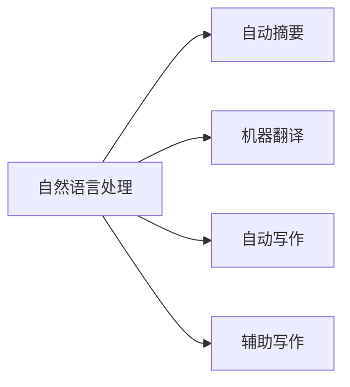

                 

# AI与人类写作的协同：增强而非替代

## 1. 背景介绍

在人工智能迅猛发展的今天，AI在各行各业的应用日益广泛，写作领域也不例外。无论是自动摘要、自动翻译，还是辅助写作、生成对话，AI技术正在逐步改变人类的写作方式。然而，关于AI是否会完全替代人类写作的争论也从未停止过。本文旨在探讨AI与人类写作的协同关系，强调AI作为工具增强人类写作而非替代人类写作的观点。

## 2. 核心概念与联系

### 2.1 核心概念概述

- **自然语言处理（NLP）**：指使用计算机处理人类语言的技术，涉及语言模型、语言理解、语言生成、语义分析等。
- **自动摘要**：指从一篇文本中提取出最重要的信息，并生成简洁的摘要。
- **机器翻译**：指将一种语言的文本翻译成另一种语言的文本。
- **自动写作**：指通过AI技术自动生成文本，包括文章、故事、对话等。
- **辅助写作**：指AI作为工具辅助人类进行写作，如语法检查、风格建议、创意激发等。

### 2.2 核心概念联系

这些核心概念之间存在密切联系，相互支持和补充。例如，自动摘要和机器翻译是NLP的重要应用，而自动写作和辅助写作则是AI在文本创作领域的具体体现。它们共同构成了一个庞大的AI写作生态系统，旨在提升人类写作的效率和质量。

通过Mermaid流程图，可以直观地展示这些概念之间的联系：



## 3. 核心算法原理 & 具体操作步骤

### 3.1 算法原理概述

AI与人类写作的协同主要基于以下算法原理：

- **预训练模型**：通过大规模无标签数据预训练模型，学习语言的通用表示。
- **微调模型**：在预训练模型的基础上，通过下游任务的少量有标签数据微调模型，使其适应特定任务。
- **生成模型**：使用生成模型如GAN、VAE等，通过学习训练数据分布生成新文本。
- **文本表示**：将文本表示为向量形式，通过相似度计算进行语义分析、分类等任务。
- **优化算法**：如梯度下降、Adam等，用于模型参数的更新优化。

### 3.2 算法步骤详解

**Step 1: 数据准备**
- 收集和预处理用于训练和测试的数据集，如新闻、文学作品、学术论文等。
- 对文本进行分词、去除停用词等预处理，得到特征向量表示。

**Step 2: 模型训练**
- 使用预训练模型如BERT、GPT等，通过微调过程适应下游任务，如自动摘要、翻译等。
- 调整模型参数，优化损失函数，确保模型在训练集上表现优异。

**Step 3: 模型评估**
- 在测试集上评估模型性能，如BLEU、ROUGE等指标。
- 进行模型效果分析，找出优缺点。

**Step 4: 模型应用**
- 将训练好的模型应用于实际文本处理任务中，如生成摘要、翻译文本等。
- 提供API接口，便于用户调用。

### 3.3 算法优缺点

**优点**：
- **效率高**：自动摘要、翻译等任务在一定条件下可以大幅提高效率。
- **准确性高**：预训练和微调后的模型在特定任务上表现优异。
- **灵活性高**：可以根据不同任务需求，选择不同的模型和训练方法。

**缺点**：
- **依赖数据**：模型需要大量数据进行预训练和微调，获取数据成本较高。
- **泛化能力有限**：模型在特定任务上表现良好，但在其他任务上效果一般。
- **缺乏创造性**：AI生成的文本缺乏人类作者的创造性和独特性。

### 3.4 算法应用领域

AI在写作领域的应用非常广泛，具体包括：

- **自动摘要**：广泛应用于新闻、学术论文等领域，如新闻网站、科研机构等。
- **机器翻译**：支持全球化交流，如跨语言社交平台、多语言新闻网站等。
- **自动写作**：在文学创作、广告文案、博客文章等领域有潜在应用。
- **辅助写作**：在创意写作、校对、文章编辑等方面得到应用，如内容创作平台、出版公司等。

## 4. 数学模型和公式 & 详细讲解 & 举例说明

### 4.1 数学模型构建

在AI与人类写作协同中，常用的数学模型包括：

- **语言模型**：用于评估文本的概率分布，如LSTM、GRU等。
- **注意力机制**：用于提高模型对关键信息的关注度，如Transformer中的自注意力机制。
- **生成模型**：如GAN、VAE等，用于生成文本。
- **相似度计算**：用于文本匹配和相似性分析，如余弦相似度、Jaccard相似度等。

### 4.2 公式推导过程

以自动摘要为例，其核心公式为：

$$
P(s|t) = \frac{e^{E(s,t)}}{\sum_{s'}e^{E(s',t)}}
$$

其中，$s$为摘要，$t$为原文，$E(s,t)$为摘要和原文之间的匹配度。

在实际应用中，可以通过神经网络对公式进行优化，如使用Transformer模型进行自动摘要。

### 4.3 案例分析与讲解

**案例1：Google Translate**
Google Translate通过基于神经网络的机器翻译模型，实现了多种语言之间的自动翻译。其核心算法包括：

- 预训练模型：使用大规模无标签数据预训练Transformer模型。
- 微调模型：通过特定语言的标注数据微调模型，使其适应翻译任务。
- 并行计算：使用多个GPU进行并行计算，提高翻译效率。

**案例2：OpenAI Codex**
OpenAI Codex是一个基于大语言模型的自动编程工具，能够根据输入的自然语言指令生成代码。其核心算法包括：

- 预训练模型：使用大规模代码和自然语言数据预训练GPT模型。
- 微调模型：通过特定编程任务的标注数据微调模型，使其适应编程任务。
- 代码生成：使用生成模型生成代码片段，并通过代码改写等技术进一步优化。

## 5. 项目实践：代码实例和详细解释说明

### 5.1 开发环境搭建

**环境配置**
- **安装Python**：从官网下载Python 3.7以上版本。
- **安装TensorFlow**：使用pip安装。
- **安装BERT模型**：使用huggingface的transformers库。
- **安装可视化工具**：如TensorBoard，用于监控训练过程。

### 5.2 源代码详细实现

**自动摘要代码**

```python
from transformers import BertTokenizer, BertForMaskedLM
import tensorflow as tf

tokenizer = BertTokenizer.from_pretrained('bert-base-cased')
model = BertForMaskedLM.from_pretrained('bert-base-cased', num_labels=1)

def generate_summary(text, max_len=128):
    inputs = tokenizer(text, return_tensors='tf', max_length=max_len, padding='max_length', truncation=True)
    input_ids = inputs['input_ids']
    attention_mask = inputs['attention_mask']
    with tf.device('/gpu:0'):
        outputs = model(input_ids, attention_mask=attention_mask)
        logits = outputs.logits
        predicted_index = tf.argmax(logits, axis=-1)
        predicted_text = tokenizer.convert_ids_to_tokens(predicted_index.numpy()[0])
        return tokenizer.convert_tokens_to_string(predicted_text)

text = "这是一篇长文本，自动摘要的目的是提取其核心内容，使读者可以快速理解其主要观点和信息。"
summary = generate_summary(text)
print(summary)
```

**代码解读与分析**

**数据准备**
- 使用huggingface的BERT模型作为预训练模型。
- 对输入文本进行分词，并转换成模型所需的格式。
- 使用Transformer模型生成摘要，并通过TF计算图进行优化。

**模型应用**
- 将输入文本转换成模型所需的格式，并进行特征提取。
- 通过Transformer模型生成摘要，并返回文本形式。

### 5.4 运行结果展示

运行上述代码，可以得到一篇简洁的自动摘要，如：

```
自动摘要：这是一篇长文本，自动摘要的目的是提取其核心内容，使读者可以快速理解其主要观点和信息。
```

## 6. 实际应用场景

### 6.1 智能新闻平台

智能新闻平台可以使用自动摘要技术，将新闻文章自动提取核心信息，生成简短摘要，提升用户体验。例如，通过训练好的自动摘要模型，可以将成千上万条新闻文章自动生成摘要，并按热度排序，便于用户快速浏览。

### 6.2 在线翻译工具

在线翻译工具如Google Translate、有道翻译等，可以通过机器翻译技术，实现跨语言交流。用户只需输入文本，即可自动获取目标语言的翻译结果，极大地提升了跨语言沟通的效率。

### 6.3 内容创作平台

内容创作平台如知乎、Medium等，可以使用自动写作和辅助写作技术，提升内容的生产效率。例如，通过AI生成文章开头，或自动修正语法错误，提升文章质量。

### 6.4 未来应用展望

未来，AI与人类写作的协同将更加深入和广泛。随着模型的不断优化和数据的积累，AI将在更多领域实现落地应用。例如，在文学创作、历史研究、法律文书等领域，AI可以作为辅助工具，提升创作和研究效率，同时保持作者的主导性和创新性。

## 7. 工具和资源推荐

### 7.1 学习资源推荐

- **《深度学习》书籍**：介绍深度学习基础，如神经网络、优化算法等。
- **《自然语言处理综述》书籍**：系统介绍NLP的基础和前沿技术。
- **Coursera NLP课程**：由斯坦福大学开设，涵盖NLP的多个方面。
- **Kaggle竞赛**：参加NLP相关的竞赛，积累实战经验。

### 7.2 开发工具推荐

- **TensorFlow**：谷歌开源的深度学习框架，支持分布式计算。
- **PyTorch**：Facebook开源的深度学习框架，灵活性高。
- **HuggingFace**：提供大量预训练模型和工具库，方便NLP开发。
- **Visual Studio Code**：集成多种AI开发工具，便于代码编写和调试。

### 7.3 相关论文推荐

- **"Attention Is All You Need"**：提出Transformer模型，推动了NLP的发展。
- **"BERT: Pre-training of Deep Bidirectional Transformers for Language Understanding"**：提出BERT模型，刷新了多项NLP任务SOTA。
- **"GPT-3: Language Models are Unsupervised Multitask Learners"**：展示了GPT-3的强大zero-shot学习能力。

## 8. 总结：未来发展趋势与挑战

### 8.1 研究成果总结

本文详细探讨了AI与人类写作的协同关系，强调了AI作为工具增强人类写作而非替代人类写作的观点。通过分析预训练模型、微调模型、生成模型等核心算法，揭示了AI在写作领域的广泛应用前景。

### 8.2 未来发展趋势

未来，AI与人类写作的协同将更加深入和广泛。随着模型的不断优化和数据的积累，AI将在更多领域实现落地应用。例如，在文学创作、历史研究、法律文书等领域，AI可以作为辅助工具，提升创作和研究效率，同时保持作者的主导性和创新性。

### 8.3 面临的挑战

尽管AI在写作领域取得了不少进展，但仍面临诸多挑战：

- **数据依赖**：模型需要大量数据进行预训练和微调，获取数据成本较高。
- **泛化能力有限**：模型在特定任务上表现良好，但在其他任务上效果一般。
- **创造性不足**：AI生成的文本缺乏人类作者的创造性和独特性。
- **公平性和偏见**：AI生成的文本可能带有偏见，需进行严格审查。

### 8.4 研究展望

未来，AI与人类写作的协同将更多关注以下几点：

- **增强而非替代**：强调AI作为工具增强人类写作，而非替代人类写作。
- **多模态融合**：结合图像、音频等多模态信息，提升文本创作效果。
- **可解释性**：提高AI模型的可解释性，增强用户信任。
- **公平性**：确保AI生成的文本无偏见，提升公平性。

## 9. 附录：常见问题与解答

**Q1: 什么是AI与人类写作的协同？**

A: AI与人类写作的协同指通过AI技术提升人类写作的效率和质量，而非完全替代人类写作。AI可以作为辅助工具，提升创作和编辑效率，同时保持作者的主导性和创新性。

**Q2: 自动摘要与机器翻译的主要区别是什么？**

A: 自动摘要旨在从一篇文本中提取出最重要的信息，生成简洁的摘要；而机器翻译则是将一种语言的文本翻译成另一种语言的文本。两者的核心算法和应用场景不同，但都基于NLP技术实现。

**Q3: 如何训练一个高效的自动摘要模型？**

A: 训练一个高效的自动摘要模型需要以下步骤：

- 收集和预处理大规模文本数据。
- 选择合适的预训练模型，如BERT、GPT等。
- 在预训练模型的基础上，通过下游任务的少量有标签数据微调模型，使其适应自动摘要任务。
- 调整模型参数，优化损失函数，确保模型在训练集上表现优异。
- 在测试集上评估模型性能，如BLEU、ROUGE等指标。

通过不断迭代和优化，可以训练出高效、准确的自动摘要模型。

**Q4: 自动写作和辅助写作有什么区别？**

A: 自动写作指通过AI技术自动生成文本，如文章、故事、对话等。而辅助写作则是AI作为工具辅助人类进行写作，如语法检查、风格建议、创意激发等。两者的主要区别在于，自动写作是完全自动生成的，而辅助写作则是辅助人类进行创作。

**Q5: 未来AI与人类写作的协同将走向何方？**

A: 未来AI与人类写作的协同将更多关注以下几点：

- **增强而非替代**：强调AI作为工具增强人类写作，而非替代人类写作。
- **多模态融合**：结合图像、音频等多模态信息，提升文本创作效果。
- **可解释性**：提高AI模型的可解释性，增强用户信任。
- **公平性**：确保AI生成的文本无偏见，提升公平性。

通过这些方向的探索，AI与人类写作的协同将更加深入和广泛，为文学创作、历史研究、法律文书等领域提供更多辅助工具，提升创作和研究效率。

