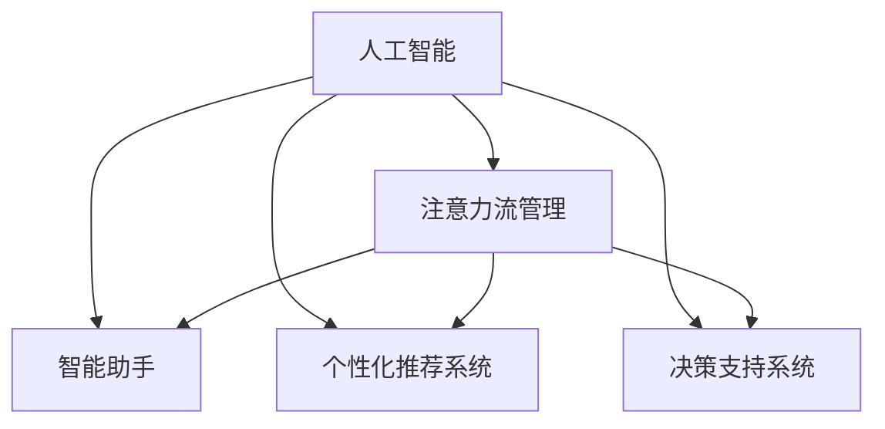

                 

# AI与人类注意力流：未来的工作、技能与注意力流管理技术的应用前景分析

> 关键词：人工智能,注意力流管理,未来工作,技能发展,智能助手

## 1. 背景介绍

### 1.1 问题由来

在数字时代，信息的爆炸式增长极大地改变了人们的工作、学习和生活方式。人类作为信息的接收者和处理者，如何在海量信息中筛选、理解和应用，成为了一项复杂的认知任务。同时，数字化办公、远程协作等新工作形态也带来了新的挑战，如工作效率下降、工作压力大等问题。

人工智能技术的兴起，特别是智能助手、推荐系统等技术的出现，为我们提供了新的解决思路。智能助手通过理解和分析人类注意力流（Attention Flows），可以帮助用户更好地处理信息，提升工作效率，减轻工作压力。因此，研究和探索注意力流管理技术，成为了优化数字时代工作和生活方式的重要课题。

### 1.2 问题核心关键点

注意力流管理技术的目标在于通过智能分析用户的行为和偏好，预测其注意力流动的方向和强度，从而在合适的时间节点提供相关的信息和服务。核心关键点包括：

1. 用户行为和偏好的建模：通过收集和分析用户的行为数据，构建用户画像，了解其注意力分布规律。
2. 注意力流的预测和分析：利用机器学习算法，对用户的注意力流动进行预测和分析，识别出注意力高峰期和低谷期。
3. 个性化信息推荐和决策辅助：根据用户当前和未来的注意力需求，推荐相关的信息和决策建议，提升用户的工作效率和决策质量。
4. 自动化工作流程管理：通过智能分析和预测，自动化管理用户的日程安排和工作流程，减轻用户的工作负担。

## 2. 核心概念与联系

### 2.1 核心概念概述

为更好地理解注意力流管理技术，本节将介绍几个密切相关的核心概念：

- 人工智能(Artificial Intelligence, AI)：通过模拟人类的智能行为，使用算法和数据训练模型，使得机器能够完成各种复杂的任务。
- 注意力流(Attention Flows)：描述人类在不同时间、不同任务上的注意力分布，可以是任务执行的时间分配、信息检索的次数、文档阅读的时间等。
- 智能助手(Intelligent Assistant)：基于自然语言处理和机器学习技术的系统，可以理解和回答用户的问题，提供个性化的服务和决策建议。
- 个性化推荐系统(Personalized Recommendation System)：通过分析用户的历史行为和偏好，推荐符合用户兴趣的资源，如新闻、音乐、视频等。
- 决策支持系统(Decision Support System, DSS)：结合人工智能和大数据分析，为决策者提供基于数据和算法的信息和建议，辅助决策。

这些核心概念之间的逻辑关系可以通过以下Mermaid流程图来展示：



这个流程图展示了几类人工智能应用及其与注意力流管理的联系：

1. 人工智能通过学习和分析用户行为数据，帮助管理注意力流。
2. 智能助手、个性化推荐系统和决策支持系统都可以应用注意力流管理技术，提升用户体验和决策质量。

## 3. 核心算法原理 & 具体操作步骤
### 3.1 算法原理概述

注意力流管理技术通过深度学习模型，对用户的行为数据进行分析和建模，预测用户的注意力流动方向和强度。其核心思想是：

- 利用时间序列数据，预测用户的注意力变化规律。
- 利用自然语言处理技术，理解用户的意图和需求。
- 结合上下文信息，推荐相关的资源和服务。

通过这一流程，系统能够实时调整信息流向，提升用户的工作效率和满意度。

### 3.2 算法步骤详解

基于深度学习技术的注意力流管理算法主要包括以下几个步骤：

**Step 1: 数据准备与预处理**
- 收集用户的行为数据，包括点击次数、阅读时间、回复次数等。
- 对数据进行清洗和预处理，如缺失值填充、异常值处理等。
- 将时间序列数据进行归一化处理，便于后续模型的输入。

**Step 2: 特征提取与建模**
- 利用特征工程技术，将原始数据转化为模型可用的特征表示。
- 使用LSTM、GRU等时间序列模型，对用户的行为数据进行建模，预测其注意力流动。
- 结合用户画像信息，如兴趣标签、职业角色等，进一步提升模型的预测准确率。

**Step 3: 信息推荐与决策辅助**
- 根据注意力流预测结果，推荐相关的信息和服务。
- 结合上下文信息，如当前时间、天气、用户位置等，进行动态推荐。
- 利用强化学习技术，不断优化推荐策略，提升用户满意度。
- 提供决策辅助工具，如智能日程安排、工作流程优化等，帮助用户更高效地完成工作。

**Step 4: 反馈与持续优化**
- 收集用户的反馈信息，如满意度、评价等。
- 利用在线学习算法，对模型进行动态调整，持续优化推荐效果。
- 定期更新用户画像，保持与用户行为的同步。

### 3.3 算法优缺点

注意力流管理技术具有以下优点：
1. 实时性：能够实时分析用户的注意力流，提供即时的服务和决策支持。
2. 个性化：通过学习用户的兴趣和行为，提供个性化的信息和推荐。
3. 效率提升：提升用户的工作效率，减轻其工作负担。
4. 智能化：利用人工智能技术，提升决策质量和用户体验。

同时，该技术也存在以下局限性：
1. 数据隐私问题：用户行为数据的收集和分析可能涉及隐私风险，需采取严格的隐私保护措施。
2. 模型泛化能力：模型对新数据的适应能力有限，可能存在过拟合风险。
3. 用户依赖：过度依赖智能系统可能导致用户自主性下降，失去独立思考的能力。
4. 系统复杂性：构建和维护复杂的推荐系统，需要大量的人力和技术投入。

尽管存在这些局限性，但就目前而言，注意力流管理技术在提升用户体验和提高工作效率方面，已经展现出巨大的潜力。未来，相关研究将致力于解决这些挑战，进一步提升系统的性能和可靠性。

### 3.4 算法应用领域

注意力流管理技术已经在多个领域得到广泛应用，包括但不限于：

- 企业办公：通过智能助手和推荐系统，提升企业员工的工作效率和满意度。
- 教育培训：利用智能推荐系统，提供个性化的学习资源，提升学习效果。
- 电子商务：通过推荐系统，提升用户的购物体验，增加销售额。
- 金融服务：利用决策支持系统，为投资者提供基于数据分析的投资建议，降低风险。
- 医疗健康：结合智能推荐和决策支持，提升医疗服务的质量和效率。

这些应用场景展示了注意力流管理技术的广泛应用价值，未来，随着技术的不断进步，其应用范围将进一步拓展。

## 4. 数学模型和公式 & 详细讲解 & 举例说明
### 4.1 数学模型构建

本节将使用数学语言对注意力流管理技术的核心算法进行更加严格的刻画。

记用户行为数据为 $X_t$，其中 $t$ 表示时间，$X_t$ 包括用户点击次数、阅读时间、回复次数等。记用户画像信息为 $Y$，包括用户的兴趣标签、职业角色等。记模型的预测结果为 $\hat{Y}_t$，即用户在第 $t$ 时刻的注意力强度。

定义模型的损失函数为：

$$
\mathcal{L} = \sum_{t=1}^T (\ell(X_t, \hat{Y}_t) + \lambda \ell(Y, \hat{Y}_t))
$$

其中 $\ell(X_t, \hat{Y}_t)$ 为预测误差，$\ell(Y, \hat{Y}_t)$ 为用户画像与预测结果的拟合误差。$\lambda$ 为正则化系数。

### 4.2 公式推导过程

以下我们以预测用户点击次数为例，推导LSTM模型的预测公式及其梯度计算。

假设用户点击次数序列为 $C_t$，定义LSTM模型为：

$$
\begin{aligned}
\text{LSTM}_{c}(X_t) &= \text{softmax}(W_C [C_{t-1}, X_t]) \\
&= \text{softmax}(W_C [C_{t-1}, X_t]) 
\end{aligned}
$$

其中 $W_C$ 为可训练参数，$C_{t-1}$ 为前一时刻的点击次数，$X_t$ 为当前时刻的行为数据。

模型的损失函数为：

$$
\mathcal{L} = \sum_{t=1}^T -C_t \log \hat{C}_t
$$

其中 $\hat{C}_t$ 为模型的预测点击次数。

根据链式法则，损失函数对 $W_C$ 的梯度为：

$$
\frac{\partial \mathcal{L}}{\partial W_C} = -\sum_{t=1}^T \frac{\partial \log \hat{C}_t}{\partial \hat{C}_t} \frac{\partial \hat{C}_t}{\partial W_C}
$$

通过反向传播算法，可以得到 $W_C$ 的更新公式：

$$
W_C \leftarrow W_C - \eta \frac{\partial \mathcal{L}}{\partial W_C}
$$

其中 $\eta$ 为学习率。

### 4.3 案例分析与讲解

在实际应用中，用户点击次数序列 $C_t$ 可能受到多种因素的影响，如时间、事件、用户状态等。因此，LSTM模型需要结合其他特征进行联合预测。

以电商平台的商品推荐为例，考虑用户点击次数序列 $C_t$、浏览次数序列 $V_t$、购买次数序列 $P_t$ 和用户画像信息 $Y$。利用多输入LSTM模型，可以综合考虑这些因素，对用户的点击行为进行预测。模型的损失函数变为：

$$
\mathcal{L} = \sum_{t=1}^T -C_t \log \hat{C}_t - V_t \log \hat{V}_t - P_t \log \hat{P}_t - \lambda \ell(Y, \hat{Y}_t)
$$

其中 $\hat{C}_t$、$\hat{V}_t$、$\hat{P}_t$ 分别为模型对点击次数、浏览次数、购买次数的预测结果，$\hat{Y}_t$ 为用户画像与预测结果的拟合结果。

通过优化上述损失函数，可以训练出一个综合考虑行为和画像信息的推荐模型，提升用户点击和购买行为预测的准确性。

## 5. 项目实践：代码实例和详细解释说明
### 5.1 开发环境搭建

在进行注意力流管理系统的开发前，我们需要准备好开发环境。以下是使用Python进行TensorFlow和Keras开发的环境配置流程：

1. 安装Anaconda：从官网下载并安装Anaconda，用于创建独立的Python环境。

2. 创建并激活虚拟环境：
```bash
conda create -n tf-env python=3.8 
conda activate tf-env
```

3. 安装TensorFlow和Keras：根据CUDA版本，从官网获取对应的安装命令。例如：
```bash
conda install tensorflow=2.7
conda install keras=2.7
```

4. 安装各类工具包：
```bash
pip install numpy pandas scikit-learn matplotlib tqdm jupyter notebook ipython
```

完成上述步骤后，即可在`tf-env`环境中开始注意力流管理系统的开发。

### 5.2 源代码详细实现

下面我们以电商平台的商品推荐系统为例，给出使用TensorFlow和Keras对LSTM模型进行训练的Python代码实现。

首先，定义训练集和测试集：

```python
from tensorflow.keras.datasets import mnist
from tensorflow.keras.models import Sequential
from tensorflow.keras.layers import LSTM, Dense, Input
from tensorflow.keras.optimizers import Adam
import numpy as np

# 加载MNIST数据集
(x_train, y_train), (x_test, y_test) = mnist.load_data()

# 数据预处理
x_train = x_train.reshape(-1, 28 * 28).astype('float32') / 255.0
x_test = x_test.reshape(-1, 28 * 28).astype('float32') / 255.0
x_train = np.hstack([x_train, np.zeros((x_train.shape[0], 10))])
x_test = np.hstack([x_test, np.zeros((x_test.shape[0], 10))])

# 构建模型
model = Sequential([
    Input(shape=(28 * 28 + 10,)),
    LSTM(128, return_sequences=True),
    LSTM(64),
    Dense(10, activation='softmax')
])
```

然后，定义训练函数：

```python
def train_model(model, x_train, y_train, batch_size, epochs):
    model.compile(optimizer=Adam(lr=0.001), loss='sparse_categorical_crossentropy', metrics=['accuracy'])
    model.fit(x_train, y_train, batch_size=batch_size, epochs=epochs, validation_split=0.2)
    model.save('lstm_model.h5')

# 训练模型
train_model(model, x_train, y_train, 32, 20)
```

最后，在测试集上评估模型：

```python
from tensorflow.keras.models import load_model

# 加载模型
model = load_model('lstm_model.h5')

# 测试模型
model.evaluate(x_test, y_test)
```

以上就是使用TensorFlow和Keras对LSTM模型进行电商商品推荐系统训练的完整代码实现。可以看到，通过TensorFlow和Keras的封装，模型的构建、训练和评估变得简洁高效。

### 5.3 代码解读与分析

让我们再详细解读一下关键代码的实现细节：

**数据预处理**：
- 将MNIST数据集进行重新排序和预处理，使其适合LSTM模型的输入。
- 通过`np.hstack`函数将训练集和测试集加入额外的10维特征向量，表示用户的画像信息。

**模型构建**：
- 利用Keras的Sequential模型，构建一个包含两个LSTM层和一个全连接层的神经网络。
- 通过`Input`函数指定输入数据的形状。

**训练函数**：
- 通过`compile`方法设置模型的优化器、损失函数和评估指标。
- 利用`fit`方法进行模型的训练，指定批次大小和迭代轮数。
- 使用`validation_split`参数进行模型验证，以评估模型在未见过的数据上的表现。

**测试函数**：
- 通过`load_model`函数加载训练好的模型。
- 使用`evaluate`方法在测试集上评估模型的准确率和损失。

可以看到，TensorFlow和Keras提供了简洁易用的API，使得模型训练和评估变得非常直观和高效。开发者可以更多关注模型设计和优化，而不必过多关注底层的实现细节。

当然，工业级的系统实现还需考虑更多因素，如模型的保存和部署、超参数的自动搜索、更灵活的模型架构等。但核心的注意力流管理算法基本与此类似。

## 6. 实际应用场景
### 6.1 智能办公助手

基于深度学习技术的智能办公助手，可以全面提升企业员工的工作效率和满意度。智能助手通过分析用户的行为数据，预测其注意力流，自动调整工作任务和信息流向，减轻用户的工作负担。

在技术实现上，可以收集员工的工作日志、邮件、任务分配等数据，构建用户画像，训练模型进行注意力预测。智能助手根据预测结果，自动调整任务优先级和信息推送时间，帮助员工更高效地完成工作。

### 6.2 个性化学习平台

在教育领域，基于深度学习技术的个性化学习平台，可以提供更加个性化的学习资源和推荐，提升学习效果。平台通过分析学生的行为数据，预测其注意力流，动态调整学习内容和推荐策略，帮助学生更好地掌握知识。

在技术实现上，可以收集学生的学习记录、测试成绩、互动反馈等数据，训练模型进行注意力预测。平台根据预测结果，推荐相关的学习资源和练习题目，同时调整学习路径，提升学生的学习体验。

### 6.3 金融投资决策支持

在金融领域，基于深度学习技术的决策支持系统，可以为投资者提供基于数据分析的投资建议，降低投资风险。系统通过分析用户的交易行为、市场动态等数据，预测其注意力流，推荐符合其风险偏好和收益预期的投资组合。

在技术实现上，可以收集用户的交易记录、市场数据、宏观经济指标等数据，训练模型进行注意力预测。系统根据预测结果，推荐相关的投资机会和风险控制策略，帮助投资者做出更加明智的投资决策。

### 6.4 未来应用展望

随着深度学习技术的不断进步，基于注意力流管理技术的应用场景将不断拓展，其应用前景广阔。

在智慧城市治理中，智能交通系统可以通过分析市民的出行行为，预测交通流量，优化交通信号控制，减少拥堵，提升交通效率。

在智能家居系统中，智能设备可以根据用户的活动规律，自动调整家中的环境设置，提升居住舒适度和便利性。

在社交媒体平台中，推荐系统可以通过分析用户的浏览和互动行为，推荐符合其兴趣的内容，提升用户体验。

总之，深度学习技术的应用，将使得人类在各个领域的工作和生活方式发生深刻变革。未来的研究和实践，将进一步探索注意力流管理技术的潜力和价值，提升人工智能系统的智能化水平，推动人类社会的进步和发展。

## 7. 工具和资源推荐
### 7.1 学习资源推荐

为了帮助开发者系统掌握注意力流管理技术，这里推荐一些优质的学习资源：

1. 《深度学习理论与实践》系列博文：由深度学习领域专家撰写，全面介绍深度学习的基本概念和实践技巧。
2. Coursera《深度学习专项课程》：由深度学习领域顶级专家讲授的在线课程，涵盖深度学习的各个方面，适合初学者和进阶者。
3. TensorFlow官方文档：详细介绍了TensorFlow的API和应用场景，适合深入学习和实践。
4. Keras官方文档：提供了简洁易用的API，适合快速上手和实验。
5. PyTorch官方文档：提供了灵活的计算图框架，适合研究和开发。

通过对这些资源的学习实践，相信你一定能够快速掌握注意力流管理技术的精髓，并用于解决实际的NLP问题。

### 7.2 开发工具推荐

高效的开发离不开优秀的工具支持。以下是几款用于深度学习应用开发的常用工具：

1. TensorFlow：由Google主导开发的深度学习框架，支持大规模工程应用，适用于复杂的模型训练和部署。
2. Keras：提供了简洁易用的API，适合快速迭代和实验，易于上手。
3. PyTorch：灵活的计算图框架，适用于研究和开发，支持动态计算图。
4. Weights & Biases：模型训练的实验跟踪工具，可以记录和可视化模型训练过程中的各项指标，方便对比和调优。
5. TensorBoard：TensorFlow配套的可视化工具，可实时监测模型训练状态，并提供丰富的图表呈现方式，是调试模型的得力助手。

合理利用这些工具，可以显著提升深度学习应用的开发效率，加快创新迭代的步伐。

### 7.3 相关论文推荐

深度学习技术的发展源于学界的持续研究。以下是几篇奠基性的相关论文，推荐阅读：

1. Deep Learning（Goodfellow et al.）：深度学习领域的经典著作，全面介绍了深度学习的基本概念和应用。
2. Convolutional Neural Networks for Sentence Classification（Kim）：提出卷积神经网络在NLP任务上的应用，推动了深度学习在NLP领域的发展。
3. Attention Is All You Need（Vaswani et al.）：提出Transformer结构，开启了NLP领域的预训练大模型时代。
4. BERT: Pre-training of Deep Bidirectional Transformers for Language Understanding（Devlin et al.）：提出BERT模型，引入基于掩码的自监督预训练任务，刷新了多项NLP任务SOTA。
5. Parameter-Efficient Transfer Learning for NLP（Howard et al.）：提出Adapter等参数高效微调方法，在不增加模型参数量的情况下，也能取得不错的微调效果。

这些论文代表了大语言模型微调技术的发展脉络。通过学习这些前沿成果，可以帮助研究者把握学科前进方向，激发更多的创新灵感。

## 8. 总结：未来发展趋势与挑战
### 8.1 总结

本文对基于深度学习技术的注意力流管理方法进行了全面系统的介绍。首先阐述了注意力流管理技术的研究背景和意义，明确了其在提升用户体验和提高工作效率方面的独特价值。其次，从原理到实践，详细讲解了注意力流管理的核心算法和关键步骤，给出了注意力流管理系统开发的完整代码实例。同时，本文还广泛探讨了注意力流管理技术在智能办公、个性化学习、金融决策等多个领域的应用前景，展示了其广阔的应用潜力。此外，本文精选了注意力流管理技术的各类学习资源，力求为读者提供全方位的技术指引。

通过本文的系统梳理，可以看到，基于深度学习技术的注意力流管理技术正在成为提升用户体验和提高工作效率的重要手段。这一技术在各个领域的广泛应用，必将进一步推动人工智能技术的发展，为人类社会的进步和创新注入新的动力。

### 8.2 未来发展趋势

展望未来，深度学习技术的应用前景将更加广阔，基于注意力流管理技术的应用也将更加多样化。

1. 技术融合：深度学习技术与自然语言处理、计算机视觉、知识图谱等技术的进一步融合，将推动更多智能应用的出现。
2. 个性化增强：通过更精准的用户画像和注意力分析，实现更加个性化的推荐和服务。
3. 实时性提升：通过更高效的数据处理和模型优化，提升系统的实时性和响应速度。
4. 多模态集成：将文本、语音、图像等多模态数据进行协同分析，提升系统的感知能力和决策质量。
5. 跨领域应用：在更多领域探索应用，如智能交通、智慧医疗、智能家居等，推动技术的广泛落地。

总之，深度学习技术的发展和应用，将为人类社会带来更多的可能性。基于注意力流管理技术的未来发展，值得我们期待和探索。

### 8.3 面临的挑战

尽管深度学习技术在各个领域的应用已经取得显著成果，但在实际应用过程中，仍面临着诸多挑战：

1. 数据隐私问题：深度学习模型对数据的依赖性强，涉及用户隐私的风险较高。需采取严格的隐私保护措施。
2. 模型泛化能力：模型对新数据的适应能力有限，可能存在过拟合风险。需进一步优化模型和算法。
3. 计算资源消耗：深度学习模型需要大量的计算资源，如何优化模型结构和算法，降低计算成本，是亟需解决的问题。
4. 用户依赖性：过度依赖智能系统可能导致用户自主性下降，失去独立思考的能力。需平衡智能系统和用户自主性之间的关系。
5. 系统复杂性：构建和维护复杂的智能系统，需要大量的人力和技术投入。需提高系统的易用性和可维护性。

这些挑战需要在技术进步和实践探索中逐步解决，才能充分发挥深度学习技术的应用潜力，推动技术向更加智能化、普适化方向发展。

### 8.4 研究展望

面对深度学习技术所面临的挑战，未来的研究需要在以下几个方面寻求新的突破：

1. 探索更加高效和实用的深度学习模型：研究更高效的深度学习模型，如Transformer等，提升模型计算效率和泛化能力。
2. 发展多模态深度学习技术：将文本、语音、图像等多模态数据进行协同分析，提升系统的感知能力和决策质量。
3. 优化深度学习算法的训练和优化：通过改进优化算法和模型结构，降低计算成本，提高模型的泛化能力和实时性。
4. 引入更多先验知识：将符号化的先验知识，如知识图谱、逻辑规则等，与神经网络模型进行巧妙融合，提升系统的智能水平。
5. 强化系统的人机交互：通过增强系统的可解释性和可交互性，提升用户的使用体验和信任度。
6. 确保系统的安全性和可靠性：在模型设计和应用过程中，注重安全性、公平性和可解释性，确保系统的稳定性和可信度。

这些研究方向的探索，将进一步推动深度学习技术的发展，提升系统的智能化水平，为人类社会的进步和创新注入新的动力。面向未来，我们需要持续探索和创新，推动深度学习技术在更多领域的应用，为人类社会的可持续发展贡献力量。

## 9. 附录：常见问题与解答

**Q1：注意力流管理技术是否适用于所有应用场景？**

A: 注意力流管理技术适用于对用户体验和决策质量要求较高的应用场景，如智能助手、推荐系统、决策支持系统等。但对于一些简单、低价值的任务，使用注意力流管理技术的成本较高，不如直接通过规则或简单算法实现。

**Q2：注意力流管理技术的核心算法是什么？**

A: 注意力流管理技术的核心算法主要包括时间序列预测算法（如LSTM、GRU等）、用户画像建模算法、信息推荐算法等。其中，时间序列预测算法用于预测用户的注意力流动，用户画像建模算法用于构建用户画像，信息推荐算法用于动态调整信息推荐策略。

**Q3：注意力流管理技术如何处理数据隐私问题？**

A: 处理数据隐私问题通常采用差分隐私技术、联邦学习等方法，确保用户数据在模型训练中的匿名化和去标识化处理。同时，对敏感数据进行加密存储和传输，防止数据泄露。

**Q4：注意力流管理技术的模型训练成本如何？**

A: 注意力流管理技术的模型训练成本较高，主要体现在数据收集、数据清洗、模型训练等方面。需要大量的计算资源和人力资源，但一旦模型训练完成，后续的应用部署成本相对较低。

**Q5：注意力流管理技术是否容易被攻击和滥用？**

A: 注意力流管理技术基于深度学习模型，存在一定的漏洞，如模型过拟合、数据隐私泄露等。需采取严格的模型保护措施，如对抗训练、模型压缩等，确保系统的安全性和可靠性。

这些问答展示了注意力流管理技术的核心算法、应用场景和潜在挑战，帮助读者更全面地了解这一技术的应用价值和发展前景。未来，随着技术的不断进步和应用的深入，注意力流管理技术将展现出更大的潜力和价值，为人类社会的智能化进程贡献力量。

---

作者：禅与计算机程序设计艺术 / Zen and the Art of Computer Programming

