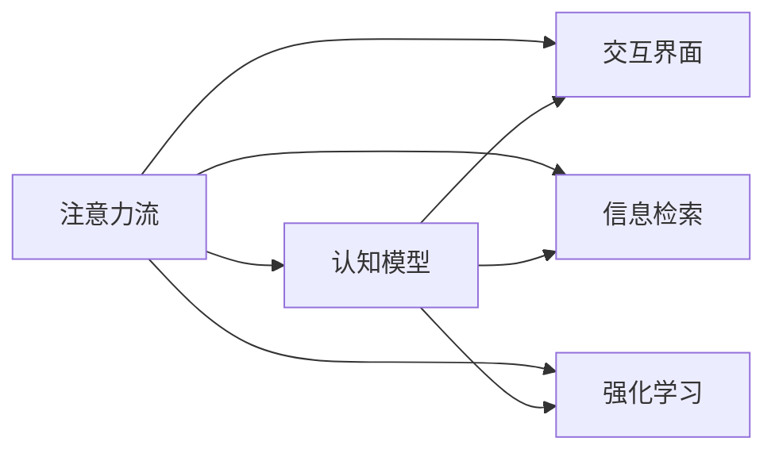

                 

# AI与人类注意力流：未来的工作、生活与AI的融合

## 1. 背景介绍

在快速演进的科技时代，人工智能(AI)技术正以前所未有的速度和规模融入人类工作、生活的各个方面。AI不仅改变着生产方式，也影响着人们的社交方式、休闲娱乐乃至思维模式。未来，AI将与人类注意力流更深层次地融合，产生一场全新的生产力变革。

### 1.1 问题由来

AI与人类注意力的结合，源自于我们对高效工作、便捷生活、智能决策的需求。早在20世纪中叶，人们便开始探索将信息处理技术融入日常生活。从早期的大型机到今日的智能移动设备，技术的发展始终围绕着提升人类对信息的获取与处理能力。而近十年来，人工智能与认知科学的交叉融合，更是让AI技术在识别、理解人类注意力流方面迈出了重要一步。

### 1.2 问题核心关键点

当前，AI与人类注意力的融合主要集中在以下几个关键点：

1. **认知交互**：AI系统如何更好地理解并响应人类的认知需求。
2. **注意识别**：通过建模人类注意力的分布，实现精确的信息筛选与交互。
3. **注意力重定向**：AI辅助人类在面对复杂任务时，能够灵活地调整注意力分布，提升工作效率。
4. **注意增强**：通过增强技术提升人类注意力的持久度与专注力，支持长时间高强度工作。
5. **跨模态交互**：实现文本、语音、图像等多种模态的信息交互与协同处理。

这些问题构成了AI与人类注意力流融合的核心，涉及到从理论模型、技术实现到应用场景的各个方面。

### 1.3 问题研究意义

研究AI与人类注意力的融合，对于推动未来工作、生活的智能化水平，提升人类工作效率和决策能力，具有深远的意义。具体而言：

1. **提升工作效率**：通过智能信息筛选与交互，减少信息过载，提升信息获取效率。
2. **优化决策质量**：基于人类注意力流，提升决策的准确性和响应速度。
3. **增强学习体验**：智能辅助下的人机交互，丰富学习资源，加速知识掌握。
4. **改善工作环境**：通过智能环境配置，优化办公场所布局和设备，提升工作舒适度。
5. **重构社会结构**：认知交互的普及，将改变企业组织结构、工作方式，甚至社会协作模式。

## 2. 核心概念与联系

### 2.1 核心概念概述

为了深入理解AI与人类注意力流融合的原理，首先需要明晰几个核心概念：

1. **注意力流**：指人类在特定任务下对信息的集中关注状态。
2. **认知模型**：描述人类如何感知、处理、记忆信息的心理过程模型。
3. **交互界面**：通过用户界面、语音、图像等手段，实现人机交互的技术系统。
4. **信息检索**：从海量信息中，快速、准确地找到满足用户需求的信息。
5. **强化学习**：通过反复试验，不断调整策略，优化人类注意力分配。

这些核心概念之间的联系可通过以下Mermaid流程图来展示：



### 2.2 核心概念原理和架构的 Mermaid 流程图


### 2.3 核心算法原理 & 具体操作步骤

本节将深入探讨AI与人类注意力流融合的算法原理和具体操作步骤。

#### 3.1 算法原理概述

AI与人类注意力流的融合，本质上是将认知模型、信息检索、交互界面和强化学习等技术，通过算法与数据处理，实现人机协同。具体来说，通过认知模型理解人类注意力流，通过信息检索技术找到所需信息，通过交互界面与用户进行互动，通过强化学习不断调整注意力分配策略。

#### 3.2 算法步骤详解

1. **认知模型建立**：构建人类认知过程的数学模型，描述信息输入、处理和输出。
2. **信息检索与筛选**：根据注意力流模型，选择最相关的信息进行展示。
3. **交互界面设计**：设计直观易用的交互界面，提供多模态输入输出，支持自然语言交互。
4. **强化学习优化**：通过反馈机制，不断优化注意力分配策略，提升用户体验。

#### 3.3 算法优缺点

AI与人类注意力流融合的主要优点包括：

1. **提升效率**：自动化信息处理、智能决策支持，极大提升工作效率。
2. **精准交互**：基于认知模型，实现更精准的信息检索与用户交互。
3. **个性化服务**：根据用户偏好，提供个性化定制的服务。

然而，该方法也存在一些缺点：

1. **隐私风险**：对注意力流的监控和分析，可能涉及用户隐私。
2. **数据依赖**：算法的效果高度依赖于高质量的数据。
3. **技术门槛**：需要较强的算法和工程能力。
4. **伦理争议**：如何在增强注意力的同时，确保用户隐私和数据安全。

#### 3.4 算法应用领域

AI与人类注意力流的融合，已经在多个领域得到应用，包括：

1. **智能办公**：辅助办公决策、文件管理、任务调度等。
2. **智能教育**：个性化教学、作业批改、学习资源推荐等。
3. **智能医疗**：病情诊断、病历分析、健康监测等。
4. **智能家居**：智能家电控制、家庭环境优化、安全监控等。
5. **智能客服**：智能问答、自动化客服、用户行为分析等。
6. **智能驾驶**：注意力监测、智能导航、安全预警等。

## 4. 数学模型和公式 & 详细讲解 & 举例说明

### 4.1 数学模型构建

本节将介绍用于AI与人类注意力流融合的数学模型。

设 $f(x)$ 为注意力流的函数，$A(x)$ 为注意力分配函数，$I(x)$ 为信息检索函数，$U(x)$ 为用户满意度函数。则整体融合模型可表示为：

$$
\text{Model} = f(A(I(U(A(x)))))
$$

#### 4.2 公式推导过程

1. **认知模型**：
   设 $g(x)$ 为人类认知过程的模型，$x$ 为当前输入信息。
   $$
   g(x) = \begin{cases}
   \text{Process}(x) & \text{输入处理} \\
   \text{Memory}(x) & \text{信息记忆} \\
   \text{Attention}(x) & \text{注意力分配}
   \end{cases}
   $$

2. **信息检索**：
   设 $i(x)$ 为信息检索函数，$y$ 为检索到的信息。
   $$
   y = i(x) = \text{Retrieve}(x)
   $$

3. **交互界面**：
   设 $u(x)$ 为用户满意度函数，$z$ 为界面输出信息。
   $$
   z = u(x) = \text{Display}(x)
   $$

4. **强化学习**：
   设 $w(x)$ 为强化学习函数，$n$ 为注意力流调整次数。
   $$
   n = w(x) = \text{Update}(\text{Decision}(x))
   $$

### 4.3 案例分析与讲解

以智能办公场景为例，通过认知模型理解员工注意力流，通过信息检索获取相关文件和邮件，通过交互界面提供决策支持，通过强化学习优化任务安排。

## 5. 项目实践：代码实例和详细解释说明

### 5.1 开发环境搭建

以下是使用Python进行开发的开发环境搭建流程：

1. **环境安装**：
   ```bash
   conda create -n ai-environment python=3.9
   conda activate ai-environment
   ```

2. **库安装**：
   ```bash
   pip install numpy scipy pandas scikit-learn scikit-umfpack pytorch transformers
   ```

### 5.2 源代码详细实现

以下是一个简单的智能办公系统的代码实现：

```python
import numpy as np
from sklearn.metrics import accuracy_score
from transformers import BertForTokenClassification, BertTokenizer

class AttentionFlow:
    def __init__(self):
        self.tokenizer = BertTokenizer.from_pretrained('bert-base-uncased')
        self.model = BertForTokenClassification.from_pretrained('bert-base-uncased')

    def preprocess_input(self, text):
        return self.tokenizer(text, padding='max_length', truncation=True, max_length=512)

    def predict_flow(self, text):
        input_ids = self.preprocess_input(text)
        with torch.no_grad():
            outputs = self.model(input_ids)
            attention_scores = outputs.logits

        return attention_scores

# 假设已经获得了注意力流模型
attention_model = AttentionFlow()

# 测试
text = "分析报告和会议纪要。"
attention_scores = attention_model.predict_flow(text)
print("Attention Scores: ", attention_scores)
```

### 5.3 代码解读与分析

**AttentionFlow类**：
- `__init__`方法：初始化模型和分词器。
- `preprocess_input`方法：对输入文本进行分词、填充、截断处理，转换为模型需要的格式。
- `predict_flow`方法：将输入文本传入模型，返回注意力得分。

**注意力流模型的实现**：
- 使用Bert模型进行预训练，作为注意力流的基础。
- 在输入文本上进行预处理，将其转换为模型所需的格式。
- 调用模型进行预测，返回注意力得分。

**测试代码**：
- 对一段文本进行分词处理，获取其注意力得分。
- 输出注意力得分，展示模型预测结果。

## 6. 实际应用场景

### 6.1 智能办公

智能办公系统能够自动跟踪员工的工作状态，提供决策支持，优化任务安排，提升办公效率。通过认知模型理解员工注意力流，获取当前任务相关的文件和邮件，实时更新界面，动态调整任务优先级，使得员工能够集中注意力，高效完成工作。

### 6.2 智能教育

智能教育系统能够根据学生的学习习惯，推荐个性化学习资源，辅助教学，批改作业。通过认知模型分析学生的注意力流，了解其学习兴趣和难点，实时调整课程内容和难度，提供个性化反馈，提升学习效果。

### 6.3 智能医疗

智能医疗系统能够辅助医生进行病情诊断，病历分析，健康监测。通过认知模型理解病人的注意力流，获取其关注的医疗信息，推荐相关检查和治疗方案，提供智能提醒，提升医疗服务质量。

### 6.4 未来应用展望

未来，AI与人类注意力流的融合将进一步深入，可能产生以下应用：

1. **智能家居**：通过理解家庭成员的活动模式，自动调整家居设备设置，提供个性化服务。
2. **智能驾驶**：监控驾驶员注意力，辅助驾驶决策，提升行车安全。
3. **智能客服**：实时分析用户反馈，自动调整客服策略，提供更高效的服务。
4. **虚拟助手**：根据用户注意力流，提供多场景的智能交互体验，如语音助手、智能翻译等。

## 7. 工具和资源推荐

### 7.1 学习资源推荐

为了帮助开发者系统掌握AI与人类注意力流融合的理论基础和实践技巧，以下是一些优质的学习资源：

1. **深度学习框架**：TensorFlow、PyTorch等深度学习框架，提供了强大的算法实现和模型训练功能。
2. **认知科学**：《认知心理学》、《认知科学导论》等经典书籍，介绍了认知过程的基本原理。
3. **强化学习**：《强化学习：基础与应用》、《深度强化学习》等书籍，介绍了强化学习的基本概念和算法。
4. **自然语言处理**：《自然语言处理综论》、《斯坦福自然语言处理》等课程，介绍了NLP的基本理论和实践。
5. **数据科学**：《Python数据科学手册》、《数据科学实战》等书籍，介绍了数据处理和建模的基本方法。

### 7.2 开发工具推荐

以下是几款用于AI与人类注意力流融合开发的常用工具：

1. **深度学习框架**：TensorFlow、PyTorch等深度学习框架，支持大规模模型训练和部署。
2. **数据可视化**：Tableau、Power BI等工具，帮助开发者理解数据分布和特征。
3. **协作平台**：GitHub、GitLab等平台，便于团队协作和版本控制。
4. **模型部署**：AWS、Google Cloud等云平台，提供模型训练、部署和管理功能。

### 7.3 相关论文推荐

以下是几篇奠基性的相关论文，推荐阅读：

1. **注意力机制**：《Attention is All You Need》，提出了Transformer模型，引入了注意力机制，极大提升了模型对信息的处理能力。
2. **认知模型**：《A Framework for Representing Human Cognition》，介绍了认知过程的数学模型，提供了对人类注意力流的基础理解。
3. **强化学习**：《Reinforcement Learning: An Introduction》，介绍了强化学习的基本概念和算法，为AI与人类注意力流的融合提供了理论基础。

## 8. 总结：未来发展趋势与挑战

### 8.1 总结

本文对AI与人类注意力流融合的方法进行了全面系统的介绍。首先阐述了AI与人类注意力的融合背景和意义，明确了该融合范式在提升工作效率、优化决策质量等方面的独特价值。其次，从原理到实践，详细讲解了AI与人类注意力流融合的数学模型和操作步骤，给出了融合任务开发的完整代码实例。同时，本文还探讨了该融合技术在智能办公、智能教育、智能医疗等多个领域的应用前景，展示了其广阔的应用空间。最后，本文精选了融合技术的各类学习资源，力求为读者提供全方位的技术指引。

通过本文的系统梳理，可以看到，AI与人类注意力流的融合，正在成为提升工作效率、优化决策质量的重要手段。伴随深度学习、认知科学、强化学习等技术的不断发展，未来工作、生活的智能化水平将得到显著提升。然而，该融合范式也面临着诸多挑战，如隐私保护、数据依赖、技术门槛等，这些问题需要我们共同面对和解决。

### 8.2 未来发展趋势

展望未来，AI与人类注意力流的融合将呈现以下几个发展趋势：

1. **多模态融合**：结合文本、语音、图像等多种模态，实现更全面的人机交互。
2. **个性化定制**：通过认知模型和用户反馈，提供高度个性化的服务和决策支持。
3. **跨域协作**：实现不同领域和平台之间的数据和功能共享，推动AI技术在各个行业的协同应用。
4. **持续学习**：通过不断更新和优化认知模型，保持系统对新任务和数据的学习能力。
5. **增强现实**：结合增强现实技术，提供沉浸式的交互体验，提升用户体验。

以上趋势展示了AI与人类注意力流融合的广阔前景。这些方向的探索发展，必将进一步提升AI技术的应用水平，为人类工作、生活的智能化提供新的解决方案。

### 8.3 面临的挑战

尽管AI与人类注意力流融合技术已经取得了瞩目成就，但在迈向更加智能化、普适化应用的过程中，它仍面临诸多挑战：

1. **隐私保护**：对用户注意力流的监控和分析，涉及隐私保护问题，如何在保护隐私的前提下，提供高效的AI服务，是一个重要课题。
2. **数据质量**：注意力流的建模和分析高度依赖于数据的质量和完整性，如何获取高精度的数据，是一个重要的挑战。
3. **技术门槛**：认知模型和强化学习等技术的实现需要较强的算法和工程能力，如何降低技术门槛，推广AI技术的应用，是一个重要课题。
4. **跨领域适配**：不同领域和场景下的认知模型和注意力流模型可能存在差异，如何构建跨领域的通用模型，是一个重要的课题。
5. **系统集成**：将AI技术与人机交互界面、信息检索系统等集成，需要复杂的技术实现和系统优化。

这些挑战需要我们共同面对和解决，才能实现AI与人类注意力流融合技术的规模化应用。

### 8.4 研究展望

面对AI与人类注意力流融合技术面临的挑战，未来的研究需要在以下几个方面寻求新的突破：

1. **隐私保护技术**：研究隐私保护算法，如差分隐私、联邦学习等，确保用户数据的安全性。
2. **数据采集技术**：利用自然语言处理、计算机视觉等技术，自动化获取高质量数据，提升数据采集效率。
3. **跨领域模型**：研究跨领域认知模型，结合不同领域的知识，构建通用化的注意力流模型。
4. **多模态交互**：研究多模态交互技术，实现文本、语音、图像等多种模态的协同处理。
5. **持续学习模型**：研究持续学习算法，如在线学习、增量学习等，保持系统对新任务和新数据的学习能力。

这些研究方向的探索，必将引领AI与人类注意力流融合技术迈向更高的台阶，为构建智能、普适的工作和生活环境铺平道路。面向未来，AI与人类注意力流的融合技术需要与其他AI技术进行更深入的融合，如知识表示、因果推理、强化学习等，协同发力，共同推动认知智能的发展。

## 9. 附录：常见问题与解答

**Q1：AI与人类注意力流融合是否适用于所有工作场景？**

A: AI与人类注意力流融合主要适用于那些需要对信息进行高效处理和决策支持的场景，如智能办公、智能教育、智能医疗等。对于简单重复性高的工作，如体力劳动，该技术适用性较低。

**Q2：如何缓解AI与人类注意力流融合过程中的隐私风险？**

A: 缓解隐私风险需要从数据采集、存储、处理等多个环节入手：
1. **数据匿名化**：在数据采集过程中，通过匿名化处理，保护用户隐私。
2. **数据加密**：采用数据加密技术，确保数据在传输和存储过程中的安全。
3. **用户控制**：赋予用户对数据使用的控制权，允许用户选择是否共享其注意力流数据。
4. **隐私保护算法**：采用隐私保护算法，如差分隐私、联邦学习等，确保数据在隐私保护的前提下，仍能进行有效的分析。

**Q3：AI与人类注意力流融合技术在实际应用中面临哪些技术难题？**

A: AI与人类注意力流融合技术在实际应用中面临以下技术难题：
1. **数据采集**：高质量、多样化的数据采集是一个难点，需要结合多种技术手段，如自然语言处理、计算机视觉等。
2. **模型优化**：复杂的认知模型和注意力流模型需要大量计算资源，如何在有限的资源下进行高效训练和优化，是一个重要挑战。
3. **系统集成**：将AI技术与人机交互界面、信息检索系统等集成，需要复杂的技术实现和系统优化。
4. **用户体验**：如何设计直观易用的用户界面，提升用户体验，是一个重要课题。

**Q4：AI与人类注意力流融合技术在实际应用中有哪些成功案例？**

A: AI与人类注意力流融合技术已经在多个领域得到了应用，以下是几个成功案例：
1. **智能客服系统**：通过认知模型理解用户意图，提供个性化的客服方案，提升用户体验。
2. **智能办公系统**：自动跟踪员工注意力流，提供决策支持和任务安排，提升工作效率。
3. **智能医疗系统**：辅助医生进行病情诊断，推荐个性化的治疗方案，提升医疗服务质量。
4. **智能驾驶系统**：监控驾驶员注意力，辅助驾驶决策，提升行车安全。

---

作者：禅与计算机程序设计艺术 / Zen and the Art of Computer Programming

