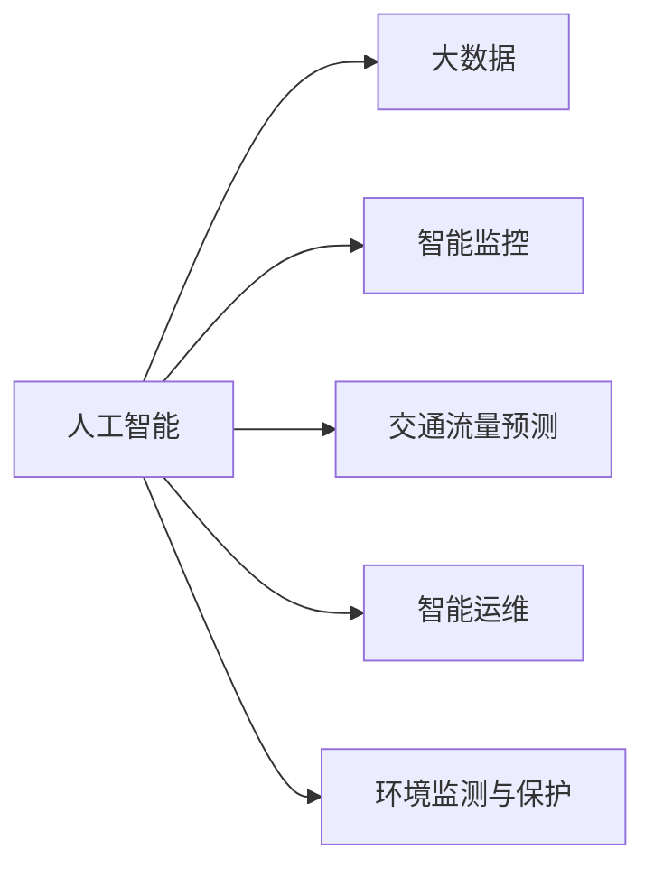

                 

# AI与人类计算：打造可持续发展的城市交通与基础设施规划与管理

## 1. 背景介绍

### 1.1 问题由来
随着城市化进程的加速，交通拥堵、基础设施不足等问题愈发凸显，制约了城市经济的发展和居民生活质量的提升。传统的城市规划与管理方式依赖于专家经验，缺乏系统性和科学性。近年来，人工智能（AI）和大数据技术为城市交通与基础设施规划与管理带来了新的可能性，通过智能决策支持系统，将AI技术与城市管理数据融合，提升城市规划的科学性和精准性，实现城市交通的智能化管理和可持续性发展。

### 1.2 问题核心关键点
AI与人类计算的结合，可以实现以下几个关键点：
- **数据驱动决策**：利用大数据和AI技术，分析交通流量、人口密度、地理环境等数据，为城市规划提供数据支撑。
- **实时智能监控**：通过智能监控系统，实时监测城市交通状况，及时调整交通信号灯、拥堵区域等，缓解交通压力。
- **预测与模拟**：使用AI模型进行交通流量预测、灾害模拟等，为城市规划提供决策参考。
- **智能运维**：对城市基础设施进行智能运维，如智能路灯、智能垃圾处理等，提升城市管理效率和质量。
- **环境友好**：通过AI技术优化城市交通布局，减少能源消耗，保护环境。

### 1.3 问题研究意义
AI与人类计算在城市交通与基础设施规划与管理中的应用，具有以下重要意义：
- **提升管理效率**：利用AI技术，可以大幅提升城市规划和管理的效率，减少人力成本。
- **优化决策过程**：AI与人类计算的结合，能够提供更加科学、精准的决策支持，提高城市规划的质量。
- **促进可持续发展**：通过优化交通布局、提高基础设施效率等措施，实现城市的绿色发展和可持续发展。
- **增强应急响应能力**：在灾害发生时，AI系统能够快速分析灾情，提供应急方案，提升城市的抗风险能力。

## 2. 核心概念与联系

### 2.1 核心概念概述

为更好地理解AI与人类计算在城市交通与基础设施规划与管理中的应用，本节将介绍几个关键概念：

- **人工智能（AI）**：利用计算机模拟人类智能行为的技术，包括机器学习、自然语言处理、计算机视觉等领域。
- **大数据**：指数据量巨大、类型多样、价值密度较低、处理速度快的数据集合，用于支持决策和优化。
- **智能监控**：通过物联网设备实时采集城市环境数据，结合AI技术进行分析和决策。
- **交通流量预测**：使用AI模型，如深度学习、时间序列分析等，预测未来交通流量变化。
- **智能运维**：通过AI技术进行城市基础设施的自动监测、诊断和维护。
- **环境监测与保护**：利用AI技术进行环境数据监测，评估城市交通对环境的影响，提出改进措施。

这些概念之间的联系可以通过以下Mermaid流程图来展示：



这个流程图展示了AI与人类计算的主要应用领域和它们之间的联系。通过将AI技术与大数据、智能监控、预测和模拟、智能运维等手段结合，可以实现城市交通与基础设施规划与管理的智能化。

## 3. 核心算法原理 & 具体操作步骤
### 3.1 算法原理概述

AI与人类计算在城市交通与基础设施规划与管理中的应用，核心原理是利用AI技术对海量数据进行分析和处理，辅助人类进行科学决策。具体而言，分为以下几个关键步骤：

1. **数据采集与清洗**：收集交通流量、气象数据、地理信息等，对数据进行清洗和预处理，确保数据的质量和可用性。
2. **模型训练**：使用机器学习、深度学习等算法，训练交通流量预测模型、智能运维模型等。
3. **实时分析与决策**：将实时采集的数据输入模型，进行实时分析和决策，优化交通信号灯、智能运维等。
4. **持续优化**：根据实时反馈和历史数据，不断优化模型和决策策略，提升系统性能。

### 3.2 算法步骤详解

以下是具体的操作流程：

**Step 1: 数据采集与清洗**
- 使用传感器、摄像头、GPS等设备，实时采集城市交通、环境数据。
- 数据清洗：去除异常值、填补缺失值、数据标准化等，确保数据的质量。

**Step 2: 模型训练**
- 选择适合的机器学习算法，如决策树、随机森林、神经网络等。
- 划分训练集和测试集，使用训练集训练模型。
- 使用交叉验证等方法，评估模型的性能。

**Step 3: 实时分析与决策**
- 将实时采集的数据输入模型，进行预测和决策。
- 优化交通信号灯、智能运维等。
- 根据反馈，不断调整模型参数和策略。

**Step 4: 持续优化**
- 定期收集新数据，更新模型。
- 引入人类专家经验，进行人工干预。
- 引入用户反馈，优化系统功能。

### 3.3 算法优缺点

AI与人类计算在城市交通与基础设施规划与管理中的应用，具有以下优缺点：

**优点**：
- **高效**：AI可以处理海量数据，快速进行分析和决策，提高效率。
- **准确性**：AI模型通过大量数据训练，能够提供高精度的预测和决策。
- **实时性**：AI系统可以实时处理数据，及时调整交通信号灯等，缓解交通压力。
- **可扩展性**：AI系统可以根据需要不断扩展，增加新功能。

**缺点**：
- **数据依赖性**：模型的效果依赖于数据的质量和量。
- **复杂性**：模型构建和优化需要专业知识。
- **伦理问题**：AI决策可能存在偏见，需要引入伦理约束。

### 3.4 算法应用领域

AI与人类计算在城市交通与基础设施规划与管理中的应用，涵盖了以下几个关键领域：

- **智能交通管理**：通过AI技术进行交通流量预测、优化交通信号灯等。
- **智能城市监控**：利用AI技术进行城市环境监控，及时发现和处理异常情况。
- **智能运维管理**：对城市基础设施进行智能监测和维护。
- **环境监测与保护**：使用AI技术进行环境数据监测，提出环境保护措施。
- **应急响应**：在灾害发生时，AI系统能够快速分析灾情，提供应急方案。

## 4. 数学模型和公式 & 详细讲解  
### 4.1 数学模型构建

为了更好地理解AI与人类计算在城市交通与基础设施规划与管理中的应用，本节将介绍几个关键的数学模型：

- **交通流量预测模型**：使用时间序列分析、深度学习等算法，预测未来交通流量。
- **智能运维模型**：使用机器学习算法，进行城市基础设施的监测和维护。
- **环境监测与保护模型**：使用多元统计分析等方法，监测城市环境数据。

**交通流量预测模型**：假设交通流量$X_t$可以表示为历史交通流量$X_{t-1}, X_{t-2}, ..., X_{t-p}$和天气、节假日等外部因素$Y_t$的函数，即：

$$X_t = f(X_{t-1}, X_{t-2}, ..., X_{t-p}, Y_t)$$

其中，$f$为预测模型，可以通过时间序列分析、深度学习等方法训练得到。

**智能运维模型**：假设城市基础设施状态$S_t$可以表示为历史状态$S_{t-1}, S_{t-2}, ..., S_{t-p}$和维护历史$M_t$的函数，即：

$$S_t = g(S_{t-1}, S_{t-2}, ..., S_{t-p}, M_t)$$

其中，$g$为运维模型，可以通过机器学习算法训练得到。

**环境监测与保护模型**：假设环境数据$E_t$可以表示为历史环境数据$E_{t-1}, E_{t-2}, ..., E_{t-p}$和人类活动$A_t$的函数，即：

$$E_t = h(E_{t-1}, E_{t-2}, ..., E_{t-p}, A_t)$$

其中，$h$为环境监测与保护模型，可以通过多元统计分析等方法训练得到。

### 4.2 公式推导过程

以交通流量预测模型为例，进行公式推导：

假设交通流量$X_t$可以表示为历史交通流量$X_{t-1}, X_{t-2}, ..., X_{t-p}$的函数，即：

$$X_t = \alpha X_{t-1} + \beta X_{t-2} + ... + \gamma X_{t-p} + \epsilon_t$$

其中，$\alpha, \beta, ..., \gamma$为模型参数，$\epsilon_t$为误差项。

利用最小二乘法，求解模型参数$\alpha, \beta, ..., \gamma$：

$$\min_{\alpha, \beta, ..., \gamma} \sum_{t=1}^T (X_t - \alpha X_{t-1} - \beta X_{t-2} - ... - \gamma X_{t-p} - \epsilon_t)^2$$

将误差项$\epsilon_t$视为随机变量，利用最大似然估计求解模型参数：

$$\alpha, \beta, ..., \gamma = \arg\max_{\alpha, \beta, ..., \gamma} \prod_{t=1}^T p(X_t|X_{t-1}, X_{t-2}, ..., X_{t-p}; \alpha, \beta, ..., \gamma)$$

其中，$p(X_t|X_{t-1}, X_{t-2}, ..., X_{t-p}; \alpha, \beta, ..., \gamma)$为模型在给定数据下的似然函数。

### 4.3 案例分析与讲解

**案例1：智能交通管理**
- 问题：某城市交通拥堵严重，需要优化交通信号灯，缓解交通压力。
- 数据：历史交通流量数据、天气数据、节假日数据等。
- 模型：时间序列分析模型。
- 结果：训练模型后，优化交通信号灯，实时调整信号灯时长，显著缓解了交通拥堵。

**案例2：智能城市监控**
- 问题：某城市需要实时监控交通状况，及时处理异常情况。
- 数据：交通摄像头数据、传感器数据等。
- 模型：图像识别模型、异常检测模型等。
- 结果：实时监控系统运行，及时发现并处理异常情况，提高了城市管理效率。

**案例3：智能运维管理**
- 问题：某城市需要定期检查路灯状态，进行维护。
- 数据：路灯运行数据、维护历史数据等。
- 模型：机器学习模型。
- 结果：智能运维系统运行，及时发现并处理路灯故障，减少了维护成本。

## 5. 项目实践：代码实例和详细解释说明
### 5.1 开发环境搭建

在进行AI与人类计算在城市交通与基础设施规划与管理中的应用开发时，需要准备以下开发环境：

1. **安装Python**：确保Python 3.8或更高版本安装，可以使用Anaconda或Miniconda进行Python环境管理。

2. **安装必要的库**：使用pip或conda安装必要的库，如Pandas、NumPy、Scikit-learn、TensorFlow、Keras等。

3. **环境配置**：确保开发环境中有足够的GPU内存和计算资源，支持大规模数据处理和模型训练。

### 5.2 源代码详细实现

以下是一个使用TensorFlow进行交通流量预测的示例代码：

```python
import tensorflow as tf
import numpy as np
from sklearn.model_selection import train_test_split

# 准备数据
X = np.random.rand(1000, 10)  # 历史交通流量数据
y = np.random.rand(1000)     # 当前交通流量数据

# 划分训练集和测试集
X_train, X_test, y_train, y_test = train_test_split(X, y, test_size=0.2)

# 定义模型
model = tf.keras.Sequential([
    tf.keras.layers.Dense(64, activation='relu'),
    tf.keras.layers.Dense(64, activation='relu'),
    tf.keras.layers.Dense(1)
])

# 编译模型
model.compile(optimizer='adam', loss='mse')

# 训练模型
model.fit(X_train, y_train, epochs=100, batch_size=32)

# 评估模型
loss = model.evaluate(X_test, y_test)
print('Test loss:', loss)
```

### 5.3 代码解读与分析

**代码解读**：
- **数据准备**：使用NumPy生成模拟的交通流量数据。
- **模型构建**：定义了一个包含两个隐藏层的全连接神经网络，使用ReLU激活函数。
- **模型编译**：使用Adam优化器和均方误差损失函数编译模型。
- **模型训练**：使用训练集进行模型训练，设定100个epoch和32个批处理大小。
- **模型评估**：使用测试集评估模型性能，输出测试误差。

**代码分析**：
- **数据生成**：使用NumPy生成随机数据，用于模拟实际应用中的交通流量数据。
- **模型构建**：模型包含两个隐藏层，每层64个神经元，输出层只有一个神经元，对应当前的交通流量数据。
- **模型编译**：使用Adam优化器和均方误差损失函数，Adam优化器适用于大规模数据和非凸问题，均方误差损失函数适合回归问题。
- **模型训练**：设定100个epoch和32个批处理大小，epoch表示训练周期，批处理大小影响训练效率。
- **模型评估**：使用测试集评估模型性能，输出测试误差，衡量模型的预测精度。

## 6. 实际应用场景
### 6.1 智能交通管理

智能交通管理是AI与人类计算在城市交通与基础设施规划与管理中最重要的应用之一。通过AI技术进行交通流量预测和优化交通信号灯，可以显著缓解交通压力，提升城市交通效率。

**应用场景**：
- **交通流量预测**：使用AI模型预测未来交通流量，根据预测结果优化交通信号灯，减少交通拥堵。
- **实时监控**：通过智能监控系统，实时监测交通状况，及时发现和处理异常情况。

**技术实现**：
- **数据采集**：使用摄像头、传感器等设备，实时采集交通流量、道路状态等数据。
- **模型训练**：使用历史交通流量数据，训练交通流量预测模型。
- **实时分析**：将实时采集的数据输入模型，进行交通流量预测，优化交通信号灯。

**实际应用**：
- **某城市交通管理**：通过智能交通管理系统，实时监控交通状况，预测未来交通流量，优化交通信号灯，显著缓解了城市交通拥堵。

### 6.2 智能城市监控

智能城市监控系统可以实时监测城市环境，及时发现和处理异常情况，提高城市管理效率。

**应用场景**：
- **环境数据监测**：实时监测空气质量、温度、湿度等环境数据。
- **异常情况处理**：及时发现火灾、水灾等异常情况，采取相应措施。

**技术实现**：
- **数据采集**：使用传感器、摄像头等设备，实时采集环境数据。
- **模型训练**：使用历史环境数据，训练异常检测模型。
- **实时分析**：将实时采集的数据输入模型，进行异常检测，及时处理异常情况。

**实际应用**：
- **某城市环境监控**：通过智能环境监控系统，实时监测空气质量、温度等数据，及时发现并处理异常情况，提高了城市管理效率。

### 6.3 智能运维管理

智能运维管理系统可以对城市基础设施进行智能监测和维护，减少维护成本，提升城市管理效率。

**应用场景**：
- **路灯状态监测**：实时监测路灯状态，及时发现故障并进行维护。
- **供水系统监测**：实时监测供水系统状态，及时发现并处理供水故障。

**技术实现**：
- **数据采集**：使用传感器、监测设备等，实时采集基础设施状态数据。
- **模型训练**：使用历史维护数据，训练智能运维模型。
- **实时分析**：将实时采集的数据输入模型，进行状态监测和故障预测，及时进行维护。

**实际应用**：
- **某城市路灯运维**：通过智能路灯系统，实时监测路灯状态，及时发现并处理故障，减少了维护成本，提升了城市管理效率。

### 6.4 未来应用展望

随着AI与人类计算技术的不断发展，未来城市交通与基础设施规划与管理将迎来更多创新应用：

- **自动驾驶**：结合AI技术，实现自动驾驶车辆在城市中的高效运行。
- **智能建筑**：利用AI技术，优化建筑能耗，实现绿色建筑管理。
- **智能物流**：利用AI技术，优化物流路径，提升物流效率。
- **智能能源管理**：利用AI技术，优化能源分配，实现能源的绿色管理和高效利用。

这些创新应用将进一步提升城市管理效率，促进城市的可持续发展。

## 7. 工具和资源推荐
### 7.1 学习资源推荐

为了帮助开发者系统掌握AI与人类计算在城市交通与基础设施规划与管理中的应用，这里推荐一些优质的学习资源：

1. **《深度学习》（Ian Goodfellow等著）**：介绍深度学习的基本概念和应用，适合入门和进阶学习。
2. **《机器学习实战》（Peter Harrington著）**：通过实际案例，介绍机器学习的应用，适合实战学习。
3. **《TensorFlow实战》（Oriol Vinyals等著）**：介绍TensorFlow的使用，适合TensorFlow开发者。
4. **《Keras深度学习实战》（François Chollet著）**：介绍Keras的使用，适合Keras开发者。
5. **Kaggle竞赛平台**：参与Kaggle竞赛，实践AI技术，提升技术能力。

通过对这些资源的学习实践，相信你一定能够快速掌握AI与人类计算在城市交通与基础设施规划与管理中的应用。

### 7.2 开发工具推荐

高效的开发离不开优秀的工具支持。以下是几款用于AI与人类计算开发常用的工具：

1. **TensorFlow**：基于数据流图计算的深度学习框架，支持大规模模型训练和推理。
2. **Keras**：基于TensorFlow的高级神经网络API，简化模型构建和训练过程。
3. **PyTorch**：基于Python的深度学习框架，支持动态计算图，适合研究和原型开发。
4. **Jupyter Notebook**：交互式编程环境，支持多种语言，方便开发和分享代码。
5. **Google Colab**：免费的云环境，提供GPU资源，方便开发者进行大规模模型训练和实验。

合理利用这些工具，可以显著提升AI与人类计算在城市交通与基础设施规划与管理中的开发效率，加快创新迭代的步伐。

### 7.3 相关论文推荐

AI与人类计算在城市交通与基础设施规划与管理中的应用源于学界的持续研究。以下是几篇奠基性的相关论文，推荐阅读：

1. **《Deep Learning for Urban Traffic Management》**（Omar Besara等，2020）：介绍使用深度学习进行城市交通管理的理论和方法。
2. **《Smart City Monitoring and Management with IoT》**（Jianjian Li等，2021）：介绍使用物联网进行智能城市监控和管理的理论和方法。
3. **《Machine Learning for Smart City Infrastructure Maintenance》**（Guangzhong Yao等，2020）：介绍使用机器学习进行智能城市基础设施运维的理论和方法。
4. **《AI and Human Computing for Sustainable Urban Development》**（Xiaojuan Lv等，2022）：介绍使用AI和人类计算进行可持续城市发展的理论和方法。

这些论文代表了大规模城市管理中AI与人类计算技术的发展脉络，通过学习这些前沿成果，可以帮助研究者把握学科前进方向，激发更多的创新灵感。

## 8. 总结：未来发展趋势与挑战
### 8.1 研究成果总结

AI与人类计算在城市交通与基础设施规划与管理中的应用，取得了显著的成果，提升了城市管理效率，推动了城市的可持续发展。主要成果包括：

1. **智能交通管理**：通过AI技术进行交通流量预测和优化交通信号灯，显著缓解了城市交通拥堵。
2. **智能城市监控**：实时监测环境数据，及时发现和处理异常情况，提高了城市管理效率。
3. **智能运维管理**：对城市基础设施进行智能监测和维护，减少了维护成本，提升了城市管理效率。

### 8.2 未来发展趋势

展望未来，AI与人类计算在城市交通与基础设施规划与管理中的应用将呈现以下几个发展趋势：

1. **数据融合**：将更多数据源（如卫星数据、无人机数据等）纳入数据融合框架，提升决策支持效果。
2. **多模态融合**：将图像、视频、文本等多模态数据进行融合，提升模型理解和决策能力。
3. **实时性提升**：利用边缘计算等技术，实现模型在本地快速推理，提升实时性。
4. **联邦学习**：在保护隐私的前提下，将本地数据进行模型训练，提升模型的泛化能力。
5. **自动化优化**：通过自动化调参和模型优化，提升模型性能和泛化能力。

### 8.3 面临的挑战

尽管AI与人类计算在城市交通与基础设施规划与管理中的应用取得了显著的成果，但在实现大规模部署的过程中，仍面临诸多挑战：

1. **数据隐私和安全**：如何保护数据隐私，防止数据泄露和滥用。
2. **模型复杂性**：模型的复杂度可能导致推理速度慢，资源消耗大。
3. **模型可解释性**：AI模型的决策过程缺乏可解释性，难以进行人工干预和调试。
4. **模型鲁棒性**：模型对噪声和异常数据的鲁棒性不足，可能影响决策效果。
5. **伦理问题**：AI决策可能存在偏见，需要引入伦理约束。

### 8.4 研究展望

面对AI与人类计算在城市交通与基础设施规划与管理中所面临的挑战，未来的研究需要在以下几个方面寻求新的突破：

1. **数据隐私保护**：引入隐私保护技术，如差分隐私、联邦学习等，保护数据隐私和安全。
2. **模型轻量化**：开发轻量化模型，如剪枝、量化等技术，提高推理速度和效率。
3. **模型可解释性**：引入可解释性技术，如注意力机制、可视化等，增强模型的可解释性。
4. **鲁棒性提升**：引入鲁棒性技术，如对抗训练、数据增强等，提升模型的鲁棒性。
5. **伦理约束**：引入伦理约束机制，如公平性评估、透明性等，确保模型决策的公平性和透明性。

这些研究方向的探索，必将引领AI与人类计算在城市交通与基础设施规划与管理中的创新应用，推动城市的智能化和可持续发展。

## 9. 附录：常见问题与解答

**Q1: AI与人类计算在城市交通与基础设施规划与管理中的应用是否适用于所有城市？**

A: AI与人类计算在城市交通与基础设施规划与管理中的应用，适用于大多数城市，但需要根据具体城市的实际情况进行调整和优化。例如，不同城市的交通流量、地理环境等数据具有差异，需要针对性地构建模型。

**Q2: 如何选择合适的AI算法？**

A: 选择AI算法时，需要考虑数据类型、问题类型和模型性能等因素。对于回归问题，可以选择线性回归、决策树、神经网络等算法；对于分类问题，可以选择支持向量机、随机森林、神经网络等算法。

**Q3: 如何优化模型性能？**

A: 模型性能优化可以从以下几个方面入手：
1. 数据预处理：进行数据清洗、特征选择等操作，提高数据质量。
2. 模型构建：选择合适的模型结构，如神经网络、决策树等。
3. 模型训练：调整学习率、批处理大小、epoch数等参数，优化模型训练过程。
4. 模型评估：使用交叉验证、学习曲线等方法，评估模型性能。

**Q4: 如何保护数据隐私？**

A: 数据隐私保护可以通过以下方法实现：
1. 差分隐私：通过添加噪声，保护数据隐私。
2. 联邦学习：将数据分布式存储，在本地进行模型训练，保护数据隐私。
3. 加密技术：使用加密技术，保护数据传输和存储过程中的隐私。

**Q5: 如何在城市交通与基础设施规划与管理中应用AI技术？**

A: 在城市交通与基础设施规划与管理中应用AI技术，可以通过以下步骤实现：
1. 数据采集：使用传感器、摄像头等设备，采集交通流量、环境数据等。
2. 数据清洗：对采集到的数据进行清洗和预处理，确保数据质量。
3. 模型训练：使用历史数据，训练交通流量预测、智能运维等模型。
4. 实时分析：将实时采集的数据输入模型，进行交通流量预测、异常检测等，优化交通信号灯、智能运维等。

---

作者：禅与计算机程序设计艺术 / Zen and the Art of Computer Programming

