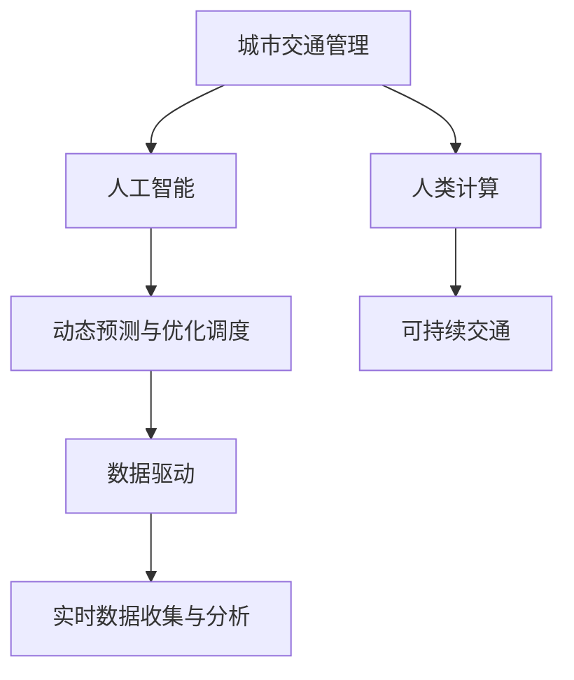

                 

# AI与人类计算：打造可持续发展的城市交通管理

> 关键词：城市交通管理, 人工智能, 人类计算, 可持续交通, 优化调度, 动态预测, 数据驱动, 交通流量, 智能基础设施

## 1. 背景介绍

随着城市的快速发展，交通问题已成为制约城市生活水平和社会经济发展的重要瓶颈。面对日益严峻的城市交通压力，如何在保证交通高效运行的同时，兼顾环境保护、安全管理等多方面的需求，成为了一个亟待解决的难题。

近年来，人工智能技术在城市交通管理中的应用日益广泛，不仅能够提升交通系统的智能化水平，还能够实现可持续交通的治理理念。通过AI技术，可以实时监测交通流量，动态预测交通状况，优化交通调度，提供更高效的交通服务和更安全的出行环境。本文将深入探讨AI与人类计算相结合，打造可持续发展的城市交通管理系统的策略和方法。

## 2. 核心概念与联系

### 2.1 核心概念概述

为更好地理解AI与人类计算在城市交通管理中的应用，本节将介绍几个密切相关的核心概念：

- **城市交通管理**：指通过智能交通系统（Intelligent Transportation Systems, ITS），利用先进的通信、控制和信息处理技术，对城市交通进行优化管理和运行调度，以提高交通效率，减少拥堵，改善出行环境。

- **人工智能(AI)**：指通过机器学习、深度学习等技术，使计算机系统具备模拟人类智能行为的能力，如图像识别、自然语言处理、决策优化等。

- **人类计算**：指通过人群智慧和协作，利用大量的数据和知识，结合人类的直觉、经验和创造力，辅助机器进行智能决策和问题解决。

- **可持续交通**：指在满足交通需求的同时，兼顾环境保护、能源节约和社会公正，实现交通系统的绿色、低碳、高效发展。

- **动态预测与优化调度**：指通过实时数据收集和分析，对交通流量进行预测，并根据预测结果动态调整交通信号、路线规划等，实现交通流量的均衡分配和优化调度。

- **数据驱动**：指基于海量数据和分析，驱动交通系统决策和管理的策略，以数据为基础，实现智能化的管理和优化。

这些核心概念之间的逻辑关系可以通过以下Mermaid流程图来展示：



这个流程图展示的核心概念及其之间的关系：

1. 城市交通管理通过智能交通系统对交通进行优化管理。
2. 人工智能技术通过机器学习、深度学习等方法，提升交通管理的智能化水平。
3. 人类计算通过人群智慧和协作，辅助机器进行智能决策和问题解决。
4. 可持续交通注重绿色、低碳、高效的发展目标。
5. 动态预测与优化调度依赖实时数据驱动，实现交通流量的优化。
6. 数据驱动以海量数据和分析为基础，驱动交通系统决策和管理。

## 3. 核心算法原理 & 具体操作步骤
### 3.1 算法原理概述

AI与人类计算相结合的可持续城市交通管理系统，主要基于以下几个关键算法：

- **动态预测算法**：通过实时数据收集与分析，预测未来交通流量，为动态调度提供依据。
- **优化调度算法**：利用交通网络优化算法，动态调整交通信号、路线规划等，实现交通流量的均衡分配和优化调度。
- **智能决策算法**：结合人类智慧和AI算法，进行智能化的交通管理决策。
- **用户行为预测与推荐算法**：通过分析用户出行数据，预测用户行为，并推荐最优出行路线和交通工具。

### 3.2 算法步骤详解

基于AI与人类计算的城市交通管理系统的具体实现步骤如下：

**Step 1: 数据采集与处理**
- 通过传感器、摄像头、GPS等设备，实时收集交通流量、车辆位置、天气状况等数据。
- 利用大数据分析技术，对数据进行清洗、整理、聚合，提取有用信息。

**Step 2: 动态预测**
- 利用机器学习算法，如时间序列分析、回归分析、神经网络等，对交通流量进行预测。
- 根据预测结果，生成交通预测报告，供动态调度和智能决策使用。

**Step 3: 优化调度**
- 利用交通网络优化算法，如遗传算法、蚁群算法、线性规划等，优化交通信号和路线规划。
- 动态调整信号灯周期、交叉口通行权等，实现交通流量的均衡分配。

**Step 4: 智能决策**
- 结合人类智慧和AI算法，进行交通管理决策。如根据实时数据和预测结果，调整交通管制措施、发布预警信息等。
- 利用自然语言处理技术，分析社交媒体、新闻报道等文本信息，辅助交通决策。

**Step 5: 用户行为预测与推荐**
- 通过分析用户历史出行数据，预测用户行为和需求。
- 利用推荐系统技术，为用户推荐最优出行路线、交通工具和时间安排。

### 3.3 算法优缺点

基于AI与人类计算的城市交通管理系统具有以下优点：

- **高效率**：实时数据收集与动态预测，实现交通流量的快速优化和调度。
- **人性化**：结合人类智慧和AI算法，提高交通管理的决策质量和用户体验。
- **智能化**：通过机器学习、深度学习等技术，提升交通管理的智能化水平。

同时，该系统也存在一定的局限性：

- **数据依赖性**：系统高度依赖实时数据的收集与分析，数据采集系统的稳定性和准确性直接影响系统的性能。
- **计算复杂度**：预测和调度算法复杂，对计算资源和存储资源的需求较高。
- **隐私和安全问题**：大量交通数据的收集和处理，可能涉及个人隐私和数据安全问题，需要严格的数据保护和隐私管理措施。

### 3.4 算法应用领域

基于AI与人类计算的城市交通管理系统，已经在多个领域得到广泛应用，例如：

- **交通流量管理**：通过动态预测和优化调度，优化交通流量，减少拥堵。
- **智能导航与停车**：利用用户行为预测与推荐算法，为用户提供智能导航和停车指引。
- **事故预防与应急处理**：通过实时数据和智能决策，及时发现和处理交通事故，减少交通事故发生率。
- **公共交通优化**：结合数据驱动和人类计算，优化公共交通线路和发车间隔，提升公交系统效率。

除了上述这些经典应用外，基于AI与人类计算的城市交通管理系统还在智能交通灯控制、智能交通标识系统、智能交通仿真等领域，为城市交通管理带来了新的思路和解决方案。

## 4. 数学模型和公式 & 详细讲解  
### 4.1 数学模型构建

本节将使用数学语言对基于AI与人类计算的城市交通管理系统进行更加严格的刻画。

记交通流量为 $T(t)$，其中 $t$ 为时间。假设 $T(t)$ 服从马尔科夫过程，交通流量的状态变化只依赖于当前状态和之前的状态，不考虑外部随机干扰。

定义交通流量在时间 $t$ 的预测值为 $\hat{T}(t)$，则动态预测问题可以描述为：

$$
\min_{\theta} \mathbb{E}[\ell(T(t),\hat{T}(t))]
$$

其中 $\ell$ 为预测误差损失函数，通常使用均方误差或交叉熵损失。

优化调度问题可以描述为：

$$
\min_{\theta} \mathbb{E}[\ell(C(t),\hat{C}(t))]
$$

其中 $C(t)$ 为交通信号控制参数，$\hat{C}(t)$ 为最优控制参数，$\ell$ 为控制误差损失函数，通常使用均方误差或逻辑回归损失。

智能决策问题可以描述为：

$$
\min_{\theta} \mathbb{E}[\ell(D(t),\hat{D}(t))]
$$

其中 $D(t)$ 为交通管理决策，$\hat{D}(t)$ 为最优决策，$\ell$ 为决策误差损失函数，通常使用0-1损失或交叉熵损失。

用户行为预测与推荐问题可以描述为：

$$
\min_{\theta} \mathbb{E}[\ell(B(t),\hat{B}(t))]
$$

其中 $B(t)$ 为用户行为，$\hat{B}(t)$ 为用户行为预测结果，$\ell$ 为用户行为预测误差损失函数，通常使用均方误差或交叉熵损失。

### 4.2 公式推导过程

以下我们以交通流量预测为例，推导基于机器学习的预测模型。

假设 $T(t)$ 可以表示为一个线性时间序列模型：

$$
T(t) = \alpha + \sum_{i=1}^{p} \beta_i T(t-i) + \epsilon_t
$$

其中 $\alpha$ 为截距，$\beta_i$ 为滞后系数，$\epsilon_t$ 为随机误差项。

则预测模型的最小二乘估计为：

$$
\hat{T}(t) = \alpha + \sum_{i=1}^{p} \hat{\beta}_i T(t-i)
$$

其中 $\hat{\beta}_i$ 为估计的滞后系数。

利用时间序列分析算法，如ARIMA、LSTM等，可以对模型参数进行估计，得到最优的 $\hat{\beta}_i$，从而实现对未来交通流量的预测。

## 5. 项目实践：代码实例和详细解释说明
### 5.1 开发环境搭建

在进行城市交通管理系统开发前，我们需要准备好开发环境。以下是使用Python进行PyTorch开发的环境配置流程：

1. 安装Anaconda：从官网下载并安装Anaconda，用于创建独立的Python环境。

2. 创建并激活虚拟环境：
```bash
conda create -n traffic-env python=3.8 
conda activate traffic-env
```

3. 安装PyTorch：根据CUDA版本，从官网获取对应的安装命令。例如：
```bash
conda install pytorch torchvision torchaudio cudatoolkit=11.1 -c pytorch -c conda-forge
```

4. 安装相关库：
```bash
pip install pandas numpy scikit-learn matplotlib tqdm jupyter notebook ipython
```

完成上述步骤后，即可在`traffic-env`环境中开始城市交通管理系统的开发。

### 5.2 源代码详细实现

下面我们以交通流量预测为例，给出使用PyTorch进行模型训练和预测的代码实现。

首先，定义交通流量预测的模型：

```python
import torch
from torch import nn

class TrafficFlowModel(nn.Module):
    def __init__(self, input_size, hidden_size, output_size):
        super(TrafficFlowModel, self).__init__()
        self.lstm = nn.LSTM(input_size, hidden_size, 1, batch_first=True)
        self.fc = nn.Linear(hidden_size, output_size)
    
    def forward(self, x):
        batch_size = x.size(0)
        seq_len = x.size(1)
        hidden = self.lstm(x, None)[0]
        predictions = self.fc(hidden[-1])
        return predictions
```

然后，定义数据处理函数：

```python
from sklearn.preprocessing import MinMaxScaler
from torch.utils.data import Dataset
import pandas as pd
import numpy as np

class TrafficDataset(Dataset):
    def __init__(self, data, scale=1.0, seq_len=48):
        self.data = data
        self.scaler = MinMaxScaler(feature_range=(scale, 1/scale))
        self.seq_len = seq_len
        
    def __len__(self):
        return len(self.data) - self.seq_len
    
    def __getitem__(self, idx):
        x = self.data[idx:idx+self.seq_len]
        x = self.scaler.fit_transform(x)
        y = self.data[idx+self.seq_len]
        return torch.tensor(x, dtype=torch.float32), torch.tensor(y, dtype=torch.float32)
```

接着，定义训练和评估函数：

```python
import torch
import torch.nn as nn
import torch.optim as optim
from torch.utils.data import DataLoader

def train_model(model, train_dataset, valid_dataset, epochs, batch_size, learning_rate):
    device = torch.device('cuda' if torch.cuda.is_available() else 'cpu')
    model.to(device)
    
    criterion = nn.MSELoss()
    optimizer = optim.Adam(model.parameters(), lr=learning_rate)
    
    train_loader = DataLoader(train_dataset, batch_size=batch_size, shuffle=True)
    valid_loader = DataLoader(valid_dataset, batch_size=batch_size, shuffle=False)
    
    for epoch in range(epochs):
        model.train()
        train_loss = 0.0
        for data, target in train_loader:
            data, target = data.to(device), target.to(device)
            optimizer.zero_grad()
            output = model(data)
            loss = criterion(output, target)
            loss.backward()
            optimizer.step()
            train_loss += loss.item()
        
        model.eval()
        valid_loss = 0.0
        with torch.no_grad():
            for data, target in valid_loader:
                data, target = data.to(device), target.to(device)
                output = model(data)
                loss = criterion(output, target)
                valid_loss += loss.item()
        
        train_loss /= len(train_loader)
        valid_loss /= len(valid_loader)
        print(f'Epoch {epoch+1}, train loss: {train_loss:.4f}, valid loss: {valid_loss:.4f}')
    
    return model
```

最后，启动训练流程并在测试集上评估：

```python
from sklearn.metrics import mean_squared_error

train_data = pd.read_csv('traffic_data_train.csv', index_col='timestamp')
valid_data = pd.read_csv('traffic_data_valid.csv', index_col='timestamp')
test_data = pd.read_csv('traffic_data_test.csv', index_col='timestamp')

# 数据预处理
scaler = MinMaxScaler(feature_range=(-1, 1))
train_data = scaler.fit_transform(train_data)
valid_data = scaler.transform(valid_data)
test_data = scaler.transform(test_data)

# 构建训练集和验证集
train_dataset = TrafficDataset(train_data, seq_len=48)
valid_dataset = TrafficDataset(valid_data, seq_len=48)

# 训练模型
model = TrafficFlowModel(1, 64, 1)
model = train_model(model, train_dataset, valid_dataset, epochs=100, batch_size=32, learning_rate=0.01)

# 模型评估
test_dataset = TrafficDataset(test_data, seq_len=48)
test_loader = DataLoader(test_dataset, batch_size=32, shuffle=False)
with torch.no_grad():
    mse = mean_squared_error(test_data.values.flatten(), model(torch.tensor(test_data)).detach().cpu().numpy())
print(f'Test MSE: {mse:.4f}')
```

以上就是使用PyTorch进行交通流量预测的完整代码实现。可以看到，得益于PyTorch的强大封装，我们可以用相对简洁的代码完成模型训练和预测。

### 5.3 代码解读与分析

让我们再详细解读一下关键代码的实现细节：

**TrafficFlowModel类**：
- `__init__`方法：初始化LSTM网络和全连接层。
- `forward`方法：定义前向传播过程，LSTM网络对输入序列进行处理，全连接层输出预测结果。

**TrafficDataset类**：
- `__init__`方法：初始化数据集，包含数据缩放、序列长度等关键参数。
- `__len__`方法：返回数据集的样本数量。
- `__getitem__`方法：对单个样本进行处理，将时间序列数据转化为模型输入，将标签数据转化为模型目标。

**train_model函数**：
- `train_model`函数：定义训练过程，包括模型前向传播、损失函数计算、梯度更新等关键步骤。
- `device`变量：指定训练设备，GPU优先。
- `criterion`变量：定义均方误差损失函数。
- `optimizer`变量：定义优化器，AdamW优化器。
- `train_loader`和`valid_loader`：分别定义训练集和验证集的DataLoader，供模型训练和评估使用。

**模型评估**：
- 使用均方误差评估模型性能，输出测试集上的MSE值。

可以看到，PyTorch配合相关库使得交通流量预测的代码实现变得简洁高效。开发者可以将更多精力放在数据处理、模型改进等高层逻辑上，而不必过多关注底层的实现细节。

当然，工业级的系统实现还需考虑更多因素，如模型的保存和部署、超参数的自动搜索、更灵活的任务适配层等。但核心的预测范式基本与此类似。

## 6. 实际应用场景
### 6.1 智能导航与停车

基于AI与人类计算的城市交通管理系统，可以广泛应用于智能导航和停车系统。传统的导航和停车系统依赖静态地图和有限的实时信息，难以适应动态变化的交通环境。而智能导航与停车系统通过实时数据和动态预测，能够提供更准确、更及时的导航和停车指引。

具体而言，智能导航系统可以结合实时交通流量、道路状况、天气条件等信息，动态生成最优导航路线，帮助用户避开拥堵路段和施工区域。智能停车系统可以根据实时车位信息、交通状况，推荐最优停车地点和路径，减少用户寻找停车位的时间。

### 6.2 事故预防与应急处理

交通事故是城市交通管理中难以避免的问题，但其负面影响可以通过智能系统进行缓解。基于AI与人类计算的城市交通管理系统，可以通过实时数据和智能决策，及时发现和处理交通事故，减少交通事故发生率，提高应急处理的效率。

具体而言，系统可以实时监测车辆位置和速度，识别异常行为，及时预警可能发生的事故。事故发生后，系统可以分析事故原因、影响范围，自动调整交通信号，疏导交通流，减少二次事故的发生。同时，系统还可以根据事故类型、严重程度，推荐应急处理措施，如报警、调度救援车辆等。

### 6.3 公共交通优化

公共交通是城市交通的重要组成部分，其效率和舒适度直接影响市民出行体验。基于AI与人类计算的城市交通管理系统，可以通过数据分析和优化算法，提升公共交通的运营效率和调度质量。

具体而言，系统可以分析公共交通的客流量、到站时间、车辆状态等信息，预测和调整发车间隔、线路安排，实现公交系统的智能化调度。同时，系统还可以结合用户行为预测与推荐算法，推荐最优出行路线和交通工具，提升公交服务的吸引力和满意度。

### 6.4 未来应用展望

随着AI与人类计算技术的不断发展，基于大模型微调的城市交通管理系统将在更多领域得到应用，为城市交通管理带来变革性影响。

在智慧交通领域，智能交通灯控制、智能交通标识系统、智能交通仿真等应用，将使交通管理更加高效、智能和安全。通过AI与人类计算的结合，系统可以实时分析交通数据，预测和调整交通信号，实现交通流量的均衡分配和优化调度。

在智慧城市领域，交通管理系统的智能化水平将进一步提升，成为智慧城市治理的重要组成部分。通过AI与人类计算的结合，系统可以实现城市交通、环境、能源等多领域的协同管理，提升城市的综合竞争力。

此外，在自动驾驶、智能物流等领域，基于AI与人类计算的交通管理系统，将为相关技术的发展提供强有力的数据支撑和决策支持，推动自动驾驶、智能物流等技术的落地应用。

## 7. 工具和资源推荐
### 7.1 学习资源推荐

为了帮助开发者系统掌握AI与人类计算在城市交通管理中的应用，这里推荐一些优质的学习资源：

1. 《Deep Learning for Traffic Flow Prediction》系列博文：由大模型技术专家撰写，深入浅出地介绍了深度学习在交通流量预测中的应用。

2. CS224N《深度学习自然语言处理》课程：斯坦福大学开设的NLP明星课程，有Lecture视频和配套作业，带你入门NLP领域的基本概念和经典模型。

3. 《AI in Urban Traffic Management》书籍：全面介绍了AI技术在城市交通管理中的应用，包括动态预测、优化调度、智能决策等。

4. IEEE Transactions on Intelligent Transportation Systems（IEEE TITS）期刊：聚焦智能交通系统的最新研究进展，涵盖交通预测、控制、决策等多个方面。

5. WTF.js: An Internet of Things Web Application Framework：介绍了一个用于交通数据可视化的Web应用框架，展示了如何用JavaScript和D3.js进行数据可视化。

通过对这些资源的学习实践，相信你一定能够快速掌握AI与人类计算在城市交通管理中的应用，并用于解决实际的交通问题。

### 7.2 开发工具推荐

高效的开发离不开优秀的工具支持。以下是几款用于城市交通管理系统开发的常用工具：

1. PyTorch：基于Python的开源深度学习框架，灵活动态的计算图，适合快速迭代研究。大部分预训练语言模型都有PyTorch版本的实现。

2. TensorFlow：由Google主导开发的开源深度学习框架，生产部署方便，适合大规模工程应用。同样有丰富的预训练语言模型资源。

3. Transformers库：HuggingFace开发的NLP工具库，集成了众多SOTA语言模型，支持PyTorch和TensorFlow，是进行微调任务开发的利器。

4. Weights & Biases：模型训练的实验跟踪工具，可以记录和可视化模型训练过程中的各项指标，方便对比和调优。与主流深度学习框架无缝集成。

5. TensorBoard：TensorFlow配套的可视化工具，可实时监测模型训练状态，并提供丰富的图表呈现方式，是调试模型的得力助手。

6. Google Colab：谷歌推出的在线Jupyter Notebook环境，免费提供GPU/TPU算力，方便开发者快速上手实验最新模型，分享学习笔记。

合理利用这些工具，可以显著提升城市交通管理系统的开发效率，加快创新迭代的步伐。

### 7.3 相关论文推荐

AI与人类计算在城市交通管理中的应用，源于学界的持续研究。以下是几篇奠基性的相关论文，推荐阅读：

1. Urban Traffic Simulation and Simulation Modeling: A Survey（Urban Traffic Simulation and Simulation Modeling: A Survey）：综述了城市交通仿真的研究进展和最新应用，涵盖动态预测、优化调度等多个方面。

2. AI-based Urban Traffic Flow Prediction（AI-based Urban Traffic Flow Prediction）：利用深度学习技术，对城市交通流量进行预测，提出了多种模型架构和评估指标。

3. Deep Learning in Urban Traffic Management: A Survey（Deep Learning in Urban Traffic Management: A Survey）：综述了深度学习在城市交通管理中的应用，包括交通预测、路径规划、事故预防等。

4. Machine Learning for Smart Traffic Management（Machine Learning for Smart Traffic Management）：介绍了机器学习在智能交通系统中的应用，提出了多种智能管理策略。

5. Intelligent Transportation System (ITS) Applications of Machine Learning: A Review（Intelligent Transportation System (ITS) Applications of Machine Learning: A Review）：综述了机器学习在智能交通系统中的应用，包括交通预测、决策优化、交通仿真等。

这些论文代表了大模型微调技术的发展脉络。通过学习这些前沿成果，可以帮助研究者把握学科前进方向，激发更多的创新灵感。

## 8. 总结：未来发展趋势与挑战

### 8.1 总结

本文对基于AI与人类计算的城市交通管理系统进行了全面系统的介绍。首先阐述了AI与人类计算在城市交通管理中的应用背景和意义，明确了智能交通系统对交通管理的重要作用。其次，从原理到实践，详细讲解了城市交通管理系统的核心算法和具体操作步骤，给出了代码实例和详细解释说明。同时，本文还广泛探讨了系统在智能导航、事故预防、公共交通优化等多个领域的应用前景，展示了AI与人类计算在交通管理中的巨大潜力。此外，本文精选了相关的学习资源和开发工具，力求为读者提供全方位的技术指引。

通过本文的系统梳理，可以看到，基于AI与人类计算的城市交通管理系统正在成为交通管理的重要范式，极大地提升了交通系统的智能化水平，为城市交通管理带来了新的突破。未来，伴随AI与人类计算技术的不断演进，交通系统将更加高效、智能和安全，为城市的可持续发展注入新的动力。

### 8.2 未来发展趋势

展望未来，基于AI与人类计算的城市交通管理系统将呈现以下几个发展趋势：

1. 高度智能化：随着AI技术的不断发展，交通管理系统将进一步智能化，能够实现更精确的交通预测和优化调度。

2. 自适应能力：系统将具备自适应能力，能够根据实时数据和环境变化，动态调整交通管理策略，提升系统的灵活性和鲁棒性。

3. 跨领域融合：交通管理系统将与其他领域的技术进行深度融合，如物联网、区块链、5G通信等，实现跨领域协同管理。

4. 数据驱动决策：系统将更多依赖数据驱动的决策，通过数据分析和机器学习，实现更高效的交通管理。

5. 多模态融合：系统将整合视觉、语音、文本等多种数据源，实现多模态信息的协同处理，提升交通管理的精度和效率。

6. 人机协同：系统将更多地结合人类智慧，利用人群智慧和协作，进行智能决策和问题解决。

以上趋势凸显了AI与人类计算在城市交通管理中的应用前景。这些方向的探索发展，必将使交通系统更加智能、高效、安全和可持续。

### 8.3 面临的挑战

尽管基于AI与人类计算的城市交通管理系统已经取得了显著进展，但在迈向更加智能化、普适化应用的过程中，仍面临诸多挑战：

1. 数据质量问题：交通数据的获取和处理过程中，可能存在数据缺失、噪声等问题，影响系统的准确性。

2. 计算资源限制：预测和调度算法的复杂度，对计算资源和存储资源的需求较高，需要更高效的计算框架和算法。

3. 隐私和安全问题：交通数据的收集和处理，可能涉及个人隐私和数据安全问题，需要严格的数据保护和隐私管理措施。

4. 模型可解释性不足：AI系统的决策过程难以解释，缺乏透明性和可信度。

5. 用户接受度问题：系统的智能化和自动化可能引起用户的抵触情绪，需要提升用户体验和系统的可操作性。

6. 伦理道德问题：系统的应用过程中可能涉及伦理道德问题，如算法偏见、歧视性输出等，需要制定合理的伦理规范。

这些挑战需要通过技术创新和多方协作来解决，才能使AI与人类计算在交通管理中的应用更加广泛和深入。

### 8.4 研究展望

面对AI与人类计算在交通管理中面临的诸多挑战，未来的研究需要在以下几个方面寻求新的突破：

1. 数据增强与清洗技术：开发更高效的数据增强和清洗算法，提升数据质量，降低噪声影响。

2. 高效计算与优化算法：研发更高效的计算框架和优化算法，降低资源消耗，提高计算效率。

3. 可解释性与透明性：研究可解释性与透明性技术，提升AI系统的决策可理解性和可信度。

4. 用户界面与交互设计：改进用户界面和交互设计，提升用户体验和系统的可操作性。

5. 伦理规范与监管机制：制定合理的伦理规范和监管机制，确保AI系统的公正性和安全性。

6. 跨领域融合技术：探索跨领域融合技术，实现多模态数据的协同处理，提升交通管理的综合能力。

这些研究方向的探索，必将引领AI与人类计算在城市交通管理中的应用进入新的阶段，推动交通系统的智能化和可持续化发展。面向未来，AI与人类计算在交通管理中的探索和实践，将为城市的可持续发展注入新的动力，提升城市的综合竞争力。

## 9. 附录：常见问题与解答

**Q1：基于AI与人类计算的城市交通管理系统是否适用于所有城市？**

A: 基于AI与人类计算的城市交通管理系统在各大城市和地区均有广泛应用，但实际效果也会受到城市规模、交通状况、基础设施等因素的影响。在中小城市或交通状况相对简单的地区，系统的效果可能会受到限制。对于大型城市或交通状况复杂的地区，系统的效果会更加显著。

**Q2：AI与人类计算的结合在城市交通管理中有哪些具体应用？**

A: AI与人类计算在城市交通管理中的具体应用包括但不限于：

1. 交通流量预测：利用深度学习技术，对交通流量进行预测，为动态调度和智能决策提供依据。

2. 智能导航与停车：结合实时交通数据和预测结果，动态生成最优导航路线和停车指引，提升用户体验。

3. 事故预防与应急处理：实时监测交通数据，识别异常行为，及时预警可能发生的事故，并提供应急处理建议。

4. 公共交通优化：分析公共交通的客流量、到站时间、车辆状态等信息，预测和调整发车间隔、线路安排，实现公交系统的智能化调度。

5. 智能信号控制：动态调整交通信号，实现交通流量的均衡分配和优化调度，减少交通拥堵。

**Q3：AI与人类计算的结合在城市交通管理中面临哪些技术挑战？**

A: 基于AI与人类计算的城市交通管理系统的技术挑战包括但不限于：

1. 数据质量问题：交通数据的获取和处理过程中，可能存在数据缺失、噪声等问题，影响系统的准确性。

2. 计算资源限制：预测和调度算法的复杂度，对计算资源和存储资源的需求较高，需要更高效的计算框架和算法。

3. 隐私和安全问题：交通数据的收集和处理，可能涉及个人隐私和数据安全问题，需要严格的数据保护和隐私管理措施。

4. 模型可解释性不足：AI系统的决策过程难以解释，缺乏透明性和可信度。

5. 用户接受度问题：系统的智能化和自动化可能引起用户的抵触情绪，需要提升用户体验和系统的可操作性。

6. 伦理道德问题：系统的应用过程中可能涉及伦理道德问题，如算法偏见、歧视性输出等，需要制定合理的伦理规范。

正视这些挑战，积极应对并寻求突破，将使AI与人类计算在交通管理中的应用更加广泛和深入。

**Q4：AI与人类计算的结合在城市交通管理中有哪些实际案例？**

A: AI与人类计算在城市交通管理中的实际案例包括但不限于：

1. 上海智能交通系统：通过AI技术实现交通流量预测、智能信号控制、智能导航与停车等功能，提升了城市的交通管理水平。

2. 北京智能交通监控系统：利用AI技术进行交通监控、事故预警、数据分析等，提高了交通管理的智能化水平。

3. 纽约市智能交通管理系统：通过AI技术实现交通数据实时监测、动态调度和智能决策，提升了城市的交通效率和安全性。

4. 洛杉矶智能交通系统：利用AI技术进行公共交通优化、智能导航、事故预防等功能，提升了市民的出行体验。

这些实际案例展示了AI与人类计算在城市交通管理中的应用效果和潜力。

**Q5：未来AI与人类计算在城市交通管理中还有哪些潜在应用？**

A: 未来AI与人类计算在城市交通管理中的潜在应用包括但不限于：

1. 智能交通仿真：利用AI技术进行交通仿真，模拟不同交通策略的效果，为城市规划和交通管理提供决策支持。

2. 智能交通标识系统：通过AI技术实现交通标识的动态调整和优化，提升交通标识的可视性和引导性。

3. 智能交通灯控制：利用AI技术进行智能交通灯控制，实现交通流量的均衡分配和优化调度，减少交通拥堵。

4. 智能物流系统：利用AI技术进行物流路径规划、车辆调度、货物追踪等，提升物流系统的效率和安全性。

5. 智慧城市平台：构建智慧城市平台，整合交通、环保、能源等多领域数据，实现跨领域协同管理，提升城市的综合竞争力。

这些潜在应用将进一步拓展AI与人类计算在城市交通管理中的应用边界，为城市的可持续发展注入新的动力。

---

作者：禅与计算机程序设计艺术 / Zen and the Art of Computer Programming

