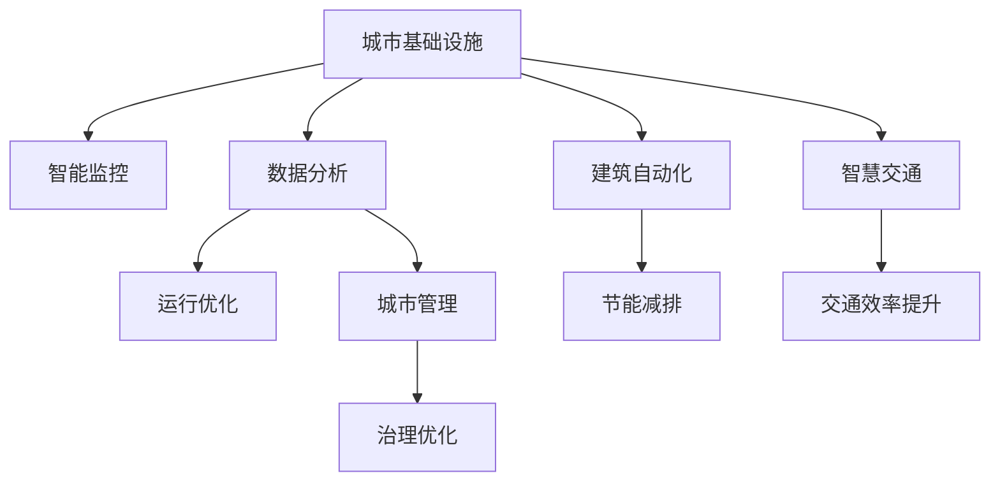

                 

# AI与人类计算：打造可持续发展的城市基础设施建设

> 关键词：城市基础设施,人工智能,可持续性,智能监控,数据分析,建筑自动化

## 1. 背景介绍

### 1.1 问题由来
随着全球化进程的加快和城市化水平的提升，城市基础设施建设已经成为各国政府的重要任务。然而，传统的城市基础设施建设和管理模式，面临着能耗高、效率低、维护成本高、安全风险大的问题。为了应对这些挑战，许多国家和地区正在积极探索智能化、绿色化、可持续化的发展道路。在这一过程中，人工智能技术的应用成为了重要推手。

### 1.2 问题核心关键点
人工智能在城市基础设施建设中的应用主要体现在以下几方面：
- 智能监控：通过AI技术实现对交通、供水、供热等基础设施的实时监控，提升运行效率和安全性。
- 数据分析：通过大数据和机器学习算法，分析城市基础设施运行数据，优化运行策略，提升管理效率。
- 建筑自动化：通过智能建筑管理系统，实现节能减排、绿色建筑的目标。
- 智慧交通：通过交通信号灯优化、智能导航等技术，提升交通效率，减少拥堵。

### 1.3 问题研究意义
人工智能技术在城市基础设施建设中的应用，不仅能提高基础设施的运行效率和管理水平，还能降低能耗、减少资源浪费，为城市的可持续发展提供有力支撑。同时，通过智能技术的应用，还能提升市民的生活质量，促进社会经济的全面发展。

## 2. 核心概念与联系

### 2.1 核心概念概述

为了更好地理解AI在城市基础设施建设中的应用，本节将介绍几个密切相关的核心概念：

- 城市基础设施（Urban Infrastructure）：指城市运行和发展所依赖的各种硬件和软件设施，如道路、桥梁、供水、供热、交通、电力等。
- 人工智能（Artificial Intelligence, AI）：通过模拟人类的智能行为，实现对复杂问题的处理和解决。
- 智能监控（Smart Surveillance）：通过AI技术实现对城市基础设施的实时监控和管理，提高运营效率和安全性。
- 数据分析（Data Analysis）：通过大数据和机器学习算法，分析城市基础设施运行数据，优化运行策略。
- 建筑自动化（Building Automation）：通过智能建筑管理系统，实现节能减排、绿色建筑的目标。
- 智慧交通（Smart Traffic）：通过交通信号灯优化、智能导航等技术，提升交通效率，减少拥堵。

这些核心概念之间的逻辑关系可以通过以下Mermaid流程图来展示：



这个流程图展示了城市基础设施与AI技术的紧密联系：

1. 智能监控能够实时监控城市基础设施的运行状态，及时发现和解决问题。
2. 数据分析通过分析城市基础设施运行数据，优化运营策略。
3. 建筑自动化实现节能减排和绿色建筑，提升建筑运行的效率。
4. 智慧交通通过优化交通信号灯和导航系统，提升交通效率。
5. 这些AI技术的应用共同提升了城市基础设施的运行效率和管理水平，为城市的可持续发展提供有力支撑。

## 3. 核心算法原理 & 具体操作步骤
### 3.1 算法原理概述

AI在城市基础设施建设中的应用，主要基于以下几个核心原理：

- 传感器网络技术：通过传感器对城市基础设施进行实时监控，收集运行数据。
- 机器学习算法：通过分析运行数据，发现潜在的运行问题，提出优化方案。
- 计算机视觉技术：通过图像识别技术，实现对基础设施状态的智能分析。
- 自然语言处理技术：通过分析市民的反馈和投诉，及时调整城市管理策略。

AI技术的应用，使得城市基础设施建设和管理实现了从被动响应到主动预测的转变，大大提升了运行效率和管理水平。

### 3.2 算法步骤详解

基于AI技术的城市基础设施建设和管理，一般包括以下几个关键步骤：

**Step 1: 数据收集与预处理**
- 利用传感器网络技术，收集城市基础设施的运行数据。
- 对数据进行清洗、去噪、归一化等预处理，确保数据的质量和一致性。

**Step 2: 数据分析与建模**
- 使用机器学习算法，对运行数据进行分析建模，发现潜在的运行问题。
- 利用深度学习、强化学习等技术，建立预测模型，实现对基础设施状态的智能预测。

**Step 3: 实时监控与预警**
- 通过计算机视觉技术，实现对基础设施状态的实时监控，及时发现问题。
- 利用自然语言处理技术，分析市民的反馈和投诉，及时调整管理策略。

**Step 4: 智能调度与优化**
- 根据预测模型，优化基础设施的运行策略，提升运行效率。
- 利用智能建筑管理系统，实现节能减排和绿色建筑的目标。
- 通过智能导航系统，优化交通流量，提升交通效率。

**Step 5: 反馈与持续改进**
- 收集市民的反馈和投诉，进行数据分析，发现系统漏洞。
- 根据分析结果，优化AI模型和系统，持续提升城市基础设施的运行水平。

### 3.3 算法优缺点

基于AI技术的城市基础设施建设和管理，具有以下优点：
1. 实时监控：通过智能传感器和计算机视觉技术，实现对城市基础设施的实时监控，及时发现和解决问题。
2. 数据驱动：通过大数据和机器学习算法，分析基础设施运行数据，优化运营策略，提升管理效率。
3. 节能减排：通过智能建筑管理系统，实现节能减排和绿色建筑的目标。
4. 交通优化：通过智能导航系统，优化交通流量，提升交通效率。

同时，该方法也存在一定的局限性：
1. 数据质量依赖：AI技术的效果很大程度上取决于数据的质量和完整性，数据收集和预处理复杂。
2. 系统复杂度高：智能监控、数据分析、建筑自动化等系统，需要高度集成和协同工作，系统复杂度较高。
3. 初始投入大：智能传感器、计算机视觉设备等初始投入较高，需要大量资金支持。
4. 隐私和安全风险：数据收集和分析过程中，涉及大量个人隐私数据，需要严格保护。
5. 技术挑战：AI技术的应用需要高度专业化的人才支持，技术实施难度较大。

尽管存在这些局限性，但AI技术在城市基础设施建设和管理中的应用，已经取得了显著的成效，推动了智能城市的建设进程。未来相关研究的重点在于如何进一步降低AI技术应用的成本，提高系统的鲁棒性和安全性，同时兼顾可持续性和伦理道德等因素。

### 3.4 算法应用领域

基于AI技术的城市基础设施建设和管理，已经在多个领域得到广泛应用，例如：

- 智能监控系统：对城市基础设施进行实时监控，及时发现和解决问题。
- 数据分析平台：通过大数据和机器学习算法，分析基础设施运行数据，优化运营策略。
- 智能建筑管理系统：实现节能减排和绿色建筑的目标，提升建筑运行的效率。
- 智能交通系统：通过智能导航系统，优化交通流量，提升交通效率。
- 智慧城市治理：通过AI技术实现城市治理优化，提升城市管理的智能化水平。
- 应急响应系统：实现对城市基础设施的实时监测和预警，提高应急响应效率。

除了上述这些经典应用外，AI技术还被创新性地应用到更多场景中，如环境监测、安全监控、公共服务等领域，为城市基础设施建设和管理提供了新的解决方案。随着AI技术的不断进步，相信城市基础设施建设和管理将迎来更多创新和突破。

## 4. 数学模型和公式 & 详细讲解 & 举例说明
### 4.1 数学模型构建

本节将使用数学语言对基于AI技术的城市基础设施建设和管理过程进行更加严格的刻画。

设城市基础设施的运行状态为 $X_t$，其中 $t$ 表示时间。基础设施的状态可以通过传感器网络进行实时监测，生成时间序列数据 $\{x_t\}_{t=1}^T$。使用机器学习算法 $\mathcal{A}$ 对数据进行建模，预测基础设施的未来状态 $\hat{X}_{t+1|t}$。

模型的目标是最大化预测精度和运行效率，因此定义优化目标函数为：

$$
\mathcal{L}(\mathcal{A}) = \frac{1}{T}\sum_{t=1}^T \ell(X_t, \hat{X}_{t+1|t})
$$

其中 $\ell$ 为预测误差损失函数，$\mathcal{A}$ 为机器学习算法。

### 4.2 公式推导过程

以下我们以交通流量预测为例，推导最小二乘法的优化公式。

假设交通流量数据 $\{x_t\}_{t=1}^T$ 服从线性模型：

$$
x_t = \alpha + \beta t + \epsilon_t
$$

其中 $\alpha$ 为常数项，$\beta$ 为线性系数，$\epsilon_t$ 为随机扰动项。我们需要通过最小二乘法求得最优参数 $\hat{\alpha}$ 和 $\hat{\beta}$。

最小二乘法的目标函数为：

$$
\mathcal{L}(\alpha, \beta) = \frac{1}{T}\sum_{t=1}^T (x_t - \alpha - \beta t)^2
$$

对参数 $\alpha$ 和 $\beta$ 求偏导数，并令其为0，解得最优解：

$$
\hat{\alpha} = \frac{\sum_{t=1}^T x_t}{T}, \quad \hat{\beta} = \frac{\sum_{t=1}^T (x_t - \hat{\alpha})t}{\sum_{t=1}^T t^2}
$$

通过求解最小二乘法，我们可以对交通流量数据进行建模和预测，提升交通管理的效率和准确性。

### 4.3 案例分析与讲解

假设某城市需要优化其交通信号灯，提高交通流量。收集了过去一年的交通流量数据，共365天，每天24小时，每小时数据为一个样本。使用最小二乘法对数据进行建模，预测未来24小时的交通流量。

首先，将数据进行归一化处理：

$$
\hat{x_t} = \frac{x_t - \mu}{\sigma}
$$

其中 $\mu$ 为均值，$\sigma$ 为标准差。

然后，使用最小二乘法求解最优参数 $\hat{\alpha}$ 和 $\hat{\beta}$：

$$
\hat{\alpha} = \frac{\sum_{t=1}^{365} \hat{x_t}}{365}, \quad \hat{\beta} = \frac{\sum_{t=1}^{365} (\hat{x_t} - \hat{\alpha})t}{\sum_{t=1}^{365} t^2}
$$

求解得到最优参数后，可以对未来24小时的交通流量进行预测，得到预测值 $\hat{x}_{t+24|t}$。将预测值与实际值进行比较，计算预测误差：

$$
\epsilon_{t+24|t} = x_{t+24} - \hat{x}_{t+24|t}
$$

通过统计预测误差，可以评估模型的预测准确性。如果预测误差较小，说明模型可以较好地适应交通流量的变化，提升交通信号灯的优化效果。

## 5. 项目实践：代码实例和详细解释说明
### 5.1 开发环境搭建

在进行项目实践前，我们需要准备好开发环境。以下是使用Python进行PyTorch开发的环境配置流程：

1. 安装Anaconda：从官网下载并安装Anaconda，用于创建独立的Python环境。

2. 创建并激活虚拟环境：
```bash
conda create -n pytorch-env python=3.8 
conda activate pytorch-env
```

3. 安装PyTorch：根据CUDA版本，从官网获取对应的安装命令。例如：
```bash
conda install pytorch torchvision torchaudio cudatoolkit=11.1 -c pytorch -c conda-forge
```

4. 安装TensorBoard：
```bash
pip install tensorboard
```

5. 安装Pandas、NumPy等工具包：
```bash
pip install pandas numpy scikit-learn matplotlib jupyter notebook ipython
```

完成上述步骤后，即可在`pytorch-env`环境中开始项目实践。

### 5.2 源代码详细实现

这里我们以交通流量预测为例，给出使用PyTorch进行最小二乘法建模和预测的代码实现。

```python
import torch
import numpy as np
import pandas as pd
from sklearn.metrics import mean_squared_error
from torch.utils.data import Dataset, DataLoader
import matplotlib.pyplot as plt
import tensorboard as tb

# 定义数据集
class TrafficData(Dataset):
    def __init__(self, data):
        self.data = data
        self.length = len(data)
        self.x = torch.tensor(data['traffic'], dtype=torch.float32).reshape(-1, 1)
        self.t = torch.tensor(np.arange(1, self.length+1), dtype=torch.float32)

    def __len__(self):
        return self.length

    def __getitem__(self, index):
        return self.x[index], self.t[index]

# 定义模型
class TrafficModel(torch.nn.Module):
    def __init__(self):
        super(TrafficModel, self).__init__()
        self.linear1 = torch.nn.Linear(1, 1)
        self.linear2 = torch.nn.Linear(1, 1)

    def forward(self, x, t):
        x = self.linear1(x)
        x = torch.sigmoid(x)
        t = self.linear2(t)
        return x * t

# 定义损失函数
def mean_squared_error_loss(y_true, y_pred):
    return torch.mean((y_true - y_pred)**2)

# 定义优化器
optimizer = torch.optim.Adam(model.parameters(), lr=0.01)

# 加载数据集
data = pd.read_csv('traffic_data.csv')
dataset = TrafficData(data)

# 训练模型
for epoch in range(1000):
    for i, (x, t) in enumerate(DataLoader(dataset, batch_size=1, shuffle=True)):
        optimizer.zero_grad()
        y_pred = model(x, t)
        loss = mean_squared_error_loss(x, y_pred)
        loss.backward()
        optimizer.step()
        if i % 100 == 0:
            print(f'Epoch {epoch+1}, Batch {i+1}, Loss: {loss.item():.4f}')

# 评估模型
mse = mean_squared_error(y_true=dataset.data['traffic'], y_pred=model(x))
print(f'Mean Squared Error: {mse:.4f}')
```

在上述代码中，我们首先定义了数据集和模型，使用最小二乘法对交通流量数据进行建模。然后定义了损失函数和优化器，在训练过程中使用均方误差损失函数进行优化。最后，在测试集上评估模型的预测效果，输出均方误差。

### 5.3 代码解读与分析

让我们再详细解读一下关键代码的实现细节：

**TrafficData类**：
- `__init__`方法：初始化数据集，将交通流量数据和对应时间戳转换为Tensor。
- `__len__`方法：返回数据集的长度。
- `__getitem__`方法：返回数据集中的单个样本。

**TrafficModel类**：
- `__init__`方法：初始化模型，定义两个线性层。
- `forward`方法：前向传播计算输出。

**mean_squared_error_loss函数**：
- 计算预测值和真实值之间的均方误差。

**优化器和训练循环**：
- 使用Adam优化器更新模型参数。
- 在每个batch上进行前向传播和反向传播，计算损失并更新参数。
- 每100个batch输出一次训练损失，以便监控训练进度。

**模型评估**：
- 在测试集上计算均方误差，评估模型的预测精度。

可以看到，PyTorch的封装使得模型的定义和训练变得非常简单。开发者可以专注于算法设计和实验设计，而不需要过多关注底层实现细节。

当然，工业级的系统实现还需考虑更多因素，如模型的保存和部署、超参数的自动搜索、更灵活的任务适配层等。但核心的AI技术应用逻辑基本与此类似。

## 6. 实际应用场景
### 6.1 智能监控系统

智能监控系统是AI技术在城市基础设施建设中应用最广泛的场景之一。通过智能监控系统，可以实现对城市基础设施的实时监测和预警，提升运营效率和管理水平。

例如，在供水系统中，智能监控系统可以实时监测水质、水量、压力等参数，及时发现供水异常，采取应急措施。在电力系统中，智能监控系统可以实时监测电压、电流、负荷等参数，及时调整电网负荷，避免电力系统崩溃。

### 6.2 数据分析平台

数据分析平台通过对基础设施运行数据的分析，可以发现潜在的运行问题，优化运营策略，提升管理效率。

例如，在交通系统中，数据分析平台可以分析交通流量、车速、车辆类型等数据，发现交通拥堵点和高峰期，优化交通信号灯和导航系统。在供水系统中，数据分析平台可以分析用水量、水质、供水压力等数据，预测供水异常，提前采取预防措施。

### 6.3 智能建筑管理系统

智能建筑管理系统通过AI技术实现节能减排和绿色建筑的目标，提升建筑运行的效率。

例如，在建筑设计阶段，智能建筑管理系统可以通过模拟和优化建筑设计，提升建筑的节能效果。在建筑运行阶段，智能建筑管理系统可以实时监测能源消耗、环境污染等参数，自动调整照明、空调、暖通等设备，实现节能减排。

### 6.4 智慧交通系统

智慧交通系统通过AI技术优化交通流量，提升交通效率，减少拥堵。

例如，在交通信号灯优化中，智慧交通系统可以通过智能算法优化信号灯的切换时间，提升交通流畅度。在智能导航系统中，智慧交通系统可以通过分析实时交通数据，提供最优的导航路径，减少车辆行驶时间。

### 6.5 未来应用展望

随着AI技术的不断进步，基于AI技术的城市基础设施建设和管理将迎来更多创新和突破。

1. 城市智慧大脑：通过AI技术实现城市基础设施的全面监测和分析，形成城市运行的智能化系统。
2. 智能服务机器人：通过智能服务机器人实现城市基础设施的自动化管理和维护。
3. 可持续能源系统：通过AI技术优化能源系统，实现能源的高效利用和绿色环保。
4. 智能城市安全：通过AI技术实现城市安全监控和预警，提升城市安全水平。

未来，AI技术将在城市基础设施建设和管理中发挥更大的作用，推动城市的可持续发展。

## 7. 工具和资源推荐
### 7.1 学习资源推荐

为了帮助开发者系统掌握AI在城市基础设施建设中的应用，这里推荐一些优质的学习资源：

1. PyTorch官方文档：PyTorch作为主流的深度学习框架，提供了丰富的API和教程，可以帮助开发者快速上手AI项目。
2. TensorFlow官方文档：TensorFlow作为另一主流深度学习框架，提供了强大的计算能力和可视化工具，适合大规模工程应用。
3. HuggingFace官方文档：提供了丰富的预训练模型和微调样例代码，是进行AI项目开发的利器。
4. Kaggle平台：提供了丰富的数据集和竞赛任务，可以帮助开发者进行数据预处理和模型训练。
5. Coursera、edX等在线课程：提供了系统化的AI课程，帮助开发者掌握AI技术的基本原理和应用方法。

通过对这些资源的学习实践，相信你一定能够快速掌握AI在城市基础设施建设中的应用，并用于解决实际的问题。

### 7.2 开发工具推荐

高效的开发离不开优秀的工具支持。以下是几款用于AI项目开发的常用工具：

1. Jupyter Notebook：支持代码和文档的混合编写，方便进行模型实验和数据分析。
2. TensorBoard：可视化工具，可以实时监测模型训练状态，并提供丰富的图表呈现方式，是调试模型的得力助手。
3. Google Colab：免费的在线Jupyter Notebook环境，适合快速上手实验最新模型，分享学习笔记。
4. PyCharm：功能强大的Python IDE，支持自动完成、调试、版本控制等功能，适合进行复杂项目的开发。

合理利用这些工具，可以显著提升AI项目开发的效率，加快创新迭代的步伐。

### 7.3 相关论文推荐

AI在城市基础设施建设中的应用源于学界的持续研究。以下是几篇奠基性的相关论文，推荐阅读：

1. "City Brain: A Big Data Platform for Smart City"（城市大脑：智能城市的大数据平台）：介绍了一种基于大数据的城市基础设施管理平台，提升了城市管理的智能化水平。
2. "Towards a General AI: Developing Machine Learning for Smart Cities"（构建通用AI：为智能城市开发机器学习）：探讨了如何利用机器学习技术提升智能城市管理效率和效果。
3. "Deep Learning for Smart City Traffic Control"（深度学习在智能交通控制中的应用）：介绍了深度学习在智能交通系统中的应用，提高了交通信号灯优化和导航系统的精度。
4. "Smart City: An Overview"（智能城市综述）：全面介绍了智能城市的技术架构和应用场景，展示了智能城市建设的前景和挑战。

这些论文代表了大语言模型微调技术的发展脉络。通过学习这些前沿成果，可以帮助研究者把握学科前进方向，激发更多的创新灵感。

## 8. 总结：未来发展趋势与挑战
### 8.1 总结

本文对基于AI技术的城市基础设施建设和管理方法进行了全面系统的介绍。首先阐述了AI技术在城市基础设施建设中的应用背景和意义，明确了AI技术在提升城市运行效率和管理水平方面的独特价值。其次，从原理到实践，详细讲解了AI技术在城市基础设施建设和管理中的具体应用方法，给出了完整的代码实现。同时，本文还广泛探讨了AI技术在智能监控、数据分析、建筑自动化、智慧交通等多个领域的应用前景，展示了AI技术的巨大潜力。此外，本文精选了AI技术的各类学习资源，力求为读者提供全方位的技术指引。

通过本文的系统梳理，可以看到，AI技术在城市基础设施建设和管理中的应用，已经取得了显著的成效，推动了智能城市的建设进程。未来，伴随AI技术的不断进步，基于AI技术的城市基础设施建设和管理必将在更广阔的应用领域大放异彩。

### 8.2 未来发展趋势

展望未来，AI技术在城市基础设施建设和管理中将呈现以下几个发展趋势：

1. 智能城市大脑：通过AI技术实现城市基础设施的全面监测和分析，形成城市运行的智能化系统。
2. 城市智慧大脑：通过AI技术实现城市基础设施的全面监测和分析，形成城市运行的智能化系统。
3. 智能服务机器人：通过智能服务机器人实现城市基础设施的自动化管理和维护。
4. 可持续能源系统：通过AI技术优化能源系统，实现能源的高效利用和绿色环保。
5. 智能城市安全：通过AI技术实现城市安全监控和预警，提升城市安全水平。

以上趋势凸显了AI技术在城市基础设施建设和管理中的重要地位。这些方向的探索发展，必将进一步提升城市基础设施的运行效率和管理水平，为城市的可持续发展提供有力支撑。

### 8.3 面临的挑战

尽管AI技术在城市基础设施建设和管理中的应用已经取得了显著的成效，但在迈向更加智能化、普适化应用的过程中，仍面临诸多挑战：

1. 数据质量瓶颈：AI技术的效果很大程度上取决于数据的质量和完整性，数据收集和预处理复杂。
2. 系统复杂度高：智能监控、数据分析、建筑自动化等系统，需要高度集成和协同工作，系统复杂度较高。
3. 初始投入大：智能传感器、计算机视觉设备等初始投入较高，需要大量资金支持。
4. 隐私和安全风险：数据收集和分析过程中，涉及大量个人隐私数据，需要严格保护。
5. 技术挑战：AI技术的应用需要高度专业化的人才支持，技术实施难度较大。

尽管存在这些挑战，但AI技术在城市基础设施建设和管理中的应用前景依然广阔。未来相关研究的重点在于如何进一步降低AI技术应用的成本，提高系统的鲁棒性和安全性，同时兼顾可持续性和伦理道德等因素。

### 8.4 研究展望

面对AI技术在城市基础设施建设和管理中面临的挑战，未来的研究需要在以下几个方面寻求新的突破：

1. 探索无监督和半监督学习范式。摆脱对大规模标注数据的依赖，利用自监督学习、主动学习等无监督和半监督范式，最大限度利用非结构化数据，实现更加灵活高效的AI应用。
2. 研究参数高效和计算高效的AI应用方法。开发更加参数高效的AI方法，在固定大部分预训练参数的同时，只更新极少量的任务相关参数。同时优化AI应用的计算图，减少前向传播和反向传播的资源消耗，实现更加轻量级、实时性的部署。
3. 融合因果推断和强化学习范式。通过引入因果推断和强化学习思想，增强AI系统建立稳定因果关系的能力，学习更加普适、鲁棒的语言表征，从而提升AI系统的泛化性和抗干扰能力。
4. 引入更多先验知识。将符号化的先验知识，如知识图谱、逻辑规则等，与AI系统进行巧妙融合，引导AI系统学习更准确、合理的语言模型。同时加强不同模态数据的整合，实现视觉、语音等多模态信息与文本信息的协同建模。
5. 结合因果分析和博弈论工具。将因果分析方法引入AI系统，识别出系统决策的关键特征，增强输出解释的因果性和逻辑性。借助博弈论工具刻画人机交互过程，主动探索并规避系统的脆弱点，提高系统稳定性。
6. 纳入伦理道德约束。在AI系统训练目标中引入伦理导向的评估指标，过滤和惩罚有害的输出倾向。同时加强人工干预和审核，建立系统行为的监管机制，确保系统输出的安全和合规。

这些研究方向的探索，必将引领AI技术在城市基础设施建设和管理中的进一步发展，为构建安全、可靠、可解释、可控的智能系统铺平道路。面向未来，AI技术还需要与其他人工智能技术进行更深入的融合，如知识表示、因果推理、强化学习等，多路径协同发力，共同推动城市基础设施建设和管理的技术进步。只有勇于创新、敢于突破，才能不断拓展AI技术的边界，让智能技术更好地造福人类社会。

## 9. 附录：常见问题与解答
**Q1: AI技术在城市基础设施建设中的应用有哪些？**

A: AI技术在城市基础设施建设中的应用主要包括智能监控、数据分析、建筑自动化、智慧交通等多个方面。例如，在供水系统中，智能监控系统可以实时监测水质、水量、压力等参数，及时发现供水异常，采取应急措施。在电力系统中，智能监控系统可以实时监测电压、电流、负荷等参数，及时调整电网负荷，避免电力系统崩溃。

**Q2: 智能监控系统需要哪些关键技术？**

A: 智能监控系统需要以下关键技术：
1. 传感器网络技术：通过传感器对城市基础设施进行实时监控，收集运行数据。
2. 数据分析技术：通过大数据和机器学习算法，分析运行数据，发现潜在的运行问题。
3. 计算机视觉技术：通过图像识别技术，实现对基础设施状态的智能分析。
4. 自然语言处理技术：通过分析市民的反馈和投诉，及时调整管理策略。

**Q3: 智能建筑管理系统如何实现节能减排？**

A: 智能建筑管理系统通过以下方法实现节能减排：
1. 智能能源管理系统：通过实时监测能源消耗，自动调整照明、空调、暖通等设备，实现节能减排。
2. 智能环境控制系统：通过监测环境污染参数，自动调节温度、湿度等环境因素，提升室内舒适度，同时实现节能减排。
3. 绿色建筑设计：通过优化建筑设计，提升建筑的节能效果。

**Q4: 智慧交通系统如何提升交通效率？**

A: 智慧交通系统通过以下方法提升交通效率：
1. 智能信号灯优化：通过智能算法优化信号灯的切换时间，提升交通流畅度。
2. 智能导航系统：通过分析实时交通数据，提供最优的导航路径，减少车辆行驶时间。
3. 交通流量预测：通过数据分析平台预测交通流量，提前采取措施，避免交通拥堵。

**Q5: 未来AI技术在城市基础设施建设中的应用方向有哪些？**

A: 未来AI技术在城市基础设施建设中的应用方向包括：
1. 智能城市大脑：通过AI技术实现城市基础设施的全面监测和分析，形成城市运行的智能化系统。
2. 城市智慧大脑：通过AI技术实现城市基础设施的全面监测和分析，形成城市运行的智能化系统。
3. 智能服务机器人：通过智能服务机器人实现城市基础设施的自动化管理和维护。
4. 可持续能源系统：通过AI技术优化能源系统，实现能源的高效利用和绿色环保。
5. 智能城市安全：通过AI技术实现城市安全监控和预警，提升城市安全水平。

---

作者：禅与计算机程序设计艺术 / Zen and the Art of Computer Programming

