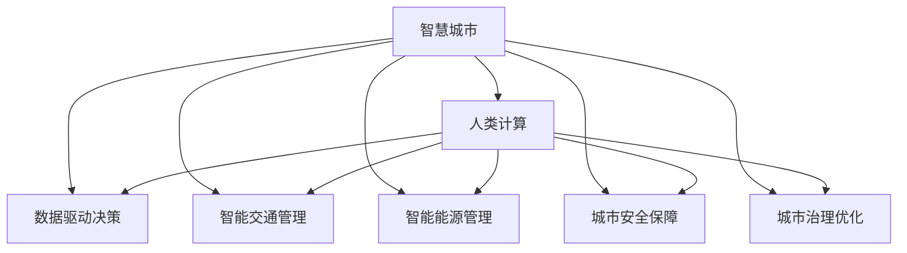

                 

# AI与人类计算：打造可持续发展的城市生活

> 关键词：智慧城市,人类计算,可持续发展,城市规划,人工智能,智能交通

## 1. 背景介绍

### 1.1 问题由来
在当今快速城市化进程中，如何打造一个宜居、可持续、高效的城市环境，成为了全球范围内亟待解决的问题。城市化带来的环境压力、交通拥堵、资源浪费等问题日益凸显，传统城市规划和管理方式面临巨大挑战。而随着人工智能（AI）技术的迅猛发展，以AI为核心的“人类计算”概念应运而生，为城市生活带来了全新的解决方案。

### 1.2 问题核心关键点
“人类计算”融合了人机协同、智慧计算、数据分析等前沿技术，通过优化资源配置、提升管理效率、改善人居环境，实现城市的可持续发展。关键点包括：
1. 数据驱动决策：以大数据、物联网等技术为基础，提供全面的城市运行监控和数据分析。
2. 智慧交通管理：利用AI技术优化交通流、减少拥堵、提升出行效率。
3. 智能能源管理：通过AI实现能源的智能调度，提升能源利用率。
4. 城市安全保障：构建智能监控体系，实时预警和应对城市风险。
5. 城市治理优化：利用AI技术进行精准扶贫、环保监测、公共服务优化等。

### 1.3 问题研究意义
研究“人类计算”在城市生活中的应用，对于改善城市居民生活质量、推动城市管理模式转型、实现绿色可持续发展具有重要意义：
1. 提升城市管理效率：通过数据分析和智能决策，显著提升城市管理效率。
2. 改善人居环境：优化资源分配，改善基础设施，提升公共服务质量。
3. 应对环境压力：减少能源消耗和废物排放，促进绿色低碳发展。
4. 保障公共安全：通过智能监控和预警系统，保障城市运行安全。
5. 推动城市创新：引入AI技术，激发城市发展新动能，打造智慧城市。

## 2. 核心概念与联系

### 2.1 核心概念概述

为更好地理解“人类计算”在城市生活中的应用，本节将介绍几个密切相关的核心概念：

- 智慧城市(Smart City)：利用信息和通信技术（ICT），结合AI等先进技术，提升城市管理效率和居民生活质量。
- 人类计算(Human Computation)：融合人机协同、智慧计算等技术，通过人工智能优化资源配置，提升城市运行效率。
- 数据驱动决策(Data-Driven Decision Making)：基于大数据分析和机器学习，辅助城市管理者做出科学决策。
- 智能交通管理(Intelligent Traffic Management)：利用AI技术优化交通流量，减少拥堵，提升出行效率。
- 智能能源管理(Smart Energy Management)：通过AI实现能源的智能调度，提升能源利用率。
- 城市安全保障(Security in Smart Cities)：构建智能监控体系，实时预警和应对城市风险。
- 城市治理优化(Governance Optimization)：利用AI技术进行精准扶贫、环保监测、公共服务优化等。

这些核心概念之间的逻辑关系可以通过以下Mermaid流程图来展示：



这个流程图展示了大语言模型的核心概念及其之间的关系：

1. 智慧城市通过融合AI等先进技术，实现城市运行的智能化和高效化。
2. 人类计算依托智慧城市的运行数据，优化资源配置和决策过程。
3. 数据驱动决策、智能交通管理、智能能源管理、城市安全保障、城市治理优化等，都是智慧城市和人类计算的具体应用场景。

这些概念共同构成了智慧城市和人类计算的理论基础，推动着城市生活和管理的智能化进程。通过理解这些核心概念，我们可以更好地把握“人类计算”的工作原理和优化方向。

## 3. 核心算法原理 & 具体操作步骤
### 3.1 算法原理概述

“人类计算”在城市生活中的应用，主要基于AI技术的大数据处理和机器学习算法。其核心思想是通过数据驱动决策，实现城市运行的智能化和高效化。

形式化地，假设城市运行数据为 $\mathcal{D}=\{(x_i, y_i)\}_{i=1}^N$，其中 $x_i$ 为输入数据（如交通流量、能源消耗、环境监测等），$y_i$ 为对应的输出数据（如交通流量预测、能源调度方案、环境质量评估等）。目标是找到最优的决策模型 $M$，使得模型在预测新数据时的误差最小化：

$$
\min_{M} \frac{1}{N} \sum_{i=1}^N \ell(y_i, M(x_i))
$$

其中 $\ell$ 为损失函数，通常采用均方误差、交叉熵等常见形式。通过梯度下降等优化算法，不断更新模型参数，最小化损失函数，使得模型输出逼近真实标签。

### 3.2 算法步骤详解

“人类计算”在城市生活中的应用一般包括以下几个关键步骤：

**Step 1: 数据采集与预处理**
- 收集城市运行相关数据，包括交通流量、能源消耗、环境监测等。
- 对数据进行清洗和预处理，确保数据质量和一致性。
- 数据进行特征提取和变换，用于后续的模型训练。

**Step 2: 模型训练与优化**
- 选择合适的模型（如回归模型、分类模型、强化学习模型等），进行训练。
- 使用优化算法（如梯度下降、Adam、随机梯度下降等），最小化损失函数。
- 应用正则化技术（如L2正则、Dropout等），防止过拟合。
- 引入超参数调优，提高模型泛化能力。

**Step 3: 模型评估与验证**
- 在测试集上评估模型性能，使用准确率、召回率、F1值等指标。
- 使用交叉验证等方法，确保模型在不同数据集上的泛化性能。
- 根据评估结果，调整模型参数和训练策略，进一步优化模型。

**Step 4: 模型部署与应用**
- 将训练好的模型部署到实际的城市运行环境中，进行实时预测和决策。
- 构建智能监控和预警系统，实时监测和调整城市运行状态。
- 持续收集新数据，定期更新模型，确保模型的时效性和准确性。

以上是“人类计算”在城市生活中的一般流程。在实际应用中，还需要针对具体任务的特点，对模型训练和应用进行优化设计，如改进数据采集方式，引入更多的正则化技术，搜索最优的超参数组合等，以进一步提升模型性能。

### 3.3 算法优缺点

基于“人类计算”的AI方法具有以下优点：
1. 提升决策效率：数据驱动的决策过程，能够快速分析复杂的城市运行数据，辅助城市管理者做出高效决策。
2. 优化资源配置：通过AI技术，实现交通、能源、环保等资源的智能配置，提升城市运行效率。
3. 增强环境监测：AI技术可以实现对环境污染、气象变化的实时监测和预警，提升城市环境质量。
4. 改善公共服务：通过智能分析，优化城市公共服务布局和资源分配，提升居民生活质量。

同时，该方法也存在一定的局限性：
1. 依赖高质量数据：模型的性能高度依赖于数据质量和数据量，数据采集和处理成本较高。
2. 模型复杂度较高：AI模型通常较为复杂，需要较高的计算资源和时间成本。
3. 需要专业人才：AI模型的训练和应用需要具备高水平的数据科学和机器学习人才，人才资源配置难度较大。
4. 模型鲁棒性不足：AI模型可能受到数据偏差和异常值的影响，需要持续优化和验证。

尽管存在这些局限性，但就目前而言，基于“人类计算”的AI方法仍然是城市管理智能化转型中的重要手段。未来相关研究的重点在于如何进一步降低数据采集成本，提高模型的可解释性和鲁棒性，同时兼顾公共安全和伦理道德等重要因素。

### 3.4 算法应用领域

基于“人类计算”的AI方法，在城市生活中已经得到了广泛的应用，覆盖了城市管理的各个方面，例如：

- 交通管理：通过AI技术优化交通信号控制、智能导航、实时交通流量预测等，提高交通运行效率。
- 能源管理：利用AI技术进行能源的智能调度，优化电力、水务、燃气等资源的分配和利用。
- 环保监测：通过AI技术实时监测环境污染数据，预警和处理环境问题，提升环境质量。
- 公共服务：利用AI技术进行精准扶贫、教育资源分配、医疗资源调度等，提升公共服务水平。
- 智慧建筑：通过AI技术优化建筑能源管理、智能安防、人流量监测等，提升建筑管理效率。
- 安全保障：构建智能监控系统，实时预警和应对城市安全事件，提升城市应急响应能力。

除了上述这些经典应用外，AI技术还被创新性地应用到更多场景中，如智慧农业、城市旅游、智慧停车等，为城市管理带来了新的突破。随着AI技术的不断进步，相信AI将在更广泛的领域得到应用，进一步提升城市生活的智能化和可持续性。

## 4. 数学模型和公式 & 详细讲解  
### 4.1 数学模型构建

本节将使用数学语言对“人类计算”在城市生活中的应用进行更加严格的刻画。

假设城市运行数据为 $\mathcal{D}=\{(x_i, y_i)\}_{i=1}^N, x_i \in \mathcal{X}, y_i \in \mathcal{Y}$，其中 $\mathcal{X}$ 为输入空间，$\mathcal{Y}$ 为输出空间。定义模型 $M_{\theta}$ 在输入 $x$ 上的输出为 $\hat{y}=M_{\theta}(x) \in [0,1]$，表示样本属于某一类别的概率。真实标签 $y \in \{0,1\}$。则二分类交叉熵损失函数定义为：

$$
\ell(M_{\theta}(x),y) = -[y\log \hat{y} + (1-y)\log (1-\hat{y})]
$$

将其代入经验风险公式，得：

$$
\mathcal{L}(\theta) = -\frac{1}{N}\sum_{i=1}^N [y_i\log M_{\theta}(x_i)+(1-y_i)\log(1-M_{\theta}(x_i))]
$$

在得到损失函数的梯度后，即可带入参数更新公式，完成模型的迭代优化。重复上述过程直至收敛，最终得到适应城市运行任务的最优模型参数 $\theta^*$。

### 4.2 公式推导过程

以下我们以城市交通流量预测为例，推导回归模型的最小二乘损失函数及其梯度的计算公式。

假设模型 $M_{\theta}$ 在输入 $x$ 上的输出为 $\hat{y}=M_{\theta}(x) \in \mathbb{R}$，表示预测的交通流量。真实标签 $y \in \mathbb{R}$，表示实际的交通流量。则回归问题的最小二乘损失函数定义为：

$$
\ell(M_{\theta}(x),y) = \frac{1}{2N}\sum_{i=1}^N (y_i - M_{\theta}(x_i))^2
$$

将其代入经验风险公式，得：

$$
\mathcal{L}(\theta) = \frac{1}{2N}\sum_{i=1}^N (y_i - M_{\theta}(x_i))^2
$$

根据链式法则，损失函数对参数 $\theta_k$ 的梯度为：

$$
\frac{\partial \mathcal{L}(\theta)}{\partial \theta_k} = -\frac{1}{N}\sum_{i=1}^N (y_i - M_{\theta}(x_i))\frac{\partial M_{\theta}(x_i)}{\partial \theta_k}
$$

其中 $\frac{\partial M_{\theta}(x_i)}{\partial \theta_k}$ 可进一步递归展开，利用自动微分技术完成计算。

在得到损失函数的梯度后，即可带入参数更新公式，完成模型的迭代优化。重复上述过程直至收敛，最终得到适应交通流量预测任务的最优模型参数 $\theta^*$。

## 5. 项目实践：代码实例和详细解释说明
### 5.1 开发环境搭建

在进行城市交通流量预测的AI项目开发时，需要准备相应的开发环境。以下是使用Python进行TensorFlow开发的环境配置流程：

1. 安装Anaconda：从官网下载并安装Anaconda，用于创建独立的Python环境。

2. 创建并激活虚拟环境：
```bash
conda create -n tf-env python=3.8 
conda activate tf-env
```

3. 安装TensorFlow：根据CUDA版本，从官网获取对应的安装命令。例如：
```bash
conda install tensorflow-gpu -c conda-forge -c pytorch -c defaults
```

4. 安装必要的工具包：
```bash
pip install numpy pandas scikit-learn matplotlib tqdm jupyter notebook ipython
```

完成上述步骤后，即可在`tf-env`环境中开始AI项目开发。

### 5.2 源代码详细实现

下面我们以城市交通流量预测为例，给出使用TensorFlow进行AI模型开发的PyTorch代码实现。

首先，定义交通流量数据处理函数：

```python
import tensorflow as tf
from tensorflow.keras import layers
import numpy as np
import pandas as pd
from sklearn.preprocessing import MinMaxScaler

def load_data(file_path, sequence_length):
    data = pd.read_csv(file_path, index_col=0)
    data = data.dropna()
    x = data[['temperature', 'humidity', 'wind_speed', 'pressure', 'traffic_volume']].shift(1).dropna()
    y = data['traffic_volume'].shift(1).dropna()
    x = x[:-sequence_length]
    y = y[:-sequence_length]
    x = x.values.reshape((-1, sequence_length, x.shape[1]))
    y = y.values.reshape((-1, 1))
    scaler = MinMaxScaler()
    x = scaler.fit_transform(x)
    y = scaler.fit_transform(y)
    return x, y

file_path = 'traffic_data.csv'
sequence_length = 24

x, y = load_data(file_path, sequence_length)
```

然后，定义模型：

```python
def build_model(input_shape):
    model = tf.keras.Sequential([
        layers.LSTM(64, input_shape=input_shape),
        layers.Dense(1, activation='sigmoid')
    ])
    return model

model = build_model(x.shape[1:])
```

接着，定义训练和评估函数：

```python
def compile_model(model, optimizer):
    model.compile(optimizer=optimizer, loss='binary_crossentropy', metrics=['accuracy'])

def train_model(model, x_train, y_train, x_valid, y_valid, epochs=10, batch_size=32):
    model.fit(x_train, y_train, epochs=epochs, batch_size=batch_size, validation_data=(x_valid, y_valid))

def evaluate_model(model, x_test, y_test):
    loss, acc = model.evaluate(x_test, y_test)
    print(f'Test loss: {loss:.4f}, Test accuracy: {acc:.4f}')
```

最后，启动训练流程并在测试集上评估：

```python
optimizer = tf.keras.optimizers.Adam(learning_rate=0.001)

x_train, y_train = x[:train_size], y[:train_size]
x_valid, y_valid = x[train_size:], y[train_size:]
x_test, y_test = x[-test_size:], y[-test_size:]

train_model(model, x_train, y_train, x_valid, y_valid)
evaluate_model(model, x_test, y_test)
```

以上就是使用TensorFlow进行城市交通流量预测的完整代码实现。可以看到，TensorFlow提供了强大的API支持，使得模型构建和训练变得简单易用。

### 5.3 代码解读与分析

让我们再详细解读一下关键代码的实现细节：

**load_data函数**：
- 定义了从CSV文件中加载数据，并进行预处理的过程。
- 加载数据后，对缺失值进行补齐，对特征进行归一化。
- 将数据转化为模型所需的输入格式，即3D张量。

**build_model函数**：
- 定义了基于LSTM的回归模型。
- LSTM层接收输入序列，并通过多个时间步的计算，输出一个标量预测值。
- 最后添加一个全连接层，将LSTM的输出映射为0到1之间的预测值。

**compile_model函数**：
- 定义了模型的优化器和损失函数。
- 使用Adam优化器，并设定二分类交叉熵损失函数。

**train_model函数**：
- 定义了模型的训练过程。
- 使用训练集数据进行模型训练，并通过验证集数据评估模型性能。
- 设置训练轮数和批次大小，以控制模型的训练过程。

**evaluate_model函数**：
- 定义了模型在测试集上的评估过程。
- 计算模型的损失和准确率，并打印输出。

**训练流程**：
- 定义模型、优化器等，并进行编译。
- 使用训练集和验证集数据训练模型，并记录训练日志。
- 在测试集上评估模型性能，输出最终结果。

可以看出，TensorFlow提供的Keras API使得模型构建和训练过程非常简单，极大地简化了开发工作。

当然，工业级的系统实现还需考虑更多因素，如模型的保存和部署、超参数的自动搜索、更灵活的任务适配层等。但核心的AI计算过程基本与此类似。

## 6. 实际应用场景
### 6.1 智能交通管理

基于AI的城市交通流量预测，可以应用于智能交通管理系统的构建。传统交通管理往往依赖于人工监控和手动调节，效率低下且易出错。而使用AI技术进行交通流量预测，可以实时监测和分析交通数据，自动调整信号灯和路线，实现交通流量的优化管理。

在技术实现上，可以收集城市的交通流量、天气、时间等信息，利用AI技术进行交通流量预测和路径规划。系统根据预测结果，动态调整信号灯和路线，实现交通流量平衡。对于突发的交通事件，系统还可以实时调整，确保交通系统的稳定运行。如此构建的智能交通管理系统，能够大幅提升城市的通行效率，减少交通拥堵。

### 6.2 智能能源管理

利用AI技术进行城市能源的智能调度，可以提升能源利用率，减少能源浪费。传统的能源管理依赖人工经验和固定规则，难以应对实时变化的需求。而使用AI技术进行能源预测和优化，可以实时监测和分析能源数据，自动调整能源分配和调度，实现能源的高效利用。

具体而言，可以收集城市的电力、水务、燃气等能源使用数据，利用AI技术进行能源预测和优化。系统根据预测结果，动态调整能源分配和调度，实现能源的合理利用。对于突发的能源事件，系统还可以实时调整，确保能源系统的稳定运行。如此构建的智能能源管理系统，能够大幅提升城市的能源利用效率，降低能源消耗。

### 6.3 环保监测

AI技术在环保监测中也具有广泛的应用。传统的环保监测依赖人工巡检和手动分析，难以应对环境污染的快速变化。而使用AI技术进行环境污染预测和监测，可以实时监测和分析环境数据，自动预警和处理环境问题，提升环境质量。

具体而言，可以收集城市的空气质量、水质、噪音等信息，利用AI技术进行环境污染预测和监测。系统根据预测结果，实时预警和处理环境问题，确保城市的绿色发展。对于突发的环境事件，系统还可以实时调整，确保环境系统的稳定运行。如此构建的智能环保监测系统，能够大幅提升城市的环保水平，提升居民的生活质量。

### 6.4 未来应用展望

随着AI技术的不断进步，基于“人类计算”的AI方法将在更多领域得到应用，为城市生活带来新的变革。

在智慧医疗领域，基于AI的疾病预测和医疗资源优化，将提升医疗服务的智能化水平，辅助医生诊疗，加速新药开发进程。

在智能教育领域，利用AI技术进行教育资源的优化和学生的个性化学习路径规划，因材施教，促进教育公平，提高教学质量。

在智慧城市治理中，构建智能监控和预警系统，实时监测和调整城市运行状态，提高城市管理的自动化和智能化水平，构建更安全、高效的未来城市。

此外，在企业生产、社会治理、文娱传媒等众多领域，基于AI的智能计算范式也将不断涌现，为城市生活带来新的突破。相信随着技术的日益成熟，AI技术将成为城市管理智能化转型中的重要手段，推动城市生活向更加智能化、可持续化方向发展。

## 7. 工具和资源推荐
### 7.1 学习资源推荐

为了帮助开发者系统掌握AI技术在城市生活中的应用，这里推荐一些优质的学习资源：

1. TensorFlow官方文档：提供完整的TensorFlow开发文档和API文档，涵盖从基础到高级的内容，是学习TensorFlow的必备资源。

2. Keras官方文档：提供Keras的API参考文档，涵盖模型构建、训练、评估等各环节的详细说明。

3. Udacity《深度学习纳米学位》课程：涵盖深度学习在城市管理中的应用，通过实例教学，使学习者掌握实际应用能力。

4. Coursera《机器学习》课程：由斯坦福大学教授Andrew Ng主讲，深入浅出地讲解机器学习的基本原理和应用，适合初学者入门。

5. NVIDIA《深度学习与计算机视觉》课程：提供深度学习在计算机视觉、自然语言处理等领域的实战经验，涵盖最新技术前沿。

通过学习这些资源，相信你一定能够系统掌握AI技术在城市生活中的应用，并用于解决实际的AI问题。

### 7.2 开发工具推荐

高效的开发离不开优秀的工具支持。以下是几款用于AI开发常用的工具：

1. Jupyter Notebook：开源的交互式开发环境，支持多种编程语言和库，适合快速迭代研究。

2. Google Colab：谷歌提供的在线Jupyter Notebook环境，免费提供GPU/TPU算力，方便学习者进行实验和分享。

3. PyTorch：基于Python的开源深度学习框架，灵活的计算图，支持多种GPU设备，适合快速原型开发。

4. TensorFlow：由Google主导开发的开源深度学习框架，生产部署方便，适合大规模工程应用。

5. Keras：高层次的神经网络API，易于上手，适合快速原型开发和实验。

6. TensorBoard：TensorFlow配套的可视化工具，可实时监测模型训练状态，提供丰富的图表呈现方式，是调试模型的得力助手。

合理利用这些工具，可以显著提升AI开发效率，加速技术创新的步伐。

### 7.3 相关论文推荐

AI技术在城市生活中的应用源于学界的持续研究。以下是几篇奠基性的相关论文，推荐阅读：

1. Smart City Technologies: A Review of Smart City Technologies and Applications: 综述了智慧城市技术的现状和发展，涵盖了数据驱动决策、智能交通管理、智能能源管理等多个方面。

2. Human-Centric Smart Cities: A Review and Future Directions: 综述了人本智能城市的研究现状和未来方向，探讨了智能城市与人类福祉的关系。

3. AI for City Management: A Survey: 综述了AI技术在城市管理中的应用，涵盖交通、能源、环保等多个领域，提供了丰富的案例分析。

4. Deep Learning for Smart Cities: A Survey and Future Directions: 综述了深度学习在智慧城市中的应用，提供了最新的技术进展和未来展望。

5. Smart City Data Analytics: A Survey: 综述了智慧城市数据分析的研究现状和未来方向，探讨了大数据、机器学习在城市管理中的应用。

这些论文代表了大语言模型微调技术的发展脉络。通过学习这些前沿成果，可以帮助研究者把握学科前进方向，激发更多的创新灵感。

## 8. 总结：未来发展趋势与挑战

### 8.1 总结

本文对基于“人类计算”的AI技术在城市生活中的应用进行了全面系统的介绍。首先阐述了AI技术在城市管理中的重要性，明确了数据驱动决策和智能计算的独特价值。其次，从原理到实践，详细讲解了AI模型的构建、训练和评估过程，给出了AI项目开发的完整代码实现。同时，本文还广泛探讨了AI技术在智能交通管理、智能能源管理、环保监测等多个行业领域的应用前景，展示了AI技术带来的巨大潜力。此外，本文精选了AI技术的各类学习资源，力求为读者提供全方位的技术指引。

通过本文的系统梳理，可以看到，基于“人类计算”的AI技术在城市生活中具有广阔的应用前景，能够显著提升城市管理效率和居民生活质量，推动城市管理模式转型，实现绿色可持续发展。未来，随着AI技术的不断演进，基于“人类计算”的AI技术将会在更多领域得到应用，为城市生活带来新的变革。

### 8.2 未来发展趋势

展望未来，基于“人类计算”的AI技术将呈现以下几个发展趋势：

1. 模型规模持续增大。随着算力成本的下降和数据规模的扩张，AI模型的参数量还将持续增长。超大批次的训练和推理也将成为可能。

2. 模型鲁棒性增强。未来的AI模型将具备更强的鲁棒性和泛化能力，能够在多种场景下稳定运行。

3. 智能决策支持。AI技术将与人类专家协同工作，提升决策的科学性和准确性。

4. 多模态融合。未来的AI技术将实现视觉、语音、文本等多种模态的融合，提供更全面的城市运行数据。

5. 实时计算优化。未来的AI技术将实现更高效的计算图优化，支持实时计算和大规模并发。

6. 隐私保护提升。未来的AI技术将更注重用户隐私保护，确保数据安全性和合法性。

以上趋势凸显了基于“人类计算”的AI技术的广阔前景。这些方向的探索发展，必将进一步提升AI技术的智能化和可持续性，为城市生活带来新的突破。

### 8.3 面临的挑战

尽管基于“人类计算”的AI技术已经取得了瞩目成就，但在迈向更加智能化、普适化应用的过程中，它仍面临着诸多挑战：

1. 数据隐私和安全：AI模型的训练和应用过程中，涉及大量敏感数据，如何保护用户隐私，确保数据安全，将是一大难题。

2. 模型可解释性：AI模型的决策过程通常缺乏可解释性，难以对其推理逻辑进行分析和调试，增加了模型使用的复杂性。

3. 模型公平性和偏见：AI模型可能会学习到有偏见、有害的信息，通过微调传递到下游任务，产生误导性、歧视性的输出，给实际应用带来安全隐患。

4. 模型复杂性和计算资源：大模型需要大量的计算资源和时间成本，如何在保证性能的同时，简化模型结构，提升推理速度，优化资源占用，将是重要的优化方向。

5. 伦理和法律问题：AI技术的应用涉及复杂的伦理和法律问题，如何在保护用户隐私、确保模型公正性的同时，满足各种法律法规要求，将是一大挑战。

6. 技术成熟度：AI技术在城市生活中的应用仍处于初步探索阶段，许多关键技术尚未成熟，需要持续研究和发展。

正视这些挑战，积极应对并寻求突破，将是大语言模型微调走向成熟的必由之路。相信随着学界和产业界的共同努力，这些挑战终将一一被克服，基于“人类计算”的AI技术必将在构建安全、可靠、可解释、可控的智能系统铺平道路。面向未来，基于“人类计算”的AI技术还需要与其他人工智能技术进行更深入的融合，如知识表示、因果推理、强化学习等，多路径协同发力，共同推动自然语言理解和智能交互系统的进步。

### 8.4 研究展望

未来基于“人类计算”的AI技术的研究方向在于以下几个方面：

1. 深度学习和强化学习的融合：探索将深度学习与强化学习相结合，提升AI模型的智能化和适应性。

2. 多模态数据的融合：探索如何有效融合视觉、语音、文本等多种模态数据，提升城市运行数据的全面性和准确性。

3. 因果推理和逻辑推理：探索如何通过因果推理和逻辑推理，提升AI模型的解释能力和可信度。

4. 智能决策支持系统：探索如何构建智能决策支持系统，提升城市管理的智能化水平。

5. 隐私保护技术：探索如何通过隐私保护技术，保护用户隐私，确保数据安全。

6. 伦理和法律框架：探索如何建立伦理和法律框架，确保AI技术应用的公平性和安全性。

7. 可持续性优化：探索如何优化AI技术的可持续性，确保其在环境、社会等方面的正向影响。

这些研究方向将推动基于“人类计算”的AI技术迈向更高的台阶，为构建安全、可靠、可解释、可控的智能系统铺平道路。面向未来，基于“人类计算”的AI技术还需要与其他人工智能技术进行更深入的融合，如知识表示、因果推理、强化学习等，多路径协同发力，共同推动自然语言理解和智能交互系统的进步。

## 9. 附录：常见问题与解答

**Q1：基于“人类计算”的AI技术在城市生活中有哪些实际应用？**

A: 基于“人类计算”的AI技术在城市生活中有着广泛的应用，包括：

1. 智能交通管理：通过AI技术优化交通信号控制、智能导航、实时交通流量预测等，提高交通运行效率。

2. 智能能源管理：利用AI技术进行能源的智能调度，优化电力、水务、燃气等资源的分配和利用。

3. 环保监测：AI技术可以实时监测环境污染数据，预警和处理环境问题，提升环境质量。

4. 智能公共服务：利用AI技术进行精准扶贫、教育资源分配、医疗资源调度等，提升公共服务水平。

5. 智慧建筑管理：通过AI技术优化建筑能源管理、智能安防、人流量监测等，提升建筑管理效率。

6. 城市安全保障：构建智能监控系统，实时预警和应对城市安全事件，提升城市应急响应能力。

**Q2：在构建基于“人类计算”的AI系统时，如何确保系统的鲁棒性和泛化能力？**

A: 确保基于“人类计算”的AI系统的鲁棒性和泛化能力，主要可以从以下几个方面入手：

1. 数据采集与预处理：确保数据质量，进行数据清洗和特征工程，减少数据偏差和噪音。

2. 模型选择与调参：选择适合的模型，进行超参数调优，确保模型在各种数据和场景下都能取得良好的性能。

3. 正则化和优化算法：引入正则化技术（如L2正则、Dropout等），使用优化算法（如Adam、SGD等），防止过拟合，提高模型泛化能力。

4. 模型验证与评估：在模型训练过程中，进行交叉验证和评估，确保模型在不同数据集和场景下都能稳定运行。

5. 持续学习与更新：通过持续学习，定期更新模型，确保模型能够适应数据分布的变化，保持高效和稳定。

6. 模型集成与融合：通过模型集成和融合，提升系统的鲁棒性和泛化能力，降低单一模型的不确定性。

**Q3：在城市管理中，如何利用AI技术进行数据驱动决策？**

A: 利用AI技术进行数据驱动决策，主要可以分为以下几个步骤：

1. 数据收集与预处理：收集城市运行相关数据，包括交通流量、能源消耗、环境监测等，进行清洗和预处理，确保数据质量和一致性。

2. 数据融合与特征工程：将不同来源的数据进行融合，提取有意义的特征，用于后续的模型训练。

3. 模型选择与训练：选择合适的模型（如回归模型、分类模型、强化学习模型等），进行训练，最小化损失函数。

4. 模型评估与验证：在验证集上评估模型性能，使用准确率、召回率、F1值等指标，确保模型在不同数据集上的泛化性能。

5. 模型部署与应用：将训练好的模型部署到实际的城市运行环境中，进行实时预测和决策，构建智能监控和预警系统。

6. 持续学习与更新：通过持续学习，定期更新模型，确保模型能够适应数据分布的变化，保持高效和稳定。

通过以上步骤，可以构建数据驱动的决策系统，提升城市管理的智能化和高效化水平。

**Q4：在智能交通管理中，如何利用AI技术进行交通流量预测？**

A: 利用AI技术进行交通流量预测，主要可以分为以下几个步骤：

1. 数据采集与预处理：收集城市的交通流量、天气、时间等信息，进行清洗和预处理，确保数据质量和一致性。

2. 数据融合与特征工程：将不同来源的数据进行融合，提取有意义的特征，如交通流量、温度、湿度等，用于后续的模型训练。

3. 模型选择与训练：选择合适的模型（如LSTM、RNN等），进行训练，最小化损失函数。

4. 模型评估与验证：在验证集上评估模型性能，使用准确率、均方误差等指标，确保模型在不同数据集上的泛化性能。

5. 模型部署与应用：将训练好的模型部署到实际的城市交通系统中，进行实时交通流量预测，优化交通信号控制和导航路线。

6. 持续学习与更新：通过持续学习，定期更新模型，确保模型能够适应交通流的变化，保持预测的准确性。

通过以上步骤，可以构建智能交通流量预测系统，提升城市交通管理的智能化和高效化水平。

---

作者：禅与计算机程序设计艺术 / Zen and the Art of Computer Programming

