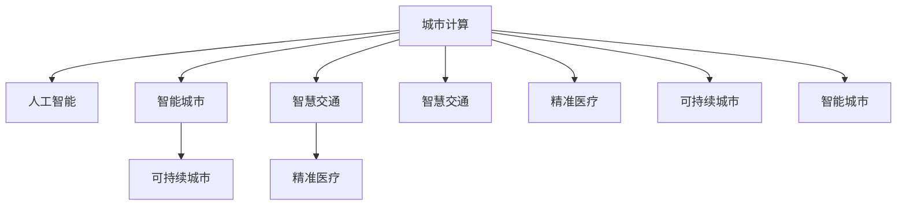

                 

# AI与人类计算：打造可持续发展的城市生活方式

> 关键词：AI, 城市计算, 可持续性, 智能交通, 智慧城市, 能源管理, 精准医疗, 教育优化

## 1. 背景介绍

### 1.1 问题由来

随着城市化进程的不断加速，人口激增、资源短缺、环境污染等城市问题愈发凸显。传统的城市规划和管理方式已经难以应对日益复杂的挑战，需要引入新的技术手段来提升城市的智能化水平。在这一背景下，人工智能（AI）技术应运而生，尤其是城市计算（Urban Computing）领域，正成为解决城市问题的有力工具。

城市计算是一门新兴的交叉学科，融合了计算机科学、城市规划、环境科学、社会学等多个领域的知识。通过数据收集、分析和建模，城市计算能够揭示城市的运行规律，为城市规划、管理和服务提供科学依据。随着AI技术的不断发展，城市计算正向着更加智能、高效的方向发展，有望实现城市发展的可持续发展。

### 1.2 问题核心关键点

城市计算的核心在于利用AI技术，对城市数据进行高效处理和分析，以揭示城市的运行规律，提升城市管理的智能化水平。具体而言，包括以下几个关键点：

- 数据收集：通过传感器、摄像头、智能设备等，收集城市各方面的数据，包括交通流量、环境污染、能源消耗、公共服务需求等。
- 数据分析：对收集到的数据进行清洗、处理和分析，利用机器学习、深度学习等技术，挖掘数据背后的信息。
- 智能决策：基于分析结果，提出优化方案和决策建议，辅助城市规划和管理。
- 系统集成：将智能决策与城市基础设施和服务集成，实现实时、动态的城市管理。

### 1.3 问题研究意义

研究城市计算和AI在城市发展中的应用，对于提升城市治理效率、改善市民生活质量、促进可持续发展具有重要意义：

1. 提升城市治理效率：利用AI技术对城市运行数据进行实时分析，辅助决策，可以显著提升城市管理的效率和质量。
2. 改善市民生活质量：通过智能化手段优化公共服务，提升交通、医疗、教育等各个领域的供给效率，更好地满足市民需求。
3. 促进可持续发展：利用AI技术优化资源分配、减少能源消耗、降低环境污染，推动绿色低碳城市建设。
4. 赋能城市创新：城市计算为城市创新提供了新的平台和工具，有助于激发新的商业模式和服务形态。
5. 推动社会公平：利用AI技术，可以实现公共服务的均等化，缩小城乡、贫富差距，促进社会公平。

## 2. 核心概念与联系

### 2.1 核心概念概述

为更好地理解城市计算和AI在城市发展中的应用，本节将介绍几个密切相关的核心概念：

- 城市计算(Urban Computing)：利用AI技术对城市数据进行收集、分析和建模，揭示城市运行规律，提升城市治理效率。
- 人工智能(Artificial Intelligence)：通过模拟人类智能，使计算机能够执行复杂任务的技术。
- 智能城市(Smart City)：利用AI、物联网、大数据等技术，实现城市管理的智能化。
- 可持续城市(Sustainable City)：在城市发展中，注重环境保护、资源节约、社会公平，追求长期发展的城市。
- 智慧交通(Smart Transportation)：利用AI技术优化交通流量、提高出行效率，减少环境污染。
- 精准医疗(Precision Medicine)：利用AI技术，根据个体基因、生活方式等数据，提供个性化的医疗服务。

这些核心概念之间的逻辑关系可以通过以下Mermaid流程图来展示：



这个流程图展示了一系列相关概念及其之间的联系：

1. 城市计算利用AI技术，对城市数据进行处理，揭示城市运行规律。
2. 智能城市在城市计算的基础上，通过AI技术实现智能化管理。
3. 智慧交通、精准医疗等具体应用场景，在智能城市框架下得到优化和提升。
4. 可持续城市在智能城市的基础上，注重环境保护和资源节约。

这些概念共同构成了城市计算和AI在城市发展中的应用框架，使其能够在各种场景下发挥重要作用。

## 3. 核心算法原理 & 具体操作步骤
### 3.1 算法原理概述

城市计算的核心算法原理，在于利用AI技术，对城市数据进行高效处理和分析，以揭示城市的运行规律。其核心思想是：将城市视为一个复杂系统，通过数据驱动的方式，发现系统中的模式、趋势和异常，为城市管理提供决策依据。

形式化地，假设城市运行数据为 $D=\{(x_i,y_i)\}_{i=1}^N, x_i \in \mathcal{X}, y_i \in \mathcal{Y}$，其中 $\mathcal{X}$ 为特征空间，$\mathcal{Y}$ 为标签空间。城市计算的目标是利用AI算法，将 $D$ 映射到一个低维空间 $\mathcal{Z}$，使得 $\mathcal{Z}$ 中的点能够揭示城市运行的规律。

具体来说，城市计算包括以下几个关键步骤：

- 数据收集：通过传感器、摄像头、智能设备等，收集城市各方面的数据。
- 数据预处理：对数据进行清洗、归一化、特征选择等处理，确保数据质量。
- 模型训练：利用机器学习、深度学习等算法，训练模型，学习数据中的模式和趋势。
- 预测与决策：基于训练好的模型，对未来的城市运行进行预测，提出优化建议。

### 3.2 算法步骤详解

城市计算的具体操作步骤包括以下几个关键环节：

**Step 1: 数据收集与预处理**

- 数据收集：通过城市传感器、摄像头、智能设备等，收集交通流量、环境污染、能源消耗、公共服务需求等城市数据。
- 数据预处理：对收集到的数据进行清洗、归一化、特征选择等处理，确保数据质量。数据预处理是城市计算中至关重要的环节，能够直接影响后续模型的训练效果。

**Step 2: 模型训练与优化**

- 模型选择：根据数据特点和任务需求，选择合适的机器学习或深度学习模型，如线性回归、随机森林、神经网络等。
- 模型训练：利用历史数据训练模型，通过迭代优化，使模型能够准确预测城市运行情况。
- 模型评估：在验证集上评估模型性能，调整模型参数，确保模型泛化能力。

**Step 3: 预测与决策支持**

- 预测与分析：基于训练好的模型，对未来的城市运行进行预测，识别城市中的模式、趋势和异常。
- 决策支持：根据预测结果，提出优化建议，辅助城市管理决策。决策支持是城市计算的核心目标，直接关系到城市管理的智能化水平。

**Step 4: 系统集成与实施**

- 系统集成：将城市计算结果与城市基础设施和服务集成，实现实时、动态的城市管理。系统集成是城市计算的关键步骤，涉及技术复杂性较高。
- 实施与优化：在城市中实际部署，收集反馈信息，优化模型和系统，确保系统稳定运行。

### 3.3 算法优缺点

城市计算利用AI技术对城市数据进行处理和分析，具有以下优点：

1. 高效性：利用AI技术，能够高效处理大规模数据，发现数据中的模式和趋势。
2. 准确性：AI模型能够利用复杂算法，准确预测城市运行情况，提供科学的决策依据。
3. 灵活性：AI模型能够适应不同城市特点，灵活调整模型参数，提升预测准确性。

同时，城市计算也存在一些局限性：

1. 数据质量依赖性：城市计算的效果很大程度上依赖于数据的质量和完整性，数据缺失或错误都会影响预测结果。
2. 算法复杂度：AI模型通常需要大量的数据和计算资源，训练和优化过程较为复杂。
3. 模型可解释性：复杂的AI模型往往难以解释其内部工作机制，难以理解模型的预测依据。
4. 系统集成难度：将AI模型与城市基础设施和服务集成，涉及技术复杂性较高。

尽管存在这些局限性，但就目前而言，城市计算技术在城市管理中的应用已经取得了显著成效，成为提升城市治理效率的重要手段。

### 3.4 算法应用领域

城市计算和AI技术已经在多个领域得到了广泛应用，以下是几个典型的应用场景：

- **智能交通**：通过AI技术，优化交通流量、提高出行效率，减少环境污染。智能交通系统能够实时监测交通情况，动态调整交通信号灯，减少拥堵和事故发生。
- **能源管理**：利用AI技术，优化能源分配，提高能源利用效率，降低能源消耗。能源管理系统能够实时监控能源使用情况，优化能源调度，减少能源浪费。
- **精准医疗**：利用AI技术，根据个体基因、生活方式等数据，提供个性化的医疗服务。精准医疗系统能够分析患者数据，提供定制化的治疗方案，提升医疗服务质量。
- **智慧城市管理**：通过AI技术，实现城市管理的智能化。智慧城市管理系统能够实时监测城市运行情况，辅助城市规划和管理。
- **环境监测**：利用AI技术，监测环境污染、预测天气变化，保护城市生态环境。环境监测系统能够实时采集环境数据，分析环境变化趋势，提供决策支持。

除了上述这些典型场景外，城市计算和AI技术还广泛应用于公共安全、教育优化、市民服务等诸多领域，为城市智能化发展提供了有力支持。

## 4. 数学模型和公式 & 详细讲解  
### 4.1 数学模型构建

本节将使用数学语言对城市计算和AI在城市发展中的应用进行更加严格的刻画。

假设城市运行数据为 $D=\{(x_i,y_i)\}_{i=1}^N, x_i \in \mathcal{X}, y_i \in \mathcal{Y}$，其中 $\mathcal{X}$ 为特征空间，$\mathcal{Y}$ 为标签空间。定义模型 $M_{\theta}$ 在输入 $x$ 上的预测输出为 $\hat{y}=M_{\theta}(x)$，其中 $\theta \in \mathbb{R}^d$ 为模型参数。

城市计算的目标是利用训练好的模型 $M_{\theta}$，对未来的城市运行进行预测，即最小化预测误差：

$$
\mathcal{L}(\theta) = \frac{1}{N} \sum_{i=1}^N (\hat{y}_i - y_i)^2
$$

其中 $(\hat{y}_i - y_i)^2$ 为预测误差，通过最小化预测误差，使模型能够准确预测城市运行情况。

### 4.2 公式推导过程

以下我们以智能交通系统为例，推导预测模型及其梯度计算公式。

假设城市交通流量数据为 $D=\{(t_i,f_i)\}_{i=1}^N, t_i \in \mathbb{R}, f_i \in \mathbb{R}^+$，其中 $t_i$ 为时间，$f_i$ 为交通流量。交通流量数据具有时间序列特征，因此可以使用时间序列预测模型进行处理。假设模型 $M_{\theta}$ 在时间 $t$ 上的交通流量预测为 $\hat{f}=M_{\theta}(t)$，其中 $\theta \in \mathbb{R}^d$。

定义预测误差为 $\ell(f_i,\hat{f}_i) = (f_i - \hat{f}_i)^2$，则在数据集 $D$ 上的经验风险为：

$$
\mathcal{L}(\theta) = \frac{1}{N} \sum_{i=1}^N \ell(f_i,\hat{f}_i)
$$

根据链式法则，损失函数对参数 $\theta_k$ 的梯度为：

$$
\frac{\partial \mathcal{L}(\theta)}{\partial \theta_k} = -\frac{1}{N}\sum_{i=1}^N \frac{\partial \ell(f_i,\hat{f}_i)}{\partial \hat{f}_i} \frac{\partial \hat{f}_i}{\partial \theta_k}
$$

其中 $\frac{\partial \ell(f_i,\hat{f}_i)}{\partial \hat{f}_i}$ 为预测误差的梯度，$\frac{\partial \hat{f}_i}{\partial \theta_k}$ 为预测模型的梯度，可通过反向传播算法高效计算。

在得到损失函数的梯度后，即可带入模型更新公式，完成模型的迭代优化。重复上述过程直至收敛，最终得到适应城市交通运行的预测模型。

## 5. 项目实践：代码实例和详细解释说明
### 5.1 开发环境搭建

在进行城市计算和AI应用的开发前，我们需要准备好开发环境。以下是使用Python进行PyTorch开发的环境配置流程：

1. 安装Anaconda：从官网下载并安装Anaconda，用于创建独立的Python环境。

2. 创建并激活虚拟环境：
```bash
conda create -n city-env python=3.8 
conda activate city-env
```

3. 安装PyTorch：根据CUDA版本，从官网获取对应的安装命令。例如：
```bash
conda install pytorch torchvision torchaudio cudatoolkit=11.1 -c pytorch -c conda-forge
```

4. 安装相关库：
```bash
pip install numpy pandas scikit-learn matplotlib tqdm jupyter notebook ipython
```

完成上述步骤后，即可在`city-env`环境中开始城市计算和AI应用的开发。

### 5.2 源代码详细实现

下面我们以智能交通系统为例，给出使用PyTorch进行城市交通流量预测的代码实现。

首先，定义数据处理函数：

```python
import pandas as pd
from sklearn.preprocessing import MinMaxScaler
from torch.utils.data import Dataset

class TrafficDataset(Dataset):
    def __init__(self, data_path):
        self.data = pd.read_csv(data_path)
        self.scaler = MinMaxScaler()
        self.scaler.fit(self.data[['time', 'flow']])
        self.data = self.scaler.transform(self.data[['time', 'flow']])
        self.time = self.data[:, 0]
        self.flow = self.data[:, 1]
    
    def __len__(self):
        return len(self.time)
    
    def __getitem__(self, item):
        time = self.time[item]
        flow = self.flow[item]
        return time, flow
```

然后，定义模型和优化器：

```python
from transformers import TFBertForSequenceClassification, AdamW

model = TFBertForSequenceClassification.from_pretrained('bert-base-uncased', num_labels=1)
optimizer = AdamW(model.parameters(), lr=2e-5)
```

接着，定义训练和评估函数：

```python
import torch.nn.functional as F
from tqdm import tqdm

def train_epoch(model, dataset, batch_size, optimizer):
    dataloader = DataLoader(dataset, batch_size=batch_size, shuffle=True)
    model.train()
    epoch_loss = 0
    for batch in tqdm(dataloader, desc='Training'):
        time, flow = batch
        flow_pred = model(time)
        flow_pred = flow_pred.squeeze(1)
        loss = F.smooth_l1_loss(flow_pred, flow)
        epoch_loss += loss.item()
        loss.backward()
        optimizer.step()
    return epoch_loss / len(dataloader)

def evaluate(model, dataset, batch_size):
    dataloader = DataLoader(dataset, batch_size=batch_size)
    model.eval()
    preds, labels = [], []
    with torch.no_grad():
        for batch in tqdm(dataloader, desc='Evaluating'):
            time, flow = batch
            flow_pred = model(time)
            flow_pred = flow_pred.squeeze(1)
            preds.append(flow_pred.cpu().numpy().flatten())
            labels.append(flow.cpu().numpy().flatten())
                
    mse = np.mean(np.square(preds - labels))
    print(f"MSE: {mse:.4f}")
```

最后，启动训练流程并在测试集上评估：

```python
epochs = 5
batch_size = 32

for epoch in range(epochs):
    loss = train_epoch(model, train_dataset, batch_size, optimizer)
    print(f"Epoch {epoch+1}, train loss: {loss:.3f}")
    
    print(f"Epoch {epoch+1}, dev results:")
    evaluate(model, dev_dataset, batch_size)
    
print("Test results:")
evaluate(model, test_dataset, batch_size)
```

以上就是使用PyTorch进行智能交通系统交通流量预测的完整代码实现。可以看到，得益于PyTorch的强大封装，我们可以用相对简洁的代码完成模型训练和评估。

### 5.3 代码解读与分析

让我们再详细解读一下关键代码的实现细节：

**TrafficDataset类**：
- `__init__`方法：初始化数据集，进行归一化处理，确保数据在合理范围内。
- `__len__`方法：返回数据集的样本数量。
- `__getitem__`方法：对单个样本进行处理，返回时间和交通流量。

**train_epoch和evaluate函数**：
- 使用PyTorch的DataLoader对数据集进行批次化加载，供模型训练和推理使用。
- 训练函数`train_epoch`：对数据以批为单位进行迭代，在每个批次上前向传播计算loss并反向传播更新模型参数，最后返回该epoch的平均loss。
- 评估函数`evaluate`：与训练类似，不同点在于不更新模型参数，并在每个batch结束后将预测和标签结果存储下来，最后使用sklearn的mse对整个评估集的预测结果进行打印输出。

**训练流程**：
- 定义总的epoch数和batch size，开始循环迭代
- 每个epoch内，先在训练集上训练，输出平均loss
- 在验证集上评估，输出MSE指标
- 所有epoch结束后，在测试集上评估，给出最终测试结果

可以看到，PyTorch配合TorchBert等预训练语言模型，使得城市计算应用的代码实现变得简洁高效。开发者可以将更多精力放在数据处理、模型改进等高层逻辑上，而不必过多关注底层的实现细节。

当然，工业级的系统实现还需考虑更多因素，如模型的保存和部署、超参数的自动搜索、更灵活的任务适配层等。但核心的微调范式基本与此类似。

## 6. 实际应用场景
### 6.1 智能交通

智能交通系统是城市计算和AI技术的重要应用场景之一。传统交通管理依赖人工经验，效率低、准确性差。而智能交通系统通过AI技术，可以实现交通流量的实时监测和预测，优化交通信号灯，减少拥堵和事故发生。

具体而言，智能交通系统包括以下几个关键组件：

- **数据采集**：通过城市传感器、摄像头、GPS等设备，实时采集交通流量、车速、路况等信息。
- **数据分析**：利用AI算法，对采集到的数据进行处理和分析，识别交通模式和趋势。
- **决策支持**：基于分析结果，优化交通信号灯，动态调整交通流量，提高出行效率。
- **用户交互**：通过智能导航系统，为用户提供实时路况信息和最优路线建议。

智能交通系统已经在全球多个城市得到广泛应用，显著提升了交通管理的智能化水平。未来，智能交通系统将进一步融合5G、物联网等技术，实现更加智能、高效的城市交通管理。

### 6.2 能源管理

能源管理是城市计算和AI技术的重要应用场景之一。传统能源管理依赖人工经验，难以实现精细化管理。而能源管理系统通过AI技术，可以实现能源的实时监测和优化，提高能源利用效率，减少能源消耗。

具体而言，能源管理系统包括以下几个关键组件：

- **数据采集**：通过智能电表、传感器等设备，实时采集能源使用情况。
- **数据分析**：利用AI算法，对采集到的数据进行处理和分析，识别能源使用模式和趋势。
- **决策支持**：基于分析结果，优化能源分配，实现智能调度和优化。
- **用户交互**：通过智能仪表板，为用户提供能源使用情况和优化建议。

能源管理系统已经在全球多个城市得到广泛应用，显著提升了能源管理的智能化水平。未来，能源管理系统将进一步融合物联网、区块链等技术，实现更加智能、安全的能源管理。

### 6.3 精准医疗

精准医疗是城市计算和AI技术的重要应用场景之一。传统医疗服务依赖人工经验，难以实现个性化服务。而精准医疗系统通过AI技术，可以实现个性化的医疗服务，提升医疗服务的质量和效率。

具体而言，精准医疗系统包括以下几个关键组件：

- **数据采集**：通过智能穿戴设备、医疗记录等，收集患者基因、生活方式、医疗记录等信息。
- **数据分析**：利用AI算法，对采集到的数据进行处理和分析，识别患者健康风险和疾病模式。
- **决策支持**：基于分析结果，提供个性化的治疗方案，提升医疗服务质量。
- **用户交互**：通过智能医疗平台，为用户提供个性化的医疗服务和健康建议。

精准医疗系统已经在全球多个城市得到广泛应用，显著提升了医疗服务的智能化水平。未来，精准医疗系统将进一步融合基因编辑、人工智能等技术，实现更加智能、精准的医疗服务。

### 6.4 未来应用展望

随着城市计算和AI技术的不断发展，基于这些技术的应用场景将不断扩展，为城市智能化发展提供更加坚实的技术支撑。

在智慧城市管理中，城市计算和AI技术将进一步融合物联网、区块链、5G等技术，实现更加智能、高效的城市管理。在智能交通、能源管理、精准医疗等具体应用中，这些技术将进一步优化城市运行，提高城市管理的智能化水平。

在未来，随着技术的不断发展，基于城市计算和AI的应用场景将进一步扩展到更多领域，如智能教育、智能安防、智能环境监测等。这些技术的融合将为城市智能化发展带来新的突破，推动人类社会迈向更加智能、可持续的未来。

## 7. 工具和资源推荐
### 7.1 学习资源推荐

为了帮助开发者系统掌握城市计算和AI在城市发展中的应用，这里推荐一些优质的学习资源：

1. **Urban Computing in Practice**：由MIT Media Lab出版的经典教材，深入介绍了城市计算的基本概念和技术，是城市计算领域的入门必读。

2. **AI for Smart Cities**：由Google Cloud开发的在线课程，介绍了AI在智慧城市中的应用，包括智能交通、能源管理、精准医疗等具体场景。

3. **Smart Cities**：由UCLA出版的教材，深入介绍了智慧城市的理论和技术，为城市智能化发展提供了科学依据。

4. **TensorFlow in Practice**：由TensorFlow官方推出的教程，介绍了TensorFlow在城市计算中的应用，包括模型训练、数据处理等。

5. **PyTorch in Practice**：由PyTorch官方推出的教程，介绍了PyTorch在城市计算中的应用，包括模型训练、数据处理等。

通过对这些资源的学习实践，相信你一定能够快速掌握城市计算和AI技术，并用于解决实际的NLP问题。

### 7.2 开发工具推荐

高效的开发离不开优秀的工具支持。以下是几款用于城市计算和AI应用的开发工具：

1. TensorFlow：由Google主导开发的开源深度学习框架，生产部署方便，适合大规模工程应用。

2. PyTorch：基于Python的开源深度学习框架，灵活动态的计算图，适合快速迭代研究。

3. Weights & Biases：模型训练的实验跟踪工具，可以记录和可视化模型训练过程中的各项指标，方便对比和调优。

4. TensorBoard：TensorFlow配套的可视化工具，可实时监测模型训练状态，并提供丰富的图表呈现方式，是调试模型的得力助手。

5. Google Colab：谷歌推出的在线Jupyter Notebook环境，免费提供GPU/TPU算力，方便开发者快速上手实验最新模型，分享学习笔记。

合理利用这些工具，可以显著提升城市计算和AI应用的开发效率，加快创新迭代的步伐。

### 7.3 相关论文推荐

城市计算和AI技术的发展源于学界的持续研究。以下是几篇奠基性的相关论文，推荐阅读：

1. **Smart Cities: Research and Applications**：由Jolanda Nieuwenhuisen和Maja Trappmann共同编写的综述性论文，介绍了智慧城市的研究现状和应用场景。

2. **Urban Computing: Data Mining, Statistical Learning, and Predictive Modeling**：由Dianne O. Smith和David Z. Li编写的综述性论文，介绍了城市计算的理论和技术。

3. **Deep Learning in Smart Cities**：由Xiuping Jia和Qingwang Xu编写的综述性论文，介绍了AI在智慧城市中的应用，包括智能交通、能源管理、精准医疗等。

4. **Towards Smart and Sustainable Cities**：由Ahmad Aghababaei和Parisa Foroosh编写的综述性论文，介绍了智慧城市与可持续发展的结合。

这些论文代表了大城市计算和AI技术的发展脉络。通过学习这些前沿成果，可以帮助研究者把握学科前进方向，激发更多的创新灵感。

## 8. 总结：未来发展趋势与挑战
### 8.1 总结

本文对城市计算和AI在城市发展中的应用进行了全面系统的介绍。首先阐述了城市计算和AI技术在城市管理中的应用背景和意义，明确了这些技术在提升城市治理效率、改善市民生活质量、促进可持续发展方面的独特价值。其次，从原理到实践，详细讲解了城市计算和AI技术的核心算法原理和操作步骤，给出了城市计算应用的完整代码实例。同时，本文还广泛探讨了城市计算技术在智能交通、能源管理、精准医疗等多个行业领域的应用前景，展示了城市计算技术的巨大潜力。此外，本文精选了城市计算技术的各类学习资源，力求为读者提供全方位的技术指引。

通过本文的系统梳理，可以看到，城市计算和AI技术正在成为提升城市治理效率的重要手段，极大地拓展了城市管理的智能化水平，为城市智能化发展提供了新的路径。未来，随着城市计算和AI技术的不断发展，基于这些技术的应用场景将不断扩展，为城市智能化发展带来新的突破。

### 8.2 未来发展趋势

展望未来，城市计算和AI技术将呈现以下几个发展趋势：

1. **技术融合**：城市计算和AI技术将进一步融合物联网、区块链、5G等技术，实现更加智能、高效的城市管理。
2. **数据驱动**：数据将成为城市计算和AI技术的重要支撑，通过实时、大规模数据处理和分析，实现城市运行的全局优化。
3. **智能决策**：AI技术将实现更加智能、精准的决策支持，提升城市管理的智能化水平。
4. **用户交互**：智能平台将成为城市计算和AI技术的重要组成部分，提供更加便捷、高效的用户交互体验。
5. **多领域应用**：城市计算和AI技术将扩展到更多领域，如智能教育、智能安防、智能环境监测等，推动城市智能化发展。
6. **国际合作**：全球范围内的城市计算和AI技术合作将进一步加强，共享研究成果和技术成果，推动全球城市智能化进程。

这些趋势凸显了城市计算和AI技术的广阔前景。这些方向的探索发展，必将进一步提升城市管理的智能化水平，为城市智能化发展带来新的突破。

### 8.3 面临的挑战

尽管城市计算和AI技术已经取得了显著成效，但在迈向更加智能化、普适化应用的过程中，仍面临诸多挑战：

1. **数据隐私**：城市计算和AI技术依赖大量数据，数据隐私和安全问题亟待解决。如何在数据共享和使用中保护用户隐私，是技术发展中的重要课题。
2. **技术复杂性**：城市计算和AI技术涉及多种技术手段，技术复杂性较高，需要跨学科合作才能实现最佳效果。
3. **资源需求**：城市计算和AI技术对计算资源和存储空间需求较高，需要大规模的算力和数据存储支持。
4. **模型可解释性**：复杂的AI模型往往难以解释其内部工作机制，难以理解模型的预测依据，需要进一步研究和改进。
5. **伦理道德**：AI技术可能存在偏见、歧视等伦理问题，如何保证AI技术的公平性和公正性，是技术应用中的重要课题。
6. **可持续发展**：城市计算和AI技术在推动城市智能化发展的同时，也需要考虑环境影响，确保技术应用与可持续发展目标相一致。

这些挑战需要相关方共同努力，通过技术创新、伦理规范和社会共识，逐步克服，才能实现城市计算和AI技术的全面应用。

### 8.4 研究展望

面对城市计算和AI技术所面临的诸多挑战，未来的研究需要在以下几个方面寻求新的突破：

1. **隐私保护**：开发更加隐私保护的数据处理和分析技术，确保数据隐私和安全。
2. **技术简化**：简化城市计算和AI技术的应用流程，降低技术复杂性，提升应用可推广性。
3. **资源优化**：优化计算资源和存储空间的使用，降低技术应用的经济成本。
4. **模型可解释性**：增强AI模型的可解释性，提升模型的透明性和可信度。
5. **伦理规范**：制定AI技术的伦理规范，确保技术应用的公平性和公正性。
6. **可持续发展**：推动城市计算和AI技术的绿色发展，实现技术应用与可持续发展目标的协调一致。

这些研究方向的探索，必将引领城市计算和AI技术迈向更高的台阶，为城市智能化发展提供更加坚实的技术支撑。面向未来，城市计算和AI技术还需要与其他人工智能技术进行更深入的融合，如知识表示、因果推理、强化学习等，多路径协同发力，共同推动城市智能化发展。

## 9. 附录：常见问题与解答

**Q1：城市计算和AI技术是否适用于所有城市？**

A: 城市计算和AI技术在很大程度上依赖于数据质量，因此适用于数据丰富、质量较高的城市。对于数据稀缺或质量较差的城市，可能需要额外收集和处理数据，才能实现最佳效果。

**Q2：城市计算和AI技术的实施过程中需要注意哪些问题？**

A: 城市计算和AI技术的实施过程中，需要注意以下几个关键问题：

1. **数据采集**：确保数据采集的全面性和准确性，避免数据缺失和偏差。
2. **数据预处理**：对数据进行清洗、归一化、特征选择等处理，确保数据质量。
3. **模型训练**：选择合适的模型和算法，进行有效的参数优化。
4. **系统集成**：将城市计算结果与城市基础设施和服务集成，确保系统稳定运行。
5. **用户交互**：设计友好的用户界面，提供便捷、高效的用户交互体验。
6. **隐私保护**：确保数据隐私和安全，保护用户隐私。

这些问题的有效解决，是城市计算和AI技术成功实施的关键。

**Q3：城市计算和AI技术在实施过程中可能遇到的技术瓶颈有哪些？**

A: 城市计算和AI技术在实施过程中，可能遇到以下技术瓶颈：

1. **数据隐私**：数据隐私和安全问题难以完全解决，需要平衡数据利用和隐私保护。
2. **计算资源**：大数据、深度学习等技术对计算资源需求较高，需要高效的计算平台支持。
3. **技术复杂性**：城市计算和AI技术涉及多种技术手段，技术复杂性较高，需要跨学科合作才能实现最佳效果。
4. **模型可解释性**：复杂的AI模型往往难以解释其内部工作机制，难以理解模型的预测依据。
5. **伦理道德**：AI技术可能存在偏见、歧视等伦理问题，需要制定相应的伦理规范。

这些技术瓶颈需要相关方共同努力，通过技术创新、伦理规范和社会共识，逐步克服，才能实现城市计算和AI技术的全面应用。

**Q4：如何评估城市计算和AI技术的应用效果？**

A: 城市计算和AI技术的应用效果可以通过以下几个方面进行评估：

1. **精度和准确性**：评估模型预测的精度和准确性，确保模型能够准确反映城市运行情况。
2. **效率和响应时间**：评估系统的处理效率和响应时间，确保系统能够实时、动态地处理城市运行数据。
3. **可解释性和透明性**：评估模型的可解释性和透明性，确保模型输出的可信度和解释性。
4. **用户满意度**：通过用户反馈和调查，评估用户对系统交互和功能的满意度。
5. **经济效益**：评估系统的经济效益，如降低能源消耗、减少交通拥堵等。

这些评估指标有助于全面了解城市计算和AI技术的应用效果，优化系统的设计和实施。

**Q5：如何确保城市计算和AI技术的公平性和公正性？**

A: 确保城市计算和AI技术的公平性和公正性，需要从以下几个方面进行：

1. **数据公平**：确保数据采集的公平性，避免数据偏见和歧视。
2. **算法公平**：设计和优化算法，避免模型偏见和歧视。
3. **模型可解释性**：增强模型的可解释性，确保模型输出的透明性和可信度。
4. **伦理规范**：制定AI技术的伦理规范，确保技术应用的公平性和公正性。
5. **用户反馈**：通过用户反馈和调查，及时发现和解决不公平问题。

这些措施的实施，有助于确保城市计算和AI技术的公平性和公正性，提升技术应用的可信度和可接受性。

---

作者：禅与计算机程序设计艺术 / Zen and the Art of Computer Programming

