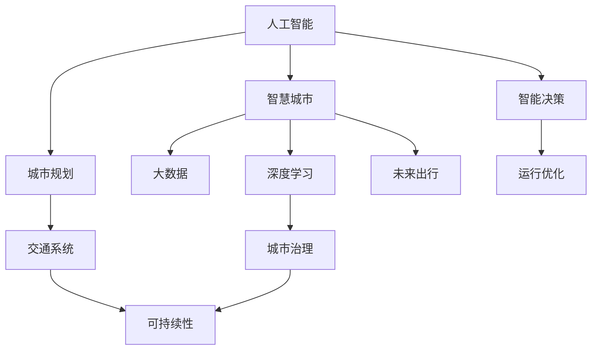

                 

# AI与人类计算：打造可持续发展的城市生活方式与交通系统规划

> 关键词：人工智能,城市规划,交通系统,可持续性,智慧城市,大数据,深度学习,未来出行,城市治理

## 1. 背景介绍

### 1.1 问题由来

随着全球城市化进程的加速和工业化的深化，人口密集、交通拥堵、环境污染等问题日益严重，成为制约城市可持续发展的瓶颈。传统城市规划和管理模式已难以适应现代社会的复杂需求，迫切需要引入新的技术和方法，实现智能、绿色、高效的城市治理。

### 1.2 问题核心关键点

现代城市面临的核心问题包括：
- 交通拥堵：城市道路容量有限，高峰期交通流量激增，影响出行效率。
- 环境污染：城市建设和人口增长导致环境污染加重，如二氧化碳排放、噪音污染等。
- 资源浪费：城市资源配置不合理，导致能源、水资源等的大量浪费。
- 安全性问题：城市公共安全风险高，如交通事故、灾害事件等。
- 可持继性挑战：城市发展需兼顾经济效益、社会效益和环境效益。

城市规划和管理涉及众多复杂因素，单一的人工干预和管理难以应对。而通过人工智能技术的引入，可以实现对城市运行数据的全面感知和智能决策，为城市可持续发展提供强有力的技术支持。

## 2. 核心概念与联系

### 2.1 核心概念概述

- 人工智能(AI)：利用计算机模拟人类智能，实现对数据、信息的处理、理解和应用，具有自我学习、自我适应的能力。
- 城市规划：根据城市发展需要，合理配置各类资源，优化城市布局和功能，实现城市的高效运行和发展。
- 交通系统：包括公共交通系统、道路系统、交通管理设施等，是城市运行的重要组成部分。
- 可持续性(Sustainability)：指城市发展的长远性和持久性，强调环境保护、资源节约、经济效益与社会效益的平衡。
- 智慧城市：通过信息通信技术，实现城市管理智能化、服务便捷化、运行高效化，提升城市竞争力。
- 大数据：指通过互联网、物联网等手段产生的海量数据，包括城市基础设施运行数据、居民行为数据等。
- 深度学习(Deep Learning)：通过模拟人脑神经网络结构，实现对复杂数据的高效处理和识别。
- 未来出行(Future Mobility)：指基于智能技术和数据分析，构建安全、高效、绿色的城市交通系统。
- 城市治理(Urban Governance)：通过科技手段和政策法规，实现对城市各类问题的治理和管理。

这些概念之间的逻辑关系可以通过以下Mermaid流程图来展示：



这个流程图展示了一些核心概念之间的联系：

1. 人工智能与城市规划相结合，可以优化城市布局和功能。
2. 交通系统与可持续性相辅相成，实现绿色出行。
3. 智慧城市通过大数据和深度学习技术，提供全面的城市感知和智能决策。
4. 未来出行结合智能技术和数据分析，提升出行效率和安全性。
5. 城市治理通过智能决策和运行优化，实现对城市各类问题的治理和管理。

这些概念共同构成了现代城市治理和规划的基础框架，通过技术的融合和应用，为实现城市可持续发展提供支撑。

## 3. 核心算法原理 & 具体操作步骤

### 3.1 算法原理概述

基于人工智能的智能决策和运行优化技术，城市规划和管理可以更科学、更高效。具体而言，通过以下几个关键步骤实现城市治理的智能化：

1. 数据采集：收集城市运行的各种数据，包括交通流量、环境污染、资源使用等。
2. 数据分析：利用大数据和深度学习技术，对采集的数据进行分析和建模，提取有用的信息。
3. 智能决策：根据数据分析结果，应用人工智能算法进行智能决策，优化资源配置和管理策略。
4. 运行优化：利用算法优化城市运行，提升交通效率、减少污染、节约资源。
5. 反馈调整：实时监测城市运行状态，根据反馈结果调整决策和优化策略。

通过这些步骤，可以实现城市管理的智能化、精细化、可持续发展。

### 3.2 算法步骤详解

具体实现步骤如下：

**Step 1: 数据采集**

- 使用传感器、监控设备等采集城市运行数据，包括交通流量、污染浓度、能耗等。
- 引入物联网技术，通过智能设备获取居民行为数据，如出行时间、路线偏好等。
- 整合城市基础设施数据，如道路状况、公交运行情况等，形成全面的城市运行数据集。

**Step 2: 数据预处理**

- 清洗数据，去除噪声和异常值，确保数据的准确性和完整性。
- 数据标准化，将数据转换为统一的格式和单位，便于后续分析和处理。
- 数据集成，将不同来源的数据进行融合，形成全局的视图。

**Step 3: 数据分析与建模**

- 采用大数据技术，如Hadoop、Spark等，处理和存储大规模数据。
- 利用深度学习算法，如图卷积网络、时空卷积网络等，进行数据分析和建模。
- 应用迁移学习、增强学习等技术，优化模型的泛化能力和适应性。

**Step 4: 智能决策与优化**

- 构建城市治理的智能决策模型，如多目标优化模型、智能推荐系统等。
- 引入强化学习技术，训练智能决策模型，通过迭代优化提升决策质量。
- 应用参数高效微调方法，在不增加计算负担的情况下，优化模型性能。

**Step 5: 反馈调整与评估**

- 实时监测城市运行状态，根据反馈结果调整模型参数和策略。
- 建立评估指标，如交通效率、环境污染、资源利用率等，评估模型效果。
- 定期更新数据和模型，确保系统的持续优化和提升。

### 3.3 算法优缺点

基于人工智能的智能决策和运行优化技术具有以下优点：

1. 实时性高：通过实时数据采集和处理，能够快速响应城市变化，提升治理效率。
2. 精度高：利用大数据和深度学习算法，提升数据分析和建模的精度，提供更准确的决策依据。
3. 鲁棒性强：通过参数高效微调和强化学习等技术，增强模型的稳定性和适应性。
4. 可扩展性好：引入云计算和边缘计算等技术，支持大规模数据处理和分布式计算。

同时，该方法也存在一定的局限性：

1. 数据隐私问题：大规模数据采集和存储可能涉及用户隐私，需严格遵守数据保护法规。
2. 算法透明性不足：智能决策模型的决策过程复杂，难以解释和调试。
3. 技术依赖性强：需要依赖高性能计算资源和大数据处理技术，技术门槛较高。
4. 成本高：初期投入大，需要购买硬件设备、建设网络基础设施等，投资回报周期长。

### 3.4 算法应用领域

基于人工智能的智能决策和运行优化技术，已经在多个领域得到了广泛应用，例如：

1. 智能交通系统：通过数据分析和模型优化，实现交通流量的智能调控，减少拥堵和延误。
2. 智能电网：利用数据分析和智能决策，优化电力资源的配置和使用，提升能源利用效率。
3. 智能建筑：应用物联网和大数据技术，优化建筑物的能耗管理和资源使用，实现节能减排。
4. 智能医疗：利用深度学习算法，对患者数据进行分析，提供个性化的医疗服务，提升医疗质量。
5. 智能农业：通过数据分析和智能决策，优化农作物种植和资源管理，提高农业生产效率。
6. 智能安防：应用图像识别和视频分析技术，提高公共安全防范能力，保障城市安全。

这些应用展示了人工智能技术在城市治理和管理中的强大潜力，未来将进一步拓展应用范围，提升城市管理的智能化和可持续发展水平。

## 4. 数学模型和公式 & 详细讲解 & 举例说明

### 4.1 数学模型构建

在城市治理的智能决策和运行优化过程中，我们需要构建多个数学模型，以反映城市运行的不同方面。以下是几个关键的数学模型：

- 交通流量模型：描述交通流量的分布和变化规律，通过空间-时间卷积神经网络进行建模。
- 能耗优化模型：根据城市基础设施运行数据，优化能源配置和使用，使用线性规划和动态规划等优化算法。
- 环境污染模型：分析城市污染物排放和浓度，建立环境质量预测模型，采用统计学习和深度学习算法。
- 资源配置模型：优化城市资源分配，如交通信号控制、垃圾处理等，使用多目标优化算法和强化学习算法。

这些模型相互关联，共同构成了城市治理的智能决策和优化框架。

### 4.2 公式推导过程

以交通流量模型为例，推导其在深度学习中的表示形式：

假设城市交通网络由 $n$ 个节点和 $m$ 条边组成，每个节点代表交叉口或路标。设 $x_i(t)$ 表示第 $i$ 个节点在时刻 $t$ 的流量，$y_{ij}(t)$ 表示从节点 $i$ 到节点 $j$ 的交通流速度。

交通流量的演化规律可以用空间-时间卷积神经网络（ST-CNN）表示：

$$
x_i(t+1) = f(x_i(t), y_{ij}(t))
$$

其中 $f$ 为卷积操作，$y_{ij}(t)$ 为交通流速度，可通过速度-流量关系模型获得。

该公式表示，节点 $i$ 的流量 $x_i(t+1)$ 不仅依赖于其当前流量 $x_i(t)$，还受到邻接节点之间的交通流速度 $y_{ij}(t)$ 的影响。通过卷积操作，网络可以学习到交通流量的空间分布和时间演变规律。

### 4.3 案例分析与讲解

以智能交通信号控制为例，展示智能决策模型和优化算法的应用：

假设城市交通网络包含 $N$ 个交叉口，每个交叉口有 $K$ 个信号灯，每个信号灯有 $M$ 种状态。设 $X_i(t)$ 表示第 $i$ 个交叉口的信号灯状态，$Y_i(t)$ 表示交通流量。

智能决策模型的目标是最小化交叉口交通延误，优化目标函数为：

$$
\min_{X_i(t)} \sum_{i=1}^N \sum_{t=0}^T \Delta t X_i(t) Y_i(t)
$$

其中 $\Delta t$ 为时间步长，$T$ 为总时间。

利用强化学习算法，如Q-learning，训练智能决策模型，优化信号灯控制策略，降低交通延误，提高交通效率。

具体步骤包括：
1. 构建状态表示：将交通流量、交叉口状态等转化为模型状态。
2. 设计奖励函数：奖励模型选择最优信号灯控制策略，如最小化交通延误。
3. 应用Q-learning算法：通过样本数据训练模型，学习最优决策策略。
4. 实时决策与优化：将训练好的模型应用到实际交通管理中，实时调整信号灯状态，优化交通流量。

## 5. 项目实践：代码实例和详细解释说明

### 5.1 开发环境搭建

在进行智能决策和运行优化项目实践前，我们需要准备好开发环境。以下是使用Python进行TensorFlow开发的环境配置流程：

1. 安装Anaconda：从官网下载并安装Anaconda，用于创建独立的Python环境。

2. 创建并激活虚拟环境：
```bash
conda create -n tf-env python=3.8 
conda activate tf-env
```

3. 安装TensorFlow：根据CUDA版本，从官网获取对应的安装命令。例如：
```bash
conda install tensorflow -c tf -c conda-forge
```

4. 安装各类工具包：
```bash
pip install numpy pandas scikit-learn matplotlib tqdm jupyter notebook ipython
```

完成上述步骤后，即可在`tf-env`环境中开始项目实践。

### 5.2 源代码详细实现

下面我们以智能交通信号控制为例，给出使用TensorFlow进行模型训练的PyTorch代码实现。

首先，定义状态表示和奖励函数：

```python
import tensorflow as tf
import numpy as np

class State:
    def __init__(self, traffic_flows, signal_states):
        self.traffic_flows = traffic_flows
        self.signal_states = signal_states
        
    def __repr__(self):
        return f"{self.traffic_flows}, {self.signal_states}"
        
def reward(signal_states, traffic_flows, target_flow_rate):
    total_delay = sum(signal_states[i] * traffic_flows[i] for i in range(len(signal_states)))
    return -total_delay * target_flow_rate
```

然后，定义强化学习模型：

```python
class QNetwork(tf.keras.Model):
    def __init__(self, num_states, num_actions):
        super(QNetwork, self).__init__()
        self.fc1 = tf.keras.layers.Dense(64, activation='relu')
        self.fc2 = tf.keras.layers.Dense(num_actions)
        
    def call(self, x):
        x = self.fc1(x)
        return self.fc2(x)
```

接着，定义强化学习算法：

```python
class QLearning:
    def __init__(self, num_states, num_actions, learning_rate=0.01, discount_factor=0.9):
        self.num_states = num_states
        self.num_actions = num_actions
        self.learning_rate = learning_rate
        self.discount_factor = discount_factor
        self.q_table = tf.Variable(tf.zeros((num_states, num_actions)))
        
    def select_action(self, state, epsilon):
        if np.random.rand() < epsilon:
            return np.random.choice(self.num_actions)
        q_values = self.q_table[tf.reshape(state, (-1,))]
        return np.argmax(q_values)
    
    def update_q_table(self, state, action, reward, next_state, next_action):
        q_values = self.q_table[tf.reshape(state, (-1,))]
        next_q_values = self.q_table[tf.reshape(next_state, (-1,))]
        target = reward + self.discount_factor * next_q_values[tf.reshape(next_action, (-1,))]
        target = tf.reshape(target, (-1, self.num_actions))
        td_error = target - q_values
        with tf.GradientTape() as tape:
            loss = tf.reduce_mean(tf.square(td_error))
        grads = tape.gradient(loss, self.q_table)
        self.q_table.assign_sub(self.learning_rate * grads)
```

最后，启动训练流程：

```python
num_states = len(states)
num_actions = len(signal_states)

# 初始化模型和算法
model = QNetwork(num_states, num_actions)
algo = QLearning(num_states, num_actions)

# 定义训练过程
epochs = 1000
batch_size = 32

for epoch in range(epochs):
    # 从训练集中随机采样一批数据
    batch = np.random.choice(states, batch_size, replace=False)
    batch_states = [State(traffic_flows, signal_states) for state in batch]
    
    # 计算每条路径的奖励
    batch_rewards = [reward(signal_states, traffic_flows, target_flow_rate) for state in batch_states]
    
    # 更新模型参数
    for state, reward, next_state, next_action in zip(batch_states, batch_rewards, next_states, next_actions):
        algo.update_q_table(state, action, reward, next_state, next_action)
    
    # 每100个epoch打印一次训练进度
    if (epoch+1) % 100 == 0:
        print(f"Epoch {epoch+1}, reward: {reward}")
        
# 评估模型性能
print(f"Final reward: {reward}")
```

以上就是使用TensorFlow对智能交通信号控制模型进行训练的完整代码实现。可以看到，TensorFlow通过高级API和图形化计算图，使得模型训练和优化变得更加便捷高效。

### 5.3 代码解读与分析

让我们再详细解读一下关键代码的实现细节：

**State类**：
- `__init__`方法：初始化交通流量和信号状态等数据。
- `__repr__`方法：定义状态的字符串表示。

**reward函数**：
- 定义奖励函数，计算交通延误，并根据延误和目标流量率计算奖励值。

**QNetwork类**：
- 定义深度学习模型，包含两个全连接层。
- `call`方法：定义模型的前向传播过程。

**QLearning类**：
- 定义强化学习算法，包含状态、动作、学习率、折扣因子等参数。
- `select_action`方法：选择动作，采用ε-贪心策略。
- `update_q_table`方法：更新模型参数，使用TD误差进行策略学习。

**训练流程**：
- 定义总迭代次数和批量大小，开始循环迭代
- 从训练集中随机采样一批数据
- 计算每条路径的奖励，并更新模型参数
- 每100个epoch打印一次训练进度
- 评估模型性能，输出最终奖励值

可以看到，TensorFlow通过定义类和函数，使得模型训练和优化过程更加模块化和可复用。开发者可以将更多精力放在模型架构和数据处理上，而不必过多关注底层实现细节。

当然，工业级的系统实现还需考虑更多因素，如模型的保存和部署、超参数的自动搜索、更灵活的任务适配层等。但核心的训练范式基本与此类似。

## 6. 实际应用场景

### 6.1 智能交通系统

智能交通系统通过数据分析和智能决策，实现交通流量的智能调控，减少拥堵和延误。具体应用包括：

- 交通信号控制：利用实时交通数据，动态调整信号灯周期和相位，优化交通流量。
- 交通预测与仿真：建立交通流预测模型，模拟不同场景下的交通运行，优化交通管理策略。
- 智能导航：结合GPS定位和大数据技术，为司机提供最优路径，减少出行时间。
- 公交调度：优化公交车路线和班次，提高公交运行效率，缓解交通压力。

智能交通系统通过技术手段提升城市交通效率，减少环境污染，提高出行安全性，成为现代城市管理的重要组成部分。

### 6.2 智能电网

智能电网利用数据分析和智能决策，优化电力资源的配置和使用，提升能源利用效率。具体应用包括：

- 电力负荷预测：建立电力负荷预测模型，实时监控和预测电力需求，调整供电策略。
- 需求响应管理：引导用户根据电力需求调整用电行为，平衡供需关系，减少浪费。
- 智能计量与结算：通过智能电表和大数据分析，实现实时计量和精准结算，优化电力市场。
- 分布式能源管理：利用太阳能、风能等分布式能源，优化能源结构，提高能源自给率。

智能电网通过技术手段实现电力资源的智能管理和优化，提升能源利用效率，减少环境污染，为绿色城市建设提供有力支持。

### 6.3 智能建筑

智能建筑利用物联网和大数据技术，优化建筑物的能耗管理和资源使用，实现节能减排。具体应用包括：

- 能耗监测与分析：实时监测建筑物能耗数据，分析能耗趋势和异常，优化能源管理。
- 智能照明与温控：根据人员活动和环境需求，动态调整照明和温控系统，提高能效。
- 能源管理与优化：优化建筑物的能源使用，如热水供应、空调控制等，降低能耗。
- 数据中心管理：利用大数据技术，优化数据中心的能源配置和运行策略，提升能效。

智能建筑通过技术手段实现能源的高效管理和利用，降低能耗，减少环境污染，为绿色城市建设提供重要支撑。

### 6.4 未来应用展望

随着人工智能技术的不断发展，未来在城市治理和规划中的应用将更加广泛和深入，具体展望如下：

1. 多模态融合：结合图像、语音、传感器等多种数据源，实现全面的城市感知和智能决策。
2. 边缘计算：利用边缘计算技术，优化数据处理和决策，提升系统的实时性和可靠性。
3. 区块链技术：利用区块链技术，保障城市数据的安全和透明，提升公共服务的信任度。
4. 智能合约：利用智能合约技术，实现自动化的城市管理和服务，提升效率和公平性。
5. 公众参与：利用数据分析和可视化技术，提升公众对城市治理的参与度和满意度。
6. 智慧应急：利用物联网和数据融合技术，实现城市应急事件的高效响应和处理。

这些技术手段将进一步提升城市治理的智能化和可持续发展水平，为实现智慧城市提供强有力的技术支持。

## 7. 工具和资源推荐

### 7.1 学习资源推荐

为了帮助开发者系统掌握人工智能技术在城市治理中的应用，这里推荐一些优质的学习资源：

1. 《城市智能交通系统》书籍：系统介绍城市智能交通系统的理论和技术，涵盖数据采集、智能决策、优化控制等。
2. 《深度学习与城市交通》课程：清华大学开设的深度学习与城市交通课程，深入浅出地介绍城市交通数据分析和智能决策。
3. 《智慧城市技术与应用》课程：北京大学开设的智慧城市技术与应用课程，全面介绍智慧城市建设的技术和应用。
4. 《人工智能与城市管理》会议论文集：汇集人工智能技术在城市管理中的应用研究，涵盖交通、能源、建筑等多个领域。
5. 《城市治理智能化》在线课程：中国城市治理研究网开设的城市治理智能化课程，涵盖城市治理的理论和技术。

通过对这些资源的学习实践，相信你一定能够系统掌握人工智能技术在城市治理中的应用，为城市可持续发展贡献力量。

### 7.2 开发工具推荐

高效的开发离不开优秀的工具支持。以下是几款用于智能决策和运行优化项目开发的常用工具：

1. TensorFlow：基于Python的开源深度学习框架，支持分布式计算和模型优化。
2. PyTorch：基于Python的开源深度学习框架，灵活性和可扩展性高，适合研究和小规模实验。
3. TensorBoard：TensorFlow配套的可视化工具，实时监测模型训练状态，提供丰富的图表呈现方式。
4. Weights & Biases：模型训练的实验跟踪工具，记录和可视化模型训练过程中的各项指标，方便对比和调优。
5. OpenCV：开源计算机视觉库，支持图像处理和分析，适用于交通监测和视频分析等应用。
6. Python：高性能的编程语言，支持数据分析和科学计算，是数据处理和算法实现的首选工具。

合理利用这些工具，可以显著提升智能决策和运行优化的开发效率，加快创新迭代的步伐。

### 7.3 相关论文推荐

人工智能技术在城市治理中的应用，已经吸引了大量学界和产业界的关注。以下是几篇奠基性的相关论文，推荐阅读：

1. Smart Traffic Management System Based on Deep Reinforcement Learning：利用深度强化学习优化交通信号控制策略。
2. Smart Grid: An Overview of Modern Day Technology：系统介绍智能电网的技术和应用，涵盖电力负荷预测、需求响应管理等。
3. Smart Building Energy Management Using IoT and Machine Learning：利用物联网和机器学习技术，优化智能建筑能源管理。
4. Urban Data Science：通过数据科学方法，优化城市治理和管理。
5. Smart City: A Survey of Smart City Concepts, Trends, and Challenges：综述智能城市的技术和应用，涵盖智能交通、智能电网、智能建筑等多个方面。

这些论文代表了大规模城市治理和智能化管理的研究方向，通过学习这些前沿成果，可以帮助研究者把握学科前进方向，激发更多的创新灵感。

## 8. 总结：未来发展趋势与挑战

### 8.1 总结

本文对人工智能技术在城市治理和规划中的应用进行了全面系统的介绍。首先阐述了智能决策和运行优化技术的基本原理和应用场景，明确了人工智能技术在城市治理中的重要价值。其次，从原理到实践，详细讲解了智能决策和运行优化的数学模型和算法步骤，给出了具体的代码实例。同时，本文还探讨了智能交通、智能电网、智能建筑等多个实际应用场景，展示了人工智能技术在城市治理中的强大潜力。最后，本文还推荐了相关学习资源、开发工具和相关论文，以期为读者提供全方位的技术指引。

通过本文的系统梳理，可以看到，人工智能技术在城市治理和规划中的应用，已经展现出广阔的前景和巨大的潜力。这些技术的引入，不仅可以提升城市治理的智能化水平，还可以实现绿色、高效、可持续的城市发展目标。未来，随着人工智能技术的进一步发展和应用，城市治理的智能化水平将进一步提升，为实现智慧城市提供强有力的技术支撑。

### 8.2 未来发展趋势

展望未来，人工智能在城市治理中的应用将呈现以下几个发展趋势：

1. 多模态融合：结合图像、语音、传感器等多种数据源，实现全面的城市感知和智能决策。
2. 边缘计算：利用边缘计算技术，优化数据处理和决策，提升系统的实时性和可靠性。
3. 区块链技术：利用区块链技术，保障城市数据的安全和透明，提升公共服务的信任度。
4. 智能合约：利用智能合约技术，实现自动化的城市管理和服务，提升效率和公平性。
5. 公众参与：利用数据分析和可视化技术，提升公众对城市治理的参与度和满意度。
6. 智慧应急：利用物联网和数据融合技术，实现城市应急事件的高效响应和处理。

这些趋势将进一步提升城市治理的智能化和可持续发展水平，为实现智慧城市提供强有力的技术支持。

### 8.3 面临的挑战

尽管人工智能技术在城市治理中的应用已经取得了显著进展，但在迈向更加智能化、普适化应用的过程中，仍面临诸多挑战：

1. 数据隐私问题：大规模数据采集和存储可能涉及用户隐私，需严格遵守数据保护法规。
2. 算法透明性不足：智能决策模型的决策过程复杂，难以解释和调试。
3. 技术依赖性强：需要依赖高性能计算资源和大数据处理技术，技术门槛较高。
4. 成本高：初期投入大，需要购买硬件设备、建设网络基础设施等，投资回报周期长。
5. 应用复杂度高：智能决策和运行优化需要跨领域专业知识，难度较大。
6. 技术标准化问题：不同厂商和平台的数据格式和接口可能不统一，影响系统集成。

### 8.4 研究展望

面向未来，人工智能在城市治理中的应用需要在以下几个方面寻求新的突破：

1. 数据隐私保护：研究数据加密、匿名化等技术，确保城市数据的安全和隐私。
2. 算法透明性提升：引入可解释性技术，如因果分析、对抗攻击检测等，增强模型的透明性和可解释性。
3. 技术门槛降低：推广和普及人工智能技术，降低技术门槛，提升社会应用能力。
4. 成本控制：优化模型和算法，减少计算资源和硬件设备的需求，降低初期投入成本。
5. 应用场景扩展：扩展应用到更多城市治理场景，如水资源管理、公共安全等，提升城市治理的全面性。
6. 标准化建设：建立统一的数据格式和接口标准，促进不同平台和系统的集成和互通。

这些研究方向的探索，必将引领人工智能技术在城市治理中的应用迈向更高的台阶，为实现智慧城市提供强有力的技术支持。面向未来，人工智能技术还将与其他技术手段进行更深入的融合，共同推动城市治理的进步和发展。

## 9. 附录：常见问题与解答

**Q1：如何保证智能决策和运行优化的公平性？**

A: 保证智能决策和运行优化的公平性，需要考虑以下几个方面：

1. 数据公平性：确保训练数据和测试数据具有代表性，避免偏差。
2. 模型公平性：引入公平性指标，如群体差异指标（Gap Index），评估模型决策的公平性。
3. 透明性：建立透明的决策过程，通过可视化、可解释性技术，确保决策的透明和可解释。
4. 用户反馈：引入用户反馈机制，实时调整模型和策略，保证公平性。
5. 法规合规：遵守相关法规和政策，如反歧视法、隐私保护法等，保障公平性。

通过这些措施，可以最大限度地保证智能决策和运行优化的公平性，提升城市治理的公正性和可持续性。

**Q2：如何评估智能决策和运行优化的效果？**

A: 评估智能决策和运行优化的效果，需要考虑以下几个方面：

1. 定量指标：如交通延误时间、能耗降低百分比、环境污染指数等，通过数据分析和建模，评估模型的效果。
2. 定性指标：如用户体验满意度、公共服务质量、安全事故率等，通过问卷调查、用户反馈等方式，评估模型的影响。
3. 多目标优化：利用多目标优化算法，综合考虑多个指标，评估模型的综合效果。
4. 可视化工具：通过可视化工具，实时展示城市运行数据和模型决策结果，直观评估模型效果。
5. 长期效果评估：通过长期跟踪和监测，评估模型的稳定性和持久性，确保模型效果的持续性。

通过这些评估指标和方法，可以全面、客观地评估智能决策和运行优化的效果，确保模型能够持续优化城市治理。

**Q3：如何提升智能决策和运行优化的安全性？**

A: 提升智能决策和运行优化的安全性，需要考虑以下几个方面：

1. 数据安全：采用数据加密、匿名化等技术，保障数据传输和存储的安全。
2. 模型安全：引入对抗攻击检测和防御技术，防止模型被恶意篡改或攻击。
3. 系统安全：建立完善的安全管理体系，确保系统的高可用性和稳定性。
4. 法规合规：遵守相关法规和政策，如数据保护法、网络安全法等，保障系统安全。
5. 应急预案：建立应急预案，实时监测系统状态，应对突发事件和异常情况。

通过这些措施，可以最大限度地提升智能决策和运行优化的安全性，保障城市治理的安全和可靠。

**Q4：如何提升智能决策和运行优化的可持续性？**

A: 提升智能决策和运行优化的可持续性，需要考虑以下几个方面：

1. 绿色计算：利用绿色能源和节能技术，优化计算资源的使用，减少能源消耗。
2. 资源循环利用：优化资源配置和管理，实现资源的循环利用和高效利用。
3. 环境监测：利用物联网和大数据技术，实时监测城市环境变化，及时调整策略。
4. 生态系统保护：通过生态修复和保护，提升城市生态系统的稳定性和可持续性。
5. 社会参与：鼓励公众参与城市治理，提升城市治理的透明性和可持续性。

通过这些措施，可以最大限度地提升智能决策和运行优化的可持续性，实现绿色、高效、可持续的城市发展目标。

---

作者：禅与计算机程序设计艺术 / Zen and the Art of Computer Programming

