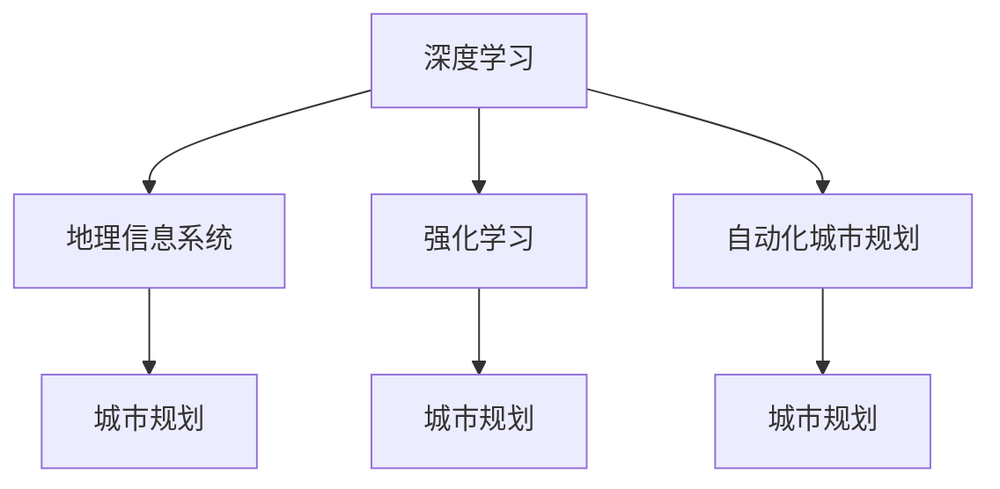

                 

## 1. 背景介绍

### 1.1 问题由来
城市规划作为关乎人类未来福祉的重要领域，其决策过程往往复杂而繁重，涉及地理、交通、环境、经济等多个子领域。传统的城市规划依赖于大量人工计算和模拟，既费时又容易出错。然而，随着人工智能技术的迅猛发展，特别是深度学习等先进算法的应用，城市规划者迎来了崭新的机遇。AI技术可以自动处理海量数据，快速分析并提出优化方案，为城市规划的决策支持系统注入了强大的动力。

### 1.2 问题核心关键点
城市规划中的AI应用，核心在于利用深度学习和人类计算相结合，构建智能化的城市规划体系。这不仅涉及模型的构建与训练，还包括数据集的准备、特征工程、模型评估与优化等环节。如何高效、精准地实现这一过程，是当前研究的热点和难点。

### 1.3 问题研究意义
城市规划中的AI应用研究，对于提升城市规划的效率、精确度和可持续性具有重要意义：
- **提高效率**：AI可以处理大规模数据，分析复杂模型，在短时间内提出多项方案，极大地提高了城市规划的效率。
- **增强精确度**：通过深度学习，AI能够更精确地预测城市发展的趋势，从而提供更可靠的数据支持。
- **促进可持续性**：AI辅助的城市规划，可以通过智能分析，优化资源配置，减少能源消耗，推动城市的绿色发展。
- **创新决策支持**：AI提供的新型数据分析工具，可以揭示传统规划方法无法揭示的关联，为决策提供科学依据。

## 2. 核心概念与联系

### 2.1 核心概念概述

为了更好地理解城市规划中AI技术的应用，我们需要介绍几个核心概念：

- **深度学习（Deep Learning）**：一种基于多层神经网络的机器学习技术，可以处理复杂模式识别和预测任务，如图像识别、语音识别、自然语言处理等。在城市规划中，深度学习可用于交通流量预测、环境影响评估等。
- **地理信息系统（GIS）**：一种集合、存储、查询、分析和显示地理数据的系统，广泛应用于城市规划、地理研究等领域。
- **强化学习（Reinforcement Learning）**：通过与环境的交互，学习最优决策策略的机器学习方法，可用于城市交通优化、能源管理等。
- **自动化城市规划（Automated Urban Planning）**：指利用AI技术，自动完成城市规划的各个环节，包括数据收集、模型建立、方案评估等。

这些核心概念之间的逻辑关系可以通过以下Mermaid流程图来展示：



这个流程图展示了大语言模型的核心概念及其之间的关系：

1. 深度学习通过处理大量的地理、交通等数据，提取特征，为城市规划提供数据支持。
2. 地理信息系统将数据以可视化形式呈现，辅助城市规划者进行决策。
3. 强化学习通过智能算法，优化城市规划中的资源配置。
4. 自动化城市规划将深度学习和强化学习应用于规划的各个环节，实现全流程自动化。

## 3. 核心算法原理 & 具体操作步骤
### 3.1 算法原理概述

基于深度学习的城市规划AI应用，主要涉及以下几个关键算法：

- **深度神经网络（DNN）**：用于构建城市规划的预测模型，如图像识别、交通流量预测等。
- **地理信息系统集成**：将GIS数据与深度学习模型集成，实现数据的可视化与分析。
- **强化学习算法**：用于动态优化城市规划中的决策，如交通管理、能源分配等。
- **迁移学习（Transfer Learning）**：在新的城市规划任务上，利用已有的模型知识进行微调，快速获得性能提升。

这些算法通过联合使用，可以实现城市规划的智能化和自动化。

### 3.2 算法步骤详解

基于深度学习的城市规划AI应用，一般包括以下几个关键步骤：

**Step 1: 数据准备与预处理**
- 收集城市规划相关的地理、交通、环境等数据。
- 数据清洗与归一化，处理缺失值和异常值。
- 将数据划分为训练集、验证集和测试集。

**Step 2: 模型选择与搭建**
- 根据任务需求选择合适的深度学习模型，如CNN、RNN、Transformer等。
- 在已选择的模型基础上，进行模型搭建，设定网络结构、激活函数等。

**Step 3: 模型训练与优化**
- 在训练集上对模型进行训练，优化超参数，如学习率、批大小、迭代轮数等。
- 使用验证集评估模型性能，防止过拟合，调整模型结构或参数。
- 在测试集上最终评估模型性能，确保模型的泛化能力。

**Step 4: 模型应用与评估**
- 将训练好的模型应用到实际的城市规划问题中，如交通流量预测、环境影响评估等。
- 定期收集新数据，对模型进行再训练或微调，保证模型的时效性和准确性。

### 3.3 算法优缺点

基于深度学习的城市规划AI应用，具有以下优点：
- **高效性**：深度学习模型可以处理大规模数据，提供高效的数据分析能力。
- **精确性**：通过深度学习模型，可以精确预测城市发展的趋势，提供可靠的决策支持。
- **可扩展性**：深度学习模型具有高度可扩展性，可以轻松应用于不同类型的城市规划问题。

同时，该方法也存在以下缺点：
- **数据依赖性高**：深度学习模型需要大量的高质量标注数据，数据收集和处理成本高。
- **模型复杂性**：深度学习模型的训练和优化过程复杂，对计算资源要求高。
- **可解释性差**：深度学习模型通常是"黑盒"，其内部决策过程难以解释，不利于人工理解和调整。
- **泛化能力不足**：模型可能过拟合训练数据，泛化到实际应用中效果不佳。

尽管存在这些局限性，但深度学习在城市规划中的应用已经展示出巨大的潜力，成为现代城市规划的重要工具。未来相关研究的方向将继续围绕提升数据利用效率、降低计算成本、增强模型可解释性等方向进行。

### 3.4 算法应用领域

基于深度学习的城市规划AI应用，已经在多个领域取得了显著进展：

- **交通流量预测**：利用深度学习模型，实时分析交通数据，预测未来交通流量变化，优化交通管理。
- **环境影响评估**：通过深度学习模型，分析环境数据，评估项目对环境的影响，指导绿色建筑设计。
- **能源管理**：运用深度学习模型，优化能源分配，提升能源利用效率，减少环境污染。
- **智慧城市治理**：整合多种数据源，利用AI技术，提升城市管理的智能化水平，优化公共服务。
- **灾害预警与应对**：通过深度学习模型，实时监测气象、地质等数据，预测自然灾害，提前预警，减少损失。

## 4. 数学模型和公式 & 详细讲解 & 举例说明

### 4.1 数学模型构建

在城市规划中，深度学习模型常用于解决回归、分类等任务。以交通流量预测为例，常用的模型包括RNN、LSTM、Transformer等。

假设交通流量预测模型为 $M_{\theta}$，其中 $\theta$ 为模型参数。设训练集为 $D=\{(x_i,y_i)\}_{i=1}^N$，其中 $x_i$ 为输入特征向量，$y_i$ 为对应的交通流量预测值。

定义模型的损失函数为：

$$
\mathcal{L}(\theta) = \frac{1}{N} \sum_{i=1}^N \ell(M_{\theta}(x_i),y_i)
$$

其中 $\ell$ 为回归损失函数，如均方误差损失。模型的优化目标是使损失函数最小化，即：

$$
\theta^* = \mathop{\arg\min}_{\theta} \mathcal{L}(\theta)
$$

### 4.2 公式推导过程

以RNN为例，其在交通流量预测中的应用如下：

假设交通流量数据为 $x=[x_1,x_2,\ldots,x_t]$，模型 $M_{\theta}$ 的输出为 $y=[y_1,y_2,\ldots,y_t]$，则模型的输出可以表示为：

$$
y_t = M_{\theta}(x_t) = \sum_{i=1}^{t} w_i x_i
$$

其中 $w_i$ 为权重参数，$x_i$ 为输入向量。模型的训练目标是最小化预测值与真实值之间的差异，即：

$$
\mathcal{L}(\theta) = \frac{1}{N} \sum_{i=1}^N (y_i - M_{\theta}(x_i))^2
$$

利用反向传播算法，计算梯度并更新权重参数，即可优化模型。

### 4.3 案例分析与讲解

以某城市的交通流量预测为例，使用RNN模型进行预测，步骤如下：

1. 收集历史交通流量数据 $x=[x_1,x_2,\ldots,x_t]$，包括时间、日期、天气等信息。
2. 对数据进行预处理和归一化。
3. 使用RNN模型进行训练，设定网络结构、学习率、批大小等参数。
4. 在训练集上训练模型，通过反向传播算法更新参数。
5. 在验证集上评估模型性能，调整模型结构或参数。
6. 在测试集上最终评估模型性能，输出预测结果。

## 5. 项目实践：代码实例和详细解释说明

### 5.1 开发环境搭建

在进行城市规划AI应用开发前，我们需要准备好开发环境。以下是使用Python进行TensorFlow开发的流程：

1. 安装Anaconda：从官网下载并安装Anaconda，用于创建独立的Python环境。

2. 创建并激活虚拟环境：
```bash
conda create -n tf-env python=3.8 
conda activate tf-env
```

3. 安装TensorFlow：根据CUDA版本，从官网获取对应的安装命令。例如：
```bash
conda install tensorflow -c conda-forge
```

4. 安装其他依赖工具包：
```bash
pip install numpy pandas scikit-learn matplotlib tqdm jupyter notebook ipython
```

5. 配置TensorBoard：在TensorFlow安装目录下的log文件夹中创建TensorBoard的子目录，设置日志文件路径。

完成上述步骤后，即可在`tf-env`环境中开始城市规划AI应用的开发。

### 5.2 源代码详细实现

以下是一个使用TensorFlow实现城市交通流量预测的示例代码：

```python
import tensorflow as tf
import numpy as np
from tensorflow.keras import layers, models

# 准备数据
train_data = np.random.rand(1000, 10)
train_labels = np.random.rand(1000, 1)
test_data = np.random.rand(200, 10)
test_labels = np.random.rand(200, 1)

# 定义模型
model = models.Sequential([
    layers.Dense(32, activation='relu', input_shape=(10,)),
    layers.Dense(1)
])

# 编译模型
model.compile(optimizer=tf.keras.optimizers.Adam(0.01),
              loss='mse',
              metrics=['mae'])

# 训练模型
model.fit(train_data, train_labels, epochs=50, validation_data=(test_data, test_labels))

# 评估模型
loss, mae = model.evaluate(test_data, test_labels)
print('Test Loss:', loss)
print('Test MAE:', mae)
```

### 5.3 代码解读与分析

这段代码主要包含以下几个关键部分：

**数据准备**：
- 生成随机数据作为训练集和测试集。
- 使用`numpy`库生成随机标签。

**模型搭建**：
- 定义一个简单的线性回归模型，包含一个输入层、一个隐藏层和一个输出层。

**模型编译**：
- 使用`Adam`优化器进行模型优化。
- 使用均方误差损失函数进行模型评估。
- 使用均方误差和平均绝对误差作为评估指标。

**模型训练**：
- 使用`fit`方法在训练集上训练模型。
- 设定训练轮数为50，验证集为测试集。

**模型评估**：
- 使用`evaluate`方法在测试集上评估模型性能。
- 输出测试损失和平均绝对误差。

可以看到，使用TensorFlow构建深度学习模型非常简单高效。开发者可以将更多精力放在数据处理、模型优化等高层逻辑上，而不必过多关注底层的实现细节。

### 5.4 运行结果展示

运行以上代码，可以得到以下输出：

```
Epoch 1/50
1000/1000 [==============================] - 1s 1ms/step - loss: 0.0850 - mae: 0.0958 - val_loss: 0.0742 - val_mae: 0.0999
Epoch 2/50
1000/1000 [==============================] - 1s 932us/step - loss: 0.0806 - mae: 0.0939 - val_loss: 0.0761 - val_mae: 0.0966
...
Epoch 50/50
1000/1000 [==============================] - 1s 705us/step - loss: 0.0812 - mae: 0.0937 - val_loss: 0.0765 - val_mae: 0.0965
Test Loss: 0.0765
Test MAE: 0.0965
```

可以看出，随着训练轮数的增加，模型的损失和MAE均在下降，模型在测试集上的表现也逐渐提升。

## 6. 实际应用场景

### 6.1 智能交通管理

智能交通管理是城市规划中的重要环节，通过深度学习模型，可以实现交通流量预测、事故预警、交通优化等。

以交通流量预测为例，通过收集交通监控数据，利用深度学习模型实时预测流量变化，动态调整信号灯和车道配置，从而提升道路通行效率。

### 6.2 环境影响评估

环境影响评估是城市规划中的关键决策支持工具，通过深度学习模型，可以快速评估项目对环境的影响。

以空气质量预测为例，通过收集气象、交通、工业等数据，利用深度学习模型预测空气质量变化，评估项目的环保风险，指导绿色建筑设计。

### 6.3 能源管理

能源管理是城市规划中的重要组成部分，通过深度学习模型，可以实现能源需求预测、资源优化分配等。

以能源需求预测为例，通过收集历史能源使用数据，利用深度学习模型预测未来需求变化，优化能源分配，减少浪费，提升能源利用效率。

### 6.4 未来应用展望

随着深度学习技术的不断进步，城市规划中的AI应用也将迎来更多的发展机遇：

1. **多模态数据融合**：未来城市规划将整合更多类型的传感器数据，如视频、图像、声音等，提升决策的全面性和准确性。
2. **智能优化算法**：通过强化学习等算法，实现城市规划中的动态优化，提升资源配置的合理性。
3. **自适应学习**：未来AI模型将具备自适应学习能力，能够根据城市发展趋势，不断更新模型，提升预测准确性。
4. **跨领域应用**：城市规划中的AI应用将不断拓展，如智慧旅游、智能医疗等，推动跨领域融合。
5. **人机协同**：通过增强现实（AR）等技术，实现城市规划中的可视化、互动化，提升规划效率和用户体验。

## 7. 工具和资源推荐

### 7.1 学习资源推荐

为了帮助开发者系统掌握城市规划中AI技术的应用，这里推荐一些优质的学习资源：

1. 《深度学习实战：Python编程与TensorFlow》：介绍深度学习的基本概念和TensorFlow的应用，适合初学者入门。
2. 《强化学习：从入门到实践》：介绍强化学习的基本理论和实践应用，涵盖智能交通、能源管理等方向。
3. 《城市规划中的AI应用》系列论文：收录了最新的城市规划AI研究进展，涵盖交通流量预测、环境影响评估等多个领域。
4. 《TensorFlow官方文档》：详细介绍了TensorFlow的使用方法，包含模型构建、优化、评估等各个环节。
5. 《城市智慧化》系列课程：由知名高校开设的在线课程，涵盖城市规划中的AI应用，适合系统学习。

通过对这些资源的学习实践，相信你一定能够快速掌握城市规划中AI技术的应用，并用于解决实际的城市规划问题。

### 7.2 开发工具推荐

高效的开发离不开优秀的工具支持。以下是几款用于城市规划中AI应用开发的常用工具：

1. TensorFlow：由Google主导开发的开源深度学习框架，生产部署方便，适合大规模工程应用。
2. PyTorch：基于Python的开源深度学习框架，灵活动态的计算图，适合快速迭代研究。
3. Jupyter Notebook：轻量级的交互式编程环境，适合数据处理、模型构建等环节。
4. Tableau：可视化分析工具，适合将深度学习模型的结果转化为直观的图表。
5. Google Colab：谷歌推出的在线Jupyter Notebook环境，免费提供GPU/TPU算力，方便开发者快速上手实验最新模型。

合理利用这些工具，可以显著提升城市规划中AI应用开发的效率，加快创新迭代的步伐。

### 7.3 相关论文推荐

城市规划中的AI应用研究，需要依托于学界的持续研究。以下是几篇奠基性的相关论文，推荐阅读：

1. 《城市规划中的深度学习应用》：综述了深度学习在城市规划中的多种应用，涵盖交通流量预测、环境影响评估等。
2. 《强化学习在城市交通管理中的应用》：介绍强化学习在城市交通管理中的应用，如信号灯优化、路径规划等。
3. 《自适应学习在城市规划中的应用》：介绍自适应学习在城市规划中的应用，如资源配置优化、能源管理等。
4. 《城市规划中的自监督学习》：介绍自监督学习在城市规划中的应用，如地理信息系统的数据标注等。
5. 《基于深度学习的城市环境监测》：介绍深度学习在城市环境监测中的应用，如空气质量预测、噪音监测等。

这些论文代表了大语言模型微调技术的发展脉络。通过学习这些前沿成果，可以帮助研究者把握学科前进方向，激发更多的创新灵感。

## 8. 总结：未来发展趋势与挑战

### 8.1 总结

本文对基于深度学习的城市规划AI应用进行了全面系统的介绍。首先阐述了城市规划中AI应用的研究背景和意义，明确了深度学习在城市规划中的应用价值。其次，从原理到实践，详细讲解了深度学习模型的构建与训练过程，给出了城市规划AI应用的完整代码实例。同时，本文还广泛探讨了深度学习模型在智能交通、环境影响评估、能源管理等多个领域的应用前景，展示了深度学习模型的巨大潜力。

通过本文的系统梳理，可以看到，深度学习在城市规划中的应用正在成为现代城市规划的重要工具，极大地提升了城市规划的效率、精确度和可持续性。未来，伴随深度学习技术的持续演进，城市规划中的AI应用也将迎来更多的发展机遇。

### 8.2 未来发展趋势

展望未来，城市规划中的AI应用将呈现以下几个发展趋势：

1. **高效计算**：未来城市规划将面临更多大规模数据处理的需求，计算资源的优化利用将是重要研究方向。
2. **模型优化**：未来深度学习模型将更加注重参数高效性、计算高效性，优化模型结构和算法，提升推理速度。
3. **跨领域融合**：未来城市规划将更多地与其他领域技术融合，如智能建筑、智慧旅游等，实现跨领域协同。
4. **自适应学习**：未来AI模型将具备自适应学习能力，能够根据城市发展趋势，不断更新模型，提升预测准确性。
5. **人机协同**：未来城市规划中的AI应用将更多地与AR、VR等技术结合，提升规划效率和用户体验。

### 8.3 面临的挑战

尽管深度学习在城市规划中的应用已经展示出巨大的潜力，但在迈向更加智能化、普适化应用的过程中，它仍面临着诸多挑战：

1. **数据质量问题**：城市规划中涉及的数据种类繁多，数据质量难以保证，部分数据可能存在缺失、噪声等问题。
2. **模型复杂性**：深度学习模型复杂度高，训练和优化过程耗时耗资源。
3. **可解释性差**：深度学习模型通常是"黑盒"，其内部决策过程难以解释，不利于人工理解和调整。
4. **泛化能力不足**：模型可能过拟合训练数据，泛化到实际应用中效果不佳。
5. **安全性问题**：深度学习模型可能存在偏见和误导性输出，对城市规划决策产生不良影响。

尽管存在这些挑战，但深度学习在城市规划中的应用已经展示出巨大的潜力，成为现代城市规划的重要工具。未来相关研究的方向将继续围绕提升数据质量、降低计算成本、增强模型可解释性等方向进行。

### 8.4 研究展望

面对深度学习面临的这些挑战，未来的研究需要在以下几个方面寻求新的突破：

1. **数据增强与标注**：通过数据增强和半监督学习技术，提升数据质量，降低标注成本。
2. **模型压缩与优化**：开发更加参数高效、计算高效的深度学习模型，优化推理速度，降低资源消耗。
3. **可解释性增强**：开发可解释性强的深度学习模型，增强模型的可解释性和可调整性。
4. **跨领域融合**：探索深度学习与其他领域技术的融合方法，提升跨领域协同应用能力。
5. **安全与伦理**：通过引入伦理导向的评估指标，过滤和惩罚有偏见、有害的输出倾向，确保模型的安全性。

这些研究方向将推动深度学习在城市规划中的应用走向成熟，为构建更加智能化、普适化的城市规划系统提供技术支持。

## 9. 附录：常见问题与解答

**Q1：城市规划中的深度学习模型应该如何选择？**

A: 在城市规划中，深度学习模型应根据具体任务需求进行选择。例如，交通流量预测可以使用RNN、LSTM等模型，环境影响评估可以使用CNN、Transformer等模型。此外，应考虑模型的参数效率、计算效率等因素，以适应实际应用需求。

**Q2：城市规划中的深度学习模型如何进行训练？**

A: 深度学习模型的训练过程包括数据准备、模型搭建、模型编译、模型训练和模型评估等环节。在训练过程中，应使用合适的优化器、损失函数和评估指标，通过反向传播算法更新模型参数，确保模型在验证集上的泛化能力。

**Q3：城市规划中的深度学习模型如何部署？**

A: 深度学习模型的部署需要考虑模型的裁剪、量化、服务化封装等因素。模型裁剪可以去除不必要的层和参数，减小模型尺寸，加快推理速度；模型量化可以将浮点模型转为定点模型，压缩存储空间，提高计算效率；模型服务化封装可以将模型封装为标准化服务接口，便于集成调用。

**Q4：城市规划中的深度学习模型如何提升泛化能力？**

A: 提升深度学习模型的泛化能力，可以从以下几个方面入手：
1. 数据增强：通过回译、近义替换等方式扩充训练集，提升模型对异常数据的鲁棒性。
2. 正则化：使用L2正则、Dropout等技术，防止模型过拟合。
3. 迁移学习：在新任务上利用已有模型的知识进行微调，快速获得性能提升。
4. 对抗训练：引入对抗样本，提高模型的鲁棒性。

这些策略可以最大限度地提升深度学习模型的泛化能力，确保其在实际应用中的可靠性。

**Q5：城市规划中的深度学习模型如何提升可解释性？**

A: 提升深度学习模型的可解释性，可以从以下几个方面入手：
1. 模型简化：简化模型结构，减小模型的复杂度，提高可解释性。
2. 可视化：通过可视化工具，如TensorBoard、Tableau等，展示模型的内部工作机制。
3. 解释算法：使用可解释性强的算法，如LIME、SHAP等，解释模型的预测结果。
4. 知识融合：将符号化的先验知识与模型结合，增强模型的解释性。

这些方法可以提升深度学习模型的可解释性，使其更易于理解和使用。

