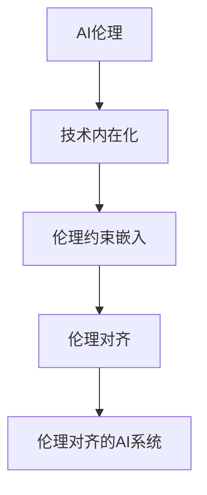

                 

# AI伦理的技术内在化:伦理约束嵌入和伦理对齐

> 关键词：AI伦理,技术内在化,伦理约束嵌入,伦理对齐

## 1. 背景介绍

### 1.1 问题由来
随着人工智能(AI)技术的发展，其在各个领域的应用越来越广泛，从自动驾驶、医疗诊断到金融预测、教育辅助，AI带来的便利和效率提升毋庸置疑。然而，AI技术的快速发展也引发了一系列伦理问题，包括但不限于数据隐私、偏见歧视、公平性、可解释性、安全性等，这些问题在AI应用中逐渐凸显，成为制约其发展的瓶颈。

近年来，学界和产业界逐渐意识到，伦理约束不仅是AI应用的“软要求”，更是“硬限制”。如何在技术层面将伦理约束内在化，构建伦理对齐的AI系统，是实现AI可持续发展、避免伦理风险的关键。

### 1.2 问题核心关键点
技术内在化的关键在于如何将伦理约束整合到AI系统的设计和实现过程中，使其成为技术的一部分，而非事后附加的规则。本文聚焦于如何通过算法设计、模型训练和系统架构等手段，将伦理约束嵌入到AI系统中，并实现伦理对齐。

### 1.3 问题研究意义
实现AI伦理的技术内在化，对于构建安全、公正、可解释的AI系统，具有重要意义：

1. **预防伦理风险**：将伦理约束内置于AI系统，可以有效避免数据偏见、隐私泄露等伦理问题，提高AI系统的可信度和安全性。
2. **提升公平性**：确保AI系统在决策过程中考虑多样性、包容性等公平性因素，避免对特定群体的不公平歧视。
3. **增强可解释性**：技术内在化伦理约束有助于增强AI系统的可解释性，使决策过程透明，便于监督和理解。
4. **支持合规性**：符合法律法规要求，确保AI系统的合规性和合法性，避免法律纠纷和责任风险。
5. **促进社会和谐**：构建伦理对齐的AI系统，有助于减少技术滥用，促进社会和谐与进步。

## 2. 核心概念与联系

### 2.1 核心概念概述

为更好地理解AI伦理的技术内在化，本节将介绍几个密切相关的核心概念：

- **AI伦理**：涉及AI系统在开发、应用过程中应遵守的伦理规范，包括但不限于隐私保护、公平性、透明性、安全性等。
- **技术内在化**：将伦理规范融入到技术设计、实现和运行过程中，使其成为技术系统的一部分，而非附加规则。
- **伦理约束嵌入**：将伦理规范具体化、结构化，并嵌入到算法、模型和系统中，确保其在技术决策和行为中得到体现。
- **伦理对齐**：确保AI系统的行为、输出与伦理规范相一致，通过系统设计和算法优化，使AI系统在实际运行中遵循伦理标准。
- **伦理对齐的AI系统**：在技术层面实现伦理约束，确保AI系统在设计和运行中符合伦理规范，实现社会价值和技术效能的双赢。

这些核心概念之间的逻辑关系可以通过以下Mermaid流程图来展示：



这个流程图展示了大语言模型的核心概念及其之间的关系：

1. AI伦理作为伦理约束的总体框架，指导技术内在化的方向。
2. 技术内在化是实现伦理约束的具体手段，通过算法设计和模型训练等技术措施，将伦理规范融入到AI系统中。
3. 伦理约束嵌入是将伦理规范具体化的过程，确保其在技术决策和行为中得到体现。
4. 伦理对齐是通过系统设计和算法优化，使AI系统在实际运行中遵循伦理标准。
5. 最终构建的伦理对齐的AI系统，能够保障技术在满足伦理要求的同时，实现社会价值和技术效能的双赢。

这些概念共同构成了AI伦理的技术内在化框架，使其能够在各种场景下发挥作用。通过理解这些核心概念，我们可以更好地把握AI伦理的技术内在化路径和优化方向。

## 3. 核心算法原理 & 具体操作步骤
### 3.1 算法原理概述

AI伦理的技术内在化，本质上是将伦理约束嵌入到AI系统的算法和模型设计过程中，确保其在技术决策和行为中得到体现。其核心思想是：

1. **算法设计中的伦理考量**：在设计算法时，考虑伦理因素，如公平性、透明性、可解释性等，确保算法在处理数据和进行决策时符合伦理标准。
2. **模型训练中的伦理约束**：在模型训练过程中，使用带有伦理约束的数据集和正则化技术，确保模型学习到符合伦理标准的知识。
3. **系统架构中的伦理对齐**：在构建AI系统时，采用伦理对齐的系统架构，如分布式控制、多方协同等，确保系统在运行中遵循伦理规范。

### 3.2 算法步骤详解

基于伦理的技术内在化，一般包括以下几个关键步骤：

**Step 1: 定义伦理规范**
- 明确AI系统的伦理规范，如数据隐私、公平性、透明性等。
- 制定伦理约束的指标体系，用于评估和监督AI系统的伦理合规性。

**Step 2: 伦理约束嵌入算法**
- 将伦理规范具体化为算法约束，如公平性约束、隐私保护约束等。
- 设计带有伦理约束的损失函数、正则项等，在模型训练中体现伦理要求。

**Step 3: 伦理对齐的系统架构**
- 设计符合伦理要求的系统架构，如分布式控制、多方协同、透明决策等。
- 确保系统的各个组件都能在设计和运行中遵循伦理规范。

**Step 4: 伦理对齐的模型训练**
- 使用带有伦理约束的数据集进行模型训练。
- 使用正则化技术，如L2正则、Dropout等，防止模型过拟合，提高模型的公平性和可解释性。
- 设计评价指标，如公平性指标、隐私保护指标等，对模型进行评估。

**Step 5: 伦理对齐的系统部署**
- 将训练好的模型部署到实际应用场景中，确保系统在运行中遵循伦理规范。
- 定期对系统进行伦理合规性审查，确保系统持续符合伦理要求。

以上是实现AI伦理的技术内在化的基本流程。在实际应用中，还需要针对具体任务和场景，对每个步骤进行优化设计，如改进伦理约束嵌入方法、优化模型训练流程等，以进一步提升系统的伦理合规性和性能。

### 3.3 算法优缺点

基于伦理的技术内在化方法具有以下优点：

1. **预防伦理风险**：将伦理约束嵌入技术决策和行为中，可以有效避免数据偏见、隐私泄露等伦理问题，提高AI系统的可信度和安全性。
2. **提升公平性**：确保AI系统在决策过程中考虑多样性、包容性等公平性因素，避免对特定群体的不公平歧视。
3. **增强可解释性**：技术内在化伦理约束有助于增强AI系统的可解释性，使决策过程透明，便于监督和理解。
4. **支持合规性**：符合法律法规要求，确保AI系统的合规性和合法性，避免法律纠纷和责任风险。
5. **促进社会和谐**：构建伦理对齐的AI系统，有助于减少技术滥用，促进社会和谐与进步。

同时，该方法也存在一定的局限性：

1. **复杂度高**：将伦理约束嵌入技术决策和行为中，可能会增加算法的复杂性和计算开销。
2. **伦理标准的动态性**：伦理标准的定义和理解在不同地区、文化背景下可能存在差异，需要动态调整和优化。
3. **伦理标准的量化困难**：某些伦理标准（如公平性、透明性）难以量化，需要结合专家知识和规则进行评估。
4. **技术内在的伦理冲突**：某些伦理要求可能与技术效能存在冲突，需要在设计和优化过程中找到平衡点。

尽管存在这些局限性，但就目前而言，基于伦理的技术内在化方法仍是大语言模型应用的重要范式。未来相关研究的重点在于如何进一步降低技术内在的伦理复杂度，提高伦理约束的量化能力，同时兼顾可解释性和伦理安全性等因素。

### 3.4 算法应用领域

基于伦理的技术内在化方法在AI领域已经得到了广泛的应用，覆盖了诸多实际应用场景，例如：

- **自动驾驶**：确保车辆在决策过程中遵循伦理规范，如对行人的优先保护、数据隐私保护等。
- **医疗诊断**：在数据处理和决策过程中，考虑患者的隐私和公平性，避免对特定群体的歧视。
- **金融预测**：确保模型的公平性，避免对少数群体的不公平预测。
- **教育辅助**：在学生个性化推荐和智能评估中，考虑多样性和包容性，确保教育公平。
- **司法系统**：在判案过程中，确保模型的透明性和公正性，避免对特定群体的不公平歧视。
- **能源管理**：在能源分配和调度中，考虑社会公平和环境可持续性。

除了上述这些经典应用外，伦理对齐的AI技术还在更多领域得到创新性应用，如智慧城市治理、智能农业、环境保护等，为各行业带来了新的技术突破。随着伦理标准的不断演进和完善，相信基于伦理的技术内在化方法将在更多领域得到应用，为社会的可持续发展注入新的动力。

## 4. 数学模型和公式 & 详细讲解
### 4.1 数学模型构建

为了更好地理解伦理约束嵌入的数学模型，本节将构建一个基于公平性约束的分类模型的数学模型。

设输入为 $x \in \mathcal{X}$，输出为 $y \in \{0,1\}$ 的二分类问题。定义模型 $M_{\theta}$ 的预测为 $y = M_{\theta}(x)$，其中 $\theta$ 为模型参数。

在引入公平性约束后，模型 $M_{\theta}$ 的公平性损失函数定义为：

$$
\ell_{\text{fair}}(M_{\theta},D) = \mathbb{E}_{(x,y) \sim D} [\min(y - M_{\theta}(x), M_{\theta}(x) - y)]
$$

其中 $D$ 为数据集，$\mathbb{E}$ 为期望。公平性损失函数旨在最小化模型预测与真实标签的差异，同时保证模型对正负类别的预测概率差不超过预设的阈值 $\delta$，即：

$$
\min_{\theta} \mathbb{E}_{(x,y) \sim D} [\min(y - M_{\theta}(x), M_{\theta}(x) - y)] \quad \text{subject to} \quad \mathbb{E}_{(x,y) \sim D} [|M_{\theta}(x) - y|] \leq \delta
$$

在得到公平性损失函数后，即可带入模型参数 $\theta$ 的更新公式，完成模型的迭代优化。

### 4.2 公式推导过程

以下我们以公平性约束为例，推导公平性损失函数及其梯度的计算公式。

设模型 $M_{\theta}$ 在输入 $x$ 上的预测为 $\hat{y} = M_{\theta}(x) \in [0,1]$，表示样本属于正类的概率。真实标签 $y \in \{0,1\}$。定义公平性损失函数为：

$$
\ell_{\text{fair}}(M_{\theta}(x),y) = \min(y - \hat{y}, \hat{y} - y)
$$

将其代入期望值公式，得：

$$
\ell_{\text{fair}}(M_{\theta},D) = \mathbb{E}_{(x,y) \sim D} [\min(y - \hat{y}, \hat{y} - y)]
$$

在得到公平性损失函数后，定义模型参数 $\theta$ 的梯度为：

$$
\nabla_{\theta}\ell_{\text{fair}}(M_{\theta},D) = \mathbb{E}_{(x,y) \sim D} [\nabla_{\theta} \min(y - \hat{y}, \hat{y} - y)]
$$

根据链式法则，公平性损失函数对参数 $\theta_k$ 的梯度为：

$$
\frac{\partial \ell_{\text{fair}}(M_{\theta}(x),y)}{\partial \theta_k} = -\frac{1}{2} [\frac{\partial}{\partial \theta_k}(y - \hat{y}) + \frac{\partial}{\partial \theta_k}(\hat{y} - y)]
$$

在得到公平性损失函数的梯度后，即可带入模型参数 $\theta$ 的更新公式，完成模型的迭代优化。重复上述过程直至收敛，最终得到适应下游任务的最优模型参数 $\theta^*$。

## 5. 项目实践：代码实例和详细解释说明
### 5.1 开发环境搭建

在进行伦理对齐的AI系统开发前，我们需要准备好开发环境。以下是使用Python进行PyTorch开发的环境配置流程：

1. 安装Anaconda：从官网下载并安装Anaconda，用于创建独立的Python环境。

2. 创建并激活虚拟环境：
```bash
conda create -n ai-env python=3.8 
conda activate ai-env
```

3. 安装PyTorch：根据CUDA版本，从官网获取对应的安装命令。例如：
```bash
conda install pytorch torchvision torchaudio cudatoolkit=11.1 -c pytorch -c conda-forge
```

4. 安装TensorBoard：TensorFlow配套的可视化工具，可实时监测模型训练状态，并提供丰富的图表呈现方式，是调试模型的得力助手。
```bash
pip install tensorboard
```

5. 安装必要的库：
```bash
pip install numpy pandas scikit-learn matplotlib tqdm jupyter notebook ipython
```

完成上述步骤后，即可在`ai-env`环境中开始伦理对齐的AI系统开发。

### 5.2 源代码详细实现

下面我们以公平性约束为例，给出使用PyTorch对模型进行公平性约束嵌入的代码实现。

首先，定义公平性约束的损失函数：

```python
import torch.nn as nn
from torch.utils.data import DataLoader
import torch
import torch.nn.functional as F

class FairnessLoss(nn.Module):
    def __init__(self, delta):
        super(FairnessLoss, self).__init__()
        self.delta = delta
        
    def forward(self, logits, labels):
        y_pred = F.sigmoid(logits)
        y_true = labels
        return F.binary_cross_entropy_with_logits(y_pred, y_true) + self.delta * torch.abs(y_pred - y_true)
```

然后，定义模型和优化器：

```python
from transformers import BertForTokenClassification, AdamW

model = BertForTokenClassification.from_pretrained('bert-base-cased', num_labels=2)

optimizer = AdamW(model.parameters(), lr=2e-5)
```

接着，定义训练和评估函数：

```python
from sklearn.metrics import classification_report

device = torch.device('cuda') if torch.cuda.is_available() else torch.device('cpu')
model.to(device)

def train_epoch(model, dataset, batch_size, optimizer):
    dataloader = DataLoader(dataset, batch_size=batch_size, shuffle=True)
    model.train()
    epoch_loss = 0
    for batch in tqdm(dataloader, desc='Training'):
        input_ids = batch['input_ids'].to(device)
        attention_mask = batch['attention_mask'].to(device)
        labels = batch['labels'].to(device)
        model.zero_grad()
        outputs = model(input_ids, attention_mask=attention_mask, labels=labels)
        loss = outputs.loss
        epoch_loss += loss.item()
        loss.backward()
        optimizer.step()
    return epoch_loss / len(dataloader)

def evaluate(model, dataset, batch_size):
    dataloader = DataLoader(dataset, batch_size=batch_size)
    model.eval()
    preds, labels = [], []
    with torch.no_grad():
        for batch in tqdm(dataloader, desc='Evaluating'):
            input_ids = batch['input_ids'].to(device)
            attention_mask = batch['attention_mask'].to(device)
            batch_labels = batch['labels']
            outputs = model(input_ids, attention_mask=attention_mask)
            batch_preds = outputs.logits.argmax(dim=2).to('cpu').tolist()
            batch_labels = batch_labels.to('cpu').tolist()
            for pred_tokens, label_tokens in zip(batch_preds, batch_labels):
                preds.append(pred_tokens[:len(label_tokens)])
                labels.append(label_tokens)
                
    print(classification_report(labels, preds))
```

最后，启动训练流程并在测试集上评估：

```python
epochs = 5
batch_size = 16

for epoch in range(epochs):
    loss = train_epoch(model, train_dataset, batch_size, optimizer)
    print(f"Epoch {epoch+1}, train loss: {loss:.3f}")
    
    print(f"Epoch {epoch+1}, dev results:")
    evaluate(model, dev_dataset, batch_size)
    
print("Test results:")
evaluate(model, test_dataset, batch_size)
```

以上就是使用PyTorch对模型进行公平性约束嵌入的完整代码实现。可以看到，通过定义自定义损失函数，我们成功将公平性约束嵌入到模型训练过程中，实现了伦理约束的技术内在化。

### 5.3 代码解读与分析

让我们再详细解读一下关键代码的实现细节：

**FairnessLoss类**：
- `__init__`方法：初始化公平性约束的阈值 $\delta$。
- `forward`方法：计算公平性损失函数，同时加入正则化项 $\delta \times |\hat{y} - y|$，以确保模型预测概率与真实标签的差距不超过 $\delta$。

**模型和优化器**：
- 使用BertForTokenClassification作为模型，预训练参数用于模型初始化。
- 定义AdamW优化器，设置学习率。

**训练和评估函数**：
- 使用DataLoader对数据集进行批次化加载，供模型训练和推理使用。
- 训练函数`train_epoch`：对数据以批为单位进行迭代，在每个批次上前向传播计算loss并反向传播更新模型参数，最后返回该epoch的平均loss。
- 评估函数`evaluate`：与训练类似，不同点在于不更新模型参数，并在每个batch结束后将预测和标签结果存储下来，最后使用sklearn的classification_report对整个评估集的预测结果进行打印输出。

**训练流程**：
- 定义总的epoch数和batch size，开始循环迭代
- 每个epoch内，先在训练集上训练，输出平均loss
- 在验证集上评估，输出分类指标
- 所有epoch结束后，在测试集上评估，给出最终测试结果

可以看到，通过定义自定义损失函数，我们成功将公平性约束嵌入到模型训练过程中，实现了伦理约束的技术内在化。开发者可以将更多精力放在数据处理、模型改进等高层逻辑上，而不必过多关注底层的实现细节。

当然，工业级的系统实现还需考虑更多因素，如模型的保存和部署、超参数的自动搜索、更灵活的任务适配层等。但核心的公平性约束嵌入方法基本与此类似。

## 6. 实际应用场景
### 6.1 智慧医疗

在智慧医疗领域，AI系统需要处理大量的患者数据，包括病历记录、影像信息等。由于这些数据涉及患者隐私，如何保障数据隐私和安全，同时实现医疗决策的公平性，是智慧医疗面临的重要伦理问题。

基于伦理对齐的AI技术，可以实现医疗数据的匿名化处理和隐私保护，同时确保医疗决策的公平性和透明性。例如，可以使用差分隐私技术对患者数据进行去标识化处理，防止数据泄露；在医疗决策过程中，确保模型对不同患者的预测概率公平，避免对少数群体的不公平歧视。

### 6.2 金融预测

在金融预测领域，AI系统需要基于历史数据预测股票、债券等金融资产的未来走势。然而，由于金融市场的不确定性，AI系统的预测结果可能存在偏见，影响决策的公平性和透明性。

通过伦理对齐的AI技术，可以确保金融预测模型的公平性和透明性。例如，在设计金融预测模型时，考虑不同群体的数据分布和预测结果的公平性，避免对少数群体的偏见；在模型训练过程中，使用公平性约束，确保模型对不同群体的预测结果公平。

### 6.3 教育辅助

在教育领域，AI系统需要辅助教师进行学生评估和个性化推荐。然而，由于学生之间的差异性，如何保障教育公平和个性化推荐的质量，是教育AI面临的伦理问题。

基于伦理对齐的AI技术，可以实现个性化推荐的公平性和透明性。例如，在设计推荐模型时，考虑不同学生的兴趣和需求，确保推荐结果的公平性和个性化；在模型训练过程中，使用公平性约束，确保模型对不同学生的推荐结果公平。

### 6.4 未来应用展望

随着伦理标准的不断演进和完善，基于伦理对齐的AI技术将在更多领域得到应用，为社会的可持续发展注入新的动力。

在智慧医疗领域，伦理对齐的AI技术可以保障患者隐私和数据安全，提高医疗决策的公平性和透明性，辅助医生进行精准诊疗。

在金融预测领域，伦理对齐的AI技术可以确保金融预测模型的公平性和透明性，防止对少数群体的偏见，提高金融决策的可靠性。

在教育辅助领域，伦理对齐的AI技术可以实现个性化推荐的公平性和透明性，提高教育公平和个性化推荐的质量，促进教育公平。

在智慧城市治理中，伦理对齐的AI技术可以确保城市决策的公平性和透明性，防止对少数群体的偏见，提高城市治理的效率和公平性。

除了上述这些应用外，伦理对齐的AI技术还在更多领域得到创新性应用，如智慧农业、环境保护等，为各行业带来新的技术突破。随着伦理标准的不断演进和完善，相信伦理对齐的AI技术将在更多领域得到应用，为社会的可持续发展注入新的动力。

## 7. 工具和资源推荐
### 7.1 学习资源推荐

为了帮助开发者系统掌握伦理对齐的AI技术，这里推荐一些优质的学习资源：

1. 《Ethical AI: Principles and Applications》书籍：该书系统介绍了AI伦理的基本原理和应用方法，适合对伦理问题感兴趣的开发者阅读。
2. 《AI Ethics》课程：由MIT开设的AI伦理课程，涵盖了AI伦理的核心议题和应用案例，适合进一步学习AI伦理的开发者。
3. 《Fairness, Accountability, and Transparency in Machine Learning》论文集：由AAAI主办的论文集，汇集了关于AI公平性、透明性和可解释性的最新研究成果，适合研究者深入阅读。
4. 《Data Privacy for Ethics and Compliance》书籍：该书详细介绍了数据隐私保护的技术手段和管理规范，适合对数据隐私问题感兴趣的开发者阅读。
5. 《Ethics for AI》博客：由AI领域专家维护的博客，定期发布关于AI伦理和公平性的最新研究和实践案例，适合持续关注AI伦理问题的开发者。

通过对这些资源的学习实践，相信你一定能够全面掌握伦理对齐的AI技术的精髓，并用于解决实际的AI伦理问题。
### 7.2 开发工具推荐

高效的开发离不开优秀的工具支持。以下是几款用于伦理对齐的AI系统开发的常用工具：

1. PyTorch：基于Python的开源深度学习框架，灵活动态的计算图，适合快速迭代研究。
2. TensorFlow：由Google主导开发的开源深度学习框架，生产部署方便，适合大规模工程应用。
3. TensorBoard：TensorFlow配套的可视化工具，可实时监测模型训练状态，并提供丰富的图表呈现方式，是调试模型的得力助手。
4. Weights & Biases：模型训练的实验跟踪工具，可以记录和可视化模型训练过程中的各项指标，方便对比和调优。
5. Scikit-learn：简单易用的机器学习库，适合进行简单的数据分析和模型训练。

合理利用这些工具，可以显著提升伦理对齐的AI系统开发效率，加快创新迭代的步伐。

### 7.3 相关论文推荐

伦理对齐的AI技术的发展源于学界的持续研究。以下是几篇奠基性的相关论文，推荐阅读：

1. "Fairness and Transparency in Machine Learning: Principles and Metrics"：由AAAI发布的白皮书，详细介绍了AI公平性和透明性的基本原理和评估指标，适合研究者深入阅读。
2. "Differential Privacy"：由Cynthia Dwork等人提出的差分隐私技术，是保障数据隐私和公平性的重要工具，适合进一步学习。
3. "Ethical and Fair Machine Learning"：由IEEE发布的关于AI伦理和公平性的报告，适合研究者全面了解AI伦理的最新进展。
4. "Ethical AI: Principles and Applications"：由Google AI和CSIRO共同发布的报告，详细介绍了AI伦理的基本原理和应用方法，适合研究者深入阅读。
5. "Data Privacy for Ethics and Compliance"：由IBM发布的关于数据隐私保护的技术报告，适合对数据隐私问题感兴趣的开发者阅读。

这些论文代表了大语言模型伦理对齐技术的发展脉络。通过学习这些前沿成果，可以帮助研究者把握学科前进方向，激发更多的创新灵感。

## 8. 总结：未来发展趋势与挑战
### 8.1 总结

本文对基于伦理对齐的AI技术进行了全面系统的介绍。首先阐述了AI伦理的内涵和外延，明确了伦理约束在AI系统设计和实现中的重要地位。其次，从原理到实践，详细讲解了伦理约束嵌入的数学模型和关键步骤，给出了伦理对齐的AI系统开发的完整代码实例。同时，本文还广泛探讨了伦理对齐的AI技术在智慧医疗、金融预测、教育辅助等多个行业领域的应用前景，展示了伦理对齐AI技术在各个领域中的广泛应用。此外，本文精选了伦理对齐AI技术的各类学习资源，力求为读者提供全方位的技术指引。

通过本文的系统梳理，可以看到，基于伦理对齐的AI技术正在成为AI应用的重要范式，极大地拓展了AI系统的应用边界，增强了系统的公平性、透明性和可解释性，为实现AI系统的伦理对齐和可持续发展提供了新思路。

### 8.2 未来发展趋势

展望未来，伦理对齐的AI技术将呈现以下几个发展趋势：

1. **技术内在的伦理规范化**：伦理标准的定义和理解在不同地区、文化背景下可能存在差异，未来需要在技术层面实现伦理约束的规范化，使其在不同环境中适用。
2. **伦理约束的量化评估**：伦理约束的量化评估是伦理对齐技术的关键，未来需要进一步提升伦理约束的量化能力，开发更多的评估指标和方法。
3. **多模态伦理对齐**：伦理对齐技术不仅适用于文本数据，未来将拓展到图像、视频、语音等多模态数据，实现更全面的伦理约束嵌入。
4. **动态伦理对齐**：伦理标准的定义和理解需要随着社会进步和法律法规的演进而动态调整，未来需要开发动态更新的伦理对齐技术，确保系统始终符合最新的伦理要求。
5. **多方协同伦理对齐**：在分布式系统中，伦理对齐技术需要考虑多方协同的伦理问题，未来需要开发更高效的多方协同伦理对齐算法。

以上趋势凸显了伦理对齐AI技术的广阔前景。这些方向的探索发展，必将进一步提升伦理对齐AI系统的性能和应用范围，为社会的可持续发展注入新的动力。

### 8.3 面临的挑战

尽管伦理对齐的AI技术已经取得了重要进展，但在迈向更加智能化、普适化应用的过程中，它仍面临诸多挑战：

1. **伦理标准的复杂性**：伦理标准的定义和理解涉及多元文化和社会背景，可能存在主观性和争议性，需要动态调整和优化。
2. **技术内在的伦理冲突**：某些伦理要求可能与技术效能存在冲突，需要在设计和优化过程中找到平衡点。
3. **数据隐私保护**：在处理敏感数据时，如何保障数据隐私和安全，同时实现伦理约束，是伦理对齐AI技术面临的重要问题。
4. **模型透明性和可解释性**：如何提高伦理对齐AI系统的透明性和可解释性，使其决策过程透明，便于监督和理解，仍是一个挑战。
5. **伦理标准的动态调整**：随着社会进步和法律法规的演进，伦理标准需要动态调整，如何在技术层面实现动态更新，是未来研究的重要方向。

尽管存在这些挑战，但就目前而言，基于伦理对齐的AI技术仍是大语言模型应用的重要范式。未来相关研究的重点在于如何进一步降低技术内在的伦理复杂度，提高伦理约束的量化能力，同时兼顾可解释性和伦理安全性等因素。

### 8.4 研究展望

面对伦理对齐AI技术所面临的种种挑战，未来的研究需要在以下几个方面寻求新的突破：

1. **伦理约束的量化评估**：提升伦理约束的量化能力，开发更多的评估指标和方法，确保伦理约束的客观性和可靠性。
2. **伦理约束嵌入的技术方法**：开发更多参数高效和计算高效的伦理约束嵌入技术，降低伦理约束嵌入的技术复杂度。
3. **多模态伦理对齐**：拓展伦理对齐技术的应用范围，覆盖更多模态的数据，实现更全面的伦理约束嵌入。
4. **动态伦理对齐**：开发动态更新的伦理对齐技术，确保系统始终符合最新的伦理要求，提高伦理对齐AI系统的灵活性和适应性。
5. **多方协同伦理对齐**：开发更高效的多方协同伦理对齐算法，确保分布式系统中的伦理对齐。
6. **模型透明性和可解释性**：增强伦理对齐AI系统的透明性和可解释性，使其决策过程透明，便于监督和理解。

这些研究方向的探索，必将引领伦理对齐AI技术的不断进步，为实现AI系统的伦理对齐和可持续发展提供新思路。面向未来，伦理对齐的AI技术还需要与其他AI技术进行更深入的融合，如知识表示、因果推理、强化学习等，多路径协同发力，共同推动AI系统的伦理对齐和可持续发展。

## 9. 附录：常见问题与解答

**Q1：如何实现AI伦理的技术内在化？**

A: 实现AI伦理的技术内在化，需要从算法设计、模型训练和系统架构等各个层面进行考虑：

1. **算法设计中的伦理考量**：在设计算法时，考虑伦理因素，如公平性、透明性、可解释性等，确保算法在处理数据和进行决策时符合伦理标准。
2. **模型训练中的伦理约束**：在模型训练过程中，使用带有伦理约束的数据集和正则化技术，确保模型学习到符合伦理标准的知识。
3. **系统架构中的伦理对齐**：在构建AI系统时，采用伦理对齐的系统架构，如分布式控制、多方协同等，确保系统在运行中遵循伦理规范。

**Q2：如何评估伦理对齐AI系统的伦理合规性？**

A: 评估伦理对齐AI系统的伦理合规性，需要从多个维度进行：

1. **公平性指标**：使用公平性指标，如分类准确率、AUC、F1等，评估模型对不同群体的预测结果是否公平。
2. **透明性指标**：使用透明性指标，如模型可解释性、决策过程可追溯性等，评估模型决策过程的透明性。
3. **隐私保护指标**：使用隐私保护指标，如差分隐私指标、数据匿名化程度等，评估系统在处理敏感数据时的隐私保护能力。

**Q3：如何保障伦理对齐AI系统的可解释性？**

A: 保障伦理对齐AI系统的可解释性，需要从多个方面进行：

1. **使用可解释的模型**：选择可解释性较强的模型，如决策树、逻辑回归等，使模型决策过程透明。
2. **模型可解释性工具**：使用可解释性工具，如LIME、SHAP等，对模型决策过程进行可视化解释。
3. **透明决策机制**：设计透明的决策机制，使模型决策过程可追溯和审查。

**Q4：如何应对伦理标准的复杂性和动态性？**

A: 应对伦理标准的复杂性和动态性，需要从多个方面进行：

1. **伦理标准的动态调整**：建立伦理标准的动态更新机制，根据社会进步和法律法规的演进，动态调整伦理标准。
2. **伦理标准的本地化**：根据不同地区的文化和社会背景，制定符合当地伦理标准的AI系统，确保系统在本地化场景中的合规性。

**Q5：如何处理数据隐私和伦理约束的平衡？**

A: 处理数据隐私和伦理约束的平衡，需要从多个方面进行：

1. **差分隐私技术**：使用差分隐私技术对数据进行去标识化处理，保护数据隐私的同时，确保模型学习到有效信息。
2. **数据最小化原则**：遵循数据最小化原则，只使用必要的数据进行模型训练和推理，避免过度收集和处理数据。
3. **数据匿名化**：对敏感数据进行匿名化处理，防止数据泄露和滥用。

**Q6：如何提升伦理对齐AI系统的透明性和可解释性？**

A: 提升伦理对齐AI系统的透明性和可解释性，需要从多个方面进行：

1. **模型可解释性工具**：使用可解释性工具，如LIME、SHAP等，对模型决策过程进行可视化解释。
2. **透明决策机制**：设计透明的决策机制，使模型决策过程可追溯和审查。
3. **多模态数据融合**：在处理多模态数据时，确保不同模态数据的融合过程透明，便于监督和理解。

**Q7：如何确保伦理对齐AI系统的公平性？**

A: 确保伦理对齐AI系统的公平性，需要从多个方面进行：

1. **公平性指标**：使用公平性指标，如分类准确率、AUC、F1等，评估模型对不同群体的预测结果是否公平。
2. **公平性约束嵌入**：在模型训练过程中，使用公平性约束，确保模型学习到符合公平性标准的知识。
3. **多角度公平性评估**：从多个角度评估模型的公平性，包括但不限于性别、种族、年龄等，确保模型对不同群体的预测结果公平。

---

作者：禅与计算机程序设计艺术 / Zen and the Art of Computer Programming

