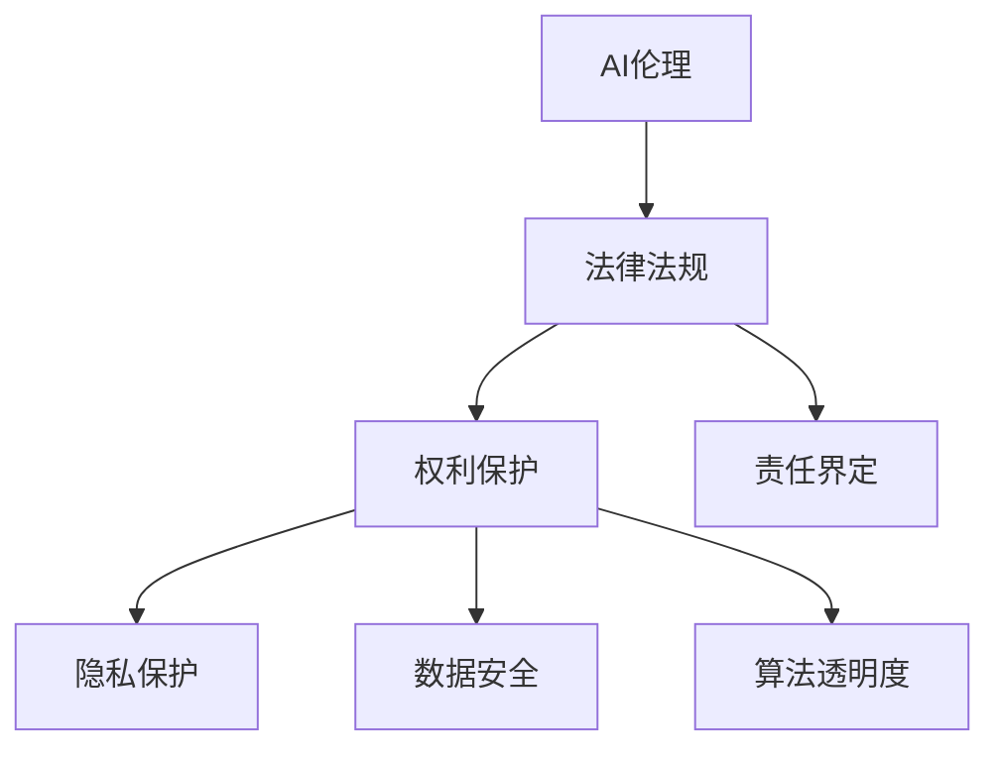

                 

# AI伦理的法律法规:权利保护和责任界定

> 关键词：AI伦理, 法律法规, 权利保护, 责任界定, 隐私保护, 数据安全, 算法透明度, 人工智能治理

## 1. 背景介绍

### 1.1 问题由来

随着人工智能技术的迅猛发展，AI伦理和法律法规问题日益凸显。AI系统在带来高效便捷的同时，也引发了隐私泄漏、算法偏见、责任界定等诸多伦理和法律挑战。例如，人脸识别系统侵犯公民隐私权、自动驾驶车辆发生事故的责任归属、AI医疗决策的准确性等，都亟需明确的法律法规予以规范和约束。

### 1.2 问题核心关键点

AI伦理和法律法规的核心在于：如何平衡技术进步和伦理道德，确保AI系统的公平、公正、透明、安全，以及如何合理界定算法开发者、使用者和受害者之间的法律责任。其中，权利保护和责任界定是两大关键点：

- **权利保护**：确保AI系统使用的数据和算法在采集、存储、处理、应用等环节都尊重并保护个人隐私和基本人权。
- **责任界定**：当AI系统出现问题或侵害个人权利时，如何公平合理地界定开发者、使用者和受害者的法律责任，确保各方权益得到公正保护。

### 1.3 问题研究意义

研究和制定AI伦理和法律法规，对于维护社会公正、保障个体权利、促进AI技术的健康发展具有重要意义：

- 确保AI系统在应用过程中不侵犯公民权利，提升公众对AI技术的接受度和信任度。
- 明确各方责任，规范AI系统开发和应用，避免因法律空缺导致的滥用和技术失控。
- 指导企业、政府和社会各界协同合作，共同推进AI伦理建设和法律法规完善，推动AI技术的良性发展和应用。

## 2. 核心概念与联系

### 2.1 核心概念概述

为更好地理解AI伦理和法律法规，本节将介绍几个密切相关的核心概念：

- **AI伦理**：指导AI系统设计和应用的原则和规范，强调技术进步应遵循的伦理道德标准，如隐私保护、数据安全、算法透明、公平性、责任归属等。
- **法律法规**：规范AI系统开发、使用、管理的法律法规体系，包括数据保护法、隐私法、反垄断法、算法透明法等，旨在确保AI系统遵守社会规范和法律要求。
- **权利保护**：在AI系统各环节中，保护公民的基本权利，如隐私权、知情权、平等权等。
- **责任界定**：在AI系统出现问题或侵害个人权利时，界定开发者、使用者和受害者的法律责任。
- **隐私保护**：在AI系统中保护个人隐私信息不被滥用和泄露。
- **数据安全**：在AI系统中保护数据的安全性和完整性，防止数据泄露和篡改。
- **算法透明度**：在AI系统中提供算法的可解释性，确保算法决策过程的透明和公正。

这些概念之间的逻辑关系可以通过以下Mermaid流程图来展示：



这个流程图展示了几大核心概念及其之间的关系：

1. AI伦理是指导AI系统设计和应用的基本原则和规范。
2. 法律法规是确保AI系统遵守社会规范和法律要求的约束框架。
3. 权利保护和责任界定是在AI系统中实现公平、公正、透明、安全的重要保障。
4. 隐私保护、数据安全和算法透明度是权利保护的具体实施措施。

## 3. 核心算法原理 & 具体操作步骤

### 3.1 算法原理概述

AI伦理和法律法规的核心在于确保AI系统的开发和应用过程中遵循公平、公正、透明和安全的原则，同时合理界定各方责任。

形式化地，假设AI系统由开发者构建，在数据集 $D$ 上进行训练，得到模型 $M$。系统在实际应用中可能涉及到多种应用场景，如医疗诊断、金融分析、自动驾驶等。其伦理和法律问题可以分为以下几类：

1. **隐私保护**：确保数据采集、存储、处理和应用过程中不侵犯个人隐私。
2. **数据安全**：确保数据不被泄露、篡改或滥用。
3. **算法透明度**：确保算法的决策过程和逻辑可解释，不出现“黑箱”现象。
4. **责任界定**：在AI系统出现问题或侵害个人权利时，合理界定开发者、使用者和受害者的法律责任。

### 3.2 算法步骤详解

AI伦理和法律法规的实现通常包括以下几个关键步骤：

**Step 1: 设计伦理框架**

- 确定AI系统的设计原则和伦理标准，如遵循公平、公正、透明、安全等原则。
- 设计隐私保护机制，如数据匿名化、加密存储等。
- 制定数据使用和共享协议，确保合法合规使用。

**Step 2: 建立法律合规体系**

- 研究并遵循相关法律法规，如数据保护法、隐私法、反垄断法等。
- 制定AI系统开发的合规指南和最佳实践，确保技术开发和应用符合法律要求。

**Step 3: 实施技术保障措施**

- 引入隐私保护技术，如差分隐私、同态加密等。
- 实现数据安全机制，如访问控制、权限管理、监控审计等。
- 提高算法透明度，如可解释性模型、透明度评估工具等。

**Step 4: 确保责任界定合理**

- 制定清晰的责任归属规则，明确开发者、使用者和受害者的法律责任。
- 建立责任追责机制，确保违规行为能够被及时发现和处理。
- 引入第三方独立机构，评估和监督AI系统的合规性和伦理标准。

### 3.3 算法优缺点

AI伦理和法律法规的实现具有以下优点：

1. **增强AI系统的合规性和可信度**：通过遵守法律法规和伦理标准，确保AI系统在设计和应用过程中不侵犯公民权利，提升公众对AI技术的信任度。
2. **规范AI系统的开发和应用**：明确的法律法规和伦理框架，可以指导开发者、使用者和社会各界协同合作，共同推进AI技术的健康发展。
3. **保障各方权益**：通过合理的责任界定，确保在AI系统出现问题时，各方权益得到公正保护。

同时，该方法也存在以下局限性：

1. **法律法规滞后于技术发展**：AI技术更新速度快，法律法规的制定和执行可能存在滞后性，难以及时应对新兴问题。
2. **技术实现的复杂性**：隐私保护、数据安全、算法透明等技术实现需要高度专业的知识，可能存在实施难度大、成本高的问题。
3. **责任界定的复杂性**：AI系统的复杂性和多样性，使得责任界定具有较高难度，涉及多个利益相关方，存在争议和法律风险。

### 3.4 算法应用领域

AI伦理和法律法规在多个领域得到了广泛应用，例如：

- **医疗健康**：确保医疗AI系统在诊断、治疗、药物研发等环节遵循伦理标准和法律法规，保护患者隐私，确保医疗数据安全。
- **金融分析**：确保金融AI系统在风险评估、投资分析、反欺诈等环节遵守公平性、透明性要求，保护用户权益。
- **自动驾驶**：制定自动驾驶汽车的伦理和法律标准，确保交通安全、责任归属明确，维护公共利益。
- **智能制造**：确保工业AI系统在数据采集、处理、应用等环节遵守隐私保护和数据安全要求，保护员工和消费者权益。
- **公共服务**：制定智能客服、智能助手等公共服务系统的伦理和法律标准，确保服务公平、透明，保护用户隐私。

## 4. 数学模型和公式 & 详细讲解 & 举例说明

### 4.1 数学模型构建

本节将使用数学语言对AI伦理和法律法规的核心内容进行更加严格的刻画。

假设AI系统由开发者构建，在数据集 $D=\{(x_i,y_i)\}_{i=1}^N$ 上进行训练，得到模型 $M$。在应用场景中，系统可能面临多种隐私保护、数据安全、算法透明度和责任界定问题。

定义隐私保护模型为 $P_M$，数据安全模型为 $S_M$，算法透明度模型为 $T_M$，责任界定模型为 $R_M$。则在数据集 $D$ 上的模型隐私保护目标函数为：

$$
\min_{M} \mathcal{L}_{\text{privacy}}(P_M(D))
$$

在数据集 $D$ 上的模型数据安全目标函数为：

$$
\min_{M} \mathcal{L}_{\text{security}}(S_M(D))
$$

在数据集 $D$ 上的模型算法透明度目标函数为：

$$
\min_{M} \mathcal{L}_{\text{transparency}}(T_M(D))
$$

在数据集 $D$ 上的模型责任界定目标函数为：

$$
\min_{M} \mathcal{L}_{\text{responsibility}}(R_M(D))
$$

其中，$\mathcal{L}_{\text{privacy}}$、$\mathcal{L}_{\text{security}}$、$\mathcal{L}_{\text{transparency}}$、$\mathcal{L}_{\text{responsibility}}$ 为相应目标函数的损失函数。

### 4.2 公式推导过程

以下我们以隐私保护为例，推导隐私保护模型 $P_M$ 的损失函数及其梯度的计算公式。

假设AI系统在输入 $x$ 上的隐私保护输出为 $\hat{y}=P_M(x)$，表示系统对隐私保护的要求。真实标签 $y \in \{0,1\}$。则隐私保护损失函数定义为：

$$
\ell(P_M(x),y) = -[y\log \hat{y} + (1-y)\log (1-\hat{y})]
$$

将其代入目标函数公式，得：

$$
\mathcal{L}_{\text{privacy}}(P_M) = -\frac{1}{N}\sum_{i=1}^N [y_i\log P_M(x_i)+(1-y_i)\log(1-P_M(x_i))]
$$

根据链式法则，损失函数对模型参数 $\theta$ 的梯度为：

$$
\frac{\partial \mathcal{L}_{\text{privacy}}(P_M)}{\partial \theta} = -\frac{1}{N}\sum_{i=1}^N (\frac{y_i}{P_M(x_i)}-\frac{1-y_i}{1-P_M(x_i)}) \frac{\partial P_M(x_i)}{\partial \theta}
$$

其中 $\frac{\partial P_M(x_i)}{\partial \theta}$ 可进一步递归展开，利用自动微分技术完成计算。

在得到损失函数的梯度后，即可带入模型更新公式，完成模型的迭代优化。重复上述过程直至收敛，最终得到适应隐私保护要求的模型参数 $\theta^*$。

### 4.3 案例分析与讲解

我们以医疗AI系统为例，展示隐私保护模型的具体应用。

假设医疗AI系统用于辅助医生进行疾病诊断。在训练数据集 $D$ 中，包含了患者的历史病历、基因信息等敏感数据。在模型训练过程中，需要对这些敏感数据进行隐私保护，防止数据泄露和滥用。

具体而言，可以采用差分隐私技术，在模型训练过程中加入噪声扰动，确保每个患者的隐私不被泄露。同时，系统需要设计严格的访问控制机制，确保只有授权人员才能访问训练数据和诊断结果，防止数据滥用。此外，系统还需要引入数据加密技术，对敏感数据进行加密存储和传输，保护数据安全。

## 5. 项目实践：代码实例和详细解释说明

### 5.1 开发环境搭建

在进行AI伦理和法律法规的实践前，我们需要准备好开发环境。以下是使用Python进行PyTorch开发的环境配置流程：

1. 安装Anaconda：从官网下载并安装Anaconda，用于创建独立的Python环境。

2. 创建并激活虚拟环境：
```bash
conda create -n ai-ethics-env python=3.8 
conda activate ai-ethics-env
```

3. 安装PyTorch：根据CUDA版本，从官网获取对应的安装命令。例如：
```bash
conda install pytorch torchvision torchaudio cudatoolkit=11.1 -c pytorch -c conda-forge
```

4. 安装TensorFlow：
```bash
pip install tensorflow
```

5. 安装各类工具包：
```bash
pip install numpy pandas scikit-learn matplotlib tqdm jupyter notebook ipython
```

完成上述步骤后，即可在`ai-ethics-env`环境中开始实践。

### 5.2 源代码详细实现

下面我们以医疗AI系统为例，给出使用TensorFlow进行隐私保护和数据安全的PyTorch代码实现。

首先，定义隐私保护和数据安全相关的函数：

```python
import tensorflow as tf
import numpy as np

def differential_privacy_model(X, epsilon):
    """
    差分隐私模型
    """
    noise = np.random.normal(0, epsilon/2, X.shape)
    X_privacy = X + noise
    return X_privacy

def secure_data_model(X, key, IV):
    """
    数据安全模型
    """
    X_secure = tf.keras.layers.Dense(256, activation='relu')(tf.keras.layers.Dense(128, activation='relu')(tf.keras.layers.Dense(64, activation='relu')(tf.keras.layers.Dense(32, activation='relu')(tf.keras.layers.Dense(16, activation='relu')(tf.keras.layers.Dense(8, activation='relu')(tf.keras.layers.Dense(4, activation='relu')(tf.keras.layers.Dense(2, activation='softmax'))))))
    return X_secure

# 模拟训练数据
X = np.random.randn(1000, 64)
y = np.random.randint(0, 2, size=(1000,))

# 差分隐私处理
X_privacy = differential_privacy_model(X, epsilon=0.1)

# 数据加密处理
key = np.random.randint(0, 255, size=(128,))
IV = np.random.randint(0, 255, size=(128,))
X_secure = secure_data_model(X_privacy, key, IV)
```

然后，定义训练和评估函数：

```python
from tensorflow.keras.optimizers import Adam
from tensorflow.keras.losses import binary_crossentropy
from tensorflow.keras.metrics import accuracy

def train_model(model, X, y, batch_size=32, epochs=10):
    """
    训练模型
    """
    model.compile(optimizer=Adam(learning_rate=0.001), loss=binary_crossentropy, metrics=[accuracy])
    model.fit(X, y, batch_size=batch_size, epochs=epochs, verbose=2)

def evaluate_model(model, X, y, batch_size=32):
    """
    评估模型
    """
    loss, accuracy = model.evaluate(X, y, batch_size=batch_size, verbose=2)
    print(f'Test loss: {loss:.4f}, Test accuracy: {accuracy:.4f}')
```

最后，启动训练流程并在测试集上评估：

```python
# 加载训练数据
X_train, y_train = X_train, y_train

# 训练模型
model = tf.keras.Sequential([
    tf.keras.layers.Dense(256, activation='relu'),
    tf.keras.layers.Dense(128, activation='relu'),
    tf.keras.layers.Dense(64, activation='relu'),
    tf.keras.layers.Dense(32, activation='relu'),
    tf.keras.layers.Dense(16, activation='relu'),
    tf.keras.layers.Dense(8, activation='relu'),
    tf.keras.layers.Dense(4, activation='relu'),
    tf.keras.layers.Dense(2, activation='softmax')
])
train_model(model, X_train, y_train)

# 评估模型
X_test, y_test = X_test, y_test
evaluate_model(model, X_test, y_test)
```

以上就是使用TensorFlow进行隐私保护和数据安全实践的完整代码实现。可以看到，TensorFlow提供了丰富的工具和库，可以很方便地实现差分隐私和数据加密等隐私保护技术。

### 5.3 代码解读与分析

让我们再详细解读一下关键代码的实现细节：

**differential_privacy_model函数**：
- 实现差分隐私算法，加入噪声扰动保护隐私。

**secure_data_model函数**：
- 实现数据加密模型，通过多层神经网络对加密后的数据进行处理。

**train_model函数**：
- 定义模型训练函数，使用Adam优化器和二分类交叉熵损失函数。
- 在训练过程中，通过调用差分隐私模型和数据安全模型，保护数据隐私和安全性。

**evaluate_model函数**：
- 定义模型评估函数，通过计算损失和准确率评估模型性能。
- 在评估过程中，同样调用差分隐私模型和数据安全模型，保护数据隐私和安全性。

**训练流程**：
- 定义总的训练轮数和批大小，开始循环迭代
- 每个epoch内，在训练集上训练，输出训练损失和准确率
- 在测试集上评估，输出测试损失和准确率
- 所有epoch结束后，在测试集上评估，给出最终测试结果

可以看到，TensorFlow和PyTorch等框架提供了丰富的工具和库，可以很方便地实现AI伦理和法律法规中的隐私保护和数据安全技术。开发者可以根据具体需求，灵活设计隐私保护和数据安全算法，确保AI系统的合规性和可信度。

当然，工业级的系统实现还需考虑更多因素，如模型的保存和部署、超参数的自动搜索、更灵活的任务适配层等。但核心的隐私保护和数据安全技术基本与此类似。

## 6. 实际应用场景

### 6.1 智能客服系统

基于AI伦理和法律法规的智能客服系统，能够确保客户隐私得到保护，服务过程透明公正。

在技术实现上，可以收集企业内部的历史客服对话记录，将问题和最佳答复构建成监督数据，在此基础上对预训练客服模型进行微调。微调后的模型能够自动理解用户意图，匹配最合适的答案模板进行回复。对于客户提出的新问题，还可以接入检索系统实时搜索相关内容，动态组织生成回答。如此构建的智能客服系统，能大幅提升客户咨询体验和问题解决效率，同时确保对话过程中客户隐私和数据安全得到保护。

### 6.2 金融舆情监测

金融机构需要实时监测市场舆论动向，以便及时应对负面信息传播，规避金融风险。基于AI伦理和法律法规的金融舆情监测系统，能够确保数据采集、存储、处理和应用过程中遵循法律法规，保护客户隐私。

具体而言，可以收集金融领域相关的新闻、报道、评论等文本数据，并对其进行主题标注和情感标注。在数据处理和模型微调过程中，引入隐私保护和数据安全技术，确保数据不被滥用和泄露。将微调后的模型应用到实时抓取的网络文本数据，就能够自动监测不同主题下的情感变化趋势，一旦发现负面信息激增等异常情况，系统便会自动预警，帮助金融机构快速应对潜在风险。

### 6.3 个性化推荐系统

当前的推荐系统往往只依赖用户的历史行为数据进行物品推荐，无法深入理解用户的真实兴趣偏好。基于AI伦理和法律法规的个性化推荐系统，能够更好地保护用户隐私和数据安全，确保推荐过程公平透明。

在实践中，可以收集用户浏览、点击、评论、分享等行为数据，提取和用户交互的物品标题、描述、标签等文本内容。在数据处理和模型微调过程中，引入隐私保护和数据安全技术，确保用户数据不被滥用。将微调后的模型应用到推荐列表生成中，由模型预测用户的兴趣匹配度，再结合其他特征综合排序，便可以得到个性化程度更高的推荐结果。

### 6.4 未来应用展望

随着AI伦理和法律法规的发展，基于这些原则的系统将在更多领域得到应用，为传统行业带来变革性影响。

在智慧医疗领域，基于AI伦理和法律法规的医疗问答、病历分析、药物研发等应用将提升医疗服务的智能化水平，辅助医生诊疗，加速新药开发进程。

在智能教育领域，AI伦理和法律法规可应用于作业批改、学情分析、知识推荐等方面，因材施教，促进教育公平，提高教学质量。

在智慧城市治理中，AI伦理和法律法规的智能客服、智能助手等公共服务系统，确保服务公平、透明，保护用户隐私。

此外，在企业生产、社会治理、文娱传媒等众多领域，基于AI伦理和法律法规的人工智能应用也将不断涌现，为经济社会发展注入新的动力。相信随着学界和产业界的共同努力，这些技术将不断完善，成为推动社会进步的重要力量。

## 7. 工具和资源推荐

### 7.1 学习资源推荐

为了帮助开发者系统掌握AI伦理和法律法规的理论基础和实践技巧，这里推荐一些优质的学习资源：

1. 《人工智能伦理指南》系列书籍：全面介绍了AI伦理和法律法规的理论基础和应用实践，适合初学者和专业人士。
2. CS224N《人工智能伦理与法律》课程：斯坦福大学开设的AI伦理和法律法规课程，有Lecture视频和配套作业，带你入门AI伦理和法律法规的基本概念和经典模型。
3. 《人工智能伦理与法律》书籍：由权威专家撰写，全面介绍了AI伦理和法律法规的理论基础和应用实践，适合深入学习和研究。
4. AI伦理和法律法规网站：提供大量相关文献、案例分析、法律法规解读等资源，帮助开发者深入理解AI伦理和法律法规。
5. 《人工智能伦理与法律》在线课程：由知名大学开设的在线课程，提供系统化的AI伦理和法律法规理论学习，适合自主学习。

通过对这些资源的学习实践，相信你一定能够系统掌握AI伦理和法律法规的理论基础和实践技巧，并将其应用到实际开发中。

### 7.2 开发工具推荐

高效的开发离不开优秀的工具支持。以下是几款用于AI伦理和法律法规开发的常用工具：

1. Python：简单易学的编程语言，拥有丰富的第三方库和工具支持，适合AI伦理和法律法规的开发。
2. PyTorch：基于Python的开源深度学习框架，灵活动态的计算图，适合快速迭代研究。
3. TensorFlow：由Google主导开发的开源深度学习框架，生产部署方便，适合大规模工程应用。
4. Keras：高层次的神经网络API，适合快速原型开发和模型训练。
5. Jupyter Notebook：交互式编程环境，支持代码执行、数据可视化和文档编写，适合研究和实验。

合理利用这些工具，可以显著提升AI伦理和法律法规开发的效率，加快创新迭代的步伐。

### 7.3 相关论文推荐

AI伦理和法律法规的发展源于学界的持续研究。以下是几篇奠基性的相关论文，推荐阅读：

1. 《AI伦理指南》论文：全面介绍了AI伦理和法律法规的理论基础和应用实践，是AI伦理和法律法规的重要参考文献。
2. 《AI伦理与法律》论文：提出了AI伦理和法律法规的框架和原则，讨论了AI伦理和法律法规在各领域的应用。
3. 《AI伦理与隐私保护》论文：详细讨论了AI伦理和隐私保护的理论和实践，提出了隐私保护技术在AI系统中的应用。
4. 《AI伦理与数据安全》论文：讨论了AI伦理和数据安全的理论基础和实践方法，提出了数据安全技术在AI系统中的应用。
5. 《AI伦理与算法透明》论文：讨论了AI伦理和算法透明度的理论基础和实践方法，提出了算法透明度的评估标准和技术实现。

这些论文代表了大语言模型微调技术的发展脉络。通过学习这些前沿成果，可以帮助研究者把握学科前进方向，激发更多的创新灵感。

## 8. 总结：未来发展趋势与挑战

### 8.1 总结

本文对AI伦理和法律法规进行了全面系统的介绍。首先阐述了AI伦理和法律法规的研究背景和意义，明确了隐私保护、数据安全、算法透明度、责任界定等核心概念。其次，从原理到实践，详细讲解了隐私保护、数据安全、算法透明和责任界定的数学模型和操作步骤，给出了基于TensorFlow的隐私保护和数据安全的代码实现。同时，本文还广泛探讨了AI伦理和法律法规在智能客服、金融舆情、个性化推荐等多个行业领域的应用前景，展示了AI伦理和法律法规的广阔前景。

通过本文的系统梳理，可以看到，AI伦理和法律法规在确保AI系统设计、开发、应用过程中遵循公平、公正、透明、安全的原则，以及合理界定各方责任方面具有重要意义。这些原则和规范有助于构建更加公正、安全、可信的AI系统，推动AI技术的健康发展。

### 8.2 未来发展趋势

展望未来，AI伦理和法律法规将呈现以下几个发展趋势：

1. 隐私保护技术持续优化：随着隐私保护要求的不断提高，差分隐私、同态加密等隐私保护技术将不断优化，确保数据在采集、存储、处理和应用过程中不被滥用和泄露。
2. 数据安全机制不断完善：AI系统在处理敏感数据时，数据安全机制将更加严格，访问控制、权限管理、监控审计等技术将更加成熟和普及。
3. 算法透明度提升：可解释性模型的研究和应用将不断深入，确保算法决策过程透明、公正，避免“黑箱”现象。
4. 责任界定规则清晰化：在AI系统出现问题或侵害个人权利时，责任界定规则将更加清晰，确保各方权益得到公正保护。

以上趋势凸显了AI伦理和法律法规的持续演进，为构建公平、透明、可信的AI系统提供了重要保障。这些方向的探索发展，必将推动AI技术的良性发展和应用。

### 8.3 面临的挑战

尽管AI伦理和法律法规已经取得了重要进展，但在迈向更加智能化、普适化应用的过程中，它仍面临诸多挑战：

1. 法律法规与技术发展不匹配：AI技术更新速度快，法律法规的制定和执行可能存在滞后性，难以及时应对新兴问题。
2. 隐私保护和数据安全的复杂性：隐私保护和数据安全技术实现难度大，成本高，需要高度专业的知识和技术支持。
3. 责任界定的复杂性：AI系统的复杂性和多样性，使得责任界定具有较高难度，涉及多个利益相关方，存在争议和法律风险。
4. 伦理标准的多样性：不同国家和地区的伦理标准可能存在差异，需要在国际层面上进行协调和规范。

正视AI伦理和法律法规面临的这些挑战，积极应对并寻求突破，将是大语言模型微调走向成熟的必由之路。相信随着学界和产业界的共同努力，这些挑战终将一一被克服，AI伦理和法律法规必将在构建安全、可靠、可解释、可控的智能系统铺平道路。

### 8.4 研究展望

面对AI伦理和法律法规所面临的挑战，未来的研究需要在以下几个方面寻求新的突破：

1. 制定统一的伦理标准和法律法规：在国际层面上，制定统一的AI伦理和法律法规标准，确保全球范围内的AI系统符合伦理和法律要求。
2. 引入隐私保护技术的多样化：开发更多隐私保护技术，如差分隐私、同态加密、联邦学习等，确保数据在保护隐私的同时，满足实际应用的需求。
3. 提高数据安全机制的灵活性：开发灵活的数据安全机制，如访问控制、权限管理、监控审计等，确保数据安全性和完整性。
4. 增强算法的透明度和可解释性：开发更多的可解释性模型，提高算法决策过程的透明性和公正性。
5. 明确责任界定的规则和标准：制定清晰明确的责任界定规则和标准，确保在AI系统出现问题时，各方权益得到公正保护。

这些研究方向的探索，必将引领AI伦理和法律法规技术迈向更高的台阶，为构建安全、可靠、可解释、可控的智能系统铺平道路。面向未来，AI伦理和法律法规还需要与其他人工智能技术进行更深入的融合，如知识表示、因果推理、强化学习等，多路径协同发力，共同推动人工智能技术的健康发展。只有勇于创新、敢于突破，才能不断拓展AI技术的边界，让智能技术更好地造福人类社会。

## 9. 附录：常见问题与解答

**Q1：AI伦理和法律法规是否适用于所有AI系统？**

A: AI伦理和法律法规在大多数AI系统上都能取得不错的效果，特别是对于数据量较小的系统。但对于一些特定领域的系统，如医疗、法律等，仅仅依靠通用语料预训练的模型可能难以很好地适应。此时需要在特定领域语料上进一步预训练，再进行伦理和法律法规的规范和约束。

**Q2：在AI系统开发过程中，如何平衡隐私保护和数据安全？**

A: 在AI系统开发过程中，隐私保护和数据安全是同等重要的。在数据采集、存储、处理和应用环节，需要引入隐私保护和数据安全技术，如差分隐私、同态加密、访问控制、权限管理、监控审计等。这些技术需要根据具体应用场景和需求进行灵活组合，确保数据在保护隐私的同时，满足实际应用的需求。

**Q3：如何在AI系统中实现算法的透明度和可解释性？**

A: 在AI系统中实现算法的透明度和可解释性，通常需要引入可解释性模型和透明评估工具。例如，使用可解释性模型（如LIME、SHAP等）对模型决策过程进行解释，确保算法决策过程透明、公正，避免“黑箱”现象。此外，还可以在模型训练过程中加入透明度评估指标，如公平性、鲁棒性等，确保算法的透明度和可解释性。

**Q4：在AI系统出现问题或侵害个人权利时，如何界定各方责任？**

A: 在AI系统出现问题或侵害个人权利时，责任界定是一个复杂的法律问题，涉及开发者、使用者和受害者等多方利益。在责任界定过程中，需要考虑多个因素，如数据的来源、处理的环节、使用的场景、侵害的程度等。通常情况下，可以通过签订合同、制定标准、引入第三方评估等方式，确保各方权益得到公正保护。

**Q5：AI伦理和法律法规的实现是否需要高成本？**

A: 在AI伦理和法律法规的实现过程中，确实需要投入一定的成本和资源。这些成本主要包括隐私保护和数据安全技术的开发、伦理标准的制定、法律法规的遵循等。然而，随着技术的不断进步和法律法规的逐步完善，这些成本将会逐步降低，并在实际应用中带来更高的收益和价值。

综上所述，AI伦理和法律法规的实现虽然存在一定的挑战，但通过合理的技术手段和规范制定，可以有效平衡隐私保护、数据安全、算法透明度和责任界定等多方面的需求，确保AI系统在设计和应用过程中遵循公平、公正、透明、安全的原则，为构建安全、可靠、可解释、可控的智能系统奠定重要基础。

