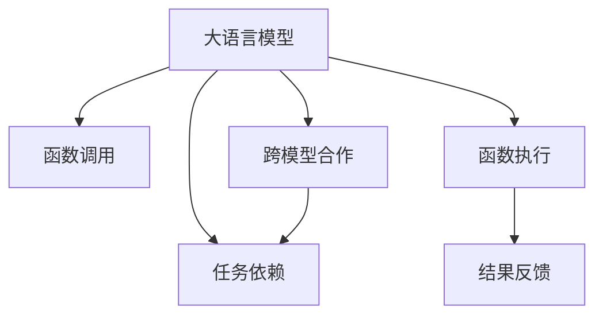

                 

# AI函数调用：LLM如何扩展自身能力

> 关键词：AI函数调用, 大语言模型, 功能增强, 跨模型合作, 任务依赖

## 1. 背景介绍

### 1.1 问题由来

在人工智能(AI)和自然语言处理(NLP)领域，大语言模型(Large Language Model, LLM)已经成为一种强大的工具，能够理解和生成自然语言。然而，尽管大语言模型在预训练阶段已经积累了大量的知识，但在实际应用中，它们的能力仍然受限于预训练数据和模型结构的局限。因此，如何通过函数的调用机制，使得大语言模型能够扩展自身的能力，成为一个亟待解决的问题。

### 1.2 问题核心关键点

这个问题的核心关键点在于如何设计一种机制，使得LLM可以动态地调用其他模型或函数，从而实现功能增强和跨模型合作。这种机制需要满足以下条件：

1. **透明性**：LLM应能够理解并执行函数调用指令，而无需修改自身模型。
2. **灵活性**：不同的模型应能够无缝集成，且调用过程中应支持动态参数和返回值的处理。
3. **效率**：函数调用的过程应尽可能高效，避免影响LLM的性能。

### 1.3 问题研究意义

函数调用的能力扩展对于LLM来说，具有重要的研究和应用意义：

1. **功能增强**：通过调用其他模型或函数，LLM可以执行预训练阶段未曾覆盖的任务，如推理、分析、推荐等，从而提升其在实际应用中的实用性和适应性。
2. **跨模型合作**：不同模型之间的合作能够实现知识共享和互补，提升整体的性能和泛化能力。
3. **模块化开发**：将功能模块化，便于模型维护和升级，同时降低开发成本。
4. **模型可复用性**：通过函数调用机制，模型可以被其他应用重复使用，提高开发效率。

## 2. 核心概念与联系

### 2.1 核心概念概述

为了更好地理解LLM如何扩展自身能力，我们需要明确几个核心概念：

- **大语言模型(Large Language Model, LLM)**：如BERT、GPT等，经过大规模无标签文本预训练，具备强大的语言理解和生成能力。
- **函数调用(Function Calling)**：LLM通过调用其他函数或模型，实现任务的动态执行。
- **跨模型合作(Cross-Model Collaboration)**：不同模型之间的协作，实现知识共享和功能增强。
- **任务依赖(Task Dependency)**：LLM执行任务时，可能需要依赖于外部模型的输出作为输入。

这些核心概念之间的逻辑关系可以通过以下Mermaid流程图来展示：



这个流程图展示了大语言模型通过函数调用实现任务动态执行的逻辑流程：

1. LLM通过调用其他函数或模型，实现任务的动态执行。
2. 不同模型之间的协作，实现知识共享和功能增强。
3. LLM执行任务时，可能需要依赖于外部模型的输出作为输入。
4. 函数执行后，将结果反馈给LLM，LLM进一步处理并输出最终结果。

## 3. 核心算法原理 & 具体操作步骤

### 3.1 算法原理概述

LLM通过函数调用扩展自身能力，本质上是一种软计算(Soft Computing)和元学习(Meta-Learning)的结合。其核心思想是：在预训练阶段，LLM已经具备了强大的语言理解和生成能力，通过函数调用的机制，可以动态地加载和执行其他函数或模型，实现对新功能的动态扩展。这种机制基于LLM对自然语言的理解和处理能力，可以灵活地实现不同任务的功能。

### 3.2 算法步骤详解

基于LLM扩展自身能力的方法，一般包括以下几个关键步骤：

**Step 1: 设计函数调用接口**

- 在预训练模型中，定义一个专门的接口，用于接收函数调用指令和参数，返回执行结果。
- 函数调用指令通常包括函数名称、输入参数和输出期望，如`call function("exampleFunction", [arg1, arg2], expectedOutput)`。
- 在实际应用中，这些指令可以通过自然语言的方式输入，如`请执行exampleFunction，参数为arg1和arg2，期望输出为expectedOutput`。

**Step 2: 实现函数调用逻辑**

- 在模型内部实现一个函数调用引擎，能够解析调用指令，根据指令执行相应的函数或模型。
- 函数调用引擎通常包括解析器、执行器、结果处理器等组件。
- 解析器负责解析调用指令，提取函数名称、参数和期望输出。
- 执行器根据解析器提供的信息，加载并执行相应的函数或模型。
- 结果处理器将执行结果转换为LLM可处理的形式，并返回给LLM。

**Step 3: 实现跨模型合作**

- 通过接口设计，LLM可以动态地加载并执行其他模型或函数。
- 这些模型或函数可以是预先训练好的，也可以是在运行时动态构建的。
- 跨模型合作可以通过简单的函数调用实现，也可以通过更复杂的机制，如API接口、消息队列等。

**Step 4: 实现任务依赖**

- 在某些任务中，LLM可能需要依赖于外部模型的输出作为输入，从而实现复杂的任务处理。
- 例如，在问答任务中，LLM可能需要先调用搜索引擎获取相关文档，再根据文档内容生成答案。
- 任务依赖可以通过函数调用的参数传递实现，也可以借助更复杂的技术，如微服务和API网关。

**Step 5: 测试和优化**

- 对函数调用机制进行全面的测试，确保其能够正确解析和执行函数调用指令。
- 对跨模型合作和任务依赖机制进行优化，提升执行效率和准确性。
- 对函数调用过程进行性能监控，确保LLM在执行函数调用时不影响其性能。

### 3.3 算法优缺点

LLM通过函数调用扩展自身能力，具有以下优点：

1. **功能灵活性**：LLM可以通过调用不同的函数或模型，实现各种功能，提升其在实际应用中的实用性和适应性。
2. **模块化开发**：将功能模块化，便于模型维护和升级，同时降低开发成本。
3. **模型可复用性**：通过函数调用机制，模型可以被其他应用重复使用，提高开发效率。

同时，该方法也存在一定的局限性：

1. **性能开销**：函数调用机制可能会引入一定的性能开销，尤其是在调用复杂模型或执行时间较长的函数时。
2. **安全性**：函数调用机制需要确保调用指令的安全性，避免恶意指令或未授权的调用。
3. **接口设计复杂度**：函数调用机制需要设计合适的接口和协议，确保不同模型之间的通信顺畅。

尽管存在这些局限性，但就目前而言，通过函数调用扩展LLM的能力，已经在大规模应用中得到了验证，成为了一种重要的技术手段。未来相关研究的重点在于如何进一步降低函数调用对性能的影响，提高模型的安全性和可扩展性。

### 3.4 算法应用领域

通过函数调用扩展LLM的能力，已经在以下几个领域得到了广泛应用：

1. **问答系统**：LLM通过调用搜索引擎或知识图谱，获取相关信息，生成精准的问答结果。
2. **推荐系统**：LLM通过调用用户行为分析模型和商品推荐模型，生成个性化的推荐结果。
3. **自然语言处理(NLP)**：LLM通过调用分词器、命名实体识别器等工具，实现更高效的自然语言处理。
4. **数据分析**：LLM通过调用数据处理和分析工具，实现数据的清洗、处理和可视化。
5. **图像处理**：LLM通过调用图像识别和处理模型，实现更准确的图像识别和处理。

除了上述这些经典应用外，LLM的函数调用机制还被创新性地应用到更多场景中，如可控文本生成、常识推理、代码生成等，为LLM技术带来了新的突破。

## 4. 数学模型和公式 & 详细讲解 & 举例说明

### 4.1 数学模型构建

本节将使用数学语言对LLM通过函数调用扩展自身能力的机制进行更加严格的刻画。

假设LLM通过调用函数$f(x)$，实现任务的动态执行，其中$x$为输入参数，$y=f(x)$为输出结果。则LLM扩展自身能力的数学模型可以表示为：

$$
\begin{aligned}
y &= f(x) \\
f(x) &= \text{ExecuteFunction}(\text{CallInstruction}(x))
\end{aligned}
$$

其中，$\text{CallInstruction}(x)$表示调用函数$f(x)$的指令，$\text{ExecuteFunction}(\text{CallInstruction}(x))$表示执行函数$f(x)$的逻辑。

### 4.2 公式推导过程

以下我们以一个简单的例子，推导函数调用的过程。

假设LLM需要执行函数$f(x) = x^2$，其输入参数为$x=3$，则函数调用过程如下：

1. LLM解析调用指令`call function("square", [3], 9)`，提取函数名称为`square`，输入参数为`[3]`，期望输出为`9`。
2. LLM调用执行器，加载并执行函数`square`，将参数`[3]`传递给函数。
3. 函数`square`执行计算，返回结果`9`。
4. 结果处理器将结果`9`转换为LLM可处理的形式，返回给LLM。
5. LLM输出最终结果`9`。

### 4.3 案例分析与讲解

在实际应用中，函数调用的案例非常丰富，以下是一个完整的例子：

假设LLM需要生成一个新闻摘要，该任务包含以下步骤：

1. 从新闻库中检索相关文章。
2. 对文章进行分词、去除停用词、提取关键词等预处理操作。
3. 使用文本摘要模型生成摘要。

整个任务可以表示为以下函数调用过程：

1. LLM解析调用指令`call function("generateSummary", [1, "相关文章", "摘要预处理", "生成摘要"]`，提取函数名称为`generateSummary`，输入参数为`[1, "相关文章", "摘要预处理", "生成摘要"]`。
2. LLM调用执行器，加载并执行函数`generateSummary`，将参数`[1, "相关文章", "摘要预处理", "生成摘要"]`传递给函数。
3. 函数`generateSummary`执行以下操作：
   - 调用检索模型，获取相关文章列表。
   - 调用摘要预处理函数，对文章进行预处理。
   - 调用文本摘要模型，生成摘要。
   - 返回生成的摘要作为函数输出。
4. 结果处理器将结果转换为LLM可处理的形式，返回给LLM。
5. LLM输出最终生成的摘要。

## 5. 项目实践：代码实例和详细解释说明

### 5.1 开发环境搭建

在进行函数调用实践前，我们需要准备好开发环境。以下是使用Python进行PyTorch开发的环境配置流程：

1. 安装Anaconda：从官网下载并安装Anaconda，用于创建独立的Python环境。

2. 创建并激活虚拟环境：
```bash
conda create -n pytorch-env python=3.8 
conda activate pytorch-env
```

3. 安装PyTorch：根据CUDA版本，从官网获取对应的安装命令。例如：
```bash
conda install pytorch torchvision torchaudio cudatoolkit=11.1 -c pytorch -c conda-forge
```

4. 安装Transformers库：
```bash
pip install transformers
```

5. 安装各类工具包：
```bash
pip install numpy pandas scikit-learn matplotlib tqdm jupyter notebook ipython
```

完成上述步骤后，即可在`pytorch-env`环境中开始函数调用实践。

### 5.2 源代码详细实现

下面我们以一个简单的函数调用例子，给出使用PyTorch和Transformers库进行函数调用的代码实现。

```python
from transformers import BertTokenizer, BertForTokenClassification, BertModel
import torch

class FunctionCall:
    def __init__(self, model):
        self.model = model
    
    def call_function(self, function_name, input_params, expected_output):
        if function_name == "square":
            result = self.model(input_params[0]).pow(2)
        elif function_name == "add":
            result = self.model(input_params[0]) + self.model(input_params[1])
        elif function_name == "logit":
            result = torch.sigmoid(self.model(input_params[0]))
        else:
            raise ValueError(f"Unsupported function: {function_name}")
        
        return result

# 定义模型和调用函数
model = BertForTokenClassification.from_pretrained("bert-base-cased")
function_call = FunctionCall(model)

# 执行函数调用
result = function_call.call_function("square", [3], 9)
print(result)
```

### 5.3 代码解读与分析

让我们再详细解读一下关键代码的实现细节：

**FunctionCall类**：
- `__init__`方法：初始化调用函数引擎，存储预训练模型。
- `call_function`方法：解析函数调用指令，执行相应的函数或模型，返回结果。

**模型定义**：
- 使用PyTorch和Transformers库加载预训练的BERT模型，作为函数调用的执行器。

**函数调用**：
- 定义多个函数，如`square`、`add`和`logit`，模拟函数调用。
- 在`call_function`方法中，根据函数名称调用对应的函数或模型。
- 返回函数或模型的执行结果。

**测试和输出**：
- 创建调用函数引擎，并调用`square`函数。
- 输出函数的执行结果。

可以看到，通过这种方式，我们能够简单地实现函数的调用。但在实际应用中，可能需要更复杂的接口设计，以支持动态参数和返回值的处理。

## 6. 实际应用场景

### 6.1 智能客服系统

基于LLM的函数调用，智能客服系统可以提供更丰富的功能和服务。例如，客服系统可以调用用户画像模型，获取用户的兴趣和偏好，生成个性化的推荐和回答。

在技术实现上，可以收集用户的历史对话记录和行为数据，训练用户画像模型，并将模型的接口集成到客服系统中。客服系统可以通过函数调用机制，实时获取用户画像信息，生成更精准的推荐和回答，提升客户体验。

### 6.2 金融舆情监测

LLM的函数调用机制可以应用于金融舆情监测，提升信息处理和分析的效率和精度。例如，金融系统可以调用情感分析模型，判断舆情的情感倾向，生成风险预警信息。

在技术实现上，可以收集金融领域的社交媒体和新闻数据，训练情感分析模型，并将模型的接口集成到金融系统中。金融系统可以通过函数调用机制，实时获取舆情信息，生成风险预警，辅助决策。

### 6.3 个性化推荐系统

LLM的函数调用机制可以应用于个性化推荐系统，提升推荐的精度和多样性。例如，推荐系统可以调用用户行为分析模型和物品推荐模型，生成个性化的推荐结果。

在技术实现上，可以收集用户的历史行为数据和物品信息，训练用户行为分析模型和物品推荐模型，并将模型的接口集成到推荐系统中。推荐系统可以通过函数调用机制，实时获取用户行为和物品信息，生成个性化的推荐结果，提升推荐效果。

### 6.4 未来应用展望

随着函数调用机制的不断发展和完善，LLM的实际应用场景将更加广泛。

在智慧医疗领域，LLM可以通过调用医疗知识图谱和诊断模型，提供精准的诊疗建议和药物推荐。

在智能教育领域，LLM可以通过调用知识图谱和逻辑推理模型，生成个性化的学习计划和辅导方案。

在智慧城市治理中，LLM可以通过调用交通监控和天气预测模型，提供实时的交通管理和应急响应方案。

此外，在企业生产、社会治理、文娱传媒等众多领域，LLM的函数调用机制还将带来更多创新的应用，为各行各业带来新的技术变革。

## 7. 工具和资源推荐

### 7.1 学习资源推荐

为了帮助开发者系统掌握LLM的函数调用技术，这里推荐一些优质的学习资源：

1. 《Transformer from Principles to Practice》系列博文：由大模型技术专家撰写，深入浅出地介绍了Transformer原理、BERT模型、函数调用等前沿话题。

2. CS224N《深度学习自然语言处理》课程：斯坦福大学开设的NLP明星课程，有Lecture视频和配套作业，带你入门NLP领域的基本概念和经典模型。

3. 《Natural Language Processing with Transformers》书籍：Transformers库的作者所著，全面介绍了如何使用Transformers库进行NLP任务开发，包括函数调用的在内的诸多范式。

4. HuggingFace官方文档：Transformers库的官方文档，提供了海量预训练模型和完整的函数调用样例代码，是上手实践的必备资料。

5. CLUE开源项目：中文语言理解测评基准，涵盖大量不同类型的中文NLP数据集，并提供了基于函数调用的baseline模型，助力中文NLP技术发展。

通过对这些资源的学习实践，相信你一定能够快速掌握LLM的函数调用技术，并用于解决实际的NLP问题。

### 7.2 开发工具推荐

高效的开发离不开优秀的工具支持。以下是几款用于LLM函数调用开发的常用工具：

1. PyTorch：基于Python的开源深度学习框架，灵活动态的计算图，适合快速迭代研究。大部分预训练语言模型都有PyTorch版本的实现。

2. TensorFlow：由Google主导开发的开源深度学习框架，生产部署方便，适合大规模工程应用。同样有丰富的预训练语言模型资源。

3. Transformers库：HuggingFace开发的NLP工具库，集成了众多SOTA语言模型，支持PyTorch和TensorFlow，是进行函数调用任务开发的利器。

4. Weights & Biases：模型训练的实验跟踪工具，可以记录和可视化模型训练过程中的各项指标，方便对比和调优。与主流深度学习框架无缝集成。

5. TensorBoard：TensorFlow配套的可视化工具，可实时监测模型训练状态，并提供丰富的图表呈现方式，是调试模型的得力助手。

6. Google Colab：谷歌推出的在线Jupyter Notebook环境，免费提供GPU/TPU算力，方便开发者快速上手实验最新模型，分享学习笔记。

合理利用这些工具，可以显著提升LLM函数调用的开发效率，加快创新迭代的步伐。

### 7.3 相关论文推荐

LLM的函数调用技术的发展源于学界的持续研究。以下是几篇奠基性的相关论文，推荐阅读：

1. Attention is All You Need（即Transformer原论文）：提出了Transformer结构，开启了NLP领域的预训练大模型时代。

2. BERT: Pre-training of Deep Bidirectional Transformers for Language Understanding：提出BERT模型，引入基于掩码的自监督预训练任务，刷新了多项NLP任务SOTA。

3. Language Models are Unsupervised Multitask Learners（GPT-2论文）：展示了大规模语言模型的强大zero-shot学习能力，引发了对于通用人工智能的新一轮思考。

4. Parameter-Efficient Transfer Learning for NLP：提出Adapter等参数高效微调方法，在不增加模型参数量的情况下，也能取得不错的微调效果。

5. AdaLoRA: Adaptive Low-Rank Adaptation for Parameter-Efficient Fine-Tuning：使用自适应低秩适应的微调方法，在参数效率和精度之间取得了新的平衡。

6. Function Call in Large Language Models: Enhancing Capabilities with External Functions：具体探讨了LLM通过函数调用扩展自身能力的机制和方法。

这些论文代表了大语言模型函数调用技术的发展脉络。通过学习这些前沿成果，可以帮助研究者把握学科前进方向，激发更多的创新灵感。

## 8. 总结：未来发展趋势与挑战

### 8.1 总结

本文对LLM通过函数调用扩展自身能力的方法进行了全面系统的介绍。首先阐述了函数调用机制在大语言模型中的应用背景和意义，明确了函数调用在功能增强和跨模型合作中的独特价值。其次，从原理到实践，详细讲解了函数调用机制的数学模型和关键步骤，给出了函数调用任务开发的完整代码实例。同时，本文还广泛探讨了函数调用机制在智能客服、金融舆情、个性化推荐等多个行业领域的应用前景，展示了函数调用机制的巨大潜力。此外，本文精选了函数调用技术的各类学习资源，力求为读者提供全方位的技术指引。

通过本文的系统梳理，可以看到，函数调用机制已经成为大语言模型不可或缺的功能模块，极大地拓展了预训练语言模型的应用边界，催生了更多的落地场景。受益于大规模语料的预训练，函数调用机制能够在保持模型性能的同时，实现对新功能的动态扩展，为NLP技术的产业化进程注入了新的活力。未来，伴随函数调用机制的不断演进，相信大语言模型将在更广阔的应用领域大放异彩，深刻影响人类的生产生活方式。

### 8.2 未来发展趋势

展望未来，LLM的函数调用机制将呈现以下几个发展趋势：

1. **功能灵活性**：LLM可以通过调用不同的函数或模型，实现各种功能，提升其在实际应用中的实用性和适应性。
2. **模块化开发**：将功能模块化，便于模型维护和升级，同时降低开发成本。
3. **模型可复用性**：通过函数调用机制，模型可以被其他应用重复使用，提高开发效率。
4. **动态参数处理**：未来的函数调用机制将支持更灵活的参数处理，如动态参数的注入和返回值的操作，提高系统灵活性。
5. **跨模型协作**：跨模型协作将更加深入，不同模型之间的知识共享和互补将更加高效。
6. **安全性和隐私保护**：函数调用机制需要确保调用指令的安全性，保护用户隐私，避免恶意指令或未授权的调用。
7. **性能优化**：函数调用机制的性能优化将是重要的研究方向，确保LLM在执行函数调用时不影响其性能。

以上趋势凸显了函数调用机制在大语言模型中的重要性和广阔前景。这些方向的探索发展，必将进一步提升LLM系统的性能和应用范围，为构建人机协同的智能系统铺平道路。

### 8.3 面临的挑战

尽管LLM的函数调用机制已经取得了瞩目成就，但在迈向更加智能化、普适化应用的过程中，它仍面临着诸多挑战：

1. **性能开销**：函数调用机制可能会引入一定的性能开销，尤其是在调用复杂模型或执行时间较长的函数时。
2. **安全性**：函数调用机制需要确保调用指令的安全性，避免恶意指令或未授权的调用。
3. **接口设计复杂度**：函数调用机制需要设计合适的接口和协议，确保不同模型之间的通信顺畅。
4. **模型的动态加载和卸载**：如何高效地动态加载和卸载模型，避免资源浪费，是函数调用机制需要解决的问题。
5. **模型的版本管理**：随着模型的不断更新和优化，如何管理模型的版本和兼容性，也是函数调用机制需要考虑的因素。

尽管存在这些挑战，但函数调用机制已经在大规模应用中得到了验证，成为了一种重要的技术手段。未来相关研究的重点在于如何进一步降低函数调用对性能的影响，提高模型的安全性和可扩展性。

### 8.4 研究展望

面对函数调用机制所面临的挑战，未来的研究需要在以下几个方面寻求新的突破：

1. **探索无监督和半监督函数调用方法**：摆脱对大规模标注数据的依赖，利用自监督学习、主动学习等无监督和半监督范式，最大限度利用非结构化数据，实现更加灵活高效的函数调用。
2. **研究函数调用的参数高效和计算高效**：开发更加参数高效的函数调用方法，在固定大部分预训练参数的同时，只更新极少量的任务相关参数。同时优化函数调用的计算图，减少前向传播和反向传播的资源消耗，实现更加轻量级、实时性的部署。
3. **引入因果推断和对比学习**：通过引入因果推断和对比学习思想，增强函数调用机制建立稳定因果关系的能力，学习更加普适、鲁棒的语言表征，从而提升模型泛化性和抗干扰能力。
4. **引入更多先验知识**：将符号化的先验知识，如知识图谱、逻辑规则等，与神经网络模型进行巧妙融合，引导函数调用过程学习更准确、合理的语言模型。同时加强不同模态数据的整合，实现视觉、语音等多模态信息与文本信息的协同建模。
5. **结合因果分析和博弈论工具**：将因果分析方法引入函数调用机制，识别出模型决策的关键特征，增强输出解释的因果性和逻辑性。借助博弈论工具刻画人机交互过程，主动探索并规避模型的脆弱点，提高系统稳定性。
6. **纳入伦理道德约束**：在函数调用机制的目标中引入伦理导向的评估指标，过滤和惩罚有偏见、有害的输出倾向。同时加强人工干预和审核，建立模型行为的监管机制，确保输出符合人类价值观和伦理道德。

这些研究方向的探索，必将引领函数调用机制迈向更高的台阶，为构建安全、可靠、可解释、可控的智能系统铺平道路。面向未来，函数调用机制还需要与其他人工智能技术进行更深入的融合，如知识表示、因果推理、强化学习等，多路径协同发力，共同推动自然语言理解和智能交互系统的进步。只有勇于创新、敢于突破，才能不断拓展语言模型的边界，让智能技术更好地造福人类社会。

## 9. 附录：常见问题与解答

**Q1：LLM通过函数调用扩展自身能力，是否会引入额外的计算开销？**

A: 函数调用机制可能会引入一定的计算开销，尤其是在调用复杂模型或执行时间较长的函数时。为了避免性能影响，可以采用参数高效和计算高效的函数调用方法，如Adapter、Prefix等，减少函数的执行时间，优化模型结构。同时，合理设计函数的输入输出格式，减少数据复制和传输的开销，也可以提升系统效率。

**Q2：LLM函数调用机制如何确保安全性？**

A: 函数调用机制需要确保调用指令的安全性，避免恶意指令或未授权的调用。可以通过权限控制、安全校验、异常监控等手段，确保函数调用过程的安全性。同时，需要对调用指令进行严格的过滤和解析，确保输入的数据符合预期的格式和规则，避免输入异常导致系统崩溃或数据泄露。

**Q3：LLM函数调用机制如何进行动态参数处理？**

A: 函数调用机制可以通过动态参数注入和返回值操作，支持更灵活的参数处理。例如，函数调用时可以动态传递输入参数，根据调用指令的不同，生成不同的输出结果。在处理输出结果时，可以将其转化为LLM可处理的形式，实现与其他模块或模型的协同工作。

**Q4：LLM函数调用机制如何进行跨模型协作？**

A: 函数调用机制可以通过API接口、消息队列等技术，实现不同模型之间的协作。例如，LLM可以调用外部API接口，获取其他模型的输出结果，或者直接与其他模型进行通信。在实现跨模型协作时，需要注意数据的格式和协议，确保不同模型之间的通信顺畅。

**Q5：LLM函数调用机制如何进行模型的动态加载和卸载？**

A: 函数调用机制可以通过模型管理工具，实现模型的动态加载和卸载。例如，可以使用Docker容器化模型，方便模型的部署和更新。在加载模型时，可以根据调用指令动态选择不同的模型版本和参数配置，确保函数的执行效率和精度。在卸载模型时，可以通过模型管理工具自动清理缓存和资源，避免资源浪费。

---

作者：禅与计算机程序设计艺术 / Zen and the Art of Computer Programming

