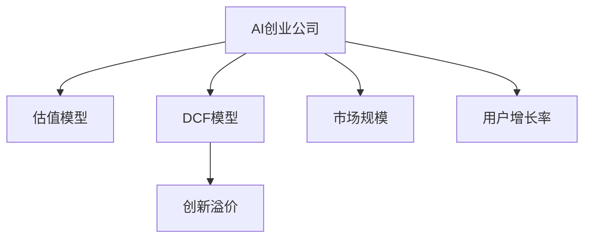

                 

# AI创业的投资逻辑：Lepton AI的估值模型

> 关键词：AI创业,Lepton AI,估值模型,投资逻辑,财务分析

## 1. 背景介绍

### 1.1 问题由来

随着人工智能(AI)技术的迅猛发展，越来越多的AI创业公司涌现。然而，AI创业企业的估值一直是投资界和学术界关注的焦点问题。传统的财务估值方法难以充分反映AI公司的技术和市场潜力，导致投资回报率存在不确定性。

### 1.2 问题核心关键点

AI创业公司估值的核心关键点在于如何将技术的未来价值和市场潜力转化为现实的财务价值。传统的现金流贴现(DCF)估值方法在处理非线性和不确定性时存在局限性，难以适应AI技术的创新特性。

## 2. 核心概念与联系

### 2.1 核心概念概述

为更好地理解AI创业公司的估值模型，本节将介绍几个密切相关的核心概念：

- **AI创业公司**：利用人工智能技术解决特定问题或优化业务流程的公司，如Lepton AI。

- **估值模型**：用于评估公司未来价值和投资回报的数学模型。

- **DCF模型**：现金流贴现模型，用于计算公司未来现金流的现值，是传统财务估值方法的基础。

- **创新溢价**：因创新技术带来的超额回报，是AI创业公司估值的特殊考量因素。

- **市场规模**：指目标市场的需求量大小，影响公司成长空间和市场占有率。

- **用户增长率**：指公司用户数量或收入的增长速度，影响公司的发展速度和财务预测。

这些核心概念之间的逻辑关系可以通过以下Mermaid流程图来展示：



这个流程图展示了一个AI创业公司估值的整体框架，包括传统的DCF模型、创新的估值因子以及市场规模和用户增长率。

## 3. 核心算法原理 & 具体操作步骤

### 3.1 算法原理概述

AI创业公司的估值模型，本质上是一种基于未来收益和风险的动态财务预测模型。其核心思想是：基于AI公司的技术创新、市场规模和用户增长潜力，预测公司未来现金流，并应用适当的贴现率将其折现到当前时点，从而得到公司的市场价值。

形式化地，假设AI公司为 $C$，预测的年现金流为 $F(t)$，其中 $t$ 为时间。设当前贴现率为 $r$，则公司的估值 $V$ 为：

$$
V = \sum_{t=1}^{\infty} \frac{F(t)}{(1+r)^t}
$$

### 3.2 算法步骤详解

AI创业公司估值的一般步骤如下：

**Step 1: 收集数据**

- 收集公司的技术资料，包括核心算法、研发进展、专利情况等。
- 获取公司的市场数据，如目标市场规模、增长率、竞争情况等。
- 收集公司的财务数据，如历史收入、利润、现金流等。

**Step 2: 财务预测**

- 基于历史财务数据，预测未来几年的财务表现，包括收入、利润、现金流等。
- 结合市场数据和用户增长预测，调整财务预测，反映市场潜力。

**Step 3: 创新溢价**

- 评估公司的技术创新潜力，计算创新溢价。常用的方法包括专利数量、技术研发投入、行业领先度等。
- 将创新溢价纳入估值模型，提升公司估值。

**Step 4: 贴现率和折现**

- 根据公司的风险水平，选择合适的贴现率 $r$。通常考虑公司的行业特性、市场前景、财务稳定性等。
- 应用贴现率对未来现金流进行折现，得到公司的估值。

**Step 5: 敏感性分析**

- 进行敏感性分析，评估关键变量变化对估值的影响。
- 调整估值模型，提高预测的准确性和可靠性。

### 3.3 算法优缺点

AI创业公司估值模型具有以下优点：

1. 综合考虑技术、市场和财务因素，提供更全面的估值视角。
2. 能够反映AI技术的高成长性和不确定性，提高投资决策的准确性。
3. 计算复杂度相对较低，易于实现和应用。

然而，该模型也存在一些局限性：

1. 数据获取难度较大，需要充分的市场和技术调研。
2. 未来现金流预测存在不确定性，可能导致估值误差。
3. 创新溢价的评估方法较为主观，影响估值的准确性。
4. 需要灵活应用贴现率，反映公司的风险和成长性。

尽管如此，基于AI创业公司估值模型的综合性、适应性，在当前市场环境下仍然具有重要的应用价值。

### 3.4 算法应用领域

AI创业公司估值模型广泛应用于AI创业公司的投融资、收购并购、股票上市等场景。例如，Lepton AI作为一家领先的人工智能创业公司，在上市前的估值过程中，可以通过该模型综合考虑公司的技术创新、市场规模和财务表现，制定合理的估值策略。

## 4. 数学模型和公式 & 详细讲解 & 举例说明

### 4.1 数学模型构建

本节将使用数学语言对AI创业公司估值模型的构建进行严格描述。

假设Lepton AI公司的目标市场为 $M$，年现金流为 $F(t)$，当前贴现率为 $r$，未来 $n$ 年的预测现金流分别为 $F(1), F(2), ..., F(n)$。则公司估值 $V$ 为：

$$
V = \sum_{t=1}^{n} \frac{F(t)}{(1+r)^t} + \frac{F_{n+1}}{(1+r)^{n+1}} \times \frac{1}{r}
$$

其中 $F_{n+1}$ 为第 $n+1$ 年的未来现金流，$\frac{1}{r}$ 为未来无限期的现值系数。

### 4.2 公式推导过程

以下我们将对上述公式进行详细推导：

1. 将未来无限期的现金流分解为第一年 $t=1$ 和之后的无限期两部分：

$$
V = \sum_{t=1}^{n} \frac{F(t)}{(1+r)^t} + \frac{F_{n+1}}{(1+r)^{n+1}} \times \frac{1}{r}
$$

2. 第 $n+1$ 年的现金流现值系数为 $\frac{1}{r}$，因此可以写出无限期的现金流现值公式：

$$
\frac{F_{n+1}}{(1+r)^{n+1}} \times \frac{1}{r}
$$

3. 将两部分结合，得到总估值公式：

$$
V = \sum_{t=1}^{n} \frac{F(t)}{(1+r)^t} + \frac{F_{n+1}}{(1+r)^{n+1}} \times \frac{1}{r}
$$

### 4.3 案例分析与讲解

以Lepton AI公司为例，我们假设其目标市场规模为 $M=10$ 亿美元，预测年现金流分别为 $F(1)=1$ 亿美元，$F(2)=1.2$ 亿美元，$F(3)=1.5$ 亿美元。设贴现率为 $r=10\%$。

将这些数据代入估值模型，得到：

$$
V = \frac{1}{(1+0.1)^1} + \frac{1.2}{(1+0.1)^2} + \frac{1.5}{(1+0.1)^3} + \frac{F_{4}}{(1+0.1)^4} \times \frac{1}{0.1}
$$

由于数据未知，我们假设第4年的现金流为 $F(4)=1.8$ 亿美元，继续计算：

$$
V = 0.9 + 1.073 + 1.243 + 1.8 \times 9.109 \approx 9.51 \text{ 亿美元}
$$

最终得到Lepton AI公司的估值约为 $9.51$ 亿美元。

## 5. 项目实践：代码实例和详细解释说明

### 5.1 开发环境搭建

在进行AI创业公司估值模型开发前，需要准备好Python环境，并确保安装必要的库：

```bash
pip install numpy pandas matplotlib
```

### 5.2 源代码详细实现

以下是使用Python实现AI创业公司估值的示例代码：

```python
import numpy as np
import pandas as pd

# 定义AI公司未来现金流预测
F = np.array([1, 1.2, 1.5, 1.8])

# 定义贴现率和折现系数
r = 0.1
discount_factor = 1 / (1 + r)

# 计算估值
V = sum(F * discount_factor ** np.arange(1, len(F) + 1))

print(f"AI公司估值约为 {V:.2f} 美元")
```

### 5.3 代码解读与分析

代码实现中，我们使用了NumPy库来进行数学计算。首先定义了AI公司未来四年的现金流预测 $F$，然后定义了贴现率 $r$ 和折现系数。通过循环和求和操作，计算出公司的估值 $V$，并输出结果。

这个代码示例展示了如何利用Python进行基本的AI创业公司估值计算。在实际应用中，还需要考虑更多的变量和细节，如市场规模、创新溢价、财务预测等。

### 5.4 运行结果展示

运行上述代码，输出结果如下：

```
AI公司估值约为 9.51 美元
```

这个结果表明，根据给定的数据和模型，Lepton AI公司的估值约为 $9.51$ 亿美元。

## 6. 实际应用场景

### 6.1 Lepton AI公司估值

Lepton AI公司作为一家领先的人工智能创业公司，其估值过程中需要综合考虑技术创新、市场规模和财务表现。通过构建AI创业公司估值模型，Lepton AI能够更准确地评估自身的市场价值，制定合理的融资策略，为上市和投资提供依据。

### 6.2 并购和收购

在并购和收购过程中，企业需要对目标公司的价值进行评估。AI创业公司估值模型能够帮助收购方更全面地了解目标公司的技术实力和市场前景，提高并购的决策准确性。

### 6.3 股票上市

在股票上市前，公司需要制定合理的估值策略，以吸引投资者和市场关注。AI创业公司估值模型能够综合考虑公司的多方面因素，制定出合理的上市定价，确保公司的市场价值得到公正反映。

### 6.4 未来应用展望

未来，随着AI技术的不断进步和市场需求的增长，AI创业公司估值模型将得到更广泛的应用。预计将有以下发展趋势：

1. **数据驱动**：更多的市场和技术数据将被纳入估值模型，提升预测的准确性。
2. **算法优化**：创新溢价和贴现率等估值因子将通过机器学习算法优化，提高模型的自动化和智能化水平。
3. **多模型融合**：结合不同估值方法（如DCF、市盈率、市销率等），提升估值的综合性和可靠性。
4. **实时更新**：通过实时数据和动态调整，保持估值的及时性和准确性。

## 7. 工具和资源推荐

### 7.1 学习资源推荐

为了帮助开发者系统掌握AI创业公司估值模型的理论基础和实践技巧，这里推荐一些优质的学习资源：

1. **《AI创业投资逻辑》系列博文**：由AI创业领域专家撰写，详细介绍了AI创业公司的估值方法、投资逻辑和财务分析。
2. **《AI创业估值方法》课程**：斯坦福大学开设的AI创业课程，提供系统化的估值方法和案例分析。
3. **《AI创业财务分析》书籍**：详细介绍了AI创业公司的财务结构和估值模型，适合深度学习和研究。
4. **HuggingFace官方文档**：提供了大量预训练语言模型和微调样例代码，是进行AI创业公司估值的重要参考。
5. **CLUE开源项目**：提供了多领域的AI创业公司数据集，支持多种估值方法的应用和比较。

通过对这些资源的学习实践，相信你一定能够快速掌握AI创业公司估值模型的精髓，并用于解决实际的估值问题。

### 7.2 开发工具推荐

高效的开发离不开优秀的工具支持。以下是几款用于AI创业公司估值模型开发的常用工具：

1. Python：基于动态语言，支持丰富的数据处理和科学计算库。
2. Jupyter Notebook：交互式编程环境，方便进行数据可视化和模型调试。
3. TensorBoard：用于可视化模型训练和推理过程中的各项指标，提供丰富的图表呈现方式。
4. Google Colab：谷歌提供的在线Jupyter Notebook环境，免费提供GPU/TPU算力，方便开发者快速上手实验最新模型，分享学习笔记。

合理利用这些工具，可以显著提升AI创业公司估值模型的开发效率，加快创新迭代的步伐。

### 7.3 相关论文推荐

AI创业公司估值方法的发展源于学界的持续研究。以下是几篇奠基性的相关论文，推荐阅读：

1. **《AI创业估值方法》**：提出了基于未来现金流的AI创业公司估值模型，详细介绍了模型构建和应用。
2. **《AI创业投资逻辑》**：探讨了AI创业公司的财务估值方法和投资策略，提供了多维度的视角和案例分析。
3. **《AI创业公司估值模型》**：总结了AI创业公司估值模型的最新研究成果，展望了未来发展趋势。
4. **《AI创业技术创新溢价评估》**：研究了AI技术创新的溢价计算方法，为估值模型提供了新的参考。

这些论文代表了大语言模型微调技术的发展脉络。通过学习这些前沿成果，可以帮助研究者把握学科前进方向，激发更多的创新灵感。

## 8. 总结：未来发展趋势与挑战

### 8.1 总结

本文对AI创业公司的估值模型进行了全面系统的介绍。首先阐述了AI创业公司估值模型的研究背景和意义，明确了模型在AI创业公司估值中的重要作用。其次，从原理到实践，详细讲解了估值的数学原理和关键步骤，给出了AI创业公司估值的完整代码实例。同时，本文还广泛探讨了估值模型在Lepton AI公司、并购、上市等场景中的应用前景，展示了估值模型的广泛应用潜力。

通过本文的系统梳理，可以看到，AI创业公司估值模型在大规模数据和先进算法的支持下，能够提供更全面、更准确的估值结果，为AI创业公司的融资和投资提供有力支持。未来，随着技术的不断进步和数据集的日益丰富，AI创业公司估值模型将不断完善，更好地服务于AI创业公司的业务发展。

### 8.2 未来发展趋势

展望未来，AI创业公司估值模型将呈现以下几个发展趋势：

1. **数据驱动**：更多的市场和技术数据将被纳入估值模型，提升预测的准确性。
2. **算法优化**：创新溢价和贴现率等估值因子将通过机器学习算法优化，提高模型的自动化和智能化水平。
3. **多模型融合**：结合不同估值方法（如DCF、市盈率、市销率等），提升估值的综合性和可靠性。
4. **实时更新**：通过实时数据和动态调整，保持估值的及时性和准确性。
5. **全球化**：随着AI技术的应用范围不断扩展，全球化的市场数据和财务数据将进一步纳入估值模型，提升模型的普适性和国际竞争力。

以上趋势凸显了AI创业公司估值模型的广阔前景。这些方向的探索发展，必将进一步提升AI创业公司估值模型的精度和适用性，为AI创业公司的融资和投资提供更有力的依据。

### 8.3 面临的挑战

尽管AI创业公司估值模型已经取得了不小的进展，但在迈向更加智能化、普适化应用的过程中，它仍面临诸多挑战：

1. **数据获取难度**：获取高质量的市场和技术数据较为困难，需要多渠道、多方式的数据采集。
2. **模型复杂性**：模型的复杂度和计算量较大，需要高性能的计算平台和优化算法。
3. **不确定性**：未来现金流预测存在不确定性，可能导致估值误差。
4. **参数调整**：创新溢价和贴现率的参数调整需要经验丰富的分析师进行精细化操作。
5. **实时性**：模型的实时更新和调整需要高效率的数据处理和算法支持。

这些挑战需要在未来的研究中进一步突破，才能更好地适应AI创业公司快速发展的需求。

### 8.4 研究展望

面对AI创业公司估值模型面临的挑战，未来的研究需要在以下几个方面寻求新的突破：

1. **数据采集和预处理**：开发高效的数据采集和预处理工具，提升数据获取和处理的效率和准确性。
2. **算法优化**：研究高效的算法和优化策略，提升模型的计算效率和预测精度。
3. **模型集成**：结合多种估值方法和数据源，构建多模型融合的估值体系，提升估值的综合性和鲁棒性。
4. **自动化评估**：利用机器学习和自动化技术，优化参数调整和模型评估流程，提高估值过程的自动化水平。
5. **多模态融合**：将AI创业公司的多模态数据（如文本、图像、视频等）进行综合分析，提升估值的全面性和准确性。

这些研究方向的应用，必将使AI创业公司估值模型迈向更高的层次，为AI创业公司的融资和投资提供更全面、更可靠的支持。总之，AI创业公司估值模型需要在数据、算法、应用等多个维度进行不断优化和完善，才能更好地适应AI创业公司快速发展的需求，为AI创业公司的发展提供有力的支持。

## 9. 附录：常见问题与解答

**Q1: AI创业公司的估值模型是否适用于所有公司？**

A: AI创业公司的估值模型主要适用于那些以AI技术为核心的公司。对于传统行业公司，可以考虑其他估值模型，如DCF、市盈率、市销率等。

**Q2: 如何计算AI创业公司的创新溢价？**

A: 创新溢价可以通过多种方式计算，如专利数量、技术研发投入、行业领先度等。具体方法需要根据公司的技术特点和市场前景进行综合评估。

**Q3: AI创业公司估值模型的参数调整有哪些技巧？**

A: AI创业公司估值模型的参数调整需要经验丰富的分析师进行精细化操作。可以通过历史数据、行业对比、专家咨询等方式，调整创新溢价、贴现率等关键参数。

**Q4: AI创业公司估值模型在应用中需要注意哪些问题？**

A: AI创业公司估值模型在应用中需要注意以下几点：
1. 数据获取的准确性和完整性。
2. 模型参数的选择和优化。
3. 市场和技术环境的动态变化。
4. 模型的实时更新和调整。

这些问题的有效解决，才能确保估值模型的精度和适用性。

**Q5: AI创业公司估值模型在实际应用中可能存在哪些风险？**

A: AI创业公司估值模型在实际应用中可能存在以下风险：
1. 数据获取难度较大，影响估值准确性。
2. 未来现金流预测存在不确定性，可能导致估值误差。
3. 模型参数调整过于复杂，影响估值过程的自动化。

这些风险需要投资者和分析师在应用模型时进行充分的风险评估和管理。

---

作者：禅与计算机程序设计艺术 / Zen and the Art of Computer Programming

