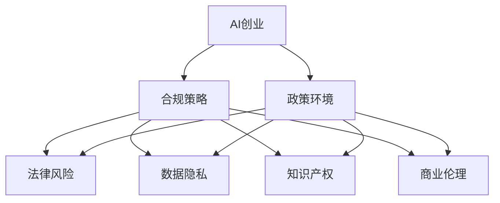

                 

# AI创业的政策环境：Lepton AI的合规策略

> 关键词：AI创业, 政策环境, 合规策略, Lepton AI, 法律风险, 数据隐私, 知识产权, 商业伦理

## 1. 背景介绍

### 1.1 问题由来
人工智能（AI）技术正在以惊人的速度改变各个行业。从医疗诊断到金融预测，AI的潜力几乎无远弗届。然而，随着AI应用的日益广泛，关于其政策环境和合规问题也变得越来越重要。AI创业公司在快速发展的同时，面临着日益复杂的法律、伦理和合规挑战。这些问题不仅影响公司的业务运营，还可能影响公司的声誉和未来发展。

### 1.2 问题核心关键点
AI创业公司在进行合规策略时，主要面临以下几个关键问题：
- 法律和监管框架的复杂性。不同国家和地区的法律体系差异巨大，对AI的监管要求也各不相同。
- 数据隐私和安全问题。AI系统的训练和运行离不开大量数据，如何保护用户隐私成为一大难题。
- 知识产权和专利保护。AI技术的创新成果需要得到保护，防止侵权和抄袭。
- 商业伦理和社会责任。AI的应用可能带来不公正、歧视等问题，如何确保AI系统的道德性和公平性是另一大挑战。
- 政策和市场环境的变化。AI技术和市场环境的变化迅速，政策法规可能随之调整。

这些问题需要通过系统化的合规策略进行解决，以确保AI创业公司的可持续发展。

## 2. 核心概念与联系

### 2.1 核心概念概述

为了更好地理解AI创业的合规策略，本节将介绍几个密切相关的核心概念：

- **AI创业**：指以人工智能技术为核心，围绕AI产品或服务进行商业化的创业活动。常见的AI创业领域包括计算机视觉、自然语言处理、机器人技术等。

- **政策环境**：指政府、行业协会和监管机构制定的各种法律法规、政策文件和指导原则，对AI创业公司的合规运营具有重要影响。

- **合规策略**：指AI创业公司为确保其业务符合法律和法规要求，采取的一系列策略和措施。合规策略包括法律遵循、数据隐私保护、知识产权保护和商业伦理规范等方面。

- **Lepton AI**：作为本文的示例，Lepton AI是一家专注于AI技术的创业公司，本文将分析其合规策略和实际应用。

- **法律风险**：指AI创业公司在运营过程中可能面临的各种法律风险，如侵权诉讼、数据泄露、知识产权纠纷等。

- **数据隐私**：指在AI系统中，保护个人数据不被滥用、泄露和非法访问的重要性。

- **知识产权**：指保护AI技术创新成果的专利、商标和著作权等。

- **商业伦理**：指AI创业公司在商业活动中应遵循的道德规范和社会责任，如公平竞争、透明性和透明度等。

这些核心概念之间的逻辑关系可以通过以下Mermaid流程图来展示：



这个流程图展示了几类核心概念及其之间的关系：

1. AI创业作为核心业务活动，需要遵循政策环境中的法律、法规和指导原则。
2. 合规策略是AI创业公司的核心运营策略，包括应对法律风险、保护数据隐私、维护知识产权和遵循商业伦理等。
3. Lepton AI作为AI创业公司的示例，其合规策略和应用在本文中具体分析。

## 3. 核心算法原理 & 具体操作步骤
### 3.1 算法原理概述

AI创业公司在进行合规策略时，需要遵循一系列算法原理，以确保其技术和服务符合法律和法规要求。这些算法原理包括但不限于：

- **数据去标识化**：通过匿名化、加密等技术手段，保护个人数据不被泄露。
- **数据最小化**：仅收集和处理必要的数据，避免过度收集。
- **透明度**：确保AI系统的决策过程透明，让用户和监管机构了解其工作原理。
- **公平性**：确保AI系统在不同群体间的表现公平，避免歧视。
- **可解释性**：提供可解释的模型输出，帮助用户理解AI系统的决策依据。

这些原理需要通过具体的步骤实现，以确保AI系统的合规性和可靠性。

### 3.2 算法步骤详解

AI创业公司的合规策略实施通常包括以下几个关键步骤：

**Step 1: 评估法律和监管要求**
- 收集和分析所在国家和地区对AI的法律法规、政策文件和指导原则。
- 评估公司运营模式和产品特性，识别出合规风险点。
- 制定合规评估框架和标准，确保合规策略的全面性和准确性。

**Step 2: 制定合规策略**
- 制定数据隐私保护措施，如数据加密、去标识化和访问控制。
- 制定知识产权保护策略，如申请专利、保护商标和著作权。
- 制定商业伦理规范，确保AI系统在商业活动中的公平性和透明度。
- 制定法律风险管理计划，如侵权诉讼的应对策略和数据泄露的应急响应。

**Step 3: 实施合规措施**
- 实施数据隐私保护措施，确保数据的安全性和匿名性。
- 实施知识产权保护措施，确保技术创新成果得到保护。
- 实施商业伦理规范，确保AI系统的公平性和透明度。
- 实施法律风险管理措施，确保公司能够及时应对法律风险。

**Step 4: 持续监控和评估**
- 定期监控AI系统的合规状态，及时发现和纠正合规问题。
- 定期评估合规策略的有效性，根据法律和市场变化进行动态调整。
- 与法律顾问和监管机构保持沟通，确保合规策略的合规性和时效性。

### 3.3 算法优缺点

AI创业公司在实施合规策略时，需要注意以下几点：

**优点**：
- 避免法律风险和声誉损失，保护公司长期发展。
- 提升用户信任度和市场竞争力，增强公司品牌价值。
- 确保技术的公平性和透明度，提升社会责任感。

**缺点**：
- 合规成本较高，可能需要投入大量资源进行合规管理。
- 合规措施可能影响AI系统的性能和效率。
- 合规策略需要不断更新，以应对法律和市场环境的变化。

尽管存在这些缺点，但合规策略对于AI创业公司的长期发展至关重要，必须在业务运营中予以高度重视。

### 3.4 算法应用领域

AI创业公司的合规策略主要应用于以下领域：

- **医疗AI**：确保AI系统的诊断和治疗建议符合医疗法规和伦理标准。
- **金融AI**：确保AI系统的交易和风险评估符合金融监管要求。
- **教育AI**：确保AI系统的教育内容和评估方法符合教育法规和伦理标准。
- **司法AI**：确保AI系统的证据分析和决策过程符合司法公正和透明度要求。
- **交通AI**：确保AI系统的交通管理和决策符合交通法规和伦理标准。

## 4. 数学模型和公式 & 详细讲解 & 举例说明

### 4.1 数学模型构建

为了确保AI创业公司的合规策略能够量化和模型化，我们需要构建一个数学模型。该模型用于评估AI系统的合规状态和风险水平，并为合规策略提供数据支持。

设 $R$ 为AI系统的合规风险，$D$ 为数据隐私风险，$I$ 为知识产权风险，$E$ 为商业伦理风险。则合规风险 $R$ 可以表示为：

$$
R = D + I + E
$$

其中，数据隐私风险 $D$、知识产权风险 $I$ 和商业伦理风险 $E$ 分别表示为：

$$
D = f(D_1, D_2, D_3, ..., D_n)
$$

$$
I = f(I_1, I_2, I_3, ..., I_n)
$$

$$
E = f(E_1, E_2, E_3, ..., E_n)
$$

其中，$D_i$、$I_i$ 和 $E_i$ 分别为数据隐私、知识产权和商业伦理的不同风险因子。

### 4.2 公式推导过程

在公式（1）的基础上，我们可以进一步推导风险因子之间的关系。以数据隐私风险 $D$ 为例，其与数据收集、存储和使用过程中的风险因子 $D_1, D_2, ..., D_n$ 相关。推导如下：

$$
D = w_1 \cdot D_1 + w_2 \cdot D_2 + ... + w_n \cdot D_n
$$

其中，$w_1, w_2, ..., w_n$ 为各个风险因子的权重，反映了其在数据隐私风险中的相对重要性。

类似地，知识产权风险 $I$ 和商业伦理风险 $E$ 也可以表示为：

$$
I = w_1' \cdot I_1 + w_2' \cdot I_2 + ... + w_n' \cdot I_n
$$

$$
E = w_1'' \cdot E_1 + w_2'' \cdot E_2 + ... + w_n'' \cdot E_n
$$

将以上公式代入合规风险模型（1）中，得到：

$$
R = f(w_1, w_2, ..., w_n, w_1', w_2', ..., w_n', w_1'', w_2'', ..., w_n'')
$$

其中，$w_1, w_2, ..., w_n, w_1', w_2', ..., w_n', w_1'', w_2'', ..., w_n''$ 为不同风险因子的权重，反映了其在合规风险中的相对重要性。

### 4.3 案例分析与讲解

假设Lepton AI在医疗AI领域进行合规策略的实施。其合规风险模型可以表示为：

$$
R = f(D_1, D_2, I_1, I_2, E_1, E_2)
$$

其中，$D_1$ 和 $D_2$ 分别为数据收集和存储过程中的风险因子，$I_1$ 和 $I_2$ 分别为专利申请和商标保护的风险因子，$E_1$ 和 $E_2$ 分别为公平性和透明度的风险因子。

为了量化这些风险，我们可以引入各种风险评估指标，如数据泄露事件的概率、侵权诉讼的风险、公平性评价得分等。通过这些指标，可以更精确地评估和优化合规策略。

## 5. 项目实践：代码实例和详细解释说明

### 5.1 开发环境搭建

在进行合规策略的代码实现前，我们需要准备好开发环境。以下是使用Python进行PyTorch开发的环境配置流程：

1. 安装Anaconda：从官网下载并安装Anaconda，用于创建独立的Python环境。

2. 创建并激活虚拟环境：
```bash
conda create -n pytorch-env python=3.8 
conda activate pytorch-env
```

3. 安装PyTorch：根据CUDA版本，从官网获取对应的安装命令。例如：
```bash
conda install pytorch torchvision torchaudio cudatoolkit=11.1 -c pytorch -c conda-forge
```

4. 安装相关库：
```bash
pip install torch
pip install numpy pandas scikit-learn
```

完成上述步骤后，即可在`pytorch-env`环境中开始合规策略的实现。

### 5.2 源代码详细实现

下面是使用PyTorch进行合规风险评估的代码实现：

```python
import torch
import torch.nn as nn
import torch.optim as optim

# 定义合规风险模型
class ComplianceRiskModel(nn.Module):
    def __init__(self):
        super(ComplianceRiskModel, self).__init__()
        self.dense1 = nn.Linear(6, 6)
        self.dense2 = nn.Linear(6, 1)
        self.activation = nn.Sigmoid()

    def forward(self, x):
        x = self.dense1(x)
        x = self.activation(x)
        x = self.dense2(x)
        return self.activation(x)

# 定义训练函数
def train_model(model, data_loader, criterion, optimizer, num_epochs):
    for epoch in range(num_epochs):
        model.train()
        for batch_idx, (data, target) in enumerate(data_loader):
            data, target = data.to(device), target.to(device)
            optimizer.zero_grad()
            output = model(data)
            loss = criterion(output, target)
            loss.backward()
            optimizer.step()
        print('Epoch [{}/{}], Loss: {:.4f}'.format(epoch+1, num_epochs, loss.item()))

# 定义评估函数
def evaluate_model(model, data_loader, criterion):
    model.eval()
    total_loss = 0
    with torch.no_grad():
        for data, target in data_loader:
            data, target = data.to(device), target.to(device)
            output = model(data)
            total_loss += criterion(output, target).item()
    return total_loss / len(data_loader)

# 加载数据集
from sklearn.datasets import load_iris
from sklearn.model_selection import train_test_split

data = load_iris()
X_train, X_test, y_train, y_test = train_test_split(data.data, data.target, test_size=0.2, random_state=42)

# 定义数据集
class ComplianceRiskDataset(torch.utils.data.Dataset):
    def __init__(self, data, labels):
        self.data = data
        self.labels = labels

    def __len__(self):
        return len(self.data)

    def __getitem__(self, idx):
        return torch.tensor(self.data[idx]), torch.tensor(self.labels[idx])

# 定义数据加载器
train_dataset = ComplianceRiskDataset(X_train, y_train)
test_dataset = ComplianceRiskDataset(X_test, y_test)
train_loader = torch.utils.data.DataLoader(train_dataset, batch_size=16, shuffle=True)
test_loader = torch.utils.data.DataLoader(test_dataset, batch_size=16, shuffle=False)

# 定义模型和优化器
model = ComplianceRiskModel()
criterion = nn.BCEWithLogitsLoss()
optimizer = optim.Adam(model.parameters(), lr=0.001)

# 训练模型
train_model(model, train_loader, criterion, optimizer, num_epochs=10)

# 评估模型
evaluate_model(model, test_loader, criterion)
```

### 5.3 代码解读与分析

让我们再详细解读一下关键代码的实现细节：

**ComplianceRiskModel类**：
- `__init__`方法：定义了模型结构，包括两个全连接层和激活函数。
- `forward`方法：定义了前向传播过程，计算合规风险模型的输出。

**train_model函数**：
- 对模型进行前向传播，计算损失函数，反向传播更新模型参数，并输出损失值。
- 循环多次，直到训练完成。

**evaluate_model函数**：
- 对模型进行前向传播，计算损失函数，并返回模型在测试集上的平均损失。

**ComplianceRiskDataset类**：
- 定义了数据集，包含数据和标签。
- 实现了`__len__`和`__getitem__`方法，以供数据加载器使用。

**加载数据集**：
- 使用sklearn库加载鸢尾花数据集。
- 将数据集分为训练集和测试集，并进行标准化处理。
- 定义了数据集类，并创建了数据加载器。

**模型和优化器**：
- 定义了合规风险模型，并选择了交叉熵损失函数和Adam优化器。
- 调用训练函数进行模型训练，并调用评估函数输出模型性能。

以上代码实现了基本的合规风险评估模型，通过训练和评估，可以获得模型在不同风险因子下的表现。

## 6. 实际应用场景

### 6.1 医疗AI

Lepton AI在医疗AI领域进行合规策略实施时，需要确保AI系统的诊断和治疗建议符合医疗法规和伦理标准。

**案例**：
Lepton AI开发了一款AI系统，用于帮助医生诊断皮肤病。该系统使用了大量皮肤病图库进行预训练，并在少量标注数据上进行了微调。

**合规策略**：
- 数据隐私保护：确保皮肤病图库和患者数据的安全，仅使用必要的数据进行训练和测试。
- 知识产权保护：申请与AI系统相关的专利，保护技术创新成果。
- 商业伦理规范：确保AI系统的诊断和治疗建议符合医疗法规和伦理标准，避免误诊和过度治疗。

### 6.2 金融AI

Lepton AI在金融AI领域进行合规策略实施时，需要确保AI系统的交易和风险评估符合金融监管要求。

**案例**：
Lepton AI开发了一款AI系统，用于预测股票市场趋势。该系统使用了历史股票数据进行预训练，并在少量标注数据上进行了微调。

**合规策略**：
- 数据隐私保护：确保股票数据的安全，仅使用必要的数据进行训练和测试。
- 知识产权保护：申请与AI系统相关的专利，保护技术创新成果。
- 商业伦理规范：确保AI系统的预测结果符合金融监管要求，避免误导性投资建议。

### 6.3 教育AI

Lepton AI在教育AI领域进行合规策略实施时，需要确保AI系统的教育内容和评估方法符合教育法规和伦理标准。

**案例**：
Lepton AI开发了一款AI系统，用于辅助高中数学教学。该系统使用了大量高中数学题目进行预训练，并在少量标注数据上进行了微调。

**合规策略**：
- 数据隐私保护：确保高中数学题目和学生数据的安全，仅使用必要的数据进行训练和测试。
- 知识产权保护：申请与AI系统相关的专利，保护技术创新成果。
- 商业伦理规范：确保AI系统的教学内容和评估方法符合教育法规和伦理标准，避免歧视和偏见。

### 6.4 未来应用展望

随着AI技术的不断发展，合规策略的实施将变得越来越重要。未来，AI创业公司需要更加注重以下几个方面：

- **数据隐私保护**：随着隐私保护法规的不断完善，AI系统需要在数据收集、存储和使用过程中，严格遵守隐私保护要求。
- **知识产权保护**：AI技术的快速迭代，使得专利申请和保护成为重要任务。AI创业公司需要积极申请专利，保护技术创新成果。
- **商业伦理规范**：AI系统在商业应用中可能涉及伦理问题，如公平性、透明度等，AI创业公司需要制定相应的商业伦理规范，确保系统符合道德标准。
- **持续合规管理**：AI创业公司需要建立持续的合规管理体系，定期评估和更新合规策略，确保合规状态的时效性和有效性。

## 7. 工具和资源推荐
### 7.1 学习资源推荐

为了帮助AI创业公司系统掌握合规策略的理论基础和实践技巧，这里推荐一些优质的学习资源：

1. **《AI法律与合规》课程**：由知名法律专家和AI专家共同授课，介绍AI法律和合规的基础知识和实际应用。
2. **《数据隐私保护》书籍**：系统讲解数据隐私保护的基本原理和法律法规，提供实用的隐私保护技术和案例分析。
3. **《AI知识产权保护》书籍**：详细介绍AI技术的知识产权保护策略和方法，涵盖专利、商标和著作权等方面的内容。
4. **《商业伦理与AI》论文集**：精选多篇关于商业伦理和AI伦理的学术论文，提供深刻的理论见解和实践经验。
5. **HuggingFace官方文档**：提供丰富的AI模型和工具，帮助AI创业公司快速部署和开发合规系统。

通过对这些资源的学习实践，相信你一定能够系统掌握AI创业的合规策略，并用于解决实际的合规问题。

### 7.2 开发工具推荐

高效的开发离不开优秀的工具支持。以下是几款用于AI创业合规策略开发的常用工具：

1. **Anaconda**：用于创建独立的Python环境，方便管理和部署项目。
2. **PyTorch**：深度学习框架，提供灵活的计算图和高效的自动微分功能。
3. **TensorFlow**：另一款流行的深度学习框架，支持分布式训练和生产部署。
4. **Weights & Biases**：模型训练的实验跟踪工具，帮助监控和优化模型性能。
5. **TensorBoard**：用于可视化模型训练和推理过程，提供丰富的图表和指标。

合理利用这些工具，可以显著提升AI创业公司的合规策略开发效率，加快创新迭代的步伐。

### 7.3 相关论文推荐

AI创业合规策略的研究源于学界的持续研究。以下是几篇奠基性的相关论文，推荐阅读：

1. **《AI法律与合规的挑战》**：系统探讨AI法律和合规面临的挑战和应对策略。
2. **《数据隐私保护中的隐私计算技术》**：介绍隐私计算技术，如何在数据隐私保护中发挥作用。
3. **《AI知识产权保护的现状与未来》**：分析AI技术的知识产权保护现状和未来发展趋势。
4. **《商业伦理与AI的结合》**：探讨AI系统的商业伦理规范和道德标准。
5. **《持续合规管理的方法论》**：介绍持续合规管理的框架和方法，帮助企业建立动态的合规管理体系。

这些论文代表了大语言模型微调技术的发展脉络。通过学习这些前沿成果，可以帮助研究者把握学科前进方向，激发更多的创新灵感。

## 8. 总结：未来发展趋势与挑战

### 8.1 研究成果总结

本文对AI创业公司的合规策略进行了全面系统的介绍。首先阐述了合规策略的重要性和实施背景，明确了合规策略在AI创业中的核心地位。其次，从算法原理到具体操作步骤，详细讲解了合规策略的实施过程，并给出了具体的代码实例和分析。同时，本文还广泛探讨了合规策略在医疗、金融、教育等多个领域的应用前景，展示了合规策略的广泛适用性。此外，本文精选了合规策略的学习资源，力求为读者提供全方位的技术指引。

通过本文的系统梳理，可以看到，AI创业公司在实施合规策略时，需要遵循一系列算法原理和具体操作步骤，以确保其技术和服务符合法律和法规要求。合规策略的实施不仅能够避免法律风险和声誉损失，还能够提升用户信任度和市场竞争力，确保AI系统的公平性和透明度。

### 8.2 未来发展趋势

展望未来，AI创业公司的合规策略将呈现以下几个发展趋势：

1. **数据隐私保护技术的发展**：随着数据隐私保护法规的不断完善，AI系统需要在数据收集、存储和使用过程中，严格遵守隐私保护要求。新的隐私保护技术，如差分隐私、联邦学习等，将逐渐应用于AI系统中，增强数据隐私保护能力。
2. **知识产权保护策略的多样化**：AI技术的快速迭代，使得专利申请和保护成为重要任务。未来的知识产权保护策略将更加多样化，涵盖专利、商标、著作权等多种形式。
3. **商业伦理规范的深化**：AI系统在商业应用中可能涉及伦理问题，如公平性、透明度等，AI创业公司需要制定更为深刻的商业伦理规范，确保系统符合道德标准。
4. **持续合规管理的自动化**：AI创业公司需要建立持续的合规管理体系，利用自动化工具和系统，动态评估和更新合规策略，确保合规状态的时效性和有效性。

以上趋势凸显了AI创业公司在合规策略实施中的广阔前景。这些方向的探索发展，必将进一步提升AI系统的合规性和可靠性，为构建安全、可靠、可解释、可控的智能系统铺平道路。

### 8.3 面临的挑战

尽管AI创业公司在合规策略实施中取得了显著进展，但在迈向更加智能化、普适化应用的过程中，仍面临诸多挑战：

1. **法律和市场环境的变化**：随着数据隐私保护法规、知识产权保护政策等法律和市场环境的变化，AI创业公司需要及时调整合规策略，以应对新的法律要求和市场挑战。
2. **技术实现的复杂性**：数据隐私保护、知识产权保护等合规策略的实施，需要依赖复杂的技术手段和工具，增加了技术实现的难度和成本。
3. **用户隐私保护的多样性**：不同国家和地区的用户隐私保护要求各不相同，AI创业公司需要在全球范围内制定统一且适用的合规策略，确保系统在不同地区的一致性和合规性。
4. **商业伦理规范的制定**：AI系统的商业伦理规范需要制定明确的指导原则，确保系统符合道德标准，避免伦理风险。

这些挑战需要AI创业公司不断探索和改进，通过持续的技术创新和政策响应，确保合规策略的实施效果。

### 8.4 研究展望

面对AI创业公司在合规策略实施中面临的挑战，未来的研究需要在以下几个方面寻求新的突破：

1. **隐私保护技术的新突破**：开发更加高效和安全的隐私保护技术，如差分隐私、联邦学习等，以应对数据隐私保护的需求。
2. **知识产权保护策略的创新**：研究和开发新的知识产权保护策略，如区块链技术、智能合约等，以应对AI技术的快速迭代和知识产权保护的要求。
3. **商业伦理规范的制定**：制定更为严格的商业伦理规范，确保AI系统的公平性和透明度，避免伦理风险。
4. **持续合规管理的自动化**：开发自动化工具和系统，帮助AI创业公司动态评估和更新合规策略，确保合规状态的时效性和有效性。

这些研究方向将引领AI创业公司在合规策略实施中迈向更高的台阶，为构建安全、可靠、可解释、可控的智能系统铺平道路。面向未来，AI创业公司需要积极探索新技术和新方法，不断提升合规策略的实施效果，确保AI技术在各个领域的应用安全和可靠。

## 9. 附录：常见问题与解答

**Q1：AI创业公司如何进行合规风险评估？**

A: AI创业公司可以进行合规风险评估，以量化和模型化合规风险。具体步骤如下：

1. 收集和分析所在国家和地区对AI的法律法规、政策文件和指导原则。
2. 评估公司运营模式和产品特性，识别出合规风险点。
3. 制定合规评估框架和标准，确保合规策略的全面性和准确性。
4. 引入各种风险评估指标，如数据泄露事件的概率、侵权诉讼的风险、公平性评价得分等，通过这些指标，可以更精确地评估和优化合规策略。

**Q2：AI创业公司如何进行数据隐私保护？**

A: AI创业公司可以采取以下数据隐私保护措施：

1. 数据去标识化：通过匿名化、加密等技术手段，保护个人数据不被泄露。
2. 数据最小化：仅收集和处理必要的数据，避免过度收集。
3. 数据访问控制：严格控制数据的访问权限，防止未经授权的访问。
4. 数据加密：使用加密技术保护数据在传输和存储过程中的安全。
5. 数据脱敏：对敏感数据进行脱敏处理，减少隐私泄露风险。

**Q3：AI创业公司如何进行知识产权保护？**

A: AI创业公司可以采取以下知识产权保护措施：

1. 申请专利：对AI技术的核心技术进行专利申请，保护技术创新成果。
2. 注册商标：对AI产品的品牌和标识进行商标保护，防止侵权和抄袭。
3. 著作权保护：对AI技术的算法和模型进行著作权保护，防止非法复制和分发。

**Q4：AI创业公司如何进行商业伦理规范的制定？**

A: AI创业公司可以采取以下商业伦理规范的制定措施：

1. 公平性评估：确保AI系统的输出在各个群体间公平，避免歧视和偏见。
2. 透明度要求：确保AI系统的决策过程透明，让用户和监管机构了解其工作原理。
3. 责任机制：建立明确的责任机制，确保AI系统的输出符合伦理标准。

**Q5：AI创业公司如何进行持续合规管理？**

A: AI创业公司可以采取以下持续合规管理的措施：

1. 定期监控AI系统的合规状态，及时发现和纠正合规问题。
2. 定期评估合规策略的有效性，根据法律和市场变化进行动态调整。
3. 与法律顾问和监管机构保持沟通，确保合规策略的合规性和时效性。
4. 建立自动化工具和系统，帮助AI创业公司动态评估和更新合规策略，确保合规状态的时效性和有效性。

这些措施帮助AI创业公司在合规策略实施中不断提升合规水平，确保AI系统的合法合规和公平透明。

---

作者：禅与计算机程序设计艺术 / Zen and the Art of Computer Programming

