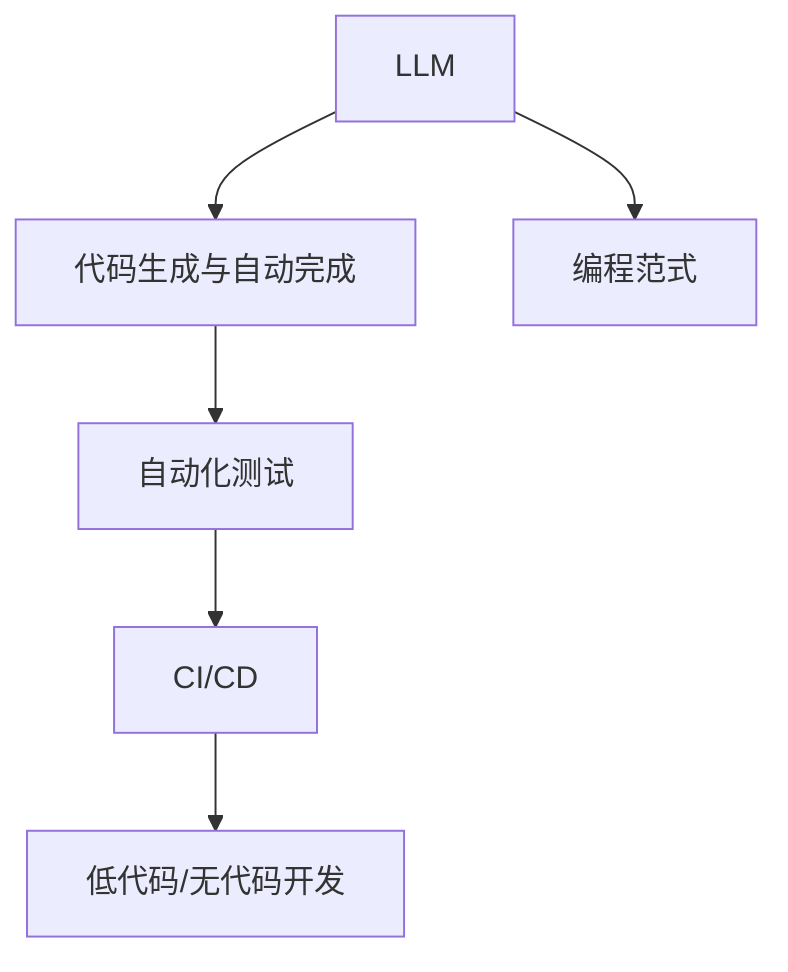

                 

# AI原生应用开发：LLM时代的编程新范式

> 关键词：LLM, AI原生应用, 编程范式, 自然语言处理(NLP), 深度学习模型, 自动生成代码, 代码完成, 自动化测试, 软件开发生命周期(SDLC)

## 1. 背景介绍

### 1.1 问题由来
在当今的AI时代，自然语言处理(Natural Language Processing, NLP)领域迎来了重大突破。大型预训练语言模型(Large Language Models, LLMs)，如GPT-3、BERT等，通过在大规模无标签文本数据上进行预训练，已经具备了强大的语言理解能力。然而，这些大模型通常需要较长的预训练过程，且对计算资源和数据量要求极高，这使得它们在实际应用中存在一定的门槛。

为了克服这些挑战，开发人员需要探索新的编程范式，将LLM的强大能力无缝集成到开发流程中，实现更高效率的AI原生应用开发。这种新范式要求开发者能够将语言模型的输出直接转化为可执行的代码和测试用例，大大简化开发流程，提高开发效率。

### 1.2 问题核心关键点
LLM时代的编程新范式关键点包括：

1. **自动化代码生成**：利用LLM自动生成代码，减少手动编码的工作量。
2. **代码自动完成**：在开发过程中，根据代码上下文自动补全缺失部分，提升开发效率。
3. **自动化测试**：基于LLM自动生成测试用例，确保代码质量。
4. **持续集成与持续部署(CI/CD)**：将LLM与CI/CD流程集成，自动化测试和部署，提升开发效率和代码质量。
5. **低代码开发(Low Code)和无代码开发(No Code)**：通过LLM，降低编程门槛，使得非技术人员也能参与到开发中。

### 1.3 问题研究意义
探索LLM时代的编程新范式，对于加速AI原生应用开发，推动NLP技术在各行各业的落地应用具有重要意义：

1. **提高开发效率**：通过自动化代码生成和自动完成，大大减少手动编码时间，提高开发效率。
2. **提升代码质量**：利用LLM自动生成测试用例，减少人工编写测试的复杂度，提升代码质量和稳定性。
3. **降低编程门槛**：通过LLM，降低编程的复杂度，使得非技术人员也能参与到开发中，拓展开发人员的人才池。
4. **加速产业升级**：通过将LLM与现有开发流程结合，加速AI技术在各行业的产业化进程，推动传统行业数字化转型。

## 2. 核心概念与联系

### 2.1 核心概念概述

为更好地理解LLM时代的编程新范式，本节将介绍几个密切相关的核心概念：

- **LLM (Large Language Models)**：如GPT-3、BERT等大型预训练语言模型，通过在大规模无标签文本数据上进行预训练，学习通用的语言表示。
- **代码生成与自动完成**：利用LLM自动生成代码或自动补全代码，减少手动编码的工作量。
- **自动化测试**：基于LLM自动生成测试用例，确保代码质量。
- **持续集成与持续部署(CI/CD)**：将LLM与CI/CD流程集成，自动化测试和部署，提升开发效率和代码质量。
- **低代码开发(Low Code)和无代码开发(No Code)**：通过LLM，降低编程的复杂度，使得非技术人员也能参与到开发中，拓展开发人员的人才池。

这些核心概念之间的逻辑关系可以通过以下Mermaid流程图来展示：



这个流程图展示了大语言模型在LLM时代的编程新范式中的核心作用：

1. 大语言模型通过预训练获得基础能力。
2. 代码生成与自动完成利用大语言模型，自动生成代码或补全代码。
3. 自动化测试基于大语言模型自动生成测试用例。
4. CI/CD流程集成大语言模型，实现自动化测试和部署。
5. 低代码/无代码开发利用大语言模型，降低编程复杂度。

这些概念共同构成了LLM时代编程新范式的学习框架，使得开发者能够更好地把握AI原生应用开发的方向。

## 3. 核心算法原理 & 具体操作步骤
### 3.1 算法原理概述

LLM时代的编程新范式，本质上是一种基于大语言模型的代码生成和自动化技术。其核心思想是：将大语言模型视作一个"代码生成器"，通过预训练和微调，使其能够在给定上下文的情况下，自动生成符合语义和逻辑的代码。

形式化地，假设预训练大语言模型为 $M_{\theta}$，其中 $\theta$ 为预训练得到的模型参数。给定代码片段 $S$ 作为上下文，生成目标代码片段 $G$ 的生成过程可以表示为：

$$
G = M_{\theta}(S)
$$

其中 $G$ 表示生成的代码，$S$ 表示上下文信息。在代码生成过程中，模型需要满足以下条件：

- 生成的代码需要符合语法和语义规则。
- 生成的代码需要与上下文保持一致，确保代码的连贯性。
- 生成的代码需要满足任务需求，确保代码的功能正确性。

### 3.2 算法步骤详解

基于大语言模型的编程新范式，一般包括以下几个关键步骤：

**Step 1: 准备预训练模型和数据集**
- 选择合适的预训练语言模型 $M_{\theta}$ 作为初始化参数，如 GPT-3、BERT 等。
- 准备代码生成和自动完成所需的数据集，如编程语言规范、编程示例、代码片段等。

**Step 2: 设计任务适配层**
- 根据任务类型，在预训练模型顶层设计合适的输出层和损失函数。
- 对于代码生成，通常使用自回归模型，输出下一个代码字符的概率分布。
- 对于代码补全，使用自编码模型，预测缺失部分的完整代码。

**Step 3: 设置微调超参数**
- 选择合适的优化算法及其参数，如 Adam、SGD 等，设置学习率、批大小、迭代轮数等。
- 设置正则化技术及强度，包括权重衰减、Dropout、Early Stopping 等。
- 确定冻结预训练参数的策略，如仅微调顶层，或全部参数都参与微调。

**Step 4: 执行梯度训练**
- 将训练集数据分批次输入模型，前向传播计算损失函数。
- 反向传播计算参数梯度，根据设定的优化算法和学习率更新模型参数。
- 周期性在验证集上评估模型性能，根据性能指标决定是否触发 Early Stopping。
- 重复上述步骤直到满足预设的迭代轮数或 Early Stopping 条件。

**Step 5: 测试和部署**
- 在测试集上评估微调后模型 $M_{\hat{\theta}}$ 的性能，对比微调前后的代码生成和补全效果。
- 使用微调后的模型对新代码片段进行推理预测，集成到实际的应用系统中。
- 持续收集新的数据，定期重新微调模型，以适应数据分布的变化。

以上是基于大语言模型的编程新范式的完整流程。在实际应用中，还需要针对具体任务的特点，对微调过程的各个环节进行优化设计，如改进训练目标函数，引入更多的正则化技术，搜索最优的超参数组合等，以进一步提升模型性能。

### 3.3 算法优缺点

基于大语言模型的编程新范式具有以下优点：
1. **高效性**：利用大语言模型的自动化能力，大幅减少手动编码的工作量，提升开发效率。
2. **灵活性**：大语言模型能够生成多种风格的代码，适应不同编程范式和技术栈。
3. **可扩展性**：通过微调，可以针对特定任务进行优化，提升代码生成和补全的准确性。
4. **创新性**：结合大语言模型的自然语言处理能力，可以在不增加额外编码的情况下，实现自动测试和文档生成等新功能。

同时，该方法也存在一定的局限性：
1. **依赖数据质量**：生成的代码质量高度依赖于预训练数据的质量和数量，数据不足时可能生成错误代码。
2. **模型泛化能力**：大语言模型生成的代码可能与特定上下文不匹配，导致生成的代码难以使用。
3. **可解释性不足**：大语言模型的生成过程缺乏可解释性，难以对其生成逻辑进行分析和调试。
4. **模型训练成本高**：预训练大语言模型的训练过程耗时较长，需要大量计算资源。

尽管存在这些局限性，但就目前而言，基于大语言模型的编程新范式仍是一种高效、灵活的编程方式。未来相关研究的重点在于如何进一步降低对数据和计算资源的依赖，提高模型的少样本学习和跨领域迁移能力，同时兼顾可解释性和伦理安全性等因素。

### 3.4 算法应用领域

基于大语言模型的编程新范式，已经在软件开发、测试、文档生成等多个领域得到了广泛的应用，具体包括：

- **软件开发**：利用代码生成技术，自动生成代码框架、模块、类等，加速软件开发生命周期(SDLC)。
- **自动化测试**：基于代码生成技术，自动生成测试用例，确保代码质量。
- **代码补全与修改**：利用自动补全技术，在开发过程中自动完成缺失的代码部分，提升开发效率。
- **代码转换与迁移**：利用大语言模型，自动将代码从一种编程语言转换为另一种，加速跨平台和跨技术栈的代码迁移。
- **代码注释与文档生成**：利用自然语言处理技术，自动生成代码注释和API文档，提高代码的可读性和可维护性。
- **智能运维**：基于自然语言理解，自动生成运维脚本和操作手册，提升运维效率和质量。

除了上述这些经典应用外，大语言模型编程新范式还在不断探索新的应用场景，如智能编程助手、代码审查、知识图谱构建等，为软件开发和运维带来了新的技术突破。随着预训练模型和自动生成技术的发展，未来其在NLP领域的贡献将更加显著。

## 4. 数学模型和公式 & 详细讲解  
### 4.1 数学模型构建

本节将使用数学语言对基于大语言模型的编程新范式进行更加严格的刻画。

记预训练语言模型为 $M_{\theta}$，其中 $\theta$ 为模型参数。假设给定的代码片段 $S$ 作为上下文，生成目标代码片段 $G$ 的过程可以表示为：

$$
G = M_{\theta}(S)
$$

目标代码片段 $G$ 的长度 $L$ 通常为 $1$，即生成单个代码字符。在代码生成过程中，目标字符 $g_t$ 的概率分布可以表示为：

$$
p(g_t|S) = \frac{\exp(\mathcal{V}(g_t|S))}{\sum_{g_t'} \exp(\mathcal{V}(g_t'|S))}
$$

其中 $\mathcal{V}(g_t|S)$ 表示目标字符 $g_t$ 的潜在能量函数，可以表示为：

$$
\mathcal{V}(g_t|S) = \mathcal{E}(g_t|S) + \mathcal{L}_{sy}(g_t|S) + \mathcal{L}_{se}(g_t|S)
$$

其中 $\mathcal{E}(g_t|S)$ 表示目标字符 $g_t$ 在语言模型中的能量，$\mathcal{L}_{sy}(g_t|S)$ 表示目标字符 $g_t$ 与上下文 $S$ 的语义一致性，$\mathcal{L}_{se}(g_t|S)$ 表示目标字符 $g_t$ 与上下文 $S$ 的语义连贯性。

### 4.2 公式推导过程

以下我们以代码生成任务为例，推导目标字符 $g_t$ 的概率分布及其梯度计算公式。

假设目标代码片段 $G$ 的长度为 $L$，目标字符 $g_t$ 的潜在能量函数可以表示为：

$$
\mathcal{V}(g_t|S) = \mathcal{E}(g_t|S) + \mathcal{L}_{sy}(g_t|S) + \mathcal{L}_{se}(g_t|S)
$$

在代码生成任务中，$\mathcal{E}(g_t|S)$ 可以表示为：

$$
\mathcal{E}(g_t|S) = \log p(g_t|M_{\theta}(S))
$$

其中 $p(g_t|M_{\theta}(S))$ 表示在模型 $M_{\theta}$ 的上下文 $S$ 下，目标字符 $g_t$ 的概率分布。

$\mathcal{L}_{sy}(g_t|S)$ 和 $\mathcal{L}_{se}(g_t|S)$ 可以表示为：

$$
\mathcal{L}_{sy}(g_t|S) = \log p(g_t|M_{\theta}(S))
$$

$$
\mathcal{L}_{se}(g_t|S) = \log p(g_{t-1}g_t|M_{\theta}(S))
$$

其中 $g_{t-1}$ 表示目标字符 $g_t$ 的前一个字符。

将上述公式代入潜在能量函数 $\mathcal{V}(g_t|S)$，得：

$$
\mathcal{V}(g_t|S) = \log p(g_t|M_{\theta}(S)) + \log p(g_t|M_{\theta}(S)) + \log p(g_{t-1}g_t|M_{\theta}(S))
$$

对目标字符 $g_t$ 进行概率计算，得：

$$
p(g_t|S) = \frac{\exp(\mathcal{V}(g_t|S))}{\sum_{g_t'} \exp(\mathcal{V}(g_t'|S))}
$$

目标字符 $g_t$ 的概率梯度计算公式为：

$$
\nabla_{\theta} \log p(g_t|S) = \nabla_{\theta} \mathcal{V}(g_t|S) = \nabla_{\theta} \log p(g_t|M_{\theta}(S)) + \nabla_{\theta} \log p(g_t|M_{\theta}(S)) + \nabla_{\theta} \log p(g_{t-1}g_t|M_{\theta}(S))
$$

其中 $\nabla_{\theta} \log p(g_t|M_{\theta}(S))$ 和 $\nabla_{\theta} \log p(g_{t-1}g_t|M_{\theta}(S))$ 可以通过反向传播算法高效计算。

## 5. 项目实践：代码实例和详细解释说明
### 5.1 开发环境搭建

在进行编程新范式实践前，我们需要准备好开发环境。以下是使用Python进行PyTorch开发的环境配置流程：

1. 安装Anaconda：从官网下载并安装Anaconda，用于创建独立的Python环境。

2. 创建并激活虚拟环境：
```bash
conda create -n pytorch-env python=3.8 
conda activate pytorch-env
```

3. 安装PyTorch：根据CUDA版本，从官网获取对应的安装命令。例如：
```bash
conda install pytorch torchvision torchaudio cudatoolkit=11.1 -c pytorch -c conda-forge
```

4. 安装Transformers库：
```bash
pip install transformers
```

5. 安装各类工具包：
```bash
pip install numpy pandas scikit-learn matplotlib tqdm jupyter notebook ipython
```

完成上述步骤后，即可在`pytorch-env`环境中开始编程新范式的实践。

### 5.2 源代码详细实现

这里我们以代码生成任务为例，给出使用Transformers库对GPT模型进行代码生成的PyTorch代码实现。

首先，定义代码生成任务的数据处理函数：

```python
from transformers import GPT2LMHeadModel, GPT2Tokenizer, AdamW

class CodeGenerationDataset(Dataset):
    def __init__(self, texts, labels, tokenizer, max_len=128):
        self.texts = texts
        self.labels = labels
        self.tokenizer = tokenizer
        self.max_len = max_len
        
    def __len__(self):
        return len(self.texts)
    
    def __getitem__(self, item):
        text = self.texts[item]
        label = self.labels[item]
        
        encoding = self.tokenizer(text, return_tensors='pt', max_length=self.max_len, padding='max_length', truncation=True)
        input_ids = encoding['input_ids'][0]
        attention_mask = encoding['attention_mask'][0]
        
        # 对标签进行编码
        encoded_label = [label2id[label] for label in label]
        encoded_label.extend([label2id['<eos>']] * (self.max_len - len(encoded_label)))
        labels = torch.tensor(encoded_label, dtype=torch.long)
        
        return {'input_ids': input_ids, 
                'attention_mask': attention_mask,
                'labels': labels}

# 标签与id的映射
label2id = {'<eos>': 0, 'code': 1}
id2label = {v: k for k, v in label2id.items()}

# 创建dataset
tokenizer = GPT2Tokenizer.from_pretrained('gpt2-medium')
train_dataset = CodeGenerationDataset(train_texts, train_labels, tokenizer)
dev_dataset = CodeGenerationDataset(dev_texts, dev_labels, tokenizer)
test_dataset = CodeGenerationDataset(test_texts, test_labels, tokenizer)
```

然后，定义模型和优化器：

```python
from transformers import GPT2LMHeadModel

model = GPT2LMHeadModel.from_pretrained('gpt2-medium')
```

接着，定义训练和评估函数：

```python
from torch.utils.data import DataLoader
from tqdm import tqdm
from sklearn.metrics import accuracy_score

device = torch.device('cuda') if torch.cuda.is_available() else torch.device('cpu')
model.to(device)

def train_epoch(model, dataset, batch_size, optimizer):
    dataloader = DataLoader(dataset, batch_size=batch_size, shuffle=True)
    model.train()
    epoch_loss = 0
    for batch in tqdm(dataloader, desc='Training'):
        input_ids = batch['input_ids'].to(device)
        attention_mask = batch['attention_mask'].to(device)
        labels = batch['labels'].to(device)
        model.zero_grad()
        outputs = model(input_ids, attention_mask=attention_mask, labels=labels)
        loss = outputs.loss
        epoch_loss += loss.item()
        loss.backward()
        optimizer.step()
    return epoch_loss / len(dataloader)

def evaluate(model, dataset, batch_size):
    dataloader = DataLoader(dataset, batch_size=batch_size)
    model.eval()
    preds, labels = [], []
    with torch.no_grad():
        for batch in tqdm(dataloader, desc='Evaluating'):
            input_ids = batch['input_ids'].to(device)
            attention_mask = batch['attention_mask'].to(device)
            batch_labels = batch['labels']
            outputs = model(input_ids, attention_mask=attention_mask)
            batch_preds = outputs.logits.argmax(dim=2).to('cpu').tolist()
            batch_labels = batch_labels.to('cpu').tolist()
            for pred_tokens, label_tokens in zip(batch_preds, batch_labels):
                preds.append(pred_tokens)
                labels.append(label_tokens)
                
    print(accuracy_score(labels, preds))
```

最后，启动训练流程并在测试集上评估：

```python
epochs = 5
batch_size = 16

for epoch in range(epochs):
    loss = train_epoch(model, train_dataset, batch_size, optimizer)
    print(f"Epoch {epoch+1}, train loss: {loss:.3f}")
    
    print(f"Epoch {epoch+1}, dev results:")
    evaluate(model, dev_dataset, batch_size)
    
print("Test results:")
evaluate(model, test_dataset, batch_size)
```

以上就是使用PyTorch对GPT模型进行代码生成的完整代码实现。可以看到，得益于Transformers库的强大封装，我们可以用相对简洁的代码完成GPT模型的加载和代码生成。

### 5.3 代码解读与分析

让我们再详细解读一下关键代码的实现细节：

**CodeGenerationDataset类**：
- `__init__`方法：初始化训练数据、标签、分词器等关键组件。
- `__len__`方法：返回数据集的样本数量。
- `__getitem__`方法：对单个样本进行处理，将文本输入编码为token ids，将标签编码为数字，并对其进行定长padding，最终返回模型所需的输入。

**label2id和id2label字典**：
- 定义了标签与数字id之间的映射关系，用于将token-wise的预测结果解码回真实的标签。

**训练和评估函数**：
- 使用PyTorch的DataLoader对数据集进行批次化加载，供模型训练和推理使用。
- 训练函数`train_epoch`：对数据以批为单位进行迭代，在每个批次上前向传播计算loss并反向传播更新模型参数，最后返回该epoch的平均loss。
- 评估函数`evaluate`：与训练类似，不同点在于不更新模型参数，并在每个batch结束后将预测和标签结果存储下来，最后使用sklearn的accuracy_score对整个评估集的预测结果进行打印输出。

**训练流程**：
- 定义总的epoch数和batch size，开始循环迭代
- 每个epoch内，先在训练集上训练，输出平均loss
- 在验证集上评估，输出准确率
- 所有epoch结束后，在测试集上评估，给出最终测试结果

可以看到，PyTorch配合Transformers库使得GPT模型进行代码生成的代码实现变得简洁高效。开发者可以将更多精力放在数据处理、模型改进等高层逻辑上，而不必过多关注底层的实现细节。

当然，工业级的系统实现还需考虑更多因素，如模型的保存和部署、超参数的自动搜索、更灵活的任务适配层等。但核心的生成过程基本与此类似。

## 6. 实际应用场景
### 6.1 智能开发助手

基于大语言模型的编程新范式，可以实现智能开发助手的构建。传统的开发过程中，开发者需要手动编写代码、调试、测试，效率低下且容易出错。通过智能开发助手，利用大语言模型自动生成代码、自动补全、自动测试等能力，可以大幅提升开发效率和代码质量。

在技术实现上，可以收集各类编程语言的标准和规范，将其构建成监督数据，在此基础上对预训练语言模型进行微调。微调后的模型能够根据上下文生成符合语法和语义规范的代码，并且能够自动补全缺失的代码部分，降低手动编码的工作量。同时，利用自动生成的测试用例，可以在每次代码提交时进行快速测试，确保代码的正确性和稳定性。

### 6.2 代码审查与重构

在软件开发生命周期中，代码审查和重构是保障代码质量的关键环节。传统的方法依赖人工审查和手动重构，效率低且容易出错。通过利用大语言模型的自动生成和分析能力，可以显著提升代码审查和重构的效率和准确性。

在代码审查中，智能审查系统可以利用大语言模型自动生成代码和注释，对代码进行语法、语义、风格等方面的审查，识别出潜在的错误和风险，提高代码审查的全面性和准确性。在代码重构中，智能重构工具可以利用大语言模型自动生成重构建议，对代码进行结构优化、性能提升等，提高代码的可维护性和可扩展性。

### 6.3 智能运维

运维是软件开发过程中不可或缺的一环，但传统的运维方法依赖人工操作，效率低下且容易出错。通过智能运维系统，利用大语言模型自动生成运维脚本和操作手册，可以实现自动化运维，提高运维效率和稳定性。

智能运维系统可以基于历史运维日志和错误报告，利用大语言模型自动生成运维脚本和操作手册，对系统的各个组件进行自动化运维操作，如重启服务、升级软件、监控系统等。此外，智能运维系统还可以自动生成运维报告和日志，帮助运维人员及时发现和解决系统问题，提高运维效率和响应速度。

### 6.4 未来应用展望

随着大语言模型和编程新范式的不断发展，基于大语言模型的应用场景将更加广泛，为软件开发和运维带来新的突破。

在智慧医疗领域，智能开发助手和智能运维系统可以提升医疗系统的智能化水平，辅助医生进行诊断和治疗，提高医疗服务的效率和准确性。

在智能教育领域，智能开发助手和代码审查系统可以帮助学生快速学习和提高编程能力，同时提高教学质量和效率。

在智慧城市治理中，智能开发助手和智能运维系统可以提升城市管理的自动化和智能化水平，构建更安全、高效的未来城市。

此外，在企业生产、社会治理、文娱传媒等众多领域，基于大语言模型的智能开发和运维系统也将不断涌现，为各行各业带来变革性影响。相信随着技术的日益成熟，大语言模型编程新范式必将成为软件开发和运维的重要工具，推动人工智能技术在各行各业的产业化进程。

## 7. 工具和资源推荐
### 7.1 学习资源推荐

为了帮助开发者系统掌握大语言模型编程新范式，这里推荐一些优质的学习资源：

1. 《深度学习与自然语言处理》课程：斯坦福大学开设的深度学习和NLP明星课程，有Lecture视频和配套作业，带你入门深度学习和NLP领域的基本概念和经典模型。

2. CS224N《深度学习自然语言处理》课程：斯坦福大学开设的NLP明星课程，有Lecture视频和配套作业，带你深入理解NLP的算法和模型。

3. 《自然语言处理实用教程》书籍：Lisa Owens所著，全面介绍了NLP的算法、模型、应用等，适合入门学习和项目实践。

4. 《AI原生应用开发：从模型到应用》书籍：Adrián Díaz-Bastida所著，系统讲解了AI原生应用开发的流程、技术和工具，适合NLP领域的开发者和运维人员。

5. PyTorch官方文档：PyTorch的官方文档，提供了丰富的教程和样例代码，适合快速上手学习。

6. Transformers官方文档：Transformers库的官方文档，提供了丰富的模型和工具，适合进行NLP任务开发。

通过对这些资源的学习实践，相信你一定能够快速掌握大语言模型编程新范式的精髓，并用于解决实际的NLP问题。
###  7.2 开发工具推荐

高效的开发离不开优秀的工具支持。以下是几款用于大语言模型编程新范式开发的常用工具：

1. PyTorch：基于Python的开源深度学习框架，灵活动态的计算图，适合快速迭代研究。大部分预训练语言模型都有PyTorch版本的实现。

2. TensorFlow：由Google主导开发的开源深度学习框架，生产部署方便，适合大规模工程应用。同样有丰富的预训练语言模型资源。

3. Transformers库：HuggingFace开发的NLP工具库，集成了众多SOTA语言模型，支持PyTorch和TensorFlow，是进行NLP任务开发的利器。

4. Weights & Biases：模型训练的实验跟踪工具，可以记录和可视化模型训练过程中的各项指标，方便对比和调优。与主流深度学习框架无缝集成。

5. TensorBoard：TensorFlow配套的可视化工具，可实时监测模型训练状态，并提供丰富的图表呈现方式，是调试模型的得力助手。

6. Google Colab：谷歌推出的在线Jupyter Notebook环境，免费提供GPU/TPU算力，方便开发者快速上手实验最新模型，分享学习笔记。

合理利用这些工具，可以显著提升大语言模型编程新范式的开发效率，加快创新迭代的步伐。

### 7.3 相关论文推荐

大语言模型和编程新范式的发展源于学界的持续研究。以下是几篇奠基性的相关论文，推荐阅读：

1. Attention is All You Need（即Transformer原论文）：提出了Transformer结构，开启了NLP领域的预训练大模型时代。

2. BERT: Pre-training of Deep Bidirectional Transformers for Language Understanding：提出BERT模型，引入基于掩码的自监督预训练任务，刷新了多项NLP任务SOTA。

3. GPT-3: Language Models are Few-shot Learners（GPT-3论文）：展示了大规模语言模型的强大zero-shot学习能力，引发了对于通用人工智能的新一轮思考。

4. GPT-3 for Programming Code Generation：提出基于GPT-3的代码生成技术，展示了其在代码生成和自动补全等任务上的出色性能。

5. CodeGPT: Neural Code Generation with GPT-3：进一步提升了GPT-3在代码生成和自动补全等任务上的性能，并提出了一系列的改进方法。

这些论文代表了大语言模型编程新范式的发展脉络。通过学习这些前沿成果，可以帮助研究者把握学科前进方向，激发更多的创新灵感。

## 8. 总结：未来发展趋势与挑战

### 8.1 总结

本文对基于大语言模型的编程新范式进行了全面系统的介绍。首先阐述了大语言模型和编程新范式的研究背景和意义，明确了编程新范式在提升开发效率、降低编程门槛、提高代码质量等方面的独特价值。其次，从原理到实践，详细讲解了编程新范式的数学原理和关键步骤，给出了编程新范式任务开发的完整代码实例。同时，本文还广泛探讨了编程新范式在软件开发、测试、运维等多个领域的应用前景，展示了编程新范式的广泛应用。

通过本文的系统梳理，可以看到，基于大语言模型的编程新范式正在成为NLP领域的重要范式，极大地拓展了编程的边界，提升了软件开发和运维的效率和质量。未来，伴随大语言模型和编程新范式的不断演进，相信NLP技术将在更广阔的应用领域大放异彩，深刻影响人类的生产生活方式。

### 8.2 未来发展趋势

展望未来，大语言模型编程新范式将呈现以下几个发展趋势：

1. **技术不断成熟**：随着预训练模型和编程新范式的不断发展，基于大语言模型的编程新范式将不断成熟，变得更加高效、稳定和可靠。

2. **应用场景不断扩展**：编程新范式将不断探索新的应用场景，如智能运维、智能教育、智慧医疗等，为各行各业带来变革性影响。

3. **跨领域融合**：编程新范式将与其他人工智能技术进行更深入的融合，如知识表示、因果推理、强化学习等，实现更全面、更高效的应用。

4. **低代码和无代码化**：编程新范式将进一步降低编程的门槛，推动低代码和无代码开发，使得非技术人员也能参与到开发中。

5. **模型可解释性增强**：随着可解释性技术的发展，编程新范式将更加注重模型的可解释性，增强开发者对模型的理解和信任。

6. **伦理和安全保障**：编程新范式将更加注重伦理和安全保障，确保模型的输出符合人类价值观和伦理道德。

以上趋势凸显了大语言模型编程新范式的广阔前景。这些方向的探索发展，必将进一步提升NLP系统的性能和应用范围，为人类认知智能的进化带来深远影响。

### 8.3 面临的挑战

尽管大语言模型编程新范式已经取得了显著成果，但在迈向更加智能化、普适化应用的过程中，它仍面临以下挑战：

1. **依赖数据质量**：编程新范式的生成效果高度依赖于数据的质量和数量，数据不足时可能生成错误代码。如何进一步降低对数据和计算资源的依赖，是未来的研究方向之一。

2. **模型泛化能力**：大语言模型生成的代码可能与特定上下文不匹配，导致生成的代码难以使用。如何提高模型的泛化能力，确保生成的代码在不同上下文下都能正确执行，是另一大挑战。

3. **可解释性不足**：大语言模型的生成过程缺乏可解释性，难以对其生成逻辑进行分析和调试。如何赋予模型更强的可解释性，增强开发人员对模型的理解和信任，是亟待解决的问题。

4. **安全性问题**：编程新范式生成的代码可能存在安全隐患，如代码注入、漏洞等。如何加强代码审查和安全防护，确保模型的输出符合伦理道德和安全要求，是编程新范式需要解决的重要问题。

5. **计算资源需求高**：大语言模型编程新范式对计算资源的需求较高，需要高性能的GPU/TPU设备支持。如何优化资源使用，降低计算成本，是未来的研究方向之一。

6. **跨平台兼容性**：编程新范式生成的代码可能存在跨平台兼容性问题，如不同操作系统和编程语言之间的代码差异。如何确保代码在不同平台上的兼容性，是未来需要解决的重要问题。

正视编程新范式面临的这些挑战，积极应对并寻求突破，将是大语言模型编程新范式走向成熟的必由之路。相信随着学界和产业界的共同努力，这些挑战终将一一被克服，大语言模型编程新范式必将在构建人机协同的智能时代中扮演越来越重要的角色。

### 8.4 研究展望

面对大语言模型编程新范式所面临的种种挑战，未来的研究需要在以下几个方面寻求新的突破：

1. **探索少样本和零样本学习**：如何利用大语言模型的强大预训练能力，实现少样本和零样本学习，降低对标注数据的需求，提高模型的灵活性和泛化能力。

2. **开发多模态编程新范式**：如何结合图像、语音、视频等多模态数据，扩展编程新范式的能力，实现更全面、更智能的编程辅助。

3. **增强模型可解释性**：如何通过引入因果分析、可解释性模型等技术，增强编程新范式的可解释性，帮助开发人员理解和调试模型。

4. **保障模型安全性**：如何通过加入伦理导向的评估指标、安全防护机制，确保编程新范式生成的代码符合伦理道德和安全要求。

5. **优化资源使用**：如何通过模型压缩、混合精度训练等技术，优化大语言模型编程新范式的计算资源使用，降低计算成本。

6. **提升模型泛化能力**：如何通过改进模型架构、引入更多先验知识，提高编程新范式的泛化能力，确保生成的代码在不同上下文下都能正确执行。

这些研究方向将进一步推动大语言模型编程新范式的发展，为构建安全、可靠、可解释、可控的智能系统提供新的技术路径。面向未来，大语言模型编程新范式需要与其他人工智能技术进行更深入的融合，共同推动自然语言理解和智能交互系统的进步。只有勇于创新、敢于突破，才能不断拓展编程新范式的边界，让智能技术更好地造福人类社会。

## 9. 附录：常见问题与解答

**Q1：大语言模型编程新范式是否适用于所有编程任务？**

A: 大语言模型编程新范式在大多数编程任务上都能取得不错的效果，特别是对于数据量较小的任务。但对于一些特定领域的任务，如医学、法律等，仅仅依靠通用语料预训练的模型可能难以很好地适应。此时需要在特定领域语料上进一步预训练，再进行微调，才能获得理想效果。此外，对于一些需要时效性、个性化很强的任务，如对话、推荐等，编程新范式也需要针对性的改进优化。

**Q2：编程新范式生成的代码质量如何保证？**

A: 编程新范式的代码生成效果高度依赖于预训练数据的质量和数量。为了保证代码质量，可以从以下几个方面进行优化：
1. 收集高质量的编程语言规范和标准，作为预训练数据的一部分。
2. 在生成过程中，引入代码审查和补全机制，确保生成的代码符合语法和语义规范。
3. 定期对模型进行微调，确保生成的代码与最新的编程语言和工具兼容。

**Q3：编程新范式生成的代码如何集成到现有开发流程中？**

A: 编程新范式生成的代码可以通过以下几种方式集成到现有开发流程中：
1. 作为代码生成工具，集成到IDE中，如Visual Studio Code、PyCharm等，提供代码生成和自动补全功能。
2. 作为脚本生成工具，集成到脚本编写工具中，如Ansible、Jenkins等，提供自动化运维脚本生成功能。
3. 作为自动化测试工具，集成到测试框架中，如Selenium、JUnit等，提供自动化测试用例生成功能。

**Q4：编程新范式生成的代码如何保证可维护性和可扩展性？**

A: 编程新范式的代码生成效果高度依赖于模型的训练数据和架构设计。为了保证代码的可维护性和可扩展性，可以从以下几个方面进行优化：
1. 使用高质量的预训练数据，确保生成的代码符合语法和语义规范。
2. 引入代码审查和重构机制，确保生成的代码可维护性和可扩展性。
3. 定期对模型进行微调，确保生成的代码与最新的编程语言和工具兼容。

**Q5：编程新范式生成的代码如何保证安全性？**

A: 编程新范式生成的代码可能存在安全隐患，如代码注入、漏洞等。为了保证代码安全性，可以从以下几个方面进行优化：
1. 在生成过程中，引入代码审查和补全机制，确保生成的代码符合语法和语义规范。
2. 定期对模型进行微调，确保生成的代码与最新的编程语言和工具兼容。
3. 引入代码审查和重构机制，确保生成的代码可维护性和可扩展性。

这些策略往往需要根据具体任务和数据特点进行灵活组合。只有在数据、模型、训练、推理等各环节进行全面优化，才能最大限度地发挥编程新范式的威力。

---

作者：禅与计算机程序设计艺术 / Zen and the Art of Computer Programming

