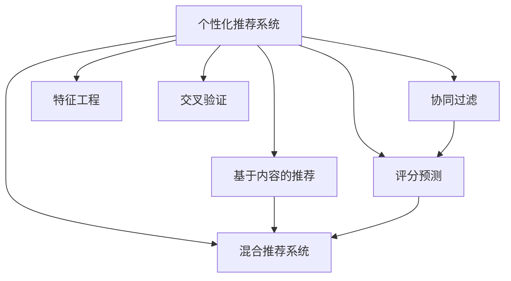

                 

# AI在个性化推荐方面的应用

> 关键词：个性化推荐,深度学习,协同过滤,基于内容的推荐,混合推荐系统,推荐算法,推荐系统,评分预测

## 1. 背景介绍

### 1.1 问题由来
随着互联网技术的飞速发展，用户从信息过载中得到了解放，但随之而来的是内容获取的多样化和个性化需求不断提升。与此同时，互联网公司也面临着内容制作的成本不断上升，如何有效提升内容推送的相关性和个性化程度，成为亟待解决的重要问题。

个性化推荐系统（Personalized Recommendation System, PRS）旨在根据用户的历史行为、兴趣偏好等数据，精准预测用户可能感兴趣的物品，从而实现更高效的物品推荐。这一技术不仅应用在电商、新闻、音乐、视频等多个领域，也在智能家居、医疗、金融等行业取得了重要进展。

### 1.2 问题核心关键点
当前个性化推荐系统主要依赖数据驱动的方法，通过收集用户行为数据，构建用户-物品交互的评分矩阵，来预测用户对物品的兴趣。其中，基于协同过滤、基于内容的推荐、混合推荐系统等算法是推荐系统的主流方法。但这些方法仍面临诸多挑战，如冷启动问题、数据稀疏性、特征维度高等。

## 2. 核心概念与联系

### 2.1 核心概念概述

为更好地理解个性化推荐系统的构建，本节将介绍几个关键概念：

- 个性化推荐系统(推荐系统)：根据用户行为或偏好，推荐可能感兴趣的新物品。其核心在于如何准确预测用户评分，从而确定物品的相关性。

- 协同过滤算法：基于用户-物品评分矩阵，通过计算相似度找到隐含的协同关系，推荐可能感兴趣的物品。主要包括基于用户的协同过滤和基于物品的协同过滤。

- 基于内容的推荐：利用物品的特征属性，通过计算物品与用户兴趣的相关性，来推荐新的物品。需要用户提供对物品的评分信息。

- 混合推荐系统：综合多种推荐算法，取长补短，提高推荐效果。常见的混合算法包括加权平均、基于学习的混合、层次混合等。

- 评分预测：通过学习评分模型，预测用户对物品的评分，从而确定物品的相关性。常用的评分模型包括线性模型、非线性模型、深度模型等。

- 特征工程：根据推荐任务的特点，提取、构建、组合、选择有效特征，提高推荐模型的准确性。包括用户特征、物品特征、环境特征等。

- 交叉验证：通过将数据集分成训练集和验证集，验证模型在不同数据集上的泛化能力，避免过拟合。

这些核心概念之间的逻辑关系可以通过以下Mermaid流程图来展示：



这个流程图展示了个性化推荐系统的核心概念及其之间的关系：

1. 个性化推荐系统通过评分预测算法，推荐用户可能感兴趣的新物品。
2. 协同过滤和基于内容的推荐是评分预测的两大核心算法。
3. 混合推荐系统通过融合多种推荐算法，提高推荐效果。
4. 特征工程对推荐算法的性能影响显著。
5. 交叉验证是验证推荐模型泛化能力的重要手段。

## 3. 核心算法原理 & 具体操作步骤
### 3.1 算法原理概述

个性化推荐系统的核心目标是通过评分预测，推荐用户可能感兴趣的物品。其本质是一个监督学习问题，即在用户-物品评分数据集上，通过学习评分模型，预测用户对新物品的评分。

形式化地，设用户集为 $U$，物品集为 $V$，用户-物品评分矩阵为 $R \in \mathbb{R}^{m \times n}$，其中 $m$ 为用户数，$n$ 为物品数，$r_{ui} \in [0,1]$ 表示用户 $u$ 对物品 $i$ 的评分。目标是最小化预测评分与真实评分之间的差距，即：

$$
\min_{\theta} \sum_{u \in U} \sum_{i \in V} (r_{ui} - f_{\theta}(u,i))^2
$$

其中 $f_{\theta}(u,i)$ 为评分预测模型，$\theta$ 为模型参数。

### 3.2 算法步骤详解

个性化推荐系统的构建一般包括以下几个关键步骤：

**Step 1: 准备数据集**
- 收集用户-物品评分数据 $R$，即用户对不同物品的评分。
- 将评分矩阵 $R$ 转化为稀疏矩阵，便于后续计算。

**Step 2: 特征工程**
- 提取用户特征 $X_u$ 和物品特征 $X_i$，如用户ID、物品ID、评分时间等。
- 构建高维特征向量，并将用户特征和物品特征拼接为 $X_{u,i} = [X_u, X_i]$。

**Step 3: 评分预测模型选择**
- 选择合适的评分预测模型，如线性模型、非线性模型、深度模型等。
- 使用评分预测模型对用户和物品的特征进行拟合，得到模型参数 $\theta$。

**Step 4: 推荐生成**
- 对于新物品 $v$，使用评分预测模型计算用户 $u$ 对物品 $v$ 的评分 $f_{\theta}(u,v)$。
- 对评分进行排序，推荐评分最高的 $k$ 个物品给用户 $u$。

**Step 5: 模型评估**
- 在测试集上评估推荐模型的效果，如使用准确率、召回率、F1分数等指标。
- 采用交叉验证等方法，验证模型的泛化能力，避免过拟合。

### 3.3 算法优缺点

个性化推荐系统具有以下优点：
1. 精度高。通过收集用户历史行为数据，可以较准确地预测用户对新物品的兴趣。
2. 实时性好。基于实时数据更新推荐结果，用户能够快速获得最新的推荐信息。
3. 个性化强。根据用户兴趣推荐个性化物品，满足用户的个性化需求。

同时，该方法也存在一些局限性：
1. 数据稀疏性。用户-物品评分矩阵往往稀疏，难以进行有效建模。
2. 冷启动问题。新用户和新物品缺乏足够的历史数据，难以推荐。
3. 特征维度高。高维稀疏特征难以直接应用到模型中。
4. 推荐多样性不足。推荐结果可能过于集中，用户体验单一。
5. 存在过拟合风险。模型复杂度高，容易在训练集上过拟合，泛化能力有限。

尽管存在这些局限性，但个性化推荐系统仍然是大数据时代的必然产物，对提升用户体验、降低电商成本具有重要意义。未来相关研究的方向包括提高推荐模型的泛化能力、增强推荐多样性、优化冷启动问题等。

### 3.4 算法应用领域

个性化推荐系统已经广泛应用于多个领域，包括但不限于：

- 电商：推荐用户可能感兴趣的商品，提高销售额和客户满意度。
- 新闻：推荐用户可能感兴趣的文章，增加用户的粘性和参与度。
- 音乐：推荐用户可能喜欢的音乐，提高音乐平台的留存率。
- 视频：推荐用户可能感兴趣的视频内容，增加视频平台的观看量。
- 金融：推荐用户可能感兴趣的理财产品，提高用户的理财收益。
- 医疗：推荐可能有效的治疗方案，提高诊疗效果。
- 游戏：推荐适合用户的游戏，提高游戏平台的活跃度。

除了上述这些经典应用外，个性化推荐系统还在社交网络、智能家居、供应链管理等多个领域得到了广泛应用，为数字化转型注入了新的动力。

## 4. 数学模型和公式 & 详细讲解 & 举例说明
### 4.1 数学模型构建

本节将使用数学语言对个性化推荐系统的构建进行更加严格的刻画。

设用户集为 $U$，物品集为 $V$，用户-物品评分矩阵为 $R \in \mathbb{R}^{m \times n}$，其中 $m$ 为用户数，$n$ 为物品数，$r_{ui} \in [0,1]$ 表示用户 $u$ 对物品 $i$ 的评分。假设模型 $f_{\theta}(u,i)$ 为线性模型，即：

$$
f_{\theta}(u,i) = \theta_0 + \theta_u^T X_u + \theta_i^T X_i
$$

其中 $\theta_0$ 为截距，$\theta_u$ 和 $\theta_i$ 分别为用户和物品的特征权重。

目标是最小化预测评分与真实评分之间的差距，即：

$$
\min_{\theta} \sum_{u \in U} \sum_{i \in V} (r_{ui} - f_{\theta}(u,i))^2
$$

### 4.2 公式推导过程

以下我们以协同过滤算法为例，推导评分预测模型的损失函数及其梯度的计算公式。

假设 $R_{u,i}$ 为用户 $u$ 对物品 $i$ 的评分，$N(u)$ 为与用户 $u$ 有交互的物品集合，$N(i)$ 为与物品 $i$ 有交互的用户集合。则基于用户的协同过滤评分预测模型为：

$$
\hat{r}_{ui} = \frac{1}{|\mathcal{N}(u)|} \sum_{j \in \mathcal{N}(u)} r_{uj} \cdot \hat{r}_{ji}
$$

其中 $\mathcal{N}(u) = \{j \in V | j \in N(u)\}$。

则预测评分的损失函数为：

$$
L(\theta) = -\frac{1}{|\mathcal{U}|} \sum_{u \in \mathcal{U}} \sum_{i \in \mathcal{V}} r_{ui} \log \hat{r}_{ui} + (1-r_{ui}) \log (1-\hat{r}_{ui})
$$

目标是最小化损失函数 $L(\theta)$。根据链式法则，损失函数对 $\theta$ 的梯度为：

$$
\nabla_{\theta}L(\theta) = -\frac{2}{|\mathcal{U}|} \sum_{u \in \mathcal{U}} \sum_{i \in \mathcal{V}} (r_{ui} - \hat{r}_{ui}) \nabla_{\theta} \hat{r}_{ui}
$$

其中 $\nabla_{\theta} \hat{r}_{ui}$ 为预测评分的梯度，可通过反向传播算法高效计算。

在得到损失函数的梯度后，即可带入优化算法进行迭代优化。重复上述过程直至收敛，最终得到评分预测模型的最优参数 $\theta^*$。

## 5. 项目实践：代码实例和详细解释说明
### 5.1 开发环境搭建

在进行个性化推荐系统开发前，我们需要准备好开发环境。以下是使用Python进行Scikit-learn开发的环境配置流程：

1. 安装Anaconda：从官网下载并安装Anaconda，用于创建独立的Python环境。

2. 创建并激活虚拟环境：
```bash
conda create -n prs-env python=3.8 
conda activate prs-env
```

3. 安装Scikit-learn：从官网获取对应的安装命令。例如：
```bash
conda install scikit-learn
```

4. 安装各类工具包：
```bash
pip install numpy pandas scikit-learn matplotlib tqdm jupyter notebook ipython
```

完成上述步骤后，即可在`prs-env`环境中开始个性化推荐系统的开发实践。

### 5.2 源代码详细实现

下面我们以协同过滤算法为例，给出使用Scikit-learn库对用户-物品评分数据进行预测的Python代码实现。

首先，定义协同过滤评分预测函数：

```python
from sklearn.metrics.pairwise import cosine_similarity
import numpy as np

def predict_ratings(model, u_index, v_indices):
    similarity = cosine_similarity(model[u_index], model)
    preds = similarity @ v_indices
    return preds / np.linalg.norm(similarity)
```

然后，加载评分数据集并构造模型：

```python
from sklearn.model_selection import train_test_split
from sklearn.metrics import mean_squared_error, mean_absolute_error
import pandas as pd

# 加载评分数据集
ratings = pd.read_csv('ratings.csv')

# 构造用户-物品评分矩阵
user_items = ratings.groupby('user_id').items().values
movie_users = ratings.groupby('movie_id').users.values
model = np.array(user_items)

# 分割数据集为训练集和测试集
train_indices, test_indices = train_test_split(np.arange(model.shape[0]), test_size=0.2, random_state=42)
train_model = model[train_indices]
test_model = model[test_indices]

# 定义评分预测函数
def predict_ratings(model, u_index, v_indices):
    similarity = cosine_similarity(model[u_index], model)
    preds = similarity @ v_indices
    return preds / np.linalg.norm(similarity)

# 在测试集上评估模型性能
train_u, train_v = train_model, train_model
test_u, test_v = test_model, test_model
train_ratings = ratings.iloc[train_indices].median()
test_ratings = ratings.iloc[test_indices].median()
train_preds = predict_ratings(train_u, train_v, train_v)
test_preds = predict_ratings(test_u, test_v, test_v)
mse = mean_squared_error(test_ratings, test_preds)
mae = mean_absolute_error(test_ratings, test_preds)
print(f"Mean Squared Error: {mse:.4f}")
print(f"Mean Absolute Error: {mae:.4f}")
```

以上代码实现了基于协同过滤的评分预测函数，使用Scikit-learn的余弦相似度计算用户-物品评分矩阵的相似度，并计算预测评分。

### 5.3 代码解读与分析

让我们再详细解读一下关键代码的实现细节：

**协同过滤评分预测函数**：
- 使用Scikit-learn的余弦相似度计算用户 $u$ 对物品 $v$ 的评分预测。
- 预测评分的计算公式为：$\hat{r}_{ui} = \frac{1}{|\mathcal{N}(u)|} \sum_{j \in \mathcal{N}(u)} r_{uj} \cdot \hat{r}_{ji}$。

**评分数据集加载和模型构造**：
- 通过Pandas库加载评分数据集，并进行数据清洗和分割。
- 将用户-物品评分矩阵转换为NumPy数组，方便进行余弦相似度计算。
- 使用Scikit-learn的train_test_split函数对数据集进行分割，得到训练集和测试集。

**评分预测函数**：
- 在训练集和测试集上分别计算评分预测，并使用Scikit-learn的mean_squared_error和mean_absolute_error函数评估模型性能。
- 输出均方误差和绝对误差，作为模型精度的评估指标。

**评分预测函数的优化**：
- 在实际应用中，可以进一步优化评分预测函数，如引入稀疏矩阵处理、矩阵因子分解等技术，提升模型效率和精度。

完成上述步骤后，即可在`prs-env`环境中进行个性化推荐系统的进一步开发。

## 6. 实际应用场景
### 6.1 电商推荐系统

个性化推荐系统在电商领域得到了广泛应用。通过收集用户的历史浏览、购买记录等行为数据，电商网站可以为用户提供个性化的商品推荐，提升用户的购买率和满意度。

具体而言，电商网站可以根据用户的购买历史和浏览行为，构建用户-物品评分矩阵。然后通过评分预测模型，对新商品进行评分预测，并根据预测结果进行排序推荐。对于用户首次访问网站的新商品，可以通过商品描述、用户画像等数据进行预评分，以解决冷启动问题。

### 6.2 新闻推荐系统

新闻平台通过个性化推荐系统，可以根据用户的阅读历史和兴趣偏好，推荐可能感兴趣的新闻文章。这不仅可以提高用户的阅读体验，还能增加平台的活跃度和留存率。

在实践中，新闻平台可以收集用户对不同新闻的阅读评分，并构建用户-物品评分矩阵。然后通过评分预测模型，对新文章进行评分预测，并根据预测结果进行排序推荐。同时，平台还可以引入文本分类、情感分析等技术，提高推荐的精准度和多样性。

### 6.3 视频推荐系统

视频平台通过个性化推荐系统，可以根据用户的观看历史和评分数据，推荐可能感兴趣的视频内容。这不仅可以提高用户的观看体验，还能增加平台的观看量和收益。

在实践中，视频平台可以收集用户对不同视频的观看评分，并构建用户-物品评分矩阵。然后通过评分预测模型，对新视频进行评分预测，并根据预测结果进行排序推荐。同时，平台还可以引入视频时长、观看历史等数据，提高推荐的准确性和多样性。

### 6.4 未来应用展望

随着个性化推荐系统的发展，未来其在更多领域的应用将进一步拓展。以下是几个可能的应用方向：

- 社交网络：根据用户的互动历史和社交网络关系，推荐可能感兴趣的朋友和内容。
- 医疗健康：根据患者的病史和健康数据，推荐可能有效的治疗方案和健康建议。
- 金融理财：根据用户的投资偏好和财务数据，推荐可能适合的理财产品。
- 智能家居：根据用户的居住习惯和设备使用情况，推荐可能感兴趣的家居物品和智能场景。
- 交通运输：根据用户的出行习惯和目的地，推荐可能适合的交通工具和路线。

这些应用方向展示了个性化推荐系统未来广阔的应用前景，为各行各业的数字化转型提供了新的技术手段。

## 7. 工具和资源推荐
### 7.1 学习资源推荐

为了帮助开发者系统掌握个性化推荐系统的理论基础和实践技巧，这里推荐一些优质的学习资源：

1. 《推荐系统》课程：斯坦福大学开设的推荐系统课程，系统讲解了推荐系统的基础理论和经典算法。

2. 《推荐系统实践》书籍：系统介绍推荐系统的构建和优化方法，适合实战开发。

3. Kaggle推荐系统竞赛：Kaggle平台上的推荐系统竞赛，通过实战练习提升推荐系统的实战能力。

4. 《深度学习推荐系统》论文：系统介绍深度学习在推荐系统中的应用，涵盖协同过滤、深度学习等方法。

5. Jigsaw推荐系统实验室：Google推出的推荐系统实验室，提供丰富的推荐系统开发工具和代码样例。

通过对这些资源的学习实践，相信你一定能够快速掌握个性化推荐系统的精髓，并用于解决实际的推荐问题。

### 7.2 开发工具推荐

高效的开发离不开优秀的工具支持。以下是几款用于个性化推荐系统开发的常用工具：

1. Scikit-learn：基于Python的机器学习库，简单易用，适合初学者入门。

2. TensorFlow：由Google主导开发的深度学习框架，灵活性高，适合大规模工程应用。

3. PyTorch：基于Python的开源深度学习框架，灵活动态的计算图，适合快速迭代研究。

4. Jupyter Notebook：免费的交互式开发环境，支持Python代码的快速执行和共享。

5. Apache Spark：分布式计算框架，适合处理大规模数据集，提升推荐系统的处理能力。

合理利用这些工具，可以显著提升个性化推荐系统的开发效率，加快创新迭代的步伐。

### 7.3 相关论文推荐

个性化推荐系统的发展源于学界的持续研究。以下是几篇奠基性的相关论文，推荐阅读：

1. ICML 2008: Factorization Machines for Learning Non-linear Feature Interactions：提出Factorization Machines算法，用于高效处理高维稀疏数据。

2. ICML 2016: Deep Coherent Attention for Recommendation Systems：提出Deep Coherent Attention模型，用于推荐系统的深度学习建模。

3. NIPS 2017: Hierarchical Probabilistic Matrix Factorization for Adaptive Nonlinear Matrix Factorization：提出Hierarchical Probabilistic Matrix Factorization，用于处理高阶非线性矩阵分解。

4. KDD 2018: A Deep Collaborative Approach for Recommendation with Multi-Aspect Contextual Embeddings：提出Multi-Aspect Contextual Embeddings，用于深度协作推荐。

5. CVPR 2019: High-Dimensional Deep Collaborative Filtering with Hierarchical Attentive Embeddings：提出Hierarchical Attentive Embeddings，用于高维深度协作推荐。

这些论文代表了个性化推荐系统的发展脉络。通过学习这些前沿成果，可以帮助研究者把握学科前进方向，激发更多的创新灵感。

## 8. 总结：未来发展趋势与挑战

### 8.1 总结

本文对个性化推荐系统的构建和优化进行了全面系统的介绍。首先阐述了推荐系统的背景和重要性，明确了推荐系统在电商、新闻、视频等多个领域的应用价值。其次，从原理到实践，详细讲解了协同过滤算法、评分预测模型等核心算法，给出了推荐系统的完整代码实现。同时，本文还探讨了推荐系统在多个行业领域的应用前景，展示了个性化推荐系统的巨大潜力。最后，本文精选了推荐系统的各类学习资源，力求为读者提供全方位的技术指引。

通过本文的系统梳理，可以看到，个性化推荐系统已经在电商、新闻、视频等多个领域取得了显著成效，提升了用户体验和平台收益。未来，伴随推荐算法的不断演进和应用场景的不断拓展，推荐系统必将在更多领域发挥重要作用，为数字化转型注入新的动力。

### 8.2 未来发展趋势

展望未来，个性化推荐系统的发展趋势将呈现以下几个方向：

1. 深度学习在推荐系统中的应用将不断深化。深度模型能够学习更丰富的特征表示，提升推荐系统的准确性和多样性。

2. 推荐系统将更多关注用户意图和行为的理解。基于自然语言处理技术，推荐系统将更准确地理解用户的兴趣和需求，提供更个性化、更精准的推荐。

3. 推荐系统的应用场景将更加广泛。推荐系统将应用于更多的垂直领域，如医疗、金融、交通等，提升各行各业的数字化水平。

4. 推荐系统将更多考虑用户隐私和数据安全。随着数据隐私保护意识的提升，推荐系统将更加注重用户数据的保护，避免过度采集和滥用。

5. 推荐系统的实时性将不断提升。推荐系统将更多采用流数据处理和实时推荐技术，提高推荐的时效性，提升用户体验。

6. 推荐系统的跨平台和跨设备推荐将变得更加普遍。推荐系统将实现跨设备、跨平台的用户行为跟踪和推荐，提升用户的整体体验。

以上趋势凸显了个性化推荐系统的广阔前景。这些方向的探索发展，必将进一步提升推荐系统的性能和应用范围，为数字化转型注入新的动力。

### 8.3 面临的挑战

尽管个性化推荐系统已经取得了显著成效，但在迈向更加智能化、普适化应用的过程中，它仍面临诸多挑战：

1. 数据隐私保护。推荐系统需要获取大量的用户行为数据，如何在保护用户隐私的前提下，实现高效推荐，是一个亟待解决的问题。

2. 数据稀疏性。用户-物品评分矩阵往往稀疏，难以进行有效建模。如何处理冷启动和数据稀疏性问题，是一个重要研究方向。

3. 模型复杂度。推荐模型的复杂度较高，容易在训练集上过拟合，泛化能力有限。如何降低模型复杂度，提升模型的泛化能力，是一个重要课题。

4. 推荐多样性。推荐结果可能过于集中，用户体验单一。如何增强推荐的多样性，提高用户的满意度，是一个需要重点关注的问题。

5. 系统实时性。推荐系统需要实时处理用户行为数据，更新推荐结果，对系统的实时性要求较高。如何在保证性能的前提下，提高系统的实时性，是一个重要挑战。

6. 系统可扩展性。推荐系统的应用场景和数据规模不断扩大，如何在保证系统稳定性的前提下，提高系统的可扩展性，是一个重要课题。

正视推荐系统面临的这些挑战，积极应对并寻求突破，将是个性化推荐系统走向成熟的必由之路。相信随着学界和产业界的共同努力，这些挑战终将一一被克服，推荐系统必将在构建人机协同的智能时代中扮演越来越重要的角色。

### 8.4 研究展望

面向未来，推荐系统的研究将在以下几个方向继续深入：

1. 深度学习在推荐系统中的应用将不断深化。深度模型能够学习更丰富的特征表示，提升推荐系统的准确性和多样性。

2. 推荐系统将更多关注用户意图和行为的理解。基于自然语言处理技术，推荐系统将更准确地理解用户的兴趣和需求，提供更个性化、更精准的推荐。

3. 推荐系统将更多考虑用户隐私和数据安全。随着数据隐私保护意识的提升，推荐系统将更加注重用户数据的保护，避免过度采集和滥用。

4. 推荐系统的应用场景将更加广泛。推荐系统将应用于更多的垂直领域，如医疗、金融、交通等，提升各行各业的数字化水平。

5. 推荐系统将更多采用流数据处理和实时推荐技术，提高推荐的时效性，提升用户体验。

6. 推荐系统的跨平台和跨设备推荐将变得更加普遍。推荐系统将实现跨设备、跨平台的用户行为跟踪和推荐，提升用户的整体体验。

这些方向的研究将进一步提升推荐系统的性能和应用范围，为数字化转型注入新的动力。通过不断的技术创新和应用实践，相信推荐系统将在更多领域发挥重要作用，为数字化转型注入新的动力。

## 9. 附录：常见问题与解答

**Q1：推荐系统是否适用于所有领域？**

A: 推荐系统在电商、新闻、音乐、视频等多个领域得到了广泛应用。但对于一些特定领域，如医疗、法律等，仅依靠用户行为数据进行推荐可能效果有限。此时需要在特定领域语料上进一步预训练，再进行微调，才能获得理想效果。

**Q2：推荐系统如何处理冷启动问题？**

A: 冷启动问题是个性化推荐系统的常见问题。一般有以下几种方法：
1. 利用已有数据进行预训练，提高新用户和新物品的评分预测准确性。
2. 引入稀疏矩阵处理方法，如矩阵分解、因子化等，减少数据稀疏性的影响。
3. 使用基于内容的推荐方法，结合物品的特征属性，提高推荐效果。

这些方法需要根据具体应用场景进行选择和优化，以实现最佳的推荐效果。

**Q3：推荐系统的实时性如何保证？**

A: 推荐系统的实时性是影响用户体验的重要因素。一般有以下几种方法：
1. 使用流数据处理技术，实时获取用户行为数据，动态更新推荐结果。
2. 采用分布式计算框架，如Apache Spark，提升推荐系统的处理能力。
3. 优化推荐算法，减少计算量，提高推荐效率。

这些方法需要根据具体应用场景进行灵活组合，以实现高效的实时推荐。

**Q4：推荐系统的跨平台和跨设备推荐如何实现？**

A: 推荐系统的跨平台和跨设备推荐需要考虑用户行为的跟踪和数据同步问题。一般有以下几种方法：
1. 使用统一的ID进行用户行为跟踪，确保不同平台和设备上的用户数据一致。
2. 使用分布式数据存储和处理技术，如Hadoop、Spark等，实现跨平台和跨设备的用户行为数据同步。
3. 引入联合推荐算法，如基于多兴趣模型的推荐，提升跨平台和跨设备的推荐效果。

这些方法需要根据具体应用场景进行灵活组合，以实现跨平台和跨设备的推荐。

通过本文的系统梳理，可以看到，个性化推荐系统已经成为数字化转型不可或缺的重要工具，为各行各业带来了显著的效益和提升。未来，伴随技术的不断进步和应用场景的不断拓展，推荐系统必将在更多领域发挥重要作用，为数字化转型注入新的动力。

