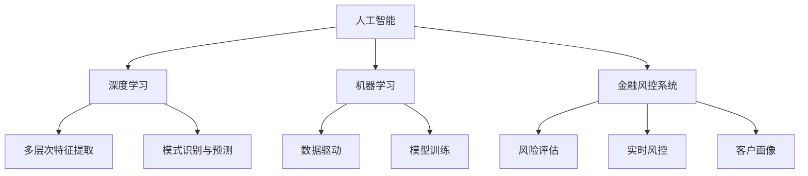
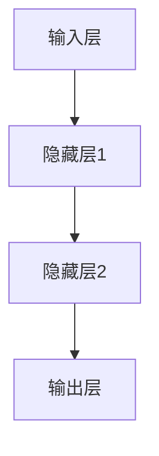

                 

# AI在个性化金融服务中的应用：风险评估

> 关键词：人工智能,风险评估,个性化金融服务,机器学习,深度学习,数据挖掘

## 1. 背景介绍

### 1.1 问题由来

在金融服务领域，风险评估是核心竞争力之一。传统的风险评估模型通常依赖于历史数据和经验规则，难以适应快速变化的金融市场。随着人工智能技术的发展，基于数据驱动和模型驱动的智能风控系统逐渐兴起，并通过深度学习和机器学习算法在客户准入、信用评估、欺诈检测等方面实现了显著的提升。

人工智能技术在金融风控中的应用，已成为各大金融机构数字化转型的重要方向。通过采用先进的AI技术，金融机构能够实现更高效、更精准、更个性化的风险评估，从而在激烈的市场竞争中占据优势。

### 1.2 问题核心关键点

- **数据驱动的风控系统**：通过大量历史数据训练机器学习模型，实现风险评估的自动化和智能化。
- **深度学习技术**：利用深度神经网络进行复杂特征的提取和模型训练，提升风险评估的精度和泛化能力。
- **个性化风险管理**：根据客户的行为数据、历史交易数据等多维度信息，实现精准的个性化风险评估。
- **实时化风控**：通过实时数据流分析，实现风控决策的实时化、动态化。
- **可解释性**：构建可解释的AI模型，使风控决策过程透明化，增强用户信任。

## 2. 核心概念与联系

### 2.1 核心概念概述

本节将介绍几个与AI在金融风控应用中风险评估密切相关的核心概念：

- **人工智能(AI)**：一种利用计算机模拟人类智能行为的技术，包括机器学习、深度学习、自然语言处理等子领域。
- **深度学习(Deep Learning)**：一种基于神经网络结构的机器学习方法，通过多层次特征提取，实现复杂的模式识别和预测。
- **机器学习(Machine Learning)**：通过数据驱动的模型训练，自动从数据中学习规律并进行预测的计算方法。
- **金融风控系统**：用于风险评估和管理的智能化系统，通过模型和算法识别和预测风险，实现风险控制。
- **客户画像**：通过多维度数据构建的客户特征概貌，用于个性化风险评估和精准营销。

这些核心概念之间的关系可以通过以下Mermaid流程图来展示：



这个流程图展示了几组概念之间的逻辑关系：

1. 人工智能是更广泛的技术领域，其中深度学习、机器学习是其核心方法。
2. 深度学习通过多层次特征提取和模式识别，实现复杂的预测和决策。
3. 金融风控系统依赖机器学习模型进行风险评估和决策。
4. 客户画像为个性化风险评估和精准营销提供数据基础。
5. 机器学习通过模型训练实现数据驱动的风控。

## 3. 核心算法原理 & 具体操作步骤

### 3.1 算法原理概述

基于AI的风险评估系统主要采用以下技术架构：

1. **数据预处理**：从多个数据源采集客户数据，并进行清洗、标准化和特征提取。
2. **模型训练**：通过历史数据训练机器学习模型，实现风险预测和评估。
3. **模型评估与优化**：使用交叉验证和测试集评估模型性能，根据评估结果优化模型。
4. **实时风控**：采用实时数据流分析技术，进行动态风险评估和决策。
5. **客户画像**：构建多维度客户特征概貌，用于个性化风险评估和精准营销。
6. **可解释性**：引入可解释性方法，使风险评估过程透明化，增强用户信任。

### 3.2 算法步骤详解

#### 3.2.1 数据预处理

1. **数据采集**：
   - 收集客户的基本信息、交易历史、行为数据、社交媒体信息等。
   - 确保数据质量，去除缺失值和异常值。

2. **数据标准化**：
   - 对不同数据类型进行标准化处理，如将日期类型数据转换为数字，进行数值归一化等。

3. **特征工程**：
   - 利用数据挖掘和统计方法提取有意义的特征。
   - 特征选择，剔除无关或弱相关的特征，保留对风险评估有帮助的特征。

4. **数据划分**：
   - 将数据集分为训练集、验证集和测试集，采用交叉验证等方法保证模型泛化能力。

#### 3.2.2 模型训练

1. **选择模型**：
   - 根据风险评估任务选择合适的机器学习或深度学习模型，如逻辑回归、随机森林、XGBoost、深度神经网络等。

2. **模型训练**：
   - 使用训练集训练模型，优化模型参数。
   - 设置合适的学习率、迭代次数和优化器。

3. **交叉验证**：
   - 使用交叉验证技术评估模型性能，防止过拟合。

4. **模型优化**：
   - 根据验证集性能调整模型参数，如正则化参数、特征提取方法等。
   - 进行超参数搜索，如网格搜索、随机搜索等。

#### 3.2.3 模型评估与优化

1. **评估指标**：
   - 使用AUC、精确率、召回率、F1-score等评估指标衡量模型性能。
   - 根据任务特点选择合适的评估指标。

2. **模型优化**：
   - 使用集成学习、Boosting等方法提升模型性能。
   - 引入可解释性方法，如LIME、SHAP等，提高模型的可解释性。

#### 3.2.4 实时风控

1. **数据采集**：
   - 实时采集客户交易数据、行为数据、社交媒体数据等。

2. **特征提取**：
   - 实时提取特征，如交易金额、频率、地点等。

3. **模型推理**：
   - 将实时数据输入模型，进行风险预测和评估。

4. **决策执行**：
   - 根据风险评估结果，自动执行风控决策，如预警、限制交易等。

#### 3.2.5 客户画像

1. **多维度数据采集**：
   - 收集客户的基本信息、交易历史、行为数据、社交媒体信息等。

2. **特征提取**：
   - 利用数据挖掘和统计方法提取有意义的特征。

3. **客户画像构建**：
   - 将多维度特征进行整合，构建客户特征概貌。

4. **画像应用**：
   - 利用客户画像进行个性化风险评估和精准营销。

#### 3.2.6 可解释性

1. **模型可解释性**：
   - 引入可解释性方法，如LIME、SHAP等，提高模型的可解释性。

2. **决策解释**：
   - 构建决策解释机制，使风险评估过程透明化，增强用户信任。

3. **反馈机制**：
   - 收集用户反馈，不断优化模型和解释机制。

### 3.3 算法优缺点

#### 3.3.1 优点

1. **高精度**：通过大量历史数据训练模型，能够实现高精度的风险评估。
2. **实时化**：采用实时数据流分析，实现动态风险评估和决策。
3. **可扩展性**：通过构建多维度客户画像，实现个性化风险评估和精准营销。
4. **自适应性**：基于数据驱动的模型，能够适应快速变化的金融市场。

#### 3.3.2 缺点

1. **数据依赖**：模型训练依赖于高质量、大样本量的数据，数据获取成本较高。
2. **模型复杂**：深度学习模型相对复杂，训练和部署成本较高。
3. **可解释性不足**：复杂模型往往难以解释其内部决策过程，用户信任度较低。
4. **过拟合风险**：在模型训练过程中，需注意防止过拟合，确保模型泛化能力。

## 4. 数学模型和公式 & 详细讲解 & 举例说明

### 4.1 数学模型构建

本节将使用数学语言对基于AI的风险评估系统进行更加严格的刻画。

记风险评估任务为二分类问题，即判断客户是否存在风险。设样本集 $D=\{(x_i,y_i)\}_{i=1}^N$，其中 $x_i$ 为输入特征向量，$y_i \in \{0,1\}$ 为标签（0表示低风险，1表示高风险）。

定义风险评估模型为 $M_{\theta}(x)$，其中 $\theta$ 为模型参数。风险评估的目标是最小化经验风险，即：

$$
\mathcal{L}(\theta) = \frac{1}{N} \sum_{i=1}^N \ell(M_{\theta}(x_i),y_i)
$$

其中 $\ell$ 为损失函数，如交叉熵损失：

$$
\ell(M_{\theta}(x_i),y_i) = -y_i\log M_{\theta}(x_i) - (1-y_i)\log (1-M_{\theta}(x_i))
$$

### 4.2 公式推导过程

以下我们以深度神经网络为例，推导模型训练过程和损失函数。

假设使用深度神经网络模型 $M_{\theta}$ 进行风险评估，其结构如图：



其中，隐藏层1和2分别包含若干神经元，输出层包含一个神经元，输出风险评估结果。

1. **前向传播**：
   - 输入样本 $x_i$ 通过网络逐层传递，计算出最终输出 $M_{\theta}(x_i)$。
   - 输出结果 $M_{\theta}(x_i)$ 用于计算损失函数。

2. **反向传播**：
   - 计算损失函数对模型参数的梯度。
   - 使用优化器更新模型参数，优化模型。

3. **模型训练**：
   - 循环迭代，每次更新一小批数据。
   - 使用交叉验证等方法评估模型性能。

### 4.3 案例分析与讲解

**案例1：欺诈检测**

在欺诈检测任务中，模型输入为客户的交易记录，标签为1表示欺诈，0表示正常。使用深度神经网络进行训练，计算交叉熵损失，进行反向传播优化模型参数。

**案例2：信用评分**

在信用评分任务中，模型输入为客户的信用历史数据，标签为1表示高风险客户，0表示低风险客户。使用逻辑回归进行训练，计算对数损失，进行梯度下降优化模型参数。

## 5. 项目实践：代码实例和详细解释说明

### 5.1 开发环境搭建

在进行风险评估项目开发前，我们需要准备好开发环境。以下是使用Python进行TensorFlow开发的完整环境配置流程：

1. 安装Anaconda：从官网下载并安装Anaconda，用于创建独立的Python环境。

2. 创建并激活虚拟环境：
```bash
conda create -n tf-env python=3.8 
conda activate tf-env
```

3. 安装TensorFlow：
```bash
pip install tensorflow-gpu
```

4. 安装各类工具包：
```bash
pip install numpy pandas scikit-learn matplotlib tqdm jupyter notebook ipython
```

完成上述步骤后，即可在`tf-env`环境中开始风险评估项目的开发。

### 5.2 源代码详细实现

以下是一个使用TensorFlow进行信用评分任务的代码实现：

```python
import tensorflow as tf
import numpy as np
from sklearn.datasets import load_breast_cancer
from sklearn.model_selection import train_test_split
from sklearn.preprocessing import StandardScaler
from sklearn.linear_model import LogisticRegression
from sklearn.metrics import roc_auc_score, roc_curve

# 加载数据集
data = load_breast_cancer()
X = data.data
y = data.target

# 数据标准化
scaler = StandardScaler()
X = scaler.fit_transform(X)

# 划分数据集
X_train, X_test, y_train, y_test = train_test_split(X, y, test_size=0.2, random_state=42)

# 定义模型
model = tf.keras.models.Sequential([
    tf.keras.layers.Dense(64, activation='relu', input_shape=(X_train.shape[1],)),
    tf.keras.layers.Dense(1, activation='sigmoid')
])

# 编译模型
model.compile(optimizer='adam', loss='binary_crossentropy', metrics=['AUC'])

# 训练模型
model.fit(X_train, y_train, epochs=50, batch_size=32, validation_data=(X_test, y_test))

# 评估模型
y_pred = model.predict(X_test)
roc_auc = roc_auc_score(y_test, y_pred)
fpr, tpr, thresholds = roc_curve(y_test, y_pred)

# 可视化ROC曲线
import matplotlib.pyplot as plt
plt.plot(fpr, tpr, color='darkorange', lw=2, label='ROC curve (area = %0.2f)' % roc_auc)
plt.plot([0, 1], [0, 1], color='navy', lw=2, linestyle='--')
plt.xlim([0.0, 1.0])
plt.ylim([0.0, 1.05])
plt.xlabel('False Positive Rate')
plt.ylabel('True Positive Rate')
plt.title('Receiver Operating Characteristic')
plt.legend(loc="lower right")
plt.show()
```

### 5.3 代码解读与分析

**数据加载与预处理**：
- 使用`load_breast_cancer`加载乳腺癌数据集，将数据进行标准化处理。
- 使用`train_test_split`将数据集分为训练集和测试集。

**模型定义与训练**：
- 定义一个包含两个全连接层的神经网络模型。
- 使用`compile`方法设置模型优化器和损失函数。
- 使用`fit`方法训练模型，设置训练轮数和批量大小。

**模型评估与可视化**：
- 使用`predict`方法预测测试集结果。
- 计算AUC值和ROC曲线。
- 使用`matplotlib`绘制ROC曲线。

## 6. 实际应用场景

### 6.1 智能投顾

在智能投顾系统中，基于AI的风险评估系统用于评估客户的投资风险和行为，帮助智能投顾系统进行个性化资产配置和风险控制。

具体而言，智能投顾系统收集客户的历史交易数据、行为数据、财务数据等，通过风险评估模型对客户进行风险打分。系统根据风险评分进行资产推荐和风险控制，从而实现精准化的投顾服务。

### 6.2 在线贷款

在线贷款平台基于AI的风险评估系统，对客户进行贷前审核和贷后监控。通过分析客户的信用历史、交易记录、社交行为等多维度数据，预测客户的还款能力和风险水平。系统根据评估结果，决定是否批准贷款申请，并对高风险客户进行实时监控和预警。

### 6.3 保险理赔

保险公司采用AI风险评估系统，对客户申请理赔的案件进行风险评估。系统分析客户的健康记录、历史理赔记录、生活习惯等多维度数据，预测理赔风险。根据评估结果，系统进行理赔审核和风险控制，从而提高理赔效率和准确性。

### 6.4 未来应用展望

随着AI技术的不断发展，基于AI的风险评估系统将在更多领域得到应用，为金融机构提供更强大的风险管理能力。

在智慧城市治理中，AI风险评估系统可用于公共安全监控、应急响应等领域，提升城市治理的智能化水平。在智慧农业中，系统可对农业生产风险进行评估，优化农业生产管理。在智慧医疗中，系统可对患者健康风险进行评估，优化医疗资源配置。

未来，随着更多AI技术的融入，基于AI的风险评估系统将在更广泛的领域发挥作用，为各行各业带来深远影响。

## 7. 工具和资源推荐

### 7.1 学习资源推荐

为了帮助开发者系统掌握AI在风险评估领域的应用，这里推荐一些优质的学习资源：

1. 《深度学习》（Goodfellow et al.）：介绍深度学习理论基础和实践方法，适合AI初学者和进阶者。
2. 《机器学习实战》（Peter Harrington）：通过实例演示机器学习模型的实现，适合实战练习。
3. 《TensorFlow官方文档》：TensorFlow的官方文档，提供丰富的API文档和样例代码。
4. Kaggle竞赛平台：丰富的数据集和模型竞赛，有助于实战练习和经验积累。
5. Coursera《深度学习专业》课程：由斯坦福大学Andrew Ng教授主讲的深度学习课程，系统讲解深度学习理论和方法。

通过这些资源的学习实践，相信你一定能够快速掌握AI在风险评估领域的应用，并用于解决实际的金融风控问题。

### 7.2 开发工具推荐

高效的开发离不开优秀的工具支持。以下是几款用于AI风险评估开发的常用工具：

1. TensorFlow：由Google主导开发的开源深度学习框架，生产部署方便，适合大规模工程应用。
2. PyTorch：基于Python的开源深度学习框架，灵活动态的计算图，适合快速迭代研究。
3. Scikit-learn：Python机器学习库，提供丰富的机器学习算法和工具。
4. Jupyter Notebook：交互式笔记本环境，方便代码调试和可视化。
5. Weights & Biases：模型训练的实验跟踪工具，可以记录和可视化模型训练过程中的各项指标，方便对比和调优。

合理利用这些工具，可以显著提升AI风险评估系统的开发效率，加快创新迭代的步伐。

### 7.3 相关论文推荐

AI风险评估技术的发展源于学界的持续研究。以下是几篇奠基性的相关论文，推荐阅读：

1. "Deep Learning for credit scoring: A review"（Zhou et al.）：综述了深度学习在信用评分中的应用，介绍了多种深度学习模型和方法。
2. "Fraud detection using deep learning: A comprehensive review"（Liu et al.）：介绍了深度学习在欺诈检测中的应用，分析了不同的深度学习模型和评估指标。
3. "A survey on AI-driven insurance fraud detection"（Wang et al.）：综述了AI在保险欺诈检测中的应用，介绍了多种AI技术和方法。
4. "A survey on deep learning for health risk prediction"（Chen et al.）：介绍了深度学习在健康风险预测中的应用，分析了不同的深度学习模型和数据处理方法。

这些论文代表了大规模风险评估技术的发展脉络。通过学习这些前沿成果，可以帮助研究者把握学科前进方向，激发更多的创新灵感。

## 8. 总结：未来发展趋势与挑战

### 8.1 总结

本文对基于AI的风险评估系统进行了全面系统的介绍。首先阐述了AI在金融风控领域的应用背景和意义，明确了风险评估在金融服务中的重要性。其次，从原理到实践，详细讲解了风险评估系统的核心算法和具体操作步骤，给出了完整的代码实例。同时，本文还广泛探讨了风险评估系统在智能投顾、在线贷款、保险理赔等多个金融场景中的应用前景，展示了AI在金融风控中的广阔前景。

通过本文的系统梳理，可以看到，基于AI的风险评估系统在提高金融服务效率、降低风险成本、提升用户体验等方面发挥了重要作用。未来，伴随AI技术的不断演进，风险评估系统将进一步提升其智能化、个性化、实时化水平，为金融行业的数字化转型提供有力支撑。

### 8.2 未来发展趋势

展望未来，AI风险评估系统将呈现以下几个发展趋势：

1. **自动化和智能化水平提升**：随着模型的不断优化和算法的进步，风险评估系统将进一步提高自动化和智能化水平，实现更精准的风险评估和决策。
2. **多模态数据的融合**：未来系统将融合更多类型的数据，如语音、视频、图像等，提升风险评估的全面性和准确性。
3. **实时化风控**：通过引入实时数据流处理技术，系统将实现更快速的风险评估和决策，提升应对突发事件的能力。
4. **个性化风控**：基于客户画像，系统将实现更精准的个性化风险评估，提供差异化的风险管理方案。
5. **可解释性增强**：引入可解释性技术，使风险评估过程透明化，增强用户信任。
6. **跨领域应用拓展**：基于风险评估系统的基础架构和技术，未来将拓展到更多行业领域，如医疗、智慧城市、农业等。

以上趋势凸显了AI风险评估系统的广阔前景。这些方向的探索发展，将进一步提升AI风险评估系统的性能和应用范围，为金融行业的数字化转型提供有力支撑。

### 8.3 面临的挑战

尽管AI风险评估技术已经取得了瞩目成就，但在迈向更加智能化、普适化应用的过程中，它仍面临着诸多挑战：

1. **数据隐私与安全**：收集和使用客户数据时，需注意数据隐私和安全问题，防止数据泄露和滥用。
2. **模型泛化能力不足**：在模型训练过程中，需注意防止过拟合，确保模型泛化能力。
3. **计算资源消耗**：大模型训练和推理过程中，需注意计算资源的消耗，防止资源浪费。
4. **模型复杂性**：深度学习模型相对复杂，训练和部署成本较高。
5. **可解释性不足**：复杂模型往往难以解释其内部决策过程，用户信任度较低。
6. **对抗攻击风险**：模型可能面临对抗攻击，需注意模型鲁棒性。

### 8.4 研究展望

面对AI风险评估面临的种种挑战，未来的研究需要在以下几个方面寻求新的突破：

1. **数据隐私保护**：采用差分隐私、联邦学习等技术，保护数据隐私和安全。
2. **模型优化与泛化**：引入正则化、对抗训练等方法，提升模型的泛化能力和鲁棒性。
3. **轻量级模型设计**：设计轻量级模型架构，减少计算资源消耗，降低训练和推理成本。
4. **模型可解释性**：引入可解释性技术，如LIME、SHAP等，提高模型的可解释性。
5. **对抗攻击防御**：采用对抗训练、鲁棒优化等方法，提升模型的鲁棒性。

这些研究方向的探索，将进一步提升AI风险评估系统的性能和应用范围，为金融行业的数字化转型提供有力支撑。相信随着学界和产业界的共同努力，这些挑战终将一一被克服，AI风险评估系统必将在构建安全、可靠、可解释、可控的智能系统方面发挥更大的作用。

## 9. 附录：常见问题与解答

**Q1：AI风险评估系统是否适用于所有金融场景？**

A: AI风险评估系统在大部分金融场景中都能取得不错的效果，特别是在数据量较大的场景中表现更好。但对于一些数据量较小或特定类型的金融场景，仍需结合领域知识进行人工干预和优化。

**Q2：在模型训练过程中，如何选择损失函数？**

A: 损失函数的选择应根据具体任务的特点和数据分布进行。常见的损失函数包括交叉熵损失、对数损失、均方误差等。对于分类任务，交叉熵损失通常是最优选择。

**Q3：模型训练过程中，如何防止过拟合？**

A: 防止过拟合的方法包括正则化、Dropout、早停等。具体而言，可以通过设置合适的正则化参数、引入Dropout层、设置早停机制等方式防止模型过拟合。

**Q4：在模型部署过程中，如何优化模型性能？**

A: 优化模型性能的方法包括模型裁剪、量化加速、服务化封装等。具体而言，可以通过去除不必要的层和参数、使用定点模型、封装为标准化服务接口等方式优化模型性能。

**Q5：如何构建可解释性强的AI风险评估系统？**

A: 构建可解释性强的AI风险评估系统的方法包括引入可解释性技术、构建决策解释机制、收集用户反馈等。具体而言，可以引入LIME、SHAP等可解释性技术，构建决策解释机制，并收集用户反馈，不断优化模型和解释机制。

通过本文的系统梳理，可以看到，基于AI的风险评估系统在提高金融服务效率、降低风险成本、提升用户体验等方面发挥了重要作用。未来，伴随AI技术的不断演进，风险评估系统将进一步提升其智能化、个性化、实时化水平，为金融行业的数字化转型提供有力支撑。

