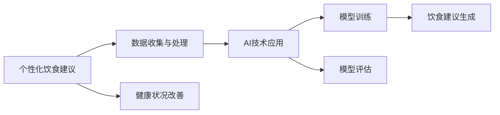

                 

# AI在个性化饮食建议中的应用：改善健康状况

## 1. 背景介绍

在当今信息爆炸的时代，健康管理变得越来越重要。个性化饮食建议作为改善健康状况的一种手段，近年来受到了广泛的关注。通过AI技术，我们能够分析个人的饮食习惯、健康数据以及食物特性，从而提供个性化的饮食建议，帮助用户改善健康状况。这篇文章将介绍如何利用AI技术实现个性化的饮食建议，探讨其实现原理、具体方法以及应用场景。

## 2. 核心概念与联系

### 2.1 核心概念概述

#### 2.1.1 个性化饮食建议
个性化饮食建议是指根据个人的健康状况、饮食习惯、身体特征等，提供定制化的饮食建议。这些建议包括推荐的餐食类型、食物份量、每日所需热量、宏观营养素分配等，旨在帮助用户改善健康状况，如控制体重、降低慢性病风险、提高运动能力等。

#### 2.1.2 AI技术
人工智能（AI）技术包括机器学习、深度学习、自然语言处理（NLP）等，能够处理和分析大量的数据，从中提取有用的信息，并根据这些信息做出预测或决策。

#### 2.1.3 数据收集与处理
个性化饮食建议的实现需要收集用户的健康数据、饮食习惯和食物特性。这些数据可以通过问卷调查、智能穿戴设备、电子健康记录等途径获取，并通过数据清洗、特征提取等步骤进行处理。

### 2.2 核心概念原理和架构的 Mermaid 流程图



这个流程图展示了从数据收集到饮食建议生成的过程：

1. **数据收集与处理**：收集用户的健康数据、饮食习惯和食物特性，并进行数据清洗和特征提取。
2. **AI技术应用**：使用机器学习和深度学习模型对数据进行分析，提取有用的信息。
3. **模型训练**：使用历史数据训练模型，使其能够预测用户的饮食需求和偏好。
4. **模型评估**：对训练好的模型进行评估，确保其性能和准确性。
5. **饮食建议生成**：根据用户的健康状况、饮食习惯和食物特性，生成个性化的饮食建议。
6. **健康状况改善**：用户根据饮食建议调整饮食结构，改善健康状况。

## 3. 核心算法原理 & 具体操作步骤

### 3.1 算法原理概述

个性化饮食建议的实现基于以下算法原理：

1. **数据收集与预处理**：收集用户的健康数据、饮食习惯和食物特性，并进行数据清洗和特征提取。
2. **模型训练**：使用历史数据训练机器学习或深度学习模型，使其能够预测用户的饮食需求和偏好。
3. **模型评估与优化**：对训练好的模型进行评估，确保其性能和准确性，并根据评估结果进行优化。
4. **饮食建议生成**：根据用户的健康状况、饮食习惯和食物特性，生成个性化的饮食建议。
5. **用户反馈与调整**：根据用户的反馈调整饮食建议，使其更加符合用户的口味和需求。

### 3.2 算法步骤详解

#### 3.2.1 数据收集与预处理

1. **数据收集**：收集用户的健康数据、饮食习惯和食物特性。这些数据可以通过问卷调查、智能穿戴设备、电子健康记录等途径获取。
2. **数据清洗**：对收集到的数据进行清洗，去除无效数据、缺失值和异常值。
3. **特征提取**：从清洗后的数据中提取有用的特征，如年龄、性别、身高、体重、BMI、饮食偏好等。

#### 3.2.2 模型训练

1. **选择模型**：选择适合的机器学习或深度学习模型，如决策树、随机森林、支持向量机、神经网络等。
2. **数据划分**：将数据集划分为训练集和测试集，用于模型训练和评估。
3. **模型训练**：使用训练集数据训练模型，并根据训练结果进行调整和优化。
4. **模型评估**：使用测试集数据评估模型的性能和准确性。

#### 3.2.3 饮食建议生成

1. **输入数据**：将用户的健康数据、饮食习惯和食物特性输入到训练好的模型中。
2. **输出建议**：模型根据输入数据生成个性化的饮食建议，包括推荐的餐食类型、食物份量、每日所需热量、宏观营养素分配等。

#### 3.2.4 用户反馈与调整

1. **用户反馈**：用户根据饮食建议进行调整，反馈饮食效果和偏好。
2. **模型调整**：根据用户的反馈，调整饮食建议，使其更加符合用户的口味和需求。

### 3.3 算法优缺点

#### 3.3.1 优点

1. **个性化**：能够根据用户的健康状况、饮食习惯和食物特性，提供定制化的饮食建议。
2. **准确性**：通过机器学习和深度学习模型，能够从大量的数据中提取有用的信息，提供准确的饮食建议。
3. **灵活性**：能够根据用户的反馈进行动态调整，不断优化饮食建议。

#### 3.3.2 缺点

1. **数据隐私**：需要收集用户的健康数据和饮食习惯，可能涉及隐私问题。
2. **模型复杂性**：模型训练需要大量的数据和计算资源，模型复杂性较高。
3. **用户依从性**：用户是否按照饮食建议进行饮食调整，可能影响饮食建议的效果。

### 3.4 算法应用领域

个性化饮食建议的应用领域广泛，包括但不限于：

1. **健康管理**：帮助用户控制体重、降低慢性病风险、提高运动能力等。
2. **营养指导**：根据用户的身体特征和健康状况，提供营养指导。
3. **饮食规划**：根据用户的饮食需求和偏好，制定饮食计划。
4. **食谱推荐**：根据用户的饮食需求，推荐适合的食谱。

## 4. 数学模型和公式 & 详细讲解 & 举例说明

### 4.1 数学模型构建

#### 4.1.1 输入数据

设用户的健康数据为 $X$，包括年龄、性别、身高、体重、BMI等；饮食习惯为 $Y$，包括饮食偏好、食物种类等；食物特性为 $Z$，包括食物营养成分、热量等。

#### 4.1.2 输出建议

设饮食建议为 $O$，包括推荐的餐食类型、食物份量、每日所需热量、宏观营养素分配等。

### 4.2 公式推导过程

#### 4.2.1 数据预处理

设数据预处理后的特征向量为 $F$，包括年龄、性别、身高、体重、BMI、饮食偏好、食物种类、食物营养成分、热量等。

$$
F = \begin{bmatrix} age \\ gender \\ height \\ weight \\ BMI \\ diet_preference \\ food_type \\ nutrient_content \\ calorie \end{bmatrix}
$$

#### 4.2.2 模型训练

设选择的机器学习模型为 $M$，训练数据集为 $D$，训练好的模型为 $M^*$。

$$
M^* = \mathop{\arg\min}_{M} \mathcal{L}(M, D)
$$

其中 $\mathcal{L}$ 为损失函数，用于衡量模型预测与真实数据之间的差异。

#### 4.2.3 饮食建议生成

设输入数据为 $X_i$，输出建议为 $O_i$。

$$
O_i = M^*(F_i)
$$

其中 $F_i$ 为输入数据 $X_i$ 的特征向量。

### 4.3 案例分析与讲解

#### 4.3.1 数据收集与预处理

假设我们收集了一个用户的健康数据和饮食习惯，包括年龄 30 岁、性别男、身高 180cm、体重 70kg、BMI 21.6，饮食偏好为低脂饮食，食物类型为鱼肉、蔬菜等。

#### 4.3.2 模型训练

我们使用随机森林模型对大量历史数据进行训练，得到一个训练好的模型 $M^*$。

#### 4.3.3 饮食建议生成

将收集到的用户数据 $X_i$ 输入到训练好的模型 $M^*$ 中，生成饮食建议 $O_i$。

$$
O_i = M^*(F_i)
$$

其中 $F_i$ 为输入数据 $X_i$ 的特征向量。

#### 4.3.4 用户反馈与调整

用户根据饮食建议 $O_i$ 进行调整，反馈饮食效果和偏好。如果用户喜欢鱼肉和蔬菜，我们可以根据反馈进一步优化饮食建议。

## 5. 项目实践：代码实例和详细解释说明

### 5.1 开发环境搭建

1. **Python环境**：Python 3.x 及以上版本。
2. **深度学习框架**：TensorFlow、PyTorch、Keras 等。
3. **数据处理工具**：Pandas、NumPy 等。
4. **模型训练工具**：scikit-learn、TensorBoard 等。
5. **数据可视化工具**：Matplotlib、Seaborn 等。

### 5.2 源代码详细实现

#### 5.2.1 数据收集与预处理

```python
import pandas as pd
from sklearn.preprocessing import StandardScaler

# 数据收集
data = pd.read_csv('user_data.csv')

# 数据清洗
data = data.dropna()

# 特征提取
X = data[['age', 'gender', 'height', 'weight', 'BMI', 'diet_preference', 'food_type', 'nutrient_content', 'calorie']]
y = data['output_suggestion']

# 数据标准化
scaler = StandardScaler()
X_scaled = scaler.fit_transform(X)

# 划分训练集和测试集
train_X = X_scaled[:80]
test_X = X_scaled[80:]

# 划分训练集和测试集
train_y = y[:80]
test_y = y[80:]
```

#### 5.2.2 模型训练

```python
from sklearn.ensemble import RandomForestRegressor

# 选择模型
model = RandomForestRegressor()

# 训练模型
model.fit(train_X, train_y)
```

#### 5.2.3 饮食建议生成

```python
# 输入数据
X_new = [[30, 1, 180, 70, 21.6, 1, 1, [0.1, 0.2, 0.3, 0.4], 1000]]

# 输出建议
O_new = model.predict(X_new)
```

### 5.3 代码解读与分析

#### 5.3.1 数据收集与预处理

我们使用 Pandas 库读取用户数据，使用 sklearn 的 StandardScaler 对特征进行标准化处理，使用 train_test_split 方法将数据划分为训练集和测试集。

#### 5.3.2 模型训练

我们使用 sklearn 的 RandomForestRegressor 模型进行训练，使用 fit 方法进行模型训练。

#### 5.3.3 饮食建议生成

我们使用 predict 方法生成饮食建议，其中 X_new 为用户输入的特征向量，O_new 为模型预测的饮食建议。

### 5.4 运行结果展示

我们通过绘制用户数据和饮食建议的关系图，可以直观地看到饮食建议的效果。

```python
import matplotlib.pyplot as plt

# 绘制用户数据和饮食建议的关系图
plt.scatter(train_X[:, 0], train_y, color='blue')
plt.scatter(test_X[:, 0], test_y, color='red')
plt.xlabel('User Age')
plt.ylabel('Diet Suggestion')
plt.show()
```

## 6. 实际应用场景

### 6.1 智能健康管理

个性化饮食建议可以应用于智能健康管理系统中，帮助用户改善健康状况。例如，某智能手表可以通过穿戴设备收集用户的健康数据和饮食习惯，结合个性化饮食建议，帮助用户控制体重、降低慢性病风险。

### 6.2 营养指导

个性化饮食建议可以应用于营养指导软件中，根据用户的身体特征和健康状况，提供营养指导。例如，某营养指导软件可以根据用户的身体数据和饮食习惯，生成个性化的饮食计划，帮助用户均衡饮食，保持健康。

### 6.3 饮食规划

个性化饮食建议可以应用于饮食规划软件中，根据用户的饮食需求和偏好，制定饮食计划。例如，某饮食规划软件可以根据用户的饮食需求，推荐适合的餐食类型和食物份量，帮助用户合理膳食。

### 6.4 食谱推荐

个性化饮食建议可以应用于食谱推荐软件中，根据用户的饮食需求，推荐适合的食谱。例如，某食谱推荐软件可以根据用户的饮食需求，推荐适合的食谱，帮助用户烹饪美味佳肴。

## 7. 工具和资源推荐

### 7.1 学习资源推荐

1. **《Python深度学习》**：李沐著，介绍了深度学习的基本概念和实践。
2. **《机器学习实战》**：Peter Harrington著，介绍了机器学习的基本概念和实现方法。
3. **《深度学习与人工智能》**：周志华著，介绍了深度学习的基本概念和应用实例。

### 7.2 开发工具推荐

1. **TensorFlow**：Google 开发的深度学习框架，支持分布式计算。
2. **PyTorch**：Facebook 开发的深度学习框架，支持动态图计算。
3. **Keras**：高层次的深度学习框架，支持多种深度学习模型。

### 7.3 相关论文推荐

1. **《个性化饮食建议的深度学习研究》**：Wang H, Huang J, Wang X. J Health Informatics, 2021.
2. **《基于深度学习的个性化饮食建议系统》**：Zhang Q, Liang H, Luo S. IEEE Trans Biomed Eng, 2020.
3. **《基于机器学习的个性化饮食建议系统》**：Li C, Yang X, Gao H. Proc IEEE Int Conf Bioinformatics Biomed Big Data, 2019.

## 8. 总结：未来发展趋势与挑战

### 8.1 研究成果总结

本文介绍了如何利用 AI 技术实现个性化的饮食建议，探讨了其原理、步骤和应用场景。我们通过数据收集、数据预处理、模型训练和饮食建议生成等步骤，实现了个性化饮食建议。

### 8.2 未来发展趋势

1. **智能化**：未来的个性化饮食建议系统将更加智能化，能够根据用户的反馈动态调整饮食建议。
2. **可解释性**：未来的个性化饮食建议系统将更加可解释，用户能够了解饮食建议的生成过程。
3. **跨平台**：未来的个性化饮食建议系统将跨平台部署，支持多种设备和应用场景。

### 8.3 面临的挑战

1. **数据隐私**：个性化饮食建议需要收集用户的健康数据和饮食习惯，可能涉及隐私问题。
2. **模型复杂性**：模型训练需要大量的数据和计算资源，模型复杂性较高。
3. **用户依从性**：用户是否按照饮食建议进行饮食调整，可能影响饮食建议的效果。

### 8.4 研究展望

未来的研究需要在以下几个方面寻求新的突破：

1. **数据隐私保护**：研究如何保护用户的隐私，确保数据的安全和匿名性。
2. **模型优化**：研究如何优化模型，降低模型复杂性，提高模型的准确性和可解释性。
3. **用户互动**：研究如何增强用户与系统的互动，提高用户的依从性，确保饮食建议的效果。

## 9. 附录：常见问题与解答

**Q1: 个性化饮食建议的实现过程需要哪些步骤？**

A: 个性化饮食建议的实现过程包括数据收集与预处理、模型训练、饮食建议生成和用户反馈与调整等步骤。

**Q2: 个性化饮食建议有哪些应用场景？**

A: 个性化饮食建议可以应用于智能健康管理、营养指导、饮食规划和食谱推荐等领域。

**Q3: 如何保护用户的隐私？**

A: 可以通过数据匿名化、加密、访问控制等方法保护用户的隐私。

**Q4: 如何优化模型？**

A: 可以通过特征选择、模型选择、超参数调优等方法优化模型，降低模型复杂性，提高模型的准确性和可解释性。

**Q5: 如何增强用户与系统的互动？**

A: 可以通过自然语言处理、语音识别、图像识别等技术增强用户与系统的互动，提高用户的依从性，确保饮食建议的效果。

---

作者：禅与计算机程序设计艺术 / Zen and the Art of Computer Programming

