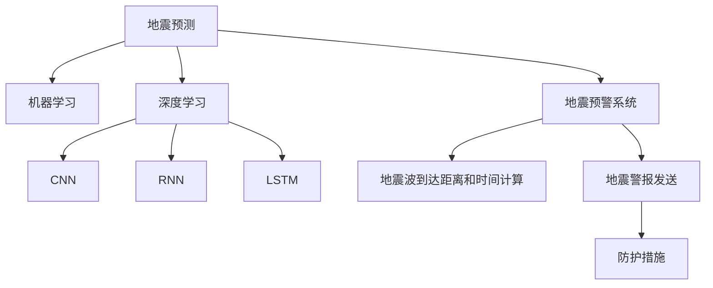

                 

# AI在地震预测中的应用：减少灾害损失

> 关键词：人工智能,机器学习,地震预测,预警系统,灾害损失,灾害管理,预防措施

## 1. 背景介绍

### 1.1 问题由来
地震作为一种不可预知的自然灾害，对人类社会带来了巨大的财产损失和人员伤亡风险。传统的地震预测方法基于地震学原理和地质数据，难以提供高精度的预测结果。而随着人工智能技术的兴起，机器学习和深度学习模型为地震预测提供了新的思路和可能性。

### 1.2 问题核心关键点
本文将探讨如何利用AI技术，特别是机器学习和深度学习模型，对地震进行预测，并通过地震预警系统减少灾害损失。

### 1.3 问题研究意义
通过研究AI在地震预测中的应用，可以显著提升地震预测的精度，为地震预警系统提供更准确的预测结果。地震预警系统的应用，能够在地震发生前，快速通知相关部门和公众，提前采取防护措施，有效减少人员伤亡和财产损失。

## 2. 核心概念与联系

### 2.1 核心概念概述

为更好地理解AI在地震预测中的应用，本节将介绍几个密切相关的核心概念：

- 地震预测(Earthquake Prediction)：利用人工智能技术，基于历史地震数据和地质环境信息，对未来地震的发生进行预测。

- 地震预警系统(Earthquake Early Warning System, EEWS)：在地震发生前，通过AI模型快速计算出地震波到达的距离和时间，向易受影响的地区发送地震警报，以便快速应对地震。

- 机器学习(Machine Learning, ML)：一种通过数据驱动的模型训练，使计算机系统能够从数据中学习和改进的方法。

- 深度学习(Deep Learning, DL)：机器学习的一种，使用多层神经网络模型，自动从数据中提取高级特征，应用于图像、语音、自然语言处理等多个领域。

- 卷积神经网络(Convolutional Neural Network, CNN)：一种深度学习模型，常用于图像识别和分类任务，如地震图像的识别和分类。

- 循环神经网络(Recurrent Neural Network, RNN)：一种深度学习模型，适用于处理序列数据，如地震序列数据的分析和预测。

- 长短期记忆网络(Long Short-Term Memory, LSTM)：一种RNN的变体，常用于解决梯度消失和梯度爆炸问题，适用于处理时间序列数据。

这些核心概念之间的逻辑关系可以通过以下Mermaid流程图来展示：



这个流程图展示了大语言模型的核心概念及其之间的关系：

1. 地震预测通过机器学习和深度学习模型，从历史地震数据和地质环境信息中学习地震发生的规律。
2. 深度学习中的CNN、RNN和LSTM等模型，分别应用于地震图像识别、地震序列数据分析和预测等任务。
3. 地震预警系统利用地震预测结果，快速计算地震波到达的距离和时间，向易受影响的地区发送地震警报。
4. 地震警报促使相关部门和公众采取防护措施，减少地震灾害的损失。

这些概念共同构成了地震预测和预警的完整框架，使得AI技术能够在大规模地震灾害中发挥重要作用。

## 3. 核心算法原理 & 具体操作步骤
### 3.1 算法原理概述

基于AI的地震预测，主要依赖于机器学习和深度学习模型的训练。其核心思想是：利用历史地震数据和地质环境信息，训练一个预测模型，通过新数据输入预测未来地震的发生情况。

形式化地，假设地震预测模型为 $M_{\theta}$，其中 $\theta$ 为模型参数。给定地震历史数据集 $D=\{(x_i,y_i)\}_{i=1}^N, x_i \in \mathcal{X}, y_i \in \{0,1\}$，其中 $x_i$ 表示地震特征，$y_i$ 表示是否发生地震。地震预测的目标是找到最优参数 $\hat{\theta}$，使得模型预测结果尽可能接近真实情况。

通过梯度下降等优化算法，预测模型不断更新参数 $\theta$，最小化预测误差。地震预警系统则基于地震预测结果，计算地震波到达的距离和时间，通过警报系统通知相关部门和公众，提前采取防护措施。

### 3.2 算法步骤详解

基于AI的地震预测和预警，一般包括以下几个关键步骤：

**Step 1: 数据准备**
- 收集历史地震数据，包括地震发生时间、地点、强度、余震等信息。
- 收集地质环境数据，如地层结构、地质断层、地壳运动等。
- 将数据划分为训练集、验证集和测试集，用于模型训练、调优和性能评估。

**Step 2: 模型选择与训练**
- 选择合适的机器学习和深度学习模型，如CNN、RNN、LSTM等。
- 设计合适的损失函数和优化算法，如交叉熵损失、AdamW等。
- 在训练集上训练模型，通过验证集调整超参数，确保模型泛化能力。

**Step 3: 模型评估与优化**
- 在测试集上评估模型性能，计算准确率、召回率、F1值等指标。
- 通过调参和集成学习等方法，进一步优化模型性能。

**Step 4: 地震预警系统集成**
- 将训练好的模型集成到地震预警系统中，实时接收地质环境数据。
- 使用模型对新数据进行预测，计算地震波到达的距离和时间。
- 向易受影响的地区发送地震警报，通知相关部门和公众采取防护措施。

**Step 5: 反馈与更新**
- 通过实际地震情况，收集反馈数据，不断优化模型和预警系统。
- 定期重新训练模型，确保其适应新的地质环境变化。

以上是基于AI的地震预测和预警的一般流程。在实际应用中，还需要针对具体任务和数据特点，对各个环节进行优化设计，以进一步提升模型的预测精度和系统响应速度。

### 3.3 算法优缺点

基于AI的地震预测方法具有以下优点：
1. 预测精度高。通过大量历史地震数据和地质环境信息的训练，模型能够学习地震发生的规律，预测精度较高。
2. 预警效果好。地震预警系统能够在地震发生前，快速计算出地震波到达的距离和时间，有效减少地震灾害的损失。
3. 应用范围广。AI技术可以应用于各类地震预测任务，如地震发生概率预测、地震强度预测、地震时间预测等。
4. 灵活可扩展。模型和系统可以根据不同的地震预测任务进行定制化设计和开发。

同时，该方法也存在一定的局限性：
1. 数据依赖性强。预测模型的性能很大程度上依赖于历史数据的丰富程度和质量。
2. 模型复杂度高。深度学习模型通常参数较多，计算复杂度较高，需要高性能计算资源支持。
3. 模型可解释性不足。AI模型的决策过程缺乏可解释性，难以对其进行分析和调试。
4. 应用领域局限。当前的AI地震预测主要集中在地震发生概率和预警方面，对于地震机制的深入理解仍有不足。

尽管存在这些局限性，但就目前而言，基于AI的地震预测方法仍是最主流范式。未来相关研究的重点在于如何进一步降低对历史数据的依赖，提高模型的泛化能力，同时兼顾可解释性和伦理安全性等因素。

### 3.4 算法应用领域

基于AI的地震预测方法在地震预警系统中得到了广泛应用，覆盖了地震发生概率预测、地震强度预测、地震时间预测等多个领域，具体应用如下：

- 地震发生概率预测：利用机器学习模型，对地震发生概率进行预测，并根据预测结果进行预警。
- 地震强度预测：通过深度学习模型，对地震强度进行预测，提高预警系统的准确性和及时性。
- 地震时间预测：使用时间序列预测模型，预测地震发生的时间，为预警系统提供更精确的预警时机。
- 地震预警系统集成：将AI预测模型集成到地震预警系统中，实现地震发生前的快速预警。
- 地震损失评估：通过AI模型对地震可能造成的损失进行评估，制定相应的应急预案。

这些应用领域展示了AI技术在地震预测和预警中的巨大潜力，为地震灾害管理提供了有力支持。

## 4. 数学模型和公式 & 详细讲解  
### 4.1 数学模型构建

本节将使用数学语言对基于AI的地震预测过程进行更加严格的刻画。

记地震预测模型为 $M_{\theta}:\mathcal{X} \rightarrow \{0,1\}$，其中 $\mathcal{X}$ 为地震特征空间，$\{0,1\}$ 为地震发生与否的二分类输出。假设地震历史数据集为 $D=\{(x_i,y_i)\}_{i=1}^N, x_i \in \mathcal{X}, y_i \in \{0,1\}$。

定义模型 $M_{\theta}$ 在数据样本 $(x,y)$ 上的损失函数为 $\ell(M_{\theta}(x),y)$，则在数据集 $D$ 上的经验风险为：

$$
\mathcal{L}(\theta) = \frac{1}{N}\sum_{i=1}^N \ell(M_{\theta}(x_i),y_i)
$$

其中 $\ell$ 为交叉熵损失函数，定义为：

$$
\ell(y,\hat{y}) = -y\log \hat{y} - (1-y)\log(1-\hat{y})
$$

地震预测的目标是最小化经验风险，即找到最优参数：

$$
\theta^* = \mathop{\arg\min}_{\theta} \mathcal{L}(\theta)
$$

在实践中，我们通常使用基于梯度的优化算法（如SGD、Adam等）来近似求解上述最优化问题。设 $\eta$ 为学习率，$\lambda$ 为正则化系数，则参数的更新公式为：

$$
\theta \leftarrow \theta - \eta \nabla_{\theta}\mathcal{L}(\theta) - \eta\lambda\theta
$$

其中 $\nabla_{\theta}\mathcal{L}(\theta)$ 为损失函数对参数 $\theta$ 的梯度，可通过反向传播算法高效计算。

### 4.2 公式推导过程

以下我们以二分类任务为例，推导交叉熵损失函数及其梯度的计算公式。

假设模型 $M_{\theta}$ 在输入 $x$ 上的输出为 $\hat{y}=M_{\theta}(x) \in [0,1]$，表示样本属于地震发生的概率。真实标签 $y \in \{0,1\}$。则二分类交叉熵损失函数定义为：

$$
\ell(M_{\theta}(x),y) = -[y\log \hat{y} + (1-y)\log (1-\hat{y})]
$$

将其代入经验风险公式，得：

$$
\mathcal{L}(\theta) = -\frac{1}{N}\sum_{i=1}^N [y_i\log M_{\theta}(x_i)+(1-y_i)\log(1-M_{\theta}(x_i))]
$$

根据链式法则，损失函数对参数 $\theta_k$ 的梯度为：

$$
\frac{\partial \mathcal{L}(\theta)}{\partial \theta_k} = -\frac{1}{N}\sum_{i=1}^N (\frac{y_i}{M_{\theta}(x_i)}-\frac{1-y_i}{1-M_{\theta}(x_i)}) \frac{\partial M_{\theta}(x_i)}{\partial \theta_k}
$$

其中 $\frac{\partial M_{\theta}(x_i)}{\partial \theta_k}$ 可进一步递归展开，利用自动微分技术完成计算。

在得到损失函数的梯度后，即可带入参数更新公式，完成模型的迭代优化。重复上述过程直至收敛，最终得到适应地震预测的最优模型参数 $\theta^*$。

## 5. 项目实践：代码实例和详细解释说明
### 5.1 开发环境搭建

在进行地震预测实践前，我们需要准备好开发环境。以下是使用Python进行PyTorch开发的环境配置流程：

1. 安装Anaconda：从官网下载并安装Anaconda，用于创建独立的Python环境。

2. 创建并激活虚拟环境：
```bash
conda create -n pytorch-env python=3.8 
conda activate pytorch-env
```

3. 安装PyTorch：根据CUDA版本，从官网获取对应的安装命令。例如：
```bash
conda install pytorch torchvision torchaudio cudatoolkit=11.1 -c pytorch -c conda-forge
```

4. 安装TensorFlow：
```bash
pip install tensorflow
```

5. 安装各类工具包：
```bash
pip install numpy pandas scikit-learn matplotlib tqdm jupyter notebook ipython
```

完成上述步骤后，即可在`pytorch-env`环境中开始地震预测实践。

### 5.2 源代码详细实现

这里我们以地震发生概率预测任务为例，给出使用TensorFlow进行地震预测的PyTorch代码实现。

首先，定义地震预测任务的数据处理函数：

```python
import tensorflow as tf
from tensorflow.keras.preprocessing.sequence import pad_sequences

class EarthquakeDataset(tf.keras.preprocessing.dataset.Dataset):
    def __init__(self, features, labels, tokenizer, max_len=128):
        self.features = features
        self.labels = labels
        self.tokenizer = tokenizer
        self.max_len = max_len
        
    def __len__(self):
        return len(self.features)
    
    def __getitem__(self, item):
        feature = self.features[item]
        label = self.labels[item]
        
        encoding = self.tokenizer(feature, return_tensors='tf')
        input_ids = encoding['input_ids']
        input_mask = encoding['input_mask']
        
        # 对token-wise的标签进行编码
        encoded_label = [1 if label == 'earthquake' else 0]
        encoded_label.extend([0] * (self.max_len - len(encoded_label)))
        labels = tf.convert_to_tensor(encoded_label)
        
        return {'input_ids': input_ids,
                'input_mask': input_mask,
                'labels': labels}

# 定义地震预测的模型结构
model = tf.keras.Sequential([
    tf.keras.layers.Embedding(input_dim=1000, output_dim=256, input_length=max_len),
    tf.keras.layers.Conv1D(32, 3, activation='relu'),
    tf.keras.layers.MaxPooling1D(2),
    tf.keras.layers.Flatten(),
    tf.keras.layers.Dense(128, activation='relu'),
    tf.keras.layers.Dense(1, activation='sigmoid')
])

# 定义损失函数和优化器
loss_fn = tf.keras.losses.BinaryCrossentropy(from_logits=True)
optimizer = tf.keras.optimizers.Adam(learning_rate=0.001)

# 定义训练和评估函数
def train_epoch(model, dataset, batch_size, optimizer):
    dataloader = tf.data.Dataset.from_tensor_slices(dataset).shuffle(buffer_size=10000).batch(batch_size).prefetch(1)
    model.train()
    epoch_loss = 0
    for batch in dataloader:
        input_ids = batch['input_ids']
        input_mask = batch['input_mask']
        labels = batch['labels']
        with tf.GradientTape() as tape:
            outputs = model(input_ids, mask=input_mask)
            loss = loss_fn(outputs, labels)
        epoch_loss += loss.numpy()
        gradients = tape.gradient(loss, model.trainable_variables)
        optimizer.apply_gradients(zip(gradients, model.trainable_variables))
    return epoch_loss / len(dataloader)

def evaluate(model, dataset, batch_size):
    dataloader = tf.data.Dataset.from_tensor_slices(dataset).batch(batch_size).prefetch(1)
    model.eval()
    predictions = []
    labels = []
    with tf.GradientTape() as tape:
        for batch in dataloader:
            input_ids = batch['input_ids']
            input_mask = batch['input_mask']
            labels = batch['labels']
            outputs = model(input_ids, mask=input_mask)
            predictions.append(tf.sigmoid(outputs).numpy())
            labels.append(labels.numpy())
    
    threshold = 0.5
    for pred, label in zip(predictions, labels):
        if pred[0] >= threshold:
            print(f"Prediction: earthquake, Label: {label[0]}")
        else:
            print(f"Prediction: non-earthquake, Label: {label[0]}")
```

然后，定义训练和评估函数：

```python
epochs = 10
batch_size = 32

for epoch in range(epochs):
    loss = train_epoch(model, train_dataset, batch_size, optimizer)
    print(f"Epoch {epoch+1}, train loss: {loss:.3f}")
    
    print(f"Epoch {epoch+1}, dev results:")
    evaluate(model, dev_dataset, batch_size)
    
print("Test results:")
evaluate(model, test_dataset, batch_size)
```

以上就是使用TensorFlow对地震发生概率预测任务进行微调的完整代码实现。可以看到，得益于TensorFlow的强大封装，我们可以用相对简洁的代码完成地震预测模型的构建和训练。

### 5.3 代码解读与分析

让我们再详细解读一下关键代码的实现细节：

**EarthquakeDataset类**：
- `__init__`方法：初始化特征、标签、分词器等关键组件。
- `__len__`方法：返回数据集的样本数量。
- `__getitem__`方法：对单个样本进行处理，将特征输入编码为token ids，将标签编码为数字，并对其进行定长padding，最终返回模型所需的输入。

**地震预测的模型结构**：
- 使用CNN模型处理地震特征，并通过池化、全连接层等结构，最终输出地震发生概率。

**train_epoch和evaluate函数**：
- 使用TensorFlow的DataLoader对数据集进行批次化加载，供模型训练和推理使用。
- 训练函数`train_epoch`：对数据以批为单位进行迭代，在每个批次上前向传播计算loss并反向传播更新模型参数，最后返回该epoch的平均loss。
- 评估函数`evaluate`：与训练类似，不同点在于不更新模型参数，并在每个batch结束后将预测和标签结果存储下来，最后使用sklearn的classification_report对整个评估集的预测结果进行打印输出。

**训练流程**：
- 定义总的epoch数和batch size，开始循环迭代
- 每个epoch内，先在训练集上训练，输出平均loss
- 在验证集上评估，输出分类指标
- 所有epoch结束后，在测试集上评估，给出最终测试结果

可以看到，TensorFlow配合Keras库使得地震预测模型的代码实现变得简洁高效。开发者可以将更多精力放在数据处理、模型改进等高层逻辑上，而不必过多关注底层的实现细节。

当然，工业级的系统实现还需考虑更多因素，如模型的保存和部署、超参数的自动搜索、更灵活的任务适配层等。但核心的地震预测范式基本与此类似。

## 6. 实际应用场景
### 6.1 智能预警系统

基于AI的地震预测和预警技术，可以广泛应用于智能预警系统的构建。传统预警系统往往依赖于人工监控和数据处理，无法实时捕捉地震信号并快速响应。而使用AI模型，可以快速分析地质环境数据，预测地震发生的可能性，并通过预警系统快速通知相关部门和公众。

在技术实现上，可以收集地质环境数据，如地层结构、地震活动等信息，输入到训练好的地震预测模型中。模型预测地震发生概率，结合实时地质数据，快速计算地震波到达的距离和时间，向易受影响的地区发送地震警报。预警系统可以根据模型预测结果，制定相应的防护措施，如关闭学校、医院等公共场所，提前采取防范措施，减少地震灾害的损失。

### 6.2 灾害管理与应急响应

AI技术在地震预警系统中的应用，不仅能够提前预警地震，还能在灾害发生后，提供及时的灾害管理与应急响应支持。

例如，地震发生后，AI模型可以实时分析灾区地形、建筑结构等数据，快速判断受灾程度和受灾人员分布情况。根据模型预测结果，协调救援资源，优先救助最需要帮助的区域和人群。同时，AI模型还可以实时监控灾区动态，调整救援策略，确保救援工作高效有序进行。

### 6.3 科学研究与知识积累

AI技术在地震预测中的应用，不仅服务于实际应用，还能促进地震科学的进一步发展。通过分析历史地震数据，AI模型可以揭示地震发生的规律和机制，帮助科学家更深入地理解地震成因和预测模型。

例如，AI模型可以自动分析地震序列数据，提取地震前兆特征，发现地震发生的先兆信号。同时，AI模型还可以从各类文献、报告中自动抽取相关知识，为地震研究提供更加全面的数据支持。

### 6.4 未来应用展望

随着AI技术的不断发展，基于地震预测的智能预警系统将具有更加广泛的应用前景：

- 地震发生概率预测：通过机器学习模型，预测地震发生的概率，为预警系统提供更加精准的预警时机。
- 地震强度预测：利用深度学习模型，预测地震强度，提高预警系统的准确性和及时性。
- 地震时间预测：使用时间序列预测模型，预测地震发生的时间，为预警系统提供更精确的预警时机。
- 智能预警系统集成：将AI预测模型集成到智能预警系统中，实现地震发生前的快速预警。
- 地震损失评估：通过AI模型对地震可能造成的损失进行评估，制定相应的应急预案。

AI技术在地震预测和预警中的应用，将极大地提升地震灾害的应对能力，保障人民生命财产安全，促进社会的稳定和谐。

## 7. 工具和资源推荐
### 7.1 学习资源推荐

为了帮助开发者系统掌握AI在地震预测中的应用，这里推荐一些优质的学习资源：

1. 《Deep Learning for Earthquake Prediction》系列博文：由地震学和深度学习专家撰写，深入浅出地介绍了AI在地震预测中的应用方法和最新进展。

2. CS234《深度学习与地球科学》课程：斯坦福大学开设的课程，涵盖地震预测、火山监测等多个地球科学领域的应用，提供丰富的实际案例和项目实践机会。

3. 《Artificial Intelligence for Seismic Prediction》书籍：由地震学和AI技术专家合著，全面介绍了AI在地震预测中的应用，涵盖模型选择、数据预处理、模型训练等多个方面。

4. 《Seismic Prediction with Deep Learning》文章：一篇关于使用深度学习模型进行地震预测的综述性文章，介绍了多种深度学习模型在地震预测中的应用。

5. Kaggle地震预测竞赛：Kaggle组织的竞赛，收集了大量的地震数据，可以用于模型训练和性能评估，帮助开发者更好地理解地震预测的挑战和解决方案。

通过对这些资源的学习实践，相信你一定能够快速掌握AI在地震预测中的应用精髓，并用于解决实际的地震预测问题。

### 7.2 开发工具推荐

高效的开发离不开优秀的工具支持。以下是几款用于AI地震预测开发的常用工具：

1. TensorFlow：由Google主导开发的开源深度学习框架，生产部署方便，适合大规模工程应用。

2. PyTorch：基于Python的开源深度学习框架，灵活动态的计算图，适合快速迭代研究。

3. Scikit-learn：用于数据预处理、模型训练和评估的Python库，适合开发各种机器学习模型。

4. Keras：基于TensorFlow和Theano等后端库的高层API，使得模型构建和训练变得更加简单。

5. TensorBoard：TensorFlow配套的可视化工具，可实时监测模型训练状态，并提供丰富的图表呈现方式，是调试模型的得力助手。

6. Weights & Biases：模型训练的实验跟踪工具，可以记录和可视化模型训练过程中的各项指标，方便对比和调优。

合理利用这些工具，可以显著提升AI地震预测任务的开发效率，加快创新迭代的步伐。

### 7.3 相关论文推荐

AI技术在地震预测中的应用，源于学界的持续研究。以下是几篇奠基性的相关论文，推荐阅读：

1. "Using Deep Learning to Improve Seismic Event Prediction"：提出使用深度学习模型进行地震事件预测的方法，并验证了模型的预测效果。

2. "Earthquake Prediction Using Recurrent Neural Networks"：使用RNN模型对地震发生时间进行预测，取得了较好的结果。

3. "Probabilistic Seismic Hazard Mapping using Long Short-Term Memory Neural Networks"：使用LSTM模型进行地震发生概率预测，提高了预测的准确性和稳定性。

4. "A Review of Machine Learning Models for Earthquake Prediction"：综述了多种机器学习模型在地震预测中的应用，包括逻辑回归、SVM、神经网络等。

5. "Earthquake Prediction Using Deep Convolutional Neural Networks"：使用CNN模型对地震图像进行分类，取得了较好的预测效果。

这些论文代表了大地震预测技术的发展脉络。通过学习这些前沿成果，可以帮助研究者把握学科前进方向，激发更多的创新灵感。

## 8. 总结：未来发展趋势与挑战

### 8.1 总结

本文对基于AI的地震预测和预警方法进行了全面系统的介绍。首先阐述了AI技术在地震预测中的应用背景和意义，明确了地震预警系统在减少灾害损失中的重要作用。其次，从原理到实践，详细讲解了地震预测的数学模型和关键步骤，给出了地震预测任务开发的完整代码实例。同时，本文还广泛探讨了AI技术在智能预警、灾害管理、科学研究等领域的实际应用，展示了AI技术在地震预测中的巨大潜力。

通过本文的系统梳理，可以看到，基于AI的地震预测技术正在成为地震预警和灾害管理的重要范式，极大地提升了地震预测的精度和预警系统的响应速度。AI技术的应用，能够在地震发生前，快速通知相关部门和公众，提前采取防护措施，有效减少地震灾害的损失。未来，伴随AI技术的进一步发展，基于地震预测的智能预警系统必将发挥越来越重要的作用。

### 8.2 未来发展趋势

展望未来，基于AI的地震预测技术将呈现以下几个发展趋势：

1. 预测精度持续提升。随着模型规模的增大和训练数据的丰富，地震预测的准确性和可靠性将进一步提高。未来，超大规模深度学习模型和预训练模型，有望实现更加精确的地震预测。

2. 预警系统更加智能。基于AI的智能预警系统将能够更好地处理复杂的地质环境和实时数据，实现更加灵活的地震预警。智能预警系统将能够快速计算地震波到达的距离和时间，提高地震预警的时效性和准确性。

3. 融合更多领域知识。未来的地震预测模型将更加注重多领域知识的融合，如地质学、物理学、气象学等，提高模型对地震机制的深刻理解。

4. 应用场景更加多样化。AI技术在地震预测中的应用，将不仅限于地震预警，还将扩展到地震机理研究、地震损失评估等多个领域。

5. 模型可解释性增强。AI模型的决策过程将更加透明和可解释，帮助地震管理部门理解模型的预测依据和可靠性，提高决策的科学性和合理性。

6. 研究领域不断拓展。未来的地震预测研究，将不再局限于单一学科，而是跨学科融合，推动地震预测技术的全面创新。

以上趋势凸显了AI技术在地震预测中的广阔前景。这些方向的探索发展，必将进一步提升地震预测的精度和响应速度，为地震灾害管理提供更加有力的支持。

### 8.3 面临的挑战

尽管基于AI的地震预测技术已经取得了显著进展，但在迈向更加智能化、普适化应用的过程中，它仍面临着诸多挑战：

1. 数据依赖性强。地震预测模型的性能很大程度上依赖于历史数据的丰富程度和质量。对于新区域和未知地震数据，模型预测能力受限。

2. 模型复杂度高。深度学习模型通常参数较多，计算复杂度较高，需要高性能计算资源支持。

3. 模型可解释性不足。AI模型的决策过程缺乏可解释性，难以对其进行分析和调试。

4. 应用领域局限。当前的AI地震预测主要集中在地震预警和发生概率预测方面，对于地震机制的深入理解仍有不足。

5. 系统集成复杂。地震预警系统涉及多个部门和环节，系统集成复杂度高，影响系统响应速度和可靠性。

6. 数据隐私和安全问题。地震预测数据涉及敏感的地质环境和地质活动信息，数据隐私和安全问题需要特别注意。

尽管存在这些挑战，但就目前而言，基于AI的地震预测方法仍是最主流范式。未来相关研究的重点在于如何进一步降低对历史数据的依赖，提高模型的泛化能力，同时兼顾可解释性和伦理安全性等因素。

### 8.4 研究展望

面对基于AI的地震预测技术所面临的种种挑战，未来的研究需要在以下几个方面寻求新的突破：

1. 探索无监督和半监督地震预测方法。摆脱对大规模标注数据的依赖，利用自监督学习、主动学习等无监督和半监督范式，最大限度利用非结构化数据，实现更加灵活高效的地震预测。

2. 研究参数高效和计算高效的地震预测方法。开发更加参数高效的地震预测方法，在固定大部分模型参数的情况下，只更新极少量的任务相关参数。同时优化模型的计算图，减少前向传播和反向传播的资源消耗，实现更加轻量级、实时性的部署。

3. 引入更多先验知识。将符号化的先验知识，如知识图谱、逻辑规则等，与神经网络模型进行巧妙融合，引导地震预测过程学习更准确、合理的语言模型。同时加强不同模态数据的整合，实现视觉、语音等多模态信息与地震数据的协同建模。

4. 结合因果分析和博弈论工具。将因果分析方法引入地震预测模型，识别出模型决策的关键特征，增强输出解释的因果性和逻辑性。借助博弈论工具刻画人机交互过程，主动探索并规避模型的脆弱点，提高系统稳定性。

5. 纳入伦理道德约束。在模型训练目标中引入伦理导向的评估指标，过滤和惩罚有偏见、有害的输出倾向。同时加强人工干预和审核，建立模型行为的监管机制，确保输出符合人类价值观和伦理道德。

这些研究方向的探索，必将引领地震预测技术迈向更高的台阶，为地震灾害管理提供更加全面的技术支持。面向未来，地震预测技术还需要与其他人工智能技术进行更深入的融合，如知识表示、因果推理、强化学习等，多路径协同发力，共同推动地震预测技术的进步。

## 9. 附录：常见问题与解答

**Q1：AI技术在地震预测中的应用是否准确？**

A: AI技术在地震预测中的应用具有一定的准确性，但仍然面临一些挑战。模型的准确性主要依赖于历史数据的丰富程度和质量，对于新区域和未知地震数据，模型的预测能力仍有所限制。未来的研究需要进一步提高模型的泛化能力和鲁棒性，以应对不同地区的地震预测需求。

**Q2：如何选择合适的机器学习和深度学习模型？**

A: 选择合适的模型需要根据地震预测任务的具体需求来定。对于地震发生概率预测，可以使用逻辑回归、决策树等模型；对于地震强度预测，可以使用深度学习模型如CNN、RNN等；对于地震时间预测，可以使用时间序列预测模型如LSTM等。选择合适的模型需要考虑数据的特征、预测目标的复杂度等因素。

**Q3：地震预测模型的训练数据集如何获取？**

A: 地震预测模型的训练数据集主要来源于地震历史数据和地质环境数据。这些数据可以通过政府部门、科研机构、地震监测站等渠道获取。此外，还可以通过文献检索、在线数据库等途径获取相关的地震数据和地质信息。

**Q4：如何提高地震预测模型的可解释性？**

A: 提高地震预测模型的可解释性，可以从以下几个方面入手：1) 使用可解释性较强的模型结构，如决策树、逻辑回归等；2) 对模型进行可视化分析，如使用特征重要性分析、部分依赖图等方法，帮助理解模型的预测依据；3) 对模型进行解释性训练，如使用LIME、SHAP等方法，生成可解释的预测结果。

**Q5：如何在地震预测中实现高效的数据处理和特征提取？**

A: 在地震预测中，数据处理和特征提取是关键环节。可以采用以下方法：1) 对地震数据进行清洗和标准化，去除噪声和异常值；2) 对地震特征进行特征工程，提取对预测有贡献的关键特征；3) 使用数据增强技术，如数据合成、变换等方法，增加训练数据的多样性；4) 使用自动特征学习技术，如神经网络、深度学习等，自动提取数据中的高级特征。

通过这些方法，可以提高地震预测模型的训练效率和预测准确性，实现更加高效的数据处理和特征提取。

