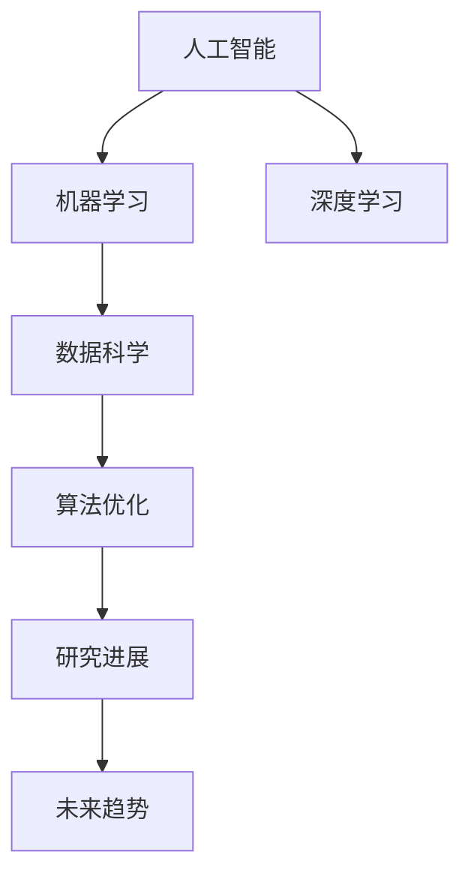

                 

# AI在学术研究中的应用前景

> 关键词：人工智能,学术研究,机器学习,深度学习,数据科学,算法优化,研究进展,未来趋势

## 1. 背景介绍

### 1.1 问题由来
随着人工智能（AI）技术的迅猛发展，其在学术研究中的应用前景已经引起了广泛关注。AI技术，尤其是机器学习和深度学习，已经被应用于各个学科领域，如生物学、物理学、化学、医学、社会学等，极大地推动了科学研究的进展。AI技术的广泛应用不仅改变了学术研究的范式，也促进了学科交叉与融合，为解决复杂问题提供了新的思路和方法。

### 1.2 问题核心关键点
AI在学术研究中的应用，主要包括两个方面：一是利用AI技术进行数据分析和模型训练，提升科研效率和精度；二是利用AI技术进行科学发现和理论创新，拓展科研领域和方法。具体来说，AI在学术研究中的应用核心关键点包括：

- **大数据处理与分析**：AI技术能够高效处理海量数据，揭示数据背后的规律和趋势，辅助科学家进行科学研究。
- **科学计算与模拟**：利用AI进行高性能计算和复杂系统模拟，预测科学现象，验证科学假设。
- **数据驱动的科学发现**：基于数据集训练AI模型，发现新的科学规律和知识，推动理论创新。
- **跨学科融合**：AI技术促进了不同学科的交流与融合，产生了新的交叉学科领域。

## 2. 核心概念与联系

### 2.1 核心概念概述

为更好地理解AI在学术研究中的应用，本节将介绍几个密切相关的核心概念：

- **人工智能**：利用计算机算法和数学模型，使计算机系统能够执行类似于人类的智能任务，如感知、学习、推理等。
- **机器学习**：一种人工智能的分支，通过算法使计算机能够从数据中学习规律，进行自主决策和预测。
- **深度学习**：机器学习的一种高级形式，利用多层神经网络模拟人脑神经元之间的连接，进行复杂的数据处理和模式识别。
- **数据科学**：利用统计学、算法和数据处理技术，从数据中提取知识，支持决策和预测。
- **算法优化**：通过优化算法，提高计算效率和模型性能，支持大规模数据处理和复杂模型训练。
- **研究进展**：学术研究领域的最新成果和趋势，涵盖前沿技术和理论进展。
- **未来趋势**：AI技术在未来科学研究和应用中的发展方向和预期影响。

这些核心概念之间的逻辑关系可以通过以下Mermaid流程图来展示：



这个流程图展示了几大核心概念及其之间的关系：

1. 人工智能是基础，涵盖机器学习和深度学习等技术。
2. 机器学习和深度学习是AI的核心技术，支撑数据科学和算法优化。
3. 数据科学和算法优化为科学研究提供技术支持。
4. 研究进展和未来趋势是科学研究和应用发展的前景方向。

## 3. 核心算法原理 & 具体操作步骤
### 3.1 算法原理概述

AI在学术研究中的应用，主要是通过机器学习和深度学习技术，利用大数据进行模型训练和科学发现。其核心原理可以概括为以下几个方面：

1. **数据驱动的模型训练**：利用大规模数据集，通过机器学习和深度学习算法，训练出高性能模型，用于预测和分析。
2. **特征工程与数据预处理**：从原始数据中提取关键特征，并进行数据清洗、标准化等预处理操作，提升数据质量和模型性能。
3. **模型评估与调优**：使用交叉验证等方法，评估模型性能，并根据评估结果进行调整优化，确保模型泛化能力强。
4. **科学发现与理论验证**：利用训练好的模型，对科学现象进行预测和模拟，验证科学假设，推动理论创新。

### 3.2 算法步骤详解

基于AI的学术研究一般包括以下几个关键步骤：

**Step 1: 数据收集与预处理**
- 收集科学领域内的相关数据，涵盖实验数据、文献数据、观测数据等。
- 对数据进行清洗、去噪、归一化等预处理操作，确保数据质量。

**Step 2: 特征提取与工程**
- 使用统计学方法或机器学习算法，从数据中提取关键特征，构建特征空间。
- 应用领域知识，设计合适的特征工程流程，提升模型性能。

**Step 3: 模型训练与优化**
- 选择适合的机器学习或深度学习算法，构建模型架构。
- 使用训练集进行模型训练，并使用验证集进行调优，避免过拟合。
- 根据模型性能和任务需求，进行超参数调整，提升模型泛化能力。

**Step 4: 模型评估与验证**
- 使用测试集对模型进行评估，计算精度、召回率、F1值等指标。
- 根据评估结果，对模型进行优化，提升预测准确性和可靠性。
- 进行科学假设的验证，推动理论创新。

**Step 5: 科学发现与理论应用**
- 利用训练好的模型，对新的科学问题进行预测和模拟。
- 结合实验验证结果，推动科学发现和理论应用。

### 3.3 算法优缺点

AI在学术研究中的应用具有以下优点：
1. **高效性**：通过机器学习和深度学习算法，快速处理大量数据，提高科研效率。
2. **精确性**：利用复杂模型和高质量数据，提升预测和分析的准确性。
3. **泛化能力**：通过数据驱动的模型训练，增强模型的泛化能力，适应不同领域和场景。
4. **创新性**：利用数据驱动的科学发现，推动理论创新和应用拓展。

同时，该方法也存在一定的局限性：
1. **数据依赖性强**：模型训练和预测依赖于高质量的数据，获取数据成本较高。
2. **模型复杂度高**：深度学习模型结构复杂，训练和优化难度大。
3. **可解释性不足**：部分AI模型的决策过程缺乏可解释性，难以理解内部机制。
4. **伦理与安全问题**：AI模型的公平性和安全性问题需要引起重视。

尽管存在这些局限性，但就目前而言，AI在学术研究中的应用已经显示出巨大的潜力和价值。未来相关研究的重点在于如何进一步降低数据获取成本，提高模型的可解释性和安全性，同时兼顾高效性和精确性。

### 3.4 算法应用领域

AI在学术研究中的应用领域非常广泛，涵盖多个学科和研究领域，例如：

- **生物医学研究**：利用AI进行基因分析、药物发现、疾病预测等。AI模型可以从海量生物数据中提取关键信息，提升科研效率。
- **物理与天文学**：利用AI进行宇宙演化模拟、天体物理观测数据处理等。AI技术能够处理复杂的物理数据，推动天体物理研究。
- **化学与材料科学**：利用AI进行分子模拟、材料设计等。AI模型能够预测分子结构和性能，加速新材料的开发。
- **环境科学**：利用AI进行气候变化预测、生态系统监测等。AI技术能够处理多源数据，提升环境研究的精度和效率。
- **社会科学**：利用AI进行社会行为分析、经济预测等。AI模型能够处理大规模社会数据，提供科学决策支持。
- **金融与经济学**：利用AI进行市场预测、风险评估等。AI技术能够处理金融数据，支持经济预测和决策。
- **教育与心理学**：利用AI进行学习行为分析、心理疾病预测等。AI模型能够处理教育数据，推动个性化教育和心理健康研究。

此外，AI在学术研究中的应用还在不断拓展，涵盖更多学科和领域，推动跨学科创新与融合。

## 4. 数学模型和公式 & 详细讲解 & 举例说明

### 4.1 数学模型构建

本节将使用数学语言对AI在学术研究中的应用进行更加严格的刻画。

假设我们有一组观测数据 $(x_i, y_i)$，其中 $x_i \in \mathbb{R}^n$ 为输入特征，$y_i \in \{0, 1\}$ 为二分类标签。我们的目标是构建一个二分类模型 $f(x)$，用于预测新的数据点 $x$ 的标签。

定义模型的损失函数为交叉熵损失，即：

$$
\mathcal{L}(\theta) = -\frac{1}{N}\sum_{i=1}^N [y_i\log f(x_i)+(1-y_i)\log(1-f(x_i))]
$$

其中 $\theta$ 为模型参数，$f(x_i)$ 为模型在输入 $x_i$ 上的预测概率。

模型的优化目标是最小化经验风险，即找到最优参数：

$$
\theta^* = \mathop{\arg\min}_{\theta} \mathcal{L}(\theta)
$$

在实践中，我们通常使用基于梯度的优化算法（如SGD、Adam等）来近似求解上述最优化问题。设 $\eta$ 为学习率，$\lambda$ 为正则化系数，则参数的更新公式为：

$$
\theta \leftarrow \theta - \eta \nabla_{\theta}\mathcal{L}(\theta) - \eta\lambda\theta
$$

其中 $\nabla_{\theta}\mathcal{L}(\theta)$ 为损失函数对参数 $\theta$ 的梯度，可通过反向传播算法高效计算。

### 4.2 公式推导过程

以下我们以二分类任务为例，推导交叉熵损失函数及其梯度的计算公式。

假设模型 $f(x)$ 在输入 $x$ 上的输出为 $\hat{y}=f(x) \in [0,1]$，表示样本属于正类的概率。真实标签 $y \in \{0,1\}$。则二分类交叉熵损失函数定义为：

$$
\ell(f(x),y) = -[y\log f(x)+(1-y)\log(1-f(x))]
$$

将其代入经验风险公式，得：

$$
\mathcal{L}(\theta) = -\frac{1}{N}\sum_{i=1}^N [y_i\log f(x_i)+(1-y_i)\log(1-f(x_i))]
$$

根据链式法则，损失函数对参数 $\theta_k$ 的梯度为：

$$
\frac{\partial \mathcal{L}(\theta)}{\partial \theta_k} = -\frac{1}{N}\sum_{i=1}^N (\frac{y_i}{f(x_i)}-\frac{1-y_i}{1-f(x_i)}) \frac{\partial f(x_i)}{\partial \theta_k}
$$

其中 $\frac{\partial f(x_i)}{\partial \theta_k}$ 可进一步递归展开，利用自动微分技术完成计算。

在得到损失函数的梯度后，即可带入参数更新公式，完成模型的迭代优化。重复上述过程直至收敛，最终得到适应科学问题的最优模型参数 $\theta^*$。

### 4.3 案例分析与讲解

以生物医学领域为例，展示AI在科学发现中的应用。

假设我们有若干个基因表达数据集，每个数据集包含多个基因的表达量。我们的目标是利用这些数据，发现与某种疾病相关的基因表达模式。具体步骤如下：

1. **数据收集与预处理**：收集多种类型的基因表达数据，包括基因芯片数据、RNA测序数据等。对数据进行清洗、标准化等预处理操作。

2. **特征提取与工程**：使用PCA等降维技术，从高维数据中提取关键特征，构建特征空间。利用领域知识，设计合适的特征工程流程，提升模型性能。

3. **模型训练与优化**：选择合适的机器学习或深度学习算法，如支持向量机(SVM)、随机森林等，构建模型架构。使用训练集进行模型训练，并使用验证集进行调优，避免过拟合。

4. **模型评估与验证**：使用测试集对模型进行评估，计算精度、召回率、F1值等指标。根据评估结果，对模型进行优化，提升预测准确性和可靠性。

5. **科学发现与理论应用**：利用训练好的模型，对新的基因表达数据进行预测和模拟。结合实验验证结果，推动科学发现和理论应用。

例如，可以构建一个SVM模型，训练得到基因表达模式与疾病分类之间的映射关系。然后利用该模型对新样本进行分类预测，识别出潜在的疾病基因。还可以结合生物学知识，对模型进行解释和验证，推动相关科学发现和理论创新。

## 5. 项目实践：代码实例和详细解释说明
### 5.1 开发环境搭建

在进行AI应用实践前，我们需要准备好开发环境。以下是使用Python进行TensorFlow开发的环境配置流程：

1. 安装Anaconda：从官网下载并安装Anaconda，用于创建独立的Python环境。

2. 创建并激活虚拟环境：
```bash
conda create -n tf-env python=3.8 
conda activate tf-env
```

3. 安装TensorFlow：根据CUDA版本，从官网获取对应的安装命令。例如：
```bash
conda install tensorflow -c conda-forge -c pytorch
```

4. 安装各类工具包：
```bash
pip install numpy pandas scikit-learn matplotlib tqdm jupyter notebook ipython
```

完成上述步骤后，即可在`tf-env`环境中开始AI应用实践。

### 5.2 源代码详细实现

这里我们以构建一个简单的神经网络模型为例，使用TensorFlow对基因表达数据进行分类预测的代码实现。

首先，定义数据处理函数：

```python
import numpy as np
import tensorflow as tf
from sklearn.model_selection import train_test_split
from sklearn.preprocessing import StandardScaler

def load_data():
    # 加载基因表达数据
    # ...
    # 将数据标准化
    scaler = StandardScaler()
    X = scaler.fit_transform(X)
    return X, y
```

然后，定义模型和优化器：

```python
from tensorflow.keras.models import Sequential
from tensorflow.keras.layers import Dense

def create_model(input_dim):
    model = Sequential([
        Dense(64, activation='relu', input_dim=input_dim),
        Dense(32, activation='relu'),
        Dense(1, activation='sigmoid')
    ])
    return model

model = create_model(input_dim)
optimizer = tf.keras.optimizers.Adam(learning_rate=0.001)
```

接着，定义训练和评估函数：

```python
def train_epoch(model, x_train, y_train, batch_size, optimizer):
    for epoch in range(epochs):
        for i in range(0, len(x_train), batch_size):
            x_batch = x_train[i:i+batch_size]
            y_batch = y_train[i:i+batch_size]
            with tf.GradientTape() as tape:
                y_pred = model(x_batch)
                loss = tf.keras.losses.binary_crossentropy(y_batch, y_pred)
            gradients = tape.gradient(loss, model.trainable_variables)
            optimizer.apply_gradients(zip(gradients, model.trainable_variables))

def evaluate(model, x_test, y_test, batch_size):
    test_loss = tf.keras.metrics.Mean()
    test_accuracy = tf.keras.metrics.BinaryAccuracy()
    for i in range(0, len(x_test), batch_size):
        x_batch = x_test[i:i+batch_size]
        y_batch = y_test[i:i+batch_size]
        with tf.GradientTape() as tape:
            y_pred = model(x_batch)
            test_loss(tf.keras.losses.binary_crossentropy(y_batch, y_pred))
            test_accuracy(y_batch, y_pred)
    print(f'Test loss: {test_loss.result()}, Test accuracy: {test_accuracy.result()}')
```

最后，启动训练流程并在测试集上评估：

```python
epochs = 10
batch_size = 32

# 数据加载
X, y = load_data()

# 数据集划分
X_train, X_test, y_train, y_test = train_test_split(X, y, test_size=0.2, random_state=42)

# 模型训练
train_epoch(model, X_train, y_train, batch_size, optimizer)

# 模型评估
evaluate(model, X_test, y_test, batch_size)
```

以上就是使用TensorFlow构建神经网络模型，对基因表达数据进行分类预测的完整代码实现。可以看到，TensorFlow的强大封装使得模型构建和训练变得简洁高效。

### 5.3 代码解读与分析

让我们再详细解读一下关键代码的实现细节：

**load_data函数**：
- 定义数据加载和标准化函数，使用sklearn库进行数据预处理，确保数据质量。

**create_model函数**：
- 定义神经网络模型结构，包含多个全连接层，激活函数使用ReLU和sigmoid。

**train_epoch函数**：
- 定义模型训练过程，使用梯度下降优化算法，不断更新模型参数。

**evaluate函数**：
- 定义模型评估过程，计算测试集上的损失和准确率，输出结果。

**训练流程**：
- 定义总的epoch数和batch size，开始循环迭代
- 每个epoch内，对训练集进行迭代，使用随机梯度下降法更新模型参数
- 在测试集上评估模型性能，输出测试结果

可以看到，TensorFlow提供了丰富的工具和函数，使得模型构建和训练变得简单高效。开发者可以更加专注于数据处理和算法优化等高层逻辑。

当然，工业级的系统实现还需考虑更多因素，如模型的保存和部署、超参数的自动搜索、更灵活的任务适配层等。但核心的AI应用流程基本与此类似。

## 6. 实际应用场景
### 6.1 智能药物发现

AI在生物医学领域的应用已经取得了显著进展，智能药物发现是其中的一个重要方向。传统的药物发现过程需要耗费大量时间和资源，且成功率较低。利用AI技术，可以从海量的化合物数据库中快速筛选出潜在药物，加速药物发现进程。

具体而言，可以通过深度学习模型对化合物结构和性质进行预测，筛选出符合特定要求的候选药物。然后，通过实验验证，进一步优化候选药物，最终开发出新药物。AI技术在大规模化合物数据库上的高效筛选和预测能力，大大缩短了药物发现周期，降低了研发成本。

### 6.2 量子计算模拟

量子计算是一种全新的计算范式，具有显著的计算优势。利用AI技术，可以对量子计算模拟过程进行优化，提升模拟效率和精度。

在量子计算模拟中，AI可以用于模型训练和参数优化，模拟量子态演化过程，预测量子计算结果。AI模型能够处理高维、非线性数据，预测量子系统的动态行为，支持量子计算的实验设计。例如，可以使用深度学习模型进行量子电路设计，优化量子态测量过程，提升实验成功率。

### 6.3 环境监测与预警

AI在环境监测和预警中也有广泛应用。环境数据种类繁多，数据量大，传统方法难以高效处理。利用AI技术，可以对环境数据进行实时监测和预测，及时预警环境变化。

例如，可以利用深度学习模型对卫星遥感数据进行分析，识别森林火灾、洪水等灾害区域。还可以结合天气数据和地理信息，预测气候变化趋势，制定应对策略。AI技术能够处理多源数据，提供准确的环境监测和预警服务。

### 6.4 未来应用展望

随着AI技术的发展，其在学术研究中的应用前景将更加广阔。未来可能的应用方向包括：

1. **跨学科融合**：AI技术能够推动不同学科的融合，产生新的交叉学科领域，推动科学创新。例如，结合生物学和计算科学，推动生物信息学的发展。

2. **智能化实验设计**：利用AI技术进行实验设计优化，提高实验效率和成功率。例如，使用深度学习模型进行实验数据分析，优化实验方案。

3. **个性化教育**：AI技术可以应用于个性化教育，根据学生学习行为和成绩，提供个性化的学习方案和资源，提升教育效果。

4. **智能城市**：利用AI技术进行城市数据管理和智能决策，推动智慧城市建设。例如，使用AI进行交通流量预测，优化交通管理。

5. **医疗健康**：AI技术可以应用于医疗健康领域，推动医疗影像诊断、疾病预测、药物研发等应用。例如，利用深度学习模型进行医学影像分析，提升疾病诊断的准确性。

6. **金融科技**：AI技术可以应用于金融科技领域，推动金融风险预测、资产管理、智能投顾等应用。例如，利用AI进行金融市场预测，优化资产配置。

7. **人工智能与社会科学**：AI技术可以应用于社会科学研究，推动社会科学数据分析、社会行为预测等应用。例如，使用深度学习模型进行社会舆情分析，预测社会行为趋势。

8. **量子计算与AI融合**：AI技术可以应用于量子计算，提升量子计算模拟效率和精度。例如，利用深度学习模型进行量子电路设计，优化量子计算过程。

以上应用方向展示了AI技术在学术研究中的广阔前景，未来AI技术的发展将进一步拓展其应用范围，推动学科交叉与融合。

## 7. 工具和资源推荐
### 7.1 学习资源推荐

为了帮助开发者系统掌握AI在学术研究中的应用，这里推荐一些优质的学习资源：

1. **TensorFlow官方文档**：TensorFlow的官方文档提供了丰富的API文档和教程，适合初学者和高级用户使用。

2. **PyTorch官方文档**：PyTorch的官方文档提供了详细的API文档和教程，适合深度学习和人工智能研究。

3. **深度学习框架比较与选择**：介绍各种深度学习框架的特点和适用场景，帮助开发者选择适合的框架。

4. **机器学习课程**：如Coursera上的机器学习课程，提供系统化学习路径和项目实践。

5. **深度学习教程**：如DeepLearning.AI的深度学习课程，提供高质量的深度学习教程和实践项目。

6. **自然语言处理课程**：如斯坦福大学的自然语言处理课程，涵盖NLP领域的经典算法和应用。

7. **计算机视觉课程**：如斯坦福大学的计算机视觉课程，涵盖计算机视觉领域的经典算法和应用。

通过对这些资源的学习实践，相信你一定能够快速掌握AI在学术研究中的应用，并用于解决实际的科研问题。

### 7.2 开发工具推荐

高效的开发离不开优秀的工具支持。以下是几款用于AI应用开发的常用工具：

1. **TensorFlow**：由Google主导开发的开源深度学习框架，生产部署方便，适合大规模工程应用。

2. **PyTorch**：由Facebook主导开发的开源深度学习框架，灵活动态的计算图，适合快速迭代研究。

3. **Jupyter Notebook**：一个交互式的数据分析和编程环境，适合开发者进行数据分析和模型训练。

4. **Scikit-learn**：Python的机器学习库，提供多种经典机器学习算法和工具。

5. **Keras**：一个高级神经网络API，可以运行于TensorFlow、Theano等后端，方便快速构建和训练神经网络。

6. **Anaconda**：一个Python环境管理工具，方便管理多种Python环境和库。

7. **Google Colab**：谷歌提供的在线Jupyter Notebook环境，免费提供GPU/TPU算力，适合快速迭代实验。

合理利用这些工具，可以显著提升AI应用开发的效率，加快创新迭代的步伐。

### 7.3 相关论文推荐

AI在学术研究中的应用得益于学界的持续研究。以下是几篇奠基性的相关论文，推荐阅读：

1. **《深度学习》（Ian Goodfellow, Yoshua Bengio, Aaron Courville）**：全面介绍了深度学习的基本概念、算法和应用，是深度学习的经典教材。

2. **《TensorFlow官方文档》**：介绍了TensorFlow的基本概念、API使用和实践案例，适合TensorFlow初学者和高级用户。

3. **《PyTorch官方文档》**：介绍了PyTorch的基本概念、API使用和实践案例，适合PyTorch初学者和高级用户。

4. **《自然语言处理》（Stanford University）**：斯坦福大学的自然语言处理课程，涵盖NLP领域的经典算法和应用。

5. **《计算机视觉》（Stanford University）**：斯坦福大学的计算机视觉课程，涵盖计算机视觉领域的经典算法和应用。

6. **《机器学习》（Andrew Ng）**：Coursera上的机器学习课程，提供系统化学习路径和项目实践。

通过学习这些前沿成果，可以帮助研究者把握学科前进方向，激发更多的创新灵感。

## 8. 总结：未来发展趋势与挑战

### 8.1 总结

本文对AI在学术研究中的应用进行了全面系统的介绍。首先阐述了AI技术在学术研究中的应用前景和意义，明确了AI技术在推动科学研究中的重要作用。其次，从原理到实践，详细讲解了AI在科学研究中的核心算法和具体操作步骤，给出了AI应用任务开发的完整代码实例。同时，本文还广泛探讨了AI技术在多个学术领域的应用场景，展示了AI技术的广泛应用前景。

通过本文的系统梳理，可以看到，AI技术正在成为学术研究的重要工具，极大地推动了各学科领域的科研进展。未来，伴随AI技术的持续发展和跨学科融合，其在学术研究中的应用将更加深入和广泛。

### 8.2 未来发展趋势

展望未来，AI在学术研究中的应用将呈现以下几个发展趋势：

1. **AI与科学研究的深度融合**：AI技术将更深入地融入科学研究，成为科学研究的重要组成部分。例如，利用AI进行科学计算、数据处理、知识发现等，提升科研效率和精度。

2. **跨学科应用的拓展**：AI技术将推动跨学科应用的拓展，产生新的交叉学科领域。例如，结合物理、化学、数学、计算机科学等多个学科，推动科学创新。

3. **智能化实验设计**：AI技术将应用于实验设计优化，提高实验效率和成功率。例如，使用深度学习模型进行实验数据分析，优化实验方案。

4. **智能化科学计算**：AI技术将应用于科学计算和模拟，提升计算效率和精度。例如，利用深度学习模型进行量子计算模拟，优化实验设计。

5. **智能数据处理**：AI技术将应用于大规模数据处理，提高数据处理效率和质量。例如，利用深度学习模型进行基因表达数据处理，提高基因组学研究效率。

6. **智能决策支持**：AI技术将应用于决策支持系统，提升决策效果和智能化水平。例如，利用深度学习模型进行市场预测、风险评估等。

7. **个性化应用**：AI技术将应用于个性化应用，提升个性化服务和用户体验。例如，利用深度学习模型进行个性化教育、推荐系统等。

8. **社会智能化**：AI技术将应用于智慧城市、智能交通等领域，提升社会智能化水平。例如，使用AI进行交通流量预测，优化交通管理。

以上趋势凸显了AI技术在学术研究中的广阔前景。这些方向的探索发展，必将进一步推动各学科领域的科研创新和应用发展。

### 8.3 面临的挑战

尽管AI在学术研究中的应用已经取得了显著进展，但在迈向更加智能化、普适化应用的过程中，仍然面临诸多挑战：

1. **数据获取和质量**：高质量数据的获取和处理仍然是AI应用的瓶颈。数据来源复杂多样，数据质量难以保证，需要更多自动化数据采集和预处理技术。

2. **模型复杂度**：深度学习模型结构复杂，训练和优化难度大，需要更多高效模型训练和优化技术。例如，使用大规模分布式训练和自动混合精度训练技术。

3. **可解释性**：AI模型的决策过程缺乏可解释性，难以理解内部机制。需要更多可解释性AI技术和工具，提升模型的透明度。

4. **伦理与安全**：AI模型的公平性和安全性问题需要引起重视。例如，避免模型偏见和有害信息，确保数据隐私和安全。

5. **跨学科融合难度**：不同学科领域的数据和知识差异大，跨学科融合难度高。需要更多领域知识融合和协同创新技术。

6. **资源需求高**：AI应用需要高性能计算资源，如GPU、TPU等，需要更多高效的资源管理技术和工具。

7. **知识图谱构建**：构建领域知识图谱，提升模型的知识整合能力，需要更多知识表示和知识图谱构建技术。

这些挑战需要更多技术突破和创新，才能进一步推动AI在学术研究中的应用发展。

### 8.4 研究展望

面对AI在学术研究中面临的挑战，未来的研究需要在以下几个方面寻求新的突破：

1. **自动化数据处理技术**：发展自动化数据采集和预处理技术，降低数据获取和处理成本。例如，利用自然语言处理技术自动标注数据，提高数据质量。

2. **高效模型训练技术**：发展高效模型训练和优化技术，提高模型训练效率和精度。例如，使用自动混合精度训练和分布式训练技术，提升模型训练速度。

3. **可解释性AI技术**：发展可解释性AI技术和工具，提升模型的透明度和可理解性。例如，使用可解释性AI模型和可视化工具，解释模型的决策过程。

4. **伦理与安全技术**：发展伦理与安全技术，确保AI模型的公平性和安全性。例如，引入伦理导向的评估指标，过滤和惩罚有害信息。

5. **跨学科融合技术**：发展跨学科融合技术，促进不同学科领域的知识整合和协同创新。例如，结合物理、化学、数学、计算机科学等多个学科，推动科学创新。

6. **资源管理技术**：发展高效的资源管理技术，优化计算资源的使用效率。例如，使用GPU集群和分布式训练技术，提高计算资源利用率。

7. **知识图谱构建技术**：发展知识图谱构建技术，提升模型的知识整合能力。例如，利用知识图谱技术，构建领域知识图谱，提升模型的知识整合能力。

这些研究方向的探索，必将引领AI技术在学术研究中的应用进一步发展，为科学研究和技术创新提供更多支持。

## 9. 附录：常见问题与解答

**Q1：AI在学术研究中的应用范围是什么？**

A: AI在学术研究中的应用范围非常广泛，涵盖多个学科和研究领域，如生物学、物理学、化学、医学、社会学、经济学、教育学、心理学等。具体应用包括基因表达数据分析、量子计算模拟、环境监测与预警、智能药物发现、金融科技等。

**Q2：AI在学术研究中如何降低数据获取成本？**

A: 可以通过自动化数据采集和预处理技术，降低数据获取和处理成本。例如，利用自然语言处理技术自动标注数据，提高数据质量。同时，可以采用分布式数据存储和处理技术，降低数据存储和处理成本。

**Q3：AI在学术研究中的模型复杂度如何优化？**

A: 可以通过模型简化和优化技术，降低模型复杂度，提高模型训练和推理效率。例如，使用深度学习模型的简化版，如卷积神经网络（CNN）、循环神经网络（RNN）等。同时，可以采用分布式训练和自动混合精度训练技术，提高模型训练效率。

**Q4：AI在学术研究中的可解释性如何提升？**

A: 可以通过可解释性AI技术和工具，提升模型的透明度和可理解性。例如，使用可解释性AI模型和可视化工具，解释模型的决策过程。同时，可以结合领域知识，解释模型的输出结果。

**Q5：AI在学术研究中的伦理与安全问题如何解决？**

A: 可以通过引入伦理导向的评估指标，过滤和惩罚有害信息，确保AI模型的公平性和安全性。例如，在模型训练和应用过程中，引入伦理和安全评估指标，确保模型输出符合人类价值观和伦理道德。

通过解决这些常见问题，可以帮助研究者更好地掌握AI在学术研究中的应用，提升科研效果和应用价值。

---

作者：禅与计算机程序设计艺术 / Zen and the Art of Computer Programming

