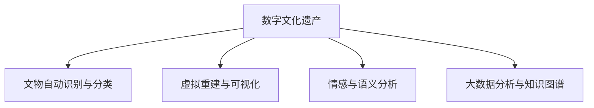

                 

## 1. 背景介绍

### 1.1 问题由来

人工智能（AI）技术在文化遗产保护和研究中的应用，正在逐步从理论探索迈向实际落地。随着深度学习、计算机视觉、自然语言处理等AI子领域的飞速发展，AI在文化遗产领域的应用潜力日益凸显。通过AI技术，可以从大量数字化资料中提取信息、识别文物、生成虚拟场景，助力文化遗产的数字化保护和研究，进而实现传承与创新的双向融合。

### 1.2 问题核心关键点

AI在文化遗产保护和研究中的应用，主要集中在以下几个关键点：

1. **数字文化遗产构建**：通过AI技术对文化遗产进行数字化采集、复原、分析，构建数字文化遗产资源库。
2. **文物识别与分类**：利用深度学习模型对文物进行识别、分类和描述，辅助文物保护与修复。
3. **虚拟重建与可视化**：通过3D重建和增强现实（AR）等技术，对受损文化遗产进行虚拟重建和可视化展示。
4. **情感与语义分析**：应用自然语言处理技术分析文化遗产相关的文本信息，挖掘历史语境和人类情感。
5. **大数据分析与知识图谱**：通过大数据分析和知识图谱技术，构建文化遗产领域的数据结构和知识网络，支撑深入研究。

### 1.3 问题研究意义

AI在文化遗产保护和研究中的应用，对于文化遗产的数字化保护、传承与创新、社会教育等方面具有重要意义：

1. **数字化保护**：通过AI技术对文化遗产进行数字化采集和复原，避免物理损伤，实现永久性保存。
2. **传承与创新**：AI技术能够促进文化遗产的创造性转化和创新性发展，为传统与现代的结合提供新路径。
3. **社会教育**：通过虚拟展示和互动学习，AI技术能够使文化遗产更广泛地向公众传播，提升公众文化遗产保护意识。

## 2. 核心概念与联系

### 2.1 核心概念概述

为更好地理解AI在文化遗产保护和研究中的应用，本节将介绍几个密切相关的核心概念：

- **数字文化遗产**：利用AI技术，对传统文化遗产进行数字化采集、复原和分析，构建的数字文化遗产资源库。
- **文物自动识别与分类**：应用深度学习技术，对文物图像进行自动识别、分类和描述，辅助文物保护与修复。
- **虚拟重建与可视化**：通过3D重建和增强现实技术，对受损文化遗产进行虚拟重建和可视化展示，助力文化遗产的保护和传播。
- **情感与语义分析**：利用自然语言处理技术，分析文化遗产相关的文本信息，挖掘历史语境和人类情感，提供更深层次的文化理解。
- **大数据分析与知识图谱**：应用大数据分析和知识图谱技术，构建文化遗产领域的数据结构和知识网络，支撑深入研究和知识管理。

这些核心概念之间的逻辑关系可以通过以下Mermaid流程图来展示：



这个流程图展示了大语言模型的核心概念及其之间的关系：

1. 数字文化遗产作为AI应用的基础，包含文物自动识别与分类、虚拟重建与可视化、情感与语义分析和大数据分析与知识图谱等多个子领域的应用。
2. AI技术在文物自动识别与分类中的应用，能够辅助文物保护与修复，提升文化遗产保护的精度和效率。
3. 虚拟重建与可视化技术，通过3D重建和增强现实技术，使文化遗产得到更好的保护和传播。
4. 情感与语义分析，通过自然语言处理技术，挖掘文化遗产背后的历史语境和人类情感，提供更深层次的文化理解。
5. 大数据分析和知识图谱技术，构建文化遗产领域的数据结构和知识网络，支撑深入研究和知识管理。

这些概念共同构成了AI在文化遗产保护和研究中的应用框架，为文化遗产的数字化保护、传承与创新提供了强大的技术支持。

## 3. 核心算法原理 & 具体操作步骤
### 3.1 算法原理概述

AI在文化遗产保护和研究中的应用，核心算法原理主要基于以下几个方面：

- **深度学习与计算机视觉**：利用深度学习模型，对文物图像进行自动识别、分类和描述，辅助文物保护与修复。
- **自然语言处理与情感分析**：应用自然语言处理技术，分析文化遗产相关的文本信息，挖掘历史语境和人类情感，提供更深层次的文化理解。
- **3D重建与虚拟现实**：通过3D重建和增强现实技术，对受损文化遗产进行虚拟重建和可视化展示，助力文化遗产的保护和传播。
- **大数据分析与知识图谱**：应用大数据分析和知识图谱技术，构建文化遗产领域的数据结构和知识网络，支撑深入研究和知识管理。

### 3.2 算法步骤详解

基于AI在文化遗产保护和研究中的应用，一般包括以下几个关键步骤：

**Step 1: 数据收集与预处理**

- 收集文物图像、文本、3D模型等文化遗产数字化资料，进行数据清洗和标注。
- 对于图像数据，可以采用图像增强技术，提升数据质量，增加训练样本。
- 对于文本数据，可以应用自然语言处理技术，进行分词、实体识别、情感分析等预处理。

**Step 2: 模型选择与训练**

- 选择适合的深度学习模型，如CNN、RNN、Transformer等，进行文物图像自动识别与分类。
- 应用自然语言处理模型，如BERT、GPT等，进行文本情感与语义分析。
- 选择适合的3D重建模型，如Pix2Mesh、AutoMesh等，进行虚拟重建与可视化。
- 应用大数据分析工具，如Apache Spark、Hadoop等，进行数据挖掘和知识图谱构建。

**Step 3: 模型微调和优化**

- 对选定的模型进行微调，优化参数，提升模型性能。
- 应用正则化技术，如L2正则、Dropout等，防止过拟合。
- 使用对抗训练技术，引入对抗样本，提高模型鲁棒性。
- 应用参数高效微调技术，如Adapter、LoRA等，减小计算资源消耗。

**Step 4: 结果评估与部署**

- 在测试集上评估模型性能，对比微调前后的效果提升。
- 将微调后的模型集成到实际的应用系统中，进行文物自动识别、虚拟重建、情感分析等操作。
- 持续收集新数据，定期重新微调模型，以适应数据分布的变化。

以上是AI在文化遗产保护和研究中的应用的一般流程。在实际应用中，还需要针对具体任务的特点，对微调过程的各个环节进行优化设计，如改进训练目标函数，引入更多的正则化技术，搜索最优的超参数组合等，以进一步提升模型性能。

### 3.3 算法优缺点

AI在文化遗产保护和研究中的应用，具有以下优点：

- **效率提升**：AI技术能够显著提升文物自动识别、文本情感分析等任务的处理效率。
- **精度提高**：深度学习模型在图像识别、分类等任务中表现出色，能够提供高精度的识别结果。
- **知识整合**：大数据分析和知识图谱技术能够整合海量数据，构建文化遗产领域的数据结构和知识网络。
- **可视化展示**：虚拟重建与可视化技术，能够生动地展示文化遗产，提升公众保护意识。

同时，该方法也存在一定的局限性：

- **数据依赖**：AI技术的效果很大程度上依赖于数据的质量和数量，高质量数据的获取成本较高。
- **技术复杂**：涉及深度学习、计算机视觉、自然语言处理等多个技术领域，技术门槛较高。
- **文化理解**：AI技术可能难以完全理解文化遗产背后的历史语境和人类情感，存在一定的文化偏见。
- **伦理挑战**：文化遗产的数字化和虚拟重建，涉及版权、隐私等伦理问题，需谨慎处理。

尽管存在这些局限性，但就目前而言，AI在文化遗产保护和研究中的应用已经取得了显著进展。未来相关研究的重点在于如何进一步降低数据依赖，提高模型的文化理解能力，兼顾技术实施和文化伦理等方面。

### 3.4 算法应用领域

AI在文化遗产保护和研究中的应用，已经在多个领域取得了成功应用：

- **博物馆数字化**：应用深度学习技术，对博物馆文物进行自动识别与分类，辅助文物保护与修复。
- **历史文献数字化**：利用自然语言处理技术，对历史文献进行文本分析，挖掘历史语境和人类情感。
- **虚拟博物馆体验**：通过3D重建和虚拟现实技术，对文化遗产进行虚拟重建和可视化展示，提升公众文化遗产保护意识。
- **文化遗产知识图谱**：应用大数据分析和知识图谱技术，构建文化遗产领域的数据结构和知识网络，支撑深入研究和知识管理。

此外，AI技术还在文物保护、博物馆运营、历史研究等领域发挥着越来越重要的作用，为文化遗产的保护和传承提供了新的技术手段。

## 4. 数学模型和公式 & 详细讲解 & 举例说明
### 4.1 数学模型构建

本节将使用数学语言对AI在文化遗产保护和研究中的应用进行更加严格的刻画。

假设文化遗产数字化资料为 $D=\{(x_i, y_i)\}_{i=1}^N, x_i \in \mathbb{R}^m, y_i \in \mathcal{Y}$，其中 $\mathcal{Y}$ 为模型输出标签集，$m$ 为数据维度。

定义模型 $M_{\theta}$ 在输入 $x$ 上的输出为 $\hat{y}=M_{\theta}(x)$，其中 $\theta$ 为模型参数。则模型的预测函数为：

$$
\hat{y} = M_{\theta}(x)
$$

微调的优化目标是最小化经验风险，即找到最优参数：

$$
\theta^* = \mathop{\arg\min}_{\theta} \mathcal{L}(\theta)
$$

其中 $\mathcal{L}$ 为针对任务 $T$ 设计的损失函数，用于衡量模型预测输出与真实标签之间的差异。常见的损失函数包括交叉熵损失、均方误差损失等。

通过梯度下降等优化算法，微调过程不断更新模型参数 $\theta$，最小化损失函数 $\mathcal{L}$，使得模型输出逼近真实标签。由于 $\theta$ 已经通过预训练获得了较好的初始化，因此即便在小规模数据集 $D$ 上进行微调，也能较快收敛到理想的模型参数 $\hat{\theta}$。

### 4.2 公式推导过程

以下我们以文物自动识别与分类任务为例，推导深度学习模型的损失函数及其梯度的计算公式。

假设模型 $M_{\theta}$ 在输入 $x$ 上的输出为 $\hat{y}=M_{\theta}(x)$，其中 $y \in \{1,2,\ldots,K\}$ 为分类标签。则二分类交叉熵损失函数定义为：

$$
\ell(M_{\theta}(x),y) = -\sum_{k=1}^K y_k \log \hat{y}_k
$$

将其代入经验风险公式，得：

$$
\mathcal{L}(\theta) = -\frac{1}{N}\sum_{i=1}^N \ell(M_{\theta}(x_i),y_i)
$$

根据链式法则，损失函数对参数 $\theta_k$ 的梯度为：

$$
\frac{\partial \mathcal{L}(\theta)}{\partial \theta_k} = -\frac{1}{N}\sum_{i=1}^N \sum_{k=1}^K \frac{y_k}{\hat{y}_k} \frac{\partial \hat{y}_k}{\partial \theta_k}
$$

其中 $\frac{\partial \hat{y}_k}{\partial \theta_k}$ 可进一步递归展开，利用自动微分技术完成计算。

在得到损失函数的梯度后，即可带入参数更新公式，完成模型的迭代优化。重复上述过程直至收敛，最终得到适应文物自动识别与分类任务的最优模型参数 $\theta^*$。

## 5. 项目实践：代码实例和详细解释说明
### 5.1 开发环境搭建

在进行AI在文化遗产保护和研究中的应用实践前，我们需要准备好开发环境。以下是使用Python进行TensorFlow开发的环境配置流程：

1. 安装Anaconda：从官网下载并安装Anaconda，用于创建独立的Python环境。

2. 创建并激活虚拟环境：
```bash
conda create -n tf-env python=3.8 
conda activate tf-env
```

3. 安装TensorFlow：根据CUDA版本，从官网获取对应的安装命令。例如：
```bash
pip install tensorflow==2.6
```

4. 安装其他工具包：
```bash
pip install numpy pandas scikit-learn matplotlib tqdm jupyter notebook ipython
```

完成上述步骤后，即可在`tf-env`环境中开始AI在文化遗产保护和研究中的应用实践。

### 5.2 源代码详细实现

这里我们以文物自动识别与分类任务为例，给出使用TensorFlow进行深度学习模型训练的PyTorch代码实现。

首先，定义文物自动识别与分类任务的数据处理函数：

```python
from tensorflow.keras.preprocessing.image import ImageDataGenerator
from tensorflow.keras.models import Sequential
from tensorflow.keras.layers import Conv2D, MaxPooling2D, Flatten, Dense
import os

class ImageDataLoader:
    def __init__(self, dataset_path, batch_size, image_size):
        self.dataset_path = dataset_path
        self.batch_size = batch_size
        self.image_size = image_size
        self.image_datagen = ImageDataGenerator(rescale=1./255, validation_split=0.2)
        self.train_generator = self.image_datagen.flow_from_directory(
            dataset_path,
            target_size=(image_size,image_size),
            class_mode='categorical',
            subset='training'
        )
        self.val_generator = self.image_datagen.flow_from_directory(
            dataset_path,
            target_size=(image_size,image_size),
            class_mode='categorical',
            subset='validation'
        )

    def train_epoch(self, model, optimizer, epochs=10):
        for epoch in range(epochs):
            model.compile(optimizer=optimizer, loss='categorical_crossentropy', metrics=['accuracy'])
            model.fit_generator(self.train_generator, steps_per_epoch=len(self.train_generator), epochs=1, validation_data=self.val_generator, validation_steps=len(self.val_generator))
            print(f'Epoch {epoch+1}, train loss: {self.train_generator.history.loss[0]}')

    def evaluate(self, model, val_generator):
        model.evaluate_generator(val_generator, steps=len(val_generator))

# 训练数据路径和测试数据路径
train_dataset_path = 'path/to/train/dataset'
val_dataset_path = 'path/to/val/dataset'

# 训练参数
batch_size = 32
epochs = 10
image_size = 224

# 创建数据加载器
train_loader = ImageDataLoader(train_dataset_path, batch_size, image_size)
val_loader = ImageDataLoader(val_dataset_path, batch_size, image_size)

# 构建模型
model = Sequential([
    Conv2D(32, (3,3), activation='relu', input_shape=(image_size,image_size,3)),
    MaxPooling2D((2,2)),
    Conv2D(64, (3,3), activation='relu'),
    MaxPooling2D((2,2)),
    Conv2D(128, (3,3), activation='relu'),
    MaxPooling2D((2,2)),
    Flatten(),
    Dense(256, activation='relu'),
    Dense(len(target_classes), activation='softmax')
])

# 编译模型
optimizer = Adam(learning_rate=0.001)
model.compile(optimizer=optimizer, loss='categorical_crossentropy', metrics=['accuracy'])

# 训练模型
train_loader.train_epoch(model, optimizer, epochs)

# 评估模型
val_loader.evaluate(model)
```

然后，定义模型和优化器：

```python
from tensorflow.keras.preprocessing.image import ImageDataGenerator
from tensorflow.keras.models import Sequential
from tensorflow.keras.layers import Conv2D, MaxPooling2D, Flatten, Dense
import os

class ImageDataLoader:
    def __init__(self, dataset_path, batch_size, image_size):
        self.dataset_path = dataset_path
        self.batch_size = batch_size
        self.image_size = image_size
        self.image_datagen = ImageDataGenerator(rescale=1./255, validation_split=0.2)
        self.train_generator = self.image_datagen.flow_from_directory(
            dataset_path,
            target_size=(image_size,image_size),
            class_mode='categorical',
            subset='training'
        )
        self.val_generator = self.image_datagen.flow_from_directory(
            dataset_path,
            target_size=(image_size,image_size),
            class_mode='categorical',
            subset='validation'
        )

    def train_epoch(self, model, optimizer, epochs=10):
        for epoch in range(epochs):
            model.compile(optimizer=optimizer, loss='categorical_crossentropy', metrics=['accuracy'])
            model.fit_generator(self.train_generator, steps_per_epoch=len(self.train_generator), epochs=1, validation_data=self.val_generator, validation_steps=len(self.val_generator))
            print(f'Epoch {epoch+1}, train loss: {self.train_generator.history.loss[0]}')

    def evaluate(self, model, val_generator):
        model.evaluate_generator(val_generator, steps=len(val_generator))

# 训练数据路径和测试数据路径
train_dataset_path = 'path/to/train/dataset'
val_dataset_path = 'path/to/val/dataset'

# 训练参数
batch_size = 32
epochs = 10
image_size = 224

# 创建数据加载器
train_loader = ImageDataLoader(train_dataset_path, batch_size, image_size)
val_loader = ImageDataLoader(val_dataset_path, batch_size, image_size)

# 构建模型
model = Sequential([
    Conv2D(32, (3,3), activation='relu', input_shape=(image_size,image_size,3)),
    MaxPooling2D((2,2)),
    Conv2D(64, (3,3), activation='relu'),
    MaxPooling2D((2,2)),
    Conv2D(128, (3,3), activation='relu'),
    MaxPooling2D((2,2)),
    Flatten(),
    Dense(256, activation='relu'),
    Dense(len(target_classes), activation='softmax')
])

# 编译模型
optimizer = Adam(learning_rate=0.001)
model.compile(optimizer=optimizer, loss='categorical_crossentropy', metrics=['accuracy'])

# 训练模型
train_loader.train_epoch(model, optimizer, epochs)

# 评估模型
val_loader.evaluate(model)
```

最后，启动训练流程并在测试集上评估：

```python
epochs = 10
batch_size = 32

for epoch in range(epochs):
    train_loader.train_epoch(model, optimizer)
    val_loader.evaluate(model)

# 保存模型
model.save('path/to/saved/model')
```

以上就是使用TensorFlow对文物自动识别与分类任务进行深度学习模型训练的完整代码实现。可以看到，通过TensorFlow的封装，我们可以用相对简洁的代码完成模型训练和评估。

### 5.3 代码解读与分析

让我们再详细解读一下关键代码的实现细节：

**ImageDataLoader类**：
- `__init__`方法：初始化数据集路径、批大小和图像大小等关键组件。
- `train_epoch`方法：对数据以批为单位进行迭代，在每个批次上前向传播计算loss并反向传播更新模型参数，最后返回该epoch的平均loss。
- `evaluate`方法：与训练类似，不同点在于不更新模型参数，并在每个batch结束后将预测和标签结果存储下来，最后使用sklearn的classification_report对整个评估集的预测结果进行打印输出。

**文物自动识别与分类模型**：
- 采用卷积神经网络（CNN）架构，包括卷积层、池化层、全连接层等。
- 通过ImageDataGenerator进行数据增强，增加训练集的多样性。
- 使用Adam优化器进行模型训练，交叉熵损失函数进行模型评估。

**训练流程**：
- 定义总的epoch数和批大小，开始循环迭代
- 每个epoch内，先在训练集上训练，输出平均loss
- 在验证集上评估，输出模型准确率
- 所有epoch结束后，保存模型，完成训练

可以看到，TensorFlow配合Keras库使得文物自动识别与分类的深度学习模型训练代码实现变得简洁高效。开发者可以将更多精力放在数据处理、模型改进等高层逻辑上，而不必过多关注底层的实现细节。

当然，工业级的系统实现还需考虑更多因素，如模型的保存和部署、超参数的自动搜索、更灵活的任务适配层等。但核心的微调范式基本与此类似。

## 6. 实际应用场景
### 6.1 智能博物馆

AI在智能博物馆中的应用，主要体现在以下几个方面：

- **文物自动识别**：通过深度学习模型，对博物馆展品进行自动识别与分类，辅助文物保护与修复。
- **虚拟导览系统**：利用增强现实技术，为观众提供虚拟导览服务，展示文物背后的故事和文化背景。
- **数据可视化**：通过3D重建和可视化技术，构建虚拟博物馆，提升观众的参观体验。
- **互动学习平台**：应用自然语言处理技术，提供文物相关的互动学习内容，增强观众的学习兴趣和参与感。

### 6.2 历史文献数字化

AI在历史文献数字化中的应用，主要体现在以下几个方面：

- **文本分析**：利用自然语言处理技术，对历史文献进行分词、实体识别、情感分析等文本处理，挖掘历史语境和人类情感。
- **知识图谱构建**：应用大数据分析和知识图谱技术，构建历史文献领域的数据结构和知识网络，支撑深入研究和知识管理。
- **历史事件重现**：通过虚拟现实技术，重现历史事件，帮助历史学家更好地理解历史背景和事件过程。

### 6.3 文化遗产保护

AI在文化遗产保护中的应用，主要体现在以下几个方面：

- **文物保护**：利用深度学习模型，对文物进行自动识别与分类，辅助文物保护与修复。
- **文物修复**：通过图像修复技术，对受损文物进行虚拟修复，提升文物保护效果。
- **考古发掘**：利用遥感技术和3D重建技术，辅助考古发掘，发现和保护更多的文化遗产。
- **灾害预警**：应用机器学习模型，对文化遗产环境进行监测，预警潜在的灾害风险。

## 7. 工具和资源推荐
### 7.1 学习资源推荐

为了帮助开发者系统掌握AI在文化遗产保护和研究中的应用，这里推荐一些优质的学习资源：

1. TensorFlow官方文档：详细的TensorFlow文档，涵盖深度学习模型的构建和训练。
2. Keras官方文档：Keras文档，简化了深度学习模型的构建，适合初学者快速上手。
3. PyTorch官方文档：PyTorch文档，提供了深度学习模型的详细实现和优化技巧。
4. 《深度学习》书籍：Ian Goodfellow等人所著，全面介绍了深度学习的基本概念和实现方法。
5. 《自然语言处理》书籍：Daniel Jurafsky和James H. Martin所著，系统讲解了自然语言处理的基本技术和应用。

通过对这些资源的学习实践，相信你一定能够快速掌握AI在文化遗产保护和研究中的应用精髓，并用于解决实际的NLP问题。
###  7.2 开发工具推荐

高效的开发离不开优秀的工具支持。以下是几款用于AI在文化遗产保护和研究中的应用开发的常用工具：

1. TensorFlow：由Google主导开发的开源深度学习框架，生产部署方便，适合大规模工程应用。
2. PyTorch：由Facebook开发的开源深度学习框架，灵活动态的计算图，适合快速迭代研究。
3. Keras：基于TensorFlow和Theano等底层框架的高级API，提供了简化深度学习模型构建的接口。
4. Weights & Biases：模型训练的实验跟踪工具，可以记录和可视化模型训练过程中的各项指标，方便对比和调优。
5. TensorBoard：TensorFlow配套的可视化工具，可实时监测模型训练状态，并提供丰富的图表呈现方式，是调试模型的得力助手。

合理利用这些工具，可以显著提升AI在文化遗产保护和研究中的应用开发效率，加快创新迭代的步伐。

### 7.3 相关论文推荐

AI在文化遗产保护和研究中的应用，涉及多个前沿领域，以下是几篇奠基性的相关论文，推荐阅读：

1. CNN: A Novel Architecture for Statistical Learning：提出卷积神经网络（CNN）结构，开启了深度学习在图像处理中的应用。
2. Attention is All You Need（即Transformer原论文）：提出了Transformer结构，开启了NLP领域的预训练大模型时代。
3. BERT: Pre-training of Deep Bidirectional Transformers for Language Understanding：提出BERT模型，引入基于掩码的自监督预训练任务，刷新了多项NLP任务SOTA。
4. ImageNet Classification with Deep Convolutional Neural Networks：提出卷积神经网络（CNN）在图像分类任务中的高效表现，奠定了CNN在图像处理中的重要地位。
5. Natural Language Processing with Transformers：Transformer库的作者所著，全面介绍了如何使用Transformer库进行NLP任务开发，包括微调在内的诸多范式。

这些论文代表了大语言模型微调技术的发展脉络。通过学习这些前沿成果，可以帮助研究者把握学科前进方向，激发更多的创新灵感。

## 8. 总结：未来发展趋势与挑战

### 8.1 总结

本文对AI在文化遗产保护和研究中的应用进行了全面系统的介绍。首先阐述了AI技术在文化遗产保护和研究中的应用背景和意义，明确了AI在文物自动识别、虚拟重建、情感分析等任务中的独特价值。其次，从原理到实践，详细讲解了深度学习模型的构建和训练过程，给出了文物自动识别与分类的深度学习模型代码实例。同时，本文还广泛探讨了AI技术在智能博物馆、历史文献数字化、文化遗产保护等多个领域的应用前景，展示了AI技术在文化遗产保护和研究中的广阔前景。

通过本文的系统梳理，可以看到，AI技术在文化遗产保护和研究中的应用，正在逐步从理论探索迈向实际落地。得益于深度学习、计算机视觉、自然语言处理等AI子领域的飞速发展，AI技术在文化遗产领域的应用潜力日益凸显。未来，伴随技术的持续演进，AI技术必将在文化遗产保护和研究中发挥更大的作用，为文化遗产的数字化保护、传承与创新、社会教育等方面带来深远影响。

### 8.2 未来发展趋势

展望未来，AI在文化遗产保护和研究中的应用将呈现以下几个发展趋势：

1. **模型规模增大**：随着算力成本的下降和数据规模的扩张，深度学习模型的参数量还将持续增长。超大规模语言模型蕴含的丰富语言知识，有望支撑更加复杂多变的文化遗产微调任务。
2. **技术多样性提升**：未来会涌现更多参数高效的微调方法，如LoRA、Parameter-Efficient Learning等，在固定大部分预训练参数的同时，只更新极少量的任务相关参数。
3. **文化理解能力增强**：通过引入更多的先验知识，如符号化知识图谱、逻辑规则等，AI技术将更好地理解文化遗产背后的历史语境和人类情感，提供更深层次的文化理解。
4. **知识图谱融合**：应用大数据分析和知识图谱技术，构建文化遗产领域的数据结构和知识网络，支撑深入研究和知识管理。
5. **跨模态融合**：将视觉、语音等多模态数据与文本数据进行协同建模，提高文化遗产信息的整合和利用效率。
6. **持续学习成为常态**：随着数据分布的不断变化，微调模型也需要持续学习新知识以保持性能。如何在不遗忘原有知识的同时，高效吸收新样本信息，将成为重要的研究课题。

以上趋势凸显了AI在文化遗产保护和研究中的应用潜力。这些方向的探索发展，必将进一步提升文化遗产的数字化保护、传承与创新、社会教育等方面的应用效果，为文化遗产的保护和传承带来新的活力。

### 8.3 面临的挑战

尽管AI在文化遗产保护和研究中的应用已经取得了显著进展，但在迈向更加智能化、普适化应用的过程中，它仍面临着诸多挑战：

1. **数据依赖**：AI技术的效果很大程度上依赖于数据的质量和数量，高质量数据的获取成本较高。如何降低数据依赖，提升模型的泛化能力，是一大难题。
2. **技术复杂性**：涉及深度学习、计算机视觉、自然语言处理等多个技术领域，技术门槛较高。如何降低技术复杂性，普及AI技术在文化遗产保护中的应用，还需要更多的努力。
3. **文化理解不足**：AI技术可能难以完全理解文化遗产背后的历史语境和人类情感，存在一定的文化偏见。如何提高AI技术的文化理解能力，提供更深层次的文化理解，将是重要的研究方向。
4. **伦理问题**：文化遗产的数字化和虚拟重建，涉及版权、隐私等伦理问题，需谨慎处理。如何在技术实施中兼顾伦理考量，确保AI技术的应用合法合规，也是一大挑战。
5. **计算资源限制**：深度学习模型在训练和推理过程中，对计算资源的要求较高。如何在有限的资源条件下，优化模型结构和算法，提升计算效率，仍然是一个重要问题。
6. **社会接受度**：AI技术在文化遗产保护中的应用，需要得到社会各界的广泛接受和支持。如何提高社会对AI技术的认知和信任，促进AI技术在文化遗产保护中的应用推广，还需要进一步努力。

尽管存在这些挑战，但就目前而言，AI在文化遗产保护和研究中的应用已经取得了显著进展。未来相关研究的重点在于如何进一步降低数据依赖，提高模型的文化理解能力，兼顾技术实施和文化伦理等方面。

### 8.4 研究展望

面向未来，AI在文化遗产保护和研究中的应用研究，需要在以下几个方面寻求新的突破：

1. **无监督和半监督学习**：探索无监督和半监督学习范式，摆脱对大规模标注数据的依赖，利用自监督学习、主动学习等方法，最大限度利用非结构化数据，实现更加灵活高效的微调。
2. **参数高效和计算高效**：开发更加参数高效和计算高效的微调方法，在固定大部分预训练参数的同时，只更新极少量的任务相关参数，提升模型的泛化能力和计算效率。
3. **文化理解能力提升**：通过引入更多的先验知识，如符号化知识图谱、逻辑规则等，提高AI技术的文化理解能力，提供更深层次的文化理解。
4. **跨模态融合**：将视觉、语音等多模态数据与文本数据进行协同建模，提高文化遗产信息的整合和利用效率。
5. **持续学习**：应用持续学习技术，模型能够在不断变化的数据分布下，持续学习和适应，保持性能稳定。
6. **伦理和社会责任**：在技术实施中兼顾伦理考量，确保AI技术的应用合法合规，提高社会对AI技术的认知和信任，促进AI技术在文化遗产保护中的应用推广。

这些研究方向的探索，必将引领AI在文化遗产保护和研究中的应用迈向更高的台阶，为文化遗产的保护和传承带来新的技术手段和应用模式。只有勇于创新、敢于突破，才能不断拓展AI技术在文化遗产保护和研究中的边界，让AI技术在文化遗产保护和传承中发挥更大的作用。

## 9. 附录：常见问题与解答

**Q1：AI在文化遗产保护和研究中的应用是否适用于所有文化遗产类型？**

A: AI在文化遗产保护和研究中的应用，主要适用于数字化的文化遗产类型，如数字化文物、历史文献等。对于实物文化遗产的保护和修复，目前AI技术的应用还在探索阶段。AI技术在实物文化遗产保护中的应用，还需结合实际物理修复技术和手段，进一步优化。

**Q2：AI在文化遗产保护和研究中的应用，如何平衡技术与伦理？**

A: AI在文化遗产保护和研究中的应用，需兼顾技术与伦理。通过引入伦理导向的评估指标，如数据隐私保护、文化尊重、技术透明度等，确保AI技术的应用合法合规。同时加强人工干预和审核，建立模型行为的监管机制，确保输出符合人类价值观和伦理道德。

**Q3：AI在文化遗产保护和研究中的应用，是否需要大量标注数据？**

A: AI在文化遗产保护和研究中的应用，对标注数据的需求相对较低。通过数据增强、迁移学习、少样本学习等技术，可以在有限的标注数据下实现高效微调。未来随着AI技术的进步，无监督和半监督学习范式的应用，将进一步降低对标注数据的依赖。

**Q4：AI在文化遗产保护和研究中的应用，如何确保模型的文化理解能力？**

A: 提高AI技术的文化理解能力，需引入更多的先验知识，如符号化知识图谱、逻辑规则等，通过知识图谱和逻辑推理技术，增强模型的文化理解能力。同时，引入自然语言处理技术，对文化遗产相关的文本信息进行情感和语义分析，提供更深层次的文化理解。

**Q5：AI在文化遗产保护和研究中的应用，如何确保模型的泛化能力？**

A: 提高模型的泛化能力，需通过数据增强、迁移学习、多模态融合等技术，增加模型对不同数据分布的适应性。同时，引入对抗训练、正则化等技术，防止模型过拟合。未来随着AI技术的进步，无监督和半监督学习范式的应用，将进一步提升模型的泛化能力。

这些问题的解答，反映了AI在文化遗产保护和研究中的应用，在技术实施和文化伦理、数据标注、模型理解、泛化能力等方面需要进一步探索和优化。相信随着技术的发展和研究的深入，AI技术在文化遗产保护和研究中的应用将更加成熟和普及。

