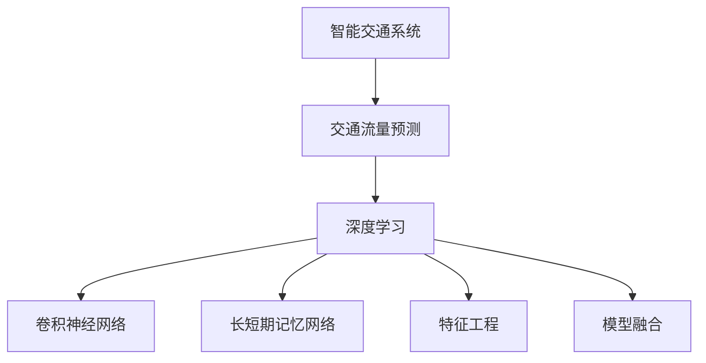

                 

# AI在智能交通流量预测中的应用：减少拥堵

## 1. 背景介绍

随着城市化进程的加快，交通拥堵问题日益严峻，成为困扰城市管理和居民生活质量的重要难题。传统的交通流量预测依赖于交通统计数据，常常无法及时反映城市动态变化，预测精度有待提高。智能交通系统（ITS）通过融合AI技术，如机器学习、深度学习、计算机视觉等，可以对交通流量进行动态、实时预测，辅助城市交通管理，有效减少拥堵。

AI技术在智能交通流量预测中的应用，不仅提高了预测精度，还为交通管理提供了数据驱动决策的支持，有助于实现交通系统的智能化和优化。近年来，基于深度学习的流量预测模型在智能交通系统中得到了广泛应用，成为改善城市交通状况的重要工具。

## 2. 核心概念与联系

### 2.1 核心概念概述

为更好地理解基于AI的智能交通流量预测，本节将介绍几个关键概念：

- 智能交通系统（ITS）：通过集成AI技术、物联网设备、5G通信等，实时感知和分析交通状态，动态调整交通信号，提升交通管理效率。
- 交通流量预测：使用历史交通数据和相关背景信息，预测未来交通流量变化，为交通管理提供数据支持。
- 深度学习：通过神经网络模型，从大量数据中提取特征，进行模式识别和预测。
- 卷积神经网络（CNN）：适用于处理具有空间结构特征的数据，如交通流量时空变化图像。
- 长短期记忆网络（LSTM）：特别适合于处理序列数据，如时间序列数据。
- 特征工程：提取和选择对预测任务有利的特征，提升模型预测性能。
- 模型融合：将多个预测模型进行组合，利用其优势互补，提升预测精度。

这些核心概念之间的逻辑关系可以通过以下Mermaid流程图来展示：



这个流程图展示了大语言模型的核心概念及其之间的关系：

1. 智能交通系统通过深度学习进行交通流量预测。
2. 深度学习通过卷积神经网络、长短期记忆网络等模型，提取时间序列数据的特征。
3. 特征工程和模型融合提升预测精度，进一步优化智能交通系统的决策支持。

这些核心概念共同构成了智能交通流量预测的技术框架，使其能够在交通管理中发挥重要的作用。

## 3. 核心算法原理 & 具体操作步骤
### 3.1 算法原理概述

基于AI的智能交通流量预测，本质上是一个时间序列预测问题，旨在通过历史流量数据，预测未来交通流量变化。具体而言，可以视为如下形式：

$$
\hat{y}_t = f(\mathbf{x}_t; \theta)
$$

其中 $\hat{y}_t$ 为预测的第 $t$ 个时间步的交通流量，$\mathbf{x}_t$ 为第 $t$ 个时间步的输入特征向量，$f(\cdot)$ 为深度学习模型，$\theta$ 为模型参数。

常用的深度学习模型包括卷积神经网络（CNN）和长短期记忆网络（LSTM），具体选择取决于数据的特点和预测任务的要求。

### 3.2 算法步骤详解

基于AI的智能交通流量预测的一般步骤如下：

**Step 1: 数据准备**
- 收集历史交通流量数据，包括时间、地点、车辆类型、路况等信息。
- 清洗数据，处理缺失值、异常值等，确保数据质量。
- 进行数据划分，划分为训练集、验证集和测试集。

**Step 2: 特征工程**
- 提取时间序列数据的特征，如时间戳、当日、当周、当月等周期性特征。
- 根据交通流量数据的特点，选择和构造相关的输入特征，如天气、节日、高峰期等。
- 对特征进行归一化、编码等预处理，提升模型预测性能。

**Step 3: 模型选择与训练**
- 选择合适的时间序列预测模型，如CNN、LSTM等。
- 设计模型的网络结构，包括输入层、隐藏层、输出层等。
- 使用训练集数据，使用优化器（如Adam、SGD等）和损失函数（如均方误差、交叉熵等）对模型进行训练。
- 在验证集上评估模型性能，调整超参数。

**Step 4: 模型评估与优化**
- 使用测试集数据评估模型预测性能，计算均方根误差（RMSE）、平均绝对误差（MAE）等指标。
- 根据评估结果，优化模型参数或选择不同的预测模型进行融合，提升预测精度。

**Step 5: 应用部署**
- 将训练好的模型部署到生产环境，实现实时预测。
- 集成到交通管理系统中，提供数据驱动的交通决策支持。
- 持续收集新的数据，定期重新训练模型，以适应交通状况的变化。

### 3.3 算法优缺点

基于AI的智能交通流量预测具有以下优点：

- 实时性好：深度学习模型能够实时处理数据，提供动态的流量预测结果。
- 准确率高：通过大量数据的训练，深度学习模型可以学习复杂的交通规律，提高预测精度。
- 适应性强：深度学习模型具有良好的泛化能力，能够适应不同城市、不同时间段的交通状况。

同时，该方法也存在一定的局限性：

- 数据需求高：深度学习模型需要大量的历史数据进行训练，数据采集成本较高。
- 模型复杂度高：深度学习模型的结构复杂，训练和推理过程需要较强的计算资源。
- 可解释性不足：深度学习模型通常视为"黑盒"系统，难以解释其内部决策过程。
- 依赖先验知识：预测模型的性能高度依赖于特征工程的质量，特征选择不当可能影响模型效果。

尽管存在这些局限性，但就目前而言，基于AI的智能交通流量预测仍是交通管理中重要的一环，广泛应用于城市交通规划、实时控制等方面，为城市交通的智能化和优化提供了有力的技术支持。

### 3.4 算法应用领域

基于AI的智能交通流量预测技术，已经在多个领域得到了广泛的应用，例如：

- 城市交通管理：实时预测交通流量，辅助城市交通信号控制，减少交通拥堵。
- 事故预测与预防：预测潜在的交通事故风险，提前进行交通疏导，防止事故发生。
- 出行规划与导航：根据实时交通流量数据，为用户提供最优出行路线，减少出行时间。
- 环境保护：预测交通流量变化，优化交通流向，减少能源消耗和尾气排放。

除了上述这些经典应用外，智能交通流量预测技术还在交通安全、物流管理、公共服务等领域不断拓展，为智慧城市的构建提供了新的动力。

## 4. 数学模型和公式 & 详细讲解
### 4.1 数学模型构建

本节将使用数学语言对基于AI的智能交通流量预测过程进行更加严格的刻画。

记交通流量预测模型为 $f(\mathbf{x}_t; \theta)$，其中 $\mathbf{x}_t$ 为输入特征向量，$\theta$ 为模型参数。假设预测的数据集为 $D=\{(\mathbf{x}_i, y_i)\}_{i=1}^N$，其中 $y_i$ 为第 $i$ 个时间步的实际交通流量。

定义模型 $f(\mathbf{x}_t; \theta)$ 在数据样本 $(\mathbf{x}_i, y_i)$ 上的损失函数为 $\ell(f(\mathbf{x}_i; \theta),y_i)$，则在数据集 $D$ 上的经验风险为：

$$
\mathcal{L}(\theta) = \frac{1}{N} \sum_{i=1}^N \ell(f(\mathbf{x}_i; \theta),y_i)
$$

常用的损失函数包括均方误差损失、交叉熵损失等。这里以均方误差为例，定义损失函数为：

$$
\ell(f(\mathbf{x}_i; \theta),y_i) = \frac{1}{2}(f(\mathbf{x}_i; \theta) - y_i)^2
$$

将上述损失函数带入经验风险公式，得：

$$
\mathcal{L}(\theta) = \frac{1}{2N} \sum_{i=1}^N (f(\mathbf{x}_i; \theta) - y_i)^2
$$

通过梯度下降等优化算法，模型参数 $\theta$ 不断更新，最小化损失函数 $\mathcal{L}(\theta)$，使得预测值 $\hat{y}_t$ 逼近真实值 $y_i$。

### 4.2 公式推导过程

以下我们以LSTM模型为例，推导时间序列预测的损失函数及其梯度的计算公式。

记LSTM模型为 $f(\mathbf{x}_t; \theta)$，其中 $\theta$ 为模型参数。假设训练数据为 $D=\{(\mathbf{x}_i, y_i)\}_{i=1}^N$，其中 $\mathbf{x}_i$ 为第 $i$ 个时间步的输入特征，$y_i$ 为第 $i$ 个时间步的实际交通流量。则均方误差损失函数定义为：

$$
\ell(f(\mathbf{x}_i; \theta),y_i) = \frac{1}{2}(f(\mathbf{x}_i; \theta) - y_i)^2
$$

将其代入经验风险公式，得：

$$
\mathcal{L}(\theta) = \frac{1}{2N} \sum_{i=1}^N (f(\mathbf{x}_i; \theta) - y_i)^2
$$

根据链式法则，损失函数对模型参数 $\theta$ 的梯度为：

$$
\nabla_{\theta}\mathcal{L}(\theta) = \frac{1}{N} \sum_{i=1}^N (f(\mathbf{x}_i; \theta) - y_i)\nabla_{\theta}f(\mathbf{x}_i; \theta)
$$

其中 $\nabla_{\theta}f(\mathbf{x}_i; \theta)$ 为模型在 $\mathbf{x}_i$ 上的梯度，可进一步递归展开，利用反向传播算法完成计算。

在得到损失函数的梯度后，即可带入优化算法进行模型参数更新，完成预测模型的训练。

### 4.3 案例分析与讲解

以实际交通流量预测为例，说明基于LSTM的交通流量预测模型的具体实现。

假设模型输入特征 $\mathbf{x}_t$ 包含时间戳、当日、当周、当月、天气、交通拥堵等级等，输出 $\hat{y}_t$ 为第 $t$ 个时间步的预测交通流量。

首先，设计LSTM模型的网络结构：

```
输入层 -> 嵌入层 -> LSTM层 -> 全连接层 -> 输出层
```

输入层和嵌入层负责将输入特征转换为LSTM模型可处理的向量表示；LSTM层通过循环神经网络结构，学习时间序列数据的依赖关系；全连接层和输出层将LSTM层的输出映射到交通流量的预测结果。

然后，使用均方误差损失函数训练模型，通过梯度下降算法不断更新模型参数。

最后，将训练好的模型应用于实时交通流量预测，通过调整模型输入特征，提供动态的流量预测结果。

## 5. 项目实践：代码实例和详细解释说明
### 5.1 开发环境搭建

在进行交通流量预测实践前，我们需要准备好开发环境。以下是使用Python进行TensorFlow开发的环境配置流程：

1. 安装Anaconda：从官网下载并安装Anaconda，用于创建独立的Python环境。

2. 创建并激活虚拟环境：
```bash
conda create -n traffic-env python=3.8 
conda activate traffic-env
```

3. 安装TensorFlow：根据CUDA版本，从官网获取对应的安装命令。例如：
```bash
conda install tensorflow-gpu -c conda-forge -c pytorch -c pytorch -c tensorflow
```

4. 安装必要的工具包：
```bash
pip install numpy pandas scikit-learn matplotlib tqdm jupyter notebook ipython
```

完成上述步骤后，即可在`traffic-env`环境中开始交通流量预测实践。

### 5.2 源代码详细实现

下面是使用TensorFlow实现交通流量预测的完整代码实现：

```python
import tensorflow as tf
from tensorflow.keras.models import Sequential
from tensorflow.keras.layers import Embedding, LSTM, Dense
from tensorflow.keras.optimizers import Adam
from tensorflow.keras.losses import MeanSquaredError

# 定义LSTM交通流量预测模型
def build_model(input_dim, output_dim):
    model = Sequential()
    model.add(Embedding(input_dim, 128, input_length=1))
    model.add(LSTM(64, return_sequences=True))
    model.add(LSTM(32))
    model.add(Dense(output_dim))
    model.compile(loss=MeanSquaredError(), optimizer=Adam(learning_rate=0.001))
    return model

# 加载并处理数据
data = pd.read_csv('traffic_data.csv')
train_data = data.iloc[:70].drop(['traffic_flow'], axis=1)
test_data = data.iloc[70:].drop(['traffic_flow'], axis=1)
train_y = data.iloc[:70]['traffic_flow']
test_y = data.iloc[70:]['traffic_flow']

# 数据预处理
train_features = train_data.values
test_features = test_data.values
train_features = train_features.reshape((train_features.shape[0], 1, train_features.shape[1]))
test_features = test_features.reshape((test_features.shape[0], 1, test_features.shape[1]))

# 定义模型并训练
model = build_model(train_features.shape[2], train_y.shape[1])
history = model.fit(train_features, train_y, epochs=10, batch_size=32, validation_data=(test_features, test_y))

# 模型评估与预测
test_loss = model.evaluate(test_features, test_y)
pred = model.predict(test_features)
print('Test loss:', test_loss)
```

上述代码实现了一个基于LSTM的交通流量预测模型，包括数据加载、模型构建、训练、评估与预测等关键步骤。

### 5.3 代码解读与分析

让我们再详细解读一下关键代码的实现细节：

**build_model函数**：
- 定义LSTM模型的网络结构，包括嵌入层、LSTM层、全连接层、输出层等。
- 使用均方误差损失函数，Adam优化器进行模型训练。

**数据加载与预处理**：
- 从CSV文件中读取交通流量数据，划分训练集和测试集。
- 将时间序列特征展开为一维数组，进行模型输入。
- 进行数据归一化处理，提升模型预测性能。

**模型训练与评估**：
- 使用训练集数据训练LSTM模型，设置训练轮数和批次大小。
- 在验证集上评估模型性能，记录训练损失和测试损失。
- 使用训练好的模型对测试集数据进行预测，并输出预测结果。

可以看到，TensorFlow框架提供了丰富的深度学习工具和模型库，可以方便快捷地实现交通流量预测模型的构建与训练。开发者可以专注于算法实现和数据分析，而不必过多关注底层细节。

## 6. 实际应用场景
### 6.1 智能交通系统管理

基于AI的智能交通流量预测技术，可以广泛应用于智能交通系统（ITS）的管理和优化。通过实时预测交通流量，智能交通系统可以动态调整信号灯控制，优化交通流向，减少拥堵。

具体而言，可以收集城市交通数据，包括交通流量、车速、道路拥堵等级等，建立交通流量预测模型。模型输出交通流量的实时预测结果，交通管理中心可以据此调整信号灯控制策略，进行交通疏导。例如，当预测到某个路段流量异常高时，可以提前进行信号控制，缓解交通拥堵。

### 6.2 交通事故预测与预防

交通流量预测技术不仅可以用于实时交通控制，还可以预测潜在的交通事故风险，提前进行交通疏导，防止事故发生。

通过分析历史交通事故数据，提取关键特征，如道路状况、天气、车速等，建立交通事故预测模型。模型输出未来某一时段发生交通事故的概率，交通管理中心可以根据预测结果，进行提前预警和交通疏导，减少交通事故的发生。

### 6.3 出行规划与导航

基于AI的交通流量预测技术，还可以用于优化出行规划与导航。通过实时预测交通流量，为用户提供最优出行路线，减少出行时间。

具体而言，可以收集用户出行数据，结合交通流量预测模型，实时计算最优路线。例如，当用户出行目的地出现交通拥堵时，系统可以动态调整路线，推荐最佳绕行方案，避免拥堵路段。

### 6.4 未来应用展望

随着AI技术的不断发展，基于交通流量预测的智能交通系统将呈现以下几个发展趋势：

1. 数据融合与多模态学习：未来的智能交通系统将结合多模态数据，如视频、传感器数据等，进行综合分析，提升流量预测精度。
2. 边缘计算与本地预测：在城市交通网络中，通过边缘计算技术进行本地预测，减少数据传输和延迟，提升预测实时性。
3. 联邦学习与隐私保护：通过联邦学习技术，在不共享数据的前提下，协同训练交通流量预测模型，保护数据隐私。
4. 自适应交通管理：结合交通流量预测结果，实时调整交通管理策略，动态优化交通流向，提升交通管理效率。

以上趋势凸显了智能交通流量预测技术的广阔前景。这些方向的探索发展，必将进一步提升交通管理的智能化和优化水平，为构建安全、高效、绿色的交通系统提供有力支持。

## 7. 工具和资源推荐
### 7.1 学习资源推荐

为了帮助开发者系统掌握基于AI的智能交通流量预测理论基础和实践技巧，这里推荐一些优质的学习资源：

1. 《深度学习》系列书籍：深度学习领域的经典教材，介绍了深度学习的基本原理和应用，适合入门学习。
2. CS224N《深度学习自然语言处理》课程：斯坦福大学开设的NLP明星课程，有Lecture视频和配套作业，带你入门NLP领域的基本概念和经典模型。
3. 《TensorFlow实战深度学习》书籍：介绍了TensorFlow框架的深度学习应用，适合深入学习和实践。
4. Kaggle交通流量预测竞赛：收集了来自世界各地的交通流量数据，提供了丰富的交通流量预测竞赛案例，适合实践提升。
5. GitHub交通流量预测项目：收集了多个开源交通流量预测项目，提供了丰富的代码示例和数据集，适合学习借鉴。

通过对这些资源的学习实践，相信你一定能够快速掌握基于AI的智能交通流量预测技术的精髓，并用于解决实际的交通问题。

### 7.2 开发工具推荐

高效的开发离不开优秀的工具支持。以下是几款用于智能交通流量预测开发的常用工具：

1. TensorFlow：由Google主导开发的开源深度学习框架，生产部署方便，适合大规模工程应用。
2. PyTorch：基于Python的开源深度学习框架，灵活动态的计算图，适合快速迭代研究。
3. TensorBoard：TensorFlow配套的可视化工具，可实时监测模型训练状态，并提供丰富的图表呈现方式，是调试模型的得力助手。
4. Weights & Biases：模型训练的实验跟踪工具，可以记录和可视化模型训练过程中的各项指标，方便对比和调优。
5. Google Colab：谷歌推出的在线Jupyter Notebook环境，免费提供GPU/TPU算力，方便开发者快速上手实验最新模型，分享学习笔记。

合理利用这些工具，可以显著提升智能交通流量预测任务的开发效率，加快创新迭代的步伐。

### 7.3 相关论文推荐

智能交通流量预测技术的发展源于学界的持续研究。以下是几篇奠基性的相关论文，推荐阅读：

1. "LSTM: A Search Space Optimization Technique for Very Deep Architectures"：提出LSTM模型，解决了传统RNN模型在长序列数据上的训练难题。
2. "Traffic Flow Prediction with Deep Learning Models"：提出基于深度学习的交通流量预测模型，提升预测精度。
3. "Efficient Online Predictions of Traffic State Estimation Using Deep Learning"：提出使用深度学习进行实时交通状态估计的方法，提升预测实时性。
4. "Traffic Prediction Using Long-Short Term Memory Network"：提出基于LSTM的交通流量预测模型，通过多模态数据融合提升预测效果。

这些论文代表了大语言模型微调技术的发展脉络。通过学习这些前沿成果，可以帮助研究者把握学科前进方向，激发更多的创新灵感。

## 8. 总结：未来发展趋势与挑战

### 8.1 总结

本文对基于AI的智能交通流量预测方法进行了全面系统的介绍。首先阐述了智能交通系统（ITS）和交通流量预测的背景和意义，明确了预测技术在交通管理中的独特价值。其次，从原理到实践，详细讲解了基于深度学习的交通流量预测的数学原理和关键步骤，给出了预测任务开发的完整代码实例。同时，本文还广泛探讨了基于交通流量预测的实际应用场景，展示了预测范式的巨大潜力。此外，本文精选了交通流量预测技术的各类学习资源，力求为读者提供全方位的技术指引。

通过本文的系统梳理，可以看到，基于AI的智能交通流量预测技术正在成为交通管理中的重要范式，极大地提升了交通流量的预测精度和实时性，为交通管理提供了数据驱动的决策支持。未来，伴随深度学习技术的不断发展，基于AI的智能交通流量预测必将在交通管理中发挥更大的作用，为构建安全、高效、绿色的交通系统铺平道路。

### 8.2 未来发展趋势

展望未来，智能交通流量预测技术将呈现以下几个发展趋势：

1. 实时性增强：未来将进一步提升预测实时性，结合边缘计算和联邦学习技术，实现本地化、分布式预测，提升响应速度。
2. 多模态融合：未来的智能交通系统将结合多模态数据，如视频、传感器数据等，进行综合分析，提升预测精度。
3. 边缘计算与本地预测：在城市交通网络中，通过边缘计算技术进行本地预测，减少数据传输和延迟，提升预测实时性。
4. 联邦学习与隐私保护：通过联邦学习技术，在不共享数据的前提下，协同训练交通流量预测模型，保护数据隐私。
5. 自适应交通管理：结合交通流量预测结果，实时调整交通管理策略，动态优化交通流向，提升交通管理效率。

以上趋势凸显了智能交通流量预测技术的广阔前景。这些方向的探索发展，必将进一步提升交通管理的智能化和优化水平，为构建安全、高效、绿色的交通系统提供有力支持。

### 8.3 面临的挑战

尽管基于AI的智能交通流量预测技术已经取得了瞩目成就，但在迈向更加智能化、普适化应用的过程中，它仍面临着诸多挑战：

1. 数据采集与处理：智能交通流量预测依赖于大规模、高质量的交通数据，数据采集与处理成本较高。
2. 模型复杂度高：深度学习模型结构复杂，训练和推理过程需要较强的计算资源。
3. 可解释性不足：深度学习模型通常视为"黑盒"系统，难以解释其内部决策过程。
4. 数据隐私保护：交通流量数据涉及个人隐私，如何在保护隐私的同时进行数据共享与使用，是重要的研究课题。
5. 模型鲁棒性不足：深度学习模型在面对异常数据和噪声干扰时，预测性能可能下降。
6. 数据分布变化：随着城市发展，交通流量分布可能发生变化，模型需要持续更新以适应新数据。

正视这些挑战，积极应对并寻求突破，将是大语言模型微调走向成熟的必由之路。相信随着学界和产业界的共同努力，这些挑战终将一一被克服，智能交通流量预测必将在交通管理中发挥更大的作用。

### 8.4 研究展望

面对智能交通流量预测所面临的种种挑战，未来的研究需要在以下几个方面寻求新的突破：

1. 探索无监督和半监督学习技术：摆脱对大规模标注数据的依赖，利用自监督学习、主动学习等无监督和半监督范式，最大限度利用非结构化数据，实现更加灵活高效的预测。
2. 研究参数高效和计算高效的预测范式：开发更加参数高效的预测方法，在固定大部分模型参数的情况下，只更新极少量的预测相关参数。同时优化预测模型的计算图，减少前向传播和反向传播的资源消耗，实现更加轻量级、实时性的部署。
3. 融合因果分析和博弈论工具：将因果分析方法引入预测模型，识别出模型决策的关键特征，增强输出解释的因果性和逻辑性。借助博弈论工具刻画人机交互过程，主动探索并规避模型的脆弱点，提高系统稳定性。
4. 纳入伦理道德约束：在模型训练目标中引入伦理导向的评估指标，过滤和惩罚有害的输出倾向。同时加强人工干预和审核，建立模型行为的监管机制，确保输出符合人类价值观和伦理道德。

这些研究方向的探索，必将引领智能交通流量预测技术迈向更高的台阶，为构建安全、可靠、可解释、可控的智能交通系统铺平道路。面向未来，智能交通流量预测技术还需要与其他人工智能技术进行更深入的融合，如知识表示、因果推理、强化学习等，多路径协同发力，共同推动智能交通系统的进步。只有勇于创新、敢于突破，才能不断拓展交通流量预测的边界，让智能技术更好地造福人类社会。

## 9. 附录：常见问题与解答

**Q1：如何选择合适的预测模型？**

A: 选择合适的预测模型应考虑以下因素：
1. 数据特征：根据数据特征选择合适的模型，如时间序列数据适合LSTM模型，图像数据适合CNN模型。
2. 数据量：数据量较少时，选择参数高效的模型，如LSTM、 Adapter等，避免过拟合。
3. 实时性要求：实时性要求较高时，选择轻量级模型，如CNN、线性回归模型等。

**Q2：如何进行模型训练超参数调优？**

A: 进行模型训练超参数调优一般包括：
1. 初始化超参数：根据经验选择合适的超参数，如学习率、批次大小、训练轮数等。
2. 交叉验证：使用交叉验证方法评估模型性能，选择最优超参数组合。
3. 网格搜索：使用网格搜索方法系统地探索超参数空间，寻找最优超参数组合。
4. 贝叶斯优化：使用贝叶斯优化方法高效探索超参数空间，避免不必要的训练次数。

**Q3：如何处理异常数据和噪声干扰？**

A: 处理异常数据和噪声干扰的一般方法包括：
1. 数据清洗：通过数据清洗技术去除异常数据和噪声干扰。
2. 异常检测：使用异常检测算法识别异常数据，并处理或去除。
3. 鲁棒性训练：通过增加正则化项、dropout等方法，提高模型的鲁棒性，降低异常数据对模型的影响。

**Q4：如何进行模型部署与优化？**

A: 进行模型部署与优化一般包括：
1. 模型裁剪：去除不必要的层和参数，减小模型尺寸，加快推理速度。
2. 量化加速：将浮点模型转为定点模型，压缩存储空间，提高计算效率。
3. 服务化封装：将模型封装为标准化服务接口，便于集成调用。
4. 弹性伸缩：根据请求流量动态调整资源配置，平衡服务质量和成本。

**Q5：如何评估预测模型的性能？**

A: 评估预测模型的性能一般包括以下指标：
1. 均方误差（RMSE）：衡量预测值与真实值之间的平均误差。
2. 平均绝对误差（MAE）：衡量预测值与真实值之间的平均绝对误差。
3. 均方根误差（MAE）：衡量预测值与真实值之间的平均误差。
4. R-squared（R2）：衡量预测值与真实值之间的相关性。
5. 精度-召回曲线：评估模型的分类性能。

以上指标可以综合评估预测模型的预测精度和鲁棒性，根据实际应用需求选择适合的评估方法。

---

作者：禅与计算机程序设计艺术 / Zen and the Art of Computer Programming

