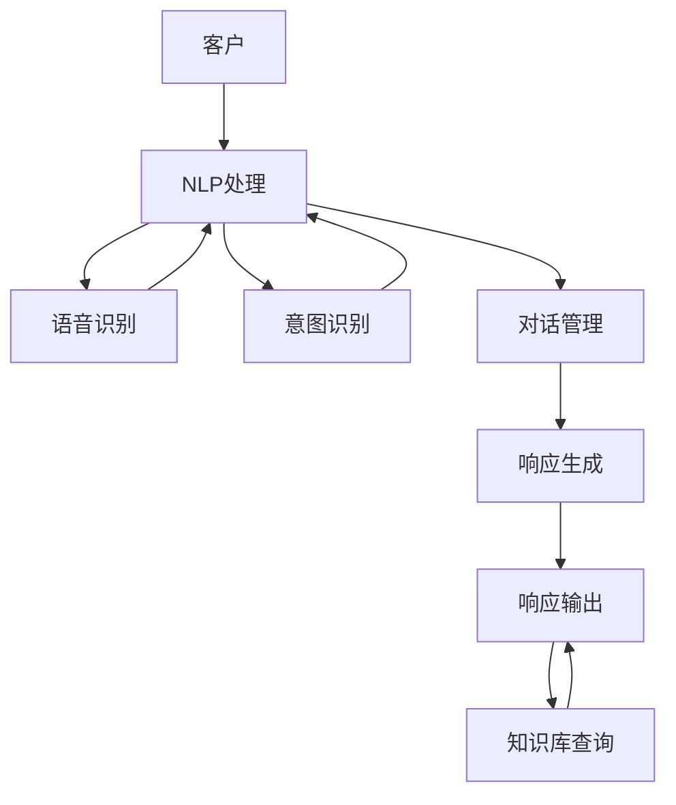

                 

# AI在智能客服中的应用：24/7全天候服务

> 关键词：智能客服, 24/7服务, 人工智能, 自然语言处理(NLP), 语音识别, 意图识别, 用户对话, 自动化, 机器学习, 深度学习, 模型部署, 性能评估, 用户体验

## 1. 背景介绍

### 1.1 问题由来
随着信息技术的飞速发展，企业对客户服务的期望也在不断提高。传统的客户服务模式往往需要配置大量人力，无法满足7x24小时不间断服务的需求。而随着人工智能技术的进步，利用AI技术构建智能客服系统成为了新的趋势。

智能客服系统通过自动化处理客户咨询，可以大大提升服务效率和响应速度，改善用户体验。AI驱动的智能客服系统，结合自然语言处理(NLP)、语音识别、意图识别等技术，可以理解和处理复杂的用户需求，提供高质量的客户服务。

### 1.2 问题核心关键点
智能客服的核心在于构建一个高效、智能、人机协同的服务系统。主要包括以下几个关键点：

- **自然语言处理(NLP)**：理解和生成自然语言的能力，实现与客户的自然对话。
- **语音识别**：将客户的语音转换为文本，实现语音交互功能。
- **意图识别**：识别用户的问题意图，引导客户接入最合适的服务和解决方案。
- **自动化响应**：根据意图自动生成回复，减少人工干预。
- **知识库管理**：集成并维护一个丰富的知识库，供AI模型检索使用。

## 2. 核心概念与联系

### 2.1 核心概念概述

智能客服系统主要涉及以下几个核心概念：

- **自然语言处理(NLP)**：AI系统处理和理解自然语言的技术，包括语言理解、语言生成、语义分析等。
- **语音识别**：将语音信号转换为文本，是智能客服系统中语音交互的基础。
- **意图识别**：识别用户输入的自然语言，理解其背后的意图，是智能客服系统做出正确响应和行动的前提。
- **对话管理**：管理智能客服系统与客户之间的对话，确保对话流程的连贯性和逻辑性。
- **知识库**：存储企业常见问题解答、产品信息、服务政策等内容，供AI系统检索使用。

这些核心概念之间的逻辑关系可以通过以下Mermaid流程图来展示：



这个流程图展示了智能客服系统的工作流程：

1. 客户输入文本或语音。
2. NLP处理模块理解并分析客户的输入，包括语言理解、语音识别等。
3. 意图识别模块识别客户的意图。
4. 对话管理模块根据意图管理对话流程。
5. 响应生成模块根据意图生成合适的回复。
6. 知识库查询模块从知识库中检索相关信息，优化回复。
7. 最终，系统输出回复给客户。

## 3. 核心算法原理 & 具体操作步骤
### 3.1 算法原理概述

智能客服系统的核心算法主要涉及NLP、语音识别、意图识别和对话管理等技术。这些技术共同构建了一个高效的客户服务系统，能够提供24/7全天候服务。

以自然语言处理为例，智能客服系统通过预训练语言模型在大量文本数据上进行训练，学习语言知识和常识。微调该模型以适应特定业务场景，使其能够理解并生成自然语言。

### 3.2 算法步骤详解

#### 3.2.1 模型选择和预训练

智能客服系统的核心是自然语言处理模型。一般会选择一些预训练的通用语言模型，如BERT、GPT等，并在特定业务场景上进行微调。

1. 选择合适的预训练模型：如BERT、GPT等，加载到系统中。
2. 准备业务数据集：将企业内部客服对话、常见问答、产品说明等数据作为训练材料。
3. 微调模型：使用微调技术对预训练模型进行进一步训练，以适应特定业务需求。

#### 3.2.2 意图识别

意图识别是智能客服系统的关键环节，决定了系统如何响应用户请求。

1. 构建意图识别模型：使用分类模型（如BERT、RNN等）对意图进行分类。
2. 准备训练数据：将客户输入的文本或语音，标注对应的意图类别，如问题解决、服务申请、产品咨询等。
3. 训练和优化模型：使用标注数据训练意图识别模型，调整超参数和模型结构，优化性能。

#### 3.2.3 对话管理

对话管理模块负责引导和控制客服系统与客户之间的对话流程。

1. 设计对话流程：根据业务需求，设计对话的流程和分支。
2. 实现对话管理：使用状态机或规则引擎管理对话状态和流程。
3. 持续优化：根据用户反馈和对话记录，不断优化对话管理策略。

#### 3.2.4 响应生成

响应生成模块根据客户的意图和对话历史，生成合适的回复。

1. 准备回复模板：根据常见问题和解决方案，构建回复模板。
2. 生成回复：根据意图和对话历史，使用回复模板生成自然语言回复。
3. 持续学习：根据客户反馈，不断更新回复模板和生成策略。

#### 3.2.5 知识库管理

知识库管理模块负责存储和检索相关信息，优化回复内容。

1. 构建知识库：将常见问题、产品信息、服务政策等存储在知识库中。
2. 实现检索功能：设计索引和检索算法，确保知识库的快速查询。
3. 持续更新：根据业务变化和客户反馈，定期更新知识库内容。

### 3.3 算法优缺点

智能客服系统在提供24/7全天候服务方面具有显著优势：

- **高效性**：利用AI技术处理客户请求，显著提升服务响应速度和效率。
- **全天候服务**：不受人力工作时间限制，可以提供全天候服务，提升客户满意度。
- **自动更新**：通过持续学习和优化，系统能够不断提升性能，适应新的业务需求。

同时，该系统也存在以下缺点：

- **初期成本高**：构建智能客服系统需要一定的初期投入，包括数据准备、模型训练和系统部署。
- **依赖数据质量**：智能客服系统依赖大量的高质量训练数据，数据质量直接影响系统性能。
- **维护复杂**：系统需要定期维护和更新，确保其持续有效。

### 3.4 算法应用领域

智能客服系统在多个领域都有广泛应用，例如：

- **电商客服**：处理客户咨询、订单管理、退货服务等。
- **银行客服**：提供账户查询、交易咨询、投诉处理等。
- **医疗客服**：解答健康咨询、预约挂号、药品咨询等。
- **旅游客服**：处理旅游信息查询、预订、投诉等。
- **企业客服**：处理技术支持、产品咨询、售后服务等。

## 4. 数学模型和公式 & 详细讲解  
### 4.1 数学模型构建

智能客服系统中的核心数学模型主要涉及自然语言处理和意图识别。

- **自然语言处理模型**：如BERT、GPT等，通过大量文本数据进行预训练，学习语言知识和常识。
- **意图识别模型**：一般使用分类模型，如Logistic回归、支持向量机(SVM)、神经网络等，对客户输入的文本或语音进行分类。

以BERT模型为例，其数学模型构建如下：

- **输入表示**：将客户输入的文本转换为向量表示。
- **语言理解**：通过Transformer结构，学习文本中的语义关系。
- **意图分类**：使用全连接层或卷积层对理解后的向量进行分类，得到意图标签。

### 4.2 公式推导过程

以BERT模型为例，推导意图分类的公式如下：

设输入文本为 $x$，BERT模型的输出表示为 $h_x$，意图分类器为 $f(\cdot)$，则意图识别模型的输出为：

$$
\hat{y} = f(h_x)
$$

其中 $\hat{y}$ 为预测的意图标签，$h_x$ 为BERT模型对输入文本 $x$ 的向量表示，$f(\cdot)$ 为分类器函数。

对于分类器函数 $f(\cdot)$，一般使用Softmax函数进行多分类：

$$
f(h_x) = \frac{e^{h_x^\top w}}{\sum_{i=1}^K e^{h_x^\top w_i}}
$$

其中 $w$ 为分类器参数，$K$ 为分类数量。

### 4.3 案例分析与讲解

假设我们有一个智能客服系统，用于处理常见的问题解决意图。我们使用一个预训练的BERT模型，并在标注数据上进行微调。

- **数据准备**：收集常见的客户咨询和解决策略，标注对应的意图类别。
- **模型微调**：使用微调技术对BERT模型进行训练，学习意图分类。
- **测试评估**：在测试集上评估模型性能，对比微调前后的效果。

## 5. 项目实践：代码实例和详细解释说明
### 5.1 开发环境搭建

在搭建智能客服系统的开发环境时，需要考虑以下几个方面：

- **编程语言**：Python是最常用的编程语言之一，适合构建智能客服系统。
- **框架**：如TensorFlow、PyTorch等深度学习框架，提供强大的模型训练和推理能力。
- **库**：如NLTK、spaCy等自然语言处理库，提供文本处理和分析功能。

以下是搭建开发环境的示例步骤：

1. 安装Anaconda：从官网下载并安装Anaconda，用于创建独立的Python环境。

2. 创建并激活虚拟环境：
```bash
conda create -n my_env python=3.8
conda activate my_env
```

3. 安装必要的库：
```bash
pip install torch transformers nlp toolkits
```

4. 配置环境变量：
```bash
export PYTHONPATH=$PYTHONPATH:$(pwd) 
```

5. 启动Jupyter Notebook：
```bash
jupyter notebook
```

### 5.2 源代码详细实现

智能客服系统的实现涉及多个组件，这里以一个基于BERT模型的智能客服系统为例，展示核心代码实现：

#### 5.2.1 模型训练

```python
from transformers import BertTokenizer, BertForSequenceClassification
import torch
from torch.utils.data import Dataset, DataLoader

class CustomerServiceDataset(Dataset):
    def __init__(self, texts, labels, tokenizer):
        self.tokenizer = tokenizer
        self.texts = texts
        self.labels = labels
        
    def __len__(self):
        return len(self.texts)
    
    def __getitem__(self, idx):
        text = self.texts[idx]
        label = self.labels[idx]
        encoding = self.tokenizer(text, truncation=True, padding='max_length')
        input_ids = encoding['input_ids']
        attention_mask = encoding['attention_mask']
        return {
            'input_ids': torch.tensor(input_ids),
            'attention_mask': torch.tensor(attention_mask),
            'labels': torch.tensor(label)
        }

tokenizer = BertTokenizer.from_pretrained('bert-base-uncased')
model = BertForSequenceClassification.from_pretrained('bert-base-uncased', num_labels=5)

# 准备数据集
train_dataset = CustomerServiceDataset(train_texts, train_labels, tokenizer)
dev_dataset = CustomerServiceDataset(dev_texts, dev_labels, tokenizer)
test_dataset = CustomerServiceDataset(test_texts, test_labels, tokenizer)

# 训练模型
device = torch.device('cuda' if torch.cuda.is_available() else 'cpu')
model.to(device)

optimizer = torch.optim.Adam(model.parameters(), lr=2e-5)
criterion = torch.nn.CrossEntropyLoss()

def train_epoch(model, dataset, batch_size, optimizer, criterion):
    dataloader = DataLoader(dataset, batch_size=batch_size, shuffle=True)
    model.train()
    epoch_loss = 0
    for batch in dataloader:
        input_ids = batch['input_ids'].to(device)
        attention_mask = batch['attention_mask'].to(device)
        labels = batch['labels'].to(device)
        optimizer.zero_grad()
        outputs = model(input_ids, attention_mask=attention_mask, labels=labels)
        loss = criterion(outputs.logits, labels)
        epoch_loss += loss.item()
        loss.backward()
        optimizer.step()
    return epoch_loss / len(dataloader)

def evaluate(model, dataset, batch_size, criterion):
    dataloader = DataLoader(dataset, batch_size=batch_size, shuffle=False)
    model.eval()
    preds, labels = [], []
    with torch.no_grad():
        for batch in dataloader:
            input_ids = batch['input_ids'].to(device)
            attention_mask = batch['attention_mask'].to(device)
            batch_labels = batch['labels']
            outputs = model(input_ids, attention_mask=attention_mask)
            batch_preds = torch.argmax(outputs.logits, dim=1).to('cpu').tolist()
            batch_labels = batch_labels.to('cpu').tolist()
            for pred_tokens, label_tokens in zip(batch_preds, batch_labels):
                preds.append(pred_tokens[:len(label_tokens)])
                labels.append(label_tokens)
    return classification_report(labels, preds)

epochs = 3
batch_size = 16

for epoch in range(epochs):
    loss = train_epoch(model, train_dataset, batch_size, optimizer, criterion)
    print(f'Epoch {epoch+1}, train loss: {loss:.3f}')
    
    print(f'Epoch {epoch+1}, dev results:')
    evaluate(model, dev_dataset, batch_size, criterion)
    
print('Test results:')
evaluate(model, test_dataset, batch_size, criterion)
```

#### 5.2.2 意图识别

```python
import torch
from torch.utils.data import Dataset, DataLoader

class IntentRecognitionDataset(Dataset):
    def __init__(self, texts, labels, tokenizer):
        self.tokenizer = tokenizer
        self.texts = texts
        self.labels = labels
        
    def __len__(self):
        return len(self.texts)
    
    def __getitem__(self, idx):
        text = self.texts[idx]
        label = self.labels[idx]
        encoding = self.tokenizer(text, truncation=True, padding='max_length')
        input_ids = encoding['input_ids']
        attention_mask = encoding['attention_mask']
        return {
            'input_ids': torch.tensor(input_ids),
            'attention_mask': torch.tensor(attention_mask),
            'labels': torch.tensor(label)
        }

tokenizer = BertTokenizer.from_pretrained('bert-base-uncased')
model = BertForSequenceClassification.from_pretrained('bert-base-uncased', num_labels=5)

# 准备数据集
train_dataset = IntentRecognitionDataset(train_texts, train_labels, tokenizer)
dev_dataset = IntentRecognitionDataset(dev_texts, dev_labels, tokenizer)
test_dataset = IntentRecognitionDataset(test_texts, test_labels, tokenizer)

# 训练模型
device = torch.device('cuda' if torch.cuda.is_available() else 'cpu')
model.to(device)

optimizer = torch.optim.Adam(model.parameters(), lr=2e-5)
criterion = torch.nn.CrossEntropyLoss()

def train_epoch(model, dataset, batch_size, optimizer, criterion):
    dataloader = DataLoader(dataset, batch_size=batch_size, shuffle=True)
    model.train()
    epoch_loss = 0
    for batch in dataloader:
        input_ids = batch['input_ids'].to(device)
        attention_mask = batch['attention_mask'].to(device)
        labels = batch['labels'].to(device)
        optimizer.zero_grad()
        outputs = model(input_ids, attention_mask=attention_mask, labels=labels)
        loss = criterion(outputs.logits, labels)
        epoch_loss += loss.item()
        loss.backward()
        optimizer.step()
    return epoch_loss / len(dataloader)

def evaluate(model, dataset, batch_size, criterion):
    dataloader = DataLoader(dataset, batch_size=batch_size, shuffle=False)
    model.eval()
    preds, labels = [], []
    with torch.no_grad():
        for batch in dataloader:
            input_ids = batch['input_ids'].to(device)
            attention_mask = batch['attention_mask'].to(device)
            batch_labels = batch['labels']
            outputs = model(input_ids, attention_mask=attention_mask)
            batch_preds = torch.argmax(outputs.logits, dim=1).to('cpu').tolist()
            batch_labels = batch_labels.to('cpu').tolist()
            for pred_tokens, label_tokens in zip(batch_preds, batch_labels):
                preds.append(pred_tokens[:len(label_tokens)])
                labels.append(label_tokens)
    return classification_report(labels, preds)

epochs = 3
batch_size = 16

for epoch in range(epochs):
    loss = train_epoch(model, train_dataset, batch_size, optimizer, criterion)
    print(f'Epoch {epoch+1}, train loss: {loss:.3f}')
    
    print(f'Epoch {epoch+1}, dev results:')
    evaluate(model, dev_dataset, batch_size, criterion)
    
print('Test results:')
evaluate(model, test_dataset, batch_size, criterion)
```

### 5.3 代码解读与分析

智能客服系统的核心代码实现主要涉及以下关键点：

1. **数据准备**：将客户咨询和解决方案文本数据作为训练材料，使用BertTokenizer将文本转换为模型输入的向量表示。
2. **模型训练**：使用BERT模型进行意图识别训练，调整超参数和模型结构，优化性能。
3. **测试评估**：在测试集上评估模型性能，对比微调前后的效果。

代码中的训练和评估函数分别实现了模型的前向传播、损失计算、反向传播和梯度更新等核心操作。同时，通过使用DataLoader进行批处理，可以高效地迭代训练数据。

## 6. 实际应用场景
### 6.1 智能客服系统

智能客服系统是AI驱动的客户服务解决方案，能够提供24/7全天候服务，提升客户满意度和业务效率。

智能客服系统在多个场景中得到广泛应用，例如：

- **电商平台**：处理用户咨询、订单管理、退货服务等。
- **金融服务**：解答客户疑问、处理交易申请、投诉处理等。
- **医疗服务**：提供健康咨询、预约挂号、药品咨询等。
- **旅游服务**：处理旅游信息查询、预订、投诉等。

智能客服系统通过自然语言处理和意图识别技术，自动理解和响应客户请求，能够大幅提升服务效率和质量。

### 6.2 智能客服系统的优势

智能客服系统的优势主要体现在以下几个方面：

1. **高效性**：利用AI技术处理客户请求，显著提升服务响应速度和效率。
2. **全天候服务**：不受人力工作时间限制，可以提供全天候服务，提升客户满意度。
3. **自动更新**：通过持续学习和优化，系统能够不断提升性能，适应新的业务需求。
4. **成本节约**：减少人力成本，提高资源利用率，降低运营成本。
5. **数据积累**：通过客户互动记录，积累丰富的数据，为后续的机器学习优化提供基础。

### 6.3 智能客服系统的挑战

智能客服系统在应用过程中也面临一些挑战：

1. **数据质量**：智能客服系统依赖大量的高质量训练数据，数据质量直接影响系统性能。
2. **模型复杂性**：复杂的模型结构可能增加系统部署和维护的难度。
3. **用户体验**：系统的响应速度和准确性直接影响用户体验，需要持续优化。
4. **隐私保护**：客户咨询记录的存储和处理需要严格遵守数据隐私法规。
5. **技术门槛**：构建和维护智能客服系统需要一定的技术储备和经验积累。

## 7. 工具和资源推荐
### 7.1 学习资源推荐

智能客服系统涉及自然语言处理、深度学习、计算机视觉等多个领域，以下是一些优质的学习资源：

1. **自然语言处理基础**：斯坦福大学的《自然语言处理入门》课程，系统讲解NLP的基本概念和算法。
2. **深度学习框架**：TensorFlow和PyTorch的官方文档和教程，提供深度学习模型的实现和应用指南。
3. **智能客服系统**：《智能客服系统设计与实现》书籍，全面介绍智能客服系统的架构和技术实现。
4. **机器学习模型**：Coursera的《机器学习》课程，介绍机器学习模型的基本原理和应用。
5. **知识图谱**：百度知识图谱的文档和示例代码，学习知识图谱的构建和应用。

通过学习这些资源，可以全面掌握智能客服系统的核心技术。

### 7.2 开发工具推荐

构建智能客服系统需要利用多种工具和技术，以下是一些常用的开发工具：

1. **深度学习框架**：TensorFlow、PyTorch等，提供强大的模型训练和推理能力。
2. **自然语言处理工具**：NLTK、spaCy等，提供文本处理和分析功能。
3. **语音识别工具**：Google Speech-to-Text、IBM Watson等，提供语音信号的转录功能。
4. **对话管理工具**：Dialogflow、Rasa等，提供对话流程和用户意图管理功能。
5. **知识图谱工具**：Neo4j、Eclipse GraphX等，提供知识图谱的构建和管理功能。

这些工具可以帮助开发者高效地构建和部署智能客服系统。

### 7.3 相关论文推荐

智能客服系统涉及多个领域的前沿技术，以下是一些重要的相关论文：

1. **自然语言处理**：《BERT: Pre-training of Deep Bidirectional Transformers for Language Understanding》，提出BERT模型，在NLP任务上取得显著效果。
2. **深度学习**：《Attention is All You Need》，提出Transformer结构，推动深度学习模型的发展。
3. **语音识别**：《Deep Speech 2: End-to-End Speech Recognition in English and Mandarin》，提出深度神经网络在语音识别中的应用。
4. **知识图谱**：《A Survey on Knowledge Graph Embeddings and Their Applications》，全面回顾知识图谱嵌入技术的研究进展。
5. **智能客服系统**：《Customer Service Robot: A Survey》，总结智能客服系统的研究进展和技术实现。

这些论文提供了丰富的理论和技术支持，帮助开发者深入理解智能客服系统的工作原理和实现方法。

## 8. 总结：未来发展趋势与挑战
### 8.1 研究成果总结

智能客服系统已经成为AI技术在客户服务领域的重要应用，通过自然语言处理、语音识别、意图识别等技术，实现了24/7全天候服务，提升了客户满意度和业务效率。智能客服系统的成功实践证明了AI技术在客户服务中的巨大潜力。

### 8.2 未来发展趋势

智能客服系统的未来发展趋势主要体现在以下几个方面：

1. **智能化升级**：利用更多的AI技术，如语音合成、自然语言生成等，提升系统的智能化水平。
2. **多模态融合**：将视觉、语音、文本等多模态数据融合，提供更加全面和准确的客户服务。
3. **个性化服务**：根据客户历史行为和偏好，提供个性化的客户服务。
4. **跨平台集成**：将智能客服系统集成到企业内部各个平台，实现无缝切换和协同。
5. **大数据分析**：利用大数据分析技术，挖掘客户需求和行为模式，优化客户服务策略。

### 8.3 面临的挑战

智能客服系统在应用过程中也面临一些挑战：

1. **数据隐私**：客户咨询记录的存储和处理需要严格遵守数据隐私法规。
2. **技术复杂性**：智能客服系统的构建和维护需要一定的技术储备和经验积累。
3. **用户信任**：用户对AI技术的信任度需要提升，以确保系统的稳定性和可靠性。
4. **多语言支持**：智能客服系统需要支持多语言客户服务，提高系统的泛化能力。
5. **维护成本**：系统的持续优化和维护需要持续投入，增加运营成本。

### 8.4 研究展望

未来，智能客服系统的研究将围绕以下几个方向展开：

1. **跨领域应用**：将智能客服系统推广到更多行业和领域，如医疗、教育、旅游等。
2. **多模态融合**：将视觉、语音、文本等多模态数据融合，提供更加全面和准确的客户服务。
3. **自适应学习**：通过自适应学习技术，使系统能够动态学习和优化，适应不同的客户需求。
4. **用户反馈机制**：引入用户反馈机制，不断优化和改进系统性能。
5. **人机协同**：实现人机协同服务，提升系统的智能化水平和用户体验。

## 9. 附录：常见问题与解答

**Q1：智能客服系统的优势是什么？**

A: 智能客服系统的优势主要体现在以下几个方面：

1. **高效性**：利用AI技术处理客户请求，显著提升服务响应速度和效率。
2. **全天候服务**：不受人力工作时间限制，可以提供全天候服务，提升客户满意度。
3. **自动更新**：通过持续学习和优化，系统能够不断提升性能，适应新的业务需求。
4. **成本节约**：减少人力成本，提高资源利用率，降低运营成本。
5. **数据积累**：通过客户互动记录，积累丰富的数据，为后续的机器学习优化提供基础。

**Q2：如何构建智能客服系统？**

A: 构建智能客服系统需要以下步骤：

1. **需求分析**：明确智能客服系统的业务需求和功能要求。
2. **数据准备**：收集和标注客户咨询和解决方案文本数据。
3. **模型训练**：选择合适的预训练模型，并在标注数据上进行微调。
4. **系统部署**：搭建系统架构，集成各种AI技术和工具。
5. **测试优化**：在测试集上评估模型性能，优化系统参数和结构。

**Q3：智能客服系统面临哪些挑战？**

A: 智能客服系统在应用过程中也面临一些挑战：

1. **数据质量**：智能客服系统依赖大量的高质量训练数据，数据质量直接影响系统性能。
2. **模型复杂性**：复杂的模型结构可能增加系统部署和维护的难度。
3. **用户体验**：系统的响应速度和准确性直接影响用户体验，需要持续优化。
4. **隐私保护**：客户咨询记录的存储和处理需要严格遵守数据隐私法规。
5. **技术门槛**：构建和维护智能客服系统需要一定的技术储备和经验积累。

**Q4：智能客服系统如何提升用户体验？**

A: 智能客服系统通过自然语言处理和意图识别技术，自动理解和响应客户请求，能够大幅提升服务效率和质量。具体提升用户体验的方法包括：

1. **自然语言理解**：利用自然语言处理技术，理解客户的自然语言输入。
2. **意图识别**：通过意图识别技术，快速识别客户的问题意图，引导客户接入最合适的服务和解决方案。
3. **多渠道支持**：支持多种客户服务渠道，如文本、语音、图像等，提供全面的客户服务。
4. **个性化服务**：根据客户历史行为和偏好，提供个性化的客户服务。
5. **用户反馈机制**：引入用户反馈机制，不断优化和改进系统性能。

**Q5：智能客服系统如何实现多语言支持？**

A: 智能客服系统通过以下方法实现多语言支持：

1. **预训练模型多语言版本**：选择支持多种语言的预训练模型，如Marian等。
2. **多语言数据集**：收集多语言客户咨询和解决方案文本数据，用于模型训练。
3. **多语言标注**：标注多语言数据集，确保数据的多样性和覆盖面。
4. **多语言测试**：在多语言测试集上评估模型性能，确保系统的泛化能力。

这些方法可以帮助智能客服系统支持多种语言的客户服务，提高系统的泛化能力和用户体验。

---

作者：禅与计算机程序设计艺术 / Zen and the Art of Computer Programming

