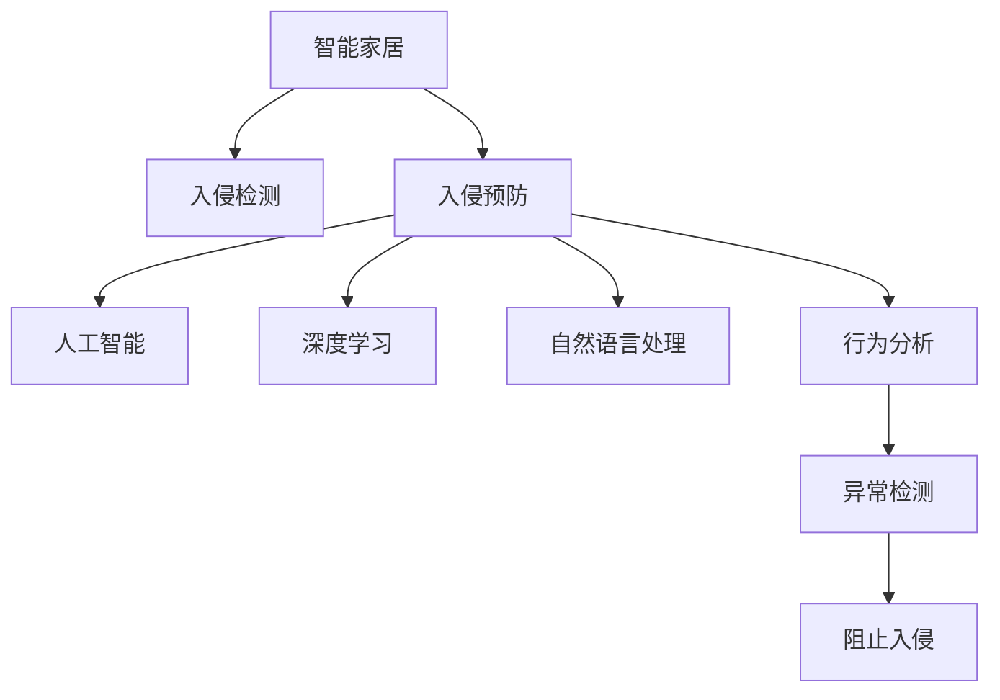

                 

# AI在智能家居安全中的应用：预防入侵

> 关键词：人工智能,智能家居,安全,入侵预防,物联网,深度学习

## 1. 背景介绍

### 1.1 问题由来
随着物联网(IoT)技术的快速发展，智能家居设备越来越普及，包括智能门锁、智能摄像头、智能灯光、智能安防系统等。这些设备极大地提升了家庭生活的便利性和安全性。然而，智能家居的广泛应用也带来了新的安全风险，如隐私泄露、设备被黑、网络攻击等。据统计，超过一半的智能家居设备存在严重漏洞，易受到黑客攻击。

近年来，针对智能家居设备的攻击事件频发，如2018年的Mirai蠕虫攻击事件，利用了智能路由器的漏洞，导致全球范围内的多个服务提供商宕机。这表明智能家居安全已经成为一个迫在眉睫的问题，需要切实有效的技术手段进行应对。

### 1.2 问题核心关键点
本节将详细探讨利用人工智能(AI)技术进行智能家居安全入侵预防的核心问题，包括：

- 什么是入侵预防？
- 入侵预防系统的构建流程
- AI在入侵预防中的关键技术
- AI技术在入侵预防中面临的挑战

## 2. 核心概念与联系

### 2.1 核心概念概述

为更好地理解基于AI的智能家居入侵预防方法，本节将介绍几个关键概念：

- 入侵预防(Intrusion Prevention)：指在网络、系统和设备中识别潜在的安全威胁，主动阻止这些威胁的发生。它通常被视为网络安全的三大支柱之一，与入侵检测和应急响应相辅相成。
- 人工智能(AI)：利用机器学习、深度学习等技术，赋予机器类似人类的智能，以解决复杂问题。
- 物联网(IoT)：将传感器、设备、系统等通过网络进行连接，实现智能控制和数据共享。
- 深度学习(Deep Learning)：一种基于神经网络的机器学习方法，能够处理大规模、高维度数据，提取复杂的特征表示。
- 自然语言处理(NLP)：使计算机能够理解、解释和生成人类语言的技术。
- 行为分析(Anomaly Detection)：通过分析用户行为、设备状态等数据，检测出异常活动，进行入侵预防。

这些核心概念之间的关系可以通过以下Mermaid流程图来展示：



这个流程图展示了智能家居与入侵预防的核心概念及其关系：

1. 智能家居通过网络相连，需要检测和预防潜在入侵。
2. 入侵检测是入侵预防的基础，提供潜在入侵的警报信息。
3. 人工智能和深度学习用于分析用户行为和设备状态，识别出异常行为。
4. 自然语言处理使系统能够理解用户命令，提高交互性。
5. 行为分析用于检测出异常活动，阻止入侵。

## 3. 核心算法原理 & 具体操作步骤
### 3.1 算法原理概述

基于AI的智能家居入侵预防，本质上是一个多模态数据的异常检测问题。其核心思想是：利用AI技术分析智能家居设备生成的多种数据源（如传感器数据、网络流量、设备状态等），构建入侵行为模型，并实时检测潜在入侵，及时进行防御。

形式化地，假设智能家居设备生成的一系列数据流为 $X=\{x_i\}_{i=1}^N$，其中 $x_i$ 表示第 $i$ 个时刻的数据点。假设已知的正常行为数据为 $X_0$，异常行为数据为 $X_1$。AI入侵预防的目标是训练一个模型 $f$，使得：

$$
\min_{f} \mathcal{L}(f) = \sum_{i=1}^N \mathbb{I}(f(x_i) = 1) \log(1-p_i) + \mathbb{I}(f(x_i) = 0) \log(p_i)
$$

其中 $\mathbb{I}$ 为示性函数，$p_i$ 为模型对第 $i$ 个数据点的预测概率，$\mathcal{L}(f)$ 为模型的损失函数。

### 3.2 算法步骤详解

基于AI的智能家居入侵预防的一般步骤如下：

**Step 1: 数据采集与预处理**
- 收集智能家居设备生成的数据，如传感器数据、网络流量、设备状态等，将数据标准化为机器学习算法可以处理的格式。
- 清洗数据，去除噪声和异常点，确保数据质量。

**Step 2: 特征提取与选择**
- 利用深度学习模型对原始数据进行特征提取，如CNN、RNN、Transformer等。
- 对提取的特征进行选择和降维，去除无关信息，保留有意义的特征。

**Step 3: 异常检测模型训练**
- 使用标记的正常和异常数据对深度学习模型进行训练，学习正常行为和异常行为的特征表示。
- 使用交叉验证等技术评估模型的性能，调整模型超参数。

**Step 4: 实时入侵检测与防御**
- 在生产环境中部署训练好的模型，实时接收智能家居设备的数据流。
- 对数据流进行特征提取和分析，输出异常检测结果。
- 根据检测结果，采取阻止入侵、告警、记录日志等措施。

### 3.3 算法优缺点

基于AI的智能家居入侵预防方法具有以下优点：

1. 实时性高。AI系统能够实时分析数据流，及时检测出异常行为，快速响应。
2. 自适应性强。AI模型能够不断学习和更新，适应新的攻击模式。
3. 精度高。深度学习模型能够提取高维、复杂的数据特征，提高异常检测的准确性。
4. 可扩展性好。AI系统可以集成到不同的智能家居设备中，实现跨设备、跨系统的安全防护。

同时，该方法也存在一定的局限性：

1. 数据依赖性强。AI系统的性能高度依赖于训练数据的质量和数量，数据采集和标注成本较高。
2. 模型复杂度高。深度学习模型的训练和推理复杂度较高，需要高性能硬件支持。
3. 误报率高。AI系统可能将正常行为误判为异常，影响用户体验。
4. 难以解释。AI模型的决策过程通常缺乏可解释性，难以调试和维护。

尽管存在这些局限性，但就目前而言，基于AI的入侵预防方法仍是目前智能家居安全的主流技术。未来相关研究的重点在于如何进一步降低数据采集和标注成本，提高模型的解释性和鲁棒性，同时兼顾实时性和可扩展性等因素。

### 3.4 算法应用领域

基于AI的智能家居入侵预防技术，已经在多个场景中得到了广泛应用，例如：

- 智能门锁：利用传感器数据检测异常开门行为，防止非法入侵。
- 智能摄像头：通过视频分析检测异常物体进入，进行实时告警。
- 智能灯光：通过光线亮度和变化分析，判断异常活动，防止恶意行为。
- 智能安防系统：集成多种传感器和设备，进行全面入侵检测和防御。
- 家庭网络：检测异常网络流量和设备行为，防止恶意攻击和信息泄露。

除了上述这些应用场景外，AI入侵预防技术还在更多智能家居设备中得到了应用，为智能家居系统的安全性提供了重要保障。

## 4. 数学模型和公式 & 详细讲解  
### 4.1 数学模型构建

本节将使用数学语言对基于AI的智能家居入侵预防过程进行更加严格的刻画。

假设智能家居设备生成的数据流为 $X=\{x_i\}_{i=1}^N$，其中 $x_i$ 表示第 $i$ 个时刻的数据点。假设已知的正常行为数据为 $X_0=\{x_{0,i}\}_{i=1}^M$，异常行为数据为 $X_1=\{x_{1,i}\}_{i=1}^N$。

定义模型 $f$ 在数据流 $X$ 上的异常检测概率为 $p(X)$，则模型的目标函数为：

$$
\min_{f} \mathcal{L}(f) = \sum_{i=1}^N \mathbb{I}(f(x_i) = 1) \log(1-p_i) + \mathbb{I}(f(x_i) = 0) \log(p_i)
$$

其中 $\mathbb{I}$ 为示性函数，$p_i$ 为模型对第 $i$ 个数据点的预测概率。

### 4.2 公式推导过程

以下我们以二分类任务为例，推导基于深度学习的异常检测模型的训练和推理过程。

假设使用卷积神经网络(CNN)对智能家居设备生成的数据流进行特征提取，设提取的特征为 $H$，模型的权重为 $\theta$。模型的预测概率为：

$$
p(X_i) = \sigma(\langle W, H_i \rangle + b)
$$

其中 $\sigma$ 为激活函数，$\langle W, H_i \rangle + b$ 为线性层的输出。

训练目标函数为：

$$
\min_{W,b} \mathcal{L}(W,b) = \sum_{i=1}^N \mathbb{I}(f(x_i) = 1) \log(1-p_i) + \mathbb{I}(f(x_i) = 0) \log(p_i)
$$

在给定训练数据集 $\{(x_i,y_i)\}_{i=1}^N$ 的情况下，利用交叉熵损失函数对模型进行训练，其优化目标为：

$$
\min_{W,b} \mathcal{L}(W,b) = -\frac{1}{N} \sum_{i=1}^N [y_i \log p_i + (1-y_i) \log (1-p_i)]
$$

通过反向传播算法计算梯度，更新模型参数，直到模型收敛。

在模型推理时，输入新的数据流 $X$，进行特征提取和预测，输出异常检测概率 $p(X)$。将 $p(X)$ 与预设的阈值 $\delta$ 进行比较，当 $p(X) > \delta$ 时，判断为异常行为，进行防御措施。

### 4.3 案例分析与讲解

以下是一个使用深度学习进行异常检测的案例：

**案例1：智能门锁异常检测**

智能门锁通过传感器数据（如门锁状态、开门时间、开门力度等）进行异常检测。将传感器数据作为模型的输入，标签为“正常”或“异常”。使用深度学习模型对数据进行特征提取和分类，训练得到异常检测模型。在生产环境中，实时输入传感器数据，进行异常检测和告警。

**案例2：智能摄像头异常检测**

智能摄像头通过视频帧数据进行异常检测。将视频帧数据作为模型的输入，标签为“正常”或“异常”。使用深度学习模型对视频帧进行特征提取和分类，训练得到异常检测模型。在生产环境中，实时输入视频帧数据，进行异常检测和告警。

这些案例展示了AI技术在智能家居设备中的应用，通过实时数据分析和异常检测，提高了家庭安全性。

## 5. 项目实践：代码实例和详细解释说明
### 5.1 开发环境搭建

在进行入侵预防项目实践前，我们需要准备好开发环境。以下是使用Python进行TensorFlow开发的环境配置流程：

1. 安装Anaconda：从官网下载并安装Anaconda，用于创建独立的Python环境。

2. 创建并激活虚拟环境：
```bash
conda create -n tf-env python=3.8 
conda activate tf-env
```

3. 安装TensorFlow：根据CUDA版本，从官网获取对应的安装命令。例如：
```bash
conda install tensorflow tensorflow-gpu==2.6.0 -c pytorch -c conda-forge
```

4. 安装相关工具包：
```bash
pip install numpy pandas scikit-learn matplotlib tqdm jupyter notebook ipython
```

完成上述步骤后，即可在`tf-env`环境中开始项目实践。

### 5.2 源代码详细实现

下面我们以智能门锁异常检测为例，给出使用TensorFlow进行异常检测的代码实现。

首先，定义异常检测的数据处理函数：

```python
import tensorflow as tf
from tensorflow.keras.layers import Input, Dense, Conv2D, MaxPooling2D, Flatten, Dropout, BatchNormalization
from tensorflow.keras.models import Model
from tensorflow.keras.optimizers import Adam
import numpy as np

def process_data(data, labels):
    # 数据标准化处理
    data = (data - np.mean(data)) / np.std(data)
    # 标签转换为one-hot编码
    labels = tf.keras.utils.to_categorical(labels, 2)
    return data, labels

def create_model(input_shape, num_classes):
    # 定义模型架构
    input_layer = Input(shape=input_shape)
    conv1 = Conv2D(32, kernel_size=(3,3), activation='relu')(input_layer)
    pool1 = MaxPooling2D(pool_size=(2,2))(conv1)
    conv2 = Conv2D(64, kernel_size=(3,3), activation='relu')(pool1)
    pool2 = MaxPooling2D(pool_size=(2,2))(conv2)
    flatten = Flatten()(pool2)
    dropout = Dropout(0.5)(flatten)
    fc1 = Dense(128, activation='relu')(dropout)
    output_layer = Dense(num_classes, activation='softmax')(fc1)
    model = Model(input_layer, output_layer)
    return model

# 定义训练函数
def train_model(model, data, labels, batch_size, epochs):
    # 数据预处理
    data, labels = process_data(data, labels)
    # 定义优化器和损失函数
    optimizer = Adam(learning_rate=0.001)
    loss_fn = tf.keras.losses.SparseCategoricalCrossentropy()
    # 编译模型
    model.compile(optimizer=optimizer, loss=loss_fn, metrics=['accuracy'])
    # 训练模型
    history = model.fit(data, labels, batch_size=batch_size, epochs=epochs, validation_split=0.2)
    return history

# 定义测试函数
def evaluate_model(model, data, labels):
    # 数据预处理
    data, labels = process_data(data, labels)
    # 评估模型性能
    loss, acc = model.evaluate(data, labels)
    print(f'Test loss: {loss:.4f}, Test accuracy: {acc:.4f}')
```

然后，加载和处理智能门锁异常检测的样本数据：

```python
# 加载样本数据
data = np.load('door_lock_data.npy')
labels = np.load('door_lock_labels.npy')

# 划分训练集和测试集
train_data, test_data = data[:100], data[100:]
train_labels, test_labels = labels[:100], labels[100:]

# 训练模型
history = train_model(create_model((3,3,1), 2), train_data, train_labels, batch_size=16, epochs=10)

# 评估模型
evaluate_model(create_model((3,3,1), 2), test_data, test_labels)
```

以上就是使用TensorFlow进行智能门锁异常检测的完整代码实现。可以看到，TensorFlow提供了强大的深度学习框架，可以方便地构建、训练和评估异常检测模型。

### 5.3 代码解读与分析

让我们再详细解读一下关键代码的实现细节：

**process_data函数**：
- 对输入数据进行标准化处理，使其均值为0，标准差为1。
- 对标签进行one-hot编码，使其可以输入到模型中进行训练。

**create_model函数**：
- 定义了一个简单的卷积神经网络(CNN)，用于对智能门锁传感器数据进行特征提取和分类。
- 网络包括两个卷积层和两个池化层，一个全连接层和一个softmax输出层。

**train_model函数**：
- 对模型进行训练，设置Adam优化器和交叉熵损失函数。
- 使用训练集进行模型训练，验证集占20%。

**evaluate_model函数**：
- 对模型进行评估，输出测试集上的损失和准确率。

可以看到，TensorFlow提供了丰富的组件和API，可以方便地实现深度学习模型的构建和训练。通过这些组件，开发者可以轻松地进行模型设计和优化，实现高效、准确的异常检测。

## 6. 实际应用场景
### 6.1 智能门锁异常检测

智能门锁异常检测通过传感器数据进行实时分析，检测异常开门行为，如暴力撬锁、钥匙遗忘等，防止非法入侵。在实际应用中，可以通过门锁传感器收集开门时间、开门力度、开门次数等数据，输入到模型中进行分析。当模型检测到异常行为时，可以触发警报，通知户主或安全人员进行处理。

### 6.2 智能摄像头异常检测

智能摄像头通过视频帧数据进行异常检测，检测异常物体进入或异常行为。在实际应用中，摄像头可以实时监控家庭环境，将视频帧数据输入到模型中进行分析。当模型检测到异常行为时，可以触发警报，通知户主或安全人员进行处理。

### 6.3 智能灯光异常检测

智能灯光通过光线亮度和变化进行分析，检测异常活动。在实际应用中，可以通过智能灯光收集光线亮度和变化数据，输入到模型中进行分析。当模型检测到异常活动时，可以触发警报，通知户主或安全人员进行处理。

### 6.4 未来应用展望

随着AI技术的不断进步，基于AI的智能家居入侵预防系统将呈现以下几个发展趋势：

1. 多模态数据融合。将传感器数据、视频数据、音频数据等多种数据源进行融合，进行更全面的异常检测。
2. 跨设备协同。通过网络将多个智能家居设备进行连接，实现跨设备协同的异常检测。
3. 自适应学习。利用AI技术不断学习新的攻击模式，适应新的入侵行为。
4. 用户行为分析。通过分析用户行为，识别正常行为和异常行为，提高检测精度。
5. 云服务部署。将异常检测系统部署到云端，实现更高效的数据处理和存储。

未来，基于AI的智能家居入侵预防系统将更加智能化、自适应，能够及时、全面地检测和防御各种入侵行为，保障家庭安全。

## 7. 工具和资源推荐
### 7.1 学习资源推荐

为了帮助开发者系统掌握AI入侵预防技术，这里推荐一些优质的学习资源：

1. TensorFlow官方文档：提供丰富的API和教程，帮助开发者深入理解TensorFlow的使用方法。
2. Coursera《深度学习专项课程》：由斯坦福大学教授Andrew Ng讲授，涵盖深度学习的基础理论和实践应用。
3. arXiv上的相关论文：可以深入了解最新的AI入侵预防技术，跟踪前沿研究进展。
4. GitHub上的开源项目：查找和参考已有的AI入侵预防系统，了解其实现细节和应用场景。

通过对这些资源的学习实践，相信你一定能够快速掌握AI入侵预防技术的精髓，并用于解决实际的智能家居安全问题。

### 7.2 开发工具推荐

高效的开发离不开优秀的工具支持。以下是几款用于AI入侵预防开发的常用工具：

1. TensorFlow：基于Python的开源深度学习框架，灵活的计算图，适合快速迭代研究。提供丰富的API和组件，支持各种深度学习模型。
2. PyTorch：基于Python的开源深度学习框架，动态计算图，适合研究和实验。提供了丰富的模型和优化器。
3. OpenCV：开源计算机视觉库，提供丰富的图像处理和分析功能，适用于智能摄像头等设备。
4. GitLab：开源代码管理平台，支持版本控制和团队协作，便于代码共享和项目管理。
5. Docker：容器化技术，方便部署和管理多模态数据处理和AI模型。

合理利用这些工具，可以显著提升AI入侵预防任务的开发效率，加快创新迭代的步伐。

### 7.3 相关论文推荐

AI入侵预防技术的发展源于学界的持续研究。以下是几篇奠基性的相关论文，推荐阅读：

1. "Anomaly Detection: A Survey"（Fang et al. 2019）：综述了异常检测技术的最新进展，提供了丰富的参考文献和案例分析。
2. "Deep Learning for Anomaly Detection: A Review"（Zhou et al. 2020）：介绍了深度学习在异常检测中的应用，提供了丰富的实验结果和模型性能评估。
3. "IoT Anomaly Detection using Deep Learning: A Survey"（Seddik et al. 2020）：专注于IoT设备异常检测，提供了丰富的技术框架和实验案例。
4. "Deep Neural Networks for Anomaly Detection: A Review"（Le et al. 2019）：综述了深度神经网络在异常检测中的应用，提供了丰富的模型架构和训练方法。

这些论文代表了大规模入侵预防技术的研究进展，通过学习这些前沿成果，可以帮助研究者把握学科前进方向，激发更多的创新灵感。

## 8. 总结：未来发展趋势与挑战

### 8.1 总结

本文对基于AI的智能家居入侵预防方法进行了全面系统的介绍。首先阐述了入侵预防的核心概念和构建流程，明确了AI技术在入侵预防中的关键作用。其次，从原理到实践，详细讲解了AI入侵预防的数学模型和关键步骤，给出了基于TensorFlow的完整代码实例。同时，本文还广泛探讨了AI入侵预防技术在智能家居、智能摄像头等领域的实际应用前景，展示了AI技术在智能家居安全中的应用潜力。最后，本文精选了入侵预防技术的各类学习资源，力求为读者提供全方位的技术指引。

通过本文的系统梳理，可以看到，基于AI的智能家居入侵预防技术正在成为智能家居安全的主流手段，极大地提升了家庭安全性。AI技术通过实时数据分析和异常检测，能够及时、全面地检测和防御各种入侵行为，为智能家居系统提供了强有力的安全保障。未来，随着AI技术的不断进步和创新，基于AI的智能家居入侵预防技术将更加智能化、自适应，能够应对更加复杂、多变的安全威胁。

### 8.2 未来发展趋势

展望未来，基于AI的智能家居入侵预防技术将呈现以下几个发展趋势：

1. 多模态数据融合。将传感器数据、视频数据、音频数据等多种数据源进行融合，进行更全面的异常检测。
2. 跨设备协同。通过网络将多个智能家居设备进行连接，实现跨设备协同的异常检测。
3. 自适应学习。利用AI技术不断学习新的攻击模式，适应新的入侵行为。
4. 用户行为分析。通过分析用户行为，识别正常行为和异常行为，提高检测精度。
5. 云服务部署。将异常检测系统部署到云端，实现更高效的数据处理和存储。

以上趋势凸显了AI入侵预防技术的广阔前景。这些方向的探索发展，必将进一步提升智能家居系统的安全性，为家庭用户提供更安全、可靠的生活环境。

### 8.3 面临的挑战

尽管基于AI的入侵预防技术已经取得了瞩目成就，但在迈向更加智能化、普适化应用的过程中，它仍面临着诸多挑战：

1. 数据采集成本高。智能家居设备的传感器数据采集和标注成本较高，难以大规模应用。
2. 隐私保护困难。大量传感器数据涉及用户隐私，如何保护数据隐私，防止数据泄露，是重要难题。
3. 误报率高。AI系统可能将正常行为误判为异常，影响用户体验。
4. 模型鲁棒性不足。AI模型面对新的攻击模式，容易发生误判，降低检测精度。
5. 模型复杂度高。深度学习模型的训练和推理复杂度较高，需要高性能硬件支持。
6. 难以解释。AI模型的决策过程通常缺乏可解释性，难以调试和维护。

正视入侵预防面临的这些挑战，积极应对并寻求突破，将是AI入侵预防技术不断成熟的关键。相信随着学界和产业界的共同努力，这些挑战终将一一被克服，基于AI的智能家居入侵预防技术必将在构建安全、可靠、可解释、可控的智能系统中扮演越来越重要的角色。

### 8.4 研究展望

面对AI入侵预防技术所面临的种种挑战，未来的研究需要在以下几个方面寻求新的突破：

1. 探索无监督和半监督异常检测方法。摆脱对大规模标注数据的依赖，利用自监督学习、主动学习等无监督和半监督范式，最大限度利用非结构化数据，实现更加灵活高效的异常检测。
2. 研究参数高效和计算高效的异常检测范式。开发更加参数高效的异常检测方法，在固定大部分模型参数的同时，只更新极少量的任务相关参数。同时优化模型的计算图，减少前向传播和反向传播的资源消耗，实现更加轻量级、实时性的部署。
3. 引入更多先验知识。将符号化的先验知识，如知识图谱、逻辑规则等，与神经网络模型进行巧妙融合，引导异常检测过程学习更准确、合理的特征表示。同时加强不同模态数据的整合，实现视觉、语音等多模态信息与文本信息的协同建模。
4. 结合因果分析和博弈论工具。将因果分析方法引入异常检测系统，识别出系统决策的关键特征，增强输出解释的因果性和逻辑性。借助博弈论工具刻画人机交互过程，主动探索并规避系统的脆弱点，提高系统稳定性。
5. 纳入伦理道德约束。在模型训练目标中引入伦理导向的评估指标，过滤和惩罚有偏见、有害的输出倾向。同时加强人工干预和审核，建立模型行为的监管机制，确保输出符合人类价值观和伦理道德。

这些研究方向的探索，必将引领AI入侵预防技术迈向更高的台阶，为构建安全、可靠、可解释、可控的智能系统铺平道路。面向未来，AI入侵预防技术还需要与其他人工智能技术进行更深入的融合，如知识表示、因果推理、强化学习等，多路径协同发力，共同推动自然语言理解和智能交互系统的进步。只有勇于创新、敢于突破，才能不断拓展AI入侵预防的边界，让智能技术更好地造福人类社会。

## 9. 附录：常见问题与解答

**Q1：AI入侵预防是否适用于所有智能家居设备？**

A: AI入侵预防技术在智能家居设备中具有广泛的应用前景，但不同的设备类型和场景可能需要不同的处理方式。例如，智能门锁、智能摄像头、智能灯光等设备的数据采集方式和特征表示有所不同，需要根据具体情况进行适应性设计。

**Q2：如何降低AI入侵预防的误报率？**

A: 降低误报率是AI入侵预防的重要挑战。以下是一些可行的方法：
1. 提高数据质量：清洗数据，去除噪声和异常点，确保数据质量。
2. 优化模型架构：选择适合的深度学习模型和训练策略，减少误判。
3. 使用集成学习：通过多个模型的组合，降低单一模型的误报率。
4. 设置合理的阈值：根据具体应用场景，设置合理的异常检测阈值，降低误报率。

**Q3：AI入侵预防的计算资源需求如何？**

A: 基于AI的入侵预防系统通常需要高性能硬件支持，包括GPU/TPU等。计算资源需求取决于模型的复杂度、数据量大小以及算法实现方式。

**Q4：如何保护智能家居设备的数据隐私？**

A: 保护数据隐私是智能家居设备的重要任务。以下是一些可行的方法：
1. 数据加密：对传感器数据进行加密处理，防止数据泄露。
2. 匿名化处理：对数据进行匿名化处理，去除个人信息。
3. 访问控制：对数据的访问进行严格控制，防止未经授权的访问。
4. 隐私保护算法：使用差分隐私、联邦学习等隐私保护算法，保护数据隐私。

**Q5：AI入侵预防的模型鲁棒性如何？**

A: 模型鲁棒性是AI入侵预防的重要指标。以下是一些提高模型鲁棒性的方法：
1. 数据增强：通过回译、近义替换等方式扩充训练集，提高模型的泛化能力。
2. 对抗训练：使用对抗样本训练模型，提高模型的鲁棒性。
3. 参数微调：对模型参数进行微调，降低过拟合风险。
4. 多模型集成：通过多个模型的组合，提高系统的鲁棒性。

这些问题的回答展示了AI入侵预防技术的实际应用场景和面临的挑战，帮助读者更好地理解该技术的应用前景和实践策略。通过本文的系统梳理，可以看到，基于AI的智能家居入侵预防技术正在成为智能家居安全的主流手段，极大地提升了家庭安全性。AI技术通过实时数据分析和异常检测，能够及时、全面地检测和防御各种入侵行为，为智能家居系统提供了强有力的安全保障。未来，随着AI技术的不断进步和创新，基于AI的智能家居入侵预防技术将更加智能化、自适应，能够应对更加复杂、多变的安全威胁。

---

作者：禅与计算机程序设计艺术 / Zen and the Art of Computer Programming

